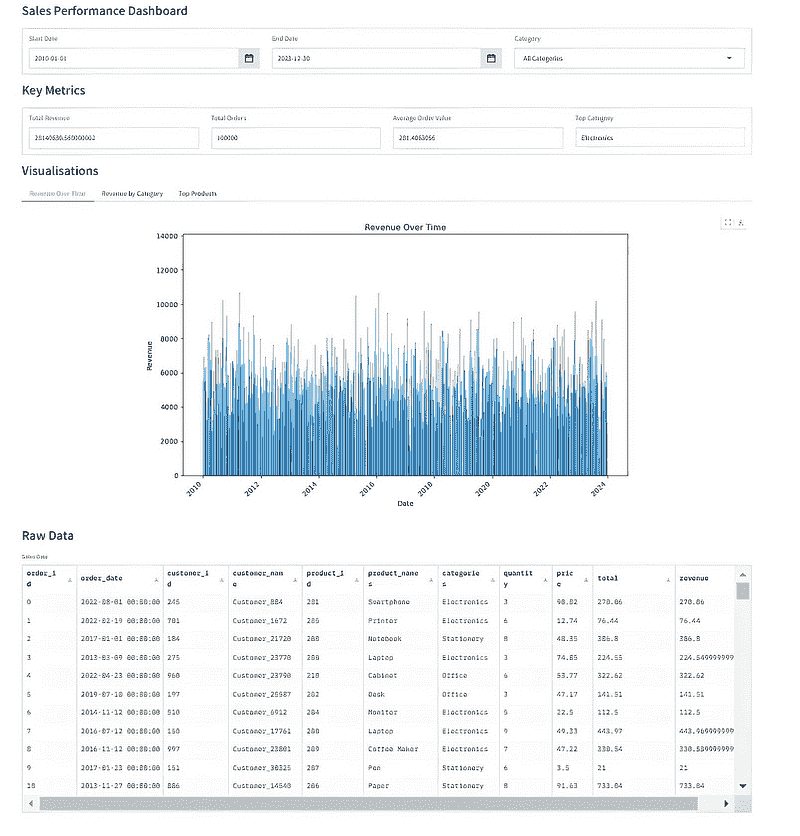

# 使用 Python 和 Gradio 构建现代仪表板

> [`towardsdatascience.com/building-a-modern-dashboard-with-python-and-gradio/`](https://towardsdatascience.com/building-a-modern-dashboard-with-python-and-gradio/)

<mdspan datatext="el1749076278557" class="mdspan-comment">这是关于使用最新的基于 Python 的 GUI 开发工具 Streamlit、Gradio 和 Taipy 开发数据仪表板的短系列中的第二篇。</mdspan>

每个仪表板的数据源将相同，但存储在不同的格式中。尽可能的，我还会尝试使每个工具的实际仪表板布局彼此相似，并具有相同的功能。

在本系列的第一个部分，我创建了一个 Streamlit 版本的仪表板，它从本地的 PostgreSQL 数据库中检索数据。你可以在这里查看那篇文章[这里](https://towardsdatascience.com/building-a-data-dashboard-9441db646697/)。

这次，我们正在探索使用 Gradio 库。

这个仪表板的数据将存储在本地 CSV 文件中，Pandas 将是我们的主要数据处理引擎。

> 如果你想快速演示这个应用程序，我已经将它部署到了 HuggingFace Spaces。你可以使用下面的链接运行它，但请注意，由于 HuggingFace 环境中已知的错误，两个输入日期选择弹出窗口无法工作。这只适用于部署到 HF 的应用程序，你仍然可以手动更改日期。本地运行应用程序没有这个问题。

[**HuggingFace 上的仪表板演示**](https://huggingface.co/spaces/taupirho/data-dashboard)

## 什么是 Gradio？

Gradio 是一个开源的 Python 包，简化了为机器学习模型、API 或任何 Python 函数构建演示或 Web 应用程序的过程。有了它，你可以创建演示或 Web 应用程序，而无需 JavaScript、CSS 或 Web 托管经验。只需编写几行 Python 代码，你就可以解锁 Gradio 的力量，并无缝地向更广泛的受众展示你的机器学习模型。

Gradio 通过提供一个直观的框架来简化开发过程，消除了从头开始构建用户界面相关的复杂性。无论你是机器学习开发者、研究人员还是爱好者，Gradio 都允许你创建美观且交互式的演示，从而增强你对机器学习模型的理解和可访问性。

这个开源的 Python 包帮助你弥合你的机器学习专业知识与更广泛的受众之间的差距，使你的模型易于访问和操作。

## 我们将开发什么

我们正在开发一个数据仪表板。我们的源数据将是一个包含 10 万个合成销售记录的单一 CSV 文件。

实际的数据来源并不***那么***重要。它可能只是一个文本文件、一个 Excel 文件、SQLite 或任何你可以连接的数据库。

这就是我们的最终仪表板将看起来像的样子。



图片由作者提供

有四个主要部分。

+   顶行允许用户使用日期选择器和下拉列表分别选择特定的起始和结束日期以及/或产品类别。

+   第二行——关键指标——显示了所选数据的顶层摘要。

+   可视化部分允许用户选择三个图表中的一个来显示输入数据集。

+   原始数据部分正是其名称所表示的那样。所选数据的这种表格表示有效地显示了底层 CSV 数据文件的快照。

使用仪表板很简单。最初，会显示整个数据集的统计数据。然后，用户可以使用显示顶部的三个筛选字段来缩小数据焦点。图表、关键指标和原始数据部分会动态更新，以反映用户在筛选字段中的选择。

## 基础数据

正如之前提到的，仪表板的源数据包含在一个单独的逗号分隔值（CSV）文件中。数据由 10 万个合成销售相关记录组成。以下是文件的前十条记录，以便您了解其外观。

```py
+----------+------------+------------+----------------+------------+---------------+------------+----------+-------+--------------------+
| order_id | order_date | customer_id| customer_name  | product_id | product_names | categories | quantity | price | total              |
+----------+------------+------------+----------------+------------+---------------+------------+----------+-------+--------------------+
| 0        | 01/08/2022 | 245        | Customer_884   | 201        | Smartphone    | Electronics| 3        | 90.02 | 270.06             |
| 1        | 19/02/2022 | 701        | Customer_1672  | 205        | Printer       | Electronics| 6        | 12.74 | 76.44              |
| 2        | 01/01/2017 | 184        | Customer_21720 | 208        | Notebook      | Stationery | 8        | 48.35 | 386.8              |
| 3        | 09/03/2013 | 275        | Customer_23770 | 200        | Laptop        | Electronics| 3        | 74.85 | 224.55             |
| 4        | 23/04/2022 | 960        | Customer_23790 | 210        | Cabinet       | Office     | 6        | 53.77 | 322.62             |
| 5        | 10/07/2019 | 197        | Customer_25587 | 202        | Desk          | Office     | 3        | 47.17 | 141.51             |
| 6        | 12/11/2014 | 510        | Customer_6912  | 204        | Monitor       | Electronics| 5        | 22.5  | 112.5              |
| 7        | 12/07/2016 | 150        | Customer_17761 | 200        | Laptop        | Electronics| 9        | 49.33 | 443.97             |
| 8        | 12/11/2016 | 997        | Customer_23801 | 209        | Coffee Maker  | Electronics| 7        | 47.22 | 330.54             |
| 9        | 23/01/2017 | 151        | Customer_30325 | 207        | Pen           | Stationery | 6        | 3.5   | 21                 |
+----------+------------+------------+----------------+------------+---------------+------------+----------+-------+--------------------+
```

以下是一些 Python 代码，您可以使用这些代码生成类似的数据集。请确保首先安装了 NumPy 和 Pandas 库。

```py
# generate the 100K record CSV file
#
import polars as pl
import numpy as np
from datetime import datetime, timedelta

def generate(nrows: int, filename: str):
    names = np.asarray(
        [
            "Laptop",
            "Smartphone",
            "Desk",
            "Chair",
            "Monitor",
            "Printer",
            "Paper",
            "Pen",
            "Notebook",
            "Coffee Maker",
            "Cabinet",
            "Plastic Cups",
        ]
    )
    categories = np.asarray(
        [
            "Electronics",
            "Electronics",
            "Office",
            "Office",
            "Electronics",
            "Electronics",
            "Stationery",
            "Stationery",
            "Stationery",
            "Electronics",
            "Office",
            "Sundry",
        ]
    )
    product_id = np.random.randint(len(names), size=nrows)
    quantity = np.random.randint(1, 11, size=nrows)
    price = np.random.randint(199, 10000, size=nrows) / 100
    # Generate random dates between 2010-01-01 and 2023-12-31
    start_date = datetime(2010, 1, 1)
    end_date = datetime(2023, 12, 31)
    date_range = (end_date - start_date).days
    # Create random dates as np.array and convert to string format
    order_dates = np.array([(start_date + timedelta(days=np.random.randint(0, date_range))).strftime('%Y-%m-%d') for _ in range(nrows)])
    # Define columns
    columns = {
        "order_id": np.arange(nrows),
        "order_date": order_dates,
        "customer_id": np.random.randint(100, 1000, size=nrows),
        "customer_name": [f"Customer_{i}" for i in np.random.randint(2**15, size=nrows)],
        "product_id": product_id + 200,
        "product_names": names[product_id],
        "categories": categories[product_id],
        "quantity": quantity,
        "price": price,
        "total": price * quantity,
    }
    # Create Polars DataFrame and write to CSV with explicit delimiter
    df = pl.DataFrame(columns)
    df.write_csv(filename, separator=',',include_header=True)  # Ensure comma is used as the delimiter

# Generate 100,000 rows of data with random order_date and save to CSV
generate(100_000, "/mnt/d/sales_data/sales_data.csv")
```

## 安装和使用 Gradio

使用**pip**安装 Gradio 很容易，但为了编码，最佳实践是为所有工作设置一个单独的 Python 环境。我为此使用 Miniconda，但请随意使用适合您工作习惯的方法。

> *如果您想走 conda 路线并且还没有安装，您必须首先安装 Miniconda（推荐）或 Anaconda。*
> 
> *请注意，在撰写本文时，* Gradio 至少需要安装 Python 3.8 才能正确工作。

环境创建完成后，使用**‘activate’**命令切换到该环境，然后运行**‘pip install’**来安装所需的 Python 库。

```py
#create our test environment
(base) C:\Users\thoma>conda create -n gradio_dashboard python=3.12 -y

# Now activate it
(base) C:\Users\thoma>conda activate gradio_dashboard

# Install python libraries, etc ...
(gradio_dashboard) C:\Users\thoma>pip install gradio pandas matplotlib cachetools
```

**Streamlit 与 Gradio 的关键区别**

正如我在本文中将要展示的，使用 Streamlit 和 Gradio 可以产生非常相似的数据仪表板。然而，它们在几个关键方面有着不同的理念。

**重点**

+   Gradio 专注于为机器学习模型创建界面，而 Streamlit 则更多是为通用数据应用和可视化而设计。

**易用性**

+   Gradio 以其简洁性和快速原型设计能力而闻名，这使得初学者更容易使用。Streamlit 提供了更多高级功能和定制选项，这可能需要更陡峭的学习曲线。

**交互性**

+   Streamlit 使用响应式编程模型，其中任何输入变化都会触发整个脚本的重新运行，立即更新所有组件。默认情况下，Gradio 仅在用户点击提交按钮时更新，尽管它可以配置为实时更新。

**定制**

+   Gradio 专注于预构建组件，以便快速展示 AI 模型。Streamlit 提供了更广泛的定制选项和灵活性，适用于复杂项目。

**部署**

+   部署了 Streamlit 和 Gradio 应用后，我认为部署 Streamlit 应用比部署 Gradio 应用更容易。在 Streamlit 中，可以通过 Streamlit 社区云的单个点击完成部署。此功能内置在您创建的任何 Streamlit 应用中。Gradio 提供使用 Hugging Face Spaces 进行部署，但这需要更多工作。尽管如此，这两种方法都不特别复杂。

**用例**

Streamlit 在创建以数据为中心的应用和复杂项目的交互式仪表板方面表现出色。Gradio 非常适合快速展示机器学习模型和构建更简单的应用。

**Gradio 仪表板代码**

我将逐步分解代码，并在进行过程中解释每个部分。

我们首先导入所需的外部库，并将整个数据集从 CSV 文件加载到 Pandas DataFrame 中。

```py
import gradio as gr
import pandas as pd
import matplotlib.pyplot as plt
import datetime
import warnings
import os
import tempfile
from cachetools import cached, TTLCache

warnings.filterwarnings("ignore", category=FutureWarning, module="seaborn")

# ------------------------------------------------------------------
# 1) Load CSV data once
# ------------------------------------------------------------------
csv_data = None

def load_csv_data():
    global csv_data

    # Optional: specify column dtypes if known; adjust as necessary
    dtype_dict = {
        "order_id": "Int64",
        "customer_id": "Int64",
        "product_id": "Int64",
        "quantity": "Int64",
        "price": "float",
        "total": "float",
        "customer_name": "string",
        "product_names": "string",
        "categories": "string"
    }

    csv_data = pd.read_csv(
        "d:/sales_data/sales_data.csv",
        parse_dates=["order_date"],
        dayfirst=True,      # if your dates are DD/MM/YYYY format
        low_memory=False,
        dtype=dtype_dict
    )

load_csv_data()
```

接下来，我们配置一个最大项数为 128 项，过期时间为 300 秒的生存时间缓存。这用于存储昂贵函数调用的结果并加快重复查找。

**get_unique_categories**函数返回从`csv_data` DataFrame 中提取的唯一、清理过的（大写）类别列表，并将结果缓存以提高访问速度。

**get_date_range**函数返回数据集中的最小和最大订单日期，或者如果数据不可用，则返回 None。

**filter_data**函数根据指定的日期范围和可选的类别过滤 csv_data DataFrame，返回过滤后的 DataFrame。

**get_dashboard_stats**函数检索给定筛选器的摘要指标——总收入、总订单、平均订单价值和顶级类别。内部使用`filter_data()`函数来限定数据集，然后计算这些关键统计数据。

**get_data_for_table**函数返回一个按**order_id**和**order_date**排序的详细销售数据 DataFrame，包括每个销售的额外收入。

**get_plot_data**函数通过按时间分组收入来格式化数据，以生成一个图表。

**get_revenue_by_category**函数按类别汇总并返回指定日期范围内按收入排序的收入，按类别排序。

**get_top_products**函数根据收入、日期范围和类别返回前 10 个产品。

根据方向参数，**create_matplotlib_figure**函数从数据生成条形图并将其保存为图像文件，可以是垂直或水平。

```py
cache = TTLCache(maxsize=128, ttl=300)

@cached(cache)
def get_unique_categories():
    global csv_data
    if csv_data is None:
        return []
    cats = sorted(csv_data['categories'].dropna().unique().tolist())
    cats = [cat.capitalize() for cat in cats]
    return cats

def get_date_range():
    global csv_data
    if csv_data is None or csv_data.empty:
        return None, None
    return csv_data['order_date'].min(), csv_data['order_date'].max()

def filter_data(start_date, end_date, category):
    global csv_data

    if isinstance(start_date, str):
        start_date = datetime.datetime.strptime(start_date, '%Y-%m-%d').date()
    if isinstance(end_date, str):
        end_date = datetime.datetime.strptime(end_date, '%Y-%m-%d').date()

    df = csv_data.loc[
        (csv_data['order_date'] >= pd.to_datetime(start_date)) &
        (csv_data['order_date'] <= pd.to_datetime(end_date))
    ].copy()

    if category != "All Categories":
        df = df.loc[df['categories'].str.capitalize() == category].copy()

    return df

def get_dashboard_stats(start_date, end_date, category):
    df = filter_data(start_date, end_date, category)
    if df.empty:
        return (0, 0, 0, "N/A")

    df['revenue'] = df['price'] * df['quantity']
    total_revenue = df['revenue'].sum()
    total_orders = df['order_id'].nunique()
    avg_order_value = total_revenue / total_orders if total_orders else 0

    cat_revenues = df.groupby('categories')['revenue'].sum().sort_values(ascending=False)
    top_category = cat_revenues.index[0] if not cat_revenues.empty else "N/A"

    return (total_revenue, total_orders, avg_order_value, top_category.capitalize())

def get_data_for_table(start_date, end_date, category):
    df = filter_data(start_date, end_date, category)
    if df.empty:
        return pd.DataFrame()

    df = df.sort_values(by=["order_id", "order_date"], ascending=[True, False]).copy()

    columns_order = [
        "order_id", "order_date", "customer_id", "customer_name",
        "product_id", "product_names", "categories", "quantity",
        "price", "total"
    ]
    columns_order = [col for col in columns_order if col in df.columns]
    df = df[columns_order].copy()

    df['revenue'] = df['price'] * df['quantity']
    return df

def get_plot_data(start_date, end_date, category):
    df = filter_data(start_date, end_date, category)
    if df.empty:
        return pd.DataFrame()
    df['revenue'] = df['price'] * df['quantity']
    plot_data = df.groupby(df['order_date'].dt.date)['revenue'].sum().reset_index()
    plot_data.rename(columns={'order_date': 'date'}, inplace=True)
    return plot_data

def get_revenue_by_category(start_date, end_date, category):
    df = filter_data(start_date, end_date, category)
    if df.empty:
        return pd.DataFrame()
    df['revenue'] = df['price'] * df['quantity']
    cat_data = df.groupby('categories')['revenue'].sum().reset_index()
    cat_data = cat_data.sort_values(by='revenue', ascending=False)
    return cat_data

def get_top_products(start_date, end_date, category):
    df = filter_data(start_date, end_date, category)
    if df.empty:
        return pd.DataFrame()
    df['revenue'] = df['price'] * df['quantity']
    prod_data = df.groupby('product_names')['revenue'].sum().reset_index()
    prod_data = prod_data.sort_values(by='revenue', ascending=False).head(10)
    return prod_data

def create_matplotlib_figure(data, x_col, y_col, title, xlabel, ylabel, orientation='v'):
    plt.figure(figsize=(10, 6))
    if data.empty:
        plt.text(0.5, 0.5, 'No data available', ha='center', va='center')
    else:
        if orientation == 'v':
            plt.bar(data[x_col], data[y_col])
            plt.xticks(rotation=45, ha='right')
        else:
            plt.barh(data[x_col], data[y_col])
            plt.gca().invert_yaxis() 

    plt.title(title)
    plt.xlabel(xlabel)
    plt.ylabel(ylabel)
    plt.tight_layout()

    with tempfile.NamedTemporaryFile(delete=False, suffix=".png") as tmpfile:
        plt.savefig(tmpfile.name)
    plt.close()
    return tmpfile.name
```

**update_dashboard**函数通过调用`get_dashboard_stats`函数检索关键销售统计数据（总收入、总订单、平均订单价值和顶级类别）。它收集三个不同可视化（随时间变化的收入、按类别划分的收入和顶级产品）的数据，然后使用`create_matplotlib_figure`生成图表。它准备并返回一个数据表（通过`get_data_for_table()`函数），以及所有生成的图表和统计数据，以便在仪表板中显示。

**create_dashboard** 函数设置日期边界（最小和最大日期）并建立初始默认筛选值。它使用 Gradio 构建一个用户界面（UI），包括日期选择器、类别下拉菜单、关键指标显示、图表标签页和数据表。然后它连接筛选器，以便更改任何一个都会触发对 **update_dashboard** 函数的调用，确保仪表板视觉和指标始终与所选筛选器保持同步。最后，它返回作为网络应用程序启动的组装好的 Gradio 界面。

```py
def update_dashboard(start_date, end_date, category):
    total_revenue, total_orders, avg_order_value, top_category = get_dashboard_stats(start_date, end_date, category)

    # Generate plots
    revenue_data = get_plot_data(start_date, end_date, category)
    category_data = get_revenue_by_category(start_date, end_date, category)
    top_products_data = get_top_products(start_date, end_date, category)

    revenue_over_time_path = create_matplotlib_figure(
        revenue_data, 'date', 'revenue',
        "Revenue Over Time", "Date", "Revenue"
    )
    revenue_by_category_path = create_matplotlib_figure(
        category_data, 'categories', 'revenue',
        "Revenue by Category", "Category", "Revenue"
    )
    top_products_path = create_matplotlib_figure(
        top_products_data, 'product_names', 'revenue',
        "Top Products", "Revenue", "Product Name", orientation='h'
    )

    # Data table
    table_data = get_data_for_table(start_date, end_date, category)

    return (
        revenue_over_time_path,
        revenue_by_category_path,
        top_products_path,
        table_data,
        total_revenue,
        total_orders,
        avg_order_value,
        top_category
    )

def create_dashboard():
    min_date, max_date = get_date_range()
    if min_date is None or max_date is None:
        min_date = datetime.datetime.now()
        max_date = datetime.datetime.now()

    default_start_date = min_date
    default_end_date = max_date

    with gr.Blocks(css="""
        footer {display: none !important;}
        .tabs {border: none !important;}  
        .gr-plot {border: none !important; box-shadow: none !important;}
    """) as dashboard:

        gr.Markdown("# Sales Performance Dashboard")

        # Filters row
        with gr.Row():
            start_date = gr.DateTime(
                label="Start Date",
                value=default_start_date.strftime('%Y-%m-%d'),
                include_time=False,
                type="datetime"
            )
            end_date = gr.DateTime(
                label="End Date",
                value=default_end_date.strftime('%Y-%m-%d'),
                include_time=False,
                type="datetime"
            )
            category_filter = gr.Dropdown(
                choices=["All Categories"] + get_unique_categories(),
                label="Category",
                value="All Categories"
            )

        gr.Markdown("# Key Metrics")

        # Stats row
        with gr.Row():
            total_revenue = gr.Number(label="Total Revenue", value=0)
            total_orders = gr.Number(label="Total Orders", value=0)
            avg_order_value = gr.Number(label="Average Order Value", value=0)
            top_category = gr.Textbox(label="Top Category", value="N/A")

        gr.Markdown("# Visualisations")
        # Tabs for Plots
        with gr.Tabs():
            with gr.Tab("Revenue Over Time"):
                revenue_over_time_image = gr.Image(label="Revenue Over Time", container=False)
            with gr.Tab("Revenue by Category"):
                revenue_by_category_image = gr.Image(label="Revenue by Category", container=False)
            with gr.Tab("Top Products"):
                top_products_image = gr.Image(label="Top Products", container=False)

        gr.Markdown("# Raw Data")
        # Data Table (below the plots)
        data_table = gr.DataFrame(
            label="Sales Data",
            type="pandas",
            interactive=False
        )

        # When filters change, update everything
        for f in [start_date, end_date, category_filter]:
            f.change(
                fn=lambda s, e, c: update_dashboard(s, e, c),
                inputs=[start_date, end_date, category_filter],
                outputs=[
                    revenue_over_time_image, 
                    revenue_by_category_image, 
                    top_products_image,
                    data_table,
                    total_revenue, 
                    total_orders,
                    avg_order_value, 
                    top_category
                ]
            )

        # Initial load
        dashboard.load(
            fn=lambda: update_dashboard(default_start_date, default_end_date, "All Categories"),
            outputs=[
                revenue_over_time_image, 
                revenue_by_category_image, 
                top_products_image,
                data_table,
                total_revenue, 
                total_orders,
                avg_order_value, 
                top_category
            ]
        )

    return dashboard

if __name__ == "__main__":
    dashboard = create_dashboard()
    dashboard.launch(share=False)
```

### 运行程序

创建一个 Python 文件，例如 gradio_test.py，并将所有上述代码片段插入其中。保存它，并按如下方式运行，

```py
(gradio_dashboard) $ python gradio_test.py

* Running on local URL:  http://127.0.0.1:7860

To create a public link, set `share=True` in `launch()`.
```

点击显示的本地 URL，仪表板将在您的浏览器中全屏打开。

## 摘要

本文提供了使用 Gradio 和 CSV 文件作为其数据源构建交互式销售绩效仪表板的全面指南。

Gradio 是一个基于 Python 的现代开源框架，简化了数据驱动仪表板和 GUI 应用程序的创建。我开发的仪表板允许用户通过日期范围和产品类别筛选数据，查看关键指标，如总收入和表现最佳类别，探索可视化，如收入趋势和最佳产品，并通过分页导航原始数据。

我还提到了使用 Gradio 和 Streamlit 开发可视化工具之间的关键区别，Streamlit 是另一个流行的前端 Python 库。

本指南提供了一个 Gradio 数据仪表板的全面实现，涵盖了从创建样本数据到开发用于查询数据、生成图表和处理用户输入的 Python 函数的整个过程。这种逐步方法展示了如何利用 Gradio 的功能来创建用户友好且动态的仪表板，非常适合想要构建交互式数据应用的数据工程师和科学家。

虽然我使用了 CSV 文件作为我的数据，但将代码修改为使用其他数据源，例如 SQLite 这样的关系型数据库管理系统（RDBMS），应该是简单的。例如，在我关于使用 Streamlit 创建类似仪表板的系列文章的另一篇文章中，数据源是一个 PostgreSQL 数据库。
