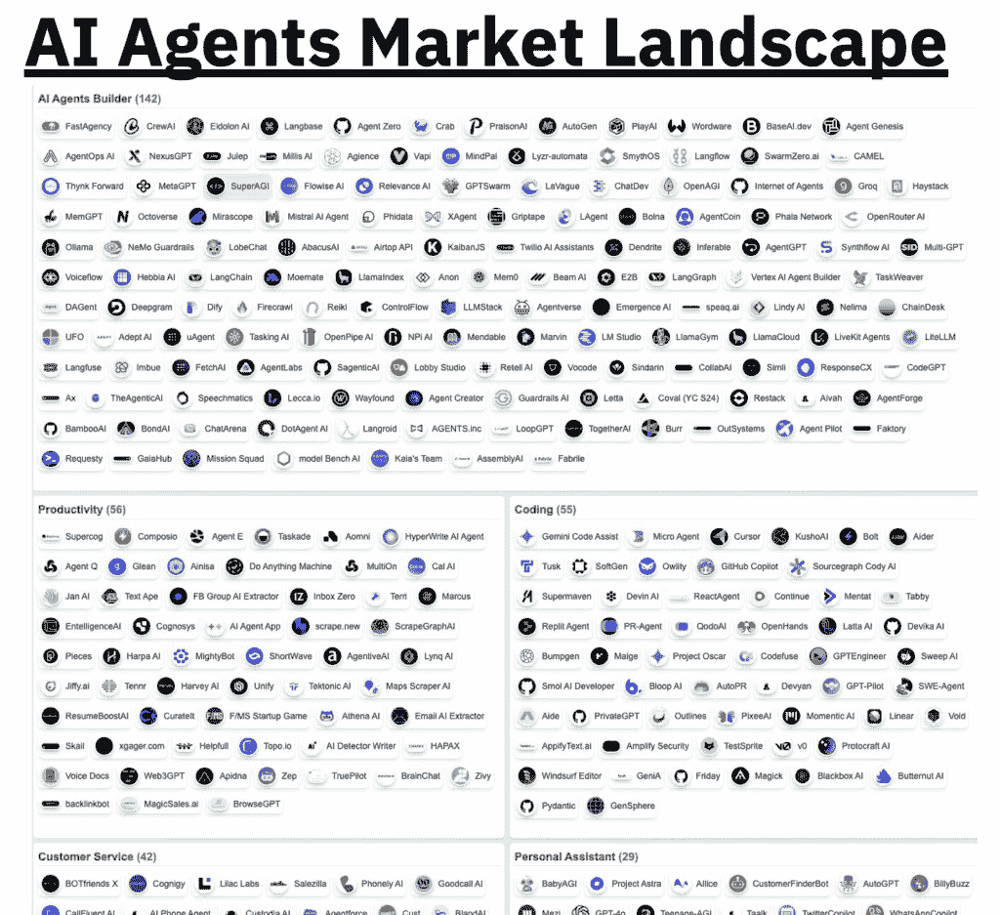

# 如何设计我的第一个 AI 代理

> [`towardsdatascience.com/how-to-design-my-first-ai-agent/`](https://towardsdatascience.com/how-to-design-my-first-ai-agent/)

由大型语言模型（LLMs）驱动的**AI 代理**自主系统正在迅速改变我们构建软件和解决问题的方法。它们曾经仅限于狭窄的聊天机器人用例或内容生成，现在正协调工具、对结构化数据进行推理，并在客户支持、软件工程、金融分析和科学研究等领域的自动化工作流程中发挥作用。

从研究到工业应用，AI 代理和多代理协作不仅显示出巨大的潜力，而且具有自动化和加速生产力、简化许多日常任务的力量。在多代理协作（AutoGPT、LangGraph）、工具增强推理（ReAct、Toolformer）和结构化提示（Pydantic-AI、Guardrails）方面的最新工作，展示了这一范式的日益成熟以及它将如何快速改变软件开发以及其他相关领域。

AI 代理正在演变成为**通用助手**，能够规划、推理并与 API 和数据交互——比我们想象的要快。所以，如果你计划扩大你的职业目标，成为 AI 工程师、数据科学家甚至软件工程师，考虑一下，构建 AI 代理可能已经成为你课程中的必备内容。

在这篇文章中，我将带你了解：

+   如何**选择正确的 LLM**而不会失去理智（或令牌）

+   根据你的感觉（和架构）选择哪些工具

+   如何确保你的代理**不会陷入混乱的幻觉**

## 聪明地选择你的模型（或模型）

是的，我知道。你迫不及待地想要开始编码。也许你已经打开了 Colab，导入了 LangChain，并在*llm.predict()*中低声说出甜美的提示。但等等，在你以一种不稳定的方式进入原型之前，让我们谈谈一些真正重要的事情：有目的地选择你的 LLM（是的，真的！）。

你的模型选择是基础性的。它决定了你的 AI 代理能做什么，它做得有多快，它**花费**多少。而且别忘了，如果你正在处理专有数据，隐私仍然非常重要。所以在将其传输到云端之前，也许先让你的安全和数据团队先看看。

在构建之前，将你的 LLM（s）的选择与你的应用需求对齐。一些代理可以用一个强大的模型茁壮成长；而其他代理则需要在不同专业模型之间进行协调。

设计你的 AI 代理时应考虑的重要事项：

+   这个代理的目标是什么？

+   它需要有多准确或多确定？

+   成本或快速获取答案对你来说是否相关？

+   你期望模型在哪种类型的信息上表现出色——是代码、内容生成、现有文档的 OCR 等。

+   你是在构建一次性提示还是完整的全多轮工作流程？

一旦你有了这个背景，你就可以将你的需求与不同模型提供商实际提供的内容相匹配。2025 年的 LLM（大型语言模型）领域丰富、奇特，有些令人不知所措。所以，这里有一个快速的地形图：

1.  ***你还没有确定，但想要一把瑞士军刀——[OpenAI](https://openai.com/api/)*** 从**OpenAI 的 GPT-4 Turbo**或**GPT-4o**开始。这些模型是那些需要*做事而不出错*的代理的首选。它们擅长推理、编码和提供良好的上下文回答。 但（当然）有一个缺点。它们受限于 API，并且模型是专有的，这意味着你无法深入查看，无法调整或微调。

    虽然 OpenAI 确实提供了企业级的隐私保证，但请记住：默认情况下，你的数据仍然会“出去”。如果你正在处理任何专有、受监管或只是敏感的数据，请确保你的法律和安全团队已经同意。

    值得了解的是：这些模型是**通才**，这既是礼物也是诅咒。它们几乎可以做任何事情，但有时是以最普通的方式。如果没有详细的提示，它们可能会默认给出安全、平淡或模板化的答案。

    最后，准备好你的钱包！

1.  ***如果你的代理需要编写代码和进行数学运算——[DeepSeek](https://api-docs.deepseek.com/)***

    如果你的代理将在涉及数据框、函数或数学密集型任务的操作中大量工作，DeepSeek 就像雇佣了一个同时会写 Python 的数学博士！它针对**推理和代码生成**进行了优化，通常在结构化思维方面优于更大的名字。而且，是的，它是开放式的——如果你需要，有更多的定制空间！

1.  ***如果你想要深思熟虑、谨慎的回答，并且感觉模型在双重检查给你提供的结果——[Anthropic](https://www.anthropic.com/api)***

    如果 GPT-4 是健谈的多面手，那么 Claude 就是那种在告诉你任何事情之前先深思熟虑的人，然后才会提供一些安静而有洞察力的内容。

    Claude 被训练得小心、谨慎和安全。它非常适合需要伦理推理、审查敏感数据或生成可靠、结构良好且语气平和的响应的代理。它还擅长保持界限并理解长而复杂的环境。如果你的代理正在做出决策或处理用户数据，Claude 在回复前会像是在双重检查，我这里是指的好的方面！

1.  **如果你想要完全控制、本地推理和没有云依赖——[Mistral](https://docs.mistral.ai/api/)**

    Mistral 模型是开放权重、快速且令人惊讶地强大——如果你想要完全控制或更愿意在自己的硬件上运行，它们是理想的选择。它们的设计简洁，抽象最少或内置行为最少，让你能够直接访问模型的输出和性能。你可以在本地运行它们，完全跳过按令牌收费，这使得它们非常适合初创公司、爱好者或任何厌倦了看到成本逐字上升的人。虽然与 GPT-4 或 Claude 相比，它们在细微推理方面可能有所不足，并且需要外部工具来处理图像处理等任务，但它们提供了隐私、灵活性和定制化，而没有托管服务或锁定 API 的开销。

1.  ***混合搭配***

    但是，你不必只选择一个模型！根据你的代理架构，你可以混合搭配以发挥每个模型的优势。使用 Claude 进行谨慎的推理和细微的回应，同时将代码生成任务卸载到本地的 Mixtral 实例以降低成本。模型之间的智能路由让你能够优化质量、速度和预算。

## 选择合适的工具

图像来自 [AI 代理目录](https://aiagentsdirectory.com/landscape)

当你构建一个 AI 代理时，很容易想到框架和库——只需选择 LangChain 或 Pydantic-AI，然后将它们连接起来，对吧？但现实可能因你是否有计划将代理部署到用于生产工作流程而有所不同。所以，如果你对应该考虑什么有疑问，让我为你概述以下领域：基础设施、编码框架和代理安全操作。

+   **基础设施：** 在你的代理能够思考之前，它需要一个运行的地方。大多数团队从常见的云服务提供商（AWS、GCP 和 Azure）开始，它们提供了生产工作负载所需的规模和灵活性。如果你在自行部署，FastAPI、vLLM 或 Kubernetes 等工具可能会被纳入其中。但如果你想跳过 DevOps，像 AgentsOps.a 或 Langfusei 这样的平台会为你管理困难的部分。它们处理部署、扩展和监控，这样你就可以专注于代理的逻辑。

+   **框架：** 一旦你的代理开始运行，它就需要逻辑！如果你的代理需要结构化推理或状态化工作流程，LangGraph 是理想的选择。对于严格的输出和模式验证，Pydantic-AI 允许你精确定义模型应该返回的内容，将模糊的文本转换为干净的 Python 对象。如果你正在构建多代理系统，CrewAI 或 AutoGen 是最佳选择，因为它们允许你协调具有定义好的角色和目标的多个代理。每个框架都提供了不同的视角：一些专注于流程，而另一些则专注于结构或协作。

+   **安全性**：这是大多数人跳过的枯燥部分——但智能体身份验证和安全至关重要。像 AgentAuth 和 Arcade AI 这样的工具有助于管理权限、凭证和安全的执行。即使是读取您电子邮件的个人智能体也可能对敏感数据有深入访问权限。如果它可以代表您行事，那么它应该像任何其他特权系统一样被对待。

所有这些结合在一起，为您构建不仅能够工作，而且能够扩展、适应和安全的智能体提供了坚实的基础。

尽管如此，即使是最精心设计的智能体，如果您不小心，也可能出轨。在下一节中，我将介绍如何确保您的智能体尽可能多地保持在轨道上。

## 将智能体流程与应用程序需求对齐

一旦您的智能体部署，重点就转移到了确保它可靠地运行，这意味着减少幻觉、强制正确行为并确保输出与您系统的期望一致。

人工智能智能体的可靠性并非来自更长的提示或仅仅是更好的措辞。它来自于将智能体的**控制流**与您的应用程序逻辑对齐，并应用最近 LLM 研究和工程实践中的成熟技术。但那些您在开发智能体时可以依赖的技术是什么呢？

1.  **使用规划和模块化提示来结构化任务**：

    而不是依赖于单个提示来解决复杂任务，而是使用基于规划的方法分解交互：

+   **[思维链 (CoT) 提示](https://arxiv.org/abs/2201.11903)**: 强制模型逐步思考（Wei 等人，2022 年）。有助于减少逻辑跳跃并增加透明度。

+   [**ReAct**:](https://arxiv.org/abs/2210.03629) 结合推理和行动（Yao 等人，2022 年），允许智能体在内部推理和外部工具使用之间交替。

+   **[程序辅助语言模型 (PAL)](https://arxiv.org/abs/2211.10435)**: 使用 LLM 生成可执行代码（通常是 Python）来解决任务，而不是自由形式的输出（Gao 等人，2022 年）。

+   **[Toolformer](https://arxiv.org/abs/2302.04761)**: 自动为智能体添加外部工具调用，当仅凭推理不足时（Shick 等人，2023 年）。

1.  **强制输出结构**

    LLM 是灵活的系统，能够用自然语言表达，但您的系统可能不是。

    利用模式强制策略对于确保您的结果与现有系统和集成兼容至关重要。

    一些 AI 智能体框架，如 Pydantic AI，已经允许您在代码中定义响应模式并在实时中验证它们。

1.  **提前规划失败处理**

    失败是不可避免的，毕竟我们正在处理概率系统。计划应对幻觉、不相关完成或不符合您目标的情况：

+   为格式错误或不完整的输出添加 **重试策略**。

+   使用 **Guardrails AI** 或自定义验证器来拦截和拒绝无效的生成。

+   对于关键流程，实施**后备提示**、**备份模型**，甚至**人工介入的升级**。

    一个可靠的 AI 代理不仅取决于模型的好坏或训练数据的准确性，最终它还是精心系统工程的成果，依赖于对数据、结构和控制的强烈假设！

随着我们朝着更自主和 API 集成的代理发展，一个原则变得越来越清晰：*数据质量不再是次要关注点，而是代理性能的基础。代理推理、计划或行动的能力不仅取决于模型权重，还取决于它处理的数据的清晰度、一致性和语义。*

LLMs 是通才，但代理是专家。为了有效地专业化，他们需要经过精心挑选的信号，而不是嘈杂的废气。这意味着要实施结构，设计稳健的流程，并将领域知识嵌入到数据以及代理与其交互中。

AI 代理的未来不会仅仅由更大的模型来定义，而是由围绕它们的 数据和基础设施的质量来定义。理解这一点的工程师将是引领下一代 AI 系统的那些人。
