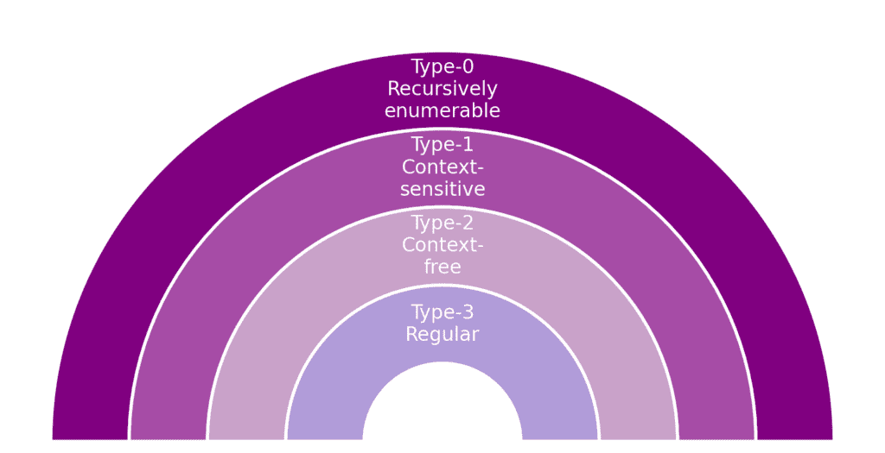
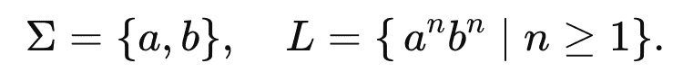
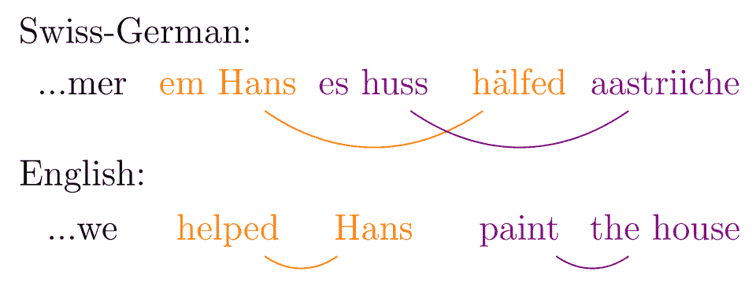
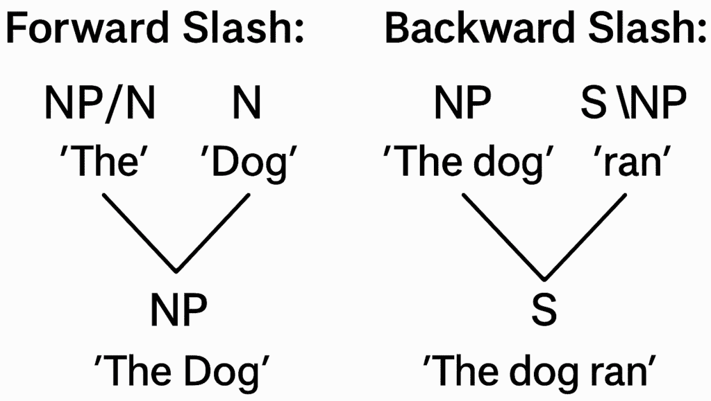
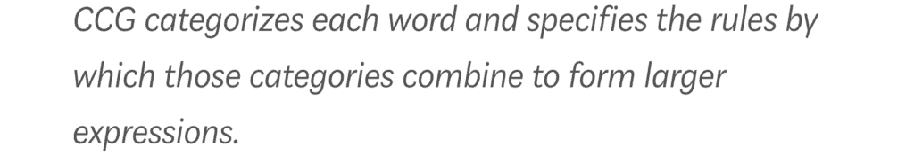
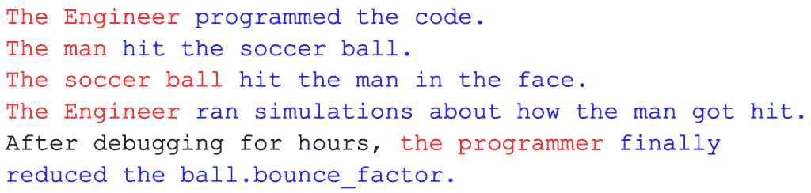

# 语法作为一种可注入的：自然语言处理和计算机科学的特洛伊木马

> [`towardsdatascience.com/grammar-as-a-trojan-horse-to-nlp-and-computer-science/`](https://towardsdatascience.com/grammar-as-a-trojan-horse-to-nlp-and-computer-science/)

我想讨论一个从未被提及的话题，那就是我们如何以一种**非统计**的方式理解语法。许多 AI 模型，如 DeepMind 的 GEM 和 Google 的 PARSEVAL，并不完全依赖统计学习来理解语法。相反，这些**混合模型**将形式语法，如组合范畴语法**（CCG**），重新引入其架构中。这使得这些模型能够仅用几行代码就利用数十年的语言学分析。理论上，这使它们能够在更短的时间内以更低的成本达到相同的水平。但我们是怎样将语法转化为计算机可以处理的东西的呢？

为了理解这一点，我们将讨论词语如何变成函数，它们组合背后的代数，以及一个返回 TypeError 的程序在许多方面等同于一个语法错误的句子。

听着，未定义可能会带来一些不好的回忆——用红色划掉的词语，尺子打在手腕上，或者面对“**介词**”时的茫然。

对于语法学家来说，这通过一系列规定性规则得到帮助。例如：

+   你不应该将“whom”用作主语。

+   句子中必须有**主语**和**宾语**。

+   你不应该以**介词**（如 at, by, into 等）结束句子。

作为一名作家，我总是觉得这些戒律有点限制性——一半痛苦，一半是良药。虽然我可以承认这种语法可以澄清你的写作，但它并不能帮助机器理解句子结构。为此，我们需要讨论组合范畴语法（CCG），如果你熟悉的话。然而，我们不能放弃**规定性语法**。在这篇文章中，我们将使用**第二戒律**：每个句子都必须包含一个清晰的**主语**和**谓语**。

## 从自然语言处理到证明网络

在 2000 年代初，统计 CCG 解析器在提供广泛覆盖和高精度句法解析方面处于领先地位，通过捕捉**长距离依赖**和复杂协调。虽然这不是当前 LLMs 的热门话题，但它有助于塑造需要结构透明度的问答、逻辑推理和机器翻译系统。

虽然现在语法可以仅从数据中推断出来，无需手编规则，但许多最先进的模型仍然重新引入了句法信号，因为：

+   **仅靠隐式学习可能会错过边缘案例现象**。解析器可以处理法律文件中的三重否定或诗歌中的行尾连接，但只有当你明确编码这些模式时。

+   **提供更快的学习速度和更少的数据**。仅从数据中学习语法需要数十亿条记录，并且计算成本高昂。

+   **可解释性和控制**。在分析句法错误时，查看基于解析的特征比查看不透明的注意力权重更容易。

+   **生成一致性**。纯粹涌现的模型可能会漂移，在句子中间改变动词时态，不匹配代词和先行词。一个具有句法意识的解析器或语法模块可以明确地强制执行这一点。

+   **低资源语言限制**。斯瓦希里语或威尔士语可能用于传统大规模训练的数据较少。手编的语法规则可以弥补这一点。


### 证明网

另一个 CCG 继续重要的原因是它与**证明网**（Girard 1987）的深层联系。证明网是表示线性逻辑中证明的基于图的方法，它剥离了官僚细节，揭示了核心逻辑结构。Morrill（1994）和 Moot & Retoré（2012）证明了每个 CCG 解析都可以翻译成这些规范证明网图之一，从而在 CCG 的句法推导和线性逻辑证明之间建立了直接、正式的桥梁。长距离依赖作为显式路径出现，推导冗余被消除，语义组合遵循图收缩。当我们说**线性逻辑**时，每个公式在推导中必须恰好使用一次。

这样想：当你构建一个 CCG 解析（或其证明网）时，每个句法组合（例如，一个**动词短语**与它的**主语**结合）会告诉你确切需要执行哪种语义操作（函数应用、函数组合等）。然后，这一系列由句法指导的步骤以正式精确的方式将单个词的意义组合成整个句子的意义。

> *C&C 解析器和 EasyCCG（Lewis & Steedman，2014）是 CCG 解析领域的突出工具。虽然两者都广泛使用，但 EasyCCG 通常因其速度而受到认可，通常能够实现更快的解析时间，而 C&C 解析器则因其准确性而经常受到注意，尤其是在复杂句子上。*

## 我们究竟在哪里？

形式上位于乔姆斯基层次结构中的**类型-1**，位于图灵机之下，位于下推自动机之上。类型-1 是**上下文相关**的。语言在乔姆斯基层次结构中的位置越深，其生成能力、结构复杂性和解析它所需的计算资源就越高。

+   **解析**：确定一个字符串是否可以根据语法规则构建。

+   **语言（𝑳）**是由从字母表（𝚺）集合中取出的元素组成的有限词集合，该集合包含该语言的所有符号。

在更广泛的意义上，"单词"不必是单词。例如，我们的“单词”可以是电子邮件地址，我们的字母表可以是数字、字母和符号。

> *在英语中，如果我们想谈论整个句子，我们可以让我们的字母表Σ是所有单词的集合（我们的词汇）。那么一个句子是Σ*中的任何有限字符串，而语言 L⊆Σ*只是我们关心的“良好形成”的句子的集合。*



Chomsky 的层次结构。图像由 Chat GPT 帮助制作

给定这种语言的具体定义，我们可以讨论一些深奥的结构，例如所有单词都是像（ab、aab、aaabbbb、abb 等）这样的东西的语言。形式上描述如下：



在这里，指数看起来更像是将东西附加到字符串的末尾，所以 3² = 33 ≠ 9

这种语言在层次结构中是**类型-3**，一个**正则表达式**。虽然上述语言可能很难找到实际用途，但在现实世界中，最普遍的**正则表达式**的例子是网页表单上的电子邮件地址验证：幕后，表单使用一个正则表达式，例如…

```py
^[A-Za-z0-9._%+-]+@[A-Za-z0-9.-]+\.[A-Za-z]{2,}$
```

> this@[[email protected]](/cdn-cgi/l/email-protection)@😡grammar.in_the_email_language.ca

在这里，我们语法的主要目的是确保你输入一个有效的电子邮件地址。在 CCG 中，我们的语法有更多的语言学目的，它检查单词是否可以语法组合。

### NLP 中的 Chomsky 层次结构

当你从类型-3 移动到类型-0 时，你减少了你可以产生的约束。这增加了**表达能力**，但代价是额外的计算。

**类型-0（递归可枚举文法）**：在图灵完备的形式主义中进行完整的语义解析或生成（例如，带有任意额外参数的 Prolog DCGs，或者原则上可以模拟任何图灵机的神经 seq2seq 模型）。

**类型-1（上下文相关文法）**：瑞士德语使用[交叉序列依赖](https://en.wikipedia.org/wiki/Cross-serial_dependencies)，在重写之前需要更多关于周围单词的信息。这需要更多的计算步骤来解析。



> *当我们后面覆盖 CCG 的代数时，回来看看只使用一个正向和*反向** *应用可能会遇到瑞士德语的问题（提示：你必须组合相邻的类别）

**类型-2（上下文无关文法）**：一个 CCG 在**仅**允许两种应用规则和**不**允许高阶组合子（类型提升或组合）时，正好成为一个纯类型-II（上下文无关）文法。

**类型-3（正则文法）**：标记化，基于简单模式的标记（例如，使用正则表达式或有限状态转换器识别日期、电子邮件地址或词性标记）

## CCG 的代数

假设我们有两个**类别**A 和 B，那么**正向应用**和**反向应用**工作如下：

+   A/B 表示，如果我们有一个 B 位于 A/B 的右侧，那么结果产品是 A

+   A\B 表示，如果我们有一个 B 位于 A\B 的左侧，那么结果产品是 A。


> *在实践中 A 和 B 成为 sheach 的部分* 

CCG 的代数看起来很像分数的乘法；注意“分子”如何与“分母”相抵消。然而，与乘法不同，顺序很重要。这个代数 **不是** **交换的**。不要将其记住为规则，而是直接由词序产生的结果。这种非交换性是区分“我们去那里。”作为一个句子，和“Go we there。”作为无意义句子所必需的。

使用 \ 或 / 结合两个原子类别，(例如：NP/N) 创建一个 **复杂类别**，它将一个词分类并描述了它如何组合。

在下面的插图上，“The”与“Dog”**(名词 (N))** 结合，形成 **名词短语 (NP)** “The dog”。同样，名词短语“The dog”可以与“ran”**(动词(S\NP))** 结合，形成 **句子 (S)** “The dog ran”。



## 构建完整的句子

取一个像“a”这样的词——显然不是一个名词、名词短语或句子，但我们可以用这些术语来描述它，说“a”是一个期望右边的名词成为名词短语的词：

> “a” = NP/N

这就是“a ball” (NP/N N → NP) 成为名词短语的方式。

你看我们如何巧妙地用 NP 和 N 来描述 **冠词**（a, an, the），从而创建一个描述它们如何运作、如何与周围词语互动的类别？*为什么称“the”为冠词，而不是称它为一个期望名词成为名词短语的函数？*

我们可以用动词来做同样的事情。要形成一个句子 **S**，我们需要一个主语和一个谓语。

+   主语 **(红色)** 执行动作。

+   动作是动词。

+   谓语 **(蓝色)** 接收动作。



通过这种方式拆分句子，我们可以看到动词在句子构造的两个必要部分之间充当支点，所以你不会对动词和副词在 CCG 中扮演一个非常特殊的角色感到惊讶，因为它们是包含原子类别 S 的类别。

我们可以将动词描述为一种东西，它将一个名词短语放在左边，另一个名词短语放在右边，从而成为一个句子。 (S\NP)/NP。不需要额外的原子类别。

> “After debugging for hours” 是一个从属（依赖）状语从句。可以通过 *C&C 或 EasyCCG* 解析。

## 这与编程有何关联

我觉得 CCG 最优雅的地方在于它如何将动词“write”转换为一个 **函数 (S\NP)/NP**，它接受一个名词短语作为左输入和右输入，输出一个句子。通过将词语视为函数，CCG 解析器以与编译器检查程序相同的方式进行句子类型检查。

如果你尝试构建一个像**“run write walk.”**这样的句子，将会出现一个可怕的**TypeError**。这不会像**sum(“word”)**那样编译。在前一种情况下，你输入了一个期望名词短语的动词，在后一种情况下，你输入了一个期望数字的字符串。**TypeError**

在λ演算中，我们可以写出：

```py
λo. λs. write s o        -- wait for an object o, then a subject s
```

在 CCG 中，每个词汇项不仅携带一个句法类别，还包含一个小的λ项来编码其意义——例如，“write”可能被分配为(S(S\NP)/NP)与语义*λo. λs.write(s, o)*，表示它首先接受一个对象(o)，然后是一个主语(s)。当你应用 CCG 的组合规则（如函数应用）时，你同时应用这些λ项，逐步组合单词的意义，形成一个完整的逻辑形式，用于整个句子。

**λ演算**是一种非常小的形式语言，它只做一件事：***它描述了如何构建函数以及如何运行它们。***其他所有东西——数字、布尔值、数据结构，甚至整个程序——都可以用这些函数来编码。因此，λ演算本身就是一个精确的计算数学模型。

## 结论

CCG 的力量在于其将语言转化为代数系统的能力，提供了一套清晰的组合指令。这对于揭示人类语言与形式计算之间的联系非常有用。诚然，这里解释的 CCG 并不全面，不足以解析如下句子：

> [CCG 不仅仅是一种强大的计算机理解句子结构的方法；它似乎也反映了我们大脑处理语言的方式](https://arxiv.org/html/2403.13368v1#:~:text=These%20findings%20advocate%20for%20CCG,during%20standard%20human%20language%20comprehension.)。

解析这些句子需要更多。当你尝试构建一个能够处理大规模真实世界英语的全面 CCG 系统时，你需要超过 1,200 个不同的语法类别，揭示了看似“普通”语言使用中存在的多少隐藏复杂性。

即使以下结构也是一个简化的模型：

```py
S
├── S
│   ├── NP                     CCG
│   └── S\NP
│       ├── (S\NP)/NP          isn't
│       └── NP
│           ├── NP/NP          just
│           └── NP
│               ├── NP/N       a
│               └── N
│                   ├── N/N    powerful
│                   └── N
│                       ├── N  way
│                       └── N\N
│                           ├── (N\N)/NP   for
│                           └── NP
│                               ├── NP      computers
│                               └── NP\NP
│                                   ├── (NP\NP)/(S\NP)  to
│                                   └── S\NP
│                                       ├── (S\NP)/NP   understand
│                                       └── NP
│                                           ├── N/N     sentence
│                                           └── N       structure
├── (S\S)/S               ;          (punctuation)
└── S
    ├── NP               it
    └── S\NP
        ├── (S\NP)\(S\NP)  also
        └── S\NP
            ├── (S\NP)/(S[TO]\NP)  appears
            └── S[TO]\NP
                ├── (S[TO]\NP)/(S\NP)  to
                └── S\NP
                    ├── (S\NP)/NP     mirror
                    └── NP
                        ├── NP/(S\NP) how
                        └── N
                            ├── N/N   our
                            └── N
                                ├── N brains
                                └── N\N
                                    ├── (N\N)/NP process
                                    └── NP       language
```

在其核心，CCG 提供了一种系统性和严谨的方法来分离句子、重新组装它们，并确保语法一致性。同时避免不完整的句子，例如：


* * *

下一篇文章：

Tallarico, M. H. (2025, July 1). 如何访问 NASA 的气候数据——以及它是如何助力对抗气候变化的（第一部分）：从建筑设计到食品安全。走向数据科学。[链接](https://towardsdatascience.com/how-to-access-nasas-climate-data-and-how-its-powering-the-fight-against-climate-change-pt-1/)。[谷歌学术](https://scholar.google.com/citations?view_op=view_citation&hl=en&user=uCZbo_kAAAAJ&citation_for_view=uCZbo_kAAAAJ:Tyk-4Ss8FVUC)

我的前一篇文章

Tallarico, M. H. (2025, May 12). 你能发现这些泄露吗？一个数据科学挑战：当模型飞得太高：一次危险的数据泄露之旅。走向数据科学。[链接](https://towardsdatascience.com/will-you-spot-the-leaks-a-data-science-challenge/)[谷歌学术](https://scholar.google.com/citations?view_op=view_citation&hl=en&user=uCZbo_kAAAAJ&citation_for_view=uCZbo_kAAAAJ:IjCSPb-OGe4C).

## 参考文献

**Lewis, M., & Steedman, M. (2014).** 使用超标签器和实用动态规划进行 A* CCG 解析。在*2014 年自然语言处理实证方法会议（EMNLP）论文集*（第 1787-1798 页）。

**Moot, R., & Retoré, C. (2012).** *范畴语法逻辑：自然语言句法和语义的演绎描述*。Springer.

**Jurafsky, D., & Martin, J. H. (2023).** *语音与语言处理*（第 3 版）[附录 E：组合范畴语法]。2025 年 5 月 29 日从[`web.stanford.edu/~jurafsky/slp3/E.pdf`](https://web.stanford.edu/~jurafsky/slp3/E.pdf)检索。

* * *

[网站](https://marcoheningtallarico.com/) | [领英](https://www.linkedin.com/in/marco-hening-tallarico/) | [GitHub](https://github.com/marco-hening-tallarico?tab=repositories)


作者
