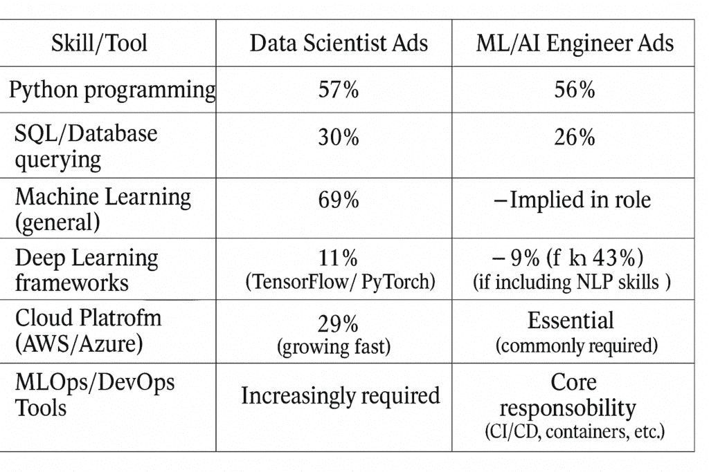

# 从数据科学转向人工智能工程：你需要知道的一切

> [原文链接](https://towardsdatascience.com/i-transitioned-from-data-science-to-ai-engineering-heres-everything-you-need-to-know/)

<mdspan datatext="el1748482478941" class="mdspan-comment">数据科学</mdspan>并没有消亡，但它正在快速发展。

预计人工智能相关的工作将每年增长**~40**%，到 2027 年将创造超过一百万个新的职位。

在这篇文章中，我将带您了解我从**数据科学**到**人工智能工程**的**转变**，并为您提供一些关于如何转变或了解更多关于这个领域的实用建议。

我在数据科学到人工智能工程的道路上经历了有趣且充满学习的过程。以下是我迄今为止旅程的简要概述：

+   我毕业于物理学和天体物理学（学士和硕士），然后转向数据科学；

+   在数据科学和机器学习领域在国外完成了**两次实习**；

+   在我国最大的能源公司获得了我的第一份**全职数据科学家**工作；

+   **在 2025 年 5 月之前不到一年**转向人工智能工程，现在我在一家大型物流公司工作。

如果你是一名**数据科学家**，你认为你多久会考虑一下你的代码是如何达到**生产**环境的？如果答案是“几乎从不”，那么人工智能工程可能会让你感到震惊。

对如何在数据科学中的**现实世界**经验塑造你进入人工智能工程的旅程感兴趣吗？或者想知道我遇到了哪些**令人惊讶的挑战**？

人工智能工程师的**日常生活**与数据科学家的有何不同？

与之前相比，我现在使用哪些**工具**和**平台**？

继续阅读，了解所有相关信息！

* * *

#### 你好！

我的名字是 [Sara Nóbrega](https://linktr.ee/saranobrega)，我是一名人工智能工程师。

我写有关数据科学、人工智能以及数据科学职业建议的文章。确保[**关注我**](https://medium.com/@saranobregafn)，以便在发布下一篇文章时收到更新！

* * *

## 数据科学与人工智能工程之间的异同

人工智能工程是一个非常广泛的概念，它甚至可能包括许多数据科学任务。实际上，它通常被用作一个总称。

作为一名数据科学家，我曾经花了 3 周时间离线调整模型。现在，作为一名人工智能工程师，我们只有 3 天时间将其部署到生产环境中。优先级快速转变了！

但这难道意味着这两个**角色**完全**不同**且**从不重叠**吗？

如果有一天你想申请人工智能工程师的职位？数据科学技能是否可以转移到人工智能工程领域？

首先，我将向您展示我对这一主题进行的这项研究的一些发现，然后是我的个人见解和经验。

#### 我为你做了一点研究…

根据我的调查，过去**三年**中每个角色的职责都得到了扩展和融合。

**数据科学家**的职位描述现在除了分析和模型调整之外，还包括越来越多的任务。它们通常包括：**部署模型**、构建**数据管道**以及应用机器学习操作**（MLOps）**最佳实践。

猜猜看，这就是我作为 AI 工程师主要做的事情！（更多内容将在下一节中介绍）。

例如，我最近看到的一个数据科学家职位发布明确要求“有企业数据操作（DataOps）、DevSecOps 和**MLOps**的经验”。**

直到几年前，数据科学家主要专注于研究和建模。现在，公司通常期望数据科学家能够成为“**全栈**”的，这几乎意味着，精通几乎**一切**。

这意味着预计数据科学家对云平台、软件工程甚至 DevOps 有一定的了解，以便他们的模型可以直接支持产品。

[一项调查](https://365datascience.com/career-advice/the-future-of-data-science/)发现，**69%**的数据科学家职位列表要求机器学习技能，大约**19%**提到自然语言处理（NLP），比一年前的**5%**有所增加。

**云计算**技能（AWS、Azure）和深度学习框架（TensorFlow/PyTorch）现在也出现在约**10-15%**的数据科学家招聘广告中，这表明与**AI 工程技能集**的重叠正在增加。

数据科学家和 AI 工程师的**技能集**存在**明显的融合**。这两个角色都大量使用编程（尤其是**Python**）和数据技能（SQL），并且都需要理解机器学习算法。

根据对 2024 年职位发布的分析，**Python**在约 56-57%的数据科学家和机器学习工程师职位列表中是必需的。

**云计算**和**MLOps**技能似乎成为了**新的共同点**，因为 AI 工程师被期望在**AWS/Azure**上部署，同样，“云技能对于未来的数据科学家来说将是必不可少的”。

下表根据我在参考文献部分列出的来源，突出了某些核心技能以及它们在每个角色招聘广告中出现的频率：

初看之下，**差异**很明显。**数据科学家**角色仍然根植于传统的数据任务：Python、SQL、通用机器学习以及从结构化数据中提取见解。

**机器学习/人工智能工程师**位于软件工程世界的更近位置。这些专业人士的任务是将实验模型变得稳健、可扩展，并持续交付。

但有一个有趣且具有战略性的**融合**趋势。

我们可以看到，云平台越来越多地被提及用于**数据科学家**，而**MLOps**工具也不再局限于工程角色。技能集正在**融合**！

我们观察到一种趋势，即数据科学家正被推向更接近 **工程** 堆栈。

## 我的个人旅程和收获

#### 我作为数据科学家做了什么？我现在作为 AI 工程师做什么？

为了给您一些背景信息，我曾在一家大型能源公司担任数据科学家，我的职责是开发 **时间序列预测** 模型（使用 XGBoost、LightGBM、SARIMAX 和 RNNs），生成和验证 **合成数据**（通过 TimeGAN、统计分布和插补技术），进行深入和广泛的 **统计分析**，并使用 **机器学习** 模型来解决大数据中的缺失数据。

如果您感兴趣，我写了很多 [有用的文章](https://towardsdatascience.com/author/saranobregafn/) 来处理时间序列数据。

我作为 **数据科学家** 使用的一些 **工具** 和平台包括：VSCode、Jupyter、MLflow、Flask、FastAPI，以及 Python 库如 TensorFlow、scikit-learn、pandas、NumPy、Matplotlib、Seaborn、ydata-synthetic、statsmodels 等。

在我之前的 **实习** 中，我会使用 PyTorch、Transformers、Weights & Biases、Git 以及 Python 库进行数据蒸馏、监督学习、应用统计、计算机视觉、NLP、目标检测、数据增强和深度学习。

## 我现在使用的工具和平台

**Python** 仍然是我主要使用的语言。我确实使用 **Jupyter** 笔记本进行原型设计，但现在我大部分时间都在 **VSCode** 中编写 Python 代码（脚本、API、测试等）。

我的工作与 **Microsoft Azure** 非常紧密相关，特别是 **Azure Machine Learning**，因为我的团队使用它来管理、训练、部署和监控我们的 ML 模型。

整个 **MLOps** 生命周期（从开发到部署）都在 Azure 上运行。我们还利用 **MLflow** 来跟踪实验、比较不同的模型和参数，并注册所有模型版本。

从 DS 到 AI 工程的转变对我来说是一个重大转变，那就是持续使用 **CI/CD** 工具，特别是 **GitHub Actions**。这实际上是我开始这份工作的第一个任务之一！

GitHub Actions 允许我构建 **自动化工作流**，以测试和部署 ML 模型，以便它们可以集成到其他管道中。

除了机器学习之外，我还构建和部署后端组件。为此，我使用 **REST APIs**，以及 **FastAPI** 和 **Azure Functions** 来提供模型预测并将它们连接到我们的前端应用程序或外部服务。

我已经开始使用 **Snowflake** 来探索和转换结构化数据集，使用 **SQL** 进行操作。

关于基础设施即代码，我使用 **Terraform** 来以代码的形式管理云资源。

我使用的其他工具包括 **Git**、**Bash** 和 **Linux** 环境。这些对于协作、脚本自动化、故障排除和管理部署都至关重要。

## 作为 AI 工程师，我执行的一些任务

现在，我在一家大型**物流**公司担任**AI 工程师**。

我被分配的第一个任务是改进和优化机器学习模型的持续集成/持续部署（**CI/CD**）管道，使用**GitHub Actions**和**Azure Machine Learning**。

你可能会问，这实际上意味着什么呢？

嗯，我的公司希望有一个可重用的**MLOps 模板**，新项目可以采用这个模板而不需要从头开始。这个模板就像一个启动包。它位于**GitHub**仓库中，包含了从笔记本中的原型到实际可以运行在生产环境中的所有你需要的东西。

在这个仓库中，有一个**Makefile**（一个脚本，允许你使用单个命令运行设置任务，例如安装包或运行测试），一个用 YAML 编写的**CI 工作流程**（一个文件，定义了每次有人推送新代码时确切会发生什么，例如运行测试和评估模型），以及**Python 脚本和配置文件的单元测试**（以确保一切按预期运行，并且没有在我们没有注意到的情况下出现故障）。

如果你希望了解更多关于这个的信息，我实际上写了一个完整的**[ML 项目开发清单](https://medium.com/data-science-collective/from-notebook-to-production-a-dev-checklist-for-ml-projects-4032645df6f5?sk=573b92095e6cf1a383c437eaccbf30b0)**，它描述了这些最佳实践，而且对初学者非常友好。

从代码检查和 Makefile 到 GitHub Actions 和分支保护，它包含了我想早点知道的实用步骤：

*👉* [*在此阅读：从笔记本到生产——ML 项目开发清单*](https://medium.com/data-science-collective/from-notebook-to-production-a-dev-checklist-for-ml-projects-4032645df6f5?sk=573b92095e6cf1a383c437eaccbf30b0)

**单元测试**实际上是 AI 工程的核心部分。它们通常不是任何人的最爱任务……但它们对于确保模型进入现实世界时不会出现故障至关重要。

因为想象一下，你花费了几天时间训练一个模型，结果在预处理脚本中有一个小小的错误，导致生产环境中的所有东西都出了问题。**单元测试**有助于早期捕捉这些无声的失败！

但这难道意味着我停止了数据科学任务吗？当然不是！

事实上，我当前的一项任务涉及绘制出发和到达时间，清理路线数据，并将结果集成到前端应用程序中。

我认为这是一个很好的例子，说明了**数据科学**（EDA、映射、清理）如何与**AI 工程**（集成、部署意识）相结合。

我想强调的是，**两个角色**（数据科学家和 AI 工程师）都可以相当**广泛**，他们的责任通常因公司而异，甚至因行业而异。我分享的这些内容仅基于我的**个人经验**，这可能并不反映每个人在这些角色中的旅程或期望！

## 协作模式

我注意到，这种责任的重叠迫使与其他团队成员更紧密地合作。我发现数据科学家越来越多地**与 DevOps 和后端工程师并肩工作**，以确保模型实际上在生产中运行。

一项[研究发现](https://venturebeat.com/ai/why-do-87-of-data-science-projects-never-make-it-into-production/)，**87%**的机器学习解决方案在没有团队以有效方式协调的情况下无法从实验室中走出。

在过去的几年里，公司已经认识到协作的需求。事实上，对**MLOps**最佳实践的需求已经出现，以弥合数据科学家和 DevOps 之间的差距。

## 到目前为止最大的挑战

我不会撒谎，这段旅程充满了挑战。每个人都必须意识到**冒名顶替综合症**，我当然也深受其害。我想随着时间的推移，当我感觉我为参与的项目增加了价值时，这种感觉就会消失。

当我开始作为 AI 工程师工作时，**最大的挑战**是适应新工具，并将它们全部结合起来使用。由于我被分配了一个只有我一个人在做的（MLOps 模板）重要任务，我突然感到责任重大。我必须快速学习 YAML 语言、GitHub Actions 以及它们如何连接到 Azure。

由于我对**MLOps**非常感兴趣，我在几个项目中承担了**系统架构师**的角色。我负责弄清楚所有**部件如何配合并协同工作**，然后清楚地向我的经理解释。

我确实不习惯这些职责和角色，但随着时间的推移，我在处理它们方面变得更加自信。

## 从 DS 过渡到 AI 工程的技巧

我可以说，成为 AI 工程师的第一步是开始对 AI 的整体运作**感兴趣**和**好奇**。**这就是我开始的途径。**

这就是我开始的原因！

我首先问自己：这个模型将如何真正地**投入使用**给用户？它将如何**增值**？数据库是如何工作的，我们如何在生产中获取数据？我如何确保 6 个月后这个模型仍然有效？我如何确保我的模型在本地和在生产中一样**准确**？

然后，我在转向 AI 工程之前，开始**阅读**在线文章和 LinkedIn 帖子。

在线上有大量的**有用内容**，都是免费的。我也开始参加一些**在线课程**，这样我的技能变得更加扎实。

如果你处于数据科学角色，你可以**向你的经理**提出开始为团队中的**生产代码**做出贡献，或者让你参加与 AI 工程师的**会议**。根据我的经验，经理们总是喜欢想要学习更多的员工。

然后，你可以**在线学习**GitHub Actions、Docker 和 Azure/AWS。了解重要的**生产指标**，如延迟、正常运行时间、监控。

这是一个非常简短的**路线图**，我将把剩下的建议留到下一篇文章中😉。

## 最后的话

**我的思维发生了转变：为什么 AI 工程师必须像开发者一样思考**

要转型为 AI 工程角色，重要的是要考虑机器学习生命周期的**整体图景**：也就是说，确保模型实际上**能够工作**，创造**影响**并为公司**增值**。

这意味着什么？

这意味着在整个生命周期中考虑模型如何集成到现实世界的系统中——它将如何部署、监控、扩展和维护。

这意味着要**超越笔记本**和训练精度，并提出像这样的问题：*这个模型将在哪里运行？我们如何安全地更新它？如果下个月输入数据发生变化会发生什么？*

对于那些进入或正在转型 AI 领域的人来说，请记住：你**不需要掌握**一切，但你确实需要了解你的**工作如何融入**机器学习生命周期的整体图景。

你对“管道另一端”的同理心越深，你的影响力就越大。

正如你在本文中注意到的那样，对我而言，**转向 AI 工程**意味着**工作**在、**学习**关于以及**拥有**整个**机器学习生命周期**，而不仅仅是模型训练。

在我过去的数据科学家角色中，我执行了传统的**数据科学**任务，如 EDA、异常检测、数据处理、模型开发和打包。确实，这与我在大学学到的直接相关。

作为一名 AI 工程师，我觉得我的日常工作是**两种角色的结合**。我仍然探索和清理数据，但我感觉我需要**像开发者一样思考**，以确保模型在生产环境中运行并随着时间的推移得到维护。

最大的**思维转变**之一是学习如何将代码部署到生产环境中，以及培养一种**自动化**的**思维模式**：自动化安装、测试、部署、监控。

到目前为止，这已经是一次有趣的旅程，我打算进一步记录和分享。

感谢阅读！希望你觉得这篇文章有用。

* * *

#### 🔔 再说一件事！

我还写了一个免费的通讯简报，[**Sara 的 AI 自动化摘要**](https://saranfn.substack.com/)，在那里我分享每月的见解、工具，以及关于 AI、自动化以及它如何改变我们工作方式的幕后信息。

现在订阅并获取对我的[**免费 AI 工具库**](https://saranfn.substack.com/)的访问权限——这是一个包含 20 多个具有实际用例、功能和限制的 AI 工具的精选 Notion 数据库。

* * *

我在这里提供关于职业成长和转型的**辅导**[链接](https://topmate.io/sara_nobrega)。

**如果你想支持我的工作**，你可以[买我喜欢的咖啡](https://buymeacoffee.com/saranobregu)：一杯卡布奇诺。😊

### 参考文献

[2024 年面试查询数据科学报告：AI 工作的兴起（2024 年更新）](https://www.interviewquery.com/p/the-2024-data-science-report)

[MLOps: 连接数据科学家和 DevOps 团队](https://www.harrisonclarke.com/blog/mlops-connecting-data-scientists-and-devops-teams#:~:text=MLOps%3A%20Connecting%20Data%20Scientists%20and,collaborate%20more%20effectively%20and%20efficiently)

[数据科学未来：2025-365 数据科学职业市场趋势](https://365datascience.com/career-advice/the-future-of-data-science/)
