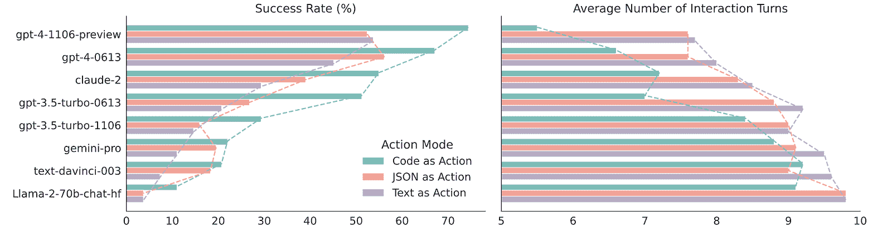
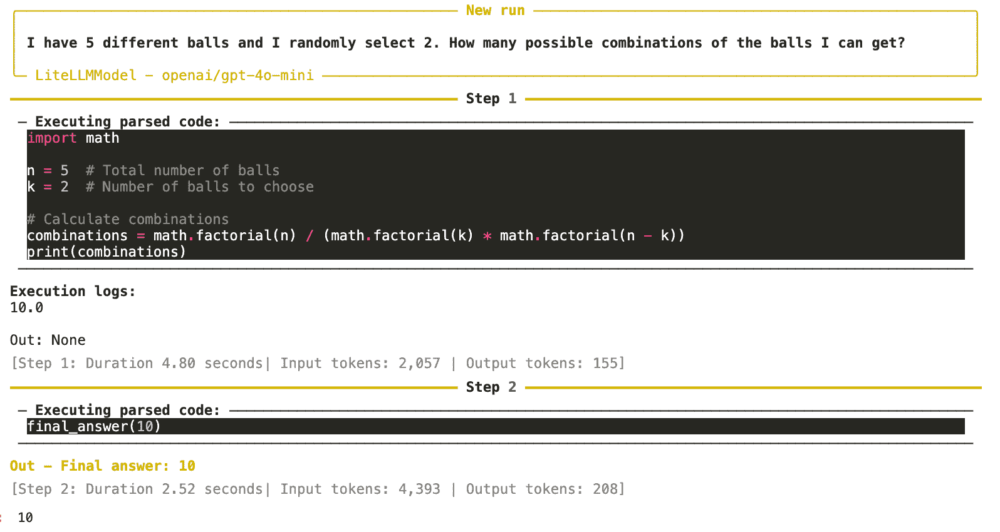

# 代码代理：代理 AI 的未来

> [`towardsdatascience.com/code-agents-the-future-of-agentic-ai/`](https://towardsdatascience.com/code-agents-the-future-of-agentic-ai/)

<mdspan datatext="el1748303756896" class="mdspan-comment">我们正处在 AI 代理的时代。LLM 已不再是工具。它们已成为我们生活中的积极参与者，提高了生产力，并改变了我们生活和工作的方式。*

+   OpenAI 最近推出了 [Operator](https://en.wikipedia.org/wiki/OpenAI_Operator?utm_source=chatgpt.com)，一个可以自主执行各种任务的 AI 代理，从浏览网页到填写表格和安排预约。

+   Anthropic 推出了 [MCP (模型上下文协议)](https://www.anthropic.com/news/model-context-protocol)，这是一个新的标准，用于 AI 助手如何与外界互动。已有超过五千个活跃的 MCP 服务器，采用率正在迅速增长。

+   AI 代理也在改变软件工程的格局。像 GitHub Copilot 的代理模式、Claude Code、OpenAI Codex 等工具不仅[提高了开发者的生产力和代码质量](https://github.blog/news-insights/research/research-quantifying-github-copilots-impact-on-developer-productivity-and-happiness/)，而且使该领域民主化，使软件开发对没有技术背景的人变得可访问。

我们之前已经探讨了不同的 AI 代理框架，例如 [LangGraph](https://towardsdatascience.com/from-basics-to-advanced-exploring-langgraph-e8c1cf4db787/) 或 [CrewAI](https://towardsdatascience.com/multi-ai-agent-systems-101-bac58e3bcc47/)。在这篇文章中，我想讨论我最近一直在探索的一个新框架——**HuggingFace smolagents**。它是一个有趣的框架，因为它实现了代码代理的概念。

在这篇文章中，我们将探讨几个主题：

+   代码代理是什么（预告：与 vibe 编码无关）。

+   如何在实际中使用 HuggingFace smolagents 框架。

+   是否安全地将如此多的代理权赋予 LLM。

+   代码代理与传统工具调用代理之间性能差异的真实性。

## AI 代理回顾

让我们从快速复习开始：AI 代理究竟是什么？HuggingFace [提供](https://huggingface.co/docs/smolagents/conceptual_guides/intro_agents)了一个关于代理的清晰简洁的定义。

> *AI 代理是程序，其中 LLM 输出控制工作流程。*

因此，当我们想要一个系统根据观察进行推理和行动时，我们需要一个代理流程。实际上，代理不是一个二元变量（是或否），而是一个连续体。

+   在一个极端，我们可以有完全没有代理的系统，例如，一个简单的流程，其中 LLM 定义文本的情感，翻译它或总结它。

+   下一个级别是路由，其中 LLM 可以分类一个传入的问题并决定采取哪条路径——例如，如果客户询问他们当前订单的状态，则调用工具，否则将对话转移到人工客户服务代理。

+   更高级的系统可以表现出更高的代理度。这可能包括执行其他 LLM（多代理设置）或甚至即时创建新工具的能力。

代码代理属于这个更高级的类别。它们是多步骤代理，以代码的形式执行工具调用，与使用工具名称和参数的 JSON 格式的传统方法相比。

几篇最近的论文表明，在代理流程中使用代码会导致更好的结果：

+   王兴耀，等人。[“可执行代码操作引发更好的 LLM 代理”](https://arxiv.org/abs/2402.01030)

+   阮丹，等人。[“DynaSaur：超越预定义操作的动态语言代理”](https://arxiv.org/abs/2411.01747)

+   杨科，等人。[“如果 LLM 是巫师，那么代码就是魔杖：关于代码如何赋予大型语言模型作为智能代理的综述。”](https://arxiv.org/abs/2401.00812)

当你这么想的时候，这很有道理。我们几十年来一直在开发编程语言来解决复杂问题。因此，这些语言比简单的 JSON 配置更适合 LLM 的任务是自然的。另一个好处是，由于有大量的训练数据可用，LLM 在编写常用编程语言代码方面已经相当出色。

这种方法还带来了其他一些好处：

+   通过生成代码，LLM 不受预定义工具集的限制，可以创建自己的函数。

+   它可以使用条件和循环在单个操作中结合多个工具，这有助于减少完成任务所需的步骤数量。

+   它还使模型能够处理更广泛的输出，例如生成图表、图像或其他复杂对象。

这些好处不仅仅是理论上的；我们可以在实践中观察到它们。在[“可执行代码操作引发更好的 LLM 代理”](https://arxiv.org/abs/2402.01030)中，作者表明代码代理优于传统方法，实现了更高的成功率，并在更少的步骤中完成任务，从而降低了成本。



来自[王兴耀，等人](https://arxiv.org/abs/2402.01030)。[“可执行代码操作引发更好的 LLM 代理”](https://arxiv.org/abs/2402.01030)的图表。

代码代理看起来很有前途，这激发了我尝试在实践中采用这种方法。

## HuggingFace smolagents 框架

### 首先尝试

幸运的是，我们不需要从头开始构建代码代理，因为 HuggingFace 已经发布了一个名为[smolagents](https://huggingface.co/docs/smolagents/index)的便捷库，该库实现了这种方法。

让我们从安装库开始。

```py
pip install smolagents[litellm] 
# I've used litellm, since I'm planning to use it with OpenAI model
```

接下来，让我们构建一个基本示例。为了初始化代理，我们只需要两个参数：**模型**和**工具**。

我计划使用 OpenAI 作为模型，它可以通过 [LiteLLM](https://docs.litellm.ai/) 访问。然而，该框架也支持其他选项。您可以通过 [Ollama](https://ollama.com/) 或 [TransformersModel](https://huggingface.co/docs/smolagents/v1.15.0/en/reference/models#smolagents.TransformersModel) 使用本地模型，或通过 [Inference Providers](https://huggingface.co/blog/inference-providers) 使用公共模型，或者选择其他选项（您可以在 [文档](https://huggingface.co/docs/smolagents/guided_tour) 中找到更多详细信息）。

我没有指定任何工具，但使用了 `add_base_tools = True`，因此我的代理有一个 [默认的工具集](https://huggingface.co/docs/smolagents/reference/tools#default-tools)，例如 Python 解释器或 DuckDuckGo 搜索。让我们用一个简单的问题来试一试。

```py
from smolagents import CodeAgent, LiteLLMModel
model = LiteLLMModel(model_id="openai/gpt-4o-mini", 
  api_key=config['OPENAI_API_KEY']) 
agent = CodeAgent(tools=[], model=model, add_base_tools=True)

agent.run(
    """I have 5 different balls and I randomly select 2\. 
    How many possible combinations of the balls I can get?""",
)
```

因此，我们看到一个非常整洁的执行流程。这真是太神奇了，并允许您完美地理解这个过程。



图片由作者提供

因此，代理在一步中找到了答案，并编写了 Python 代码来计算组合数。

输出非常有帮助，但我们还可以更深入地查看与执行（包括提示）相关的完整信息，通过 `agent.memory.steps`。让我们看看代理使用的系统提示。

```py
You are an expert assistant who can solve any task using code blobs. 
You will be given a task to solve as best you can.

To do so, you have been given access to a list of tools: these tools 
are basically Python functions which you can call with code.

To solve the task, you must plan forward to proceed in a series of 
steps, in a cycle of 'Thought:', 'Code:', 
and 'Observation:' sequences.

At each step, in the 'Thought:' sequence, you should first explain 
your reasoning towards solving the task and the tools that you want 
to use.

Then in the 'Code:' sequence, you should write the code in simple 
Python. The code sequence must end with '<end_code>' sequence.

During each intermediate step, you can use 'print()' to save 
whatever important information you will then need.

These print outputs will then appear in the 'Observation:' field, 
which will be available as input for the next step.

In the end you have to return a final answer using 
the final_answer tool.

Here are a few examples using notional tools: <...>
```

很明显，smolagents 实现了 ReAct 方法（由 Yao 等人论文中介绍，[“ReAct: Synergizing Reasoning and Acting in Language Models”](https://arxiv.org/abs/2210.03629)），并使用了一些样本提示技术。

smolagents 库处理了代理工作流程中所有幕后工作：将所有必要信息（即可用工具）与系统提示组装起来，解析输出并执行生成的代码。它还提供全面的日志记录和重试机制，以帮助纠正错误。

此外，该库还提供内存管理功能。默认情况下，所有执行结果都保存到内存中，但您可以自定义此行为。例如，您可以从内存中删除一些中间结果以减少令牌数量或逐步执行代理。虽然我们不会深入探讨内存管理，但您可以在 [文档](https://huggingface.co/docs/smolagents/tutorials/memory) 中找到有用的代码示例。

### 安全

现在，是时候讨论代码代理方法的一些缺点了。通过允许代理执行任意代码，给 LLM（大型语言模型）更多的权限引入了更高的风险。实际上，LLM 可能会由于错误（因为 LLM 仍然远非完美）或针对性强如提示注入或模型被破坏的攻击而运行有害代码。

为了减轻这些风险，smolagents 库中实现的本地 Python 执行器有一系列安全检查：

+   默认情况下，除非包已被明确添加到 `additional_authorized_imports` 列表中，否则不允许导入。

+   此外，子模块默认是被阻止的，因此你必须特别授权它们（即 `numpy.*`）。这样做是因为一些包可能会暴露出潜在有害的子模块，例如 `random._os`。

+   执行操作的总数受到限制，以防止无限循环和资源膨胀。

+   任何在解释器中未明确定义的操作都会引发错误。

让我们来测试这些安全措施是否真的有效。

```py
from smolagents.local_python_executor import LocalPythonExecutor

custom_executor = LocalPythonExecutor(["numpy.*", "random"])

# function to have pretty formatted exceptions
def run_capture_exception(command: str):
    try:
        custom_executor(harmful_command)
    except Exception as e:
        print("ERROR:\n", e)

# Unauthorised imports are blocked 
harmful_command="import os; exit_code = os.system('<bad_command>')"
run_capture_exception(harmful_command)
# ERROR: Code execution failed at line 'import os' due to: 
# InterpreterError: Import of os is not allowed. Authorized imports 
# are: ['datetime', 'itertools', 're', 'math', 'statistics', 'time', 'queue', 
# 'numpy.*', 'random', 'collections', 'unicodedata', 'stat']

# Submodules are also blocked unless stated specifically
harmful_command="from random import _os; exit_code = _os.system('<bad_command>')"
run_capture_exception(harmful_command)
# ERROR: Code execution failed at line 'exit_code = _os.system('<bad_command>')' 
# due to: InterpreterError: Forbidden access to module: os

# The cap on the number of iterations breaks inifinity loops 
harmful_command = '''
while True: 
    pass
'''
run_capture_exception(harmful_command)
# ERROR: Code execution failed at line 'while True: pass' due to: 
# InterpreterError: Maximum number of 1000000 iterations in While loop 
# exceeded

# Undefined operations don't work
harmful_command="!echo <bad_command>"
custom_executor(harmful_command)
# ERROR: Code parsing failed on line 1 due to: SyntaxError
```

看起来我们在代码智能体方面有一些安全网。然而，尽管有这些保障措施，当你本地执行代码时仍然存在风险。例如，一个 LLM 可以在您的计算机上递归地创建线程或创建过多的文件，导致资源膨胀。一个可能的解决方案是在沙盒环境中执行代码，例如使用 Docker 或类似 [E2B](https://e2b.dev/) 的解决方案。我愿意冒险在本地运行我的代码，但如果您更喜欢风险规避的方法，可以遵循[文档](https://huggingface.co/docs/smolagents/tutorials/secure_code_execution)中的沙盒设置指南。

## 代码智能体 vs 传统工具调用智能体

据称，代码智能体的性能优于传统的基于 JSON 的方法。让我们来验证这一点。

我将使用我在上一篇文章中描述的任务，即[“理解 KPI 变化”](https://towardsdatascience.com/making-sense-of-kpi-changes/)。我们将从一个简单的案例开始：分析按一个维度（国家）拆分的简单指标（收入）。

```py
raw_df = pd.read_csv('absolute_metrics_example.csv', sep = '\t')
df = raw_df.groupby('country')[['revenue_before', 'revenue_after_scenario_2']].sum()\
  .sort_values('revenue_before', ascending = False).rename(
    columns = {'revenue_after_scenario_2': 'after', 
      'revenue_before': 'before'})
```


图片由作者提供

smolagents 库支持两个类，我们可以使用它们来比较两种方法：

+   [CodeAgent](https://huggingface.co/docs/smolagents/v1.14.0/en/reference/agents#smolagents.CodeAgent) — 一个通过生成和执行代码来行动的智能体，

+   [ToolCallingAgent](https://huggingface.co/docs/smolagents/v1.14.0/en/reference/agents#smolagents.ToolCallingAgent) — 一个基于传统 JSON 的智能体。

我们的智能体需要一些工具，让我们来实现它们。在 smolagents 中有[多种创建工具的选项](https://huggingface.co/docs/smolagents/tutorials/tools)：我们可以重用 LangChain 工具，从 HuggingFace Hub 下载它们，或者简单地创建 Python 函数。我们将采取最直接的方法，通过编写几个 Python 函数并用 `@tool` 注解它们来实现。

我将创建两个工具：一个用于估计指标之间的相对差异，另一个用于计算列表的总和。由于 LLM 将使用这些工具，提供详细的描述至关重要。

```py
@tool 
def calculate_metric_increase(before: float, after: float) -> float: 
    """
    Calculate the percentage change of the metric between before and after

    Args:
        before: value before
        after: value after
    """
    return (before - after) * 100/ before

@tool 
def calculate_sum(values: list) -> float: 
    """
    Calculate the sum of list

    Args:
        values: list of numbers
    """
    return sum(values)
```

> *预告：我后来意识到我应该为智能体提供更多工具，但我确实忽略了它们*。

### CodeAgent

让我们从 CodeAgent 开始。我已经用我们之前定义的工具初始化了智能体，并授权使用一些可能有帮助的 Python 包。

```py
agent = CodeAgent(
    model=model,
    tools=[calculate_metric_increase, calculate_sum],
    max_steps=10,
    additional_authorized_imports=["pandas", "numpy", "matplotlib.*", 
      "plotly.*"],
    verbosity_level=1 
)

task = """
Here is a dataframe showing revenue by segment, comparing values 
before and after.
Could you please help me understand the changes? Specifically:
1\. Estimate how the total revenue and the revenue for each segment 
have changed, both in absolute terms and as a percentage.
2\. Calculate the contribution of each segment to the total 
change in revenue.

Please round all floating-point numbers in the output 
to two decimal places.
"""

agent.run(
    task,
    additional_args={"data": df},
)
```

总体而言，代码代理仅用两步就完成了任务，使用了 5,451 个输入令牌和 669 个输出令牌。结果看起来也相当合理。

```py
{'total_before': 1731985.21, 'total_after': 
1599065.55, 'total_change': -132919.66, 'segment_changes': 
{'absolute_change': {'other': 4233.09, 'UK': -4376.25, 'France': 
-132847.57, 'Germany': -690.99, 'Italy': 979.15, 'Spain': 
-217.09}, 'percentage_change': {'other': 0.67, 'UK': -0.91, 
'France': -55.19, 'Germany': -0.43, 'Italy': 0.81, 'Spain': 
-0.23}, 'contribution_to_change': {'other': -3.18, 'UK': 3.29, 
'France': 99.95, 'Germany': 0.52, 'Italy': -0.74, 'Spain': 0.16}}}
```

让我们看看执行流程。LLM 收到了以下提示。

```py
╭─────────────────────────── New run ────────────────────────────╮
│                                                                │
│ Here is a pandas dataframe showing revenue by segment,         │
│ comparing values before and after.                             │
│ Could you please help me understand the changes?               │
│ Specifically:                                                  │
│ 1\. Estimate how the total revenue and the revenue for each     │
│ segment have changed, both in absolute terms and as a          │
│ percentage.                                                    │
│ 2\. Calculate the contribution of each segment to the total     │
│ change in revenue.                                             │
│                                                                │
│ Please round all floating-point numbers in the output to two   │
│ decimal places.                                                │
│                                                                │
│ You have been provided with these additional arguments, that   │
│ you can access using the keys as variables in your python      │
│ code:                                                          │
│ {'df':             before      after                           │
│ country                                                        │
│ other    632767.39  637000.48                                  │
│ UK       481409.27  477033.02                                  │
│ France   240704.63  107857.06                                  │
│ Germany  160469.75  159778.76                                  │
│ Italy    120352.31  121331.46                                  │
│ Spain     96281.86   96064.77}.                                │
│                                                                │
╰─ LiteLLMModel - openai/gpt-4o-mini ────────────────────────────╯
```

在第一步中，LLM 生成了一个数据框并执行了所有计算。有趣的是，它选择独立编写所有代码，而不是使用提供的工具。

更令人惊讶的是，LLM 是根据输入数据重新创建了数据框，而不是直接引用它。这种方法并不理想（尤其是在处理大量数据集时），因为它可能导致错误和更高的令牌使用。通过使用更明确的系统提示，这种行为可能会得到改善。以下是代理在第一步执行的代码。

```py
import pandas as pd                                                                                                        

# Creating the DataFrame from the provided data                 
data = {                                                        
    'before': [632767.39, 481409.27, 240704.63, 160469.75,      
120352.31, 96281.86],                                           
    'after': [637000.48, 477033.02, 107857.06, 159778.76,       
121331.46, 96064.77]                                            
}                                                               
index = ['other', 'UK', 'France', 'Germany', 'Italy', 'Spain']  
df = pd.DataFrame(data, index=index)                            

# Calculating total revenue before and after                    
total_before = df['before'].sum()                               
total_after = df['after'].sum()                                 

# Calculating absolute and percentage change for each segment   
df['absolute_change'] = df['after'] - df['before']              
df['percentage_change'] = (df['absolute_change'] /              
df['before']) * 100                                             

# Calculating total revenue change                              
total_change = total_after - total_before                       

# Calculating contribution of each segment to the total change  
df['contribution_to_change'] = (df['absolute_change'] /         
total_change) * 100                                             

# Rounding results                                              
df = df.round(2)                                                

# Printing the calculated results                               
print("Total revenue before:", total_before)                    
print("Total revenue after:", total_after)                      
print("Total change in revenue:", total_change)                 
print(df)
```

在第二步中，LLM 简单地通过引用前一步计算的变量构建了最终答案（这真的很棒）。

```py
final_answer({                                                  
    "total_before": round(total_before, 2),                     
    "total_after": round(total_after, 2),                       
    "total_change": round(total_change, 2),                     
    "segment_changes": df[['absolute_change',                   
'percentage_change', 'contribution_to_change']].to_dict()       
})
```

它的工作相当不错。

### ToolCallingAgent

现在，是时候看看传统的工具调用代理如何解决这个问题了。我们以类似的方式初始化它并运行任务。

```py
from smolagents import ToolCallingAgent
traditional_agent = ToolCallingAgent(
    model=model,
    tools=[calculate_metric_increase, calculate_sum],
    max_steps=30,
)

task = """
Here is a dataframe showing revenue by segment, comparing values 
before and after.
Could you please help me understand the changes? Specifically:
1\. Estimate how the total revenue and the revenue for each segment 
have changed, both in absolute terms and as a percentage.
2\. Calculate the contribution of each segment to the total 
change in revenue.

Please round all floating-point numbers in the output 
to two decimal places.
"""

traditional_agent.run(
    task,
    additional_args={"data": df},
)
```

结果远非理想：只有相对变化是正确的，而其余的数字都是纯粹的幻觉。我必须承认，核心问题是缺乏适当的工具（特别是计算差异和估计份额的工具）。然而，代理应该标记缺失的工具，而不是生成随机数字。

```py
Total revenue change: -7319.66 (-7.67%). Revenue Changes by Segment:
- Other: +232.09 (-0.67%)
- UK: -4376.25 (0.91%)
- France: -132847.57 (55.19%)
- Germany: -690.99 (0.43%)
- Italy: +979.15 (-0.81%)
- Spain: -217.09 (0.23%)
Contribution to total change:
- Other: 0.03%
- UK: -59.88%
- France: -181.77%
- Germany: -9.43%
- Italy: +13.38%
- Spain: -0.03%
```

在资源使用方面，工具调用代理的表现明显更差：12 步，使用了 29,201 个输入令牌和 1,695 个输出令牌。因此，代码代理在代理执行方面明显节省了成本。

让我们深入挖掘，了解代理实际上做了什么。首先，它需要经过四次迭代才能正确调用`calculate_sum`并估算出前后总收入。

```py
━━━━━━━━━━━━━━━━━━━━━━━━━━━━━━ Step 1 ━━━━━━━━━━━━━━━━━━━━━━━━━━━━━━
╭──────────────────────────────────────────────────────────────╮
│ Calling tool: 'calculate_sum' with arguments:                │
│ {'values': {'before': [632767.39, 481409.27, 240704.63,      │
│ 160469.75, 120352.31, 96281.86],                             │
│ 'after': [637000.48, 477033.02, 107857.06, 159778.76,        │
│ 121331.46, 96064.77]}}                                       │
╰──────────────────────────────────────────────────────────────╯
Invalid call to tool 'calculate_sum' with arguments           
{"values": {"before": [632767.39, 481409.27, 240704.63,       
160469.75, 120352.31, 96281.86],                              
"after": [637000.48, 477033.02, 107857.06, 159778.76,         
121331.46, 96064.77]}}:                                       
unsupported operand type(s) for +: 'int' and 'str'            
You should call this tool with correct input arguments.       
Expected inputs: {"values": {"type": "object",                
"description": "list of values"}}                             
Returns output type: number                                   
Tool description: 'Calculate the sum of list'                 
[Step 1: Duration 4.06 sec | Input tokens: 1,190 | Output: 250]

━━━━━━━━━━━━━━━━━━━━━━━━━━━━━━ Step 2 ━━━━━━━━━━━━━━━━━━━━━━━━━━━━━━
╭──────────────────────────────────────────────────────────────╮
│ Calling tool: 'calculate_sum' with arguments:                │
│ {'values': {'before': [632767.39, 481409.27, 240704.63,      │
│ 160469.75, 120352.31, 96281.86],                             │
│ 'after': [637000.48, 477033.02, 107857.06, 159778.76,        │
│ 121331.46, 96064.77]}}                                       │
╰──────────────────────────────────────────────────────────────╯
Invalid call to tool 'calculate_sum' with arguments           
{"values": {"before": [632767.39, 481409.27, 240704.63,       
160469.75, 120352.31, 96281.86],                              
"after": [637000.48, 477033.02, 107857.06, 159778.76,         
121331.46, 96064.77]}}:                                       
unsupported operand type(s) for +: 'int' and 'str'            
You should call this tool with correct input arguments.       
Expected inputs: {"values": {"type": "object",                
"description": "list of values"}}                             
Returns output type: number                                   
Tool description: 'Calculate the sum of list'                 
[Step 2: Duration 8.60 sec | Input tokens: 2,815 | Output: 386]

━━━━━━━━━━━━━━━━━━━━━━━━━━━━━━ Step 3 ━━━━━━━━━━━━━━━━━━━━━━━━━━━━━━
╭──────────────────────────────────────────────────────────────╮
│ Calling tool: 'calculate_sum' with arguments:                │
│ {'values': [632767.39, 481409.27, 240704.63, 160469.75,      │
│ 120352.31, 96281.86]}                                        │
╰──────────────────────────────────────────────────────────────╯
Observations: 1731985.2100000002                              
[Step 3: Duration 1.23 sec | Input tokens: 4,871 | Output: 488]

━━━━━━━━━━━━━━━━━━━━━━━━━━━━━━ Step 4 ━━━━━━━━━━━━━━━━━━━━━━━━━━━━━━
╭──────────────────────────────────────────────────────────────╮
│ Calling tool: 'calculate_sum' with arguments:                │
│ {'values': [637000.48, 477033.02, 107857.06, 159778.76,      │
│ 121331.46, 96064.77]}                                        │
╰──────────────────────────────────────────────────────────────╯
Observations: 1599065.55 
```

接下来的七个步骤都是使用`calculate_metric_increase`工具计算相对指标变化。

```py
━━━━━━━━━━━━━━━━━━━━━━━━━━━━━━ Step 5 ━━━━━━━━━━━━━━━━━━━━━━━━━━━━━━
╭──────────────────────────────────────────────────────────────╮
│ Calling tool: 'calculate_metric_increase' with              │
│ arguments: {'before': 1731985.21, 'after': 1599065.55}       │
╰──────────────────────────────────────────────────────────────╯
Observations: 7.674410799385517                               

<-- similar tool calls for all country segments --> 
```

最后，代理完成了一个最终调用。

因此，如果 LLM 有计算绝对差异和总和份额的工具，它将需要额外的 14 次迭代和更多的令牌。当然，我们可以通过精心设计我们提供的工具来防止这种低效：

+   我们可以将我们的函数修改为与值列表而不是单个项目一起工作，这将显著减少步骤数量。

+   此外，我们可以创建更复杂的函数，一次性计算所有必要的指标（类似于代码代理所做的那样）。这样，LLM 就不需要一步一步地进行计算。然而，这种方法可能会降低系统的灵活性。

尽管由于工具选择不当，结果并不理想，但我仍然觉得这个例子很有启发性。很明显，代码代理更强大、成本效益更高、更灵活，因为它们可以发明自己的综合工具，并在单一步骤中执行多个操作。

> *您可以在[GitHub](https://github.com/miptgirl/miptgirl_medium/blob/main/growth_narrative_llm_agent/code_agents_mvp.ipynb)上找到完整的代码和执行日志。*

## 摘要

我们对代码代理有了很多了解。现在，是时候通过一个简要总结来总结一下了。

代码代理是使用 Python 代码“思考”和行动的 LLM 代理。它们不是通过 JSON 调用工具，而是生成并执行实际的代码。这使得它们更加灵活且成本效益高，因为它们可以发明自己的综合工具并在单步中执行多个操作。

HuggingFace 在其框架 smolagents 中实现了这一方法。Smolagents 使得构建相当复杂的代理变得容易，同时也在代码执行过程中提供了安全措施。

在这篇文章中，我们探讨了 smolagents 库的基本功能。但还有很多其他内容。在下一篇文章中，我们将深入探讨更多高级功能（如多代理设置和规划步骤），以构建能够叙述 KPI 变化的代理。敬请期待！

> *非常感谢您阅读这篇文章。我希望这篇文章对您有所启发。*

## 参考资料

本文灵感来源于 DeepLearning.AI 的短期课程“[使用 Hugging Face smolagents 构建代码代理](https://www.deeplearning.ai/short-courses/building-code-agents-with-hugging-face-smolagents/)”。
