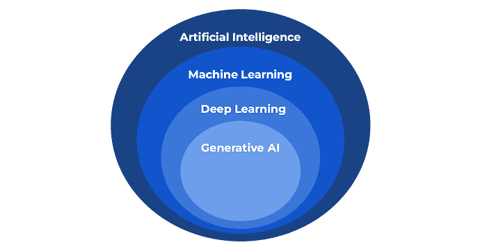

# 最受欢迎的机器学习职位及其准备方法

> [`towardsdatascience.com/top-machine-learning-jobs-and-how-to-prepare-for-them/`](https://towardsdatascience.com/top-machine-learning-jobs-and-how-to-prepare-for-them/)

<mdspan datatext="el1747889275317" class="mdspan-comment">这些</mdspan>天，像 *数据科学家*、*机器学习工程师* 和 *AI 工程师* 这样的职位无处不在——如果你像我一样，如果你不在该领域工作，可能会很难理解他们实际上做什么。

然后还有一些听起来更令人困惑的职位名称，比如 *量子区块链 LLM 机器人工程师*（好吧，这是我编造的，但你应该明白我的意思）。

人才市场上充满了各种术语和重叠的角色，如果你对机器学习职业感兴趣，可能会很难知道从哪里开始。

在这篇文章中，我将分解顶级机器学习职位，并解释每个职位涉及的内容——以及你需要做什么来为它们做准备。

## 数据科学家

### 那是什么？

数据科学家是最为人所熟知的角色，但承担的工作职责范围最广。

通常，数据科学家有两种类型：

+   分析和实验导向。

+   机器学习和建模导向。

前者包括运行 A/B 测试、进行深度分析以确定业务可以改进的地方，并通过识别其盲点来提出改进机器学习模型的建议。这项工作很多被称为解释性数据分析或简称为 EDA。

后者主要关于构建有助于业务的 PoC 机器学习模型和决策系统。然后，与软件和机器学习工程师合作，将这些模型部署到生产环境中并监控其性能。

许多机器学习算法通常较为简单，并且是常规的监督学习和无监督学习模型，例如：

+   XGBoost

+   线性和逻辑回归

+   随机森林

+   K-means 聚类

我在我以前的公司是一名数据科学家，但我主要构建机器学习模型，并没有运行很多 A/B 测试或实验。那是数据分析师和产品分析师进行的工作。

然而，在我目前的公司，数据科学家并不构建机器学习模型，而是主要进行深度分析和测量实验。模型开发主要由机器学习工程师完成。

这一切都归结于公司。因此，确保你阅读职位描述，确保这是适合你的工作，非常重要。

### 他们使用什么？

作为数据科学家，以下是你通常需要了解的内容（这不是详尽的，并且会因角色而异）：

+   Python 和 SQL

+   Git 和 GitHub

+   命令行（Bash 和 Zsh）

+   统计学和数学知识

+   基础机器学习技能

+   一些云系统知识（AWS、Azure、GCP）

如果你对这个角色感兴趣，以下是我为你准备的成为数据科学家的路线图。

> [如果我要重新开始，我将如何成为一名数据科学家](https://towardsdatascience.com/how-id-become-a-data-scientist-if-i-had-to-start-over-d966a9de12c2/)

## 机器学习工程师

### 它是什么？

正如标题所暗示的，机器学习工程师的一切都是关于构建机器学习模型并将它们部署到生产系统中。

它最初来自软件工程，但现在已经成为一个独立的职位/头衔。

机器学习工程师和数据科学家之间的显著区别在于，机器学习工程师部署算法。

如领先的 AI/ML 实践者[Chip Huyen](https://huyenchip.com/ml-interviews-book/contents/1.1.3.3-machine-learning-engineer-vs.-data-scientist.html)所说：

> *数据科学的目的是**生成商业洞察力**，而机器学习工程的目标是**将数据转化为产品**。*

你会发现数据科学家通常来自强大的数学、统计学或经济学背景，而机器学习工程师则更多来自科学和工程背景。

然而，这个角色有很大的重叠，一些公司可能会将数据科学家和机器学习工程师职位合并为一个职位，通常使用数据科学家的头衔。

机器学习工程师的职位通常在更成熟的科技公司中找到；然而，随着时间的推移，它正逐渐变得更加流行。

在机器学习工程师角色中，也存在进一步的专长，如：

+   机器学习平台工程师

+   机器学习硬件工程师

+   机器学习解决方案架构师

如果你是一个初学者，不必担心这些，因为它们相当小众，并且只有在该领域有几年经验后才相关。我只是想添加这些，让你知道市场上各种选择。

### 他们使用什么？

对于机器学习工程师和数据科学家来说，技术栈相当相似，但包含更多的软件工程元素：

+   然而，尽管需要 Python 和 SQL，但一些公司可能需要其他语言。例如，在我目前的工作中，需要 Rust 语言。

+   Git 和 GitHub

+   Bash 和 Zsh

+   AWS、Azure 或 GCP

+   软件工程基础，如 CI/CD、MLOps 和 Docker。

+   优秀的机器学习知识，理想情况下是某个领域的专长。

## AI 工程师

### 它是什么？

这是一个随着现在 AI 炒作而出现的新头衔，坦白说，我认为这个头衔很奇怪，实际上并不必要。通常，机器学习工程师在大多数公司中最多会承担 AI 工程师的角色。

大多数 AI 工程师角色实际上都是关于生成式 AI，而不是整个 AI 领域。这种区别通常对行业外的人来说没有意义。

然而，AI 几乎涵盖了任何决策算法，并且比机器学习领域更大。

图片由作者提供。

当前 AI 工程师的定义是那些主要使用 LLM 和生成式 AI 工具来帮助业务的人。

他们并不一定从头开始开发底层算法，主要是因为除非你在研究实验室，否则很难做到，而且许多顶级模型都是开源的，所以你不需要重新发明轮子。

相反，他们首先关注适应和构建产品，然后再考虑模型微调。因此，他们...

这个角色与传统软件工程师的角色相比要接近得多。尽管许多机器学习工程师会作为 AI 工程师工作，但这个职位是新的，还没有完全明确。

### 他们使用什么？

这个角色正在经历很大的变化，但总的来说，你需要对最新的 GenAI 和 LLM 趋势有很好的了解：

+   稳定的软件工程技能

+   Python、SQL 以及 Java 或 GO 等后端语言很有用

+   持续集成/持续部署

+   Git

+   大型语言模型和转换器

+   RAG

+   提示工程

+   基础模型

+   微调

> 我还推荐你查看 Datacamp 的数据科学家 AI 工程师副修课程，这将为你成为一名数据科学家的事业打下良好的基础。这在下面的描述中有链接。

## 研究科学家/工程师

### 那是什么呢？

之前的主要是行业职位，但接下来的两个将是基于研究的。

行业角色主要与商业相关，都是关于创造商业价值。无论你使用线性回归还是转换器模型，重要的是影响，而不是方法。

研究旨在从理论和实践上扩展当前的知识能力。这种方法围绕科学方法和在特定领域的深入实验。

研究和行业之间的区别是模糊的，并且经常重叠。例如，许多顶级研究实验室实际上是大型科技公司：

+   Meta Research

+   谷歌 AI

+   微软 AI

这些公司最初是为了解决商业问题而开始的，但现在它们有专门的研究部门，因此你可能会在行业和研究问题上工作。一个开始和另一个结束的地方并不总是很清楚。

如果你想要更深入地了解研究和行业之间的差异，我建议你阅读这份文档。这是斯坦福 CS 329S 的第一讲：理解机器学习生产[链接](https://docs.google.com/document/d/1VuofeF5okBATz1F7HRQmOgi5Jc4bmUiHMYjRqwF-29s/edit?usp=sharing)。

通常情况下，行业职位比研究职位多，因为只有大型公司才能承担数据和处理成本。

总之，作为一名研究工程师或科学家，你将主要致力于前沿研究，推动机器学习知识的边界。

这两个职位之间有一些细微的区别。作为一名研究科学家，你需要拥有博士学位，但对于研究工程师来说，这并不一定成立。

研究工程师通常负责实施研究科学家的理论细节和想法。这个角色通常在大型的、已建立的研究公司中；在大多数情况下，研究工程师和科学家的职位是相同的。

公司可能会提供研究科学家的头衔，因为它给你更多的“影响力”，并使你更有可能接受这份工作。

### 他们使用什么？

这个领域与机器学习工程类似，但知识的深度和资质要求通常更高。

+   Python 和 SQL

+   Git 和 GitHub

+   Bash 和 Zsh

+   AWS、Azure 或 GCP

+   软件工程基础，如 CI/CD、MLOps 和 Docker。

+   优秀的机器学习知识，以及在计算机视觉、强化学习、LLM 等前沿领域的专业。

+   博士或至少相关学科的硕士学位。

+   研究经验。

* * *

这篇文章只是刚刚触及了机器学习角色的表面，还有更多我提到的这四个或五个领域内的细分工作和专业。

我总是建议通过进入门槛并转向你想要的方向来开始你的职业生涯。这种策略比只专注于一个角色的隧道视野更有效。

## 另一件事！

我提供一对一的辅导通话，我们可以讨论你需要的一切——无论是项目、职业建议，还是只是确定你的下一步。我在这里帮助你前进！

[**1:1 与 Egor Howell 的辅导通话**](https://topmate.io/egorhowell/1203300)

*职业指导、求职建议、项目帮助、简历审查*topmate.io](https://topmate.io/egorhowell/1203300)

## 与我联系

+   [**YouTube**](https://www.youtube.com/@egorhowell)

+   [**LinkedIn**](https://www.linkedin.com/in/egorhowell/)

+   [**Instagram**](https://www.instagram.com/egorhowell/)

+   [**网站**](https://egorhowell.com/)
