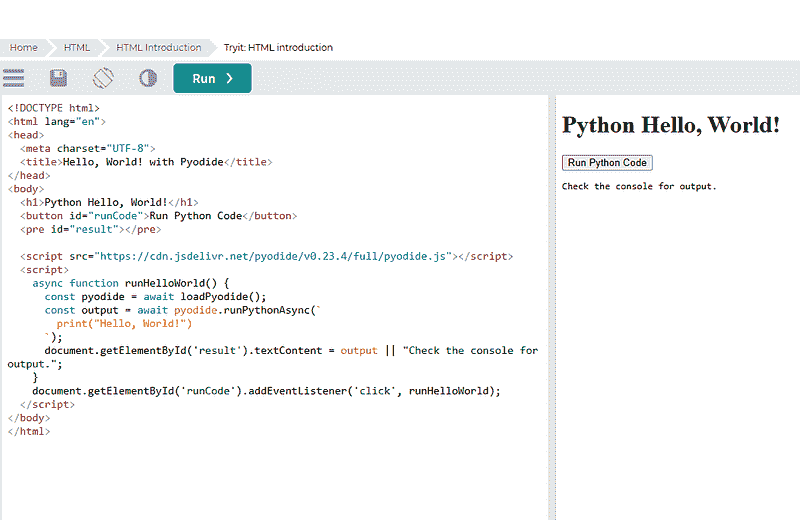
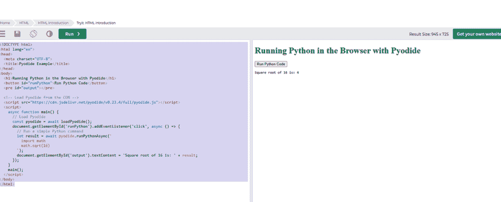
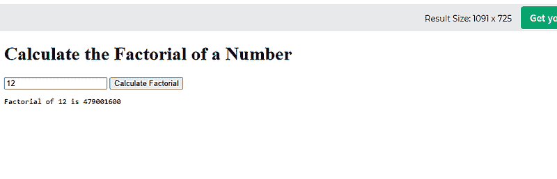
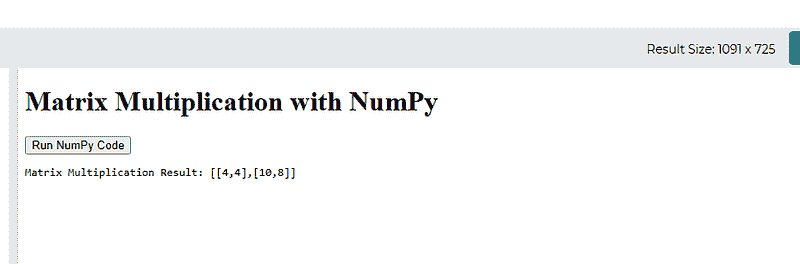
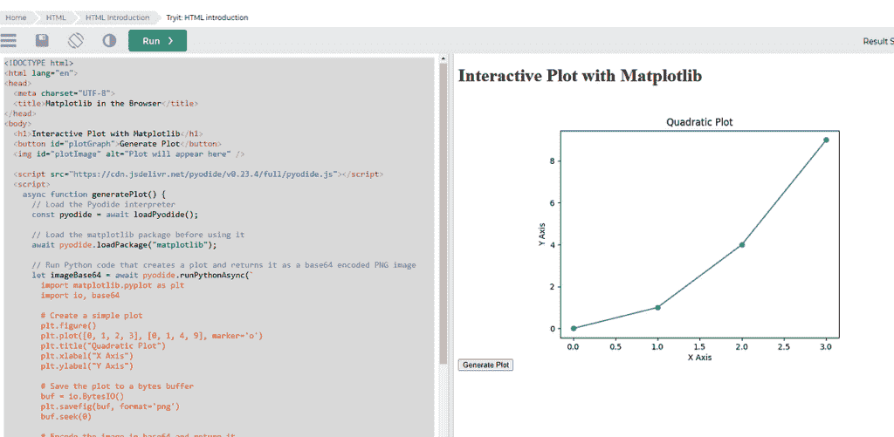
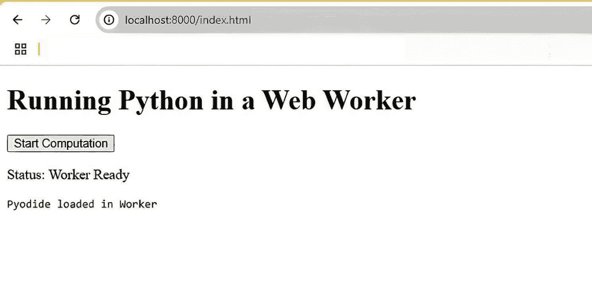
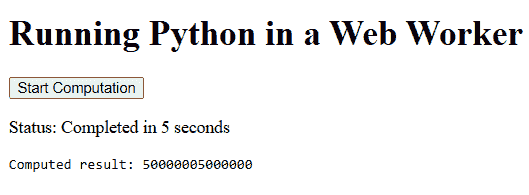
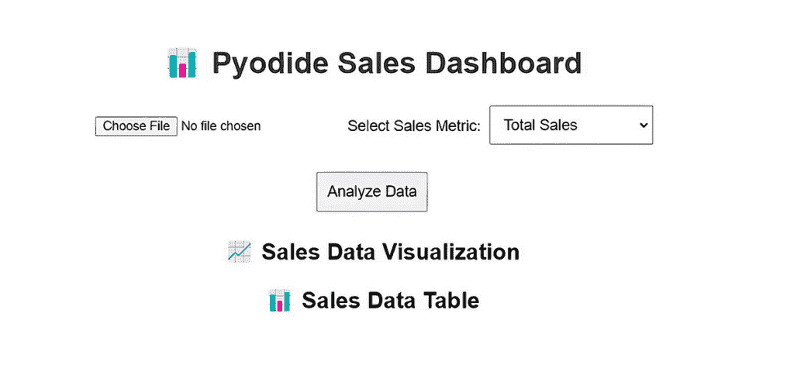
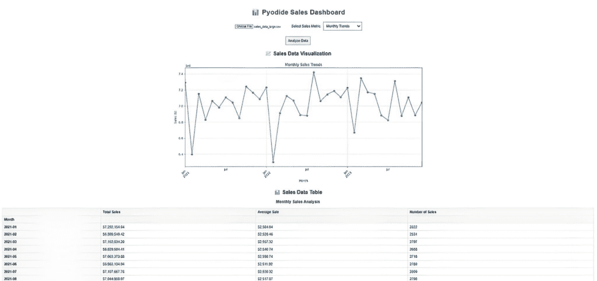

# 在浏览器中运行 Python 程序

> [在浏览器中运行 Python 程序](https://towardsdatascience.com/running-python-programs-in-your-browser/)

<mdspan datatext="el1746865029470" class="mdspan-comment">在</mdspan>近年来，WebAssembly（通常缩写为 WASM）已经出现成为一种有趣的技术，它扩展了 Web 浏览器的功能，远远超出了传统的 HTML、CSS 和 JavaScript 领域。

作为 Python 开发者，一个特别令人兴奋的应用是能够在浏览器中直接运行 Python 代码。在这篇文章中，我将探讨 WebAssembly 是什么（及其与 Pyodide 库的关系），讨论其优势和日常使用案例，并深入探讨一些实际示例，说明您如何使用 WebAssembly 在 Web 上运行 Python 程序。

这些工具也可以惠及数据科学家和机器学习专业人士。Pyodide 将科学 Python 栈的大部分内容（NumPy、Pandas、Scikit-learn、Matplotlib、SciPy 等）带到了浏览器中，这意味着在代码开发期间可以使用熟悉的工具和库。它也可以用于演示目的。正如您将在我的最终示例中看到的那样，结合 Python 的数据处理能力与 HTML、CSS 和 JavaScript 进行 UI 开发，您可以快速构建交互式仪表板或工具，而无需为许多用例单独的后端。

#### 什么是 WebAssembly？

WebAssembly 是一种低级二进制指令格式，旨在作为编译高级语言（如 C、C++、Rust 甚至 Python）的可移植目标。它是为了在 Web 上实现高性能应用程序而创建的，避免了传统 JavaScript 执行的一些缺陷，例如运行时速度慢。WebAssembly 的一些关键特性包括：

+   **可移植性**。WebAssembly 模块在所有现代浏览器上运行一致。

+   **性能**。二进制格式紧凑，可以快速解析，这允许接近原生的执行速度。

+   **安全性**。在沙盒环境中运行，WebAssembly 提供了强大的安全保证。

+   **语言无关性**。尽管浏览器主要支持 JavaScript，但 WebAssembly 允许开发者用其他语言编写代码并将其编译成 WebAssembly（wasm）。

#### WebAssembly 可以用作什么？

WebAssembly 具有广泛的应用。其中一些最常见的使用案例包括：-

1.  **高性能 Web 应用**。WebAssembly 可以帮助游戏、图像和视频编辑器以及模拟等应用程序实现接近原生的性能。

1.  **移植遗留代码**。用 C、C++或 Rust 编写的代码可以编译成 WebAssembly，允许开发者在 Web 上重用现有的库和代码库。

1.  **多媒体处理**。音频和视频处理库得益于 WebAssembly 的速度，使得实时处理更复杂的任务成为可能。

1.  **科学计算**。机器学习、数据可视化或数值模拟等重型计算可以卸载到 WebAssembly 模块中。

1.  **运行多种语言。**像 Pyodide 这样的项目允许 Python（及其广泛的生态系统）在浏览器中执行，而不需要服务器后端。

如果你经常用 Python 编码，那么最后一个点可能会让你感到好奇，所以让我们更深入地探讨这个方面。

#### 在 Web 上运行 Python

传统上，Python 在服务器或桌面应用程序上运行。然而，多亏了像[**Pyodide**](https://pyodide.org/)这样的倡议，Python 可以通过 WebAssembly 在浏览器中运行。Pyodide 将 CPython 解释器代码编译成 WebAssembly，允许你在你的 Web 应用程序中直接执行 Python 代码并使用许多流行的第三方库。

这不仅仅是一个噱头。这样做有几个优点，包括：-

+   使用 Python 广泛的库生态系统，包括数据科学（NumPy、Pandas、Matplotlib）和机器学习（Scikit-Learn、TensorFlow）的包。

+   响应性增强，因为需要的往返服务器次数更少。

+   部署更简单，因为整个应用程序逻辑可以驻留在前端。

我们已经提到了 Pyodide 几次，所以让我们更仔细地看看 Pyodide 究竟是什么。

#### 什么是 Pyodide

Pyodide 背后的想法源于在浏览器中直接运行 Python 代码而不依赖传统服务器设置的日益增长的需求。传统上，Web 应用程序依赖于 JavaScript 进行客户端交互，将 Python 局限于后端或桌面应用程序。然而，随着 WebAssembly 的出现，出现了弥合这一差距的机会。

Mozilla Research 认识到这种方法的前景，并着手将 CPython（Python 的参考实现）使用 Emscripten 工具链移植到 WebAssembly。这项工作是在浏览器中运行 Python 并解锁由 Python 丰富的数据科学、数值计算等库支持的新交互式客户端应用程序。

总结一下，Pyodide 的核心是将 CPython 编译成 WebAssembly 的移植。这意味着当你使用 Pyodide 在浏览器中运行 Python 代码时，你执行的是一个针对 Web 环境优化的完全功能的 Python 解释器。

好的，是时候看看一些代码了。

#### 设置开发环境

在我们开始编码之前，让我们设置我们的开发环境。最佳实践是创建一个单独的 Python 环境，在那里你可以安装任何必要的软件并尝试编码，知道你在该环境中所做的任何操作都不会影响你的整个系统。

我使用 conda 来做这件事，但你可以使用你最熟悉的方法。请注意，我使用的是 Linux（Windows 上的 WSL2）。

```py
#create our test environment
(base) $ conda create -n wasm_test python=3.12 -y

# Now activate it
(base) $ conda activate wasm_test
```

现在我们已经设置了环境，我们可以安装所需的库和软件。

```py
# 
#
(wasm_test) $ pip install jupyter nest-asyncio
```

现在在您的命令提示符中输入 `jupyter notebook`。您应该在浏览器中打开一个 jupyter notebook。如果它没有自动打开，您可能会在 `jupyter notebook` 命令后看到一屏的信息。在底部附近，将有一个 URL，您应该将其复制并粘贴到浏览器中以启动 Jupyter Notebook。

您的 URL 将与我的不同，但它应该看起来像这样：-

```py
http://127.0.0.1:8888/tree?token=3b9f7bd07b6966b41b68e2350721b2d0b6f388d248cc69da
```

#### 代码示例 1 — 使用 Pyodide 的“Hello World”等效

让我们从最简单的例子开始。将 Pyodide 包含到您的 HTML 页面中最简单的方法是通过内容分发网络（CDN）。然后我们打印出文本“Hello World!”

```py
<!DOCTYPE html>
<html lang="en">
<head>
  <meta charset="UTF-8">
  <title>Hello, World! with Pyodide</title>
</head>
<body>
  <h1>Python Hello, World!</h1>
  <button id="runCode">Run Python Code</button>
  <pre id="result"></pre>

  <script src="https://cdn.jsdelivr.net/pyodide/v0.23.4/full/pyodide.js"></script>
  <script>
    async function runHelloWorld() {
      const pyodide = await loadPyodide();
      const output = await pyodide.runPythonAsync(`
        print("Hello, World!")
      `);
      document.getElementById('result').textContent = output || "Check the console for output.";
    }
    document.getElementById('runCode').addEventListener('click', runHelloWorld);
  </script>
</body>
</html>
```

我在 [W3Schools HTML TryIt](https://www.w3schools.com/html/tryit.asp?filename=tryhtml_headings) 编辑器中运行了上述代码，并得到了这个结果，



图片由作者提供

当按钮被点击时，Pyodide 将运行打印“Hello, World!”的 Python 代码。默认情况下，它将打印到控制台，我们将在下一个示例中修复这个问题。

#### 代码示例 2 — 将输出打印到浏览器

在我们的第二个示例中，我们将使用 Pyodide 在浏览器中运行 Python 代码，该代码将执行一个简单的数学计算。在这种情况下，我们将计算 16 的平方根并将结果输出到浏览器。

```py
<!DOCTYPE html>
<html lang="en">
<head>
  <meta charset="UTF-8">
  <title>Pyodide Example</title>
</head>
<body>
  <h1>Running Python in the Browser with Pyodide</h1>
  <button id="runPython">Run Python Code</button>
  <pre id="output"></pre>

  <!-- Load Pyodide from the CDN -->
  <script src="https://cdn.jsdelivr.net/pyodide/v0.23.4/full/pyodide.js"></script>
  <script>
    async function main() {
      // Load Pyodide
      const pyodide = await loadPyodide();
      document.getElementById('runPython').addEventListener('click', async () => {
        // Run a simple Python command
        let result = await pyodide.runPythonAsync(`
          import math
          math.sqrt(16)
        `);
        document.getElementById('output').textContent = 'Square root of 16 is: ' + result;
      });
    }
    main();
  </script>
</body>
</html>
```

在 W3Schools TryIT 浏览器中运行上述代码，我得到了这个输出。



图片由作者提供

#### 代码示例 3 – 从 JavaScript 调用 Python 函数

使用 Pyodide 的另一个有价值且强大的功能是能够从 JavaScript 调用 Python 函数，反之亦然。

在这个示例中，我们创建了一个执行简单数学运算的 Python 函数——计算一个数的阶乘，并从 JavaScript 代码中调用它。

```py
<!DOCTYPE html>
<html lang="en">
<head>
  <meta charset="UTF-8">
  <title>Call Python from JavaScript</title>
</head>
<body>
  <h1>Calculate the Factorial of a Number</h1>
  <input type="number" id="numberInput" placeholder="Enter a number" />
  <button id="calcFactorial">Calculate Factorial</button>
  <pre id="result"></pre>

  <script src="https://cdn.jsdelivr.net/pyodide/v0.23.4/full/pyodide.js"></script>
  <script>
    let pyodideReadyPromise = loadPyodide();

    async function calculateFactorial() {
      const pyodide = await pyodideReadyPromise;
      // Define a Python function for calculating factorial
      await pyodide.runPythonAsync(`
        def factorial(n):
            if n == 0:
                return 1
            else:
                return n * factorial(n - 1)
      `);
      // Get the input value from the HTML form
      const n = Number(document.getElementById('numberInput').value);
      // Call the Python factorial function
      let result = pyodide.globals.get("factorial")(n);
      document.getElementById('result').textContent = `Factorial of ${n} is ${result}`;
    }

    document.getElementById('calcFactorial').addEventListener('click', calculateFactorial);
  </script>
</body>
</html>
```

这里是运行在 W3Schools 时的一个示例输出。这次我不会包括代码部分，只展示输出。



图片由作者提供

#### 代码示例 4 — 使用 Python 库，例如 NumPy

Python 的强大之处在于其丰富的库生态系统。使用 Pyodide，您可以导入和使用像 NumPy 这样的流行库进行数值计算。

以下示例演示了如何在浏览器中使用 NumPy 执行数组操作。NumPy 库是通过 **pyodide.loadPackage** 函数加载的。

```py
<!DOCTYPE html>
<html lang="en">
<head>
  <meta charset="UTF-8">
  <title>NumPy in the Browser</title>
</head>
<body>
  <h1>Matrix Multiplication with NumPy</h1>
  <button id="runNumPy">Run NumPy Code</button>
  <pre id="numpyResult"></pre>

  <script src="https://cdn.jsdelivr.net/pyodide/v0.23.4/full/pyodide.js"></script>
  <script>
    async function runNumPyCode() {
      // Load the Pyodide interpreter
      const pyodide = await loadPyodide();

      // Load the NumPy package before using it
      await pyodide.loadPackage("numpy");

      // Run Python code to perform a matrix multiplication
      let result = await pyodide.runPythonAsync(`
        import numpy as np
        A = np.array([[1, 2], [3, 4]])
        B = np.array([[2, 0], [1, 2]])
        C = np.matmul(A, B)
        C.tolist()  # Convert the numpy array to a Python list for display
      `);

      // Convert the Python result (PyProxy) to a native JavaScript object
      // so it displays properly
      document.getElementById('numpyResult').textContent =
        'Matrix Multiplication Result: ' + JSON.stringify(result.toJs());
    }

    // Set up the event listener for the button
    document.getElementById('runNumPy').addEventListener('click', runNumPyCode);
  </script>
</body>
</html>
```



图片由作者提供

#### 代码示例 5 — 使用 Python 库，例如 matplotlib

在浏览器中运行 Python 的另一个强大方面是能够生成可视化。使用 Pyodide，您可以使用像 Matplotlib 这样的 GUI 库动态地创建图表。以下是如何在画布元素上生成和显示一个简单图表的示例。

在这个示例中，我们使用 Matplotlib 创建一个二次图（y = x²），将图像保存到内存缓冲区作为 PNG 格式，并在显示之前将其编码为 base64 字符串。

```py
<!DOCTYPE html>
<html lang="en">
<head>
  <meta charset="UTF-8">
  <title>Matplotlib in the Browser</title>
</head>
<body>
  <h1>Interactive Plot with Matplotlib</h1>
  <button id="plotGraph">Generate Plot</button>
  

  <script src="https://cdn.jsdelivr.net/pyodide/v0.23.4/full/pyodide.js"></script>
  <script>
    async function generatePlot() {
      // Load the Pyodide interpreter
      const pyodide = await loadPyodide();

      // Load the matplotlib package before using it
      await pyodide.loadPackage("matplotlib");

      // Run Python code that creates a plot and returns it as a base64 encoded PNG image
      let imageBase64 = await pyodide.runPythonAsync(`
        import matplotlib.pyplot as plt
        import io, base64

        # Create a simple plot
        plt.figure()
        plt.plot([0, 1, 2, 3], [0, 1, 4, 9], marker='o')
        plt.title("Quadratic Plot")
        plt.xlabel("X Axis")
        plt.ylabel("Y Axis")

        # Save the plot to a bytes buffer
        buf = io.BytesIO()
        plt.savefig(buf, format='png')
        buf.seek(0)

        # Encode the image in base64 and return it
        base64.b64encode(buf.read()).decode('ascii')
      `);

      // Set the src attribute of the image element to display the plot
      document.getElementById('plotImage').src = "data:image/png;base64," + imageBase64;
    }

    // Add event listener to the button to generate the plot
    document.getElementById('plotGraph').addEventListener('click', generatePlot);
  </script>
</body>
</html>
```



图片由作者提供

#### 代码示例 6：在 Web Worker 中运行 Python

对于更复杂的应用或当您需要确保重计算不会阻塞主 UI 线程时，您可以在[Web Worker](https://developer.mozilla.org/en-US/docs/Web/API/Web_Workers_API)中运行 Pyodide。Web Workers 允许您在后台线程中运行脚本，保持您的应用程序响应。

下面是如何在 Web Worker 中设置 Pyodide 的示例。我们通过使用**sleep()**函数引入延迟来执行计算，并模拟计算运行了一段时间。我们还显示了一个持续更新的计数器，显示主 UI 正常运行并正常响应。

我们需要三个文件来完成这个任务：一个 index.html 文件和两个 JavaScript 文件。

**index.html**

```py
<!DOCTYPE html>
<html lang="en">
<head>
  <meta charset="UTF-8">
  <title>Pyodide Web Worker Example</title>
</head>
<body>
  <h1>Running Python in a Web Worker</h1>
  <button id="startWorker">Start Computation</button>
  <p id="status">Status: Idle</p>
  <pre id="workerOutput"></pre>
  <script src="main.js"></script>
</body>
</html>
```

**worker.js**

```py
// Load Pyodide from the CDN inside the worker
self.importScripts("https://cdn.jsdelivr.net/pyodide/v0.23.4/full/pyodide.js");

async function initPyodide() {
  self.pyodide = await loadPyodide();
  // Inform the main thread that Pyodide has been loaded
  self.postMessage("Pyodide loaded in Worker");
}

initPyodide();

// Listen for messages from the main thread
self.onmessage = async (event) => {
  if (event.data === 'start') {
    // Execute a heavy computation in Python within the worker.
    // The compute function now pauses for 0.5 seconds every 1,000,000 iterations.
    let result = await self.pyodide.runPythonAsync(`
import time
def compute():
    total = 0
    for i in range(1, 10000001):  # Loop from 1 to 10,000,000
        total += i
        if i % 1000000 == 0:
            time.sleep(0.5)  # Pause for 0.5 seconds every 1,000,000 iterations
    return total
compute()
    `);
    // Send the computed result back to the main thread
    self.postMessage("Computed result: " + result);
  }
};
```

**main.js**

```py
// Create a new worker from worker.js
const worker = new Worker('worker.js');

// DOM elements to update status and output
const statusElement = document.getElementById('status');
const outputElement = document.getElementById('workerOutput');
const startButton = document.getElementById('startWorker');

let timerInterval;
let secondsElapsed = 0;

// Listen for messages from the worker
worker.onmessage = (event) => {
  // Append any message from the worker to the output
  outputElement.textContent += event.data + "\n";

  if (event.data.startsWith("Computed result:")) {
    // When computation is complete, stop the timer and update status
    clearInterval(timerInterval);
    statusElement.textContent = `Status: Completed in ${secondsElapsed} seconds`;
  } else if (event.data === "Pyodide loaded in Worker") {
    // Update status when the worker is ready
    statusElement.textContent = "Status: Worker Ready";
  }
};

// When the start button is clicked, begin the computation
startButton.addEventListener('click', () => {
  // Reset the display and timer
  outputElement.textContent = "";
  secondsElapsed = 0;
  statusElement.textContent = "Status: Running...";

  // Start a timer that updates the main page every second
  timerInterval = setInterval(() => {
    secondsElapsed++;
    statusElement.textContent = `Status: Running... ${secondsElapsed} seconds elapsed`;
  }, 1000);

  // Tell the worker to start the heavy computation
  worker.postMessage('start');
});
```

要运行此代码，创建上述所有三个文件，并将它们放在您本地系统上的同一目录中。在那个目录中，输入以下命令。

```py
$ python -m http.server 8000
```

现在，在您的浏览器中输入以下 URL。

```py
http://localhost:8000/index.html
```

您应该看到一个类似的屏幕。



图片由作者提供

现在，如果您按下 `<strong>开始计算</strong>` 按钮，您应该在屏幕上看到一个计数器显示，从 1 开始，每秒增加 1，直到计算完成并显示最终结果——总共大约 5 秒。

这表明前端逻辑和计算不受按钮背后 Python 代码执行工作的影响。



图片由作者提供

#### 代码示例 7：运行简单的数据仪表板

对于我们的最终示例，我将向您展示如何在浏览器中直接运行一个简单的数据仪表板。我们的源数据将是 CSV 文件中的合成销售数据。

我们需要三个文件来完成这个任务，所有这些文件都应该在同一个文件夹中。

**sales_data.csv**

我使用的文件有 10 万条记录，但您可以将其文件大小调整为任意大小。以下是前 20 条记录，以供您了解数据的外观。

```py
Date,Category,Region,Sales
2021-01-01,Books,West,610.57
2021-01-01,Beauty,West,2319.0
2021-01-01,Electronics,North,4196.76
2021-01-01,Electronics,West,1132.53
2021-01-01,Home,North,544.12
2021-01-01,Beauty,East,3243.56
2021-01-01,Sports,East,2023.08
2021-01-01,Fashion,East,2540.87
2021-01-01,Automotive,South,953.05
2021-01-01,Electronics,North,3142.8
2021-01-01,Books,East,2319.27
2021-01-01,Sports,East,4385.25
2021-01-01,Beauty,North,2179.01
2021-01-01,Fashion,North,2234.61
2021-01-01,Beauty,South,4338.5
2021-01-01,Beauty,East,783.36
2021-01-01,Sports,West,696.25
2021-01-01,Electronics,South,97.03
2021-01-01,Books,West,4889.65
```

**index.html**

这是我们的仪表板的主要 GUI 界面。

```py
<!DOCTYPE html>
<html lang="en">
<head>
    <meta charset="UTF-8">
    <meta name="viewport" content="width=device-width, initial-scale=1.0">
    <title>Pyodide Sales Dashboard</title>
    <style>
        body { font-family: Arial, sans-serif; text-align: center; padding: 20px; }
        h1 { color: #333; }
        input { margin: 10px; }
        select, button { padding: 10px; font-size: 16px; margin: 5px; }
        img { max-width: 100%; display: block; margin: 20px auto; }
        table { width: 100%; border-collapse: collapse; margin-top: 20px; }
        th, td { border: 1px solid #ddd; padding: 8px; text-align: left; }

        th { background-color: #f4f4f4; }
  .sortable th {
   cursor: pointer;
   user-select: none;
  }
  .sortable th:hover {
   background-color: #e0e0e0;
  }
    </style>
    <script src="https://cdn.jsdelivr.net/pyodide/v0.23.4/full/pyodide.js"></script>
</head>
<body>

    <h1>📊 Pyodide Sales Dashboard</h1>

    <input type="file" id="csvUpload" accept=".csv">

    <label for="metricSelect">Select Sales Metric:</label>
    <select id="metricSelect">
        <option value="total_sales">Total Sales</option>
        <option value="category_sales">Sales by Category</option>
        <option value="region_sales">Sales by Region</option>
        <option value="monthly_trends">Monthly Trends</option>
    </select>

    <br><br>
    <button id="analyzeData">Analyze Data</button>

    <h2>📈 Sales Data Visualization</h2>
    
    <h2>📊 Sales Data Table</h2>
    <div id="tableOutput"></div>

    <script src="main.js"></script>

</script>

</body>
</html>
```

**main.js**

这包含我们的主要 Python pyodide 代码。

```py
async function loadPyodideAndRun() {
  const pyodide = await loadPyodide();
  await pyodide.loadPackage(["numpy", "pandas", "matplotlib"]);

  document.getElementById("analyzeData").addEventListener("click", async () => {
    const fileInput = document.getElementById("csvUpload");
    const selectedMetric = document.getElementById("metricSelect").value;
    const chartImage = document.getElementById("chartImage");
    const tableOutput = document.getElementById("tableOutput");

    if (fileInput.files.length === 0) {
      alert("Please upload a CSV file first.");
      return;
    }

    // Read the CSV file
    const file = fileInput.files[0];
    const reader = new FileReader();
    reader.readAsText(file);

    reader.onload = async function (event) {
      const csvData = event.target.result;

      await pyodide.globals.set('csv_data', csvData);
      await pyodide.globals.set('selected_metric', selectedMetric);

      const pythonCode = 
        'import sys\n' +
        'import io\n' +
        'import numpy as np\n' +
        'import pandas as pd\n' +
        'import matplotlib\n' +
        'matplotlib.use("Agg")\n' +
        'import matplotlib.pyplot as plt\n' +
        'import base64\n' +
        '\n' +
        '# Capture output\n' +
        'output_buffer = io.StringIO()\n' +
        'sys.stdout = output_buffer\n' +
        '\n' +
        '# Read CSV directly using csv_data from JavaScript\n' +
        'df = pd.read_csv(io.StringIO(csv_data))\n' +
        '\n' +
        '# Ensure required columns exist\n' +
        'expected_cols = {"Date", "Category", "Region", "Sales"}\n' +
        'if not expected_cols.issubset(set(df.columns)):\n' +
        '    print("❌ CSV must contain \'Date\', \'Category\', \'Region\', and \'Sales\' columns.")\n' +
        '    sys.stdout = sys.__stdout__\n' +
        '    exit()\n' +
        '\n' +
        '# Convert Date column to datetime\n' +
        'df["Date"] = pd.to_datetime(df["Date"])\n' +
        '\n' +
        'plt.figure(figsize=(12, 6))\n' +
        '\n' +
        'if selected_metric == "total_sales":\n' +
        '    total_sales = df["Sales"].sum()\n' +
        '    print(f"💰 Total Sales: ${total_sales:,.2f}")\n' +
        '    # Add daily sales trend for total sales view\n' +
        '    daily_sales = df.groupby("Date")["Sales"].sum().reset_index()\n' +
        '    plt.plot(daily_sales["Date"], daily_sales["Sales"], marker="o")\n' +
        '    plt.title("Daily Sales Trend")\n' +
        '    plt.ylabel("Sales ($)")\n' +
        '    plt.xlabel("Date")\n' +
        '    plt.xticks(rotation=45)\n' +
        '    plt.grid(True, linestyle="--", alpha=0.7)\n' +
        '    # Show top sales days in table\n' +
        '    table_data = daily_sales.sort_values("Sales", ascending=False).head(10)\n' +
        '    table_data["Sales"] = table_data["Sales"].apply(lambda x: f"${x:,.2f}")\n' +
        '    print("<h3>Top 10 Sales Days</h3>")\n' +
        '    print(table_data.to_html(index=False))\n' +
        'elif selected_metric == "category_sales":\n' +
        '    category_sales = df.groupby("Category")["Sales"].agg([\n' +
        '        ("Total Sales", "sum"),\n' +
        '        ("Average Sale", "mean"),\n' +
        '        ("Number of Sales", "count")\n' +
        '    ]).sort_values("Total Sales", ascending=True)\n' +
        '    category_sales["Total Sales"].plot(kind="bar", title="Sales by Category")\n' +
        '    plt.ylabel("Sales ($)")\n' +
        '    plt.xlabel("Category")\n' +
        '    plt.grid(True, linestyle="--", alpha=0.7)\n' +
        '    # Format table data\n' +
        '    table_data = category_sales.copy()\n' +
        '    table_data["Total Sales"] = table_data["Total Sales"].apply(lambda x: f"${x:,.2f}")\n' +
        '    table_data["Average Sale"] = table_data["Average Sale"].apply(lambda x: f"${x:,.2f}")\n' +
        '    print("<h3>Sales by Category</h3>")\n' +
        '    print(table_data.to_html())\n' +
        'elif selected_metric == "region_sales":\n' +
        '    region_sales = df.groupby("Region")["Sales"].agg([\n' +
        '        ("Total Sales", "sum"),\n' +
        '        ("Average Sale", "mean"),\n' +
        '        ("Number of Sales", "count")\n' +
        '    ]).sort_values("Total Sales", ascending=True)\n' +
        '    region_sales["Total Sales"].plot(kind="barh", title="Sales by Region")\n' +
        '    plt.xlabel("Sales ($)")\n' +
        '    plt.ylabel("Region")\n' +
        '    plt.grid(True, linestyle="--", alpha=0.7)\n' +
        '    # Format table data\n' +
        '    table_data = region_sales.copy()\n' +
        '    table_data["Total Sales"] = table_data["Total Sales"].apply(lambda x: f"${x:,.2f}")\n' +
        '    table_data["Average Sale"] = table_data["Average Sale"].apply(lambda x: f"${x:,.2f}")\n' +
        '    print("<h3>Sales by Region</h3>")\n' +
        '    print(table_data.to_html())\n' +
        'elif selected_metric == "monthly_trends":\n' +
        '    df["Month"] = df["Date"].dt.to_period("M")\n' +
        '    monthly_sales = df.groupby("Month")["Sales"].agg([\n' +
        '        ("Total Sales", "sum"),\n' +
        '        ("Average Sale", "mean"),\n' +
        '        ("Number of Sales", "count")\n' +
        '    ])\n' +
        '    monthly_sales["Total Sales"].plot(kind="line", marker="o", title="Monthly Sales Trends")\n' +
        '    plt.ylabel("Sales ($)")\n' +
        '    plt.xlabel("Month")\n' +
        '    plt.xticks(rotation=45)\n' +
        '    plt.grid(True, linestyle="--", alpha=0.7)\n' +
        '    # Format table data\n' +
        '    table_data = monthly_sales.copy()\n' +
        '    table_data["Total Sales"] = table_data["Total Sales"].apply(lambda x: f"${x:,.2f}")\n' +
        '    table_data["Average Sale"] = table_data["Average Sale"].apply(lambda x: f"${x:,.2f}")\n' +
        '    print("<h3>Monthly Sales Analysis</h3>")\n' +
        '    print(table_data.to_html())\n' +
        '\n' +
        'plt.tight_layout()\n' +
        '\n' +
        'buf = io.BytesIO()\n' +
        'plt.savefig(buf, format="png", dpi=100, bbox_inches="tight")\n' +
        'plt.close()\n' +
        'img_data = base64.b64encode(buf.getvalue()).decode("utf-8")\n' +
        'print(f"IMAGE_START{img_data}IMAGE_END")\n' +
        '\n' +
        'sys.stdout = sys.__stdout__\n' +
        'output_buffer.getvalue()';

      const result = await pyodide.runPythonAsync(pythonCode);

      // Extract and display output with markers
      const imageMatch = result.match(/IMAGE_START(.+?)IMAGE_END/);
      if (imageMatch) {
        const imageData = imageMatch[1];
        chartImage.src = 'data:image/png;base64,' + imageData;
        chartImage.style.display = 'block';
        // Remove the image data from the result before showing the table
        tableOutput.innerHTML = result.replace(/IMAGE_START(.+?)IMAGE_END/, '').trim();
      } else {
        chartImage.style.display = 'none';
        tableOutput.innerHTML = result.trim();
      }
    };
  });
}

loadPyodideAndRun();
```

与前面的示例一样，您可以如下运行。创建所有三个文件，并将它们放在您本地系统上的同一目录中。在那个目录中，在命令终端中输入以下内容，

```py
$ python -m http.server 8000
```

现在，在您的浏览器中输入此 URL。

```py
http://localhost:8000/index.html
```

初始时，您的屏幕应该看起来像这样，



图片由作者提供

点击 `<strong>选择文件</strong>` 按钮，并选择您创建的数据文件以输入到您的仪表板中。之后，从 `<strong>选择销售指标</strong>` 下拉列表中选择一个合适的指标，然后点击 `<strong>分析数据</strong>` 按钮。根据您选择的显示选项，您应该在屏幕上看到类似的内容。



图片由作者提供

#### 摘要

在这篇文章中，我描述了如何使用 Pyodide 和 WebAssembly，在浏览器中运行 Python 程序，并展示了几个演示这一点的示例。我谈到了 WebAssembly 作为可移植、高性能的编译目标，它扩展了浏览器功能，以及这是如何在 Python 生态系统中通过第三方库 Pyodide 实现的。

为了展示 Pyodide 的强大和多功能性，我提供了几个使用示例，包括：-

+   一个基本的“Hello, World!”示例。

+   从 JavaScript 中调用 Python 函数。

+   利用 NumPy 进行数值运算。

+   使用 Matplotlib 生成可视化。

+   在 Web Worker 中运行计算密集型的 Python 代码。

+   数据仪表板

希望在阅读这篇文章后，你们会像我一样，意识到 Python、Pyodide 和网页浏览器的结合有多么强大。
