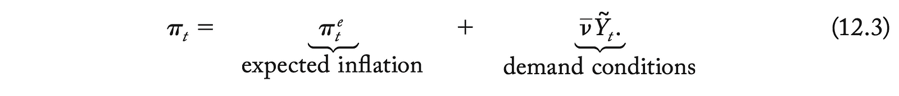
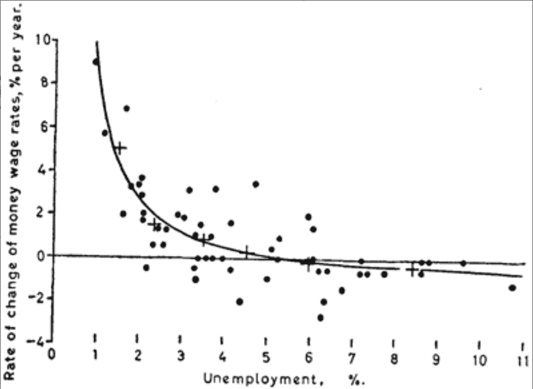
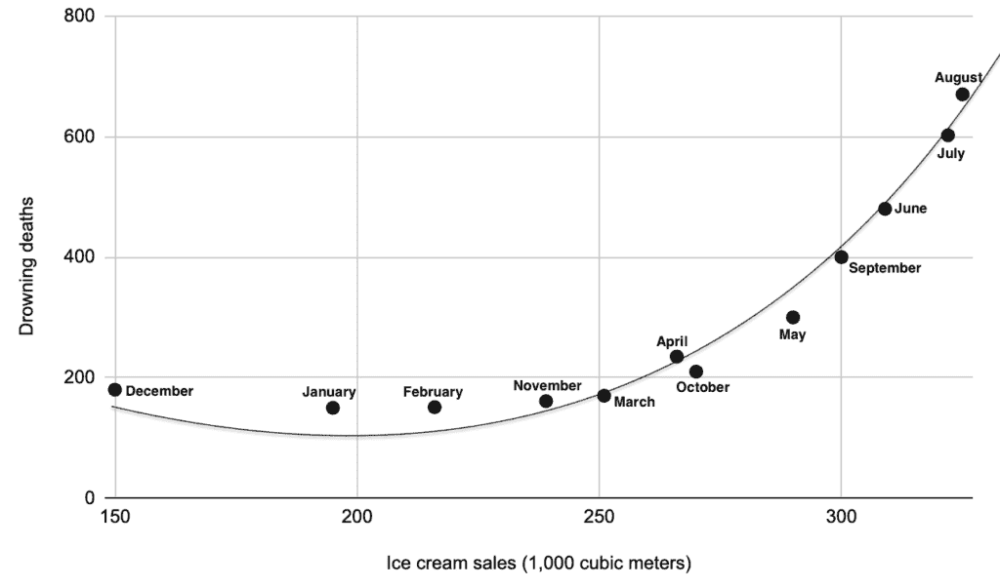
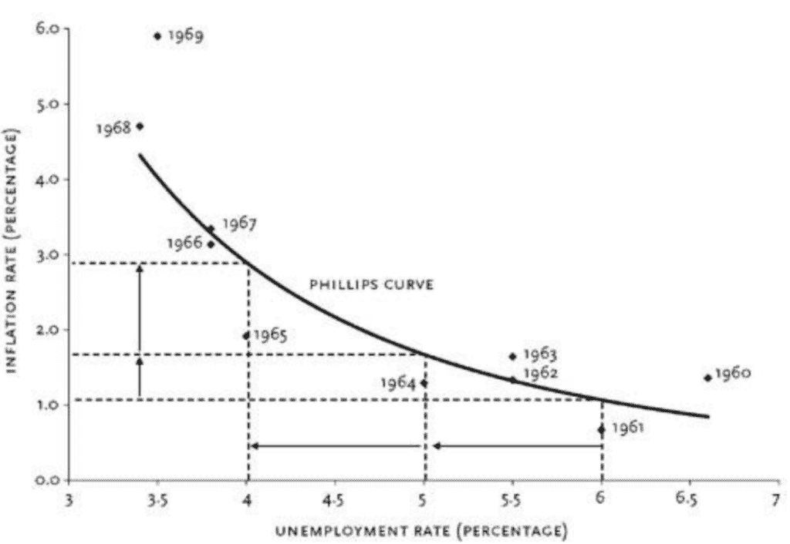
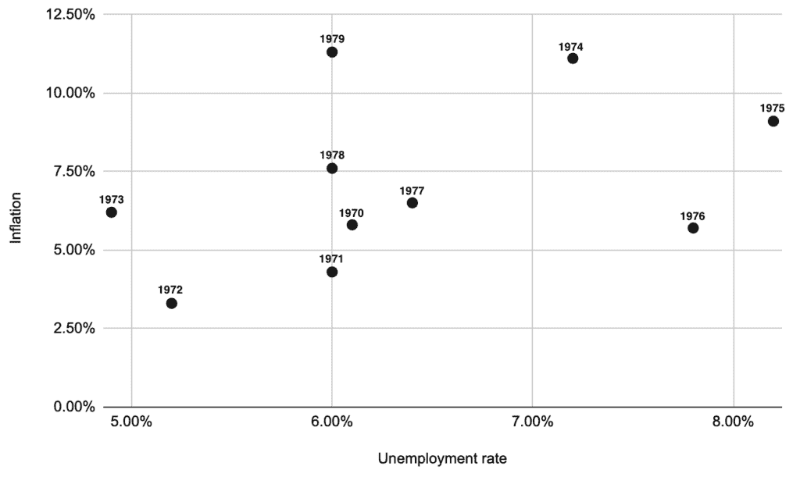

# 菲利普斯曲线的艺术

> [原文链接](https://towardsdatascience.com/the-art-of-the-phillips-curve/)

<mdspan datatext="el1747076437712" class="mdspan-comment">翻阅</mdspan>过去 50 年中任何一本流行的宏观经济学教科书，你很快就会翻到提到菲利普斯曲线的一页。然后又是另一页，接着又是另一页……

例如，宏观经济学教科书，由 C.琼斯创造性地命名为“宏观经济学”，是剑桥大学经济学学士学位课程的一部分，在这 67 页中引用了“菲利普斯曲线”惊人的 143 次，覆盖了 641 页砖书中的超过 10%，其篇幅比几乎所有其他宏观经济模型都要长，包括“MP 曲线”（24 页）、“Cobb-Douglas”生产函数（17 页）、“Romer 模型”（42 页）、“AS/AD 框架”（51 页）和“DSGE 模型”（42 页）。

简而言之，菲利普斯曲线在现代宏观经济学中是一个相当重要的话题。

至于那 67 页的内容，绝大多数是用来解释菲利普斯曲线的数学逻辑和科学方程式的。例如，以下是上述书中的一小部分样本：

> “…在正常时期，你预计经济中的价格将继续以 5%的速度上升，你也会以同样的幅度提高你的价格。然而，鉴于你所在行业的疲软，你可能会以低于 5%的幅度提高价格，以增加你商品的需求。这种推理促使了菲利普斯曲线背后的定价行为。回想一下**πt ≡ (Pt+1− Pt) / Pt**；也就是说，通货膨胀率是未来一年整体价格水平的百分比变化。企业根据他们对整个经济通货膨胀率的预期和他们对产品需求的状态来设定他们提高价格的数量：
> 
> 
> 
> 在这里，**π**et 表示预期的通货膨胀率——即企业认为在接下来的一年里整个经济中将会占主导地位的通货膨胀率……”
> 
> ***第 318-9 页，“宏观经济学”，第四版。查尔斯·琼斯。***

它不仅仅在大学中使用。全球的中央银行都依赖菲利普斯曲线的研究结果来解释经济状况并调整他们的利率。例如，在 2025 年 2 月，当英格兰银行（BoE）将利率降低到 4.5%时，他们的解释明确引用了菲利普斯曲线的推理：

> “如果需求相对于供应出现更大的或持续时间更长的疲软，这可能会对通货膨胀压力产生下行影响，从而需要采取更宽松的银行利率[英国央行利率]路径。如果供应相对于需求更加受限，这可能会维持国内价格和工资压力，与相对紧缩的货币政策路径保持一致。”***英国央行“***[***货币政策摘要，2025 年 2 月***](https://www.bankofengland.co.uk/monetary-policy-summary-and-minutes/2025/february-2025)***”***

这可能对普通人来说经济学术语有点多。那么，来看看美联储现任主席杰罗姆·鲍威尔的这句话：

> [The] 持续的通货膨胀低于我们的目标，导致一些人质疑通货膨胀与失业率之间的传统关系，也称为菲利普斯曲线。……我的观点是，数据继续显示劳动力市场总体状况与通货膨胀随时间变化之间的关系。这种联系在过去几十年中有所减弱，但仍然存在，我相信它对货币政策仍然具有重要意义。***“***[***美国经济展望***](https://www.federalreserve.gov/newsevents/speech/files/powell20180406a.pdf)***。”2018 年 4 月。美联储主席杰罗姆·鲍威尔（2018 年至今）。

本文并非关于你在宏观经济学教科书或央行声明中找到的菲利普斯曲线，而是他们故意省略的那部分菲利普斯曲线。那些细节将所有那些类似物理学的推理粘合在一起。假设、历史、修订和不便的数据。简而言之，宏观经济学家会给你菲利普斯曲线的科学，我打算给你菲利普斯曲线的艺术。

## 简短的历史

菲利普斯曲线是由一个名叫菲利普斯的人提出的，确切地说，是[阿尔班·威廉·豪斯戈·菲利普斯](https://en.wikipedia.org/wiki/Bill_Phillips_%28economist%29)。在 20 世纪 50 年代在伦敦政治经济学院工作期间，他研究了 1861 年至 1913 年英国失业与通货膨胀之间的关系。他所发现的是一种负相关关系：随着工资通货膨胀的增加，失业率下降。

原始的菲利普斯曲线。来源：[A. W. Phillips](https://onlinelibrary.wiley.com/doi/10.1111/j.1468-0335.1958.tb00003.x)

在接下来的几年里，菲利普斯和其他宏观经济学学者继续寻找支持这种迷人相关性的实证证据。他们确实找到了！菲利普斯发现，当数据集扩展到 1957 年时，这种关系依然存在。麻省理工学院（MIT）的经济学家萨缪尔森和索洛于 1960 年发表了一篇名为“[反通货膨胀政策的分析方面](https://www.jstor.org/stable/1815021)”的论文。在论文中，他们发现了与菲利普斯相同的关系，但使用了 1934 年至 1958 年的美国数据。

但萨缪尔森和索洛的论文远不止于此。他们通过证明这种关系不仅适用于失业和工资通货膨胀，还适用于失业和一般价格通货膨胀（至少在他们分析的美国数据中是这样），从而扩展了菲利普斯最初的工作。*²* 。

此外，他们提出了这种相关性的因果模型，这是一个从凯恩斯经济学家的日益流行中获得了支持的理论框架。从菲利普斯最初的工作中取得的这一飞跃的重要性不容小觑。虽然菲利普斯仅仅记录了一种统计关系——类似于[冰淇淋销量和溺水死亡](https://www.scienceminded.org/post/ice-cream-linked-to-drowning)在夏季月份都会上升（由于温暖的天气这个隐藏变量）——萨缪尔森和索洛实际上是在宣称，操纵一个变量可以直接控制另一个变量。用我们的类比来说，冰淇淋销量法规可以用作政策工具来减少溺水，或者相反，游泳安全措施可能会影响冰淇淋市场。

凯的曲线，冰淇淋月销量和溺水死亡之间的关系。重要的是要记住，相关性不等于因果关系。图表由作者创建。

萨缪尔森和索洛的模型非常简单：

$$\pi = f(U) \\

f'(U) < 0

其中：

+   π代表通货膨胀率

+   U 代表失业率

+   f 是一个描述反比关系的函数

这种因果理论是一个特别有力的发现，不仅因为它非常简单，只需要两个指标，而且因为这两个指标是可以测量的，不像其他模型中使用的那些尴尬的输入，例如动物精神、预期和消费边际倾向。一个多世纪以来，麻烦的[古典](https://en.wikipedia.org/wiki/Classical_economics)和[奥地利](https://en.wikipedia.org/wiki/Austrian_school_of_economics)经济学派经济学家们一直争论说，基于存在不同类型的潜在失业和通胀，如果将它们汇总起来，它们看起来都一样，因此不可能从广泛的汇总中理解经济。他们认为，要真正理解为什么通胀是这个水平或失业是那个水平，你必须深入研究细节，并在微观经济或甚至个人层面评估情况。“胡说八道”凯恩斯主义宏观经济学家说，他们不仅开始建立基于汇总指标的健全模型集合，而且让政策制定者注意到了这些模型。

就像其他凯恩斯模型一样，萨缪尔森和索洛鼓励政策制定者利用这个模型。在他们的 1960 年论文中提出：政府可以调整通胀和失业，就像它是一个“[选择菜单](https://www.jstor.org/stable/1815021)”*³*。

在接下来的十年里，政府开始接受这样的观点，即他们可以是经济的终极指挥者，通过转动旋钮和按下按钮来推动他们的国家朝着他们想要的方向前进。在整个 20 世纪 60 年代，新的数据继续支持菲利普斯曲线，这导致政策制定者基于萨缪尔森和索洛的模型做出越来越大胆的政策决策。

菲利普斯曲线发现后的第一个十年，经济似乎已经得到了解决。来源：美国劳工统计局的图表和数据。

例如，在 1971-1972 年，在尼克松总统的支持下，联邦储备委员会主席亚瑟·伯恩斯推行了扩张性的货币政策。这包括将 1971 年初的联邦基金利率从大约 5.5%降低到 1972 年中期的 3.5%，同时以加速的年增长率将[货币供应量 M1](https://www.investopedia.com/terms/m/m1.asp)从 1970 年的 5.4%增加到 1972 年的 8.2%。这些受菲利普斯曲线影响的政策旨在减少失业，失业率确实从 1971 年的 5.9%下降到 1972 年末的 5.1%。最初，通胀在 1972 年相对受到控制，保持在 3.2%，这得益于尼克松实施的另一项政策，即冻结工资和价格控制 90 天，给人一种菲利普斯曲线权衡正在起作用的印象。尽管这些初步成功，当尼克松取消工资和价格控制时，通胀和失业同时上升。通胀在 1974 年飙升至 12.3%，而失业率上升到超过 7%。

美国经济表现出宏观经济学家以前认为不可能的现象：高通货膨胀和高失业同时发生——这一现象后来被称为“滞胀”。

这不仅仅是一两年的小插曲。20 世纪 70 年代整个十年的数据点不再整齐地沿着菲利普斯曲线分布，而是随机散布，好像完全没有相关性（这已经很宽容了，有些人可能会说失业率和通货膨胀之间存在正相关）。派对结束了。那些曾经让政府能够调整经济成果十年的优雅权衡，在政策制定者和经济学家眼前开始崩溃。

20 世纪 70 年代彻底摧毁了 1960 年所提出的菲利普斯曲线观念。来源：美国劳工统计局数据，图表由作者创建。

滞胀时期实际上验证了古典和奥地利批评者所警告的——仅仅依靠综合指标无法捕捉复杂的经济现实。

或者，它曾经有过吗？

不要这么快就屈服，菲利普斯曲线的爱好者开始寻找借口来解释这些不便的数据。

罗伯特·索洛，他与保罗·萨缪尔森合著了有影响力的 1960 年论文，坚持认为尽管存在滞胀异常，基本关系仍然有效。他和其他凯恩斯主义者[建议](https://www.thefreelibrary.com/The+Samuelson-Solow+Phillips+Curve+and+the+great+inflation.-a0295324586)曲线只是“向右移动，因为成本推动型通货膨胀而给出了更糟糕的权衡”，这种通货膨胀是由 1973 年欧佩克石油危机的外部冲击引起的——而不是因为基本理论有缺陷。换句话说，菲利普斯曲线并没有错，只是在其方程中遗漏了一个小细节，后来被称为“供应冲击”。从数学的角度来看，方程变为：

π = f(U) + O

f'(U) < 0

其中：

+   π代表通货膨胀率

+   U 代表失业率

+   f 是一个描述反比关系的函数

+   Ο（希腊字母奥米克戎，不是零）代表供应冲击

然而，不幸的是，对于索洛和其他人来说，有大量证据反对供应冲击观点，即 20 世纪 70 年代的滞胀仅仅是因为 1973 年 10 月欧佩克石油价格翻倍。数据显示，滞胀开始得更早，失业率从 1968 年的 3.6%上升到 1970 年的 4.9%，而同期通货膨胀率从 4.7%上升到 5.6%。因此，需要更多的调整来让菲利普斯曲线逃脱死亡。

并且确实有所调整。

菲利普斯曲线的爱好者开始寻找任何可以拯救他们及其模型的东西——即使这意味着与过去的敌人同床共枕。

进入米尔顿·弗里德曼和埃德蒙·费尔普斯。在 1967-1968 年，他们对菲利普斯曲线进行了批判。他们的论点是：

1.  菲利普斯曲线忽略了预期。人们不是经济机器中的机械部件。他们会适应。他们会学习。如果政府持续创造通货膨胀以减少失业，人们最终会意识到并相应地调整他们的行为。

1.  菲利普斯曲线忽略了“自然”失业率的概念。当失业率低于这个自然率时，工资上涨，雇主提高价格，通货膨胀增加。一旦工人意识到通货膨胀正在吞噬他们的工资增长，他们会要求更高的工资，从而产生通货膨胀螺旋。最终，失业率会回到自然率，但通货膨胀更高。

1.  点 1 和 2 结合意味着失业和通货膨胀之间没有永久性的权衡，只有暂时性的权衡，一旦人们更新他们的预期，这种权衡就会消失。

最初，主流宏观经济学家在很大程度上忽视了这些批评。毕竟，数据仍然支持菲利普斯曲线，政府正在享受他们新获得的对“微调”经济的权力。为什么让弗里德曼这样的货币主义者破坏他们的庆祝活动？根深蒂固于学术界和政策圈子的凯恩斯主义学派对这种削弱他们影响力的理论几乎没有兴趣。

但当 70 年代到来时，他们抓起了最近的救生筏：弗里德曼和菲利普斯多年前提出的预期增强的菲利普斯曲线。至少他们的模型仍然被称为“菲利普斯曲线”。⁴

突然之间，曾经被忽视的理论变成了公认的智慧。那些曾经嘲笑弗里德曼和菲利普斯的同经济学家们现在正在向政策制定者解释，当然，不存在长期菲利普斯曲线的权衡。当然，预期很重要。

这个方便的转折点让宏观经济学界保住了面子。再次，他们并没有承认他们基于聚合的方法的基本缺陷，而是声称模型只是缺少几个变量。

新的菲利普斯曲线方程现在看起来像是一个真正的难题：

$$\pi_t = \pi^e_t + f(U_t – U^*) + O \\

f'(U_t – U^*) < 0 \\ \pi^e_t = \lambda\pi_{t-1} + (1-\lambda)\pi^e_{t-1} \\ 0 < \lambda \leq 1$$

其中：

+   πₜ 代表时间 t 时的通货膨胀率

+   πᵉₜ 代表时间 t 时的预期通货膨胀

+   U 代表时间 t 时的失业率

+   U* 代表“自然”失业率

+   f 是描述反比关系的函数

+   Ο (omicron) 代表时间 t 的供应冲击

+   ₜ₋₁ 代表当前时间 t 之前的时间

+   λ 代表在形成预期时给予最近观察到的通货膨胀的权重

+   (1-λ) 代表在形成新预期时给予先前通货膨胀预期的权重

到了 20 世纪 70 年代末，经济学界已经完成了其转变。教科书被重写。讲座被更新。新的共识出现：存在短期菲利普斯曲线（其中意外的通货膨胀可以暂时降低失业率），但没有长期权衡。这允许经济学家在解释其失败的同时保持菲利普斯曲线的基本框架。然而，新的公式失去了其原始的简单性和可衡量性，然而，随着时间的推移，这些特性已经变成了更多的诅咒而不是礼物。最终确保菲利普斯曲线持久影响力的不是这些初始属性，而是它们的替代品：对被证明错误的抵抗。

如果失业率和通货膨胀没有按照预测的方式表现，那将是因为预期发生了变化，或者“自然失业率”已经发生了变化。经济学家如何衡量这些变量？他们无法直接衡量，所以他们从……失业率和通货膨胀数据中推断它们。这是一个完美循环的论点，结果至今模型没有发生任何进一步的重大变化。

## 伪科学和不可证伪性

不可证伪性的概念是由哲学家[卡尔·波普尔](https://en.wikipedia.org/wiki/Karl_Popper)普及的，他论证说，能够被证伪的能力是区分科学理论和伪科学理论的关键。这仅仅意味着，如果一个理论不能以可能证明其错误的方式进行测试，那么它就不是科学的。这也适用于那些为了适应任何可能的反对证据而弯曲和改变的理论。

如果我告诉你有一个意大利面怪物住在月亮的阴暗面，你会怎么想？你可能觉得我是个疯子。但假设我被认为是在怪物领域的专家。我已经建立了一系列数学方程式、科学图表、可以建造房子的教科书，最重要的是，我拥有一个忠实的粉丝团，其中包括许多政府国防部门的资深人物，他们热衷于为任何外星袭击做准备——以及随之而来的更大预算。

你真的还会认为我是疯子吗？也许你只是错过了所有的术语。毕竟，有很多被高度评价的人相信它。你不想被认为是个疯子，对吧？也许最好的办法就是听从专家的意见。

继续这个类比，一群科学家把自己绑在火箭上，试图找到意大利面怪物，但它却无处可寻。这难道不是证明意大利面怪物不存在吗？啊，不是的，结果发现许多方程式中缺少了一个小变量……给专家们一点时间……1,2,3…… tah da！问题解决了。结果证明，意大利面怪物实际上是看不见的，这就是为什么科学家们找不到它。

我敢肯定，在读完那个愚蠢的故事之前，你们大多数人已经明白了这个信息——抱歉，写这个故事太有趣了。我们都知道现实生活中存在这种思考的例子：弗洛伊德心理分析、传统中医、水晶疗法、脊椎按摩疗法……这个列表可以继续下去。遗憾的是，作为一个充满激情的经济思想家，我羞愧地说，宏观经济学的一个核心模型也属于这个列表。

事实上，经济学家一次又一次地被给予拒绝菲利普斯曲线的机会，但他们却继续给它更多的保留和借口。我相信，没有可能的情况会导致主流宏观经济学从根本上放弃菲利普斯曲线。因此，它本质上是不证伪的，因此是伪科学。

## 持续的流行

等一下。这不可能是对的。学术教授、专业经济学家和央行行长都是聪明人。他们怎么可能被愚弄，相信一个伪科学观点？

我在大学期间最清晰的记忆之一是在我经济学学位的第二年。宏观经济学 II 模块的最后一堂课即将结束。在艰难地坐了两个小时闷热的讲座厅，尽力保持清醒，更不用说专注于枯燥的幻灯片了，讲师关掉了演示文稿，随意地说了一些类似的话：

> *“……这是我们考试需要涵盖的所有内容。如果你对这一切如何在现实世界中变得有意义感到困惑，不要担心。没有人真的知道这些模型是否真的有效。”*

这对我来说是一个绝对的震撼时刻。在此之前，我以为自己还是一个笨拙的学生，只是还没有“理解”到。我的讲师所说的，换句话说，就是专家们都知道这是伪科学。

随后的问题是，当然，他们为什么要不断推动这些模型？

我只能进行理论推测，但我会说这是因为它让所有人都忙于其中。如果从宏观经济学教科书中删去 10%，会发生什么？教学内容减少 10%，研究资助减少 10%，宏观经济学家减少 10%。当你自己是皇帝时，为什么还要指出皇帝的新衣？

最后，我们不能依赖专家来告诉我们菲利普斯曲线是否是骗局，或者任何专家的理论，如果其声誉或生计依赖于其有效性。这取决于我们自己去发现。卖蛇油的人不是因为他相信自己的产品，而是因为他的客户相信。

## 脚注

¹ 在这次比较中，“菲利普斯曲线”并没有完全击败“IS 曲线”，这在第 82 页提到了！

² 有趣的是，如果萨缪尔森和索洛决定使用菲利普斯 1861 年至 1957 年的英国原始数据来比较一般价格通胀和失业率，而不是他们新的美国数据，他们可能根本找不到曲线关系。可以说，如果他们这样做，菲利普斯曲线可能永远只存在于几本尘封的期刊之外。

³我觉得这个词的选择很有趣，我脑海中浮现出一个政策制定者向自由世界领袖汇报的场景：

> *“晚上好，总统先生。您去年对经济满意吗？我们今年是否可以尝试一些不同的做法？我可能对您的选举前景大有裨益。比如，通过提高 1%的通货膨胀率来降低失业率至 5%，如何？”*

⁴H.A. 海克比弗里德曼和费尔普斯更早地提出了关于长期菲利普斯曲线和预期的相关问题。例如，他在 1960 年出版的《自由宪法》一书中指出：“通货膨胀的刺激作用……只有在它未被预见的情况下才会发挥作用；一旦它被预见，只有以更高的速度持续下去，才能维持相同的繁荣程度。”弗里德曼和费尔普斯之所以因他们的批评而闻名，并非因为他们有新颖的见解，而是因为他们愿意修改菲利普斯曲线模型，而不是完全否定。
