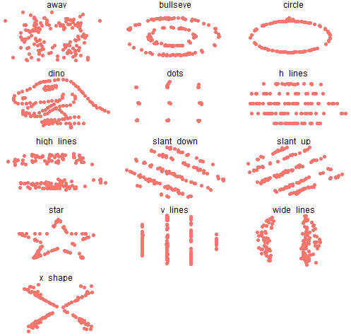

# 数据欺骗的危险第二部分——基数比例和不良统计

> [`towardsdatascience.com/the-dangers-of-deceptive-data-part-2-base-proportions-and-bad-statistics/`](https://towardsdatascience.com/the-dangers-of-deceptive-data-part-2-base-proportions-and-bad-statistics/)

<mdspan datatext="el1746680040658" class="mdspan-comment">这是对我之前文章的后续：[数据欺骗的危险——混淆的图表和误导性的标题](https://towardsdatascience.com/the-dangers-of-deceptive-data-confusing-charts-and-misleading-headlines/). 我的第一篇文章主要关注了如何使用*可视化*来误导，深入探讨了在公共事务中广泛使用的一种数据展示形式。

在这篇文章中，我会深入探讨，看看对统计概念的误解是如何成为被数据欺骗的温床。具体来说，我将解释相关性、基数比例、汇总统计和不确定性的误解如何导致人们误入歧途。

让我们直接进入正题。

## 相关性≠因果关系

让我们从经典案例开始，以正确的心态进入一些更复杂的思想。从小学最早期的统计学课程开始，我们都被告知相关性不等于因果关系。

如果你稍微搜索一下或阅读一下，你可以找到显示吸烟消费与平均寿命之间高度相关的“统计数据” [1]。有趣。那么，这意味着我们所有人都应该开始吸烟以延长寿命吗？

当然不是。我们遗漏了一个混杂因素：购买香烟需要金钱，而财富较高的国家自然有更高的预期寿命。香烟和年龄之间没有因果关系。我喜欢这个例子，因为它如此明显地具有误导性，并且很好地说明了这个观点。一般来说，对只显示相关性链接的数据保持警惕是很重要的。

从科学的角度来看，通过观察可以识别相关性，但声称因果关系唯一的方法是实际进行随机试验，并控制潜在的混杂因素——这是一个相当复杂的过程。

我选择从这里开始，因为这个概念虽然入门，但也突出了一个关键思想，这个思想是有效理解数据的基础：**数据只显示它所显示的内容，不显示其他内容。**

在我们继续前进时，请记住这一点。

## 记住基数比例

1978 年，斯蒂芬·卡斯凯尔斯博士和他的团队在哈佛医学院对 60 名医生、住院医生和研究生提出了以下问题：

> “如果一项检测疾病的测试，其患病率为 1000 分之一，有 5%的假阳性率，那么一个检测结果为阳性的个人实际上患有该疾病的可能性有多大，假设你对该人的症状或体征一无所知？”

虽然这个问题是用医学术语提出的，但它实际上是在讲统计学。因此，它也与数据科学有关。在继续阅读之前，花点时间思考一下你对这个问题的回答。

图片由[Getty Images](https://unsplash.com/@gettyimages)在 Unsplash 上提供

答案是（大约）2%。现在，如果你快速浏览了这些内容（并且对统计学不太熟悉），你可能猜测的数字要高得多。

这对于医学院的人来说确实如此。只有 11/60 的人正确回答了这个问题，而有 27/60 的人的回答高达 95%（可能只是从 100%中减去了假阳性率）。

很容易假设实际值应该很高，因为阳性结果为正，但这种假设包含了一个关键的推理错误：它没有考虑到人群中疾病的极低患病率。

换句话说，如果每 1000 人中只有 1 人患有这种疾病，那么在计算随机个人患病的概率时，这一点需要考虑。概率不仅仅依赖于阳性测试结果。一旦测试的准确性低于 100%，基础率的影响就会非常显著地发挥作用。

正式来说，这种推理错误被称为**基础率谬误**。

为了更清楚地看到这一点，想象一下，只有每 1000 万人中有一人患有这种疾病，但测试的假阳性率仍然是 5%。你还会认为阳性测试结果立即表明有 95%的患病可能性吗？如果这个比例是十亿分之一呢？

基础率非常重要。请记住这一点。

## 统计指标并不等同于数据

让我们来看看以下定量数据集（确切地说有 13 个），它们都被可视化为散点图。其中有一个甚至呈现为恐龙的形状。

图片由作者提供。使用在 MIT 许可下可用的代码生成，请参阅[`jumpingrivers.github.io/datasauRus/`](https://jumpingrivers.github.io/datasauRus/)

你是否注意到这些数据集有什么有趣的地方？

我会为你指明正确的方向。以下是这组数据的汇总统计信息：

| X-Mean | 54.26 |
| --- | --- |
| Y-均值 | 47.83 |
| X-SD (标准差) | 16.76 |
| Y-SD | 26.93 |
| 相关系数 | -0.06 |

如果你想知道为什么只有一组统计数据，那是因为它们都是相同的。上面所有的 13 个图表都有相同的均值、标准差和变量之间的相关性。

这组著名的 13 个数据集被称为*数据龙卷风十二* [5]，几年前作为总结统计不能总是可信的鲜明例证而发表。它还突出了可视化作为数据探索工具的价值。正如著名统计学家约翰·图基所说，

> “**图片的最大价值在于它迫使我们注意到我们从未预料到看到的东西**。”

## 理解不确定性

总结来说，我想谈谈一种轻微的欺骗性数据的变异，但同样重要：**不相信实际上是正确的数据**。换句话说，虚假的欺骗。

下面的图表是从分析来自左倾、右倾和中立新闻媒体的标题情感的研究中摘取的 [6]：

“按新闻媒体的意识形态倾向分组的大标题的平均年度情感”由该研究作者：David Rozado, Ruth Hughes, Jamin Halberstadt 许可，根据 CC BY 4.0。要查看此许可证的副本，请访问 https://creativecommons.org/licenses/by/4.0/?ref=openverse。

上面的图表中有很多内容，但我特别想引起你的注意：从每个绘制点延伸出来的垂直线。你可能以前见过这些。正式来说，这些被称为*误差线*，这是科学家经常用来描绘数据不确定性的方式之一。

让我再说一遍。在统计学和数据科学中，“错误”与“不确定性”同义。关键的是，**它并不意味着展示的内容有什么错误或不正确**。当一个图表描绘不确定性时，它描绘的是对值范围的精心计算的度量以及在该范围内的各个点的置信水平。不幸的是，许多人只是认为这意味着制作图表的人本质上是在猜测。

这是一个严重的推理错误，因为损害是双重的：不仅手头的数据被误解，而且这种误解的存在也助长了危险的社会信念，即科学不可信。坦率地承认知识的局限性实际上应该增加我们对主张可靠性的信心，但将这种局限性误认为是承认不当行为会导致相反的效果。

学习如何解释不确定性是具有挑战性的，但极其重要。至少，一个不错的开始是意识到所谓的“错误”实际上试图传达什么。

## 概括和最后思考

这里有一份关于警惕欺骗性数据的备忘录：

+   **相关性不等于因果关系**。寻找混淆因素。

+   **记住基础比例**。现象的概率高度受其在该人群中的普遍性影响，无论你的测试有多准确（100%的准确性是罕见的例外）。

+   **小心总结统计量。** 平均数和中位数只能带你走这么远；你需要探索你的数据。

+   **不要误解不确定性。** 它不是错误；它是对置信水平进行仔细考虑后的描述。

记住这些，你将很好地定位去应对下一个摆在你面前的数据科学问题。

下次再会。

## 参考文献

[1] *《图表的谎言》，阿尔贝托·卡伊罗*

[2] [`pmc.ncbi.nlm.nih.gov/articles/PMC4955674`](https://pmc.ncbi.nlm.nih.gov/articles/PMC4955674)

[3] [`data88s.org/textbook/content/Chapter_02/04_Use_and_Interpretation.html?utm_source=chatgpt.com`](https://data88s.org/textbook/content/Chapter_02/04_Use_and_Interpretation.html?utm_source=chatgpt.com)

[4] [`visualizing.jp/the-datasaurus-dozen`](https://visualizing.jp/the-datasaurus-dozen)

[5] [`dl.acm.org/doi/abs/10.1145/3025453.3025912?casa_token=AU6PWgCWQuMAAAAA:5a9-oA38RxxzmVGZiIFJdrNdOMII2kmsFLJK22WJgaAk37PECCmAQjwVzAiapGiV4MAOPTJ8-uax0g`](https://dl.acm.org/doi/abs/10.1145/3025453.3025912?casa_token=AU6PWgCWQuMAAAAA:5a9-oA38RxxzmVGZiIFJdrNdOMII2kmsFLJK22WJgaAk37PECCmAQjwVzAiapGiV4MAOPTJ8-uax0g)

[6] [`journals.plos.org/plosone/article?id=10.1371/journal.pone.0276367`](https://journals.plos.org/plosone/article?id=10.1371/journal.pone.0276367)
