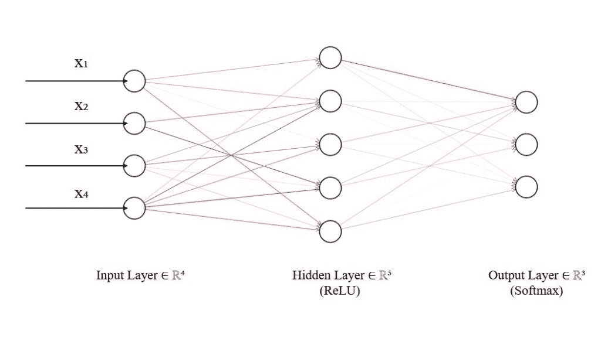

# 全导数：纠正反向传播链式法则的误解

> [`towardsdatascience.com/the-total-derivative-correcting-the-misconception-of-backpropagations-chain-rule/`](https://towardsdatascience.com/the-total-derivative-correcting-the-misconception-of-backpropagations-chain-rule/)

<mdspan datatext="el1746562535435" class="mdspan-comment">本文</mdspan>使用了这篇杰出[论文](https://arxiv.org/pdf/1802.01528)中的概念。为了更深入地理解数学，请参阅该论文。在这里，我们尝试以更直观和明确的方式呈现数学，并突出一些重要的细微差别。

## 1 引言

关于反向传播的讨论通常说我们使用**“链式法则”**来推导相对于权重的梯度，然后继续展示一个如下的公式：\(\frac{dy}{dx} = \frac{dy}{dt} \frac{dt}{dx}\)。

这是单变量链式法则，如果我们用它来计算相对于每个层的梯度的损失，我们的计算将会出错。这种错误表示混淆了基本的数学，并削弱了方程的真正优雅。事实上，在反向传播过程中使用的链式法则比单变量链式法则更一般——称为**全导数**。

我们需要这个更一般的情况，因为我们面对的反向传播问题在于每一层的输出构成了下一层的输入。由于每一层的输出也受到其权重的影响，这意味着权重（我们想要调整的值）间接影响了下一层的输入。因此，为了找到相对于层权重的成本梯度（反向传播背后的动机），我们必须考虑层中的权重如何影响所有后续层（直到最终评估成本的层）的值。我们将在下面讨论这个问题。

我们面临的另一个困难是，每个隐藏层的输出是一个值向量（一个层中有多个神经元），因此我们需要一种方法，一次考虑该层的所有导数，而无需将每个导数作为单独的操作来计算。

在本文中，我们将看到**向量链式法则**如何帮助解决这两个问题。

首先，我们专注于解释全导数以及为什么将其作为单变量链式法则在反向传播中的应用是不正确的。我们还展示了**向量链式法则**如何实现全导数方程。接下来，我们介绍一些符号，并描述神经网络中的前向传播。最后，我们推导出相对于成本的权重梯度，并介绍推导中的几个关键概念，作为通过一些巧妙的线性代数和微积分来计算如此巨大的依赖图简化的方法。

我们将要展示的**向量链式法则**涵盖了链式法则的所有情况，因此它也适用于单变量情况。这可能会让人困惑，因为你无法确定在特定操作中使用了哪种链式法则的应用。当我们实际上使用单变量全微分链式法则而不是单变量链式法则时，我们会明确指出。

> **注意：** 文档中存在许多类似的混淆点，我们将通过全文突出显示这些点。

为了帮助读者跟随反向传播算法背后的数学，我们还提供了一个完整的[实现](https://colab.research.google.com/github/adshahbaaz/nn-softmax/blob/main/nn_softmax.ipynb)，使用 `numpy` 代码和鸢尾花数据集。

## 2 前言

反向传播方程的实现使用**向量**微积分来执行高度优化的计算，以单步推导出层中所有权重的梯度。

我们需要的向量微积分需要了解以下内容。

> **重要提示：** 在整个文档中，粗体小写字母，如 \(\mathbf{x}\)，表示向量，而斜体小写字母，如 \(x\)，表示标量。\(x_i\) 是向量 \(\mathbf{x}\) 的第 \(i\) 个元素，并且是斜体，因为单个向量元素是一个标量。大写斜体字母，如 \(W\)，表示矩阵。我们使用 \(A * B\) 表示 \(A\) 和 \(B\) 之间的**逐元素**乘法。

### 2.0.1 偏导数

多变量函数相对于其变量的偏导数是相对于该特定变量的变化率，同时保持所有其他变量恒定。假设我们有一个函数：

\[f(x,y) = 2xy³\]

我们可以计算它相对于每个参数的导数，将其他参数视为常数并将它们列出：

\[ \frac{\partial f}{\partial x} = 2y³\]

\[\frac{\partial f}{\partial y} = 6xy² \]

因此，函数相对于 \(x\) 的偏导数，执行了保持所有其他变量恒定的常规标量导数。我们对相对于 \(y\) 的偏导数也做同样的处理。

### 2.0.2 雅可比矩阵

当我们收集一个向量值函数（返回向量为结果的函数）或 \(m\) 个标量值函数的梯度（偏导数）并将它们堆叠在一起时，我们得到一个雅可比矩阵。

考虑一个函数 \(\mathbf{f}(x,y)\)，它接受多个标量输入（在这种情况下，\(x\) 和 \(y\)）并产生多个标量输出，这些输出随后组织成一个向量。

假设我们的函数 \(\mathbf{f}\) 产生两个标量输出，\(f_1(x,y)\) 和 \(f_2(x,y)\)。雅可比矩阵将表示为：

\[\Delta\mathbf{f} = \begin{bmatrix} \Delta f_1(x,y) \\ \Delta f_2(x,y) \end{bmatrix} = \begin{bmatrix} \frac{\partial f_1}{\partial x} & \frac{\partial f_1}{\partial y} \\ \frac{\partial f_2}{\partial x} & \frac{\partial f_2}{\partial y} \end{bmatrix}\] 每一行包含一个输出函数相对于变量 \(x\) 和 \(y\) 的偏导数。雅可比矩阵通过堆叠这些偏导数来组织多个函数的偏导数，从而提供一个矩阵，描述了**输出向量对输入向量变化的整体敏感性**。

## 2.1 全导数

在覆盖了先决条件之后，我们现在可以介绍全导数的概念。理解这个概念对于完全掌握后面将要介绍的反向传播方程非常重要。

我们首先陈述单变量链式法则适用于像 \(f(g(x))\) 这样的函数，其导数简单地是 \(f'(g(x)) * g'(x)\)，换句话说：

\[\frac{df(g(x))}{dx} = \frac{df}{dg} \frac{dg}{dx}\]

然而，如果我们有一个像 \(f(x(t),y(t))\) 这样的函数会发生什么呢？

对于这个函数，我们可以看到 \(t\) 的微小变化会间接影响 \(f\)（通过 \(x\) 和 \(y\)）。由于中间函数是同一变量的函数，我们必须考虑每个变化相对于其对 \(f\) 变化的贡献。

要得到函数 \(f\) 对 \(t\) 的梯度，全导数法则指出：

\[\frac{df(x(t),y(t))}{dt} = \frac{\partial f}{\partial t}\frac{dt}{dt} + \frac{\partial f}{\partial x}\frac{dx}{dt} + \frac{\partial f}{\partial y}\frac{dy}{dt}\]

在我们的例子中，\(f\) 不是直接关于 \(t\) 的函数，所以我们有 \(\frac{df}{dt} \frac{dt}{dt} = 0\)。

该方程可以看作是 \(t\) 通过 \(x\) 和 \(y\) 对 \(f\) 的整体值的加权求和。也就是说，\(\frac{\partial{f}}{\partial{t}}\)，\(\frac{\partial{f}}{\partial{x}}\) 和 \(\frac{\partial{f}}{\partial{y}}\) 可以看作是分别对 \(f\) 的每个参数相对于 \(t\) 的整体贡献的加权。

导数 \(\frac{dt}{dt}\)，\(\frac{dx}{dt}\) 和 \(\frac{dy}{dt}\) 是普通导数，因为每个参数都是关于单个变量 \(t\) 的函数。

> **重要**：如果 \(x\) 只是一个关于 \(t\)（或 \(y\)）的函数，那么涉及 \(\frac{dy}{dt}\) 的项变为 \(0\)，因此全导数公式简化为单变量链式法则。

我们可以通过将参数 \(x\) 和 \(y\) 表示为向量 \(\mathbf{u}\) 的分量来进一步推广这个公式，使得：

\[f(\mathbf{u}(t)) = f(x(t),y(t))\]

现在如果我们用 \(u_{n+1}\) 作为 \(t\) 的别名，我们可以写出：

\[ \Delta f(\mathbf{u}(t)) = \frac{df}{dt} = \sum^{n+1}_{i = 1} \frac{\partial f}{\partial u_i} \frac{\partial u_i}{\partial t}\]

注意与单变量情况在符号上的微妙差异。所有导数都表示为偏导数，因为 \(f\) 及其参数 \(u_i\) 是多个变量的函数。

*求和看起来像向量点积（如果 \(f\) 是一个向量函数 \(\mathbf{f}\) ，则可能是矩阵乘法）*。利用这个事实，我们可以用两个其他雅可比矩阵表示全导数：

\[\Delta f(\mathbf{u}(t)) = \frac{\partial f}{\partial \mathbf{u}} \frac{\partial \mathbf{u}}{\partial t}\]

其中雅可比 \(\frac{\partial f}{\partial \mathbf{u}}\) 是矩阵乘以雅可比 \(\frac{\partial \mathbf{u}}{\partial t}\) 以产生 \(f\) 对 \(t\) 的全导数。这里需要使用偏导数符号，因为 \(\mathbf{u}\) 成为一个 \(t\) 的函数向量。

这种公式被称为**向量链式法则**。其美妙之处在于，向量链式法则在考虑全导数的同时，保持了单变量链式法则相同的符号简单性。

将上面的向量链式法则与单变量链式法则进行比较：

\[\Delta f(u(t)) = \frac{df}{du}\frac{du}{dt}\]

我们可以看到一些混淆的可能原因。

## 2.2 前向传播和一些符号

让我们继续描述神经网络中的前向传播。

**单个神经元输出**

一个神经元的输出 \(z\) 是其输入和偏置项的加权求和。

因此我们可以写成：

\[ z = x_{1}w_1 + x_{2}w_2 + \cdots + x_{n}w_n + b = \sum_{i=1}^{n} w_i x_i \]

如果我们将向量 \(\mathbf{w}\) 和 \(\mathbf{x}\) 定义为表示每个 \(w_i\) 和 \(x_i\) 值：\(\mathbf{w} = \begin{bmatrix} w_1 , w_2 , \cdots, w_n \end{bmatrix}\) 和 \(\mathbf{x} = \begin{bmatrix} x_1 , x_2 , \cdots, x_n \end{bmatrix}\) ，其中 \(\mathbf{w}\) 是神经元权重向量，\(\mathbf{x}\) 是其输入向量，那么我们可以将加权求和写成两个向量 \(\mathbf{x}\) 和 \(\mathbf{w}\) 的点积：

\[z = \mathbf{w} \cdot \mathbf{x} + b\]

然后对输出 \(z\) 应用激活函数以引入非线性。让我们将神经元激活后的输出表示为 \(a\)。然后：

\[a = \sigma(z)\]

其中 \(\sigma\) 表示激活函数。

**层输出**

在实践中，一个层包含多个神经元，因此 \(z\) 是一个向量 \(\mathbf{z}\)，每个都有一个随机初始化的权重向量。

这意味着我们有一个权重矩阵 \(W\) 而不是权重向量 \(\mathbf{w}\)，其中行由当前层 \(i\) 中的神经元数量给出，列由前一层 \(j\) 中的神经元数量给出。

> **重要**：当考虑多个观察（一个批次）通过我们的网络的单次传递时，输入向量 \(\mathbf{x}\) 将是一个矩阵 \(X\)。

让我们用矩阵形式表示层的权重：

\[W = \begin{bmatrix} \mathbf{w}_1 \\ \mathbf{w}_2 \\ \vdots \\ \mathbf{w}_i \end{bmatrix} = \begin{bmatrix} w_{1,1} & w_{1,2} & \cdots & w_{1,j} \\ w_{2,1} & w_{2,2} & \cdots & w_{2,j} \\ \vdots & \vdots & \ddots & \vdots \\ w_{i,1} & w_{i,2} & \cdots & w_{i,j} \end{bmatrix}\]

注意，每个 \(\mathbf{w}_i\) 向量都有一个与前一层的神经元数量相对应的 \(j\) 个元素集合。这意味着 \(\mathbf{z}_i\) 取一个长度为 \(|j|\) 的参数向量 \(\mathbf{w}_i\)。

然后，对于层 \(L\) 中的所有神经元，我们有一个向量 \(\mathbf{z}\)，其中：

\[\mathbf{z}(W,\mathbf{x},\mathbf{b}) = \begin{bmatrix} z_1 \\ z_2 \\ \vdots \\ z_i \end{bmatrix} = \begin{bmatrix} \mathbf{w}_1 . \mathbf{x} + b_1 \\ \mathbf{w}_2 . \mathbf{x} + b_2\\ \vdots \\ \mathbf{w}_i . \mathbf{x} + b_i \end{bmatrix}\]

这可以简洁地写成 \(\mathbf{x}\) 和 \(W\) 之间的矩阵乘法：

\[\mathbf{z}(W,\mathbf{x},\mathbf{b}) = \mathbf{x}W^T + \mathbf{b}\]

重要的是要记住，神经网络中的每个神经元都有自己的权重向量，因此 \({z}_1\) 只与 \(\mathbf{w}_1\) 相关，\(z_2\) 与 \(\mathbf{w}_2\) 相关，依此类推。

> **重要**：输入向量 \(\mathbf{x}\) 简单地是前一层神经元的输出（或第一层的特征数量）。因此，对于除了输入层之外的所有层：\[\mathbf{x}^l = \mathbf{a}^{l-1}\]

**激活后的层输出**

最后，为了使我们的网络能够解释更复杂的现象，我们在层 \(l\) 中神经元的输出上引入非线性。我们通过在层 \(l\) 中神经元的输出 \(\mathbf{z}\) 上应用非线性函数来实现这一点。

层 \(l\) 的输出可以表示为：

\[\mathbf{a}^{[l]}(\mathbf{z}) = \begin{bmatrix} \sigma(z_1) \\ \sigma(z_2)\\ \vdots \\ \sigma(z_i ) \end{bmatrix} \]

其中，激活函数 \(\sigma\) 对层的预激活输出 \(\mathbf{z}\) 进行逐元素应用。

因此，层的激活可以表示为 \(W\)、\(\mathbf{x}\) 和 \(\mathbf{b}\) 的函数：

\[\mathbf{a}^{[l]}(W,\mathbf{x},\mathbf{b}) = \begin{bmatrix} \sigma(\mathbf{w}^{[l]}_1 . \mathbf{x} + b_1) \\ \sigma(\mathbf{w}^{[l]}_2 . \mathbf{x} + b_2)\\ \vdots \\ \sigma(\mathbf{w}^{[l]}_i . \mathbf{x} + b_i) \end{bmatrix}\qquad{(1)}\]

注意到层的输出如何类似于描述雅可比矩阵的 2.0.2 节中描述的向量函数 \(\mathbf{f}\)。

**实际上**，神经网络中的每一层都可以看作是一个向量函数，它接收一个输入向量并将其映射（变换）为输出向量。输出向量的维度由该层的神经元数量决定。

换句话说，每个神经元 \(i\) 接收输入向量 \(\mathbf{x}\) 和 \(\mathbf{w}_i\)，并输出一个标量值 \(z_i\)，其中每个神经元的输出形成层输出向量的元素。

> **注意**：这可以定义为输入的线性变换，或者更精确地说是一个**仿射**变换，因为它是一个线性变换 \(xW^T\) 后跟一个平移（\(\mathbf{b}\) 项的加法）。

最后，除了它们的非线性性质外，激活函数的一个理想特性是它们的导数可以方便地（通常）根据函数的值本身来计算。这使得梯度的计算在计算上更加高效。我们将在第 3.2.2 节中详细探讨这一点。

现在我们已经了解了前向机制的基本原理，让我们专注于反向传播方程的推导。

## 3 成本函数的梯度

在反向传播过程中，我们感兴趣的是找到成本函数相对于我们神经网络每一层权重的梯度（变化率）。这将允许我们在通过我们的神经网络后更新权重，以降低成本。简单来说，因为梯度会告诉我们产生更大成本的“斜率”的值，所以我们更新权重以相反的方向，以最小化它。

图 1：我们将考虑的神经网络。

如前所述，我们需要通过考虑在正向传递过程中我们神经网络中每个权重和偏置对后续层的影响来计算整体损失的变化。

在本文中，我们限制我们的关注点在于相对于权重的梯度的推导（一旦掌握了这个概念，对于偏置项的扩展是微不足道的——参见我们[实现](https://colab.research.google.com/github/adshahbaaz/nn-softmax/blob/main/nn_softmax.ipynb)中如何处理偏置项）。

对于我们的解释，我们考虑图 1 中显示的网络。我们将分别处理输出层和隐藏层权重的梯度的推导，因为它们在概念上需要稍微不同的技术。

为了更直观地感受涉及的间接依赖关系，我们首先将成本表示为一个复合函数。

## 3.1 成本作为复合函数

### 3.1.1 最终层

网络的成本可以看作是两个参数的函数，因此：

\[ C(\mathbf{y},\mathbf{\hat{y}})\]

其中\(\mathbf{y}\)是真实标签的向量，\(\mathbf{\hat{y}}\)是我们相应预测的向量。

使用我们之前的符号（等式 1）并将它们应用于图 1 中的神经网络，令\(\mathbf{a}_L\)为最终层(\(L\))输出的向量，因此：

\[\mathbf{a}_L(W_L,\mathbf{a}_{L-1}) = \begin{bmatrix} \sigma(z_1(\mathbf{w}_1,\mathbf{a}_{L-1})) \\ \sigma(z_2(\mathbf{w}_2,\mathbf{a}_{L-1})) \\ \sigma(z_3(\mathbf{w}_3,\mathbf{a}_{L-1})) \end{bmatrix}\]

将\(\mathbf{a}_{L}\)作为一个向量函数来考虑，我们可以看到它是由两个参数\(W_L\)和\(\mathbf{a}_{L – 1}\)（省略偏置项\(\mathbf{b}\)）决定的。

由于最后一层 \(L\) 的激活是模型预测 \(\mathbf{\hat{y}} = \mathbf{a}_L\)，我们可以将成本表示为前一层激活的复合函数：

\[C(\mathbf{y},\mathbf{\hat{y}}) = C(\mathbf{y},\mathbf{a}_L(W_L,\mathbf{a}_{L-1}))\qquad{(2)}\]

展开来看（我们省略了最后一层参数 \(z_i\)、\(\mathbf{w}_i\) 的上标 \(L\)）：

\[C(\mathbf{y},\sigma(z_1(\mathbf{w}_1,\mathbf{a}_{L-1})),\sigma(z_2(\mathbf{w}_2,\mathbf{a}_{L-1})),\sigma(z_3(\mathbf{w}_3,\mathbf{a}_{L-1})))\qquad{(3)}\]

在最后一层的权重中，这个方程揭示了影响路径的直接路径：每个权重向量 \(\mathbf{w}_i\) 仅通过其关联的 \(z_i\) 影响成本。因此，计算这些权重的梯度主要需要应用单变量链式法则的向量扩展，**无需使用全微分**。

### 3.1.2 隐藏层（层）

对于隐藏层（层），我们实际上需要查看 \(l\) 层以获取与成本相关的层 \(l\) 的权重。在我们的示例图 1 中，我们有一个隐藏层，其输出表示为 \(\mathbf{a}_{L-1}\)。

我们可以将方程 2 表达为包含隐藏层权重：

\[C(\mathbf{y},\mathbf{a}_L(W_L,\mathbf{a}_{L-1}(W_{L-1},\mathbf{a}_{L-2})))\qquad{(4)}\]

> **注意**：我们的网络中只有一个隐藏层，因此 \(\mathbf{a}_{L-2} = \mathbf{x}\)，其中 \(\mathbf{x}\) 是输入特征向量。

在方程 4 中，我们注意到隐藏层 \(L-1\) 中每个神经元的权重影响最终层 \(L\) 中每个神经元的输入。因此，\(W_{L-1}\) 通过多个路径 \(\mathbf{a}_L\) 影响成本 \(C\)。

这种相互依赖性需要使用**全微分**来计算 \(\frac{\partial C}{\partial \mathbf{a}_{L-1}}\)，然后对于每个隐藏层 \(l\) 计算 \(\frac{dC}{dW_{L-1}}\)，这是我们真正感兴趣的值。

## 3.2 寻找梯度

现在我们对需要求解的函数有了更清晰的理解，我们专注于推导反向传播方程，并突出使用链式法则的不同应用。我们还介绍了如何通过**预计算**梯度来实现算法。所有示例都考虑单个观察值（随机梯度下降）以简化符号。

### 3.2.1 最后一层

重申一下，我们的任务是找到与权重矩阵 \(W_{L}\) 中**所有**权重的成本梯度的梯度。在我们的例子中，这包括最终层中的 \(15\) (\(i \times j\)) 个权重。

我们需要找到：\[\frac{dC}{dW_L}\]

给定最终层权重在方程 3 中的成本方程。

正如我们所见，计算最终层权重的梯度不需要使用全导数。这里我们只需要使用扩展到向量的单变量链式法则。

让我们写出所需的偏导数（雅可比矩阵），这也有助于可视化它们的维度：

**I.**

成本相对于我们模型预测 \(\mathbf{a}_L\) 的梯度：

\[\frac{\partial C}{\partial \mathbf{a}_{L}} = \begin{bmatrix} \frac{\partial C}{\partial a^{[L]}_{1}} & \frac{\partial C}{\partial a^{[L]}_2} & \frac{\partial C}{\partial a^{[L]}_3} \end{bmatrix}\]

**II.**

模型预测相对于预激活输出 \(\mathbf{a}_L\) 的梯度：

\[\frac{\partial \mathbf{a}_{L}}{\partial \mathbf{z}_{L}} = \begin{bmatrix} \frac{\partial a_1^{[L]}}{\partial z_1^{[L]}} & \frac{\partial a_1^{[L]}}{\partial z_2^{[L]}} & \frac{\partial a_1^{[L]}}{\partial z_3^{[L]}} \\ \frac{\partial a_2^{[L]}}{\partial z_1^{[L]}} & \frac{\partial a_2^{[L]}}{\partial z_2^{[L]}} & \frac{\partial a_2^{[L]}}{\partial z_3^{[L]}} \\ \frac{\partial a_3^{[L]}}{\partial z_1^{[L]}} & \frac{\partial a_3^{[L]}}{\partial z_2^{[L]}} & \frac{\partial a_3^{[L]}}{\partial z_3^{[L]}} \end{bmatrix}\]

在这里，非对角线元素为零，因为当 \(i \neq k\) 时，\(a_k\) 不是 \(z_i\) 的函数，所以我们有：

\[\frac{\partial \mathbf{a}_{L}}{\partial \mathbf{z}_{L}} = diag(\frac{\partial \mathbf{a}_{L}}{\partial \mathbf{z}_{L}}) = \begin{bmatrix} \frac{\partial a_1^{[L]}}{\partial z_1^{[L]}} & \frac{\partial a_2^{[L]}}{\partial z_2^{[L]}} & \frac{\partial a_3^{[L]}}{\partial z_3^{[L]}}\end{bmatrix}\]

**III.**

接下来，对于与权重相关的预激活输出 \(\frac{\partial \mathbf{z}_L}{\partial W_{L}}\)，我们有：

\[ \frac{\partial \mathbf{z}_{L}}{\partial W_{L}} = \begin{bmatrix} \frac{\partial z_1^{[L]}}{\partial \mathbf{w_1}^{[L]}} \\ \frac{\partial z_2^{[L]}}{\partial \mathbf{w_2}^{[L]}} \\ \frac{\partial z_3^{[L]}}{\partial \mathbf{w_3}^{[L]}} \end{bmatrix} = \begin{bmatrix}\frac{\partial z_1^{[L]}}{\partial w_{11}^{[L]}} & \frac{\partial z_1^{[L]}}{\partial w_{12}^{[L]}} & \frac{\partial z_1^{[L]}}{\partial w_{13}^{[L]}} & \frac{\partial z_1^{[L]}}{\partial w_{14}^{[L]}} & \frac{\partial z_1^{[L]}}{\partial w_{15}^{[L]}} \\ \frac{\partial z_2^{[L]}}{\partial w_{21}^{[L]}} & \frac{\partial z_2^{[L]}}{\partial w_{22}^{[L]}} & \frac{\partial z_2^{[L]}}{\partial w_{23}^{[L]}} & \frac{\partial z_2^{[L]}}{\partial w_{24}^{[L]}} & \frac{\partial z_2^{[L]}}{\partial w_{25}^{[L]}} \\\frac{\partial z_3^{[L]}}{\partial w_{31}^{[L]}} & \frac{\partial z_3^{[L]}}{\partial w_{32}^{[L]}} & \frac{\partial z_3^{[L]}}{\partial w_{33}^{[L]}} & \frac{\partial z_3^{[L]}}{\partial w_{34}^{[L]}} & \frac{\partial z_3^{[L]}}{\partial w_{35}^{[L]}} \end{bmatrix}\]

每一列对应一个权重向量，它将前一层的一个神经元 \(j\) 连接到当前层的神经元 \(i\)。

**IV.**

最后，为了找到中间的偏导数 \(\frac{\partial C}{\partial \mathbf{z}_L}\)，我们需要在 \(\frac{dC}{d\mathbf{a}_L}\) 和 \(\frac{d\mathbf{a}_L}{d\mathbf{z}_L}\) 之间执行一个 *逐元素* 相乘，因为我们只需要 *单变量* 的链式法则。这是因为层之间没有间接依赖关系需要考虑：

\[\frac{\partial C}{\partial \mathbf{z}_L} = \frac{\partial C}{\partial \mathbf{a}_L} * \frac{\partial \mathbf{a}_L}{\partial \mathbf{z}_L} = \begin{bmatrix} \frac{\partial C}{\partial a^{[L]}_{1}} & \frac{\partial C}{\partial a^{[L]}_2} & \frac{\partial C}{\partial a^{[L]}_3} \end{bmatrix} * \begin{bmatrix} \frac{\partial a_1^{[L]}}{\partial z_1^{[L]}} & \frac{\partial a_2^{[L]}}{\partial z_2^{[L]}} & \frac{\partial a_3^{[L]}}{\partial z_3^{[L]}}\end{bmatrix} \]

现在我们已经找到了我们的偏导数，我们可以使用向量的链式法则来表示我们感兴趣的雅可比矩阵：

\[\frac{dC}{dW_{L}} = (\frac{\partial C}{\partial \mathbf{a}_L} * \frac{\partial \mathbf{a}_L}{\partial \mathbf{z}_L}) \otimes \frac{\partial \mathbf{z}_L}{\partial W_{L}} = \frac{\partial C}{\partial \mathbf{z}_{L}} \otimes \frac{\partial \mathbf{z}_{L}}{\partial W_{L}} = \begin{bmatrix} \frac{\partial C}{\partial z_1^{[L]}} \frac{\partial z_1^{[L]}}{\partial w_{11}^{[L]}} & \frac{\partial C}{\partial z_2^{[L]}} \frac{\partial z_2^{[L]}}{\partial w_{21}^{[L]}} & \frac{\partial C}{\partial z_3^{[L]}} \frac{\partial z_3^{[L]}}{\partial w_{31}^{[L]}} \\ \frac{\partial C}{\partial z_1^{[L]}} \frac{\partial z_1^{[L]}}{\partial w_{12}^{[L]}} & \frac{\partial C}{\partial z_2^{[L]}} \frac{\partial z_2^{[L]}}{\partial w_{22}^{[L]}} & \frac{\partial C}{\partial z_3^{[L]}} \frac{\partial z_3^{[L]}}{\partial w_{32}^{[L]}} \\ \frac{\partial C}{\partial z_1^{[L]}} \frac{\partial z_1^{[L]}}{\partial w_{13}^{[L]}} & \frac{\partial C}{\partial z_2^{[L]}} \frac{\partial z_2^{[L]}}{\partial w_{23}^{[L]}} & \frac{\partial C}{\partial z_3^{[L]}} \frac{\partial z_3^{[L]}}{\partial w_{33}^{[L]}} \\ \frac{\partial C}{\partial z_1^{[L]}} \frac{\partial z_1^{[L]}}{\partial w_{14}^{[L]}} & \frac{\partial C}{\partial z_2^{[L]}} \frac{\partial z_2^{[L]}}{\partial w_{24}^{[L]}} & \frac{\partial C}{\partial z_3^{[L]}} \frac{\partial z_3^{[L]}}{\partial w_{34}^{[L]}} \\ \frac{\partial C}{\partial z_1^{[L]}} \frac{\partial z_1^{[L]}}{\partial w_{15}^{[L]}} & \frac{\partial C}{\partial z_2^{[L]}} \frac{\partial z_2^{[L]}}{\partial w_{25}^{[L]}} & \frac{\partial C}{\partial z_3^{[L]}} \frac{\partial z_3^{[L]}}{\partial w_{35}^{[L]}} \end{bmatrix}^T\]

我们很快将解释操作符的选择。现在，请专注于计算的复杂性。

对于像我们这样的简单网络，我们需要计算所有所需偏导数的值，以得到成本对最终层权重的梯度。然后，我们需要重复此过程以计算隐藏层权重。此外，在训练过程中，我们通常将许多批数据通过我们的网络。对于每一批，我们需要进行正向传播来计算成本，以及反向传播来计算梯度。

随着网络规模的增大，计算负担迅速攀升到不切实际的水平。一个关键的简化来自于我们可以使用已经确定的值来表示这些偏导数。

### 3.2.2 偏导数的预计算

首先，让我们尝试推导单个神经元输出 \(z_i\) 的偏导数，然后看看我们是否可以将此扩展到输出向量 \(\mathbf{z}\)。我们省略了偏差项，以专注于点积操作的导数：

\[z_i = \mathbf{w}_{i}^{[L]} \cdot \mathbf{a}^{[L-1]} = \sum_{k=1}^{n} (w_k a_k)\]

注意我们为什么没有对 \(\mathbf{a^{[l-1]}}\) 进行索引，这是因为当前层中的所有 \(z_i\) 都共享相同的输入向量，变化的是每个 \(z_i\) 之间的权重和偏置向量。

然后，\(z_i\) 对特定权重 \(w_j\) 的导数是：

\[\frac{\partial z_i}{\partial w_j} = \sum_{k=1}^{n}\frac{\partial}{\partial w_j} (w_k a_k) = a_j\]

求和项消失了，因为当 \(j \neq k\) 时，\(\frac{\partial}{\partial w_j} w_k a_k\) 会简化为一个常数，其导数为 \(0\)。

当 \(w\) 是标量时，结果是一个标量值，为了将此扩展到 \(\mathbf{w}_i\) 的向量，我们只需简单地有：

\[\frac{\partial z_i}{\partial \mathbf{w}_i} = \begin{bmatrix} a_1^{[L-1]} & a_2^{[L-1]} & a_3^{[L-1]} & a_4^{[L-1]} & a_5^{[L-1]} \end{bmatrix} = \mathbf{a}^{[L-1]} \]

这是一项显著更简单的计算，因为激活值已经在正向传播过程中被计算出来了。这也意味着梯度在每个 \(z_i\) 之间是共享的。我们只需要找到已经计算出的 \(5\) 个梯度，而不是必须找到 \(15\) 个单独的偏导数！

这个结果告诉我们，神经元 \(i\) 的预激活输出 (\(z_i\)) 的梯度对 \(w_{ij}\) **是来自神经元 \(j\) 的激活**。这很有意义，因为当 \(k \neq i\) 时，\(z_i\) 对 \(w_{kj}\) 的梯度是 \(0\)，所以偏导数应该简单地是每个 \(z_i\) 的长度为 \(|j|\) 的向量。

这个矩阵的每一列在概念上表示 \(\mathbf{w}_i\) 中权重的小变化对输出 \(z_i\) 的影响程度。为了得到变化对成本 \(C\) 的影响，我们需要使用链式法则。

现在，我们可以写出：

\[\frac{\partial C}{\partial W_{L}} = \frac{\partial C}{\partial \mathbf{z}_{L}}^T \otimes \mathbf{a}_{L-1} = \begin{bmatrix} \frac{\partial C}{\partial z^{[L]}_{1}} \\ \frac{\partial C}{\partial z^{[L]}_2} \\ \frac{\partial C}{\partial z^{[L]}_3} \end{bmatrix} \otimes \begin{bmatrix} a_1^{[L-1]} & a_2^{[L-1]} & a_3^{[L-1]} & a_4^{[L-1]} & a_5^{[L-1]} \end{bmatrix}\]

因此，关于矩阵 \(W_L\)（通过中间变量 **z**）的成本（即我们网络的损失）的导数是一个通过外积计算元素的方阵。我们明确使用外积来表示该操作不使用矩阵乘法操作为隐藏层权重梯度引入的总导数链规则（参见方程 5）。

> **重要**：在考虑多个观察值（批量）时，部分导数 \(\frac{\partial C}{\partial \mathbf{z}_{L}} \frac{\partial \mathbf{z}_{L}}{\partial W_{L}}\) 之间的矩阵乘法是常见的。这实际上沿着每个观察值的偏导数求和，以得到对整体损失的总体贡献。在这种情况下，矩阵乘法**不**用于计算总导数！

如果为了清晰起见展开这个操作，完整的雅可比矩阵将看起来像：

\[\frac{dC}{dW_{L}} = \begin{bmatrix} \frac{\partial C}{\partial z^{[L]}_{1}} a_1^{[L-1]} & \frac{\partial C}{\partial z^{[L]}_{1}} a_2^{[L-1]} & \frac{\partial C}{\partial z^{[L]}_{1}} a_3^{[L-1]} & \frac{\partial C}{\partial z^{[L]}_{1}} a_4^{[L-1]} & \frac{\partial C}{\partial z^{[L]}_{1}} a_5^{[L-1]} \\ \frac{\partial C}{\partial z^{[L]}_{2}} a_1^{[L-1]} & \frac{\partial C}{\partial z^{[L]}_{2}} a_2^{[L-1]} & \frac{\partial C}{\partial z^{[L]}_{2}} a_3^{[L-1]} & \frac{\partial C}{\partial z^{[L]}_{2}} a_4^{[L-1]} & \frac{\partial C}{\partial z^{[L]}_{2}} a_5^{[L-1]} \\ \frac{\partial C}{\partial z^{[L]}_{3}} a_1^{[L-1]} & \frac{\partial C}{\partial z^{[L]}_{3}} a_2^{[L-1]} & \frac{\partial C}{\partial z^{[L]}_{3}} a_3^{[L-1]} & \frac{\partial C}{\partial z^{[L]}_{3}} a_4^{[L-1]} & \frac{\partial C}{\partial z^{[L]}_{3}} a_5^{[L-1]} \end{bmatrix}\]

此外，由于成本和激活函数已知且预先确定，偏导数 \(\frac{\partial C}{\partial \mathbf{z}_L}\) 通常可以用激活函数和真实标签本身来表示。例如，当在最后一层使用 softmax 激活函数时，成本相对于其预激活输入 \(\mathbf{z}_L\) 的导数简单地是 \(\mathbf{a}_L – \mathbf{y}\)（假设 \(\mathbf{y}\) 是真实标签的一个 one-hot 编码向量，且成本函数 \(C\) 是交叉熵损失）。

那么最终层权重相对于成本的梯度可以表示为一系列雅可比矩阵之间的矩阵运算：

\[\frac{dC}{dW_L} = (\frac{\partial C}{\partial \mathbf{a}_L} * \frac{\partial \mathbf{a}_L}{\partial \mathbf{z}_L}) \otimes \frac{\partial \mathbf{z}_L}{\partial W_{L}} \]

### 3.2.3 隐藏层（s）

回想一下，成本在方程 4 中以复合方程的形式写出。我们看到了对于每一层的权重梯度，我们需要迭代求解嵌套的复合函数，直到达到输入层。

让我们可视化我们需要解决层 \(L-1\) 权重的雅可比矩阵。

我们之前已经写出了 \(\frac{\partial C}{\partial \mathbf{z}_{L}}\) 的值。

**I.**

对于前激活输出 \(\mathbf{z}_{L}\) 相对于输入 \(\mathbf{a}_{L -1}\)，我们有：

\[\frac{\partial \mathbf{z}_{L}}{\partial \mathbf{a}_{L-1}} = \begin{bmatrix} \frac{\partial z_1^{[L]}}{\partial a_1^{[L-1]}} & \frac{\partial z_1^{[L]}}{\partial a_2^{[L-1]}} & \frac{\partial z_1^{[L]}}{\partial a_3^{[L-1]}} & \frac{\partial z_1^{[L]}}{\partial a_4^{[L-1]}} & \frac{\partial z_1^{[L]}}{\partial a_5^{[L-1]}} \\ \frac{\partial z_2^{[L]}}{\partial a_1^{[L-1]}} & \frac{\partial z_2^{[L]}}{\partial a_2^{[L-1]}} & \frac{\partial z_2^{[L]}}{\partial a_3^{[L-1]}} & \frac{\partial z_2^{[L]}}{\partial a_4^{[L-1]}} & \frac{\partial z_2^{[L]}}{\partial a_5^{[L-1]}} \\ \frac{\partial z_3^{[L]}}{\partial a_1^{[L-1]}} & \frac{\partial z_3^{[L]}}{\partial a_2^{[L-1]}} & \frac{\partial z_3^{[L]}}{\partial a_3^{[L-1]}} & \frac{\partial z_3^{[L]}}{\partial a_4^{[L-1]}} & \frac{\partial z_3^{[L]}}{\partial a_5^{[L-1]}} \end{bmatrix}\]

使用与之前对 \(\frac{\partial z}{\partial \mathbf{w}}\) 进行微分相同的微分过程，\(\mathbf{z}_l\) 相对于其输入的导数简单地由层 \(l\) 的权重矩阵给出：

\[\frac{\partial \mathbf{z}_{L}}{\partial \mathbf{a}_{L-1}} = W_{L} = \begin{bmatrix} w_{11} & w_{12} & w_{13} & w_{14} & w_{15} \\ w_{21} & w_{22} & w_{23} & w_{24} & w_{25} \\ w_{31} & w_{32} & w_{33} & w_{34} & w_{35} \end{bmatrix}\]

**II.**

接下来，我们找到中间偏导数 \(\frac{\partial C}{\partial \mathbf{a}_{L-1}}\)（这将告诉我们隐藏层的输出如何影响最终成本）：

计算与最终层不同的原因是，每个 \(z^{[L]}_i\) 都接收所有 \(a^{[L-1]}_j\) 作为输入。

作为结果，为了使用雅可比矩阵 \(\frac{\partial C}{\partial \mathbf{z}_{L}}, \frac{\partial \mathbf{z}_{L}}{\partial \mathbf{a}_{L-1}}\) 找到中间偏导数 \(\frac{\partial C}{\partial \mathbf{a}_{L-1}}\)，我们必须考虑层 \(L-1\) 中每个激活 \(a_j\) 如何通过其对最终层 \(L\) 中每个 \(a_i\) 的贡献（通过 \(z_i^L\)）影响成本。

这意味着（如第 3.1.2 节所述），我们需要总导数来找到中间偏导数 \(\frac{\partial C}{\partial \mathbf{a}_{L-1}}\)。

由于我们知道全导数可以表示为矩阵乘积，\(\frac{\partial C}{\partial \mathbf{a}_{L-1}}\)的计算可以明确地写为：

\[ \frac{\partial C}{\partial \mathbf{a}_{L-1}} = \frac{\partial C}{\partial \mathbf{z}_{L}} \frac{\partial \mathbf{z}_{L}}{\partial \mathbf{a}_{L-1}} = \frac{\partial C}{\partial \mathbf{z}_{L}} W_{L} = \begin{bmatrix} \frac{\partial C}{\partial z_1^{[L]}} w_{11} + \frac{\partial C}{\partial z_2^{[L]}} w_{21} + \frac{\partial C}{\partial z_3^{[L]}} w_{31} \\ \frac{\partial C}{\partial z_1^{[L]}} w_{12} + \frac{\partial C}{\partial z_2^{[L]}} w_{22} + \frac{\partial C}{\partial z_3^{[L]}} w_{32} \\ \frac{\partial C}{\partial z_1^{[L]}} w_{13} + \frac{\partial C}{\partial z_2^{[L]}} w_{23} + \frac{\partial C}{\partial z_3^{[L]}} w_{33} \\ \frac{\partial C}{\partial z_1^{[L]}} w_{14} + \frac{\partial C}{\partial z_2^{[L]}} w_{24} + \frac{\partial C}{\partial z_3^{[L]}} w_{34} \\ \frac{\partial C}{\partial z_1^{[L]}} w_{15} + \frac{\partial C}{\partial z_2^{[L]}} w_{25} + \frac{\partial C}{\partial z_3^{[L]}} w_{35} \end{bmatrix}^T\qquad{(5)}\]

现在我们有了隐藏层激活的小变化对成本影响的“依赖图”。

**III.**

对于隐藏层激活\(a_i^{L-1}\)相对于其前激活输出\(z_i^{L-1}\)的导数，我们首先需要定义一个激活函数。我们使用 ReLU 激活函数，定义为：

\[\sigma_{ReLU} = max(0,z_i^{L-1})\]

然后，激活相对于前激活输入的导数是一个由 1 和 0 组成的矩阵：\[ \frac{\partial \mathbf{a}_{L-1}}{\partial \mathbf{z}_{L-1}} = \sigma_{ReLU}'(z_i^{L-1}) = \begin{cases} 1 & \text{if } z_i^{L-1} > 0 \\ 0 & \text{if } z_i^{L-1} \leq 0 \end{cases}\]

**IV.**

从之前我们知道，层相对于其前激活输出的权重梯度仅仅是层的输入。由于我们有一个单个隐藏层，其输入是模型的输入特征\(\mathbf{x}\)：

\[\frac{\partial \mathbf{z}_{L-1}}{\partial W_{L-1}} = \mathbf{x}\]

既然我们已经找到了我们的雅可比矩阵，剩下的就是使用扩展到向量的单变量链式法则乘出相应的偏导数。这是因为步骤**II**中的全导数计算已经考虑了层间依赖的**间接**关系。我们现在只需要关注隐藏层内的“局部”导数。

最后，我们可以将隐藏层权重相对于成本梯度的表示表示为一系列矩阵运算：

\[ \frac{dC}{dW_{L-1}} = \frac{\partial C}{\partial \mathbf{z}_{L}}\frac{\partial \mathbf{z}_{L}}{\partial \mathbf{a}_{L-1}} * \frac{\partial \mathbf{a}_{L-1}}{\partial \mathbf{z}_{L-1}} \otimes \frac{\partial \mathbf{z}_{L-1}}{\partial W_{L-1}} = ( \frac{\partial C}{\partial \mathbf{z}_{L}}W_{L} * \frac{\partial \mathbf{a}_{L-1}}{\partial \mathbf{z}_{L-1}} ) \otimes \mathbf{x} \]

这可以简单地写成：

\[\frac{dC}{dW_{L-1}} = \frac{\partial C}{\partial \mathbf{z}_{L-1}} \otimes \mathbf{x}\]

通过缓存所有隐藏层 \(l\) 的中间偏导数 \(\frac{\partial C}{\partial \mathbf{z}_{L – l}}\) 的值，我们可以递归地应用这种方法到每一隐藏层的权重。

再次注意，如果雅可比矩阵之间的运算符没有明确写出，这如何与*简单*的单变量链式法则如此相似。方程的形式相似，因为矩阵乘积运算在其计算中考虑了全导数。

## 4 结论

在本文中，我们展示了如何将单变量链式法则的常见表示应用于反向传播方程，这种表示是误导性的或错误的。我们强调了使用全导数（链式法则的更一般形式）的必要性，因为我们正在解决的反向传播方程具有复合性质，并解释了如何通过矩阵运算实现*向量链式法则*。

此外，我们还探讨了为什么不同的链式法则在解释中经常被混淆。几个因素导致了这种混淆：

+   向量链式法则使用的符号类似于单变量链式法则。

+   在许多具体实例中，例如在确定最终层的权重时（如第 3.2.1 节 3.2.1 所述），向量链式法则简化为单变量链式法则。

+   使用矩阵乘法来聚合一批观察结果的梯度，这与它在反向传播方程其他部分实现全导数时的作用形成对比。

这些因素使得一致地识别正在应用哪个链式法则变得具有挑战性。

除了解决混淆之外，我们的推导还揭示了使反向传播方程可处理的关键思想：

+   雅可比矩阵之间的矩阵乘积运算考虑了全导数。

+   对于所需的偏导数，计算在很大程度上是不必要的：

    +   层的加权求和相对于其输入的梯度简单地由层的权重矩阵给出。

    +   同样，层的加权求和相对于其权重的梯度由前一层激活给出。

    +   选择一个激活函数，使得层 \(\mathbf{a}_L\) 的输出相对于其预激活输出 \(\mathbf{z}_L\) 的梯度通常可以用激活函数本身来表示。

+   在寻找相对于层权重的成本梯度的计算中涉及的计算帮助我们找到相对于前一层权重的成本梯度，直到我们达到输入层。这样，反向传播递归地找到每一层的梯度。

这些思想简化了数学，并且确实使得反向传播在计算上成为可能！

最后，为了验证我们的理解，我们使用`numpy`实现了自己的神经网络，并训练它根据鸢尾花的萼片和花瓣的长度和宽度来分类物种。您可以在本 colab [notebook](https://colab.research.google.com/github/adshahbaaz/nn-softmax/blob/main/nn_softmax.ipynb)中亲自尝试。
