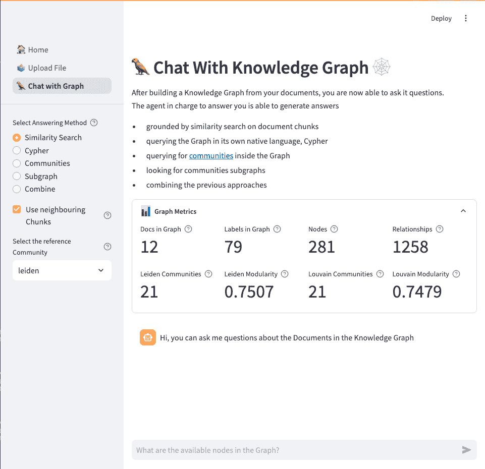
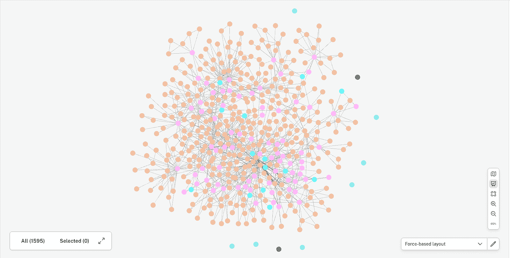
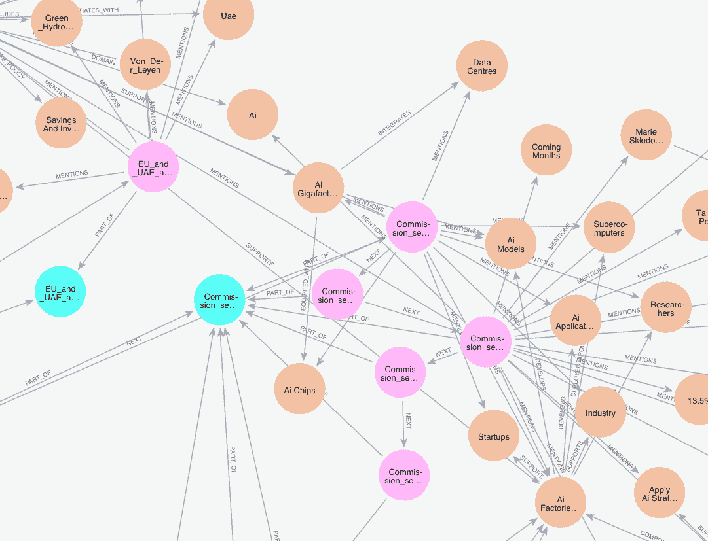
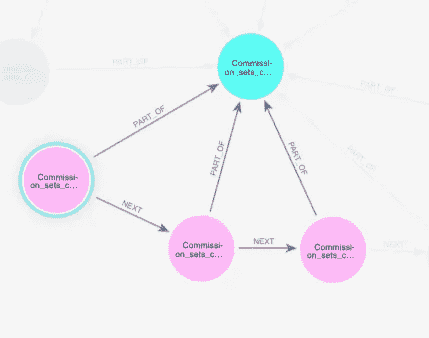
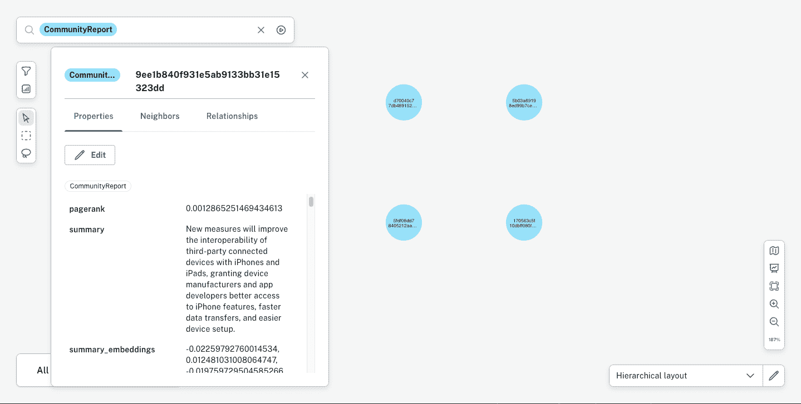
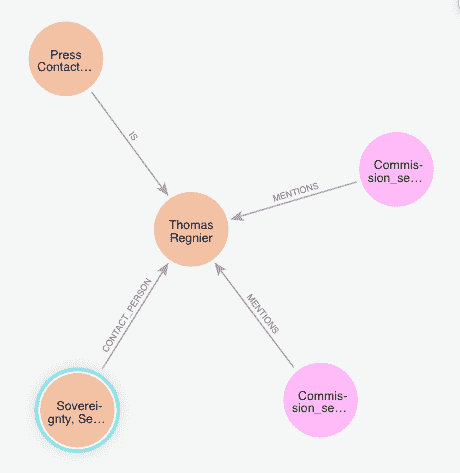
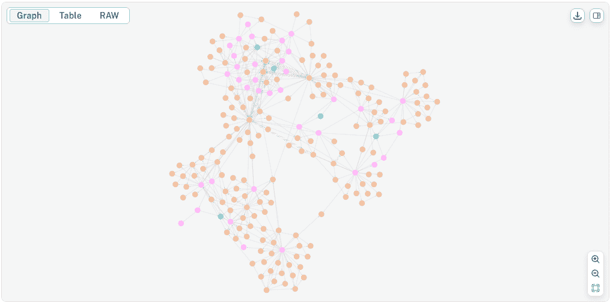
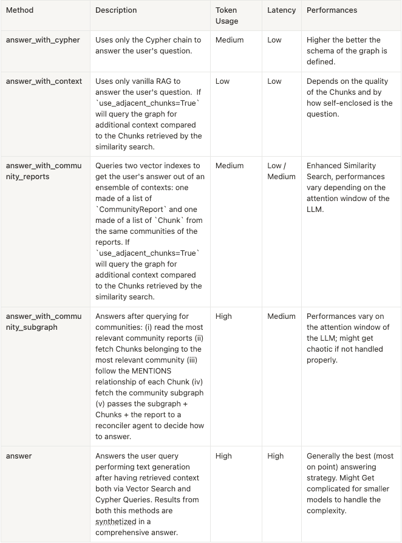

# 使用 LLM 构建和查询知识图谱

> [`towardsdatascience.com/build-query-knowledge-graphs-with-llms/`](https://towardsdatascience.com/build-query-knowledge-graphs-with-llms/)

## <mdspan datatext="el1746215600490" class="mdspan-comment">知识图谱</mdspan>是相关的

知识图谱可以被定义为一种结构化信息表示，它以模仿人类理解的方式连接概念、实体及其关系。它通常用于组织并整合来自各种来源的数据，使机器能够更有效地进行推理、推断和检索相关信息。

在 Medium 的一篇[先前文章](https://medium.com/@tartarinidylan/on-knowledge-graphs-and-their-relevance-fc0b9dc1602c)中，我提出这种结构化表示可以用来增强和优化 LLM 在检索增强生成应用中的性能。我们可以将 GraphRAG 理解为一种技术集合和策略，它使用基于图的知识表示来更好地服务于 LLM，相比于更标准的“与文档聊天”用例的方法。

“原味”RAG 方法依赖于向量相似度（有时是混合搜索），目标是根据某些相似度度量（如余弦或欧几里得）从向量数据库中检索与用户输入 ***相似*** 的信息片段（文档片段）。然后，将这些信息片段传递给大型语言模型，并提示其使用这些信息作为上下文来生成与用户查询相关的输出。

我的观点是，这类应用中最大的失败点在于依赖于知识库中显式提及的相似性搜索（*文档内级别*），这使得 LLM 对文档之间的交叉引用、甚至隐含（隐式）和上下文相关的引用视而不见。简而言之，LLM 的局限性在于它不能在 *文档间* 层面上进行推理。

这可以通过从纯向量表示和向量存储转向更全面的知识库组织方式来解决，从每段文本中提取概念，并在存储的同时跟踪信息片段之间的关系。

在我看来，图结构是组织包含交叉引用和相互隐含提及的文档知识库的最佳方式，就像它总是在组织和企业内部发生的那样。图的主要特征实际上包括

+   **实体**（节点）：它们代表现实世界中的对象，如人、地点、组织或抽象概念；

+   **关系**（边）：它们定义了实体之间如何相互连接（例如：“比尔 → WORKS_AT → 微软”）；

+   **属性**（属性）：提供关于实体（例如，微软的成立年份、收入或位置）或关系（例如，“比尔 → FRIENDS_WITH {since: 2021} → 马克”）的额外详细信息。

知识图谱可以定义为来自一致领域的文档语料库的图表示。但我们究竟如何从向量表示和向量数据库过渡到知识图谱呢？

此外，**我们如何提取关键信息来构建知识图谱**？

在这篇文章中，我将提出我对这个问题的观点，并从我在学习实验知识图谱时开发的仓库中提供代码示例。这个[仓库](https://github.com/DylanTartarini1996/knowledge-graphs)在我的 GitHub 上公开可用，并包含：

+   项目的源代码

+   在构建仓库时编写的示例笔记本

+   一个 Streamlit 应用程序来展示到目前为止完成的工作

+   一个 Docker 文件，用于构建项目的镜像，而无需手动安装运行项目所需的所有软件。

文章将介绍仓库，以涵盖以下主题：

✅ 工具**技术栈分解**，包括对构建项目所使用的每个组件的简要介绍。

✅ **如何在您自己的本地环境中启动和运行演示**。

✅ **如何执行文档的** **摄取过程**，包括从中提取概念并将它们组装成知识图谱。

✅ **如何查询图谱**，重点关注可以采用的多种策略来执行语义搜索、图查询语言生成和混合搜索。

如果你是数据科学家、ML/AI 工程师或者只是对如何构建更智能的搜索系统感兴趣的人，这个指南将带你通过完整的代码、上下文和清晰度的工作流程。

* * *

## 技术栈分解

作为从 2019/20 年开始学习编程的数据科学家，我的主要编程语言当然是 Python。在这里，我使用的是其 3.12 版本。

该项目侧重于开源工具和免费层访问性，无论是在存储方面还是在大型语言模型的可用性方面。这使得它对于新入门者或不愿意为云基础设施或 OpenAI 的 API 密钥付费的人来说是一个很好的起点。

然而，源代码的编写是以生产用例为前提的——不仅关注快速演示，还关注如何将项目过渡到现实世界的部署。因此，代码被设计成**易于定制**、**模块化**和**可扩展**，以便可以以最小的摩擦适应您自己的数据源、LLMs 和工作流程。

下面是关键组件的分解以及它们是如何协同工作的。您还可以阅读仓库的[README.md](https://github.com/DylanTartarini1996/knowledge-graphs/blob/main/README.md)，以获取有关如何启动和运行演示应用程序的更多信息。

#### 🕸️ Neo4j—图数据库 + 向量存储

Neo4j 提供知识图谱层，并存储用于语义搜索的向量嵌入。Neo4j 的核心是**Cypher**，这是与 Neo4j 数据库交互所需的查询语言。在此项目中使用的 Neo4j 的一些关键其他功能包括：

+   **GraphDB**：用于存储实体和概念之间的结构化关系。

+   **VectorDB**：嵌入支持允许相似性搜索和混合查询。

+   **Python SDK**：Neo4j 提供了一个[python 驱动程序](https://neo4j.com/docs/python-manual/current/)来与其实例交互并围绕它进行包装。多亏了 python 驱动程序，了解 Cypher 不是与这个 repo 中的代码交互的必要条件。多亏了 SDK，我们能够使用其他 Python 图数据科学库，如`networkx`或`python-louvain`。

+   **本地开发**：Neo4j 提供[桌面版本](https://neo4j.com/download/)，并且也可以通过 Docker 镜像轻松部署到容器或任何虚拟机（Linux/macOS/Windows）。

+   **生产云**：您还可以使用[Neo4j Aura](https://neo4j.com/product/auradb/)进行完全管理的解决方案；这附带免费层，并且可以根据您的需求托管在任何云中。

#### 🦜 LangChain — LLM 工作流程的代理框架

[LangChain](https://www.langchain.com/)用于协调 LLM 如何与向量索引和知识图谱中的实体以及用户输入等工具交互。

+   用于定义自定义代理和工具链。

+   与检索器、内存和提示模板集成。

+   使替换不同的 LLM 后端变得容易。

#### 🤖 LLMs + Embeddings

LLMs 和 Embeddings 可以从使用[Ollama](https://ollama.com/)的本地部署或您选择的在线端点调用。我目前正在使用[Groq](https://console.groq.com/home)免费层 API 进行实验，在`gemma2-9b-it`和 Llama 的各种版本之间切换，例如`meta-llama/llama-4-scout-17b-16e-instruct`。对于 Embeddings，我正在使用`mxbai-embed-large`在我的 M1 Macbook Air 上通过 Ollama 运行；在相同的设置中，我过去还能够运行`llama3.2`（2B），考虑到我的硬件限制。

Ollama 和 Groq 都是即插即用，并且有 Langchain 的包装器。

#### 👑 Streamlit — 交互和演示的前端 UI

我使用 [Streamlit](https://streamlit.io/) 编写了一个小型演示应用程序，这是一个允许开发者构建最小前端层而无需编写任何 HTML 或 CSS，只需纯 Python 的 Python 库。

在这个演示应用程序中，您将看到如何

+   将您的文档以图为基础的形式导入 Neo4j。

+   展示基于图查询的实时演示，突出各种查询策略之间的关键差异。

Streamlit 的主要优势是它非常轻量级，部署速度快，不需要单独的前端框架或后端。其功能使其非常适合像这样的演示和原型。



这就是 Streamlit 应用程序的外观。

* * *

然而，由于其有限的定制功能和 UI 控制，以及缺乏原生的授权和认证方式，以及适当的扩展处理方式，它不适合生产应用程序。从演示到生产通常需要更合适的客户端框架，以及后端和前端框架及其职责的明确分离。

#### 🐳 Docker—本地开发和部署的容器化工具

Docker 是一个工具，它允许您将应用程序及其所有依赖项打包到一个**容器**中——一个轻量级、独立且可移植的环境，可以在任何系统上一致地运行。

由于我想象到管理所有提到的依赖项可能具有挑战性，我还添加了一个[Dockerfile](https://github.com/DylanTartarini1996/knowledge-graphs/blob/main/Dockerfile)，用于构建应用程序的镜像，这样 Neo4j、Ollama 以及应用程序本身就可以通过[docker-compose](https://github.com/DylanTartarini1996/knowledge-graphs/blob/main/docker-compose.yml)在隔离、可重复的容器中运行。

> 要自己运行演示应用程序，您可以遵循[README.md](https://github.com/DylanTartarini1996/knowledge-graphs/blob/main/README.md)上的说明。

现在我们已经介绍了将要使用的技术栈，我们可以深入探讨应用程序背后幕后的实际工作原理，从摄入管道开始。

* * *

## 从文本语料库到知识图谱

正如我之前提到的，建议被摄入到知识图谱中的文档来自同一领域。这些可能是关于疾病及其症状的医疗领域的手册，过去项目的代码文档，或者关于特定主题的报纸文章。

作为一名政治爱好者，为了测试和玩弄我的代码，我选择了来自[欧洲委员会新闻角](https://ec.europa.eu/commission/presscorner/home/en)的 PDF 新闻资料。

一旦收集到文档，我们必须将它们摄入到知识图谱中。

摄入管道需要遵循以下步骤。

> 本文该部分的参考源代码位于[src/ingestion](https://github.com/DylanTartarini1996/knowledge-graphs/tree/main/src/ingestion)。

#### 1. 将文件加载到机器友好的格式中

在下面的代码示例中，使用`Ingestor`类来推断我们试图读取的每个文件的 MIME 类型，并使用 langchain 的文档加载器相应地读取其内容；这允许对将填充我们的知识图谱的源文件格式进行自定义。

```py
class Ingestor:
    """ 
    Base `Ingestor` Class with common methods. 
    Can be specialized by source.
    """ 
    def ___init__(self, source: Source):
        self.source = source

    @abstractmethod
    def list_files(self)-> List[str]:
        pass

    @abstractmethod
    def file_preparation(self, file) -> Tuple[str, dict]:
        pass

    @staticmethod
    def load_file(filepath: str, metadata: dict) -> List[Document]:
        mime = magic.Magic(mime=True)
        mime_type = mime.from_file(filepath) or metadata.get('Content-Type')
        if mime_type == 'inode/x-empty':
            return []

        loader_class = MIME_TYPE_MAPPING.get(mime_type)
        if not loader_class:
            logger.warning(f'Unsupported MIME type: {mime_type} for file {filepath}, skipping.')
            return []

        if loader_class == PDFPlumberLoader:
            loader = loader_class(
                file_path=filepath,
                extract_images=False,
            )
        elif loader_class == Docx2txtLoader:
            loader = loader_class(
                file_path=filepath
            )
        elif loader_class == TextLoader:
            loader = loader_class(
                file_path=filepath
            )
        elif loader_class == BSHTMLLoader:
            loader = loader_class(
                file_path=filepath,
                open_encoding="utf-8",
            )
        try: 
            return loader.load()
        except Exception as e:
            logger.warning(f"Error loading file: {filepath} with exception: {e}")   
            pass 

    @staticmethod
    def merge_pages(pages: List[Document]) -> str:
        return "\n\n".join(page.page_content for page in pages)

    @staticmethod
    def create_processed_document(file: str, document_content: str, metadata: dict):
        processed_doc = ProcessedDocument(filename=file, source=document_content, metadata=metadata)
        return processed_doc

    def ingest(self, filename: str, metadata: Dict[str, Any]) -> ProcessedDocument | None:
        """ 
        Loads a file from a path and turn it into a `ProcessedDocument`
        """

        base_name = os.path.basename(filename)

        document_pages = self.load_file(filename, metadata)

        try: 
            document_content = self.merge_pages(document_pages)
        except(TypeError):
            logger.warning(f"Empty document {filename}, skipping..")

        if document_content is not None:
            processed_doc = self.create_processed_document(
                base_name, 
                document_content, 
                metadata
            )
            return processed_doc

    def batch_ingest(self) -> List[ProcessedDocument]:
        """
        Ingests all files in a folder
        """
        processed_documents = []
        for file in self.list_files():
            file, metadata = self.file_preparation(file)
            processed_doc = self.ingest(file, metadata)
            if processed_doc:
                processed_documents.append(processed_doc)
        return processed_documents
```

#### 2. 清理并将文档内容分割成文本块

这对于我们即将进行的图提取阶段是必要的。为了清理文本，根据领域和文档的格式，编写自定义的清理和分块函数可能是有意义的。这就是文档的`chunks`列表被填充的地方。

块大小、重叠和其他可能的配置可能取决于领域，应根据 DS / AI 工程师的专业知识进行配置；负责分块的类在下面举例说明。

```py
class Chunker:
    """
    Contains methods to chunk the text of a (list of) `ProcessedDocument`.
    """

    def __init__(self, conf: ChunkerConf):
        self.chunker_type = conf.type

        if self.chunker_type == "recursive":

            self.chunk_size = conf.chunk_size
            self.chunk_overlap = conf.chunk_overlap

            self.splitter = RecursiveCharacterTextSplitter(
                chunk_size=self.chunk_size, 
                chunk_overlap=self.chunk_overlap, 
                is_separator_regex=False
            )

        else: 
            logger.warning(f"Chunker type '{self.chunker_type}' not supported.")

    def _chunk_document(self, text: str) -> list[str]:
        """Chunks the document and returns a list of chunks."""
        return self.splitter.split_text(text)

    def get_chunked_document_with_ids(
        self, 
        text: str, 
        ) -> list[dict]:
        """Chunks the document and returns a list of dictionaries with chunk ids and chunk text."""
        return [
            {
                "chunk_id": i + 1,
                "text": chunk,
                "chunk_size": self.chunk_size, 
                "chunk_overlap": self.chunk_overlap
            }
            for i, chunk in enumerate(self._chunk_document(text))
        ]

    def chunk_document(self, doc: ProcessedDocument) -> ProcessedDocument:
        """
        Chunks the text of a `ProcessedDocument` instance.
        """
        chunks_dict = self.get_chunked_document_with_ids(doc.source)

        doc.chunks = [Chunk(**chunk) for chunk in chunks_dict]

        logger.info(f"DOcument {doc.filename} has been chunked into {len(doc.chunks)} chunks.")

        return doc

    def chunk_documents(self, docs: List[ProcessedDocument]) -> List[ProcessedDocument]:
        """
        Chunks the text of a list of `ProcessedDocument` instances.
        """
        updated_docs = []
        for doc in docs:
            updated_docs.append(self.chunk_document(doc))
        return updated_docs
```

#### 3. 提取概念图

对于文档中的每个块，我们希望提取一个概念图。为此，我们编写了一个由 LLM 驱动的自定义代理，用于执行这个精确的任务。Langchain 在这里很有用，因为它有一个名为`with_structured_output`的方法，它包装 LLM 调用，并允许您使用 pydantic 模型定义预期的输出模式。这确保了您选择的 LLM 返回**结构化、验证过的响应，而不是自由形式的文本**。

这就是`GraphExtractor`的外观：

```py
class GraphExtractor:
    """ 
    Agent able to extract informations in a graph representation format from a given text.
    """
    def __init__(self, conf: LLMConf, ontology: Optional[Ontology]=None):
        self.conf = conf
        self.llm = fetch_llm(conf)
        self.prompt = get_graph_extractor_prompt()

        self.prompt.partial_variables = {
            'allowed_labels':ontology.allowed_labels if ontology and ontology.allowed_labels else "", 
            'labels_descriptions': ontology.labels_descriptions if ontology and ontology.labels_descriptions else "", 
            'allowed_relationships': ontology.allowed_relations if ontology and ontology.allowed_relations else ""
        }

    def extract_graph(self, text: str) -> _Graph:
        """ 
        Extracts a graph from a text.
        """

        if self.llm is not None:
            try:
                graph: _Graph = self.llm.with_structured_output(
                    schema=_Graph
                    ).invoke(
                        input=self.prompt.format(input_text=text)
                    )

                return graph 

            except Exception as e:
                logger.warning(f"Error while extracting graph: {e}")
```

注意，预期的输出`_Graph`被定义为：

```py
class _Node(Serializable):
    id: str
    type: str
    properties: Optional[Dict[str, str]] = None

class _Relationship(Serializable):
    source: str
    target: str
    type: str
    properties: Optional[Dict[str, str]] = None

class _Graph(Serializable):
    nodes: List[_Node]
    relationships: List[_Relationship]
```

可选地，负责从块中提取图的 LLM 代理可以提供描述文档领域本体。

> 本体可以被描述为图中可以存在的实体类型和关系的正式规范——本质上，它是其**蓝图**。

```py
class Ontology(BaseModel):
    allowed_labels: Optional[List[str]]=None
    labels_descriptions: Optional[Dict[str, str]]=None
    allowed_relations: Optional[List[str]]=None
```

#### 4. 嵌入文档的每个块

接下来，我们希望获得每个块中包含的文本的向量表示。这可以通过使用您选择的嵌入模型并将文档列表传递给`ChunkEmbedder`类来实现。

```py
class ChunkEmbedder:
    """ Contains methods to embed Chunks from a (list of) `ProcessedDocument`."""
    def __init__(self, conf: EmbedderConf):
        self.conf = conf
        self.embeddings = get_embeddings(conf)

        if self.embeddings:
            logger.info(f"Embedder of type '{self.conf.type}' initialized.")

    def embed_document_chunks(self, doc: ProcessedDocument) -> ProcessedDocument:
        """
        Embeds the chunks of a `ProcessedDocument` instance.
        """
        if self.embeddings is not None:
            for chunk in doc.chunks:
                chunk.embedding = self.embeddings.embed_documents([chunk.text])
                chunk.embeddings_model = self.conf.model
            logger.info(f"Embedded {len(doc.chunks)} chunks.")
            return doc
        else: 
            logger.warning(f"Embedder type '{self.conf.type}' is not yet implemented")

    def embed_documents_chunks(self, docs: List[ProcessedDocument]) -> List[ProcessedDocument]:
        """
        Embeds the chunks of a list of `ProcessedDocument` instances.
        """
        if self.embeddings is not None:
            for doc in docs:
                doc = self.embed_document_chunks(doc)
            return docs
        else: 
            logger.warning(f"Embedder type '{self.conf.type}' is not yet implemented")
            return docs
```

* * *

#### 5. 将嵌入的块保存到知识图中

最后，我们必须将文档及其块上传到我们的 Neo4j 实例中。我已经基于现有的`Neo4jGraph` langchain 类创建了一个针对此存储库的定制版本。

`KnowledgeGraph`类的代码可在[src/graph/knowledge_graph.py](https://github.com/DylanTartarini1996/knowledge-graphs/blob/main/src/graph/knowledge_graph.py)找到，这是其核心方法`add_documents`的工作方式：

a. 对于每个文件，在图上创建一个**文档节点**，并保存其属性（元数据），如文件来源、名称、摄入日期等。

b. 对于每个块，创建一个**块节点**，通过一个关系（`PART_OF`）连接到原始文档节点，并将块的嵌入保存为节点的属性；通过另一个关系（`NEXT`）将每个块节点与其他节点连接。

c. 对于每个块，保存提取的子图：节点、关系及其属性；我们还通过一个关系（`MENTIONS`）将它们连接到它们的源`Chunk`。

d. 在图上执行**层次聚类**以检测图内的**节点社区**。然后，使用一个 LLM 来总结生成的社区，获得社区报告，并将这些总结嵌入其中。

> 图中的社区是**节点簇或组**，它们彼此之间比与其他图中的节点更紧密地连接。换句话说，同一社区内的节点彼此之间有许多连接，而与组外节点的连接相对较少。

在 Neo4j 中，这个过程的结果看起来像这样：数据结构化为具有其属性的实体和关系，正如我们希望的那样。特别是，Neo4j 还提供了在同一实例中拥有多个向量索引的机会，我们利用这个特性将块的嵌入与社区的嵌入分开。



从欧洲委员会新闻角 PDFs 中获取的知识图谱：我们可以观察到文档节点（浅蓝色）、块节点（粉色）和实体节点（橙色）。蓝色节点代表社区报告，绿色节点用于图指标。

在上面的图像中，你可能已经注意到图中的一些节点彼此之间联系更紧密，而其他节点连接较少，位于图的边缘。由于你正在查看的图像是由欧洲委员会的新闻角 PDFs 生成的，所以在中心找到像“*冯·德·莱恩*”（欧洲委员会主席）甚至“*欧洲委员会*”这样的实体是很正常的：事实上，这些是我们知识图谱中最常提到的实体之一。

下面，你可以找到一个更详细的截图，其中关系和实体名称实际上是可见的。文档的原文件名（浅蓝色）位于中心是“*委员会为欧洲的人工智能领导地位设定路线图：一项雄心勃勃的人工智能大陆行动计划*”。显然，通过 LLM 提取实体和关系在这个例子上工作得相当不错。



在这里，标签和关系是可见的，可以用来了解一份新闻稿的主题。

一旦创建了知识图谱，我们就可以使用 LLM 和代理来查询它，并在可用的文档上提问。让我们开始吧！

* * *

## 基于图的检索增强生成

自从 2022 年底 ChatGPT 发布以来，我在检索增强生成、“*与你的文档聊天*”用例上构建了不少 POCs 和 Demos。

它们都采用了相同的方法来给最终用户提供所需的答案：嵌入用户问题，在所选的向量存储上进行相似性搜索，从向量存储中检索*k*个块（信息片段），然后将用户的问题和从这些块中获得的上下文传递给 LLM；最后回答问题。

你可能想要添加一些对话的记忆（即：聊天历史）以及执行一些*护栏*活动，例如跟踪过程中消耗的令牌和答案的延迟。许多向量存储也允许进行*混合搜索*，这和上面提到的过程相同，只是在相似性搜索之前，基于其元数据对块添加一个过滤器。

这就是这种 RAG 应用所达到的复杂程度：选择你想要检索的文本数量 *k*，预先确定过滤器，选择负责回答的 LLM。**最终，这类方法在性能上达到一个渐近线**，你可能只剩下少数几种选项来调整 LLM 参数以更好地处理用户查询。

**相反，知识图谱中的 RAG 方法看起来是什么样子？**对这个问题的诚实答案是：**这实际上取决于你将要提出什么类型的问题**。

在学习关于知识图谱及其在现实世界用例中的应用时，我花费了很长时间去阅读。博客文章、文章和 Medium 文章，甚至一些书籍。挖掘得越深，我心中的问题就越多，我的答案就越不明确：显然，**当处理既以图形表示又以向量索引结构化的知识时，会打开很多选项**。

在阅读之后，我花了一些时间开发我自己的答案（以及相应的代码）关于**在查询知识图谱时使用大型语言模型可以应用的战略**。以下是我对这个主题的简要探讨。

> 参考源代码是 GraphAgentResponder 类的一部分，可在[src/agents/graph_qa.p](https://github.com/DylanTartarini1996/knowledge-graphs/blob/main/src/agents/graph_qa.py)找到。

#### 1. 增强型 RAG

首先，你始终可以执行常规的 RAG 过程：块嵌入毕竟在图中可用，并且可以像检索任何其他向量数据库一样检索。此外，你还可以执行混合搜索，因为那些块实际上是节点，节点有属性（属性）可以用于过滤。

如果我们更进一步，考虑到块节点通过`NEXT`关系相互连接，并通过`PART_OF`关系与原始文档节点连接，会怎样？**在嵌入上进行相似性查询，然后通过相邻块丰富上下文**可能会在答案的细节级别和引用源文件及其元数据的能力方面解锁新的可能性。



查询相邻块以增强相似性搜索

例如，相似性搜索可能最终指向之前提到的文档的块 2，但查询相邻块可能允许 LLM 提供更详细、更有上下文的答案。

为了提供一个工作示例，让我们考虑一个关于之前截图所示的关于人工智能新闻发布的节点的问题：“*欧盟在人工智能方面的战略是什么？*。”这是我们的代理给出的答案：

```py
> `The EU strategy on artificial intelligence is outlined in the AI Continent Action Plan, which aims to make Europe a global leader in AI. The plan focuses on five key pillars:`
> 1\. `Building a large-scale AI data and computing infrastructure`
> 2\. `Creating a true internal market for data (with a comprehensive Data Union Strategy to be launched in 2025)`
> 3\. `Developing algorithms and fostering AI adoption in strategic EU sectors (through the Apply AI Strategy)`
> 4\. `Strengthening AI skills and talents (through initiatives such as the Talent Pool, Marie Skłodowska-Curie Action, and AI fellowships schemes)`
> 
> `The plan also includes initiatives such as setting up AI Factories and AI Gigafactories to support EU AI startups, industry, and researchers in developing AI models and applications.`
```

#### 2. 社区报告

在构建这个存储库的第一个版本时，我想到了另一种增强型 RAG 版本，它采用了社区报告。

实际上，在摄取阶段的最后一步，我们使用了**层次聚类技术**，如 Leiden 或 Louvain 算法，在知识图中的节点之间检测社区，然后使用 LLM 来**总结这些社区，获得社区报告**。

这些报告存储在 Graph 中，其向量索引与 Chunks 的索引不同，**这两个索引都可以通过相似度搜索进行查询**。此外，检索到的上下文可以在传递给 LLM 时组合，以**获得在文档内部级别有根据的答案，同时也了解跨文档级别图中的情况**。



作为知识图中的附加节点存储的社区报告，包括摘要及其嵌入

这种策略显然更适合那些可能需要从多个来源以概述或高级总结的形式获取信息的这类问题。

让我们回到“*欧盟对人工智能的战略是什么？*”这个问题，看看现在机器人如何回答，因为它能够通过相似度搜索检索到块和社区报告：

```py
> `The EU strategy on artificial intelligence aims to make the EU a leader in the development and deployment of AI that is trustworthy, safe, and respects human values and rights.`
> 
> 
> `To achieve this goal, in April 2019, the European Commission presented a Communication on AI, which outlined a European approach to AI. The approach focuses on:` 
> 
> 1\. **`Promoting excellence in AI**: The EU wants to support research and innovation in AI, and encourage the development of AI startups and scale-ups.`
> 2\. **`Ensuring trust in AI**: The EU aims to build trust in AI through a robust regulatory and legal framework. This includes the development of AI that respects EU values, such as the General Data Protection Regulation (GDPR).`
> 
> `The strategy also highlights the need for:`
> 
> - **`Investing in AI education and skills**: Developing the skills of the future workforce.`
> - **`Addressing the socio-economic changes driven by AI**: Preparing for changes in the job market.`
> - **`Establishing an EU AI ecosystem**: Encouraging collaboration and coordination among member states.`
> 
> `The European Commission also established an **AI regulatory framework**, proposing to regulate AI based on a **risk-based approach**, with stricter rules for high-risk AI applications. Would you like more information on specific aspects of the EU AI strategy?`
```

显然，答案的级别比之前更高。这是预期的，实际上当能够访问跨文档上下文时就会发生这种情况。

#### 3. Cypher 查询

离开纯粹基于 RAG（关系图）的策略，现在我们有了一个结构化的图知识库，我们可以选择让 LLM 使用图查询语言遍历它。在 Neo4j 中，这意味着我们想要指导 LLM 了解图的架构，然后要求它编写 Cypher 查询来检查节点、实体和关系，基于用户的问题。

所有这些都得益于`GraphCyperQAChain`，这是 langchain 中用于通过生成 Cypher 语句对图进行问答的 Chain 类。

在下面的例子中，您可以看到如果您向 LLM（大型语言模型）提出“*托马斯·雷吉耶是谁？*”这个问题会发生什么。

模型编写一个类似于的 Cypher 查询

```py
MATCH (person:Person {name: "Thomas Regnier"})-[r]-(connected)
RETURN person.name AS name,
  type(r) AS relationship_type,
  labels(connected) AS connected_node_labels,
  connected
```

并且在查看中间结果后，会得到如下回答：

```py
Thomas Regnier is the Contact person for Tech Sovereignity, 
defence, space and Research of the European Commission
```



查询“Who is Thomas Regnier?”会导致在我的图中检索以下节点

另一个您可能想要询问并需要图遍历能力来回答的问题示例可能是“*哪些文档提到了 Europe Direct？*”。这个问题将引导代理编写一个 Cypher 查询，搜索 Europe Direct 节点 → 搜索提及该节点的块节点 → 跟随从块到文档节点的关系。

这就是答案的样子：

```py
> `The following documents mention Europe Direct:`
> 1\. `STATEMENT/25/964`
> 2\. `STATEMENT/25/1028`
> 3\. `European Commission Press release (about Discover EU travel passes)`
> `These documents provide a phone number (00 800 67 89 10 11) and an email for Europe Direct for general public inquiries.`
```

注意，这种**纯粹基于查询的方法可能最适合那些在知识图谱中有简洁直接答案的问题，或者当图模式定义良好时**。当然，图中的模式概念与本文摄入部分提到的本体概念紧密相关：本体越精确、描述性越强，模式定义就越明确，LLM 编写 Cypher 查询来检查图就越容易。

#### 4. 社区子图

这种策略是社区报告方法和 Cypher 方法的组合，可以分解为以下步骤：

+   通过相似度搜索获取最相关的社区报告

+   获取属于最相关社区的所有块片

+   跟随这些块片的`MENTIONS`关系，并使用社区 ID 来获取一个**社区子图**

+   将生成的上下文和一个表示子图的字典传递给大型语言模型，以决定如何回答用户。



社区子图示例，表示我在图中 Leiden 社区 0 到 2 之间的节点

这是我列出的策略中“***正在进行中***”最严重的一个，不同运行的结果差异很大。它们目前并不一致，而且 LLM 通常会被收集到的所有信息所困惑。然而，我确实觉得这种方法值得进一步探索和研究。

很明显，这种策略很快就会变得非常复杂。为了处理这个问题，我在考虑在获取社区子图时是否使用某种类型的过滤器，同时更大的上下文大小对于 LLM（或更大的 LLM）也肯定有帮助。

#### 5. Cypher + RAG

我想要提出的最后一个策略是基于增强 RAG 方法和 Cypher 方法的组合。实际上，它**结合了来自相似度搜索的上下文以及`<strong>GraphCypherQAChain</strong>`的中间步骤，以提供一个全面且连贯的答案**。

为了给你一个代理可能表现方式的例子，让我们回到用于基于查询方法的其中一个问题：“*哪些文档提到了 Europe Direct?*”。

答案如下。如你所见，它既简短又信息丰富。

```py
> `The following documents mention Europe Direct:`
> 
> - `A press release about the European Commission offering 36,000 free EU travel passes to 18-year-olds, where general public inquiries can be made through Europe Direct by phone or email.`
> - `A statement about the European Commission's efforts to support businesses, workers, and Europeans, which includes contact information for general public inquiries through Europe Direct.`
> - `A press release about progress in research and innovation in Europe, which also provides contact information for general public inquiries through Europe Direct.`
> 
> `You can contact Europe Direct by phone at 00 800 67 89 10 11 or by email.`
```

这种回答方法是迄今为止我提出的最完整的方法之一，它还有一个回退策略：如果在查询生成部分出现问题（比如说，查询太复杂难以编写，或者 LLM 达到其令牌限制），代理仍然可以依赖增强 RAG 方法，这样我们仍然可以从它那里得到答案。

#### 总结和策略比较

在过去的几段中，我介绍了在我们将知识库良好组织成图时可以采用的不同回答策略。然而，我的介绍远未完整：还有许多其他可能性，我计划继续研究这个问题，并提出更多选项。

在我看来，由于图解锁了如此多的选项，**目标必须是理解这些策略在不同场景下的表现**——从轻量级语义查找到在丰富链接的知识图谱上的多跳推理——以及如何根据用例做出明智的权衡。

> 在构建现实世界应用时，**关键在于不仅要根据准确性权衡回答策略，还要根据成本、速度和可扩展性**。

在决定采用哪种策略时，我们可能想要考虑的关键驱动因素是

+   **令牌使用**：每个查询消耗的令牌数量，尤其是在遍历多跳路径或向提示中注入大型子图时

+   **延迟**：处理检索+生成周期所需的时间，包括图遍历、提示构建和模型推理

+   **性能**：生成的响应的质量和相关性，与语义忠实度、事实基础和连贯性相关。

下面，我提供了一个比较表，根据这些驱动因素分析了本节中提出的回答方法。



* * *

## 结束语

在本文中，我们详细介绍了使用 LLMs 构建和交互知识图谱的完整流程——从文档摄取到通过演示应用程序查询图。

我们涵盖了：

+   如何使用语义概念和关系将文档摄取并转换成结构化的知识图谱表示，这些概念和关系是通过 LLMs 提取的

+   如何在 Neo4j 中托管知识图谱

+   如何使用各种策略查询图，从向量相似性和混合搜索到图遍历和多跳推理——取决于检索任务

+   这些组件如何集成到使用 Streamlit 创建的完整功能演示中，并通过 Docker 容器化。

现在，我想听听大家的意见和评论……**贡献也欢迎**！

如果您觉得这个项目有用，有新功能的想法，或者想要帮助改进现有组件，请随时加入，提出问题或发送 Pull Requests。

感谢您阅读到这里！

* * *

### 参考文献

[1]. 本文展示的数据来自欧洲委员会新闻角：[`ec.europa.eu/commission/presscorner/home/en`](https://ec.europa.eu/commission/presscorner/home/en)。新闻稿可在 Creative Commons Attribution 4.0 International (CC BY 4.0)许可下获得。
