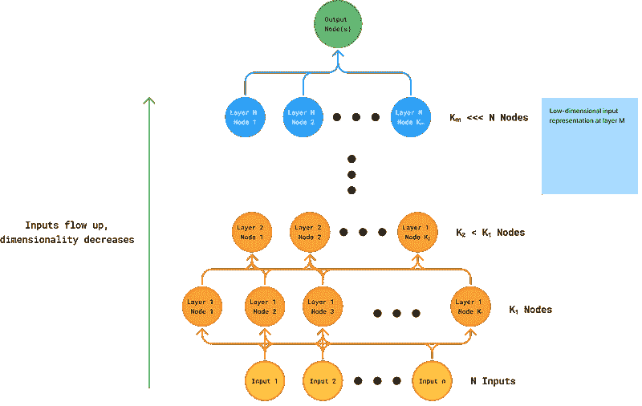
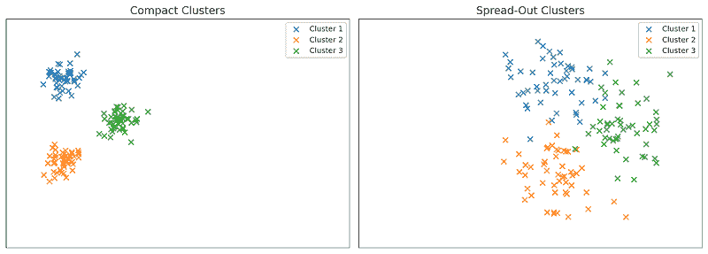
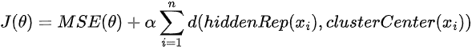
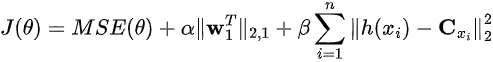
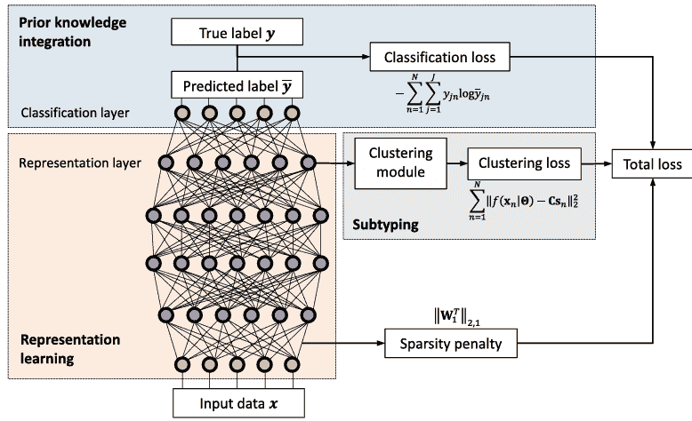
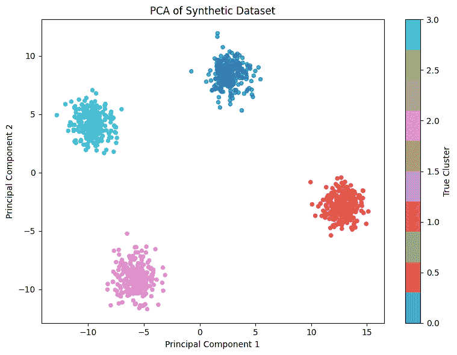
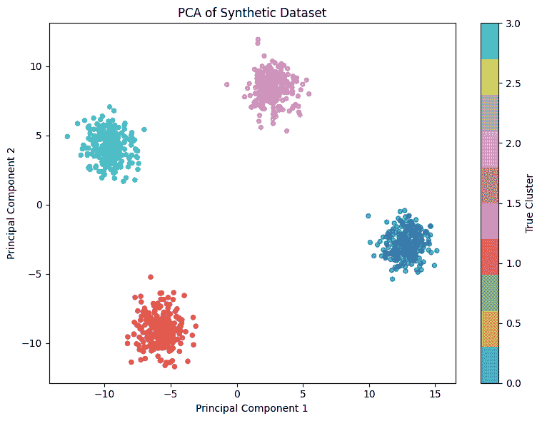
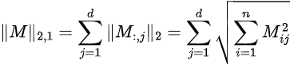

# 想要更好的聚类？试试 DeepType

> [`towardsdatascience.com/want-better-clusters-try-deeptype/`](https://towardsdatascience.com/want-better-clusters-try-deeptype/)

<mdspan datatext="el1746163342586" class="mdspan-comment">表面上看</mdspan>，神经网络和聚类算法似乎相隔甚远。神经网络通常用于监督学习，其目标是根据从标记数据集中学到的模式对新的数据进行标记。相比之下，聚类通常是一个无监督的任务：我们试图在无法访问真实标签的情况下发现数据中的关系。

事实上，深度学习对于聚类问题非常有用。关键思想是：假设我们使用反映我们关心的某个方面的损失函数来训练神经网络——比如说，我们如何好地分类或分离示例。如果网络实现了低损失，我们可以推断出它学习的**表示**（尤其是在倒数第二层）在数据中捕获了有意义的结构。换句话说，这些中间表示编码了网络关于任务的学习内容。

那么，如果我们对那些表示运行聚类算法（如 KMeans）会发生什么？理想情况下，我们最终得到的聚类将反映网络训练时要捕获的相同底层结构。

*哇，好多啊！* 这是一张图片：



展示输入如何通过我们的神经网络的图表

如图中所示，当我们运行输入直到倒数第二层时，我们得到一个包含 Kₘ值的向量，如果我们做得正确，这个值可能远低于我们开始时的输入量。因为输出层**仅关注这个向量进行预测**，如果我们的预测是好的，我们可以得出结论，这个向量封装了我们数据的一些重要信息。在这个空间中进行聚类比在原始数据中进行聚类更有意义，因为我们已经筛选出了真正重要的特征。

这就是**DeepType**的基本思想——一种用于聚类的神经网络方法。DeepType 不是直接对原始数据进行聚类，而是首先通过监督训练学习一个与任务相关的表示，然后在学到的空间中进行聚类。

然而，这确实提出了一个问题——如果我们已经有了真实标签，为什么还需要运行聚类？毕竟，如果我们只是使用标签进行聚类，难道不会创建一个完美的聚类吗？然后，对于新的数据点，我们只需运行我们的神经网络，预测标签，并适当地聚类该点。

实际上，在某些情况下，**我们更关心数据点之间的关系，而不是标签本身**。例如，在介绍 DeepType 的论文中（[`pubmed.ncbi.nlm.nih.gov/31603461/`](https://pubmed.ncbi.nlm.nih.gov/31603461/)），作者们使用了描述的想法来根据遗传数据找到不同分组的乳腺癌患者，这在生物背景下非常有用。他们随后发现这些组与生存率高度相关，考虑到他们聚类的表示中嵌入的生物知识，这是有道理的¹。

### 精炼思想：DeepType 的损失函数

到目前为止，我们理解了核心思想：训练一个神经网络来学习与任务相关的表示，然后在那个空间中进行聚类。然而，我们可以进行一些小的修改来使这个过程更好。

首先，我们希望尽可能使生成的簇是紧凑的。换句话说，我们更希望看到左边图片中的情况，而不是右边的情况：



图 2：左边的紧凑（好的）簇，右边的簇分布得更开

为了做到这一点，我们希望将同一簇中数据点的表示推向尽可能接近。为此，我们在损失函数中添加了一个惩罚项，该惩罚项惩罚输入表示与分配给簇中心的距离。因此，我们的损失函数变为



DeepType 损失包括表示。均方误差（MSE）可以替换为选择的损失，例如二元交叉熵（BCE）

其中 *d* 是向量之间的距离函数，即向量之间差异的范数的平方（正如原始论文中所使用的那样）。

但是等等，如果我们还没有训练网络，我们如何得到簇中心呢？为了解决这个问题，DeepType 执行以下程序：

1.  仅在主要损失上训练模型

1.  在表示空间中创建簇（例如使用 KMeans 或您喜欢的算法）

1.  使用修改后的损失函数训练模型

1.  返回步骤 2 并重复，直到我们收敛

最终，这个程序会产生紧凑的簇，希望它们对应于我们的兴趣损失。

### 寻找重要输入

在 DeepType 有用的上下文中，除了关心簇之外，我们还关心哪些输入是最具信息量/最重要的。例如，介绍 DeepType 的论文对确定哪些基因在决定某人的癌症亚型方面最重要感兴趣——这种信息对生物学家来说当然很有用。许多其他上下文也会对这种信息感兴趣——事实上，很难想象一个不会感兴趣的上下文。

在深度学习背景下，如果我们认为一个输入对第一层节点分配的权重幅度高，那么我们可以认为这个输入很重要。相反，如果我们的大部分节点对输入的权重接近 0，那么它对我们的最终预测贡献不大，因此可能并不那么重要。

因此，我们引入了一个最终的损失项——一个**稀疏度损失**——这将鼓励我们的神经网络尽可能地将许多输入权重推到 0。有了这个，我们的最终修改后的 DeepType 损失变为



包含表示的 DeepType 损失，MSE 可以被替换为选择的损失，例如 BCE

其中，beta 项是之前我们提到的距离项，而 alpha 项则有效地惩罚了第一层权重矩阵的“幅度”²。

我们还对上一节中的四步法进行了轻微的修改。在第一步中，我们不仅训练 MSE，还在预训练步骤中同时训练 MSE 和稀疏度损失。根据作者的说法，我们的最终 DeepType 结构如下所示：



DeepType 的整体视图。[来源](https://pmc.ncbi.nlm.nih.gov/articles/PMC8215925/pdf/btz769.pdf)

### 播放 DeepType

作为我的研究的一部分，我在这里发布了一个 DeepType 的[开源实现](https://github.com/PhysBoom/torch-deeptype)。您还可以通过`pip install torch-deeptype`从 pip 下载它。

DeepType 包使用相当简单的基础设施来测试一切。例如，我们将创建一个包含四个聚类和 20 个输入的合成数据集，其中只有 5 个输入实际上对输出有贡献：

```py
import numpy as np
import torch
from torch.utils.data import TensorDataset, DataLoader

# 1) Configuration
n_samples      = 1000
n_features     = 20
n_informative  = 5     # number of "important" features
n_clusters     = 4     # number of ground-truth clusters
noise_features = n_features - n_informative

# 2) Create distinct cluster centers in the informative subspace
#    (spread out so clusters are well separated)
informative_centers = np.random.randn(n_clusters, n_informative) * 5

# 3) Assign each sample to a cluster, then sample around that center
X_informative = np.zeros((n_samples, n_informative))
y_clusters    = np.random.randint(0, n_clusters, size=n_samples)
for i, c in enumerate(y_clusters):
    center = informative_centers[c]
    X_informative[i] = center + np.random.randn(n_informative)

# 4) Generate pure noise for the remaining features
X_noise = np.random.randn(n_samples, noise_features)

# 5) Concatenate informative + noise features
X = np.hstack([X_informative, X_noise])                # shape (1000, 20)
y = y_clusters                                        # shape (1000,)

# 6) Convert to torch tensors and build DataLoader
X_tensor = torch.from_numpy(X).float()
y_tensor = torch.from_numpy(y).long()

dataset      = TensorDataset(X_tensor, y_tensor)
train_loader = DataLoader(dataset, batch_size=64, shuffle=True)
```

这是我们绘制 PCA 图时的数据看起来是这样的：



合成数据集的 PCA 图

我们将定义一个`DeeptypeModel`——只要它实现了`forward`、`get_input_layer_weights`和`get_hidden_representations`函数，它可以是任何基础设施：

```py
import torch
import torch.nn as nn
from torch_deeptype import DeeptypeModel

class MyNet(DeeptypeModel):
    def __init__(self, input_dim: int, hidden_dim: int, output_dim: int):
        super().__init__()
        self.input_layer   = nn.Linear(input_dim, hidden_dim)
        self.h1            = nn.Linear(hidden_dim, hidden_dim)
        self.cluster_layer = nn.Linear(hidden_dim, hidden_dim // 2)
        self.output_layer  = nn.Linear(hidden_dim // 2, output_dim)

    def forward(self, x: torch.Tensor) -> torch.Tensor:
        # Notice how forward() gets the hidden representations
        hidden = self.get_hidden_representations(x)
        return self.output_layer(hidden)

    def get_input_layer_weights(self) -> torch.Tensor:
        return self.input_layer.weight

    def get_hidden_representations(self, x: torch.Tensor) -> torch.Tensor:
        x = torch.relu(self.input_layer(x))
        x = torch.relu(self.h1(x))
        x = torch.relu(self.cluster_layer(x))
        return x
```

然后，我们创建一个`DeeptypeTrainer`并对其进行训练：

```py
from torch_deeptype import DeeptypeTrainer

trainer = DeeptypeTrainer(
    model           = MyNet(input_dim=20, hidden_dim=64, output_dim=5),
    train_loader    = train_loader,
    primary_loss_fn = nn.CrossEntropyLoss(),
    num_clusters    = 4,       # K in KMeans
    sparsity_weight = 0.01,    # α for L₂ sparsity on input weights
    cluster_weight  = 0.5,     # β for cluster‐rep loss
    verbose         = True     # print per-epoch loss summaries
)

trainer.train(
    main_epochs           = 15,     # epochs for joint phase
    main_lr               = 1e-4,   # LR for joint phase
    pretrain_epochs       = 10,     # epochs for pretrain phase
    pretrain_lr           = 1e-3,   # LR for pretrain (defaults to main_lr if None)
    train_steps_per_batch = 8,      # inner updates per batch in joint phase
)
```

训练完成后，我们可以轻松地提取出重要的输入

```py
sorted_idx = trainer.model.get_sorted_input_indices()
print("Top 5 features by importance:", sorted_idx[:5].tolist())
print(trainer.model.get_input_importance())
>> Top 5 features by importance: [3, 1, 4, 2, 0]
>> tensor([0.7594, 0.8327, 0.8003, 0.9258, 0.8141, 0.0107, 0.0199, 0.0329, 0.0043,
        0.0025, 0.0448, 0.0054, 0.0119, 0.0021, 0.0190, 0.0055, 0.0063, 0.0073,
        0.0059, 0.0189], grad_fn=<LinalgVectorNormBackward0>)
```

这真是太棒了，我们如预期地得到了 5 个重要的输入！

我们还可以使用表示层轻松地提取聚类并绘制它们：

```py
centroids, labels = trainer.get_clusters(dataset)

plt.figure(figsize=(8, 6))
plt.scatter(
    components[:, 0],
    components[:, 1],
    c=labels,           
    cmap='tab10',
    s=20,
    alpha=0.7
)
plt.xlabel('Principal Component 1')
plt.ylabel('Principal Component 2')
plt.title('PCA of Synthetic Dataset')
plt.colorbar(label='True Cluster')
plt.tight_layout()
plt.show()
```



恢复的聚类的图

嗡的一声，这就完成了！

### 结论

虽然 DeepType 可能不是每个问题的正确工具，但它提供了一种将领域知识集成到聚类过程中的强大方式。所以如果你发现自己有一个有意义的损失函数，并且想要揭示数据中的结构——给 DeepType 一个机会！

*请通过[[email protected]](/cdn-cgi/l/email-protection)联系作者，如有任何疑问。除非另有说明，所有图片均为作者所有。*

* * *

1.  生物学家已经为更广泛的乳腺癌类别确定了一组癌症亚型。虽然我不是专家，但可以安全地假设这些亚型是由生物学家出于某种原因确定的。作者训练他们的模型来预测患者的亚型，这为产生新颖、有趣的聚类提供了必要的生物学背景。然而，考虑到目标，我不确定作者为什么选择预测亚型而不是直接预测患者结果，尽管——事实上，我敢打赌这样的实验结果会很有趣。

1.  所提出的范数定义为



L 2,1 范数定义

我们转置了 w，因为我们想要惩罚权重矩阵的列而不是行。这很重要，因为在全连接神经网络层中，**权重矩阵的每一列对应一个输入特征**。通过应用转置矩阵的ℓ2,1 范数，我们鼓励整个输入特征为零，从而促进特征级别的稀疏性

*封面图片来源：[这里](https://unsplash.com/photos/a-cluster-of-stars-in-the-night-sky-pFX99i3Ge4A)*
