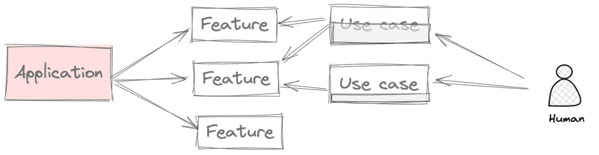
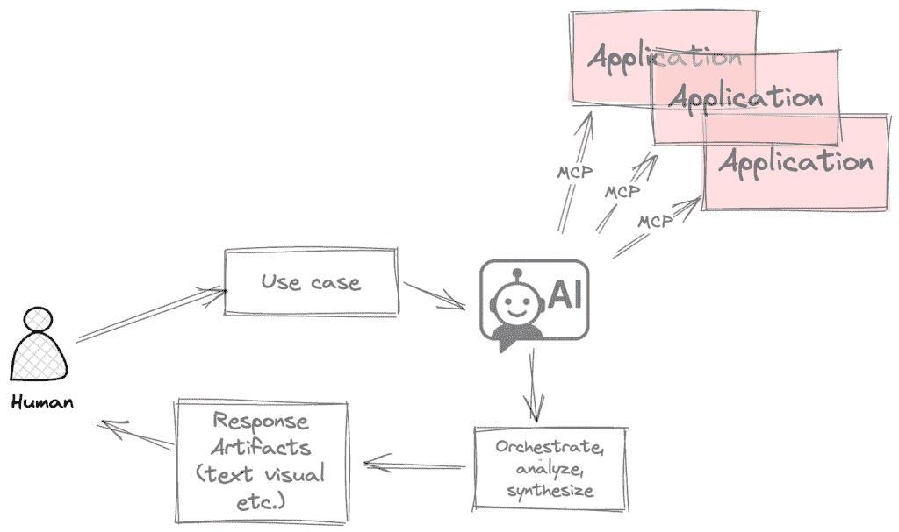
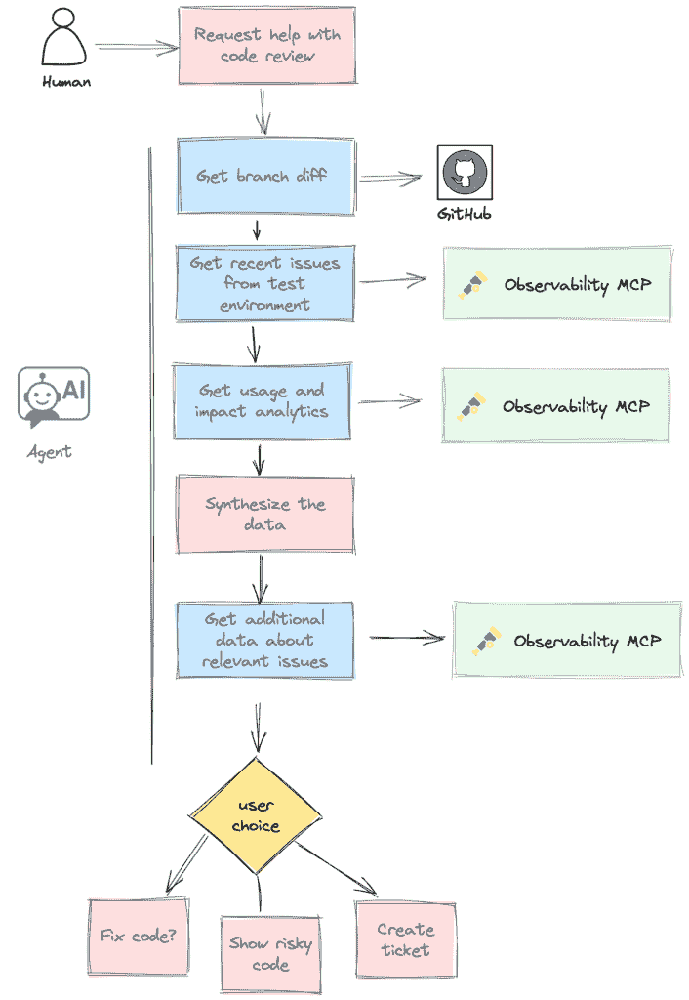
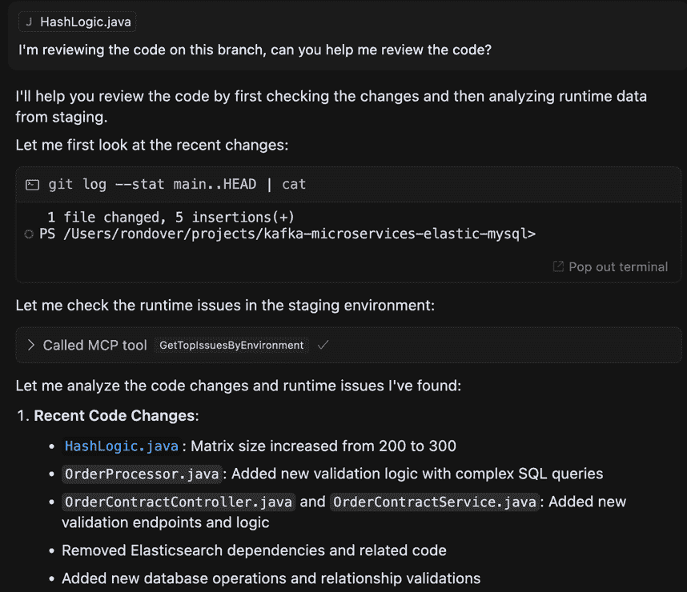
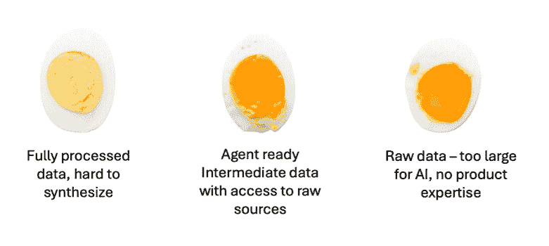

# 《告别 APM——可观察性的未来是 MCP 工具》

> [原文链接](https://towardsdatascience.com/a-farewell-to-apms-the-future-of-observability-is-mcp-tools/)

过去的几年是一段绝对刺激的过山车（或欢乐之旅），生成 AI 技术迅速发展。在我作为软件开发者的 25 年里，我无法回忆起类似规模的构造性变革，它已经在本质上改变了软件的编写方式。

认为这场革命仅仅停留在生成代码上，这种看法是短视的。随着 AI 代理的活跃和生态系统向新的集成开放，我们监控、理解和优化软件的基础也在被颠覆。在以人为中心的世界中，围绕手动警报、数据网格和仪表板等概念构建的工具已经变得无关紧要和过时。应用性能监控（APM）平台，尤其是它们如何利用日志、指标和跟踪，将需要认识到，拥有浏览、过滤和设置阈值所需时间资源的用户不再可用，团队已经将大量工作委托给了 AI。

智能代理正成为 SDLC（软件开发生命周期）的组成部分，它们能够自主分析、诊断和实时改进系统。这种新兴范式需要对一个老问题有新的看法。为了使代理和团队更高效，可观察性数据必须为机器而不是人类而结构化。最近的一项技术使得这一点成为可能，它也理应最近获得了大量的关注，那就是**模型上下文协议（MCP）**。

### MCPs 概述

模型上下文协议（MCP）最初由[**Anthropic**](https://www.anthropic.com/news/model-context-protocol)引入，它代表了 AI 代理和其他应用程序之间的通信层，允许代理访问额外的数据源并执行他们认为合适的行为。更重要的是，MCPs 为代理开辟了新的视野，使其能够智能地选择在超出其直接范围之外采取行动，从而扩大其可以解决的使用案例范围。

技术本身并不新颖，但生态系统是。在我看来，这相当于从定制移动应用开发发展到拥有应用商店。它目前正经历着寒武纪比例的增长，这并非偶然，因为仅仅拥有丰富和标准化的生态系统就为新的机会打开了市场。更广泛地说，MCPs 代表了一种以代理为中心的模型，用于创建新产品，可以改变应用程序的构建方式以及它们向最终用户交付价值的方式。

### 以人为中心的模型的局限性

大多数软件应用程序都是围绕人类作为其主要用户来构建的。一般来说，供应商决定投资开发某些产品功能，它认为这将很好地匹配最终用户的需求和需求。然后，用户试图利用该给定的功能集来尝试满足他们的特定需求。

作者图片

这种方法有三个主要局限性，随着团队采用 AI 代理以简化其流程，这些局限性正变得越来越阻碍：

1.  **固定界面**—产品经理必须预测和概括用例，以在应用程序中创建正确的界面。UI 或 API 集是固定的，不能适应每个独特的需求。因此，用户可能会发现某些功能对他们特定的需求来说完全没有用。有时，即使结合了功能，用户也可能无法获得他们所需的一切。

1.  **认知负荷**—与应用程序数据交互以获取用户所需信息的过程需要手动努力、资源和有时需要专业知识。以 APM（应用程序性能管理）为例，理解性能问题的根本原因并修复它可能需要一些调查，因为每个问题都是不同的。缺乏自动化和依赖自愿的手动过程通常意味着数据根本未被利用。

1.  **范围有限**—每个产品通常只包含解决特定需求所需的部分信息。例如，APM 可能拥有跟踪数据，但没有访问代码、GitHub 历史记录、Jira 趋势、基础设施数据或客户票据。用户必须使用多个来源进行分类，以找到每个问题的根源。

### 以代理为中心的 MCPs — 倒置的应用程序

随着 MCP（微服务容器）的出现，软件开发者现在可以选择采用不同的软件开发模型。不再专注于特定的用例，试图为硬编码的使用模式确定正确的 UI 元素，应用程序可以转变为 AI 驱动过程的资源。这描述了从支持少量预定义交互到支持众多**新兴**用例的转变。而不是投资于特定的功能，应用程序现在可以选择通过**数据**和**操作**将其领域专业知识借给 AI 代理，这些数据和行为可以在相关时（即使间接相关）有选择地使用。

作者图片

随着这种模型的扩展，代理可以无缝地整合来自不同应用程序和领域的数据和操作，例如 GitHub、Jira、可观察性平台、分析工具以及代码库本身。然后，代理可以作为数据综合的一部分自动执行分析过程，从而消除手动步骤和需要专业知识的需要。

#### 可观察性不是一个网络应用程序；它是数据专业知识

使用 Midjourney 生成的图片

让我们来看一个实际例子，这个例子可以说明一个以代理为中心的模型如何在工程过程中开辟新的神经通路**。**

每个开发者都知道**代码审查**需要大量努力；更糟糕的是，审查者经常被切换到其他任务，进一步消耗团队的生产力。表面上，这似乎是可观察性应用程序大放异彩的机会。毕竟，正在审查的代码已经在测试和预生产环境中积累了有意义的运行数据。理论上，这些信息可以帮助更深入地了解更改，它们影响的内容，以及它们可能如何改变系统行为。不幸的是，在多个应用程序和数据流中理解所有这些数据的成本很高，使得它几乎毫无用处。

然而，在一个以代理为中心的流程中，每当工程师要求人工智能代理协助审查新代码时，整个过程就变得完全自动化。在幕后，代理将协调跨多个应用程序和 MCPs 的调查步骤，包括可观察性工具，以提供关于代码更改的可操作见解。代理可以访问相关的运行时数据（例如，来自预发布运行的跟踪和日志），功能使用分析，GitHub 提交元数据，甚至 Jira 票务历史。然后，它将差异与相关的运行时跨度相关联，标记延迟回归或失败的交互，并指出可能与修改的代码相关的最近事件。

图片由作者提供

在这种情况下，开发者不需要在不同的工具或标签之间筛选，也不需要花费时间尝试连接点——代理在幕后将所有这些整合在一起，识别问题以及可能的解决方案。因为响应本身是动态生成的：它可能从一个简洁的文本摘要开始，扩展到显示随时间变化的指标的表格，包括指向受影响文件的 GitHub 链接，并突出显示更改，甚至嵌入一个图表，可视化发布前后错误的时序。

图片由作者提供

虽然上述工作流程是由代理自然产生的，但一些 AI 客户端允许用户通过向代理的记忆中添加规则来巩固期望的工作流程。例如，这是我目前正在 Cursor 中使用的内存文件，以确保所有代码审查提示都会一致地触发对测试环境的检查，并基于生产进行检查。

### 千种用例的死亡

代码审查场景只是许多**突现**用例之一，展示了 AI 如何悄无声息地利用相关的 MCP 数据来协助用户实现目标。更重要的是，用户不需要意识到代理正在自主使用的应用程序。从用户的角度来看，他们只需要描述他们的需求。

突现的使用案例可以通过无法通过其他方式访问的数据来提高用户的生产力。以下是一些其他示例，说明可观察性数据如何在不让任何人访问单个 APM 网页的情况下产生巨大影响：

+   **基于实际使用情况生成的测试**

+   根据影响性能最严重的代码问题选择正确的**重构**区域

+   当代码仍在签出时防止**破坏性变更**

+   检测**未使用代码**

#### 产品需要改变

然而，使可观察性对代理有用比仅仅将 MCP 适配器添加到 APM 上要复杂得多。事实上，许多当前一代的工具在匆忙支持新技术时采取了那条路线，没有考虑到 AI 代理也有其局限性。

虽然智能且强大，但代理不能立即替换与任何数据交互的任何应用程序，按需进行。在其当前版本中，至少它们受限于数据集的大小，并且无法应用更复杂的 ML 算法或甚至更高阶的数学。如果可观察性工具要成为代理的有效数据提供者，它必须提前准备数据以弥补这些限制。更广泛地说，这定义了 AI 时代产品的角色——提供非平凡领域专业知识岛屿，以便在 AI 驱动过程中使用。

图片由作者提供

关于如何为生成式 AI 代理准备数据的帖子有很多，我在本文末尾包含了一些链接。然而，我们可以大致描述一个好的 MCP 输出的要求：

+   **结构化**（模式一致、类型实体）

+   **预处理**（聚合、去重、标记）

+   **上下文化**（按会话、生命周期或意图分组）

+   **链接**（跨代码范围、日志、提交和工单的引用）

代替展示原始遥测数据，**MCP 必须在分析后向代理提供连贯的数据叙事**。代理不仅仅是一个要渲染的仪表板视图。同时，它还必须根据需要提供**相关**的原始数据，以便进行进一步调查，支持代理的自主推理操作。

即使有简单的原始数据访问权限，代理也很难识别出仅在数百万可用跟踪中 5%的跟踪内部表现出来的问题，更不用说根据其系统影响来优先处理该问题，或者确定该模式是否异常。

为了弥合这一差距，许多产品可能会演变成“AI 预处理器”，提供专门的 ML（机器学习）流程、高级统计分析以及领域专业知识。

### 再见，APM

最终，APM（应用性能管理）工具并非过时工具——它们代表了一种正在缓慢但肯定被取代的**过时思维模式**。行业重新调整可能需要更多时间，但它最终将影响我们目前使用的许多产品，尤其是在竞相采用生成式 AI 的软件行业。

随着 AI 在软件开发中的主导地位日益增强，它也不再局限于由人类发起的交互。生成式 AI 推理将被用作 CI（持续集成）过程的一部分，在某些情况下，甚至可以无限期地作为后台进程持续检查数据和执行操作。考虑到这一点，越来越多的工具将推出以代理为中心的模型补充，有时甚至取代直接面向人类的方法，否则可能会被排除在客户新的 AI SLDC（软件生命周期开发协作）堆栈之外。

### 链接和资源

+   [**Airbyte**](https://airbyte.com/blog/data-normalization-for-gen-ai-applications)：标准化是关键——模式一致性和关系链接提高了跨源推理。

+   [**Harrison Clarke**](https://www.harrisonclarke.com/blog/mastering-data-preprocessing-for-ai-elevating-model-performance)：预处理必须击中甜蜜点——足够丰富以进行推理，足够结构化以实现精确。

+   [**DigitalOcean**](https://www.digitalocean.com/community/conceptual-articles/send-data-to-genai-agents)：通过语义边界（用户会话、流量）进行聚合，可以解锁更好的分块和基于故事推理。

**想要联系？**您可以通过 Twitter @doppleware 或通过[LinkedIn](https://www.linkedin.com/in/ronidover/)联系我。

关注我的**MCP**（代码分析），使用可观察性进行动态代码分析，请访问[`github.com/digma-ai/digma-mcp-server`](https://github.com/digma-ai/digma-mcp-server)。
