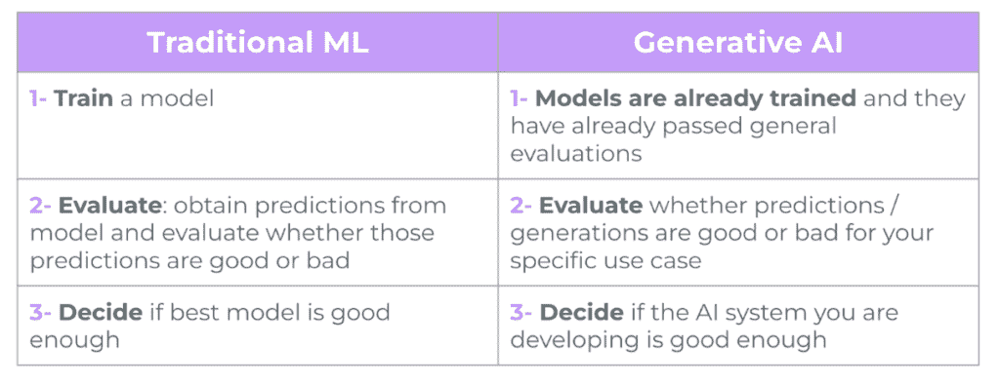
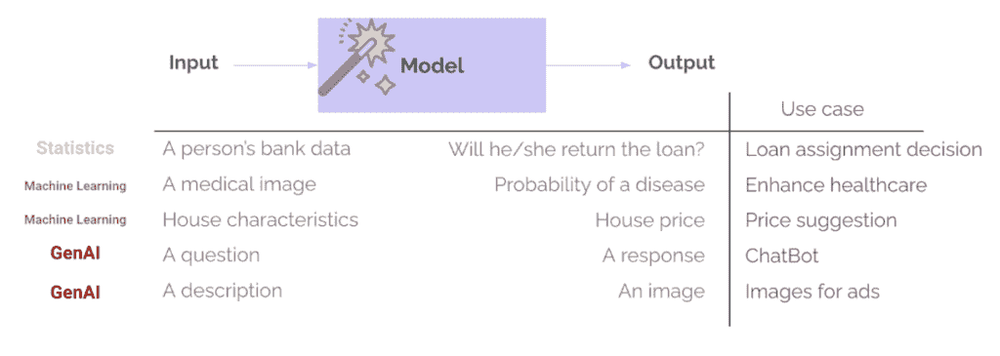

# 如何确保您的 AI 解决方案做到您期望它做到的事情

> [如何确保您的 AI 解决方案做到您期望它做到的事情](https://towardsdatascience.com/how-to-ensure-your-ai-solution-does-what-you-expect-it-to-do/)

<mdspan datatext="el1745889774796" class="mdspan-comment">生成式 AI（GenAI）正在快速发展——它不再仅仅是关于有趣的聊天机器人或令人印象深刻的图像生成。2025 年是关注将 AI 炒作转化为实际价值的年份。世界各地的企业都在寻找将 GenAI 整合到其产品和流程中的方法——以更好地服务用户、提高效率、保持竞争力并推动增长。多亏了主要提供商的 API 和预训练模型，整合 GenAI 比以往任何时候都更容易。但这里有个问题：**仅仅因为整合变得容易，并不意味着 AI 解决方案部署后就会按预期工作**。

预测模型其实并不新鲜：作为人类，我们已经预测事物多年，最初从统计学开始。然而，**生成式 AI（GenAI）由于许多原因而彻底改变了预测领域**：

+   您无需训练自己的模型或成为数据科学家即可构建 AI 解决方案

+   通过聊天界面和 API 现在可以轻松使用 AI

+   解锁许多以前无法完成或非常难以完成的事情

所有这些因素都使**GenAI 既令人兴奋又充满风险**。与传统的软件——甚至经典机器学习不同——GenAI 引入了一个新的不可预测性水平。你不是在实现确定性的逻辑，而是在使用基于大量数据训练的模型，希望它能按需响应。那么我们如何知道 AI 系统是否在按照我们的意图行事？我们如何知道它是否准备好上线？答案是评估（evals），这是我们将在本文中探讨的概念：

+   为什么 GenAI 系统不能像传统软件或甚至经典机器学习（ML）那样进行测试

+   为什么评估对于理解您 AI 系统的质量至关重要，并且不是可选项（除非你喜欢惊喜）

+   不同的评估类型及其在实际应用中的技术

无论你是产品经理、工程师，还是任何在 AI 领域工作或感兴趣的人，我希望这篇文章能帮助你理解如何批判性地思考 AI 系统质量（以及为什么评估对于实现这种质量至关重要！）。

## GenAI 不能像传统软件那样进行测试——甚至不能像经典机器学习那样

**在传统的软件开发中**，系统遵循确定性的逻辑：**如果发生 X 事件，那么 Y 将发生**——总是如此。除非你的平台出现问题，或者你在代码中引入了错误……这就是你添加测试、监控和警报的原因。单元测试用于验证小块代码，集成测试用于确保组件协同工作良好，监控用于检测生产中是否出现问题。测试传统软件就像检查计算器是否工作。你输入 2 + 2，你期望得到 4。清晰且确定，要么正确，要么错误。

然而，机器学习（ML）和人工智能（AI）引入了非确定性和概率。我们不再通过规则明确定义行为，而是训练模型从数据中学习模式。**在人工智能中，如果发生 X 事件，输出就不再是硬编码的 Y，而是基于模型在训练期间学习到的内容，具有一定概率的预测**。这可以非常强大，但也引入了不确定性：相同的输入可能在不同的时间产生不同的输出，看似合理的输出实际上可能是错误的，罕见场景可能出现意外的行为……

这使得传统的测试方法不足，有时甚至不切实际。计算器示例更接近于尝试评估学生在开放式考试中的表现。对于每个问题，以及许多可能的回答方式，提供的答案是否正确？是否高于学生应有的知识水平？学生是否全凭想象，但听起来非常有说服力？就像考试中的答案一样，**AI 系统可以评估，但需要一种更通用和灵活的方式，以适应不同的输入、上下文和用例（或考试类型）**。

**在传统的机器学习（ML）中，评估已经是项目生命周期的一个成熟部分**。在像贷款审批或疾病检测这样的狭窄任务上训练模型始终包括一个评估步骤——使用准确率、精确率、RMSE、MAE 等指标。这用于衡量模型的性能，比较不同模型选项，并决定模型是否足够好，可以继续部署。在生成人工智能（GenAI）中，这通常会有所变化：团队使用已经训练并已经通过内部模型提供方和公共基准测试的通用评估的模型。这些模型在通用任务——如回答问题或撰写电子邮件——上表现得如此出色，以至于我们可能会过度信任它们在我们的特定用例中。然而，仍然重要的是要问“*这个令人惊叹的模型是否足够好，可以用于我的用例？*”。这正是评估的用武之地——评估预测或生成是否适合你的特定用例、上下文、输入和用户。

训练和评估——传统机器学习与生成人工智能，图片由作者提供

机器学习和生成式 AI 之间还有一个很大的不同点：模型输出的多样性和复杂性。我们不再返回类别和概率（例如，客户可能偿还贷款的概率），或数字（例如，基于其特征的预测房价）。生成式 AI 系统可以返回许多类型的输出，长度不同，语气、内容、格式各异。同样，这些模型也不再需要结构化和非常确定的输入，但通常可以接受几乎所有类型的输入——文本、图像，甚至是音频或视频。因此，评估变得更加困难。

输入/输出关系 - 统计与传统的机器学习 vs 生成式 AI，图片由作者提供

## 为什么评估不是可选项（除非你喜欢惊喜）

评估帮助你衡量你的 AI 系统是否真的按照你*希望*的方式工作，系统是否准备好上线，一旦上线是否能够按预期持续表现。分解评估之所以必要的原因：

+   **质量评估**：评估提供了一种结构化的方式来理解你的人工智能预测或输出的质量，以及它们如何集成到整体系统和用例中。响应是否准确？有帮助？连贯？相关？

+   **错误量化**：评估有助于量化错误的百分比、类型和程度。事情出错有多频繁？哪些类型的错误发生得更频繁（例如，假阳性、幻觉、格式错误）？

+   **风险缓解**：帮助你发现并预防在用户接触到之前的有害或偏见行为，保护你的公司免受声誉风险、道德问题和潜在监管问题的侵害。

生成式 AI，由于其自由的输入-输出关系和长文本生成，使得评估变得更加关键和复杂。当事情出错时，它们可能会出得很糟。我们都见过关于聊天机器人提供危险建议、模型生成有偏见的内容或 AI 工具产生虚假事实的头条新闻。

> “*AI 永远不会完美，但有了评估，你可以降低尴尬的风险——这可能会让你损失金钱、信誉，甚至可能成为 Twitter 上的病毒性时刻。*”

## 你如何定义评估策略？

图片由[akshayspaceship](https://unsplash.com/es/@akshayspaceship)在[Unsplash](https://unsplash.com/)提供

那么，我们如何定义我们的评估标准呢？评估标准并非一刀切。它们取决于具体的应用场景，并且应该与您的人工智能应用的具体目标相一致。如果您正在构建搜索引擎，您可能关心结果的相关性。如果是聊天机器人，您可能关心其有用性和安全性。如果是分类器，您可能更关心准确性和精确度。对于具有多个步骤的系统（例如，执行搜索、优先排序结果然后生成答案的 AI 系统），通常需要评估每个步骤。这里的想法是衡量每个步骤是否有助于达到总体成功指标（并通过这种方式了解在哪里集中迭代和改进）。

常见的评估领域包括：

+   **正确性与幻觉**：输出是否在事实上准确？它们是否在编造事实？

+   **相关性**：内容是否与用户的查询或提供的环境相一致？

+   安全性、偏见和毒性

+   **格式**：输出是否在预期的格式中（例如，JSON，有效的函数调用）？

+   **安全性、偏见与毒性**：系统是否生成有害、有偏见或有毒的内容？

**任务特定指标**。例如，在分类任务中，准确性和精确度等度量，在摘要任务中 ROUGE 或 BLEU，在代码生成任务中正则表达式和无错误检查的执行。

## 如何实际计算评估？

一旦您知道您要衡量什么，下一步就是设计您的测试用例。这将是一组示例（示例越多越好，但始终平衡价值和成本），其中您有：

+   **输入示例**：系统在生产中的实际输入。

+   **预期输出**（如果适用）：真实或期望的结果示例。

+   **评估方法**：一种评分机制来评估结果。

+   **评分或通过/失败**：计算出的指标，用于评估您的测试用例

根据您的需求、时间和预算，您可以使用几种技术作为评估方法：

+   **统计评分器，如** BLEU、ROUGE、METEOR 或嵌入之间的余弦相似度——适用于比较生成的文本与参考输出。

+   **传统的机器学习指标，如** 准确率、精确率、召回率和 AUC——最适合有标记数据的分类。

+   **LLM 作为评判者**：使用大型语言模型来评估输出（例如，“*这个答案正确且有用吗？*”）。特别适用于没有标记数据或评估开放式生成时。

**基于代码的评估**：使用正则表达式、逻辑规则或测试用例执行来验证格式。

## 总结

让我们用一个具体的例子来综合一下。假设您正在构建一个情感分析系统，以帮助您的客户支持团队优先处理收到的电子邮件。

目标是确保最紧急或负面的信息能够得到更快的响应——理想情况下减少挫折，提高满意度，并降低流失率。这是一个相对简单的用例，但即使在这样一个系统，输出有限的情况下，质量也很重要：错误的预测可能导致随机优先处理电子邮件，这意味着你的团队在浪费与系统相关的金钱。

那么你如何知道你的解决方案是否以所需的质量工作？你需要进行评估。以下是一些可能在这个特定用例中相关的评估示例：

+   **格式验证**：LLM 调用预测电子邮件情感的结果是否以预期的 JSON 格式返回？这可以通过基于代码的检查进行评估：正则表达式、模式验证等。

+   **情感分类准确率**：系统是否正确地对各种文本（短、长、多语言）进行情感分类？这可以通过使用标记数据并采用传统的机器学习指标进行评估——或者，如果没有标签，可以使用 LLM 作为裁判。

一旦解决方案上线，你还希望包括更多与解决方案最终影响相关的指标：*

+   **优先级有效性**：支持人员是否实际上被引导到最重要的电子邮件？优先级是否与期望的商业影响一致？

+   **最终业务影响**：随着时间的推移，这个系统是否在减少响应时间、降低客户流失率以及提高满意度评分？

**评估是确保我们在生产中构建有用、安全、有价值且用户就绪的 AI 系统**的关键。因此，无论你是在处理一个简单的分类器还是一个开放式聊天机器人，都要花时间定义“足够好”的含义（最小可行质量）——并围绕它构建评估来衡量它！

## 参考文献

[1] [你的 AI 产品需要评估](https://hamel.dev/blog/posts/evals/)，Hamel Husain

[2] [LLM 评估指标：终极 LLM 评估指南，Confident AI](https://www.confident-ai.com/blog/llm-evaluation-metrics-everything-you-need-for-llm-evaluation)

[3] [评估 AI 代理，deeplearning.ai + Arize](https://www.deeplearning.ai/short-courses/evaluating-ai-agents/)
