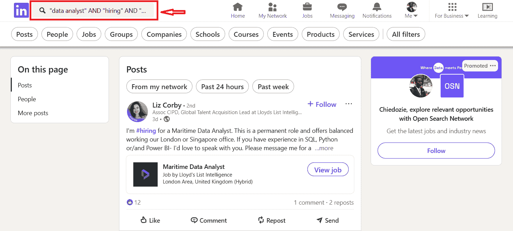

# 在 2025 年难以获得数据角色？这 5 个技巧将改变一切

> [在 2025 年难以获得数据角色？这 5 个技巧将改变一切](https://towardsdatascience.com/struggling-to-land-a-data-role-in-2025-these-5-tips-will-change-that/)

<mdspan datatext="el1745888927513" class="mdspan-comment">进入</mdspan>科技世界不再像以前那样容易（或光鲜）了。许多人发现很难找到进入当前科技市场的方法。这可能是因为许多原因，如竞争激烈的就业市场、缺乏空缺职位、对高级职位的更高需求、大规模裁员等。同时，科技领域继续充满许多拥有正确技能、能够在各种角色中脱颖而出的前景。虽然竞技场可能对所有人都不利，但有一些聪明的方法可以增强你的求职，使机会向有利于你的方向发展。

人们寻找和申请可用角色的方式在多年中已经发生了很大的变化。我们从在报纸上刊登招聘启事的时代过渡到了只需点击几下按钮就能发送数十份申请的阶段。许多技术使得招聘广告更容易获取，招聘人员可以轻松在线发现专业人士。事实上，最好的时光之一就是招聘人员追逐候选人的时候。啊，那些辉煌的日子！

由于一些促成因素，寻找新机会的旧方法得以繁荣。由于采用率很高，科技行业的机会丰富。许多公司愿意数字化他们的业务流程。对于快速增长的科技行业来说，缺乏具有正确技能的人才。更不用说，没有像 AI 这样先进的工具来处理大多数日常任务。所有这些以及更多因素使得进入科技行业变得更容易。快进到现在，事情已经发生了很大变化，对于大多数新手来说，情况变得更加艰难。

正如俗话所说，*急中生智*。在激烈的市场中脱颖而出，可能会在获得你下一个角色时产生巨大的差异。你可以根据你的个人资料、工作经验、作品集、技能集等脱颖而出。但在这篇文章中，我将向你展示如何通过让自己更容易获得细分市场机会来脱颖而出。这 5 个技巧将使你脱颖而出，并向更多机会展示自己。

## 布尔搜索

可以在招聘板上使用布尔搜索等高级搜索技巧，根据你的搜索查询找到更精细的角色。布尔搜索使用“AND”、“OR”和“NOT”等关键词来限制搜索结果。LinkedIn 是搜索查询可以变得更加具体的一个典型例子。你不仅可以使用 LinkedIn 的职位标签，还可以在帖子上进行布尔搜索，以发现招聘人员的 LinkedIn 帖子。

LinkedIn 上的布尔搜索/图片由作者提供

搜索查询**“data analyst” AND “hiring” AND “London”**返回所有包含这些搜索词的 LinkedIn 帖子。这些帖子几乎总是招聘人员寻找人才。这是在 LinkedIn 上找到招聘广告的最快方式。布尔搜索不仅限于 LinkedIn，你还可以从许多工作网站上获得这种搜索技巧。

## 扩展关键词搜索

扩展关键词搜索技术有助于根据除职位名称之外的其他搜索词来寻找工作机会。在在线搜索工作时，可以使用包括工具、工作流程名称、潜在项目名称等在内的搜索词。例如，在广告网站上，寻找数据分析师角色的人可以搜索“Power BI”或“Tableau”等工具。这种技术之所以有效，是因为基于工具的搜索方法会产生与你的技能集相匹配的结果。其次，大多数公司有不同的职位名称，这些名称在其他公司可能意味着相同的事情。公司“A”可能有一个商业分析师的空缺，但公司“B”可以决定将相同的职位命名为数据分析师或产品分析师。这些不同职位之间的工具和责任可能相同。通过将搜索重点放在这些工具和其他关键词上，你可以避免混淆并发现更多可能错过的相关机会。

## 通过网络获得的推荐

推荐是进入新领域时获得入门机会的常用技巧。虽然推荐在很大程度上是有效的，但提供推荐的人同样重要。这就是网络的作用所在。没有目的的网络很可能只是短暂的接触。你可以开始与人建立联系，仅仅是为了从他们那里获得推荐。所以下次你参加职业博览会时，可以在 LinkedIn 上与公司代表建立联系，并向他们寻求推荐。然后，这份推荐信将被用作申请你推荐人所在公司职位的附加文件。这种方法应该会给你带来提升，使你的求职申请得到更多关注。请求推荐信（函）比直接请求工作更容易，所以当大多数人同意提供推荐信时，不要感到惊讶。

## 冷电话

请听我说，我知道我之前说过找工作是个很大的请求，但冷打电话并不是一个坏主意，尤其是在策略性地进行时。*策略是什么？* 谢谢你的提问。冷打电话是一种让你自己出现在公众视野中的方式，让公司和行业专业人士更多地看到你。你可以通过冷打电话来询问公司是否有空缺职位，并展示你的技能集。你可能大多数情况下都会被拒绝，但这完全没问题。你可以进一步请求与公司进行信息面试，以评估自己，无论是否有空缺职位。信息面试可以使公司重新考虑你担任某个职位，或者帮助你为随后的面试做准备。无论如何，你都会变得更好。所以，查找你一直想为之工作的公司，并给他们打电话。

## 附近公司

谷歌地图在求职时是一个被低估的工具。谷歌地图不仅仅是一个帮助你找到最近 Tesco 的工具，它还可以根据特定行业识别和定位你周围的公司。使用正确的搜索查询，谷歌地图可以帮助你通过搜索行业来识别附近的任何行业的公司。你可以搜索“附近的软件公司”，这将返回你周围所有注册公司的地图，包括它们的网站和电子邮件地址。这是一个发现你可以轻松亲自访问的公司的好来源。

查找附近公司的谷歌地图/图片由作者提供

你可以联系谷歌地图上标识的公司，并询问这些公司是否有空缺职位。你还可以访问公司网站，了解更多关于公司的信息，以及它们是否适合你。如果你离公司很近，你也可以亲自去公司拜访。

## 结论

进入科技行业可能比以前更难，但绝不是不可能的。虽然市场更加竞争激烈，职位要求更高，但创造性和战略性的求职方法可以给你带来显著的优势。通过利用智能技术，如布尔搜索、扩展关键词搜索、寻求强有力的推荐、冷打电话以及使用谷歌地图等工具探索附近的公司，你可以在求职市场上扩大你的影响力和可见度。这关乎更聪明地工作，而不仅仅是更努力——调整你的方法可以在找到下一个机会时产生巨大的差异。

***

**谢谢！**

*喜欢这篇文章吗？* [*关注我*](https://medium.com/@doziesixtus)*，以便在发布新故事时收到通知。我将在这一领域发布更多文章。干杯！*
