# 如何使用 DAX Studio 从 Power BI 获取性能数据

> [原文链接](https://towardsdatascience.com/how-to-get-performance-data-from-power-bi-with-dax-studio/)

## <mdspan datatext="el1745362496873" class="mdspan-comment">简介</mdspan>

直接来说：今天我不会讨论如何优化 DAX 代码。

将会有更多文章跟进，专注于常见错误及其避免方法。

但在我们能够理解性能指标之前，我们需要了解 Power BI 中 Tabular 模型的架构。

同样的架构适用于 SQL Server Analysis Services 中的 Tabular 模型。

任何 Tabular 模型都有两个引擎：

+   存储引擎

+   公式引擎

这两个在 Tabular 模型中具有不同的属性，并执行不同的任务。

让我们调查一下。

## 存储引擎

存储引擎是 DAX 查询与 Tabular 模型中存储的数据之间的接口。

该引擎接受任何给定的 DAX 查询，并将查询发送到存储数据模型的 Vertipaq 存储引擎。

存储引擎使用一种名为 xmSQL 的语言来查询数据模型。

这种语言基于标准的 SQL 语言，但功能较少，仅支持简单的算术运算符（+、-、/、*、=、<> 和 IN）。

为了聚合数据，xmSQL 支持 `SUM`、`MIN`、`MAX`、`COUNT` 和 `DCOUNT`（唯一计数）。

然后，它支持 `GROUP BY`、`WHERE` 和 `JOINs`。

当您尝试理解 xmSQL 时，如果您对 SQL 查询有基本的了解，那将有所帮助。如果您不知道 SQL，当深入分析性能不佳的 DAX 代码时，学习基础知识将是有益的。

最重要的是，存储引擎是支持多线程的。

因此，当存储引擎执行查询时，它将使用多个 CPU 核心来加速查询执行。

最后，存储引擎可以缓存查询和结果。

因此，重复执行相同的查询将加快执行速度，因为结果可以从缓存中检索。

## 公式引擎

公式引擎是 DAX 引擎。

所有存储引擎无法执行的功能都由公式引擎执行。

通常，存储引擎从数据模型检索数据，并将结果传递给公式引擎。

这个操作被称为物化，因为数据被存储在内存中以供公式引擎处理。

如您所想，避免大规模物化至关重要。

当 xmSQL 查询包含存储引擎无法执行的功能时，存储引擎可以调用公式引擎。

这个操作 ID 被称为 `CallbackDataID`，如果可能的话，应避免使用。

关键的是，公式引擎是单线程的，并且没有缓存。

这意味着：

+   不通过使用多个 CPU 核心来并行处理

+   不重复执行相同的查询

这意味着我们希望尽可能将操作卸载到存储引擎。

不幸的是，我们无法直接定义我们的 DAX-Code 的哪一部分是由哪个引擎执行的。我们必须避免特定的模式，以确保正确的引擎以最短的时间完成工作。

这又是另一个可以填满整本书的故事。

但我们如何看到每个引擎使用的时间是多少？

## 获取性能数据

我们需要在我们的机器上安装 DAX Studio 以获取性能指标。

我们可以在下面的参考文献部分找到 DAX Studio 的下载链接。

如果您无法安装软件，您可以从同一网站获取便携式 DAX 版本。下载 ZIP 文件，并将其解压缩到任何本地文件夹。然后您可以启动 DAXStudio.exe，并获取所有功能而没有任何限制。

但首先，我们需要从 Power BI 获取 DAX 查询。

首先，我们需要在 Power BI Desktop 中启动性能分析：

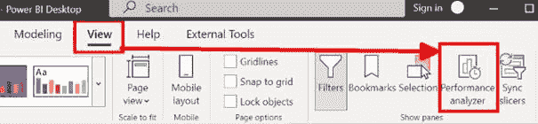

图 1 – 在 Power BI Desktop 中启动性能分析（图由作者提供）

一旦我们看到性能分析面板，我们就可以开始记录所有视觉的性能数据和 DAX 查询：

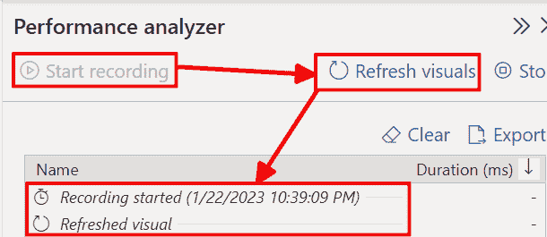

图 2 – 开始录制性能数据和 DAX 查询（图由作者提供）

首先，我们必须点击“开始录制”

然后点击“刷新视觉”以重新启动实际页面上所有视觉的渲染。

我们可以点击列表中的一行，并注意到相应的视觉也被激活了。

当我们展开报告中的一行时，我们会看到几行以及一个复制 DAX 查询到剪贴板的链接。

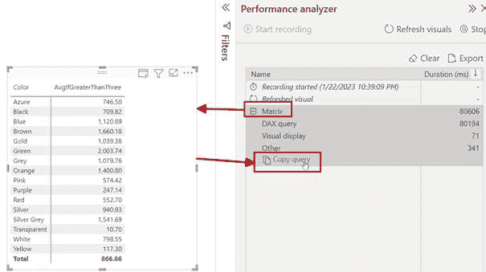

图 3 – 选择视觉并复制查询（图由作者提供）

如我们所见，Power BI 需要 80’606 毫秒来完成矩阵视觉的渲染。

DAX 查询本身用了 80’194 毫秒。

这是一个在这个视觉中使用的性能极差的度量值。

现在，我们可以启动 DAX Studio。

如果我们在机器上安装了 DAX Studio，我们将在外部工具功能区找到它：

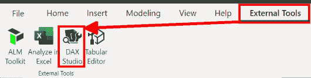

图 4 – 将 DAX Studio 作为外部工具启动（图由作者提供）

DAX Studio 将自动连接到 Power BI Desktop 文件。

如果我们必须手动启动 DAX Studio，我们也可以手动连接到 Power BI 文件：

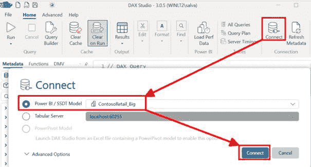

图 5 – 手动将 DAX Studio 连接到 Power BI Desktop（图由作者提供）

连接建立后，DAX Studio 中打开了一个空查询。

在 DAX Studio 窗口的底部，您将看到一个日志部分，您可以看到发生了什么。

但，在从 Power BI Desktop 粘贴 DAX 查询之前，我们必须在 DAX Studio 中启动服务器计时（DAX Studio 窗口的右上角）：

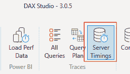

图 6 – 在 DAX Studio 中启动服务器计时（图由作者提供）

在将查询粘贴到空编辑器后，我们必须启用“运行时清除”按钮并执行查询。

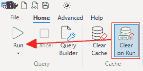

图 7 - 启用“运行时清除”功能（图由作者提供）

“运行时清除”确保在执行查询之前清除存储引擎缓存。

在测量性能指标之前清除缓存是最佳实践，以确保测量的起点一致。

执行查询后，我们将在 DAX Studio 窗口底部获得一个服务器计时页面：

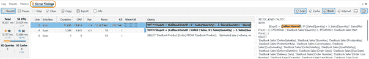

图 8 - DAX Studio 中的服务器计时窗口（图由作者提供）

现在我们看到了很多信息，我们将在下一部分进行探讨。

## 解释数据

在服务器计时窗口的左侧，我们将看到执行时间：

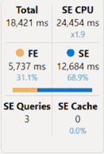

图 9 - 执行时间（图由作者提供）

我们看到以下数字：

+   Total - 毫秒（ms）的总执行时间

+   SE CPU - 存储引擎（SE）执行查询所花费的 CPU 时间总和。

    通常，这个数字大于总时间，因为使用了多个 CPU 核心进行并行执行

+   FE - 公式引擎（FE）所花费的时间和总执行时间的百分比

+   SE - 存储引擎（SE）所花费的时间和总执行时间的百分比

+   SE Queries - 为 DAX 查询所需的存储引擎查询数量

+   SE Cache - 如果有的话，存储引擎缓存的使用情况

常规做法：与公式引擎时间相比，存储引擎时间所占的百分比越大，越好。

中间部分显示了一个存储引擎查询列表：

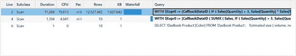

图 10 - 存储引擎查询列表（图由作者提供）

此列表显示了为 DAX 查询执行了多少个 SE 查询，并包括一些统计列：

+   Line - 索引行。通常我们不会看到所有行。但我们可以通过点击服务器计时面板右上角的缓存和内部按钮来查看所有行。但我们将发现它们并不非常有用，因为它们是可见查询的内部表示。有时查看缓存查询并查看 SE 缓存加速了查询的哪个部分可能会有所帮助。

+   子类 - 通常为“扫描”

+   Duration - 每个 SE 查询所花费的时间

+   CPU - 每个 SE 查询所花费的 CPU 时间

+   Par. - 每个 SE 查询的并行性

+   Rows and KB - SE 查询的物化大小

+   水瀑布 - 由 SE 查询的时序

+   查询 - 每个 SE 查询的开始

在这种情况下，第一个 SE 查询向公式引擎返回了 12,527,422 行（整个事实表中的行数），使用了 1GB 的内存。这并不好，因为像这样的大型物化是性能杀手。

这清楚地表明我们在您的 DAX 代码中犯了一个大错误。

最后，我们可以阅读实际的 xmSQL 代码：

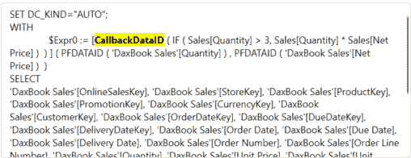

图 11 – 存储引擎查询代码（图由作者提供）

在这里我们可以看到 xmSQL 代码并尝试理解 DAX 查询的问题。

在这种情况下，我们可以看到有一个高亮的 CallbackDataID。DAX Studio 在查询文本中突出显示所有的 CallbackDataID，并将包含 CallbackDataID 的所有查询在查询列表中加粗。

我们可以看到，在这种情况下，一个 IF()函数被推送到公式引擎（FE），因为 SE 无法处理这个函数。但 SE 知道 FE 可以处理它。所以，它为结果中的每一行调用 FE。在这种情况下，超过 1200 万次。

从计时中我们可以看到，这需要很多时间。

现在我们知道我们写了一段不好的 DAX 代码，SE 多次调用 FE 来执行一个 DAX 函数。我们还知道我们使用了 1GB 的 RAM 来执行查询。

此外，我们还知道并行度只有 1.9 倍，这可以更好。

## 它应该看起来是什么样子

DAX 查询只包含 Power BI 桌面创建的查询。

但在大多数情况下，我们需要度量代码。

DAX Studio 提供了一个名为“定义度量”的功能，用于获取度量的 DAX 代码：

1.  在查询中添加一个或两个空行。

1.  将光标放在第一行（空行）上

1.  在数据模型中找到度量。

1.  右键单击度量并点击“定义度量”

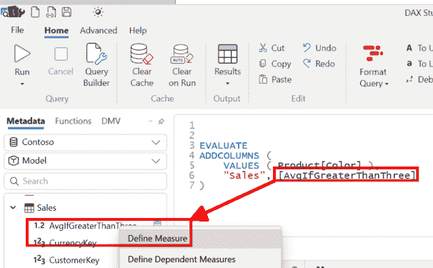

图 12 – 在 DAX Studio 中定义度量（图由作者提供）

5. 如果我们的度量调用另一个度量，我们可以点击“定义相关度量”。在这种情况下，DAX Studio 提取了所选度量使用的所有度量的代码

结果是一个`DEFINE`语句，后面跟着一个或多个包含我们嫌疑度量 DAX 代码的`MEASURE`语句。

在优化代码后，我执行了新的查询并获取了服务器计时，以将它们与原始数据进行比较：

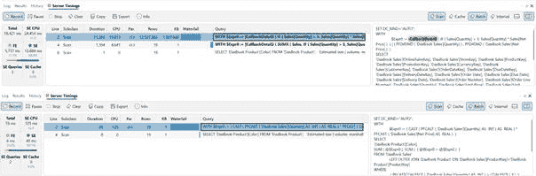

图 13 – 比较慢速和快速的 DAX 代码（图由作者提供）

现在，整个查询只用了 55 毫秒，SE 只创建了 19 行的物化。

并行度达到了 2.6 倍，这比 1.9 倍要好。看起来 SE 不需要那么多的处理能力来增加并行度。

这是一个非常好的迹象。

在查看这些数字之后，优化效果非常好。

## 结论

当我们在 Power BI 报告中有一个慢速的视觉时，我们需要一些信息。

第一步是使用 Power BI 桌面中的性能分析器来查看渲染视觉结果所花费的时间。

当我们看到执行 DAX 查询需要花费很多时间时，我们需要 DAX Studio 找出问题并尝试修复它。

在这篇文章中，我没有涵盖任何优化 DAX 的方法，因为这不是我的目标。

但现在我已经奠定了获取和理解 DAX Studio 中可用性能指标的基础，我可以写更多的文章来展示如何优化 DAX 代码，你应该避免什么，以及为什么。

我期待与你一同踏上这段旅程。

# 参考文献

免费下载 DAX Studio：[`www.sqlbi.com/tools/dax-studio/`](https://www.sqlbi.com/tools/dax-studio/)

免费 SQLBI 工具培训：[DAX 工具视频课程 – SQLBI](https://www.sqlbi.com/p/dax-tools-video-course/)

SQLBI 还提供 DAX 优化培训。

我使用的是 Contoso 示例数据集，就像在我之前的文章中一样。您可以从微软[此处](https://www.microsoft.com/en-us/download/details.aspx?id=18279)免费下载 ContosoRetailDW 数据集。

Contoso 数据可以在 MIT 许可证下自由使用，具体描述请参阅[此处](https://github.com/microsoft/Power-BI-Embedded-Contoso-Sales-Demo)。
