# 如何使用 DAX 编写表模型的查询

> 原文：[`towardsdatascience.com/601823-2/`](https://towardsdatascience.com/601823-2/)

## <mdspan datatext="el1745276188880" class="mdspan-comment">引言</mdspan>

[`EVALUATE`](https://dax.guide/st/evaluate/)是查询表模型的语句。

很不幸，了解 SQL 或任何其他查询语言并不能有所帮助，因为`EVALUATE`遵循不同的概念。

`EVALUATE`只有两个“参数”：

1.  要显示的表

1.  排序顺序（[`ORDER BY`](https://dax.guide/st/order-by/））

您可以传递第三个参数（[`START AT`](https://dax.guide/st/start-at/）），但这个参数很少使用。

然而，DAX 查询可以有额外的组件。这些组件在查询的`DEFINE`部分中定义。

在`DEFINE`部分，您可以定义变量和局部度量值。

您可以在`EVALUATE`中使用`COLUMN`和`TABLE`关键字，这是我之前从未使用过的。

让我们从一些简单的查询开始，逐步添加一些额外的逻辑。

然而，首先，让我们讨论一下工具。

## 查询工具

查询表模型有两种可能性：

1.  使用 Power BI Desktop 中的[DAX 查询视图](https://learn.microsoft.com/en-us/power-bi/transform-model/dax-query-view)。

1.  使用[DAX Studio](https://www.sqlbi.com/tools/dax-studio/)。

当然，语法是相同的。

我更喜欢 DAX Studio 而不是 DAX 查询视图。它提供了 Power BI Desktop 中不可用的高级功能，例如带有服务器时间的性能统计和显示模型的度量指标。

另一方面，Power BI Desktop 中的 DAX 查询视图提供了在查询中修改度量值后直接将其更改应用到模型中的选项。

我将在解释定义局部度量值的可能性时进一步讨论这个问题。您可以阅读 MS 文档，了解如何直接从 DAX 查询视图中修改度量值。

您可以在下面的参考文献部分找到文档链接。

在这篇文章中，我将仅使用 DAX Studio。

## 简单查询

最简单的查询是从表中获取所有列和所有行：

EVALUATE

客户

此查询返回整个客户表：

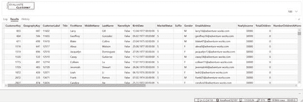

图 1 – 在客户表上执行简单查询。返回的行数可以在 DAX Studio 的右下角找到，以及查询中光标的位置（图由作者提供）

如果我想查询单个值的查询结果，例如一个度量值，我必须定义一个表，因为`EVALUATE`需要一个表作为输入。

花括号就是这样做的。

因此，度量值的查询看起来像这样：

EVALUATE

{[在线客户数量]}

结果是一个单一值：

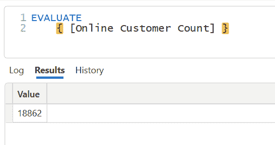

图 2 – 使用花括号定义表以查询度量值（图由作者提供）

## 只获取前 10 行

有成千上万甚至数百万行的表并不罕见。

那么，如果我想要查看前 10 行以窥视表内的数据呢？

对于这一点，[`TOPN()`](https://dax.guide/topn/)可以解决问题。

`TOPN()`接受一个排序顺序。然而，它并不对数据进行排序；它只查看值并根据排序标准获取第一行或最后一行。

例如，让我们获取最新出生日期的 10 位客户（降序）：

EVALUATE

TOPN(10

,Customer

,Customer[BirthDate]

,DESC)

这是结果：

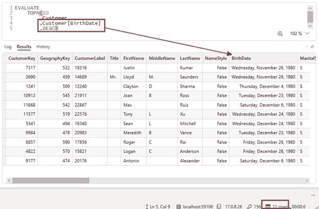

图 3 – 这里，使用 TOPN()函数按出生日期获取前 10 行。看，返回了 11 行，因为有客户拥有相同的出生日期（作者制图）

关于[`TOPN()`](https://dax.guide/topn/)的[DAX.guide](https://dax.guide/)文章中提到关于结果中的平局如下：

*如果表的第 N 行`OrderBy_Expression`值有平局，则返回所有平局行。然后，当第 N 行有平局时，该函数可能会返回超过 n 行。*

这解释了为什么查询结果有 11 行。当对输出进行排序时，我们将看到最后值的平局，即 1980 年 11 月 26 日。

要按出生日期排序结果，您必须添加一个`ORDER BY`：

EVALUATE

TOPN(10

,Customer

,Customer[BirthDate]

,DESC)

ORDER BY Customer[BirthDate] DESC

这里，结果是：

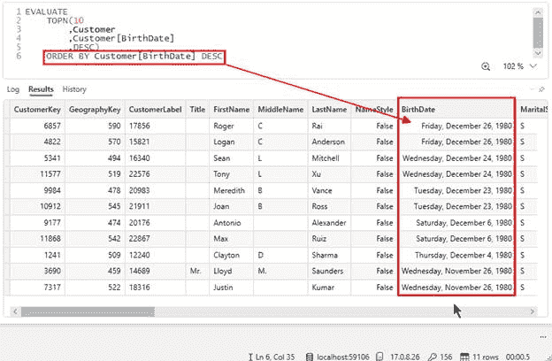

图 4 – 与之前相同的 TOPN()查询结果，但添加了 ORDER BY 按生日降序排序（作者制图）

现在，最后两行的平局情况清晰可见。

## 添加列

通常，我想从表中选择所有列的一个子集。

如果我查询多个列，我只会得到两个列中现有值组合的唯一值。这与 SQL 等其他查询语言不同，在 SQL 中，我必须明确指定我想删除重复项，例如使用`DISTINCT`。

DAX 有多个函数可以从表中获取列的子集：

+   [`ADDCOLUMNS()`](https://dax.guide/addcolumns/)

+   [`SELECTCOLUMNS()`](https://dax.guide/selectcolumns/)

+   [`SUMMARIZE()`](https://dax.guide/summarize/)

+   [`SUMMARIZECOLUMNS()`](https://dax.guide/summarizecolumns/)

在这四个中，[`SUMMARIZECOLUMNS()`](https://dax.guide/summarizecolumns/) 对于一般用途最有用。

在尝试这四个函数时，使用[`ADDCOLUMNS()`](https://dax.guide/addcolumns/)时要小心，因为这个函数可能会导致意外结果。

读取[这篇 SQLBI 文章](https://www.sqlbi.com/articles/best-practices-using-summarize-and-addcolumns)以获取更多详细信息。

好的，我们如何在查询中使用`SUMMARIZECOLUMNS()`：

EVALUATE

SUMMARIZECOLUMNS(‘Customer'[CustomerType])

这是结果：

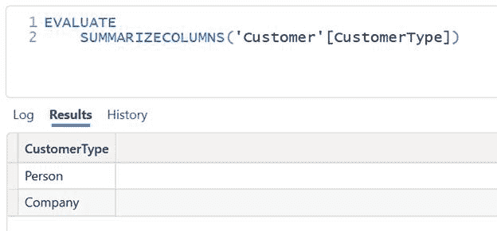

图 5 – 使用 SUMMARIZECOLUMNS()获取 CustomerType 的不同值（作者制图）

如上所述，我们只获取客户类型列的唯一值。

当查询多个列时，结果是现有数据的唯一组合：

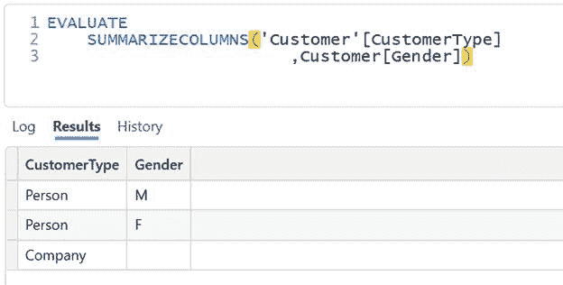

图 6 – 获取多个列（图由作者绘制）

现在，我可以在查询中添加一个度量，以获取每个组合的客户数量：

EVALUATE

SUMMARIZECOLUMNS(‘客户'[客户类型]

,客户[性别]

,“客户数量”, [在线客户计数])

如您所见，必须为度量添加一个标签。这适用于添加到查询中的所有计算列。

这是上述查询的结果：

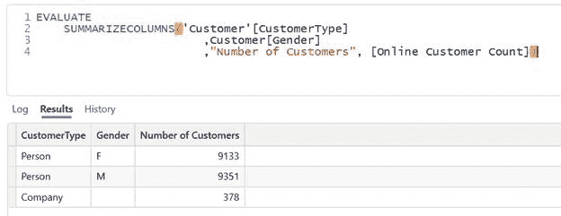

图 7 – 包含多个列和度量的查询结果（图由作者绘制）

您可以添加您需要的任意多的列和度量。

# 添加过滤器

函数[`CALCULATE()`](https://dax.guide/calculate/)因向度量添加过滤器而闻名。

对于查询，我们可以使用类似于`CALCULATE()`的`CALCULATETABLE()`函数；只需第一个参数必须是表即可。

这里，与之前相同的查询，只是客户类型被过滤，只包括“个人”：

评估

CALCULATETABLE(

SUMMARIZECOLUMNS(‘客户'[客户类型]

,客户[性别]

,“客户数量”, [在线客户计数])

,’客户'[客户类型] = “个人”

)

这里，结果是：

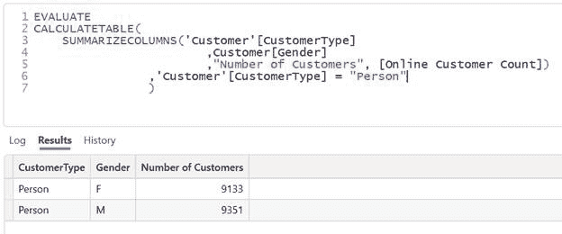

图 8 – 过滤客户类型为“个人”的查询和结果（图由作者绘制）

可以直接将过滤器添加到`SUMMARIZECOLUMNS()`。Power BI 生成的查询使用这种方法。但它比使用`CALCULATETABLE()`要复杂得多。

您可以在[SUMMARIZECOLUMNS()](https://dax.guide/summarizecolumns/)的[DAX.guide](https://dax.guide/)页面上找到此方法的示例。

Power BI 在从可视化构建查询时使用这种方法。您可以从 Power BI 桌面版中的性能分析器中获取查询。

您可以阅读[我关于收集性能数据的文章](https://medium.com/towards-data-science/how-to-get-performance-data-from-power-bi-with-dax-studio-b7f11b9dd9f9)，了解如何使用性能分析器从视觉中获取查询。

您还可以阅读以下链接的 Microsoft 文档，它解释了这一点。

## 定义局部度量

从我的观点来看，这是 DAX 查询中最强大的功能之一：

在查询中添加局部度量。

为了这个目的，存在一个[`DEFINE`](https://dax.guide/st/define/)语句。

例如，我们有在线客户计数度量。

现在，我想添加一个过滤器，只计算“个人”类型的客户。

我可以修改数据模型中的代码或测试 DAX 查询中的逻辑。

第一步是从现有查询的数据模型中获取当前代码。

为了这个，我必须将光标放在查询的第一行上。理想情况下，我会在查询中添加一个空行。

现在，我可以通过右键单击度量并单击“定义度量”来使用 DAX Studio 提取度量的代码并将其添加到查询中：

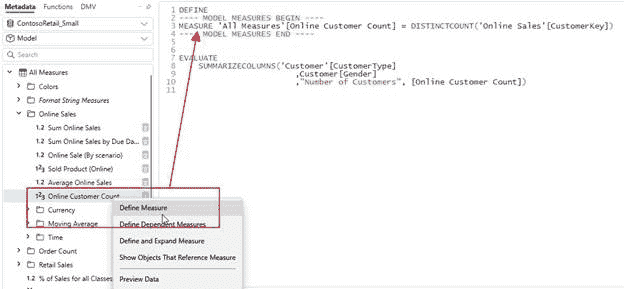

图 9 – 使用 DAX Studio 的“定义度量”功能提取度量的 DAX 代码（图由作者提供）

此功能在 Power BI Desktop 中也有提供。

接下来，我可以通过添加筛选器来更改度量的 DAX 代码：

定义

—- 模型度量开始 —-

MEASURE ‘All Measures'[Online Customer Count] =

CALCULATE(DISTINCTCOUNT(‘Online Sales'[CustomerKey])

，’Customer'[CustomerType] = “Person”

）

—- 模型度量结束 —-

在执行查询时，使用的是度量的本地定义，而不是数据模型中存储的 DAX 代码：

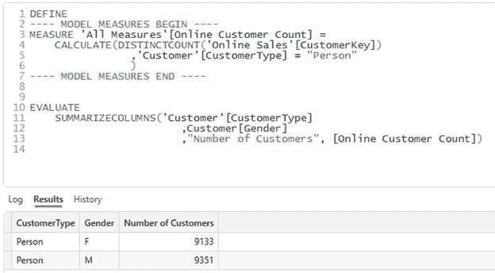

图 10 – 使用修改后的 DAX 代码查询和结果的度量（图由作者提供）

一旦 DAX 代码按预期工作，您就可以将其取出来并修改 Power BI Desktop 中的度量。

在 Power BI Desktop 中，DAX 查询视图的优势在于您可以直接右键单击修改后的代码并将其添加回数据模型。有关如何操作的说明，请参阅下面参考文献部分中的链接。

DAX Studio 不支持此功能。

## 整合碎片

好的，现在让我们整合碎片并编写以下查询：我想获取按客户排序的前 5 个产品。

我从上面的查询中获取，将查询更改为列出产品名称，并添加 `TOPN()`：

```py
DEFINE 
---- MODEL MEASURES BEGIN ----
MEASURE 'All Measures'[Online Customer Count] =
    CALCULATE(DISTINCTCOUNT('Online Sales'[CustomerKey])
                ,'Customer'[CustomerType] = "Person"
                )
---- MODEL MEASURES END ----

EVALUATE
    TOPN(5
        ,SUMMARIZECOLUMNS('Product'[ProductName]
                        ,"Number of Customers", [Online Customer Count]
                        )
        ,[Number of Customers]
        ,DESC)
    ORDER BY [Number of Customers]
```

注意，我传递的是度量的标签“客户数量”，而不是其名称。

我必须这样做，因为 DAX 用标签替换了度量的名称。因此，DAX 对度量没有信息，只知道标签。

这是查询的结果：

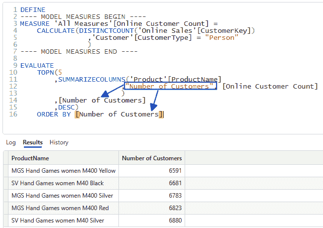

图 11 – 使用 TOPN() 与度量结合的查询结果。注意，这里使用的是标签而不是度量名称（图由作者提供）

## 结论

我经常在 DAX Studio 中使用查询，因为它更容易进行数据验证。

DAX Studio 允许我直接将结果复制到剪贴板或写入 Excel 文件，而无需明确导出数据。

当创建结果集并将其发送给我的客户进行验证时，这非常有用。

此外，我可以在不更改 Power BI Desktop 中的度量的情况下修改度量，并快速在表中验证结果。

我可以使用数据模型中的度量，临时创建一个修改版本，并对照验证结果。

DAX 查询有无数的应用场景，应该成为每个 Power BI 开发者工具包的一部分。

希望我能够向您展示一些新内容，并解释为什么了解如何编写 DAX 查询对于数据模型开发者的日常生活非常重要。

## 参考文献

关于在模型上应用 DAX 查询视图更改的 Microsoft 文档：

[更新模型以应用更改 – DAX 查询视图 – Power BI | 微软学习](https://learn.microsoft.com/en-us/power-bi/transform-model/dax-query-view#update-model-with-changes)

和我之前的文章一样，我使用了 Contoso 示例数据集。您可以从微软[这里](https://www.microsoft.com/en-us/download/details.aspx?id=18279)免费下载 ContosoRetailDW 数据集。

根据[此文档](https://github.com/microsoft/Power-BI-Embedded-Contoso-Sales-Demo)中的描述，Contoso 数据可以在 MIT 许可证下自由使用。我将数据集更改以将数据转移到当代日期。
