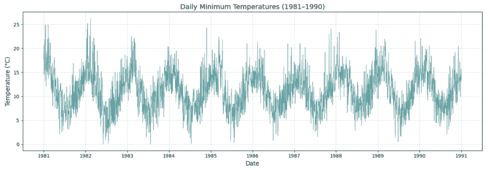
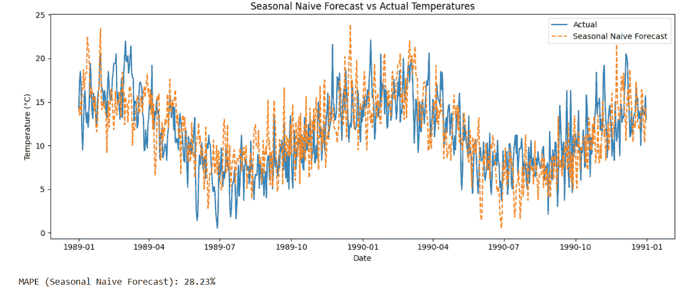

# 时间序列预测简单化（第一部分）：分解和基线模型

> [`towardsdatascience.com/time-series-forecasting-made-simple-part-1-decomposition-baseline-models/`](https://towardsdatascience.com/time-series-forecasting-made-simple-part-1-decomposition-baseline-models/)

我<mdspan datatext="el1744228303164" class="mdspan-comment">曾经避免时间序列分析**。每次我参加在线课程时，我都会看到一个名为**“时间序列分析”**的模块，其中包含傅里叶变换、自相关函数和其他令人畏惧的术语。我不知道为什么，但我总是找到避免它的理由**。

但我学到的经验是：**当我们从基础开始，并专注于理解其背后的直觉时，任何复杂的话题都变得可管理**。这正是本系列博客的主题：让时间序列感觉更像是一场与数据的对话，而不是迷宫。

当通过现实世界的例子解释复杂话题时，我们更容易理解它们。这正是我将如何处理这个系列的方法。

在每一篇文章中，我们将使用一个简单的数据集，并从时间序列的角度探讨所需的内容。我们将围绕每个概念建立直觉，理解其重要性，并逐步在数据上实现它。

**时间序列分析是理解、建模和预测随时间观察到的数据的过程**。它涉及使用过去的观察结果来识别模式，如趋势、季节性和噪声，以便对未来的值做出明智的预测。

让我们从考虑一个名为[**墨尔本每日最低气温**](https://www.kaggle.com/datasets/paulbrabban/daily-minimum-temperatures-in-melbourne)（<mdspan datatext="el1744227543658" class="mdspan-comment">开源许可</mdspan>）的数据集开始。这个数据集包含了澳大利亚墨尔本在 1981 年至 1990 年间的**10 年期间**观察到的**每日最低气温（摄氏度）**记录。每个条目只包含两列：

**日期**：日历日（从 1981-01-01 到 1990-12-31）

**Temp**：该日的最低气温记录

你可能听说过 ARIMA、SARIMA 或指数平滑等模型。但在我们深入之前，先尝试一些简单的**基线模型**是个好主意，看看基本方法在我们的数据上表现如何。

虽然在时间序列预测中有许多基线模型被使用，但在这里我们将关注三个最基本、最有效且在各个行业中广泛应用的模式。

**简单预测**：假设下一个值将与最后一个观察到的值相同。

**季节性简单预测**：假设值将从上季度的相同点重复（例如，上周或上个月）。

**移动平均**：取最后*n*个点的平均值。

你可能想知道，为什么还要使用基线模型？为什么不直接使用像 ARIMA 或 SARIMA 这样的知名预测方法？

让我们考虑一个想要预测下个月销售额的店主。通过应用**移动平均基线模型**，他们可以估计下个月的销售额为**前几个月的平均值**。这种简单的方法可能已经达到大约**80%的准确性**——对于计划和库存决策来说已经足够好了。

现在，如果我们切换到更高级的模型如**ARIMA 或 SARIMA**，我们可能会将准确性提高到大约**85%**。但关键问题是：额外的 5%是否值得额外的时间、努力和资源？在这种情况下，**基线模型就能完成任务**。

事实上，在大多数日常商业场景中，**基线模型就足够了**。我们通常在**高影响行业**如**金融或能源**中转向经典模型如 ARIMA 或 SARIMA，在这些行业中，即使准确性略有提高也可能对财务或运营产生重大影响。即使如此，**基线模型通常首先应用**——不仅为了提供快速洞察，还作为更复杂模型必须超越的**基准**。

好的，现在我们已经准备好实施一些基线模型，首先我们需要理解一个关键点：

**每个时间序列都由三个主要成分组成——趋势、季节性和残差。**

时间序列分解将数据分解为趋势、季节性和残差（噪声），帮助我们揭示表面下的真实模式。这种理解指导了预测模型的选择并提高了准确性。它也是构建简单和高级预测解决方案之前的重要第一步。

**趋势**

这是您的数据随时间变化的总体方向——上升、下降或保持平稳。

示例：每月香烟销售的稳步下降。

**季节性**这些是在固定间隔内重复出现的模式——每日、每周、每月或每年。

示例：夏季饮料销售情况。

**残差（噪声）**这是数据的随机“剩余”部分，是无法由趋势或季节性解释的不可预测的起伏。

示例：一次性汽车购买出现在您的月度支出模式中。

现在我们已经了解了时间序列的关键组成部分，让我们通过使用一个真实的数据集来将其付诸实践：**澳大利亚墨尔本每日最低温度**。

我们将使用 Python 将时间序列**分解**为其趋势、季节性和残差成分，以便我们更好地理解其结构并选择合适的基线模型。

**<mdspan datatext="el1744227674275" class="mdspan-comment">代码</mdspan>:**

```py
import pandas as pd
import matplotlib.pyplot as plt
from statsmodels.tsa.seasonal import seasonal_decompose

# Load the dataset
df = pd.read_csv("minimum daily temperatures data.csv")

# Convert 'Date' to datetime and set as index
df['Date'] = pd.to_datetime(df['Date'], dayfirst=True)
df.set_index('Date', inplace=True)

# Set a regular daily frequency and fill missing values using forward fill
df = df.asfreq('D')
df['Temp'].fillna(method='ffill', inplace=True)

# Decompose the daily series (365-day seasonality for yearly patterns)
decomposition = seasonal_decompose(df['Temp'], model='additive', period=365)

# Plot the decomposed components
decomposition.plot()
plt.suptitle('Decomposition of Daily Minimum Temperatures (Daily)', fontsize=14)
plt.tight_layout()
plt.show() 
```

**输出：**


每日温度的分解显示趋势、季节周期和随机波动。

分解图清楚地显示了一个**强烈的季节性模式**每年重复一次，以及一个**轻微的趋势**随着时间的推移而变化。残差成分捕捉了无法由趋势或季节性解释的随机噪声。

在之前的代码中，你可能已经注意到我使用了**加法模型**来分解时间序列。但这究竟意味着什么——以及为什么它是这个数据集的正确选择？

让我们将其分解。

在**加法模型**中，我们假设趋势、季节性和残差（噪声）**线性**结合，如下所示：

Y = T + S + R

其中：

Y 是时间 t 的实际值

T：趋势

S 是季节成分

R 是残差（随机噪声）

这意味着我们将观测值视为**各部分的和**，每个组成部分独立地贡献于最终输出。

我选择**加法模型**，因为我观察每日最低温度的模式时，注意到一些重要的事情：



上面的线形图显示了 1981 年到 1990 年的每日最低温度。我们可以清楚地看到每年重复的**季节性循环**，冬季温度较低，夏季温度较高。

重要的是，这些季节性波动的**振幅**在多年中保持相对一致。例如，夏季和冬季之间的温差似乎没有随时间增长或缩小。这种季节性变化的稳定性是**加法模型**适合分解的关键标志，因为季节性成分似乎**独立于任何趋势**。

当**趋势相对稳定**且**不会放大或扭曲季节性模式**，并且季节性在时间上保持**一致的范围**内，即使有轻微波动时，我们使用**加法模型**。

现在我们已经了解了**加法模型**的工作原理，让我们来探索**乘法模型**——它通常在**季节性效应与趋势成比例**时使用，这也有助于我们更清楚地理解加法模型。

考虑一个家庭的**电力消费**。假设该家庭在夏季比冬季多使用 20%的电力。这意味着季节性效应不是一个固定数值——它是他们基准使用量的**比例**。

让我们看看用实际数字会是什么样子：

2021 年，该家庭在冬季使用了 300 千瓦时，在夏季使用了 360 千瓦时（比冬季多 20%）。

2022 年，他们的冬季消费量增加到 330 千瓦时，夏季使用量上升到 396 千瓦时（比冬季多 20%）。

在这两年中，季节性差异**随着趋势增长**，从 2021 年的+60 千瓦时增加到 2022 年的+66 千瓦时，尽管百分比增加保持不变。这正是乘法模型能够很好地捕捉的行为。

用数学术语来说：

Y = T × S × R

其中：

Y：观测值

T：趋势成分

S：季节成分

R：残差（噪声）

通过查看分解图，我们可以判断是加法模型还是乘法模型更适合我们的数据。

除了其他一些强大的分解工具，我将在未来的博客文章中介绍其中之一。现在，我们已经对加法和乘法模型有了清晰的理解，让我们将注意力转向应用适合这个数据集的基线模型。

根据分解图，我们可以看到数据中存在强烈的季节性模式，这表明**季节性朴素模型**可能非常适合这个时间序列。

该模型假设在给定时间点的值将与**上一个季节相同时期**的值相同——当季节性占主导地位且一致时，这是一个简单而有效的选择。例如，如果温度通常遵循相同的年度周期，那么 1990 年 7 月 1 日的预测将简单地是 1989 年 7 月 1 日记录的温度。

**代码：**

```py
import pandas as pd
import matplotlib.pyplot as plt
import numpy as np

# Load the dataset
df = pd.read_csv("minimum daily temperatures data.csv")

# Convert 'Date' column to datetime and set as index
df['Date'] = pd.to_datetime(df['Date'], dayfirst=True)
df.set_index('Date', inplace=True)

# Ensure regular daily frequency and fill missing values
df = df.asfreq('D')
df['Temp'].fillna(method='ffill', inplace=True)

# Step 1: Create the Seasonal Naive Forecast
seasonal_period = 365  # Assuming yearly seasonality for daily data
# Create the Seasonal Naive forecast by shifting the temperature values by 365 days
df['Seasonal_Naive'] = df['Temp'].shift(seasonal_period)

# Step 2: Plot the actual vs forecasted values
# Plot the last 2 years (730 days) of data to compare
plt.figure(figsize=(12, 5))
plt.plot(df['Temp'][-730:], label='Actual')
plt.plot(df['Seasonal_Naive'][-730:], label='Seasonal Naive Forecast', linestyle='--')
plt.title('Seasonal Naive Forecast vs Actual Temperatures')
plt.xlabel('Date')
plt.ylabel('Temperature (°C)')
plt.legend()
plt.tight_layout()
plt.show()

# Step 3: Evaluate using MAPE (Mean Absolute Percentage Error)
# Use the last 365 days for testing
test = df[['Temp', 'Seasonal_Naive']].iloc[-365:].copy()
test.dropna(inplace=True)

# MAPE Calculation
mape = np.mean(np.abs((test['Temp'] - test['Seasonal_Naive']) / test['Temp'])) * 100
print(f"MAPE (Seasonal Naive Forecast): {mape:.2f}%")
```

输出：



季节性朴素预测与实际温度（1989–1990）

为了使可视化清晰并集中，我们绘制了数据集的最后**两年**（1989–1990）而不是全部 10 年。

此图比较了墨尔本的实际每日最低温度与**季节性朴素模型**预测的值，该模型简单地假设每一天的温度将与**一年前同一天**的温度相同。

如图中所示，季节性朴素预测很好地捕捉了季节循环的**总体形状**——它反映了全年温度的起伏。然而，它并没有捕捉到日常变化，也没有对季节时间的微小变化做出反应。这是预期的，因为该模型旨在**精确地重复**前一年的模式，而不调整趋势或噪声。

为了评估该模型的表现，我们在数据集的最后 365 天（即 1990 年）计算了**平均绝对百分比误差（MAPE**）。我们只使用这个时期，因为季节性朴素预测需要**一整年的历史数据**才能开始做出预测。

**平均绝对百分比误差（MAPE**）是评估预测模型准确性的常用指标。它衡量的是**实际值和预测值之间的平均绝对差异**，以**实际值的百分比**表示。

在时间序列预测中，我们通常在**最近或目标时间段**上评估模型性能——而不是在中间年份。这反映了预测在现实世界中的应用：我们基于历史数据构建模型来预测接下来会发生什么。

因此，我们只在数据集的最后**365 天**计算 MAPE——这模拟了未来的预测，并为我们提供了一个关于模型在实际中表现如何的现实度量。

**MAPE 为 28.23**%，这为我们提供了一个基线预测误差水平。我们构建的任何后续模型——无论是定制的还是更高级的，都应该旨在超越这个基准。

**28.23%的 MAPE**意味着，平均而言，模型在过去一年的实际每日温度值上的预测误差为**28.23%**。

换句话说，如果给定日期的真实温度是 10°C，季节性简单预测可能在大约 7.2°C 或 12.8°C 之间，反映了 28%的偏差。

我将在未来的文章中深入探讨评估指标。

在本文中，我们通过理解如何通过分解将现实世界的数据分解为**趋势**、**季节性**和**残差**，为时间序列预测奠定了基础。我们探讨了**加法和乘法模型**之间的区别，实现了**季节性简单预测基线**，并使用**MAPE**评估了其性能。

尽管季节性简单模型简单直观，但它对于这个数据集来说存在局限性。它假设任何给定日期的温度与去年同一天的温度相同。但如图表和**28.23%**的 MAPE 所示，这个假设并不完全成立。数据显示季节模式略有变化和长期变化，而模型未能捕捉到这些变化。

在本系列的下一部分，我们将进一步探讨。我们将探讨如何**自定义基线模型**，将其与季节性简单方法进行比较，并使用误差指标如**MAPE**、**MAE**和**RMSE**来评估哪个表现更好。

我们还将开始构建理解更高级模型（如**ARIMA**）所需的基础，包括诸如**差分**等关键概念：

+   **平稳性**

+   **自相关和偏自相关**

+   **差分**

+   **基于滞后建模（AR 和 MA 项**）

第二部分将更深入地探讨这些主题，从自定义基线开始，以 ARIMA 的基础知识结束。

感谢阅读。希望您觉得这篇文章有帮助和启发。
