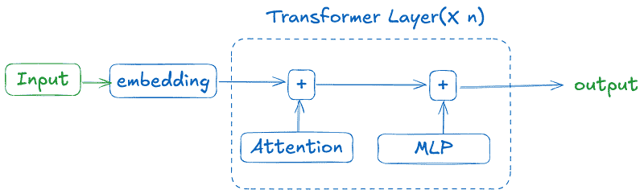
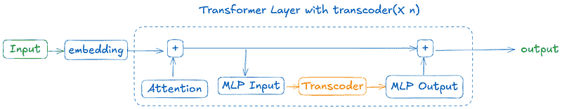
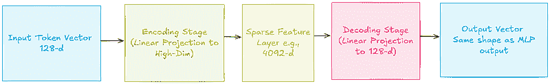
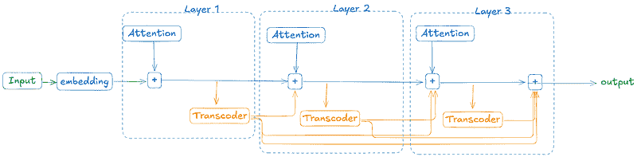
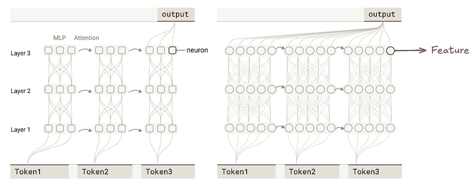
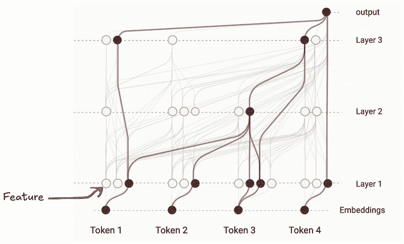

# 电路追踪：理解大型语言模型的一步

> [`towardsdatascience.com/circuit-tracing-a-step-closer-to-understanding-large-language-models/`](https://towardsdatascience.com/circuit-tracing-a-step-closer-to-understanding-large-language-models/)

## <mdspan datatext="el1744137533761" class="mdspan-comment">上下文</mdspan>

多年来，基于 Transformer 的大型语言模型（LLMs）在众多任务上取得了显著进展，从简单的信息检索系统发展到能够编码、写作、进行研究和更多复杂任务的智能体。但尽管它们功能强大，这些模型仍然在很大程度上是黑箱。给定一个输入，它们能够完成任务，但我们缺乏直观的方式来理解任务是如何实际完成的。

LLMs 被设计用来预测统计上最佳的下个单词/标记。但它们是否只专注于预测下一个标记，或者有前瞻性规划？例如，当我们要求模型写一首诗时，它是逐个生成单词，还是在输出单词之前就预测到了押韵模式？或者当被问及像“位于城市达拉斯所在州的首府是什么？”这样的基本推理问题时，它们通常会生成一系列推理结果，但模型实际上是否真的使用了那种推理？我们对模型内部思维过程缺乏可见性。为了理解 LLMs，我们需要追踪它们背后的逻辑。

LLMs 内部计算的研究属于“机制可解释性”范畴，旨在揭示模型的计算电路。Anthropic 是致力于可解释性研究的领先 AI 公司之一。2025 年 3 月，他们发表了一篇题为“[电路追踪：揭示语言模型中的计算图](https://transformer-circuits.pub/2025/attribution-graphs/methods.html)”的论文，旨在解决电路追踪问题。

本篇旨在解释他们工作的核心思想，并为理解 LLMs 中的电路追踪打下基础。

## LLMs 中的“电路”是什么？

在我们能够在语言模型中定义“电路”之前，我们首先需要深入了解 LLMs。它是一个基于 Transformer 架构的神经网络，因此将神经元视为基本计算单元，并将它们在各个层上的激活模式解释为模型的计算电路似乎是显而易见的。

然而，“[迈向单义性](https://transformer-circuits.pub/2023/monosemantic-features)”这篇论文揭示了仅跟踪神经元激活并不能清楚地理解为什么那些神经元会被激活。这是因为单个神经元通常是多义的，它们对一系列无关的概念做出反应。

论文进一步表明，神经元由更基本的单元组成，称为特征，这些特征捕获了更可解释的信息。事实上，一个神经元可以看作是特征的组合。因此，我们不是追踪神经元激活，而是旨在追踪特征激活——这些是驱动模型输出的实际意义单元。

有了这些，我们可以定义一个电路为模型用来将给定输入转换为输出的特征激活和连接的序列。

现在我们知道了我们要找什么，让我们深入了解技术设置。

## 技术设置

我们已经确定我们需要追踪特征激活而不是神经元激活。为了实现这一点，我们需要将现有 LLM 模型的神经元转换为特征，即构建一个用特征表示计算的替换模型。

在深入探讨如何构建这个替换模型之前，让我们简要回顾一下基于 transformer 的大型语言模型的架构。

下面的图示说明了基于 transformer 的语言模型是如何运作的。其思路是将输入转换为标记使用嵌入。这些标记被传递到注意力块，该块计算标记之间的关系。然后，每个标记被传递到多层感知器（MLP）块，该块使用非线性激活和线性变换进一步细化标记。这个过程在许多层中重复，直到模型生成最终输出。

图片由作者提供

现在我们已经概述了基于 transformer 的 LLM 的结构，让我们来看看 transcoders 是什么。作者使用了一个“Transcoder”来开发替换模型。

## Transcoders

**transcoder** 本身是一个神经网络（通常比 LLM 的维度高得多），它本身被设计用来替换 transformer 模型中的 MLP 块，用一个更可解释、功能等效的组件（特征）来替换。

图片由作者提供

它从注意力块处理标记分为三个阶段：编码、稀疏激活和解码。实际上，它将输入缩放到更高维的空间，应用激活来迫使模型只激活稀疏特征，然后在解码阶段将输出压缩回原始维度。

图片由作者提供

在对基于 transformer 的 LLM 和 transcoder 有基本了解之后，让我们看看如何使用 transcoder 来构建替换模型。

## 构建替换模型

如前所述，一个变压器块通常由两个主要组件组成：一个注意力块和一个 MLP 块（前馈网络）。为了构建替换模型，原始变压器模型中的 MLP 块被替换为一个转码器。这种集成是无缝的，因为转码器被训练来模仿原始 MLP 的输出，同时通过稀疏和模块化特征暴露其内部计算。

虽然标准转码器被训练来模仿单个变压器层内的 MLP 行为，但该论文的作者使用了跨层转码器（CLT），它捕捉了多个转码器块在几层中的综合影响。这很重要，因为它允许我们追踪一个特征是否分布在多个层中，这对于电路追踪是必要的。

下面的图片展示了如何使用跨层转码器（CLT）设置来构建一个替换模型。第 1 层的转码器输出有助于构建所有上层直到末尾的 MLP-等效输出。

图片由作者提供

旁注：以下图片来自论文，展示了如何构建替换模型。它用特征替换了原始模型中的神经元。

图片来自 [`transformer-circuits.pub/2025/attribution-graphs/methods.html#graphs-constructing`](https://transformer-circuits.pub/2025/attribution-graphs/methods.html#graphs-constructing)

现在我们已经理解了替换模型的架构，让我们看看如何在替换模型的计算路径上构建可解释的呈现。

## 模型计算的可解释呈现：归因图

为了构建模型计算路径的可解释表示，我们从模型的输出特征开始，通过特征网络向后追踪，以揭示哪些较早的特征对其有贡献。这是通过向后雅可比矩阵完成的，它说明了前一层的特征对当前特征激活的贡献程度，并且递归地应用直到我们达到输入。每个特征被视为一个节点，每个影响被视为一条边。这个过程可能导致一个具有数百万条边和节点的复杂图，因此进行了剪枝以保持图紧凑且可手动解释。

作者将这个计算图称为归因图，并且还开发了一个工具来检查它。这构成了论文的核心贡献。

下面的图片展示了一个示例归因图。

图片来自 [`transformer-circuits.pub/2025/attribution-graphs/methods.html#graphs`](https://transformer-circuits.pub/2025/attribution-graphs/methods.html#graphs)

现在，有了所有这些理解，我们可以转向特征可解释性。

## 使用归因图进行特征可解释性

研究人员使用 Anthropic 的 Claude 3.5 Haiku 模型上的归因图来研究它在不同任务中的行为。在诗歌生成的案例中，他们发现模型不仅仅生成下一个单词。它进行了一种规划，既有前瞻性也有回顾性。在生成一行之前，模型会识别几个可能的押韵或语义上合适的单词来结束，然后回溯以创作一个自然地引导到该目标的句子。令人惊讶的是，模型似乎同时持有多个候选的结束单词，并且可以根据最终选择的单词重新构建整个句子。

这种技术提供了一个清晰、机械化的视角，展示了语言模型如何生成结构化、创造性的文本。这对人工智能社区来说是一个重要的里程碑。随着我们开发出越来越强大的模型，追踪和理解它们内部的规划和执行能力对于确保人工智能系统的对齐、安全和信任至关重要。

## 当前方法的局限性

归因图提供了一种追踪单个输入模型行为的方法，但它们还没有提供一种可靠的方法来理解全局电路或模型在许多示例中使用的持续机制。这项分析依赖于用转码器替换 MLP 计算，但仍然不清楚这些转码器是否真正复制了原始机制，或者只是近似了输出。此外，当前的方法只突出了活跃的特征，但非活跃或抑制性的特征对于理解模型的行为同样重要。

## 结论

通过归因图进行电路追踪是理解语言模型内部工作原理的一个早期但重要的步骤。尽管这种方法还有很长的路要走，但电路追踪的引入标志着通往真正可解释性的道路上一个重要的里程碑。

#### 参考文献：

+   [`transformer-circuits.pub/2025/attribution-graphs/methods.html`](http://Now,%20with%20all%20the%20understanding,%20we%20can%20go%20to%20feature%20interpretability.)

+   [`arxiv.org/pdf/2406.11944`](https://arxiv.org/pdf/2406.11944)

+   [`transformer-circuits.pub/2025/attribution-graphs/biology.html`](https://transformer-circuits.pub/2025/attribution-graphs/biology.html)

+   [`transformer-circuits.pub/2024/crosscoders/index.html`](https://transformer-circuits.pub/2024/crosscoders/index.html)

+   [`transformer-circuits.pub/2023/monosemantic-features`](https://transformer-circuits.pub/2023/monosemantic-features)
