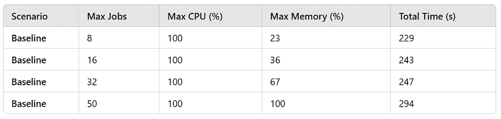
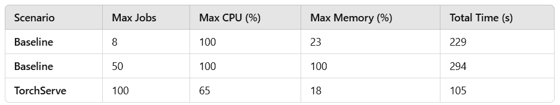
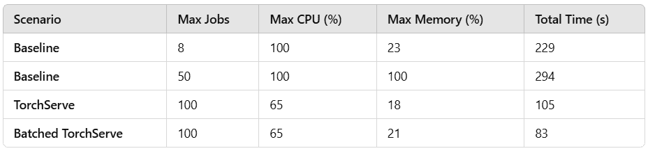
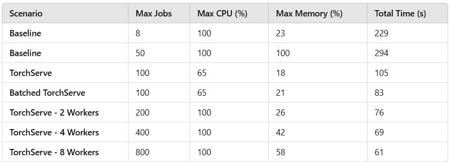

# 集中式 AI 模型推理服务的案例

> [`towardsdatascience.com/the-case-for-centralized-ai-model-inference-serving/`](https://towardsdatascience.com/the-case-for-centralized-ai-model-inference-serving/)

<mdspan datatext="el1743558270096" class="mdspan-comment">随着 AI</mdspan>模型在范围和准确性上不断增长，甚至一度由传统算法主导的任务也逐渐被深度学习模型所取代。算法管道——这些工作流程接受输入，通过一系列算法进行处理，并产生输出——越来越多地依赖于一个或多个基于 AI 的组件。这些 AI 模型通常与它们的经典对应物有显著不同的资源需求，例如更高的内存使用、依赖专用硬件加速器和增加的计算需求。

在这篇文章中，我们解决了一个常见挑战：通过包括深度学习模型的算法管道高效处理大规模输入。一个典型的解决方案是运行多个独立的作业，每个作业负责处理单个输入。这种设置通常由作业编排框架（例如[Kubernetes](https://kubernetes.io/)）管理。然而，当涉及深度学习模型时，这种方法可能会变得低效，因为在每个单独的进程中加载和执行相同的模型可能会导致资源竞争和扩展限制。随着 AI 模型在算法管道中越来越普遍，我们重新审视这些解决方案的设计变得至关重要。

在这篇文章中，我们评估了集中式推理服务的优势，其中专门的推理服务器处理来自多个并行作业的预测请求。我们定义了一个玩具实验，其中我们在 1,000 张单独的图像上运行基于[ResNet-152](https://pytorch.org/vision/0.20/models/generated/torchvision.models.resnet152.html)图像分类器的图像处理管道。我们比较了以下两种实现的运行时间和资源利用率：

1.  **去中心化推理**——每个作业独立加载和运行模型。

1.  **集中式推理**——所有作业将推理请求发送到专门的推理服务器。

为了使实验保持专注，我们做出了一些简化的假设：

+   我们没有使用完整的作业编排器（如[Kubernetes](https://kubernetes.io/)），而是使用 Python 的 multiprocessing 模块实现并行进程执行。

+   尽管现实世界的工作负载通常跨越多个节点，但我们把所有东西都运行在单个节点上。

+   现实世界的工作负载通常包括多个算法组件。我们将我们的实验限制在一个组件上——一个在单个输入图像上运行的 ResNet-152 分类器。

+   在实际应用场景中，每个作业将处理一个独特的输入图像。为了简化我们的实验设置，每个作业将处理相同的[kitty.jpg](https://github.com/pytorch/serve/blob/master/examples/image_classifier/kitten.jpg)图像。

+   我们将使用一个最小的[TorchServe](https://pytorch.org/serve/)推理服务器部署，主要依赖其默认设置。预期使用其他推理服务器解决方案（如[NVIDIA Triton 推理服务器](https://developer.nvidia.com/triton-inference-server)或[LitServe](https://lightning.ai/docs/litserve/home)）也会得到类似的结果。

代码仅用于演示目的。请勿将我们对 TorchServe 的选择——或我们演示的任何其他组件——视为对其使用的认可。

## 玩具实验

我们在具有 8 个 vCPU 和 16 GiB 内存的[Amazon EC2 c5.2xlarge](https://aws.amazon.com/ec2/instance-types/c5/)实例上进行了实验，运行的是[PyTorch 深度学习 AMI](https://aws.amazon.com/releasenotes/aws-deep-learning-ami-gpu-pytorch-2-6-ubuntu-22-04/)（DLAMI）。我们使用以下命令激活 PyTorch 环境：

```py
source /opt/pytorch/bin/activate
```

### 第 1 步：创建 TorchScript 模型检查点

我们首先创建一个 ResNet-152 模型检查点。使用[TorchScript](https://pytorch.org/docs/stable/jit.html)，我们将模型定义及其权重序列化到一个单独的文件中：

```py
import torch
from torchvision.models import resnet152, ResNet152_Weights

model = resnet152(weights=ResNet152_Weights.DEFAULT)
model = torch.jit.script(model)
model.save("resnet-152.pt")
```

### 第 2 步：模型推理函数

我们的推理函数执行以下步骤：

1.  加载 ResNet-152 模型。

1.  加载输入图像。

1.  预处理图像以匹配模型期望的输入格式，具体实现请参考[这里](https://github.com/pytorch/serve/blob/master/ts/torch_handler/image_classifier.py)。

1.  运行推理以对图像进行分类。

1.  对模型输出进行后处理，以返回前五个标签预测，具体实现请参考[这里](https://github.com/pytorch/serve/blob/master/ts/torch_handler/image_classifier.py)。

我们定义了一个名为 MAX_THREADS 的常量超参数，用于限制每个进程中用于模型推理的线程数。这是为了防止多个作业之间的资源竞争。

```py
import os, time, psutil
import multiprocessing as mp
import torch
import torch.nn.functional as F
import torchvision.transforms as transforms
from PIL import Image

def predict(image_id):
    # Limit each process to 1 thread
    MAX_THREADS = 1
    os.environ["OMP_NUM_THREADS"] = str(MAX_THREADS)
    os.environ["MKL_NUM_THREADS"] = str(MAX_THREADS)
    torch.set_num_threads(MAX_THREADS)

    # load the model
    model = torch.jit.load('resnet-152.pt').eval()

    # Define image preprocessing steps
    transform = transforms.Compose([
        transforms.Resize(256),
        transforms.CenterCrop(224),
        transforms.ToTensor(),
        transforms.Normalize(mean=[0.485, 0.456, 0.406], 
                             std=[0.229, 0.224, 0.225])
    ])

    # load the image
    image = Image.open('kitten.jpg').convert("RGB")

    # preproc
    image = transform(image).unsqueeze(0)

    # perform inference
    with torch.no_grad():
        output = model(image)

    # postproc
    probabilities = F.softmax(output[0], dim=0)
    probs, classes = torch.topk(probabilities, 5, dim=0)
    probs = probs.tolist()
    classes = classes.tolist()

    return dict(zip(classes, probs)) 
```

### 第 3 步：运行并行推理作业

我们定义了一个函数，用于启动并行进程，每个进程处理单个图像输入。此函数：

+   接受要处理的图像总数和最大并发作业数。

+   当槽位可用时，动态启动新进程。

+   在整个执行过程中监控 CPU 和内存使用情况。

```py
def process_image(image_id):
    print(f"Processing image {image_id} (PID: {os.getpid()})")
    predict(image_id)

def spawn_jobs(total_images, max_concurrent):
    start_time = time.time()
    max_mem_utilization = 0.
    max_utilization = 0.

    processes = []
    index = 0
    while index < total_images or processes:

        while len(processes) < max_concurrent and index < total_images:
            # Start a new process
            p = mp.Process(target=process_image, args=(index,))
            index += 1
            p.start()
            processes.append(p)

        # sample memory utilization
        mem_usage = psutil.virtual_memory().percent
        max_mem_utilization = max(max_mem_utilization, mem_usage)
        cpu_util = psutil.cpu_percent(interval=0.1)
        max_utilization = max(max_utilization, cpu_util)

        # Remove completed processes from list
        processes = [p for p in processes if p.is_alive()]

    total_time = time.time() - start_time
    print(f"\nTotal Processing Time: {total_time:.2f} seconds")
    print(f"Max CPU Utilization: {max_utilization:.2f}%")
    print(f"Max Memory Utilization: {max_mem_utilization:.2f}%")

spawn_jobs(total_images=1000, max_concurrent=32)
```

## 估计最大进程数

虽然最佳的最大并发进程数最好通过经验确定，但我们可以根据 16 GiB 的系统内存和 resnet-152.pt 文件的大小（231 MB）估计一个上限。

下表总结了几个配置的运行时结果：



**去中心化推理结果（作者提供）**

尽管内存在 50 个并发进程时完全饱和，但我们观察到最大吞吐量是在 8 个并发作业时达到的——每个 vCPU 一个。这表明在此点之后，资源竞争超过了额外并行化可能带来的任何潜在收益。

## 独立模型执行的低效性

运行并行作业，每个作业独立加载和执行模型，会引入显著的低效和浪费：

1.  每个进程都需要分配适当的内存资源来存储其自己的 AI 模型副本。

1.  AI 模型是计算密集型的。在许多进程中并行执行它们可能导致资源竞争和吞吐量降低。

1.  在每个进程中加载模型检查点文件并初始化模型会增加开销，并可能进一步增加延迟。在我们的玩具实验中，模型初始化大约占整体推理处理时间的 30%（!!）。

一个更有效的方法是使用专用的模型推理服务器集中化推理执行。这种方法将消除冗余的模型加载并减少整体系统资源利用率。

在下一节中，我们将设置一个 AI 模型推理服务器并评估其对资源利用率和运行时性能的影响。

**注意：** 我们可以将基于多进程的方法修改为在进程间共享单个模型（例如，使用[tensor.multiprocessing](https://pytorch.org/docs/stable/multiprocessing.html)或基于[共享内存](https://docs.python.org/3/library/multiprocessing.shared_memory.html)的另一种解决方案）。然而，推理服务器演示更好地符合现实世界的生产环境，其中作业通常在隔离的容器中运行。

## TorchServe 设置

本节中描述的 TorchServe 设置大致遵循[resnet 教程](https://github.com/pytorch/serve/tree/master/examples/image_classifier/resnet_18)。请参阅官方[TorchServe](https://pytorch.org/serve/)文档以获取更深入的指南。

### 安装

我们 DLAMI 的 PyTorch 环境预装了 TorchServe 可执行文件。如果您在不同的环境中运行，请运行以下安装命令：

```py
pip install torchserve torch-model-archiver
```

### 创建模型存档

TorchServe 模型存档器将模型及其相关文件打包成一个“*.mar*”文件存档，这是在 TorchServe 上部署所需的格式。我们根据我们的模型检查点文件创建一个 TorchServe 模型存档文件，并使用[默认图像分类处理器](https://pytorch.org/serve/default_handlers.html)：

```py
mkdir model_store
torch-model-archiver \
    --model-name resnet-152 \
    --serialized-file resnet-152.pt \
    --handler image_classifier \
    --version 1.0 \
    --export-path model_store
```

### TorchServe 配置

我们创建一个 TorchServe config.properties 文件来定义 TorchServe 应该如何运行：

```py
model_store=model_store
load_models=resnet-152.mar
models={\
  "resnet-152": {\
    "1.0": {\
        "marName": "resnet-152.mar"\
    }\
  }\
}

# Number of workers per model
default_workers_per_model=1

# Job queue size (default is 100)
job_queue_size=100
```

完成这些步骤后，我们的工作目录应该看起来像这样：

```py
├── config.properties
֫├── kitten.jpg
├── model_store
│   ├── resnet-152.mar
├── multi_job.py
```

### 启动 TorchServe

在另一个 shell 中，我们启动我们的 TorchServe 推理服务器：

```py
source /opt/pytorch/bin/activate
torchserve \
    --start \
    --disable-token-auth \
    --enable-model-api \
    --ts-config config.properties
```

### 推理请求实现

我们定义了一个替代的预测函数，该函数调用我们的推理服务：

```py
import requests

def predict_client(image_id):
    with open('kitten.jpg', 'rb') as f:
        image = f.read()
    response = requests.post(
        "http://127.0.0.1:8080/predictions/resnet-152",
        data=image,
        headers={'Content-Type': 'application/octet-stream'}
    )

    if response.status_code == 200:
        return response.json()
    else:
        print(f"Error from inference server: {response.text}")
```

### 扩展并发作业的数量

现在推理请求正在由中央服务器处理，我们可以扩展并行处理。与早期每个进程加载并执行自己的模型的方法不同，我们有足够的 CPU 资源来允许更多的并发进程。在这里，我们根据推理服务器的默认 *job_queue_size * 容量选择了 100 个进程：

```py
spawn_jobs(total_images=1000, max_concurrent=100)
```

### 结果

性能结果记录在下表中。请注意，比较结果可能会根据 AI 模型和运行环境的细节而有很大差异。



**推理服务器结果（作者）**

通过使用集中式推理服务器，我们不仅将整体吞吐量提高了 2 倍以上，而且还为其他计算任务释放了大量的 CPU 资源。

## 下一步

既然我们已经有效地证明了集中式推理服务解决方案的好处，我们可以探索几种增强和优化设置的方法。回想一下，我们的实验是有意简化以专注于展示推理服务的作用。在实际部署中，可能需要额外的增强来满足您的特定需求。

1.  **自定义推理处理器**：虽然我们使用了 TorchServe 内置的 [image_classifier](https://pytorch.org/serve/default_handlers.html#image-classifier) 处理器，但定义一个 [自定义处理器](https://pytorch.org/serve/custom_service.html#custom-handlers) 可以提供对推理实现细节的更大控制。

1.  **高级推理服务器配置**：推理服务器解决方案通常包括许多功能，可以根据工作负载要求调整服务行为。在接下来的几节中，我们将探讨 TorchServe 支持的一些功能。

1.  **扩展管道**：现实世界的模型通常包括比我们实验中使用的更多算法块和更复杂的 AI 模型。

1.  **多节点部署**：虽然我们在单个计算实例上运行了实验，但生产设置通常包括多个节点。

1.  **替代推理服务器**：虽然 TorchServe 是一个流行的选择，并且相对容易设置，但还有许多替代推理服务器解决方案可能提供额外的优势，并且可能更适合您的需求。重要的是，最近宣布 TorchServe 将不再积极维护。请参阅 [文档](https://pytorch.org/serve/index.html) 了解详情。

1.  **替代编排框架**：在我们的实验中，我们使用了 Python 多进程。现实世界的工作负载通常使用更先进的编排解决方案。

1.  **利用推理加速器**：虽然我们在 CPU 上执行了模型，但使用 AI 加速器（例如，NVIDIA GPU、Google Cloud TPU 或 AWS Inferentia）可以显著提高吞吐量。

1.  **模型优化**：[优化](https://pytorch.org/serve/performance_checklist.html)您的 AI 模型可以大大提高效率和吞吐量。

1.  **推理负载自动扩展**：在某些用例中，推理流量会波动，需要能够相应扩展其容量的推理服务器解决方案。

在接下来的几节中，我们将探讨两种简单的方法来增强基于 TorchServe 的推理服务器实现。我们将把其他增强功能的讨论留到未来的文章中。

## 使用 TorchServe 进行批次推理

许多模型推理服务解决方案支持将推理请求分组为批次的选项。这通常会导致吞吐量增加，尤其是在模型在 GPU 上运行时。

我们扩展了 TorchServe 的`config.properties`文件以支持批次推理，批次大小高达 8 个样本。有关使用 TorchServe 进行批次推理的详细信息，请参阅[官方文档](https://pytorch.org/serve/batch_inference_with_ts.html)。

```py
model_store=model_store
load_models=resnet-152.mar
models={\
  "resnet-152": {\
    "1.0": {\
        "marName": "resnet-152.mar",\
        "batchSize": 8,\
        "maxBatchDelay": 100,\
        "responseTimeout": 200\
    }\
  }\
}

# Number of workers per model
default_workers_per_model=1

# Job queue size (default is 100)
job_queue_size=100
```

### 结果

我们在下面的表格中附加了结果：



**批量推理服务器结果（作者提供）**

启用批量推理可以将吞吐量额外提高 26.5%。

## 使用 TorchServe 的多工作进程推理

许多模型推理服务解决方案将支持为每个 AI 模型创建多个推理工作进程。这允许根据预期的负载微调推理工作进程的数量。一些解决方案支持推理工作进程数量的自动扩展。

我们通过增加控制分配给我们的图像分类模型的推理工作进程数量的`default_workers_per_model`设置来扩展我们自己的 TorchServe 设置。

重要的是，我们必须限制分配给每个工作进程的线程数，以防止资源竞争。这由`number_of_netty_threads`设置以及`OMP_NUM_THREADS`和`MKL_NUM_THREADS`环境变量控制。在这里，我们将线程数设置为等于 vCPU 数（8）除以工作进程数。

```py
model_store=model_store
load_models=resnet-152.mar
models={\
  "resnet-152": {\
    "1.0": {\
        "marName": "resnet-152.mar"\
        "batchSize": 8,\
        "maxBatchDelay": 100,\
        "responseTimeout": 200\
    }\
  }\
}

# Number of workers per model
default_workers_per_model=2 

# Job queue size (default is 100)
job_queue_size=100

# Number of threads per worker
number_of_netty_threads=4
```

修改后的 TorchServe 启动序列如下所示：

```py
export OMP_NUM_THREADS=4
export MKL_NUM_THREADS=4
torchserve \
    --start \
    --disable-token-auth \
    --enable-model-api \
    --ts-config config.properties
```

### 结果

在下面的表格中，我们附加了使用 2、4 和 8 个推理工作进程运行的结果：



**多工作进程推理服务器结果（作者提供）**

通过将 TorchServe 配置为使用多个推理工作进程，我们能够将吞吐量额外提高 36%。这相当于相对于基线实验的 3.75 倍改进。

## 摘要

这个实验突出了推理服务器部署对多作业深度学习工作负载的潜在影响。我们的发现表明，使用推理服务器可以提高系统资源利用率，实现更高的并发性，并显著提高整体吞吐量。请注意，确切的收益将极大地取决于工作负载的细节和运行时环境。

设计推理服务架构只是优化 AI 模型执行的一部分。请参阅我们关于广泛 AI 模型优化技术的[许多文章](https://towardsdatascience.com/author/chaimrand/)。
