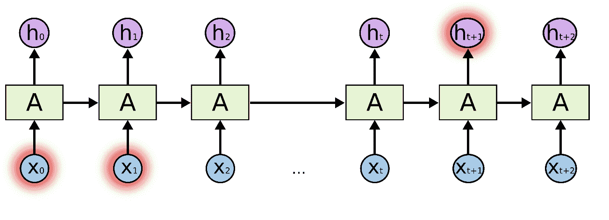
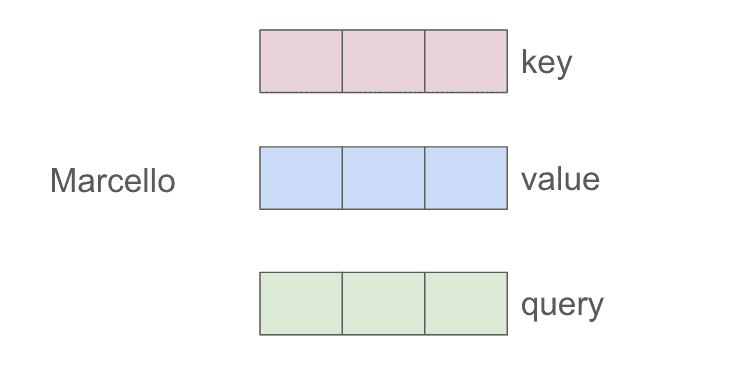
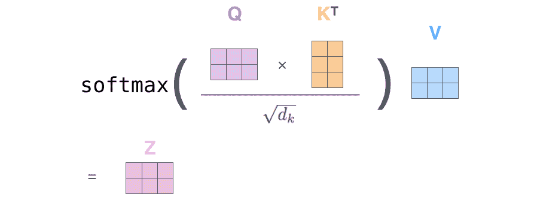
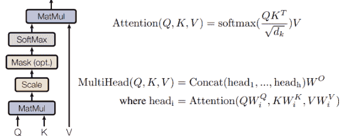

# 从零开始简单实现注意力机制

> [原文链接](https://towardsdatascience.com/a-simple-implementation-of-the-attention-mechanism-from-scratch/)

## <mdspan datatext="el1743469379175" class="mdspan-comment">简介</mdspan>

注意力机制通常与 transformer 架构相关联，但它已经在 RNN 中使用。在机器翻译或 MT（例如，英语-意大利语）任务中，当你想要预测下一个意大利语单词时，你需要你的模型关注或注意最重要的英语单词，这些单词对于做出好的翻译是有用的。



我不会深入讲解 RNN，但注意力帮助这些模型缓解了梯度消失问题，并捕捉到单词之间的更多长距离依赖关系。

在某个时刻，我们意识到唯一重要的是注意力机制，整个 RNN 架构都是过度设计。因此，[注意力即一切！](https://arxiv.org/abs/1706.03762)

## 自注意力在 Transformer 中的应用

经典的注意力表明输出序列中的单词应该关注输入序列中的哪些单词。这在序列到序列任务（如机器翻译）中非常重要。

**自注意力**是一种特定的注意力类型。它作用于同一序列中的任何两个元素之间。它提供了关于同一句子中单词“相关性”的信息。

对于序列中的一个给定标记（或单词），自注意力会生成一个与序列中所有其他标记对应的注意力权重列表。这个过程应用于句子中的每个标记，得到一个注意力权重矩阵（如图所示）。


这只是一个大致的想法，在实践中事情要复杂得多，因为我们想要向我们的神经网络添加许多可学习的参数，让我们看看如何。

## K，V，Q 表示

我们的模型输入是一个句子，例如“*我的名字是 Marcello Politi*”。通过**分词**过程，一个句子被转换成一个数字列表，如[2, 6, 8, 3, 1]。

在将句子输入到 transformer 之前，我们需要为每个标记创建一个密集表示。

如何创建这种表示？我们用矩阵乘以每个标记。这个矩阵是在训练过程中学习的。

现在我们增加一些复杂性。

对于每个标记，我们创建 3 个向量而不是一个，我们称这些向量为：*键，值*和*查询*。（我们稍后会看到如何创建这三个向量）。



从概念上讲，这三个标记具有特定的含义：

+   向量键代表标记捕获的核心信息

+   向量值捕获一个标记的全部信息

+   向量查询，它是对当前任务中标记相关性的一个问题。

因此，我们的想法是专注于特定的 token i，并想知道其他 token 在句子中的重要性，相对于我们考虑的 token i。

这意味着我们取向量 q_i（我们就 i 提出问题）作为 token i 的向量，并与所有其他 token k_j（j!=i）进行一些数学运算。这就像一开始就好奇序列中哪些其他 token 看起来对理解 token i 的意义非常重要。

这是什么神奇数学操作？



我们需要将查询向量与键向量相乘（点积）并除以一个缩放因子。我们对每个 k_j token 都这样做。

这样，我们为每一对(q_i, k_j)获得一个分数。我们通过在它上应用 softmax 操作来使这个列表成为一个概率分布。太好了，我们现在已经获得了**注意力权重**！

通过注意力权重，我们知道每个 token k_j 对于理解 token i 的重要性。所以现在我们乘以与每个 token 相关的值向量 v_j，并求和向量。这样我们就获得了**token_i**的最终**上下文感知向量**。

如果我们在计算 token_1 的上下文密集向量，我们计算如下：

z1 = a11*v1 + a12*v2 + … + a15*v5

其中 a1j 是计算机注意力权重，v_j 是值向量。

完成！几乎...

我没有涵盖我们是如何获得每个 token 的 k, v 和 q 向量的。我们需要定义一些矩阵 w_k, w_v 和 w_q，以便当我们相乘时：

+   token * w_k -> k

+   token * w_q -> q

+   token * w_v -> v

这 3 个矩阵是随机设置的，并在训练过程中学习，这就是为什么现代模型如 LLMs 中有许多参数的原因。

## 变换器中的多头自注意力（MHSA）

我们确定之前自注意力机制能够捕捉到 token（单词）之间所有重要的关系，并创建那些真正有意义的 token 的密集向量吗？

实际上，这并不总是完美的。如果我们为了减轻错误而重新运行整个过程 2 次，使用新的 w_q, w_k 和 w_v 矩阵，并且以某种方式合并获得的 2 个密集向量，会怎样？这样，也许一个自注意力成功地捕捉到了一些关系，而另一个成功地捕捉到了其他关系。

嗯，这正是 MHSA 中发生的事情。我们刚才讨论的案例包含两个头，因为它有两个集合的 w_q, w_k 和 w_v 矩阵。我们可以有更多的头：4, 8, 16 等等。

唯一复杂的是，所有这些头都是并行管理的，我们使用张量在相同的计算中处理所有这些。



我们合并每个头的密集向量的方式很简单，我们将它们连接起来（因此每个向量的维度应该更小，这样当我们连接它们时，我们可以获得我们想要的原始维度），然后我们通过另一个可学习的 w_o 矩阵传递获得的向量。

## 实践操作

```py
import torch
```

假设你有一个句子。在分词之后，每个标记（为了简单起见，我们称之为单词）对应一个索引（数字）：

```py
tokenized_sentence = torch.tensor([
    2, #my
    6, #name
    8, #is
    3, #marcello
    1  #politi
])
tokenized_sentence
```

在将句子输入到转换器之前，我们需要为每个标记创建一个密集表示。

如何创建这些表示？我们用矩阵乘以每个标记。这个矩阵是在训练过程中学习的。

让我们构建这个嵌入矩阵。

```py
torch.manual_seed(0) # set a fixed seed for reproducibility
embed = torch.nn.Embedding(10, 16)
```

如果我们将标记化的句子与嵌入相乘，我们获得每个标记的 16 维密集表示。

```py
sentence_embed = embed(tokenized_sentence).detach()
sentence_embed
```

为了使用注意力机制，我们需要创建 3 个新的矩阵 w_q, w_k 和 w_v。当我们用一个输入标记乘以 w_q 时，我们得到向量 q。w_k 和 w_v 也是同样的道理。

```py
d = sentence_embed.shape[1] # let's base our matrix on a shape (16,16)

w_key = torch.rand(d,d)
w_query = torch.rand(d,d)
w_value = torch.rand(d,d)
```

**计算注意力权重**

现在让我们只计算句子的第一个输入标记的注意力权重。

```py
token1_embed = sentence_embed[0]

#compute the tre vector associated to token1 vector : q,k,v
key_1 = w_key.matmul(token1_embed)
query_1 = w_query.matmul(token1_embed)
value_1 = w_value.matmul(token1_embed)

print("key vector for token1: \n", key_1)   
print("query vector for token1: \n", query_1)
print("value vector for token1: \n", value_1)
```

我们需要将与 token1（query_1）相关的查询向量与所有其他向量的键相乘。

因此，我们现在需要计算所有的键（key_2, key_2, key_4, key_5）。但是等等，我们可以通过将 sentence_embed 与 w_k 矩阵相乘一次来计算所有这些。

```py
keys = sentence_embed.matmul(w_key.T)
keys[0] #contains the key vector of the first token and so on
```

让我们用同样的方法处理值。

```py
values = sentence_embed.matmul(w_value.T)
values[0] #contains the value vector of the first token and so on
```

让我们计算注意力公式的第一部分。


```py
import torch.nn.functional as F
```

```py
# the following are the attention weights of the first tokens to all the others
a1 = F.softmax(query_1.matmul(keys.T)/d**0.5, dim = 0)
a1
```

通过注意力权重，我们知道每个标记的重要性。所以现在我们用与每个标记相关的值向量乘以其权重。

为了获得 token_1 的最终上下文感知向量。

```py
z1 = a1.matmul(values)
z1
```

以同样的方式，我们可以计算其他所有标记的上下文感知密集向量。现在我们总是使用相同的矩阵 w_k, w_q, w_v。我们说我们使用一个头。

但我们可以有多个矩阵的三元组，所以是多头。这就是为什么它被称为多头注意力。

输入标记的密集向量，每个头输出的结果在最后连接起来，并通过线性变换得到最终的密集向量。

#### 实现多头自注意力

```py
import torch
import torch.nn as nn
import torch.nn.functional as F

torch.manual_seed(0) # fixed seed for reproducibility
```

与之前相同的步骤…

```py
# Tokenized sentence (same as yours)
tokenized_sentence = torch.tensor([2, 6, 8, 3, 1])  # [my, name, is, marcello, politi]

# Embedding layer: vocab size = 10, embedding dim = 16
embed = nn.Embedding(10, 16)
sentence_embed = embed(tokenized_sentence).detach()  # Shape: [5, 16] (seq_len, embed_dim)
```

我们将定义一个具有 h 个头（让我们以 4 个头为例）的多头注意力机制。每个头将有自己的 w_q, w_k 和 w_v 矩阵，每个头的输出将连接并通过最终的线性层传递。

由于头的输出将连接，并且我们希望最终维度为 d，因此每个头的维度需要是 d/h。此外，每个连接的向量将通过线性变换，因此我们需要另一个矩阵 w_ouptut，如公式所示。

```py
d = sentence_embed.shape[1]  # embed dimension 16
h = 4  # Number of heads
d_k = d // h  # Dimension per head (16 / 4 = 4)
```

由于我们有 4 个头，我们希望每个矩阵有 4 个副本。而不是副本，我们添加一个维度，这与副本是同一回事，但我们只进行一个操作。（想象将矩阵堆叠在一起，这就是同一回事）。

```py
# Define weight matrices for each head
w_query = torch.rand(h, d, d_k)  # Shape: [4, 16, 4] (one d x d_k matrix per head)
w_key = torch.rand(h, d, d_k)    # Shape: [4, 16, 4]
w_value = torch.rand(h, d, d_k)  # Shape: [4, 16, 4]
w_output = torch.rand(d, d)  # Final linear layer: [16, 16]
```

为了简单起见，我使用了 torch 的 einsum。如果你不熟悉它，请查看我的[博客文章](https://towardsdatascience.com/understanding-einsteins-notation-and-einsum-multiplication-a690bd4da0b2/)。

PyTorch 中的 einsum 操作 `torch.einsum('sd,hde->hse', sentence_embed, w_query)` 使用字母定义如何乘法和重新排列数字。以下是每个部分的含义：

1.  **输入张量：**

    +   `sentence_embed` 符号为 `'sd'`：

        +   `s` 代表单词数量（序列长度），其值为 5。

        +   `d` 代表每个单词中的数字数量（嵌入大小），其值为 16。

        +   这个张量的形状为 `[5, 16]`。

    +   `w_query` 符号为 `'hde'`：

        +   `h` 代表头的数量，其值为 4。

        +   `d` 代表嵌入大小，再次是 16。

        +   `e` 代表每个头的新数字大小（d_k），其值为 4。

        +   这个张量的形状为 `[4, 16, 4]`。

1.  **输出张量：**

    +   输出的符号为 `'hse'`：

        +   `h` 代表 4 个头。

        +   `s` 代表 5 个单词。

        +   `e` 代表每个头 4 个数字。

        +   输出张量的形状为 `[4, 5, 4]`。

```py
# Compute Q, K, V for all tokens and all heads
# sentence_embed: [5, 16] -> Q: [4, 5, 4] (h, seq_len, d_k)
queries = torch.einsum('sd,hde->hse', sentence_embed, w_query)  # h heads, seq_len tokens, d dim
keys = torch.einsum('sd,hde->hse', sentence_embed, w_key)       # h heads, seq_len tokens, d dim
values = torch.einsum('sd,hde->hse', sentence_embed, w_value)   # h heads, seq_len tokens, d dim
```

这个 einsum 方程在查询（hse）和转置键（hek）之间执行点积，以获得形状为 [h, seq_len, seq_len] 的分数，其中：

+   h -> 头的数量。

+   s 和 k -> 序列长度（标记数量）。

+   e -> 每个头的维度（d_k）。

通过除以 (d_k ** 0.5) 来缩放分数，以稳定梯度。然后应用 Softmax 获取注意力权重：

```py
# Compute attention scores
scores = torch.einsum('hse,hek->hsk', queries, keys.transpose(-2, -1)) / (d_k ** 0.5)  # [4, 5, 5]
attention_weights = F.softmax(scores, dim=-1)  # [4, 5, 5]
```

```py
# Apply attention weights
head_outputs = torch.einsum('hij,hjk->hik', attention_weights, values)  # [4, 5, 4]
head_outputs.shape
```

现在我们连接标记 1 的所有头

```py
# Concatenate heads
concat_heads = head_outputs.permute(1, 0, 2).reshape(sentence_embed.shape[0], -1)  # [5, 16]
concat_heads.shape
```

让我们最终按照上面的公式乘以最后一个 w_output 矩阵

```py
multihead_output = concat_heads.matmul(w_output)  # [5, 16] @ [16, 16] -> [5, 16]
print("Multi-head attention output for token1:\n", multihead_output[0])
```

## 最后的想法

在这篇博客文章中，我实现了一个简单的注意力机制版本。这并不是它在现代框架中实际实现的方式，但我的目标是提供一些见解，以便任何人都能理解它是如何工作的。在未来的文章中，我将介绍整个 Transformer 架构的实现。

如果你喜欢这篇文章，请在 [TDS](https://towardsdatascience.com/author/marcellopoliti/) 上关注我！ 😁

💼 [LinkedIn](https://www.linkedin.com/in/marcello-politi/) ️| 🐦 [X (Twitter)](https://x.com/Marcello_AI) | [💻](https://emojiterra.com/laptop-computer/) [网站](https://marcello-politi.super.site/)

* * *

除非另有说明，否则图像均为作者所有
