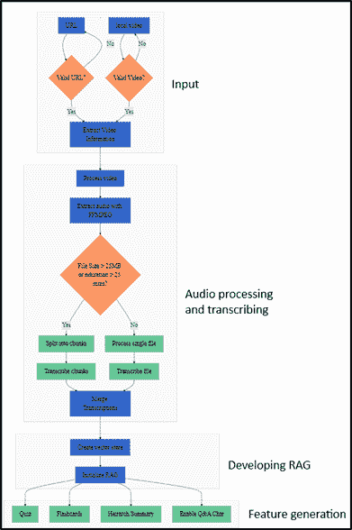
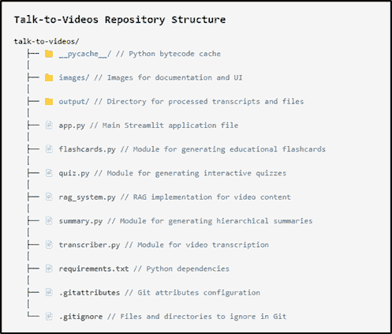
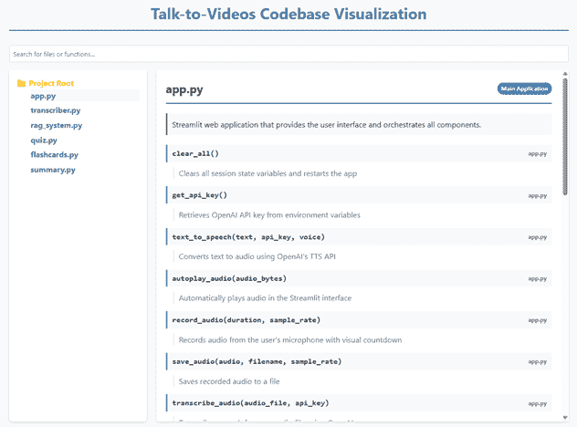
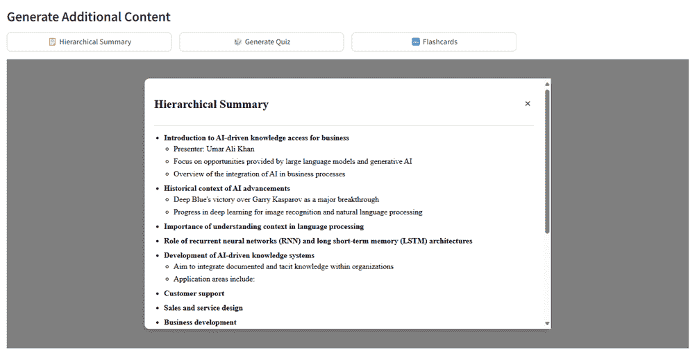
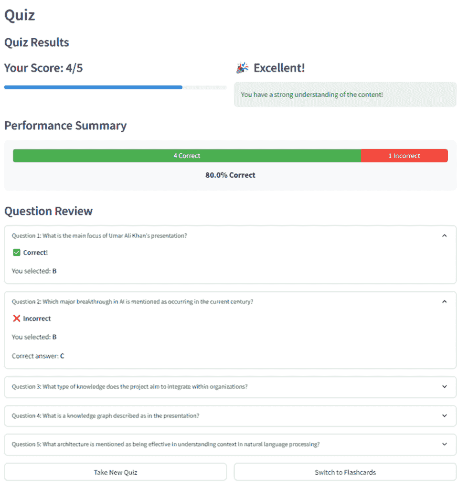
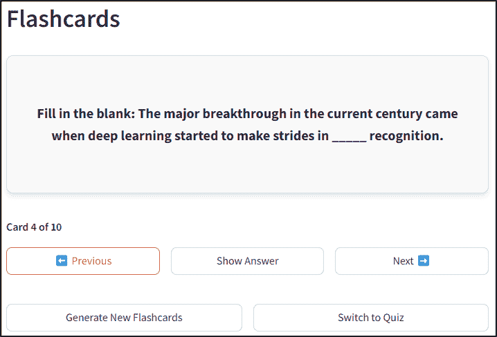

# 与视频对话

> 原文：[`towardsdatascience.com/talk-to-videos/`](https://towardsdatascience.com/talk-to-videos/)

<mdspan datatext="el1743036560566" class="mdspan-comment">大型语言模型</mdspan> (LLMs) 正在提高效率，并且现在能够理解不同的数据格式，为不同领域的众多应用提供了可能性。最初，LLMs 只能内在地处理文本。通过将 LLM 与另一个图像编码模型耦合，集成了图像理解功能。然而，`gpt-4o` 在文本和图像上进行了训练，是第一个真正多模态的 LLM，能够理解文本和图像。其他模态，如音频，通过其他 AI 模型（例如，OpenAI 的 Whisper 模型）集成到现代 LLM 中。

LLMs 现在更多地被用作信息处理器，它们可以处理不同格式的数据。将多个模态集成到 LLM 中，为教育、商业和其他领域的众多应用开辟了新的领域。其中一个应用是使用 LLM 处理教育视频、纪录片、网络研讨会、演示文稿、商务会议、讲座和其他内容，并以更自然的方式与这些内容互动。这些视频中的音频模态包含丰富的信息，可用于多种应用。在教育环境中，它可以用于个性化学习、提高有特殊需求学生的可访问性、创建学习辅助工具、远程学习支持，无需教师在场即可理解内容，以及评估学生对某个主题的知识。在商业环境中，它可以用于使用入职视频培训新员工、从会议和演示文稿中提取和生成知识、从产品演示视频中创建定制学习材料，以及从记录的行业会议中提取见解，无需观看数小时的视频，仅举几例。

本文讨论了开发一个自然交互视频并从中创建学习内容的应用程序。该应用程序具有以下功能：

+   通过 URL 或本地路径输入视频，并从视频中提取音频

+   使用 OpenAI 的最先进模型 `gpt-4o-transcribe`* 转录音频，该模型在多个已建立的基准测试中展示了比现有 Whisper 模型更优的词错误率 (WER) 性能

+   创建转录文本的向量存储库，并开发检索增强生成 (RAG) 以与视频转录文本进行对话

+   使用应用程序的用户界面中可选的不同声音，以文本和语音形式回答用户的问题。

+   创建如下学习内容：

    +   以分层方式呈现视频内容，使用户能够快速了解主要概念和辅助细节

    +   通过挑战用户回忆和应用视频中呈现的信息，将被动观看视频转变为主动学习，生成测验。

    +   从视频内容生成支持主动回忆和间隔重复学习技术的闪卡

应用程序的整体工作流程如下所示。



应用程序工作流程（图片由作者提供）

整个代码库，包括安装和使用的详细说明，可在 [GitHub](https://github.com/umairalipathan1980/Talk-to-Videos/tree/main) 上找到。

这里是 GitHub 仓库的结构。主 Streamlit 应用程序实现了 GUI 界面，并从其他功能和支持模块（`.py` 文件）调用几个其他函数。



GitHub 代码结构（图片由作者提供）

此外，您还可以通过在浏览器中打开“*代码库可视化*”HTML 文件来可视化代码库，该文件描述了每个模块的结构。



代码库可视化（图片由作者提供）

让我们逐步深入了解这个应用程序的开发过程。我不会讨论整个代码，而只关注其主要部分。GitHub 仓库中的整个代码都有充分的注释。

**视频输入和处理**

在 `transcriber.py` 中实现了视频输入和处理的逻辑。当应用程序加载时，它会验证 FFMPEG 是否存在于应用程序的根目录中（`verify_ffmpeg`）。FFMPEG 对于下载视频（如果输入是 URL）和从视频中提取音频（然后用于创建转录文本）是必需的。

```py
def verify_ffmpeg():
    """Verify that FFmpeg is available and print its location."""
    # Add FFmpeg to PATH
    os.environ['PATH'] = FFMPEG_LOCATION + os.pathsep + os.environ['PATH']
    # Check if FFmpeg binaries exist
    ffmpeg_path = os.path.join(FFMPEG_LOCATION, 'ffmpeg.exe')
    ffprobe_path = os.path.join(FFMPEG_LOCATION, 'ffprobe.exe')
    if not os.path.exists(ffmpeg_path):
        raise FileNotFoundError(f"FFmpeg executable not found at: {ffmpeg_path}")
    if not os.path.exists(ffprobe_path):
        raise FileNotFoundError(f"FFprobe executable not found at: {ffprobe_path}")
    print(f"FFmpeg found at: {ffmpeg_path}")
    print(f"FFprobe found at: {ffprobe_path}")
    # Try to execute FFmpeg to make sure it works
    try:
        # Add shell=True for Windows and capture errors properly
        result = subprocess.run([ffmpeg_path, '-version'], 
                               stdout=subprocess.PIPE, 
                               stderr=subprocess.PIPE,
                               shell=True,  # This can help with permission issues on Windows
                               check=False)
        if result.returncode == 0:
            print(f"FFmpeg version: {result.stdout.decode().splitlines()[0]}")
        else:
            error_msg = result.stderr.decode()
            print(f"FFmpeg error: {error_msg}")
            # Check for specific permission errors
            if "Access is denied" in error_msg:
                print("Permission error detected. Trying alternative approach...")
                # Try an alternative approach - just check file existence without execution
                if os.path.exists(ffmpeg_path) and os.path.exists(ffprobe_path):
                    print("FFmpeg files exist but execution test failed due to permissions.")
                    print("WARNING: The app may fail when trying to process videos.")
                    # Return paths anyway and hope for the best when actually used
                    return ffmpeg_path, ffprobe_path

            raise RuntimeError(f"FFmpeg execution failed: {error_msg}")
    except Exception as e:
        print(f"Error checking FFmpeg: {e}")
        # Fallback option if verification fails but files exist
        if os.path.exists(ffmpeg_path) and os.path.exists(ffprobe_path):
            print("WARNING: FFmpeg files exist but verification failed.")
            print("Attempting to continue anyway, but video processing may fail.")
            return ffmpeg_path, ffprobe_path 
        raise
    return ffmpeg_path, ffprobe_path 
```

视频输入的形式是 URL（例如，YouTube URL）或本地文件路径。`process_video` 函数确定输入类型并相应地路由。如果输入是 URL，则辅助函数 `get_video_info` 和 `get_video_id` 使用 `yt_dlp` 包提取视频元数据（标题、描述、持续时间），而不下载它。

```py
#Function to determine the input type and route it appropriately
def process_video(youtube_url, output_dir, api_key, model="gpt-4o-transcribe"):
    """
    Process a YouTube video to generate a transcript
    Wrapper function that combines download and transcription
    Args:
        youtube_url: URL of the YouTube video
        output_dir: Directory to save the output
        api_key: OpenAI API key
        model: The model to use for transcription (default: gpt-4o-transcribe)
    Returns:
        dict: Dictionary containing transcript and file paths
    """
    # First download the audio
    print("Downloading video...")
    audio_path = process_video_download(youtube_url, output_dir)

    print("Transcribing video...")
    # Then transcribe the audio
    transcript, transcript_path = process_video_transcribe(audio_path, output_dir, api_key, model=model)

    # Return the combined results
    return {
        'transcript': transcript,
        'transcript_path': transcript_path,
        'audio_path': audio_path
    }

def get_video_info(youtube_url):
    """Get video information without downloading."""
    # Check local cache first
    global _video_info_cache
    if youtube_url in _video_info_cache:
        return _video_info_cache[youtube_url]

    # Extract info if not cached
    with yt_dlp.YoutubeDL() as ydl:
        info = ydl.extract_info(youtube_url, download=False)
        # Cache the result
        _video_info_cache[youtube_url] = info
        # Also cache the video ID separately
        _video_id_cache[youtube_url] = info.get('id', 'video')
        return info

def get_video_id(youtube_url):
    """Get just the video ID without re-extracting if already known."""
    global _video_id_cache
    if youtube_url in _video_id_cache:
        return _video_id_cache[youtube_url]

    # If not in cache, extract from URL directly if possible
    if "v=" in youtube_url:
        video_id = youtube_url.split("v=")[1].split("&")[0]
        _video_id_cache[youtube_url] = video_id
        return video_id
    elif "youtu.be/" in youtube_url:
        video_id = youtube_url.split("youtu.be/")[1].split("?")[0]
        _video_id_cache[youtube_url] = video_id
        return video_id

    # If we can't extract directly, fall back to full info extraction
    info = get_video_info(youtube_url)
    video_id = info.get('id', 'video')
    return video_id 
```

在提供视频输入后，`app.py` 中的代码会检查是否存在输入视频的转录文本（在 URL 输入的情况下）。这是通过从 `transcriber.py` 调用以下两个辅助函数来完成的。

```py
def get_transcript_path(youtube_url, output_dir):
    """Get the expected transcript path for a given YouTube URL."""
    # Get video ID with caching
    video_id = get_video_id(youtube_url)
    # Return expected transcript path
    return os.path.join(output_dir, f"{video_id}_transcript.txt")

def transcript_exists(youtube_url, output_dir):
    """Check if a transcript already exists for this video."""
    transcript_path = get_transcript_path(youtube_url, output_dir)
    return os.path.exists(transcript_path)
```

如果 `transcript_exists` 返回现有转录文本的路径，则下一步是创建 RAG 的向量存储。如果没有找到现有转录文本，则下一步是从 URL 下载音频并将其转换为标准音频格式。`process_video_download` 函数使用 FFMPEG 库从 URL 下载音频并将其转换为 `.mp3` 格式。如果输入是本地视频文件，则 `app.py` 继续将其转换为 `.mp3` 文件。

```py
def process_video_download(youtube_url, output_dir):
    """
    Download audio from a YouTube video
    Args:
        youtube_url: URL of the YouTube video
        output_dir: Directory to save the output

    Returns:
        str: Path to the downloaded audio file
    """
    # Create output directory if it doesn't exist
    os.makedirs(output_dir, exist_ok=True)

    # Extract video ID from URL
    video_id = None
    if "v=" in youtube_url:
        video_id = youtube_url.split("v=")[1].split("&")[0]
    elif "youtu.be/" in youtube_url:
        video_id = youtube_url.split("youtu.be/")[1].split("?")[0]
    else:
        raise ValueError("Could not extract video ID from URL")
    # Set output paths
    audio_path = os.path.join(output_dir, f"{video_id}.mp3")

    # Configure yt-dlp options
    ydl_opts = {
        'format': 'bestaudio/best',
        'postprocessors': [{
            'key': 'FFmpegExtractAudio',
            'preferredcodec': 'mp3',
            'preferredquality': '192',
        }],
        'outtmpl': os.path.join(output_dir, f"{video_id}"),
        'quiet': True
    }

    # Download audio
    with yt_dlp.YoutubeDL(ydl_opts) as ydl:
        ydl.download([youtube_url])

    # Verify audio file exists
    if not os.path.exists(audio_path):
        # Try with an extension that yt-dlp might have used
        potential_paths = [
            os.path.join(output_dir, f"{video_id}.mp3"),
            os.path.join(output_dir, f"{video_id}.m4a"),
            os.path.join(output_dir, f"{video_id}.webm")
        ]

        for path in potential_paths:
            if os.path.exists(path):
                # Convert to mp3 if it's not already
                if not path.endswith('.mp3'):
                    ffmpeg_path = verify_ffmpeg()[0]
                    output_mp3 = os.path.join(output_dir, f"{video_id}.mp3")
                    subprocess.run([
                        ffmpeg_path, '-i', path, '-c:a', 'libmp3lame', 
                        '-q:a', '2', output_mp3, '-y'
                    ], check=True, capture_output=True)
                    os.remove(path)  # Remove the original file
                    audio_path = output_mp3
                else:
                    audio_path = path
                break
        else:
            raise FileNotFoundError(f"Could not find downloaded audio file for video {video_id}")
    return audio_path
```

**使用 OpenAI 的 `gpt-4o-transcribe` 模型进行音频转录**

在提取音频并将其转换为标准音频格式后，下一步是将音频转录成文本格式。为此，我使用了 OpenAI 新推出的`gpt-4o-transcribe`语音到文本模型，该模型可通过[speech-to-text API](https://platform.openai.com/docs/guides/speech-to-text)访问。在转录准确性和语言覆盖范围方面，该模型优于 OpenAI 的*Whisper*模型。

`transcriber.py`中的`process_video_transcribe`函数接收转换后的音频文件，并通过 OpenAI 的语音到文本 API 与`gpt-4o-transcribe`模型进行接口。`gpt-4o-transcribe`模型目前对音频文件的大小限制为 25MB，时长限制为 1500 秒。为了克服这一限制，我将较长的文件分割成多个块，并分别转录这些块。`process_video_transcribe`函数检查输入文件是否超过大小和/或时长限制。如果任一阈值超过，它将调用`split_and_transcribe`函数，该函数首先根据大小和时长计算所需的块数，并取这两个数的最大值作为转录的最终块数。然后，它找到每个块的起始和结束时间，并从音频文件中提取这些块。随后，它使用 OpenAI 的语音到文本 API 和`gpt-4o-transcribe`模型转录每个块，然后将所有块的转录合并以生成最终转录。

```py
def process_video_transcribe(audio_path, output_dir, api_key, progress_callback=None, model="gpt-4o-transcribe"):
    """
    Transcribe an audio file using OpenAI API, with automatic chunking for large files
    Always uses the selected model, with no fallback

    Args:
        audio_path: Path to the audio file
        output_dir: Directory to save the transcript
        api_key: OpenAI API key
        progress_callback: Function to call with progress updates (0-100)
        model: The model to use for transcription (default: gpt-4o-transcribe)

    Returns:
        tuple: (transcript text, transcript path)
    """
    # Extract video ID from audio path
    video_id = os.path.basename(audio_path).split('.')[0]
    transcript_path = os.path.join(output_dir, f"{video_id}_transcript.txt")

    # Setup OpenAI client
    client = OpenAI(api_key=api_key)

    # Update progress
    if progress_callback:
        progress_callback(10)

    # Get file size in MB
    file_size_mb = os.path.getsize(audio_path) / (1024 * 1024)

    # Universal chunking thresholds - apply to both models
    max_size_mb = 25  # 25MB chunk size for both models
    max_duration_seconds = 1500  # 1500 seconds chunk duration for both models

    # Load the audio file to get its duration
    try:
        audio = AudioSegment.from_file(audio_path)
        duration_seconds = len(audio) / 1000  # pydub uses milliseconds
    except Exception as e:
        print(f"Error loading audio to check duration: {e}")
        audio = None
        duration_seconds = 0

    # Determine if chunking is needed
    needs_chunking = False
    chunking_reason = []

    if file_size_mb > max_size_mb:
        needs_chunking = True
        chunking_reason.append(f"size ({file_size_mb:.2f}MB exceeds {max_size_mb}MB)")

    if duration_seconds > max_duration_seconds:
        needs_chunking = True
        chunking_reason.append(f"duration ({duration_seconds:.2f}s exceeds {max_duration_seconds}s)")

    # Log the decision
    if needs_chunking:
        reason_str = " and ".join(chunking_reason)
        print(f"Audio needs chunking due to {reason_str}. Using {model} for transcription.")
    else:
        print(f"Audio file is within limits. Using {model} for direct transcription.")

    # Check if file needs chunking
    if needs_chunking:
        if progress_callback:
            progress_callback(15)

        # Split the audio file into chunks and transcribe each chunk using the selected model only
        full_transcript = split_and_transcribe(
            audio_path, client, model, progress_callback, 
            max_size_mb, max_duration_seconds, audio
        )
    else:
        # File is small enough, transcribe directly with the selected model
        with open(audio_path, "rb") as audio_file:
            if progress_callback:
                progress_callback(30)

            transcript_response = client.audio.transcriptions.create(
                model=model, 
                file=audio_file
            )

            if progress_callback:
                progress_callback(80)

            full_transcript = transcript_response.text

    # Save transcript to file
    with open(transcript_path, "w", encoding="utf-8") as f:
        f.write(full_transcript)

    # Update progress
    if progress_callback:
        progress_callback(100)

    return full_transcript, transcript_path

def split_and_transcribe(audio_path, client, model, progress_callback=None, 
                         max_size_mb=25, max_duration_seconds=1500, audio=None):
    """
    Split an audio file into chunks and transcribe each chunk 

    Args:
        audio_path: Path to the audio file
        client: OpenAI client
        model: Model to use for transcription (will not fall back to other models)
        progress_callback: Function to call with progress updates
        max_size_mb: Maximum file size in MB
        max_duration_seconds: Maximum duration in seconds
        audio: Pre-loaded AudioSegment (optional)

    Returns:
        str: Combined transcript from all chunks
    """
    # Load the audio file if not provided
    if audio is None:
        audio = AudioSegment.from_file(audio_path)

    # Get audio duration in seconds
    duration_seconds = len(audio) / 1000

    # Calculate the number of chunks needed based on both size and duration
    file_size_mb = os.path.getsize(audio_path) / (1024 * 1024)

    chunks_by_size = math.ceil(file_size_mb / (max_size_mb * 0.9))  # Use 90% of max to be safe
    chunks_by_duration = math.ceil(duration_seconds / (max_duration_seconds * 0.95))  # Use 95% of max to be safe
    num_chunks = max(chunks_by_size, chunks_by_duration)

    print(f"Splitting audio into {num_chunks} chunks based on size ({chunks_by_size}) and duration ({chunks_by_duration})")

    # Calculate chunk duration in milliseconds
    chunk_length_ms = len(audio) // num_chunks

    # Create temp directory for chunks if it doesn't exist
    temp_dir = os.path.join(os.path.dirname(audio_path), "temp_chunks")
    os.makedirs(temp_dir, exist_ok=True)

    # Split the audio into chunks and transcribe each chunk
    transcripts = []

    for i in range(num_chunks):
        if progress_callback:
            # Update progress: 20% for splitting, 60% for transcribing
            progress_percent = 20 + int((i / num_chunks) * 60)
            progress_callback(progress_percent)

        # Calculate start and end times for this chunk
        start_ms = i * chunk_length_ms
        end_ms = min((i + 1) * chunk_length_ms, len(audio))

        # Extract the chunk
        chunk = audio[start_ms:end_ms]

        # Save the chunk to a temporary file
        chunk_path = os.path.join(temp_dir, f"chunk_{i}.mp3")
        chunk.export(chunk_path, format="mp3")

        # Log chunk information
        chunk_size_mb = os.path.getsize(chunk_path) / (1024 * 1024)
        chunk_duration = len(chunk) / 1000
        print(f"Chunk {i+1}/{num_chunks}: {chunk_size_mb:.2f}MB, {chunk_duration:.2f}s")

        # Transcribe the chunk 
        try:
            with open(chunk_path, "rb") as chunk_file:
                transcript_response = client.audio.transcriptions.create(
                    model=model,
                    file=chunk_file
                )

                # Add to our list of transcripts
                transcripts.append(transcript_response.text)
        except Exception as e:
            print(f"Error transcribing chunk {i+1} with {model}: {e}")
            # Add a placeholder for the failed chunk
            transcripts.append(f"[Transcription failed for segment {i+1}]")

        # Clean up the temporary chunk file
        os.remove(chunk_path)

    # Clean up the temporary directory
    try:
        os.rmdir(temp_dir)
    except:
        print(f"Note: Could not remove temporary directory {temp_dir}")

    # Combine all transcripts with proper spacing
    full_transcript = " ".join(transcripts)

    return full_transcript
```

以下为 Streamlit 应用的截图，显示了处理和转录我的网络研讨会视频的工作流程，该网络研讨会为“*[*将 LLMs 集成到业务中*](https://www.youtube.com/watch?v=BJC-mqdRXgw)*”，可在我的 YouTube 频道上找到。


Streamlit 应用的截图显示了提取音频和转录的过程（图片由作者提供）

**交互式对话的检索增强生成（RAG**）

在生成视频字幕后，应用程序开发了一个 RAG 来促进基于文本和语音的交互。对话智能是通过`rag_system.py`中的`VideoRAG`类实现的，该类初始化块大小和重叠，OpenAI 嵌入，`ChatOpenAI`实例用于使用`gpt-4o`模型生成响应，以及`ConversationBufferMemory`来维护聊天历史以保持上下文连续性。

`create_vector_store`方法将文档分割成块，并使用 FAISS 向量数据库创建向量存储。`handle_question_submission`方法处理文本问题，并将每个新问题及其答案追加到对话历史中。`handle_speech_input`函数实现了完整的语音到文本到语音的管道。它首先记录问题音频，转录问题，通过 RAG 系统处理查询，并为响应合成语音。

```py
class VideoRAG:
    def __init__(self, api_key=None, chunk_size=1000, chunk_overlap=200):
        """Initialize the RAG system with OpenAI API key."""
        # Use provided API key or try to get from environment
        self.api_key = api_key if api_key else st.secrets["OPENAI_API_KEY"]
        if not self.api_key:
            raise ValueError("OpenAI API key is required either as parameter or environment variable")

        self.embeddings = OpenAIEmbeddings(openai_api_key=self.api_key)
        self.llm = ChatOpenAI(
            openai_api_key=self.api_key,
            model="gpt-4o",
            temperature=0
        )
        self.chunk_size = chunk_size
        self.chunk_overlap = chunk_overlap
        self.vector_store = None
        self.chain = None
        self.memory = ConversationBufferMemory(
            memory_key="chat_history",
            return_messages=True
        )

    def create_vector_store(self, transcript):
        """Create a vector store from the transcript."""
        # Split the text into chunks
        text_splitter = RecursiveCharacterTextSplitter(
            chunk_size=self.chunk_size,
            chunk_overlap=self.chunk_overlap,
            separators=["nn", "n", " ", ""]
        )
        chunks = text_splitter.split_text(transcript)

        # Create vector store
        self.vector_store = FAISS.from_texts(chunks, self.embeddings)

        # Create prompt template for the RAG system
        system_template = """You are a specialized AI assistant that answers questions about a specific video. 

        You have access to snippets from the video transcript, and your role is to provide accurate information ONLY based on these snippets.

        Guidelines:
        1\. Only answer questions based on the information provided in the context from the video transcript, otherwise say that "I don't know. The video doesn't cover that information."
        2\. The question may ask you to summarize the video or tell what the video is about. In that case, present a summary of the context. 
        3\. Don't make up information or use knowledge from outside the provided context
        4\. Keep your answers concise and directly related to the question
        5\. If asked about your capabilities or identity, explain that you're an AI assistant that specializes in answering questions about this specific video

        Context from the video transcript:
        {context}

        Chat History:
        {chat_history}
        """
        user_template = "{question}"

        # Create the messages for the chat prompt
        messages = [
            SystemMessagePromptTemplate.from_template(system_template),
            HumanMessagePromptTemplate.from_template(user_template)
        ]

        # Create the chat prompt
        qa_prompt = ChatPromptTemplate.from_messages(messages)

        # Initialize the RAG chain with the custom prompt
        self.chain = ConversationalRetrievalChain.from_llm(
            llm=self.llm,
            retriever=self.vector_store.as_retriever(
                search_kwargs={"k": 5}
            ),
            memory=self.memory,
            combine_docs_chain_kwargs={"prompt": qa_prompt},
            verbose=True
        )

        return len(chunks)

    def set_chat_history(self, chat_history):
        """Set chat history from external session state."""
        if not self.memory:
            return

        # Clear existing memory
        self.memory.clear()

        # Convert standard chat history format to LangChain message format
        for message in chat_history:
            if message["role"] == "user":
                self.memory.chat_memory.add_user_message(message["content"])
            elif message["role"] == "assistant":
                self.memory.chat_memory.add_ai_message(message["content"])

    def ask(self, question, chat_history=None):
        """Ask a question to the RAG system."""
        if not self.chain:
            raise ValueError("Vector store not initialized. Call create_vector_store first.")

        # If chat history is provided, update the memory
        if chat_history:
            self.set_chat_history(chat_history)

        # Get response
        response = self.chain.invoke({"question": question})
        return response["answer"]
```

以下为 Streamlit 应用的截图，显示了与视频的交互式对话界面。


展示对话界面和交互式学习内容的快照（图片由作者提供）

以下快照展示了一个带有语音输入和文本+语音输出的视频对话。


视频对话（图片由作者提供）

**特征生成**

该应用生成了三个功能：层次总结、测验和闪卡。请参考它们各自的注释代码，见[GitHub 仓库](https://github.com/umairalipathan1980/Talk-to-Videos/tree/main)。

`summary.py`中的`SummaryGenerator`类通过创建视频内容的层次表示来提供结构化内容总结，使用户能够快速了解主要概念和支持细节。系统使用 RAG 从转写中检索关键上下文片段。使用提示（见`generate_summary`），它创建了一个包含三个级别的层次总结：主要观点、子观点和附加细节。`create_summary_popup_html`方法使用 CSS 和 JavaScript 将生成的总结转换为交互式视觉表示。

```py
# summary.py
class SummaryGenerator:
    def __init__(self):
        pass

    def generate_summary(self, rag_system, api_key, model="gpt-4o", temperature=0.2):
        """
        Generate a hierarchical bullet-point summary from the video transcript

        Args:
            rag_system: The RAG system with vector store
            api_key: OpenAI API key
            model: Model to use for summary generation
            temperature: Creativity level (0.0-1.0)

        Returns:
            str: Hierarchical bullet-point summary text
        """
        if not rag_system:
            st.error("Please transcribe the video first before creating a summary!")
            return ""

        with st.spinner("Generating hierarchical summary..."):
            # Create LLM for summary generation
            summary_llm = ChatOpenAI(
                openai_api_key=api_key,
                model=model,
                temperature=temperature  # Lower temperature for more factual summaries
            )

            # Use the RAG system to get relevant context
            try:
                # Get broader context since we're summarizing the whole video
                relevant_docs = rag_system.vector_store.similarity_search(
                    "summarize the main points of this video", k=10
                )
                context = "nn".join([doc.page_content for doc in relevant_docs])

                prompt = """Based on the video transcript, create a hierarchical bullet-point summary of the content.
                Structure your summary with exactly these levels:

                • Main points (use • or * at the start of the line for these top-level points)
                  - Sub-points (use - at the start of the line for these second-level details)
                    * Additional details (use spaces followed by * for third-level points)

                For example:
                • First main point
                  - Important detail about the first point
                  - Another important detail
                    * A specific example
                    * Another specific example
                • Second main point
                  - Detail about second point

                Be consistent with the exact formatting shown above. Each bullet level must start with the exact character shown (• or *, -, and spaces+*).
                Create 3-5 main points with 2-4 sub-points each, and add third-level details where appropriate.
                Focus on the most important information from the video.
                """

                # Use the LLM with context to generate the summary
                messages = [
                    {"role": "system", "content": f"You are given the following context from a video transcript:nn{context}nnUse this context to create a hierarchical summary according to the instructions."},
                    {"role": "user", "content": prompt}
                ]

                response = summary_llm.invoke(messages)
                return response.content
            except Exception as e:
                # Fallback to the regular RAG system if there's an error
                st.warning(f"Using standard summary generation due to error: {str(e)}")
                return rag_system.ask(prompt)

    def create_summary_popup_html(self, summary_content):
        """
        Create HTML for the summary popup with properly formatted hierarchical bullets

        Args:
            summary_content: Raw summary text with markdown bullet formatting

        Returns:
            str: HTML for the popup with properly formatted bullets
        """
        # Instead of relying on markdown conversion, let's manually parse and format the bullet points
        lines = summary_content.strip().split('n')
        formatted_html = []

        in_list = False
        list_level = 0

        for line in lines:
            line = line.strip()

            # Skip empty lines
            if not line:
                continue

            # Detect if this is a markdown header
            if line.startswith('# '):
                if in_list:
                    # Close any open lists
                    for _ in range(list_level):
                        formatted_html.append('</ul>')
                    in_list = False
                    list_level = 0
                formatted_html.append(f'<h1>{line[2:]}</h1>')
                continue

            # Check line for bullet point markers
            if line.startswith('• ') or line.startswith('* '):
                # Top level bullet
                content = line[2:].strip()

                if not in_list:
                    # Start a new list
                    formatted_html.append('<ul class="top-level">')
                    in_list = True
                    list_level = 1
                elif list_level > 1:
                    # Close nested lists to get back to top level
                    for _ in range(list_level - 1):
                        formatted_html.append('</ul></li>')
                    list_level = 1
                else:
                    # Close previous list item if needed
                    if formatted_html and not formatted_html[-1].endswith('</ul></li>') and in_list:
                        formatted_html.append('</li>')

                formatted_html.append(f'<li class="top-level-item">{content}')

            elif line.startswith('- '):
                # Second level bullet
                content = line[2:].strip()

                if not in_list:
                    # Start new lists
                    formatted_html.append('<ul class="top-level"><li class="top-level-item">Second level items')
                    formatted_html.append('<ul class="second-level">')
                    in_list = True
                    list_level = 2
                elif list_level == 1:
                    # Add a nested list
                    formatted_html.append('<ul class="second-level">')
                    list_level = 2
                elif list_level > 2:
                    # Close deeper nested lists to get to second level
                    for _ in range(list_level - 2):
                        formatted_html.append('</ul></li>')
                    list_level = 2
                else:
                    # Close previous list item if needed
                    if formatted_html and not formatted_html[-1].endswith('</ul></li>') and list_level == 2:
                        formatted_html.append('</li>')

                formatted_html.append(f'<li class="second-level-item">{content}')

            elif line.startswith('  * ') or line.startswith('    * '):
                # Third level bullet
                content = line.strip()[2:].strip()

                if not in_list:
                    # Start new lists (all levels)
                    formatted_html.append('<ul class="top-level"><li class="top-level-item">Top level')
                    formatted_html.append('<ul class="second-level"><li class="second-level-item">Second level')
                    formatted_html.append('<ul class="third-level">')
                    in_list = True
                    list_level = 3
                elif list_level == 2:
                    # Add a nested list
                    formatted_html.append('<ul class="third-level">')
                    list_level = 3
                elif list_level < 3:
                    # We missed a level, adjust
                    formatted_html.append('<li>Missing level</li>')
                    formatted_html.append('<ul class="third-level">')
                    list_level = 3
                else:
                    # Close previous list item if needed
                    if formatted_html and not formatted_html[-1].endswith('</ul></li>') and list_level == 3:
                        formatted_html.append('</li>')

                formatted_html.append(f'<li class="third-level-item">{content}')
            else:
                # Regular paragraph
                if in_list:
                    # Close any open lists
                    for _ in range(list_level):
                        formatted_html.append('</ul>')
                        if list_level > 1:
                            formatted_html.append('</li>')
                    in_list = False
                    list_level = 0
                formatted_html.append(f'<p>{line}</p>')

        # Close any open lists
        if in_list:
            # Close final item
            formatted_html.append('</li>')
            # Close any open lists
            for _ in range(list_level):
                if list_level > 1:
                    formatted_html.append('</ul></li>')
                else:
                    formatted_html.append('</ul>')

        summary_html = 'n'.join(formatted_html)

        html = f"""
        <div id="summary-popup" class="popup-overlay">
            <div class="popup-content">
                <div class="popup-header">
                    <h2>Hierarchical Summary</h2>
                    <button onclick="closeSummaryPopup()" class="close-button">×</button>
                </div>
                <div class="popup-body">
                    {summary_html}
                </div>
            </div>
        </div>

        <style>
        .popup-overlay {{
            position: fixed;
            top: 0;
            left: 0;
            width: 100%;
            height: 100%;
            background-color: rgba(0, 0, 0, 0.5);
            z-index: 1000;
            display: flex;
            justify-content: center;
            align-items: center;
        }}

        .popup-content {{
            background-color: white;
            padding: 20px;
            border-radius: 10px;
            width: 80%;
            max-width: 800px;
            max-height: 80vh;
            overflow-y: auto;
            box-shadow: 0 4px 8px rgba(0, 0, 0, 0.2);
        }}

        .popup-header {{
            display: flex;
            justify-content: space-between;
            align-items: center;
            border-bottom: 1px solid #ddd;
            padding-bottom: 10px;
            margin-bottom: 15px;
        }}

        .close-button {{
            background: none;
            border: none;
            font-size: 24px;
            cursor: pointer;
            color: #555;
        }}

        .close-button:hover {{
            color: #000;
        }}

        /* Style for hierarchical bullets */
        .popup-body ul {{
            padding-left: 20px;
            margin-bottom: 5px;
        }}

        .popup-body ul.top-level {{
            list-style-type: disc;
        }}

        .popup-body ul.second-level {{
            list-style-type: circle;
            margin-top: 5px;
        }}

        .popup-body ul.third-level {{
            list-style-type: square;
            margin-top: 3px;
        }}

        .popup-body li.top-level-item {{
            margin-bottom: 12px;
            font-weight: bold;
        }}

        .popup-body li.second-level-item {{
            margin-bottom: 8px;
            font-weight: normal;
        }}

        .popup-body li.third-level-item {{
            margin-bottom: 5px;
            font-weight: normal;
            font-size: 0.95em;
        }}

        .popup-body p {{
            margin-bottom: 10px;
        }}
        </style>

        <script>
        function closeSummaryPopup() {{
            document.getElementById('summary-popup').style.display = 'none';

            // Send message to Streamlit
            window.parent.postMessage({{
                type: "streamlit:setComponentValue",
                value: true
            }}, "*");
        }}
        </script>
        """
        return html
```



层次总结（图片由作者提供）

Talk-to-Videos 应用通过`quiz.py`中的`QuizGenerator`类从视频中生成测验。测验生成器创建针对视频中呈现的特定事实和概念的多项选择题。与 RAG 不同，我在其中使用的是零温度，我将 LLM 温度提高到 0.4，以鼓励在测验生成中的一些创造性。一个结构化提示引导测验生成过程。`parse_quiz_response`方法提取并验证生成的测验元素，以确保每个问题都有所有必需的组件。为了防止用户识别出模式并促进真正的理解，测验生成器打乱了答案选项。问题逐个呈现，每个答案后立即提供反馈。完成所有问题后，`calculate_quiz_results`方法评估用户答案，并向用户提供总体分数、正确与错误答案的视觉分解以及关于表现水平的反馈。通过这种方式，测验生成功能将被动观看视频转变为主动学习，挑战用户回忆和应用视频中呈现的信息。

```py
# quiz.py
class QuizGenerator:
    def __init__(self):
        pass

    def generate_quiz(self, rag_system, api_key, transcript=None, model="gpt-4o", temperature=0.4):
        """
        Generate quiz questions based on the video transcript

        Args:
            rag_system: The RAG system with vector store2
            api_key: OpenAI API key
            transcript: The full transcript text (optional)
            model: Model to use for question generation
            temperature: Creativity level (0.0-1.0)

        Returns:
            list: List of question objects
        """
        if not rag_system:
            st.error("Please transcribe the video first before creating a quiz!")
            return []

        # Create a temporary LLM with slightly higher temperature for more creative questions
        creative_llm = ChatOpenAI(
            openai_api_key=api_key,
            model=model,
            temperature=temperature
        )

        num_questions = 10

        # Prompt to generate quiz
        prompt = f"""Based on the video transcript, generate {num_questions} multiple-choice questions to test understanding of the content.
        For each question:
        1\. The question should be specific to information mentioned in the video
        2\. Include 4 options (A, B, C, D)
        3\. Clearly indicate the correct answer

        Format your response exactly as follows for each question:
        QUESTION: [question text]
        A: [option A]
        B: [option B]
        C: [option C]
        D: [option D]
        CORRECT: [letter of correct answer]

        Make sure all questions are based on facts from the video."""

        try:
            if transcript:
                # If we have the full transcript, use it
                messages = [
                    {"role": "system", "content": f"You are given the following transcript from a video:nn{transcript}nnUse this transcript to create quiz questions according to the instructions."},
                    {"role": "user", "content": prompt}
                ]

                response = creative_llm.invoke(messages)
                response_text = response.content
            else:
                # Fallback to RAG approach if no transcript is provided
                relevant_docs = rag_system.vector_store.similarity_search(
                    "what are the main topics covered in this video?", k=5
                )
                context = "nn".join([doc.page_content for doc in relevant_docs])

                # Use the creative LLM with context to generate questions
                messages = [
                    {"role": "system", "content": f"You are given the following context from a video transcript:nn{context}nnUse this context to create quiz questions according to the instructions."},
                    {"role": "user", "content": prompt}
                ]

                response = creative_llm.invoke(messages)
                response_text = response.content
        except Exception as e:
            # Fallback to the regular RAG system if there's an error
            st.warning(f"Using standard question generation due to error: {str(e)}")
            response_text = rag_system.ask(prompt)

        return self.parse_quiz_response(response_text)

    # The rest of the class remains unchanged
    def parse_quiz_response(self, response_text):
        """
        Parse the LLM response to extract questions, options, and correct answers

        Args:
            response_text: Raw text response from LLM

        Returns:
            list: List of parsed question objects
        """
        quiz_questions = []
        current_question = {}

        for line in response_text.strip().split('n'):
            line = line.strip()
            if line.startswith('QUESTION:'):
                if current_question and 'question' in current_question and 'options' in current_question and 'correct' in current_question:
                    quiz_questions.append(current_question)
                current_question = {
                    'question': line[len('QUESTION:'):].strip(),
                    'options': [],
                    'correct': None
                }
            elif line.startswith(('A:', 'B:', 'C:', 'D:')):
                option_letter = line[0]
                option_text = line[2:].strip()
                current_question.setdefault('options', []).append((option_letter, option_text))
            elif line.startswith('CORRECT:'):
                current_question['correct'] = line[len('CORRECT:'):].strip()

        # Add the last question
        if current_question and 'question' in current_question and 'options' in current_question and 'correct' in current_question:
            quiz_questions.append(current_question)

        # Randomize options for each question
        randomized_questions = []
        for q in quiz_questions:
            # Get the original correct answer
            correct_letter = q['correct']
            correct_option = None

            # Find the correct option text
            for letter, text in q['options']:
                if letter == correct_letter:
                    correct_option = text
                    break

            if correct_option is None:
                # If we can't find the correct answer, keep the question as is
                randomized_questions.append(q)
                continue

            # Create a list of options texts and shuffle them
            option_texts = [text for _, text in q['options']]

            # Create a copy of the original letters
            option_letters = [letter for letter, _ in q['options']]

            # Create a list of (letter, text) pairs
            options_pairs = list(zip(option_letters, option_texts))

            # Shuffle the pairs
            random.shuffle(options_pairs)

            # Find the new position of the correct answer
            new_correct_letter = None
            for letter, text in options_pairs:
                if text == correct_option:
                    new_correct_letter = letter
                    break

            # Create a new question with randomized options
            new_q = {
                'question': q['question'],
                'options': options_pairs,
                'correct': new_correct_letter
            }

            randomized_questions.append(new_q)

        return randomized_questions

    def calculate_quiz_results(self, questions, user_answers):
        """
        Calculate quiz results based on user answers

        Args:
            questions: List of question objects
            user_answers: Dictionary of user answers keyed by question_key

        Returns:
            tuple: (results dict, correct count)
        """
        correct_count = 0
        results = {}

        for i, question in enumerate(questions):
            question_key = f"quiz_q_{i}"
            user_answer = user_answers.get(question_key)
            correct_answer = question['correct']

            # Only count as correct if user selected an answer and it matches
            is_correct = user_answer is not None and user_answer == correct_answer
            if is_correct:
                correct_count += 1

            results[question_key] = {
                'user_answer': user_answer,
                'correct_answer': correct_answer,
                'is_correct': is_correct
            }

        return results, correct_count
```



测验结果（图片由作者提供）

Talk-to-Videos 还可以从视频内容中生成闪卡，这些闪卡支持主动回忆和间隔重复学习技术。这是通过`flashcards.py`中的`FlashcardGenerator`类实现的，该类创建了一系列不同类型的闪卡，重点关注关键术语定义、概念问题、填空陈述以及带有解释的真/假问题。一个提示引导 LLM 以结构化的 JSON 格式输出闪卡，每张卡片包含独特的“正面”和“背面”元素。`shuffle_flashcards`生成随机展示，并在向用户展示之前验证每张闪卡是否包含正面和背面组件。每张闪卡的答案最初是隐藏的。它通过经典的闪卡揭示功能在用户输入时显示。用户可以生成一套新的闪卡以进行更多练习。闪卡和测验系统相互连接，用户可以根据需要在这两者之间切换。

```py
# flashcards.py
class FlashcardGenerator:
    """Class to generate flashcards from video content using the RAG system."""

    def __init__(self):
        """Initialize the flashcard generator."""
        pass

    def generate_flashcards(self, rag_system, api_key, transcript=None, num_cards=10, model="gpt-4o") -> List[Dict[str, str]]:
        """
        Generate flashcards based on the video content.

        Args:
            rag_system: The initialized RAG system with video content
            api_key: OpenAI API key
            transcript: The full transcript text (optional)
            num_cards: Number of flashcards to generate (default: 10)
            model: The OpenAI model to use

        Returns:
            List of flashcard dictionaries with 'front' and 'back' keys
        """
        # Import here to avoid circular imports
        from langchain_openai import ChatOpenAI

        # Initialize language model
        llm = ChatOpenAI(
            openai_api_key=api_key,
            model=model,
            temperature=0.4
        )

        # Create the prompt for flashcard generation
        prompt = f"""
        Create {num_cards} educational flashcards based on the video content.

        Each flashcard should have:
        1\. A front side with a question, term, or concept
        2\. A back side with the answer, definition, or explanation

        Focus on the most important and educational content from the video. 
        Create a mix of different types of flashcards:
        - Key term definitions
        - Conceptual questions
        - Fill-in-the-blank statements
        - True/False questions with explanations

        Format your response as a JSON array of objects with 'front' and 'back' properties.
        Example:
        [
            {{"front": "What is photosynthesis?", "back": "The process by which plants convert light energy into chemical energy."}},
            {{"front": "The three branches of government are: Executive, Legislative, and _____", "back": "Judicial"}}
        ]

        Make sure your output is valid JSON format with exactly {num_cards} flashcards.
        """

        try:
            # Determine the context to use
            if transcript:
                # Use the full transcript if provided
                # Create messages for the language model
                messages = [
                    {"role": "system", "content": f"You are an educational content creator specializing in creating effective flashcards. Use the following transcript from a video to create educational flashcards:nn{transcript}"},
                    {"role": "user", "content": prompt}
                ]
            else:
                # Fallback to RAG system if no transcript is provided
                relevant_docs = rag_system.vector_store.similarity_search(
                    "key points and educational concepts in the video", k=15
                )
                context = "nn".join([doc.page_content for doc in relevant_docs])

                # Create messages for the language model
                messages = [
                    {"role": "system", "content": f"You are an educational content creator specializing in creating effective flashcards. Use the following context from a video to create educational flashcards:nn{context}"},
                    {"role": "user", "content": prompt}
                ]

            # Generate flashcards
            response = llm.invoke(messages)
            content = response.content

            # Extract JSON content in case there's text around it
            json_start = content.find('[')
            json_end = content.rfind(']') + 1

            if json_start >= 0 and json_end > json_start:
                json_content = content[json_start:json_end]
                flashcards = json.loads(json_content)
            else:
                # Fallback in case of improper JSON formatting
                raise ValueError("Failed to extract valid JSON from response")

            # Verify we have the expected number of cards (or adjust as needed)
            actual_cards = min(len(flashcards), num_cards)
            flashcards = flashcards[:actual_cards]

            # Validate each flashcard has required fields
            validated_cards = []
            for card in flashcards:
                if 'front' in card and 'back' in card:
                    validated_cards.append({
                        'front': card['front'],
                        'back': card['back']
                    })

            return validated_cards

        except Exception as e:
            # Handle errors gracefully
            print(f"Error generating flashcards: {str(e)}")
            # Return a few basic flashcards in case of error
            return [
                {"front": "Error generating flashcards", "back": f"Please try again. Error: {str(e)}"},
                {"front": "Tip", "back": "Try regenerating flashcards or using a different video"}
            ]

    def shuffle_flashcards(self, flashcards: List[Dict[str, str]]) -> List[Dict[str, str]]:
        """Shuffle the order of flashcards"""
        shuffled = flashcards.copy()
        random.shuffle(shuffled)
        return shuffled
```



闪卡（图片由作者提供）

**潜在的扩展和改进**

该应用程序可以通过多种方式扩展和改进。例如：

+   可以探索将视频中的视觉特征（如关键帧）与音频结合，以提取更有意义的信息。

+   可以启用基于团队的学习体验，让办公室同事或同学可以共享笔记、测验分数和总结。

+   创建可导航的文本记录，允许用户点击特定部分以跳转到视频中的该点

+   为将视频中的概念应用于实际商业环境创建逐步行动计划

+   修改 RAG 提示以详细阐述答案，并为难以理解的概念提供更简单的解释。

+   通过激发学习者思考他们的思维过程和学习策略，在观看视频内容时生成能够刺激元认知技能的问题。

***这就是全部了！如果您喜欢这篇文章，请关注我*** [***Medium***](https://medium.com/@umairali.khan)*** 和 ***[***LinkedIn***](http://www.linkedin.com/in/uakhan80)***.***
