# 测试多模态 AI 系统在阅读和解释照片、地图、图表等方面的能力

> [原文链接](https://towardsdatascience.com/testing-the-power-of-multimodal-ai-systems-in-reading-and-interpreting-photographs-maps-charts-and-more/)

## <mdspan datatext="el1742844644136" class="mdspan-comment">简介</mdspan>

近年来，人工智能取得了巨大的进步，这并不是新闻，尤其是随着多模态模型的出现，这些模型可以处理和创建文本和图像，还有一些非常新的模型，它们还可以处理和生成音频和视频。我认为这些 AI 系统有潜力彻底改变数据分析、机器人技术，甚至像导航和信息提取这样的日常任务。沿着这个思路，我最近提出了以下问题：

> 由具有视觉能力的大型语言模型组成的多模态 AI 系统能否理解包含信息的图表，然后处理它并生成摘要、解释、物体识别等？

尽管这本身就是一个需要整个研究项目才能得到妥善解决的问题，但我对此非常好奇，所以我需要至少得到一个关于我的问题的粗略近似。因此，我对 OpenAI 的视觉增强模型对照片、截图和其他包含图表、图表、驾驶员视角的镜头或模仿机器人机载摄像头的图像，甚至分子结构的理解程度进行了测试。

更具体地说，我尝试了 OpenAI 开发的 GPT-4o 和 GPT-4o-mini 模型，通过 ChatGPT 或通过它们的 API。令我惊讶的是，我发现这些模型确实能理解他们看到的大部分内容！

让我在这里展示我获得的最有趣的结果，这些结果要么是通过 ChatGPT 直接获得的，要么是通过编程获得的，包括一个网页应用程序的代码，你可以在其中粘贴一张图片，然后让 GPT-4o-mini 分析它。

### 首先：如何使用 OpenAI 的 GPT-4o 模型通过 ChatGPT 或程序化方式分析图像

我立即在 ChatGPT 的免费版本上使用 GPT-4o 进行了第一次测试，这允许每天最多使用 4 次“视觉”功能。要使用此功能，您必须上传或从剪贴板粘贴一张图片，该图片将与提示一起发送。在付费的 ChatGPT 账户上，您可以更频繁地这样做，而通过 OpenAI API，只要可用 token 信用额度，您可以直接程序化地这样做，正如我将在下面介绍的那样。

### 程序化处理包含图片的提示

但如何通过 GPT-4o 模型进行程序化的图像处理呢？嗯，正如在[OpenAI 的 API 参考](https://platform.openai.com/docs/guides/images?api-mode=chat&lang=javascript&format=base64-encoded)中解释的那样，这并不复杂。

在 JavaScript 中，我非常喜欢它，因为它允许我轻松编写在线运行的程序，正如你已经知道的那样，如果你跟随我，你只需要一个看起来像这样的函数调用：

```py
async function sendToOpenAI(imageData) {
    const apiKey = "...API KEY HERE";
    const base64Image = imageData.split(",")[1];

    const response = await fetch("https://api.openai.com/v1/chat/completions", {
        method: "POST",
        headers: {
            "Content-Type": "application/json",
            "Authorization": `Bearer ${apiKey}`
        },
        body: JSON.stringify({
            model: "gpt-4o-mini",
            messages: [{
                role: "user",
                content: [
                    { type: "text", text: "what's in this image?" },
                    { type: "image_url", image_url: { url: `data:image/jpeg;base64,${base64Image}` } }
                ]
            }]
        })
    });

    const result = await response.json();
    document.getElementById("response").innerText = result.choices[0].message.content;
}
```

### 一个快速运行图像-文本提示的网页应用

在这个示例网页应用中，你可以提供一个 API 密钥和文本提示，然后粘贴来自剪贴板的图片，该图片将被立即发送到 OpenAI 进行分析，并与提示一起发送。

[`lucianoabriata.altervista.org/tests/gpt-vision/gpt-4o-mini-vision.html`](https://lucianoabriata.altervista.org/tests/gpt-vision/gpt-4o-mini-vision.html)

网页应用最终会显示答案，就像这个例子一样：

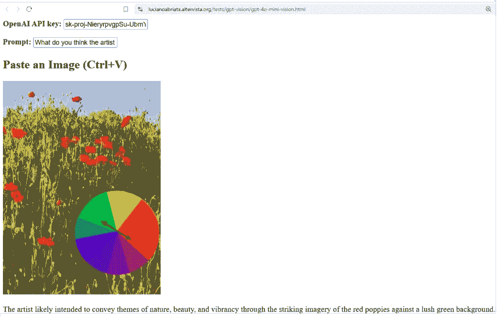

这篇文章中展示的所有图像、照片和屏幕截图都是作者的作品。

（继续阅读，在文章末尾找到 Google 的 Gemini 2.0 如何解释这张截图，它惊人地正确，因为它捕捉到了艺术家的实际意图！）

### 使用各种图像-文本提示示例挑战 GPT-4o 模型

使用上述应用运行 GPT-4o-mini 和 ChatGPT 的免费版运行 GPT-4o，我评估了这些模型如何理解地图、模仿驾驶员在道路上看到的照片、关于机器人手臂相对于某些目标物体的位置的视频、各种不同类型的图表和数据，以及显示分子的软件屏幕截图。

我对模型理解得如此之多感到震惊！继续阅读以了解全部内容，也请看看我使用令人印象深刻的 Google Gemini 2.0 Flash 进行的第一次测试，也许然后你可以尝试你最喜欢的 AI 模型，并分享你在评论中的发现！

## 1. 基于视觉的 Google Maps 屏幕截图分析

有时候，地图包含如此多的信息，你可能会在其中迷失方向。在这种情况下，多模态系统能有所帮助吗？让我们来看看！

在这里左边是一个我从 Google Maps 视图中截取的屏幕截图，我通过 API 将其输入到 GPT-4o-mini 中，并提出了问题“这张图片里有什么？” 。你可以在右边看到答案：

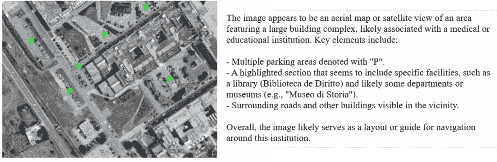

## 2. 在道路上解读驾驶标志

或许多模态系统可以帮助你驾驶？当然，这值得进行全面调查以得出一个可靠的结论，但让我们先看看一些快速测试的结果。在每次测试中，我提供了一张驾驶员在行驶中看到的道路照片，以及以下文本提示：

> 解释作为驾驶员我应该注意的任何道路标志或事物

下面是一些示例照片的结果，所有这些都是在上面提供的网页应用中运行的，即使用 GPT-4o-mini：

首先，对于这张照片：

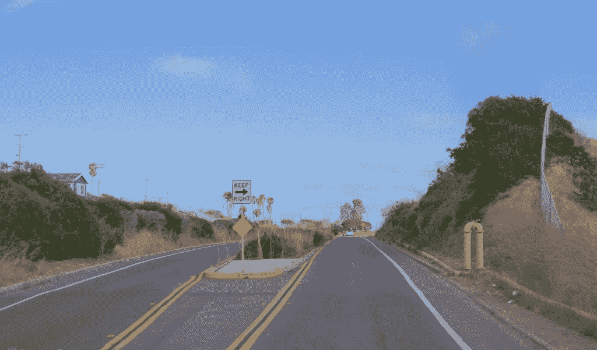

GPT-4o-mini 说以下内容：

> 在驾驶时，请注意图像中的以下标志和特征：
> 
> 1. **“靠右行驶”标志**：这表示您应该保持在道路的右侧，可能是因为前方有岛屿或障碍物。
> 
> 2. **前方弯道**：道路布局表明您可能会遇到弯道，这意味着您应该减速并保持警惕，注意任何迎面而来的车辆。
> 
> 3. **速度限制**：显示速度限制为 40 的标志表示您不应超过这个速度。
> 
> 4. **道路布局**：注意标记线以及它们如何引导交通。两条实线黄色表示禁止穿越（超车）。
> 
> 5. **周围环境**：注意道路两侧的植被和景观，这些可能在某些区域遮挡视线。保持对行人或自行车的警觉。
> 
> 确保保持警惕并遵守这些指南以确保安全驾驶。

这个答案相当好，完整且有用！

让我们尝试下一个，在一个大雪的地方：

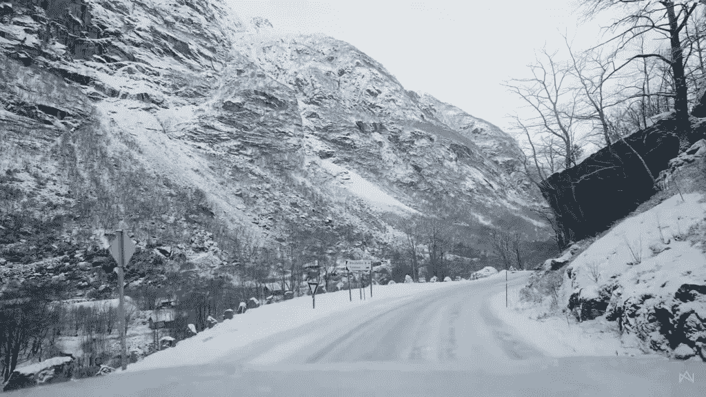

这里明显积聚了雪，并正确推断这是一个有山区的地区，提供了一些相当一般的建议，适合这种情况，但似乎并不非常具体：

> 在雪地山区驾驶时，有几个重要事项需要注意：
> 
> 1. **让行标志**：如果有让行标志，请准备好减速并让行于交叉道路上的任何交通。
> 
> 2. **道路状况**：雪可以使道路变得光滑并降低能见度。谨慎驾驶，并与其他车辆保持安全距离。
> 
> 3. **速度限制**：始终遵守标示的速度限制，但考虑到天气条件，可以考虑进一步减速。
> 
> 4. **滑溜表面**：请注意某些区域可能更滑或更危险。注意指示滑溜道路或禁止进入的标志。
> 
> 5. **落石**：在山区，注意任何指示可能发生落石或山体滑坡的标志，这些可能因雪而加剧。
> 
> 6. **野生动物**：在农村或山区，请注意野生动物横穿道路，尤其是在冬季月份。
> 
> 7. **能见度**：如果因雪能见度低，请确保使用您的车灯并减速。
> 
> 总是确保您的车辆适合冬季条件，包括必要时安装雪胎或链条。

让我们尝试最后一个，它包括隧道、驾驶员前方的一辆车、左侧的一些警告和右侧的两个路标：

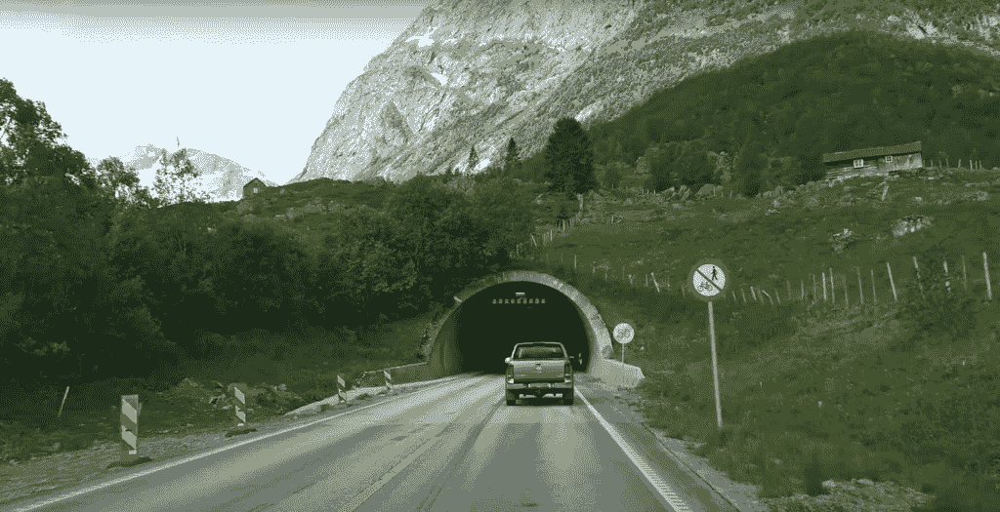

这似乎是在警告所有一般性和特定情况的问题：

> 根据图片，以下是一些需要注意的重要事项：
> 
> 1. **前方隧道**：您正在接近隧道。准备可能出现的能见度变化，并确保您的车辆前灯开启。
> 
> 2. **速度和空间**：始终与前方车辆保持安全距离，尤其是在隧道等狭窄空间中。
> 
> 3. **禁止行人或自行车**：标志表明行人和自行车不允许进入该区域。保持警惕，确保您不会在路上遇到任何人。
> 
> 4. **道路障碍和交通流**：注意道路标线和障碍物，因为它们指导车道使用和在隧道入口附近的安全导航。
> 
> 5. **天气和地形**：周围的地貌表明，天气条件可能会迅速变化，尤其是在山区驾驶。请做好道路条件变化的准备。
> 
> 总是谨慎驾驶，并遵守任何现有的交通标志或信号。

然而，它没有注明速度限制的具体变化。我再次尝试用一些更具体的文本提示来拍摄这张照片，但它从未提到这个特定情况下速度限制的变化，而是提供了这样的通用建议：

> 在隧道内的最高速度限制可能因国家交通规则、具体道路和隧道设计而异。通常，在许多地方，典型的速度限制在 50 至 80 公里/小时（约 30 至 50 英里/小时）之间。要确定特定隧道的确切速度限制，您需要寻找张贴的标志或咨询当地交通规则。

这虽然正确，但也表明它无法提取这里具体可用的信息，这可能是类似于“最高速度未标明，但根据可见的路标，肯定超过 50”这样的信息。

## 3. 能否用视觉准备好的模型驱动机器人？

如果一个 AI 模型对图片理解得足够好，那么可以考虑将机器人的摄像头输入到模型中，以便它产生有意义的输出。当然，这本身就是一个巨大的研究领域，需要产生最终导致机械输出的命令；但让我们看看核心部分——即把视图转换为广泛动作——是如何工作的。

给定这张桌子上一个红色和蓝色球体等待被抓取的机器人手臂的照片：

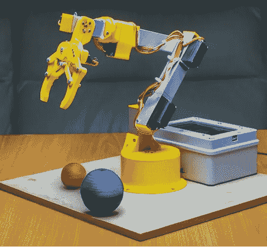

我向 GPT-4o 提出以下问题：

> 机器人手臂应该如何移动才能抓住蓝色球体？

对此，LLM 回答得相当正确，甚至问我是否希望它继续生成代码：

> 为了抓住蓝色球体，机器人手臂应遵循以下步骤：
> 
> **定位基座**：旋转基座，使手臂与蓝色球体对齐。
> 
> **降低手臂**：通过移动关节调整手臂的高度，使夹具更靠近球体。
> 
> **向前伸展**：如果需要，向前伸展手臂以触及蓝色球体。
> 
> **打开夹具**：确保夹具张开足够宽，以便抓住球体。
> 
> **关闭夹具**：轻轻关闭夹具，使其围绕球体固定。
> 
> **举起球体**：在稳固地握住球体的同时，轻轻抬起手臂。
> 
> **缩回或移动到目的地**：将手臂移动到放置球体的期望位置。
> 
> 这些动作应该平滑，以避免掉落或与球体错位。您需要帮助编程机械臂来完成这项任务吗？

我觉得答案相当好，但缺乏精确性。所以，与其走询问代码的路，我将对 LLM 进行更深入的质询，看看它在这张图片中真正理解了什么：

> 当你说“定位基础：旋转基础，使手臂与蓝色球体对齐。”时，根据图像，手臂应该向左移动还是向右移动？

结果非常好：

> 根据图像，机械臂应该**向左旋转**以与蓝色球体对齐。球体位于手臂当前方向的左侧，因此逆时针旋转将使夹具更接近球体。

然而，我进一步挖掘：

> 你估计它应该旋转多少？

这个新的答案基本上和我从照片中作为一个人类所能估计的是一样的：

> 从图像中估计，机械臂应该将其基础旋转**大约 30 到 45 度逆时针**以与蓝色球体对齐。
> 
> 这个估计假设：
> 
> 机械臂的当前位置稍微向右。
> 
> 蓝色球体放置在手臂的前面和左侧。
> 
> 一旦基础旋转，可能需要对手臂关节进行微调，以在抓取球体之前调整位置。

最后，我询问红色球体，以测试模型是否理解它在另一侧，并且需要较小的旋转：

> 那么抓取红色球体呢？

而且它确实做到了！

> 为了抓住**红色球体**，机械臂应遵循以下步骤：
> 
> **旋转基础**：基础应该**略微向左旋转**，但比蓝色球体旋转得少。估计**15 到 20 度逆时针**应该使手臂与红色球体对齐。
> 
> **降低手臂**：将夹具向下移动，使其靠近红色球体。
> 
> **向前延伸（如果需要）**：如果夹具不在球体正上方，调整手臂的伸展范围。
> 
> **打开夹具**：确保夹具足够宽，可以抓住球体。
> 
> **关闭夹具**：牢固地抓住红色球体。
> 
> **抬起手臂**：小心地抬起球体。
> 
> **移动到目的地**：如果需要，将球体运送到期望的位置。
> 
> 由于红色球体比蓝色球体更靠近机械臂，因此需要更少的移动。您是否需要基于测量的精确角度计算？

如果你也对使用视觉模型驾驶机器人的可能性感到兴奋，请查看 X.com 上的这个帖子[driving robots with vision models, check out this thread on X.com](https://x.com/adcock_brett/status/1901303220300829066)。

## 4. 对数据图进行操作的视觉模型

在*Towards Data Science*，我们无法回避一个明显的问题：视觉辅助模型能否理解图表的内容，甚至从中得出结论？

我在这里进行了相当多的测试，处理不同类型的信息和情节。

#### 在潮汐图中检测高潮

我从以下图表开始，这是一张关于亚速尔群岛之一的潮汐高低图表，用葡萄牙语写成，但我用英语提出了一个问题：

> 根据图表，高潮发生在什么时候？

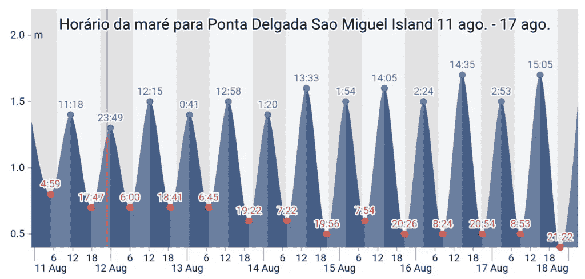

这是答案：

> 图表中的高潮潮汐用蓝色圆点标记，并对应相应的时间。最高潮汐发生在以下时间：
> 
> **8 月 11 日：** 11:18
> 
> **8 月 12 日：** 12:15
> 
> **8 月 13 日：** 12:58
> 
> **8 月 14 日：** 13:33
> 
> **8 月 15 日：** 14:05
> 
> **8 月 16 日：** 14:35
> 
> **8 月 17 日：** 15:05
> 
> 这些时间代表每天潮汐达到最高点的时间。

你可以立即看出显示的数据是正确的，但它只代表白天的高潮，完全忽略了白天发生的高潮！因此，我特意询问了这一点，并得到了一个更完整的答案：

我说：

> 但你说的这些时间都是在白天……图表不是也显示了夜间的高潮吗？

GPT-4o 说：

> 你完全正确！图表也显示了夜间发生的高潮。以下是根据图表的所有**高潮潮汐时间**（白天和夜间）：
> 
> **8 月 11 日：** 11:18（白天）
> 
> **8 月 12 日：** 12:15（白天）& 23:49（夜间）
> 
> **8 月 13 日：** 12:58（白天）& 00:41（夜间）
> 
> **8 月 14 日：** 13:33（白天）& 01:20（夜间）
> 
> **8 月 15 日：** 14:05（白天）& 01:54（夜间）
> 
> **8 月 16 日：** 14:35（白天）& 02:24（夜间）
> 
> **8 月 17 日：** 15:05（白天）& 02:53（夜间）
> 
> 每天都有**两次高潮潮汐**，一次在白天，一次在夜间。感谢你注意到这一点！

现在完美了。最后，我询问了另一条信息：

> 好的，谢谢。你能告诉我这张图表是关于哪个地方的吗？

再次，答案是正确的：

> 是的！这张图表是关于**蓬塔德尔加达，圣米格尔岛**的，它是**亚速尔群岛**的一部分，亚速尔群岛是北大西洋中的一个**葡萄牙**自治区域。这个地点以其令人惊叹的火山景观、海岸风光和海上活动而闻名。潮汐图表显示了从**8 月 11 日到 8 月 17 日**这一地区的潮汐时间表。

#### 从照片中解读高度剖面

接下来，我将问题变得更难一些，因为图像是一张屏幕截图的照片（见干扰的水平条纹），图表的 x 轴并不完整，问题还涉及一些思考：

> 看到这里，我会从安德马特到瓦森上升还是下降？下降多少米，以及多少公里？

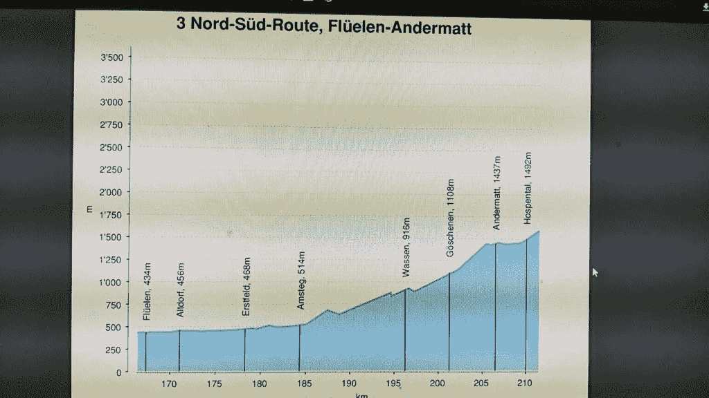

然而，答案是完美的！如下所示：

> 从海拔剖面来看，安德马特海拔**1437 米**，瓦森海拔**916 米**。这意味着从安德马特到瓦森的旅行涉及**下降 521 米**（1437 米 - 916 米）。
> 
> 观察水平轴，安德马特到瓦森的距离看起来大约是**10 公里**。因此，你将下降**521 米**，大约在 10 公里的距离上。

#### 从 RNA-seq 数据中解读图表

我随后测试了 GPT-4o 解释生物信息学流程中生成的图表的能力。首先，我让它处理火山图，这是分析差异基因表达数据中最常见的图表类型之一。我从[这个免费在线教程](https://scienceparkstudygroup.github.io/rna-seq-lesson/06-differential-analysis/index.html)中取了一个示例图像，并询问系统以下内容：

> 您是一位生物信息学专家。您会从这张火山图中得出什么结论？我的意思是，哪些基因是上调或下调的？

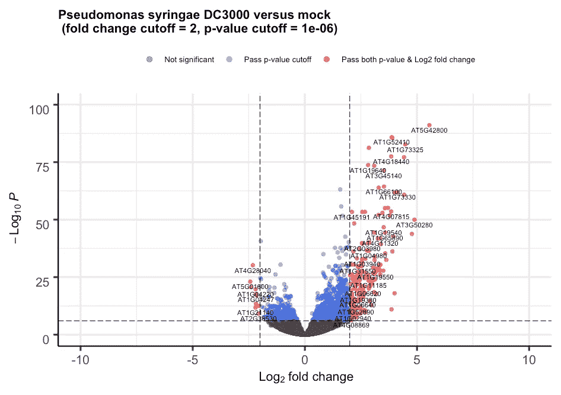

这是 GPT-4o 的回答：

> 这张火山图表示与**拟南芥**感染**丁香假单胞菌 DC3000**相比的**拟南芥**中差异表达基因。以下是我的解读：
> 
> **1. X 轴（Log₂倍数变化）**：
> 
> 正值表示**上调基因**（在感染样本中表达更高）。
> 
> 负值表示**下调基因**（在感染样本中表达较低）。
> 
> **2. Y 轴（-Log₁₀ P 值）**：
> 
> 较高值表示更强的统计显著性。
> 
> **3. 颜色编码**：
> 
> **灰色**：不显著。
> 
> **蓝色**：通过 p 值显著，但不是通过倍数变化。
> 
> **红色**：通过 p 值和倍数变化阈值均显著。
> 
> **主要发现：**
> 
> **上调基因（右侧，红色点）**：
> 
> 强烈诱导的基因包括**AT5G42800、AT1G52440、AT1G73325、AT4G18440**等。
> 
> 这些基因在感染植物中高度表达。
> 
> **下调基因（左侧，红色点）**：
> 
> 例如包括**AT4G28940、AT5G04100、AT1G04220、AT1G02440**。
> 
> 这些基因在感染期间被显著抑制。
> 
> **生物意义**：
> 
> 上调基因可能参与植物免疫反应，例如**防御信号、应激反应或抗菌活性**。
> 
> 下调基因可能参与**在感染期间被抑制的正常细胞功能**。

您可以看到响应的第一部分如何清晰地读出图表的主要特征，解释了坐标轴和标签颜色，甚至考虑了图表的标题。然后，模型提炼出通过阈值且具有强统计显著性的上调或下调基因列表。请注意，该列表对于上调基因是正确的，但对于下调基因有几个问题。检查图表后，可以清楚地看出这是由于标签没有清晰地解析，即使是对于人类也是如此。

提升一个等级，不知何故，模型知道关于已识别基因的正确信息，因此可以就结果生物意义得出一些简单结论。

真是令人惊叹，如果不是因为读取标签时出现的小问题，这在实际场景中可能可以得到改善。

* * *

然后，在第二个与 RNA-seq 数据相关的测试中，我询问 GPT-4o 对在单个图表（图像[编辑自本教程](https://www.biostars.org/p/346323/)）中一起显示的两个 p 值分布的看法：

> 这张图显示了 RNA-seq 数据的两个 p 值分布。你认为它们正常吗，或者你注意到什么奇怪的地方了吗？

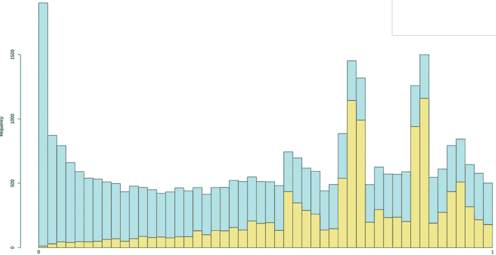

这是答案，再次出色：

> 这个直方图表示 RNA-seq 数据的两个 p 值分布，可能是比较两组不同的统计测试。以下是我的评估：
> 
> *** 看起来正常的是什么？**
> 
> **非显著 p 值的均匀分布**：
> 
> 浅蓝色条似乎在整个范围内遵循相对均匀的分布，这在零假设下是预期的（没有真正差异表达的基因应该有在 0 到 1 之间的均匀分布的 p 值）。
> 
> **低 p 值的富集**：
> 
> **p = 0 附近的峰值**表明，一组基因显示出强烈的统计学意义，这在真正有差异表达的基因时是预期的。
> 
> *** 看起来奇怪的是什么？**
> 
> **p = 0 处的过度峰值**：
> 
> 如果在**正好为 0**的地方有一个不自然的巨大峰值，这可能会表明偏差或统计测试中的问题（例如，过拟合、批次效应或计算错误的 p 值）。
> 
> **双峰分布**：
> 
> 黄色分布似乎有多个峰值，这是不寻常的。通常，p 值分布应该是均匀的（在零假设下）或在**低 p 值**处显示单个峰值（对于差异表达的基因）。
> 
> 中间 p 值处的峰值可能表明归一化、批次效应或多重检验校正不当的问题。
> 
> *** 需要检查的潜在问题**
> 
> **过度离散或模型拟合不良**：所使用的统计方法是否正确地考虑了生物变异？
> 
> **多重检验校正问题**：如果假发现率（FDR）校正没有正确应用，分布可能会偏斜。
> 
> **批次效应或混杂变量**：如果数据包含隐藏的协变量，它可能会在 p 值分布中引入意外的结构。

## 5. 分析包含分子结构的截图

如果你跟我走，你就知道我在各种分子科学领域工作；当然，我不得不尝试使用这种输入的视觉增强模型。

### 使用程序从 2D 绘图生成 3D 结构

首先，我检查了 GPT-4o-mini 帮助用户从绘图创建 3D 格式分子的能力，该用户知道这可以通过 Hack-A-Mol 实现，但不知道如何使用它。

顺便说一下，我在这里介绍了 Hack-A-Mol：

[`medium.com/advances-in-biological-science/purely-web-based-suites-for-manipulation-of-bio-molecular-data-cbb7fdd60df4`](https://medium.com/advances-in-biological-science/purely-web-based-suites-for-manipulation-of-bio-molecular-data-cbb7fdd60df4)

现在我们来看看 GPT-4o 能有多好地帮助一个人解释在这个程序中获得的内容。我上传了这个截图：

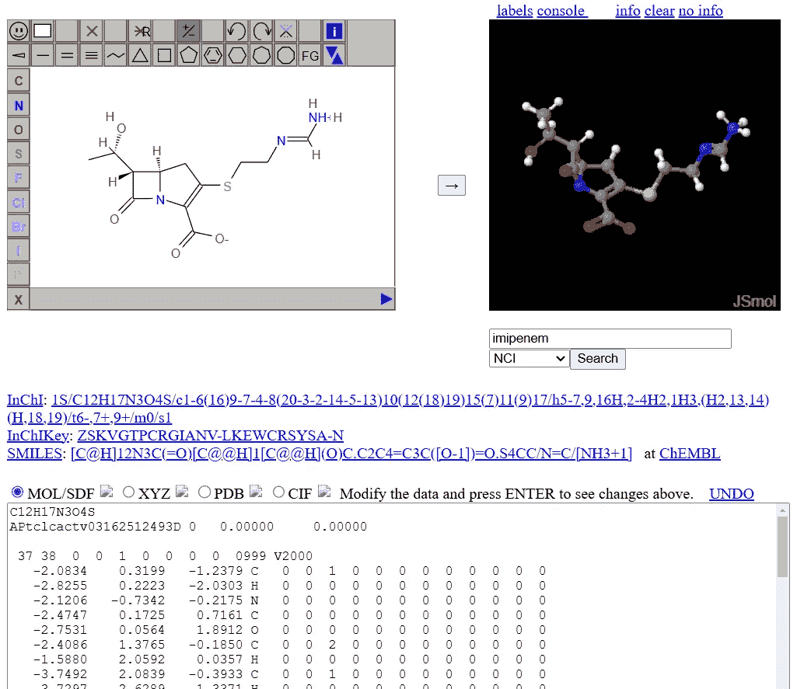

然后提出了这个问题：

> 我正在尝试使用这个工具绘制并点击右边的箭头来构建一个小分子，但我并不完全清楚正在生成什么……你能解释一下吗？

这是答案：

> 是的！当你绘制你的小分子并点击箭头时，会生成几个东西：
> 
> **2D 结构（左侧面板）**
> 
> 这是你绘制的分子在**2D**中的样子，使用标准的化学符号。
> 
> **3D 结构（右侧面板 — JSmol 查看器）**
> 
> 这是从你的 2D 绘制生成的**3D 分子模型**。
> 
> 它为你提供了分子的空间表示。
> 
> **分子标识符（2D 编辑器下方）**
> 
> **InChI（IUPAC 国际化学标识符）**：分子结构的文本表示。
> 
> **InChIKey**：InChI 的散列、固定长度版本，用于搜索数据库。
> 
> **SMILES（简化分子输入行系统）**：分子的紧凑字符串表示。
> 
> **结构数据（底部文本框）**
> 
> 你看到的数据是**MOL/SDF 格式**，其中包含原子的坐标、键合信息以及关于分子的元数据。
> 
> 其他可用的格式包括**XYZ、PDB 和 CIF**，这些对于计算化学和分子建模很有用。
> 
> 你可以用这个做什么？
> 
> 如果你想要**模拟分子或使用它像 AlphaFold 3 这样的软件**，你应该**以 SDF 或 PDB 格式导出结构**。
> 
> 如果你想要**在线搜索分子**，使用**InChIKey 或 SMILES**。

### 使用 GPT-4o 和视觉来帮助理解 AlphaFold 模型

在下一个例子中，我测试了 GPT-4o 理解由 AlphaFold（在这种情况下是 AlphaFold 2，用于构建 AlphaFold-EBI 数据库的模型）产生的蛋白质结构模型的能力。顺便说一句，如果你对 AlphaFold 一无所知，可以查看这些帖子：

[`medium.com/advances-in-biological-science/alphafold-3s-advances-and-limitations-in-a-nutshell-5ae0cdd814ea`](https://medium.com/advances-in-biological-science/alphafold-3s-advances-and-limitations-in-a-nutshell-5ae0cdd814ea)

[`lucianosphere.medium.com/guide-to-my-blog-articles-on-alphafold-39c10a7dad7f`](https://lucianosphere.medium.com/guide-to-my-blog-articles-on-alphafold-39c10a7dad7f)

众所周知，AlphaFold 2 和 3 系统革命性地改变了建模；然而，当然它们并不是完美的。为了帮助用户理解在结构模型中什么可能是正确的和错误的，AlphaFold 不仅返回构成结构模型的原子坐标，还返回质量指标，其中最重要的指标是残基级别的 pLDDTs 和残基间的 PAEs。我们在这里测试了在 AF-EBI 数据库中预先计算的这个 Uniprot 条目上的**[GPT-4o 具有视觉能力](https://alphafold.ebi.ac.uk/entry/Q12XU1)**：

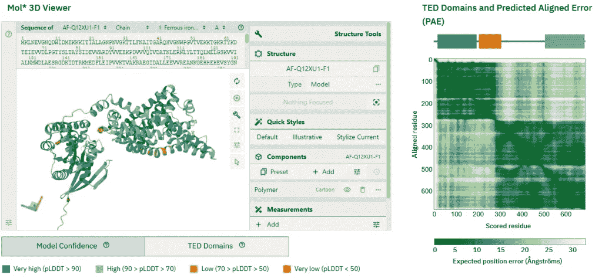

提示文本部分如下：

> 你是生物信息学专家。我在检查 AF-EBI 蛋白质结构模型数据库中的一个条目，我得到了附图中显示的内容。你怎么看？模型好吗？我特别感兴趣的是两个域的相对取向，但我不确定从 PAE 图中能得出什么结论……

这就是答案：

> 从你的截图，我们可以根据**pLDDT 置信分数**和**预测对齐误差（PAE）图**分析模型的质量：
> 
> **模型置信度（pLDDT）**
> 
> **Mol** 3D 查看器根据置信度分数着色模型。
> 
> 大部分结构被着色为**蓝色（高到非常高置信度，pLDDT > 70–90）**，这表明单个域被很好地预测。
> 
> 然而，一些**环和末端（橙色/红色，pLDDT < 50–70）**的置信度较低，这在灵活区域是预期的。
> 
> **PAE 图分析（域取向）**
> 
> PAE 图（右侧面板）显示了不同残基相对位置预测的准确性。
> 
> **低 PAE（深绿色）**意味着两个残基之间的相对位置定义明确。
> 
> **高 PAE（较浅的绿色/白色区域）**表明相对位置的不确定性。
> 
> **解释 PAE**
> 
> 对角线（自我对齐）总是定义明确的。
> 
> PAE 图中的块状结构表明存在**两个或更多定义明确的域**，且内部置信度较高。
> 
> 然而，**块之间的较浅绿色区域表明这些域的相对取向存在不确定性**。
> 
> 如果你对域的相对取向感兴趣，这表明**模型在该方面可能不可靠**——它可能有多种可能的构象。
> 
> **结论**
> 
> **单个域建模良好**，但它们的**相对取向可能不确定**。
> 
> 如果功能相关，你可能需要考虑**实验验证（例如，冷冻电镜、SAXS 或 NMR）**或**分子动力学模拟**来探索域的灵活性。
> 
> 如果你需要一个更刚性的结构，你可以寻找**同源实验结构**或使用**AlphaFold-Multimer**，如果链之间的相互作用很重要。

答案相当整洁且正确。然而，我们意识到我们可能通过谈论两个域而混淆了模型，而截图实际上显示了三个。然后我们提出了一个后续问题：

> 现在仔细检查，我发现 TED 域显示有 3 个域……我是正确的吗？根据 PAE 图，前两个域的排列是可信的，但与第三个域的相对排列则不太确定？

根据对 PAE 图的检查，现在考虑到确实有 3 个域，前两个域相对于彼此被自信地建模，第三个域仅局部自信地建模，答案是再次完美：

> 是的，你的解释是正确的！**TED 域注释**表明，该模型有**三个域**，如 PAE 图顶部的彩色编码部分所示。
> 
> 看一下**PAE 图**：
> 
> **前两个区域**（绿色和橙色部分）之间的**PAE 值较低**（矩阵左上角较深的绿色）。这表明它们的**相对取向是明确且自信的**。
> 
> 然而，**第三个区域**（紫色部分）相对于前两个区域显示出**较高的 PAE 值**（矩阵右下角较浅的绿色/白色区域）。这意味着**第三个区域的相对位置是不确定的**——它可能采取多种构象。
> 
> **这对你的分析意味着什么**
> 
> **第一个和第二个区域可能形成一个刚性的单元**，具有稳定的相互作用。
> 
> **第三个区域相对于前两个区域可能更加灵活**，可能在溶液中独立移动或受到较少的限制。
> 
> 如果这种灵活性在功能上很重要（例如，对于配体结合、蛋白质-蛋白质相互作用或构象转换），则实验验证（如 SAXS、冷冻电镜或 FRET）可能很有用。

### 蛋白质-配体复合物的视觉分析

最后，我准备挑战 GPT-4o 一个更难的问题。给定一个分子图形程序显示的配体结合到蛋白质的 2D 快照，它能否推断出两种分子建立了哪些类型的接触？

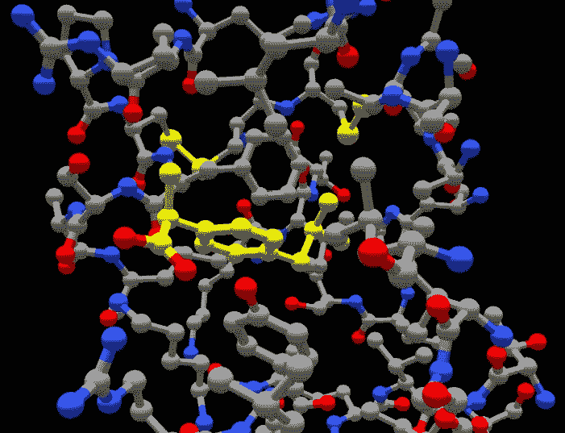

问题是：

> 这是一张布洛芬在 BSA 口袋内对接的截图。你看到了配体和蛋白质之间的哪些相互作用？我希望你告诉我你在提供的截图结构中看到的精确相互作用。

这就是答案：

> 从你提供的截图，我可以直观地推断潜在的相互作用，但没有残基标签或精确的原子距离测量，我只能做出有根据的观察。以下是我**具体看到**的：
> 
> **1. 疏水相互作用：**
> 
> 布洛芬（用黄色突出显示）嵌入到蛋白质的**疏水口袋**中。
> 
> 它似乎被氨基酸侧链的**灰色碳原子**所包围，很可能是疏水性残基（例如，亮氨酸、缬氨酸、苯丙氨酸或异亮氨酸）。
> 
> **布洛芬的苯环**似乎与其他**芳香族或脂肪族侧链**紧密接触，表明**π-π堆积或范德华相互作用**。
> 
> **2. 氢键：**
> 
> **布洛芬的羧基（-COOH）组**似乎与蛋白质附近的**蓝色（氮）或红色（氧）原子**相互作用。
> 
> 羧基氧原子与蛋白质残基之间至少有一个**紧密接触**，很可能会与骨架酰胺或侧链羟基（例如，丝氨酸、苏氨酸、酪氨酸、天冬氨酸或谷氨酸）形成氢键。
> 
> **3. 可能的静电相互作用：**
> 
> 在生理 pH 值下，布洛芬带**负电荷**（羧酸根阴离子，-COO⁻）。
> 
> 如果附近有一个带正电荷的残基（例如，精氨酸、赖氨酸或组氨酸），则可能存在**盐桥**或**离子-偶极相互作用**，但我无法仅凭图片确认确切的残基。
> 
> **仅从截图无法确定的内容：**
> 
> **精确的相互作用残基**：没有可见的残基标签。
> 
> **精确的相互作用距离**：氢键和静电相互作用通常需要精确的原子距离（约 2-3 Å）。
> 
> **相互作用强度**：需要分子建模软件来确认相互作用能量。

答案相当不错，尤其是考虑到图片只是一个静态的 2D 视图，而且原子相当拥挤。事实上，它正确地指出了布洛芬以黄色显示，并突出了其芳香环周围的疏水性和芳香性接触，这两者确实发生了（如图下方的#1 所示），并从其羧酸基团到附近的 N 和 O 原子的氢键（如图下方的#2 所示），还补充说，也可能存在一个盐桥，连接到同一羧酸和蛋白质中的一些带正电荷的基团，但它无法清楚地分辨（#3）。

为了您的参考，我在下一张图中展示了这些相互作用，编号为 1、2 和 3，正如它们所提到的：

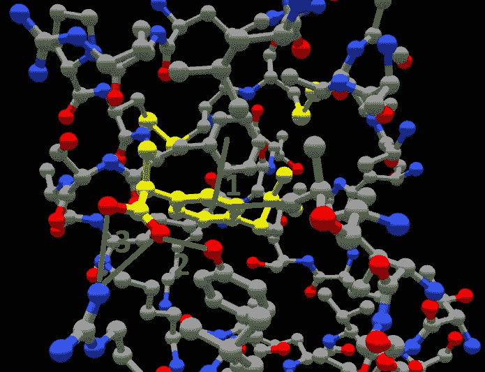

* * *

## 其他具有视觉能力的模型？一瞥谷歌的 Gemini 2.0 Flash

OpenAI 可能是基于 LLM 的 AI 系统最著名的开发者，但当然不是唯一的，而且他们的模型在某些目标和某些评估中甚至不是最好的。然而，它们对我来说至少是最容易使用的，无论是直接在 GUI（ChatGPT）中，还是通过编程（正如我们在这里看到的那样，我在许多其他帖子中也展示了）。

但我的观点是，我们不能忽视其他模型。就在准备这篇帖子的时候，我决定尝试使用谷歌的 AI 工作室的 Gemini 2.0 Flash，它像 GPT-4o 一样具有图片、音频和文档处理能力——甚至视频！

我再次感到惊讶，事实上，它似乎在整个帖子中表现略好于 GPT-4o 和 GPT-4o-mini。我特别惊讶于这个具体的例子，我加载了上面显示的我的应用程序的截图，Gemini 回复了（没有任何提示）：

> 根据您提供的图片，我可以推断出以下内容：
> 
> **提示**：“你认为艺术家”
> 
> **分析**：
> 
> 图片底部的响应声明“艺术家可能意图通过红色罂粟花在郁郁葱葱的绿色背景中的鲜明图像来传达自然、美丽和生机勃勃的主题。”
> 
> 实际上，AI 正在识别主题内容，并解释艺术家的意图是展示自然之美和生机勃勃。

这与 GPT-4o 的回答有些相似，可能是因为它只是读取了 GPT-4o 自己写的内容。但如果我们提出一个问题，试图解决与 GPT-4o 提出的问题相同的问题呢？

下面开始：

> 对这幅画进行你自己的解读…你认为作者想要传达什么？

这就是 Gemini 的回复，现在完美地反映了我认为作者想要传达的内容：

> 好的，根据图片，这是我对作者可能意图的解释：
> 
> 除了表面的美，这幅图像暗示了对自然界中色彩和谐与对比的更复杂探索。
> 
> **自然罂粟花田与色彩轮并置暗示了一种故意的艺术声明。**艺术家可能是在邀请我们分析自然场景中存在的颜色（以绿色和红色为主），并理解这些颜色如何相互作用并创造特定的视觉体验。
> 
> **色彩轮的位置以及箭头指向绿色和红色暗示了互补色。**
> 
> **也许作者希望我们欣赏自然界提供的固有色彩调色板。**
> 
> 简而言之，虽然表面阅读是关于美的，但色彩轮的整合暗示了对色彩在自然界应用的科学和理论有更深的兴趣。作者似乎在邀请我们以一种更分析和更了解的方式来欣赏我们所看到的美丽。

Gemini 的回复的关键部分，GPT-4o 在我的任何测试中都没有得到，是这样的：

“色彩轮的位置以及箭头指向绿色和红色暗示了互补色。”

这正是我作为一个艺术家的观点！

如果这篇帖子受到好评，我将更详细地测试 Gemini 2.0 的各种功能。所以请在评论中告诉我你的想法！

## 结论

我想，在阅读了所有这些例子之后，你现在也赞赏了多模态、具备视觉能力的 AI 系统的潜力。我展示的 GPT-4o 模型测试（以及 Gemini 2.0 的预览）证明了最现代的 AI 系统能够解释相当复杂的图像，能够从照片、各种科学图表、图表和图表中理解并提取信息，即使这些信息像分子结构一样复杂。从这些例子中，我们可以推广出各种应用，如协助数据分析、协助驾驶和机器人控制——所有这些都需要克服一些问题。

这是因为有些图像和问题相当具有挑战性。在某些情况下，例如当密集图表的标签分辨率有限时，或者当分子结构的扁平截图缺乏 3D 视角时，或者当需要估计机械臂的旋转角度时，可能没有太多事情可做，模型仍然像该领域最专业的专家一样有限。

是的，总体来说，在适当的提示和人工智能的持续进步下，这些模型可能成为加速数据解释和决策的宝贵工具，减轻人类专家的负担，他们可以致力于更复杂的问题，而软件则帮助非专家解释软件的图形输出，谁知道呢，也许有一天还能驾驶汽车和控制机器人！

* * *

[*www.lucianoabriata.com*](https://www.lucianoabriata.com/)* 我在我的广泛兴趣范围内写关于所有事情：自然、科学、技术、编程等。*[*订阅以获取我的新故事*](https://lucianosphere.medium.com/subscribe)*通过电子邮件。关于小型工作咨询，请查看我的[*服务页面*](https://lucianoabriata.altervista.org/services/index.html)。您可以[*在这里联系我*](https://lucianoabriata.altervista.org/office/contact.html)。您还可以[*在这里给我小费*](https://paypal.me/LAbriata).*.*
