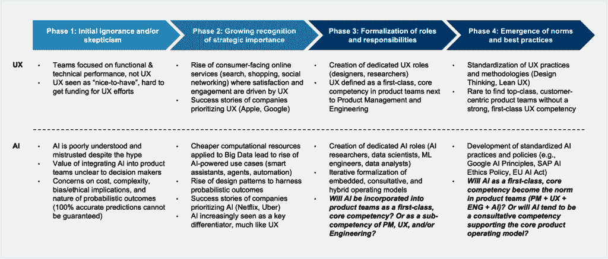
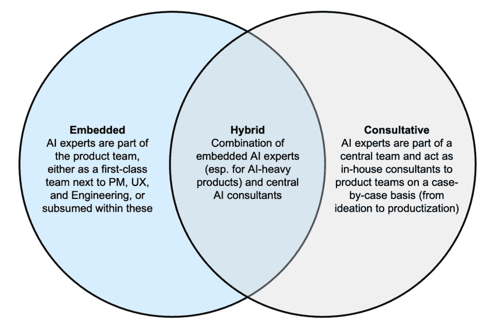

# 人工智能时代的产品运营模式演变

> [`towardsdatascience.com/evolving-product-operating-models-in-the-age-of-ai/`](https://towardsdatascience.com/evolving-product-operating-models-in-the-age-of-ai/)

<mdspan datatext="el1742606224878" class="mdspan-comment">在之前关于为人工智能组织的一篇文章中([link](https://medium.com/data-science/organizing-for-ai-b8d6094b6d03))，我们探讨了三个关键维度——成果所有权、人员外包和团队成员的地理邻近性——之间的相互作用如何产生各种组织原型，以实施战略人工智能计划，每种原型都意味着产品运营模式的不同变化。

现在，我们更深入地探讨产品运营模式，特别是赋权产品团队的核心竞争力，如何演变以应对人工智能时代的新机遇和挑战。我们首先将当前的正统观念置于其历史背景中，并呈现一个过程模型，强调产品运营模式中团队构成演变的四个关键阶段。然后，我们考虑如何重塑团队，以成功创建未来的人工智能产品和服务。

**注意：** 下文中所有图表均由本文作者创建。

### 产品运营模式的演变

#### 当前正统观念和历史背景

产品教练如 Marty Cagan 在近年来为普及赋权产品团队的“3-in-a-box”模型做出了很多贡献。一般来说，根据当前的正统观念，这些团队应由三个一流的核心竞争力组成：产品管理、产品设计和技术工程。*一流*意味着这些竞争力在组织结构图上不相互隶属，产品经理、设计负责人和技术负责人有权共同做出战略性的产品相关决策。*核心*反映了这样的信念，即移除或以其他方式削弱这三种竞争力中的任何一种都可能导致产品结果更差，即产品无法满足客户或企业的需求。

当前正统观念的一个核心信念是，3 盒模型有助于在四个关键领域解决产品风险：价值、可行性、可用性和可行性。产品管理负责整体结果，并特别关注确保产品对客户*有价值*（通常意味着更高的支付意愿）并且对业务*可行*，例如，从长远来看，在构建、运营和维护产品方面的成本。产品设计负责用户体验（UX），主要关注最大化产品的*可用性*，例如，通过直观的入门、良好的可用性利用和令人愉悦的用户界面（UI），允许高效工作。最后，工程负责技术交付，主要专注于确保产品的*可行性*，例如，在特定技术约束下能够交付 AI 用例，确保足够的预测性能、推理速度和安全。

然而，达到这个 3 盒模型并非易事，并且该模型在技术公司之外尚未得到广泛应用。在早期，产品团队——如果可以称之为团队的话——主要由开发者组成，他们通常负责编码和从销售团队或其他内部业务利益相关者那里收集需求。这样的产品团队会专注于功能交付，而不是用户体验或战略产品开发；因此，今天的这类团队通常被称为“功能团队”。电视剧《Halt and Catch Fire》生动地描绘了 20 世纪 80 年代和 90 年代科技公司如何组织。像《The IT Crowd》这样的节目强调了这样的弱势团队如何在现代 IT 部门中持续存在。

随着软件项目在 1990 年代末和 2000 年代初的复杂性增加，需要一个专门的产品管理能力来使产品开发与业务目标和客户需求保持一致的需求变得越来越明显。像微软和 IBM 这样的公司开始正式化产品经理的角色，其他公司也很快效仿。到了 2000 年代，随着各种面向在线消费者的服务的出现（例如，搜索、购物和社交网络），设计/UX 成为了一个优先事项。像苹果和谷歌这样的公司开始强调设计，导致相应角色的正式化。设计师开始与开发者紧密合作，确保产品不仅功能性强，而且视觉上吸引人，用户友好。自 2010 年代以来，敏捷和精益方法的广泛应用进一步强化了对能够快速迭代并响应用户反馈的跨职能团队的需求，所有这些都为当前的 3 盒正统观念铺平了道路。

#### 产品运营模式演变的流程框架

从 2025 年的视角向前看 5-10 年，有趣的是考虑人工智能作为“基本技能”的出现可能会如何颠覆当前的教条，可能触发产品运营模式演化的下一步。下图的图 1 提出了一种四阶段过程框架，展示了现有产品模型如何随着时间的推移逐步融入人工智能能力，借鉴了几年前设计/UX 所面临的情况的有益类比。请注意，虽然有些滥用术语的风险，但符合今天的行业规范，以下将“UX”和“设计”这两个术语互换使用，以指代关注最小化可用性风险的竞争力。

图 1：进化过程框架

上图框架中的第一阶段以无知和/或怀疑为特征。用户体验（UX）最初面临着在那些以前主要关注功能和性能的公司中证明其价值的挑战，如在面向非消费者企业的软件（例如 20 世纪 90 年代的 ERP 系统）的背景下。今天的人工智能也面临着类似的艰难挑战。不仅许多利益相关者一开始就对人工智能缺乏了解，而且那些在早期人工智能探索中受到伤害的公司现在可能正陷入“幻灭的低谷”，导致对人工智能的怀疑和观望态度。还可能存在关于收集行为数据、算法决策、偏见以及应对概率人工智能输出的本质不确定性（例如，考虑对软件测试的影响）的担忧。

第二阶段以对新的竞争力战略重要性的日益认识为标志。对于 UX 来说，这一阶段是由面向消费者的在线服务的兴起所推动的，UX 的改进可以显著推动参与度和货币化。随着像苹果和谷歌这样的公司成功故事的传播，优先考虑 UX 的战略价值变得越来越难以忽视。在过去十年中，一些关键趋势的汇聚，如通过超大规模计算（例如 AWS、GCP、Azure）获得更便宜的计算能力、在各个领域访问大数据以及开发强大的新机器学习算法，到 ChatGPT 突然出现并吸引所有人的注意时，我们对人工智能潜力的集体认识一直在稳步增长。利用概率结果的设计模式的兴起以及人工智能驱动公司的相关成功故事（例如 Netflix、Uber）意味着人工智能现在越来越多地被视为一个关键的区别因素，就像之前的 UX 一样。

在第三阶段，与新的能力相关的角色和责任变得正式化。对于用户体验（UX）而言，这意味着区分设计师（涵盖体验、交互以及用户界面的外观和感觉）和研究人员的角色（专注于获取对用户偏好和行为模式更深入理解的定性和定量方法）。为了消除对 UX 价值的任何怀疑，它被提升为一流的、核心能力，与产品管理和工程并列，形成了当前标准产品运营模式的三位一体。过去几年见证了与 AI 相关的角色日益正式化，超越了“数据科学家”这一全能概念，扩展到更专业化的角色，如“研究科学家”、“机器学习工程师”以及最近出现的“提示工程师”。展望未来，一个引人入胜的开放问题是 AI 能力将如何融入当前的三合一模式。我们可能会看到嵌入式、咨询式和混合模式的迭代正式化，正如下一节所讨论的。

最后，第四阶段见证了有效利用新能力所形成的规范和最佳实践的兴起。对于用户体验（UX）而言，这体现在今天对设计思维和精益 UX 等实践的采用。现在，很难找到没有强大、一流 UX 能力的顶级、以客户为中心的产品团队。同时，近年来，人们共同努力制定标准化的 AI 实践和政策（例如，谷歌的 AI 原则、SAP 的 AI 伦理政策以及欧盟的 AI 法案），部分是为了应对 AI 已经带来的危险，部分是为了防止 AI 未来可能带来的危险（尤其是随着 AI 变得更加强大，并被不良行为者用于邪恶目的）。AI 作为能力规范化的程度可能对当前三合一产品运营模式的正统框架产生何种影响，还有待观察。

### 向 AI 就绪产品运营模式迈进

#### 利用 AI 专业知识：嵌入式、咨询式和混合模式

下图 2 提出了一种高级框架，用于思考如何将 AI 能力融入当今的正统、三合一产品运营模式中。

图 2：AI 就绪产品运营模式的选项

在嵌入式模型中，人工智能（由数据科学家、机器学习工程师等代表）可以作为一个新的、持久的、一等的能力，与产品管理、用户体验/设计和工程并列，或者作为一个从属的能力，隶属于这些“三大”（例如，在工程团队中配备数据科学家）。相比之下，在咨询模型中，人工智能能力可能存在于某个中央实体，例如卓越中心（CoE），并且根据具体情况由产品团队利用。例如，CoE 的 AI 专家可能会临时被引入，在产品发现和/或交付期间就 AI 特定问题向产品团队提供建议。在混合模型中，正如其名称所暗示的，一些 AI 专家可能作为产品团队的长期成员嵌入其中，而其他人可能会在必要时被引入，以提供额外的咨询指导。虽然图 2 仅说明了单个产品团队的情况，但可以想象这些模型选项可以扩展到多个产品团队，捕捉不同团队之间的互动。例如，“体验团队”（负责构建面向客户的产品）可能会与“平台团队”（维护体验团队可以利用的 AI 服务/API）紧密合作，向客户交付 AI 产品。

利用人工智能的上述每种模型都伴随着一定的优缺点。嵌入式模型可以促进更紧密的合作、更多的一致性和更快的决策。核心团队中拥有 AI 专家可以导致更无缝的集成和协作；他们持续的参与确保了 AI 相关的输入，无论是概念性的还是实施导向的，可以在产品发现和交付的各个阶段一致地整合。直接访问 AI 专业知识可以加快问题解决和决策。然而，将 AI 专家嵌入到每个产品团队中可能过于昂贵且难以证明，尤其是对于无法明确和有说服力地阐述预期 AI 投资回报的预期回报的论点的公司或特定团队。作为一种稀缺资源，AI 专家可能只能提供给能够提出足够强大商业案例的一小部分团队，或者被分散到多个团队中，导致不良后果（例如，任务周转速度减慢和员工流失）。

在咨询模型中，在中央团队中配备 AI 专家可能更具成本效益。中央专家可以更灵活地分配到项目中，从而提高每位专家的利用率。同时，一位高度专业化的专家（例如，专注于大型语言模型、AI 生命周期管理等）可以同时向多个产品团队提供建议。然而，纯粹咨询模型可能会使产品团队依赖于团队外的同事；这些 AI 顾问可能并不总是能在需要时提供帮助，并且可能在某个时刻跳槽到另一家公司，使产品团队陷入困境。定期将新的 AI 顾问纳入产品团队既耗时又费力，而且这些顾问，尤其是如果他们是初级或新加入公司，可能觉得即使这样做可能是必要的（例如，警告有关数据相关的偏差、隐私问题或次优架构决策），也可能无法挑战产品团队。

混合模型旨在平衡纯粹嵌入式模型和纯粹咨询模型之间的权衡。该模型可以在组织上作为一个中心辐射结构来促进中心（核心团队）和辐射（嵌入式专家）之间的定期知识共享和对齐。为产品团队提供访问嵌入式和咨询 AI 专家的权限可以提供一致性和灵活性。嵌入式 AI 专家可以开发特定领域的专业知识，这有助于特征工程和模型性能诊断，而专门的 AI 顾问可以就更广泛、最先进的技术和最佳实践向嵌入式专家提供建议和提升技能。然而，混合模型的管理更为复杂。必须仔细划分嵌入式和咨询 AI 专家之间的任务，以避免重复工作、延误和冲突。监督嵌入式和咨询专家之间的对齐可能会产生额外的管理负担，这可能需要产品经理、设计负责人和工程负责人以不同程度的承担。

#### 边界条件和路径依赖的影响

除了考虑图 2 中展示的模型选项的优缺点外，产品团队还应在决定如何融入 AI 能力时考虑边界条件和路径依赖。

边界条件是指塑造团队必须运营的环境的约束。这些条件可能涉及诸如组织结构（包括公司内部和团队中的报告线、非正式等级和决策流程）、资源可用性（就预算、人员和工具而言）、监管和合规相关要求（例如，法律和/或行业特定法规）以及市场动态（涵盖竞争格局、客户期望和市场趋势）等方面。路径依赖是指历史决策如何影响当前和未来的决策；它强调了过去事件在塑造组织未来轨迹中的重要性。导致此类依赖的关键方面包括历史实践（例如，既定惯例和流程）、过去投资（例如，在基础设施、技术和人力资本方面的投资，可能导致由于沉没成本谬误而导致的团队和决策者的潜在非理性决策）以及组织文化（涵盖随着时间的推移而形成的共享价值观、信念和行为）。

边界条件在配置运营模式时可能会限制产品团队的选择；一些期望的选择可能无法实现（例如，预算限制可能阻止为具有特定专业化的嵌入式 AI 专家配备人员）。路径依赖可能导致一种不利类型的惯性，即团队即使存在更好的替代方案，也会继续遵循既定的流程和方法。这可能会使得采用需要重大改变现有实践的新的运营模式变得具有挑战性。绕过路径依赖的一种方法是允许不同的产品团队根据各自的具体需求以不同的速度发展其各自的运营模式；一个正在构建以 AI 为核心产品的团队可能会选择比探索 AI 潜在用例的团队更早地投资嵌入式 AI 专家。

最后，值得记住的是，选择产品运营模式可能会对产品的设计本身产生深远的影响。[康威定律](https://martinfowler.com/bliki/ConwaysLaw.html) 指出，“任何设计系统（广义上）的组织都会产生一个结构，其结构与组织的沟通结构相匹配。” 在我们的语境中，这意味着产品团队的组织方式、沟通方式以及整合人工智能能力的方式可以直接影响他们所创造的产品和服务的架构。例如，咨询模型可能更可能导致使用通用的 AI API（顾问可以在团队间重复使用），而嵌入式 AI 专家可能更有条件实现由领域知识辅助的产品特定优化（尽管这可能会增加与产品架构其他组件的耦合）。因此，公司和团队应该被赋予配置他们的人工智能准备产品运营模式的权力，同时充分考虑其更广泛、长期的影响。
