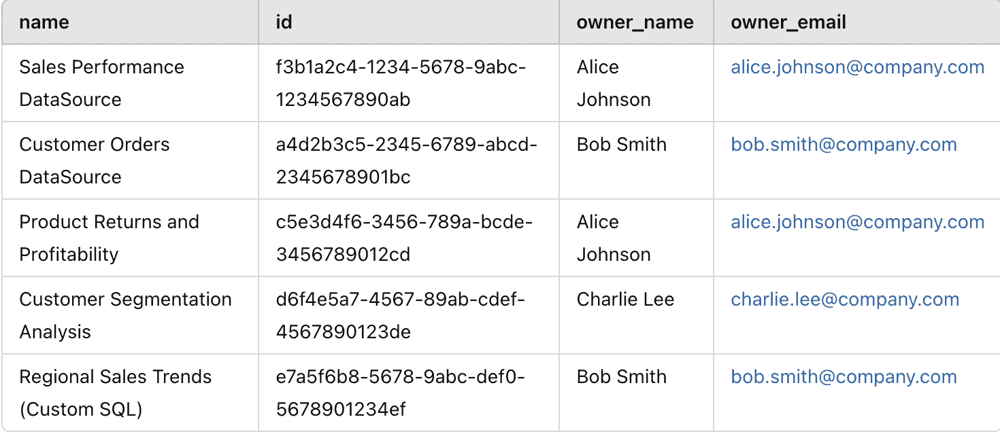
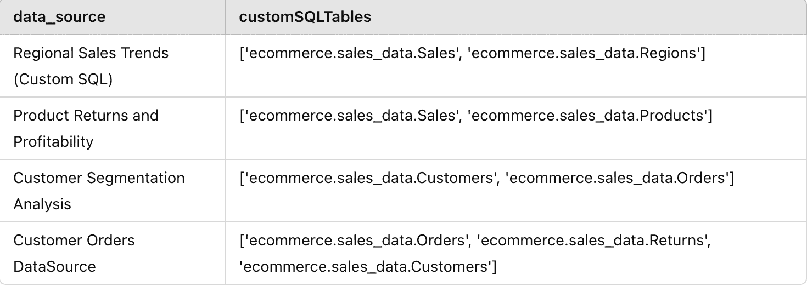
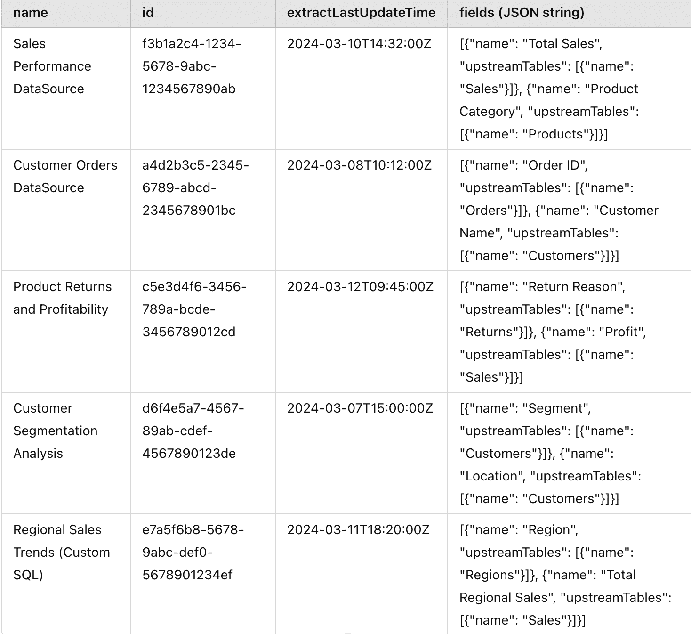
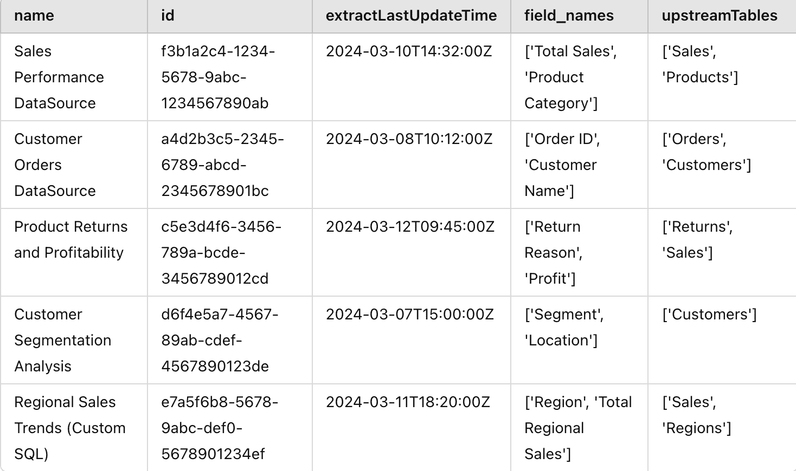
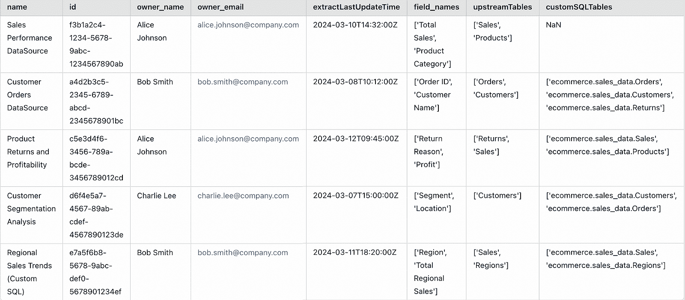
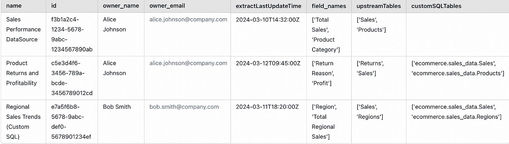

# 没有更多的 Tableau 停机时间：元数据 API 用于主动数据健康

> [原文链接](https://towardsdatascience.com/no-more-tableau-downtime-metadata-api-for-proactive-data-health/)

在当今世界，数据解决方案的**可靠性**至关重要。当我们构建仪表板和报告时，人们期望那里反映的数字是正确且最新的。基于这些数字，我们可以得出见解并采取行动。如果由于任何不可预见的原因，仪表板损坏或数字不正确——那么修复一切就会变成一场**灭火战**。如果问题没有及时解决，那么就会损害对数据团队及其解决方案的信任。

但为什么仪表板会损坏或出现错误的数据？如果仪表板第一次构建正确，那么 99% 的问题都来自为仪表板提供数据的来源——数据仓库。一些可能的场景包括：

+   一些 ETL 管道失败了，所以新的数据还没有进来

+   一个表被另一个新的表所取代

+   表中的一些列被删除或重命名了

+   数据仓库中的模式已经改变

+   以及更多。

仍然有可能问题是出在 Tableau 网站上，但根据我的经验，大多数情况下，问题总是由于数据仓库中的一些变化引起的。即使我们知道根本原因，开始修复工作也不总是那么直接。没有一个中心位置可以检查哪些 Tableau 数据源依赖于特定的表。如果你有 Tableau 数据管理附加组件，它可能有所帮助，但据我所知，很难找到数据源中使用的自定义 SQL 查询的依赖关系。

然而，这个附加组件太贵了，大多数公司都没有。真正的痛苦开始于你必须手动检查所有数据源以开始修复它们。更糟糕的是，你头上有一群用户，他们不耐烦地等待着快速修复。修复本身可能并不困难，但会非常耗时。

如果我们能够在任何人注意到问题之前**预测这些问题**并**识别受影响的数据源**，那岂不是很好？现在，有了 Tableau [元数据 API](https://help.tableau.com/current/api/metadata_api/en-us/index.html)，就可以做到这一点。元数据 API 使用 GraphQL，这是一种仅返回您感兴趣数据的 API 查询语言。有关 GraphQL 的更多信息，请查看 [GraphQL.org](https://graphql.org/)。

在这篇博客文章中，我将向您展示如何使用 Python 的 Tableau Server Client（**TSC**）库连接到 **Tableau 元数据 API**，以主动识别使用特定表的 data sources，这样您就可以在出现任何问题之前迅速采取行动。一旦你知道哪些 Tableau 数据源受到特定表的影响，你就可以自己进行一些更新，或者提醒那些数据源的所有者即将到来的变化，以便他们可以为此做好准备。

#### 连接到 Tableau 元数据 API

让我们使用 TSC 连接到 Tableau Server。我们需要导入进行练习所需的所有库！

```py
### Import all required libraries
import tableauserverclient as t
import pandas as pd
import json
import ast
import re
```

为了连接到元数据 API，你首先需要在 Tableau 账户设置中创建一个个人访问令牌。然后使用你刚刚创建的令牌更新`<API_TOKEN_NAME>`和`<TOKEN_KEY>`。同时更新`<YOUR_SITE>`为你的 Tableau 站点。如果连接成功建立，那么“Connected”将会在输出窗口中打印出来。

```py
### Connect to Tableau server using personal access token
tableau_auth = t.PersonalAccessTokenAuth("<API_TOKEN_NAME>", "<TOKEN_KEY>", 
                                           site_id="<YOUR_SITE>")
server = t.Server("https://dub01.online.tableau.com/", use_server_version=True)

with server.auth.sign_in(tableau_auth):
        print("Connected")
```

现在我们来获取所有发布在你站点上的数据源的列表。你可以获取许多属性，但就当前用例而言，让我们保持简单，只获取每个数据源的 id、名称和所有者联系信息。这将是我们主列表，我们将向其中添加所有其他信息。

```py
############### Get all the list of data sources on your Site

all_datasources_query = """ {
  publishedDatasources {
    name
    id
    owner {
    name
    email
    }
  }
}"""
with server.auth.sign_in(tableau_auth):
    result = server.metadata.query(
        all_datasources_query
    )
```

由于我想让这个博客专注于如何积极识别哪些数据源受到特定表的影响，所以不会深入探讨元数据 API 的细微差别。为了更好地理解查询的工作原理，你可以参考非常详细的 Tableau 自己的[元数据 API 文档](https://help.tableau.com/current/api/metadata_api/en-us/docs/meta_api_model.html)。

需要注意的一点是，元数据 API 以 JSON 格式返回数据。根据你查询的内容，你最终会得到多个嵌套的 JSON 列表，将其转换为 pandas dataframe 可能会变得非常复杂。对于上述元数据查询，你最终会得到一个如下所示的结果（这只是一个模拟数据，只是为了给你一个输出外观的印象）：

```py
{
  "data": {
    "publishedDatasources": [
      {
        "name": "Sales Performance DataSource",
        "id": "f3b1a2c4-1234-5678-9abc-1234567890ab",
        "owner": {
          "name": "Alice Johnson",
          "email": "[[email protected]](/cdn-cgi/l/email-protection)"
        }
      },
      {
        "name": "Customer Orders DataSource",
        "id": "a4d2b3c5-2345-6789-abcd-2345678901bc",
        "owner": {
          "name": "Bob Smith",
          "email": "[[email protected]](/cdn-cgi/l/email-protection)"
        }
      },
      {
        "name": "Product Returns and Profitability",
        "id": "c5e3d4f6-3456-789a-bcde-3456789012cd",
        "owner": {
          "name": "Alice Johnson",
          "email": "[[email protected]](/cdn-cgi/l/email-protection)"
        }
      },
      {
        "name": "Customer Segmentation Analysis",
        "id": "d6f4e5a7-4567-89ab-cdef-4567890123de",
        "owner": {
          "name": "Charlie Lee",
          "email": "[[email protected]](/cdn-cgi/l/email-protection)"
        }
      },
      {
        "name": "Regional Sales Trends (Custom SQL)",
        "id": "e7a5f6b8-5678-9abc-def0-5678901234ef",
        "owner": {
          "name": "Bob Smith",
          "email": "[[email protected]](/cdn-cgi/l/email-protection)"
        }
      }
    ]
  }
}
```

我们需要将这个 JSON 响应转换为 dataframe，这样更容易处理。注意，我们需要从所有者对象中提取所有者的名称和电子邮件。

```py
### We need to convert the response into dataframe for easy data manipulation

col_names = result['data']['publishedDatasources'][0].keys()
master_df = pd.DataFrame(columns=col_names)

for i in result['data']['publishedDatasources']:
    tmp_dt = {k:v for k,v in i.items()}
    master_df = pd.concat([master_df, pd.DataFrame.from_dict(tmp_dt, orient='index').T])

# Extract the owner name and email from the owner object
master_df['owner_name'] = master_df['owner'].apply(lambda x: x.get('name') if isinstance(x, dict) else None)
master_df['owner_email'] = master_df['owner'].apply(lambda x: x.get('email') if isinstance(x, dict) else None)

master_df.reset_index(inplace=True)
master_df.drop(['index','owner'], axis=1, inplace=True)
print('There are ', master_df.shape[0] , ' datasources in your site')
```

这就是`master_df`的结构看起来会是什么样子：



代码的样本输出

一旦我们准备好了主列表，我们就可以开始获取数据源中嵌入的表名。如果你是 Tableau 的忠实用户，你知道在 Tableau 数据源中选择表有两种方式——一种是通过直接选择表并在它们之间建立关系，另一种是使用一个或多个表的定制 SQL 查询来生成一个新的结果表。因此，我们需要处理这两种情况。

#### 处理自定义 SQL 查询表

以下查询用于获取网站中使用的所有自定义 SQL 列表及其数据源。请注意，我已经过滤了列表，只获取了前 500 个自定义 SQL 查询。如果您的组织中还有更多，您将需要使用偏移量来获取下一组自定义 SQL 查询。当您想要获取大量结果时，也可以在分页中使用游标方法（请参阅[此处](https://help.tableau.com/current/api/metadata_api/en-us/docs/meta_api_examples.html)）。为了简化，我仅使用偏移量方法，因为我知道网站上使用的自定义 SQL 查询少于 500 个。

```py
# Get the data sources and the table names from all the custom sql queries used on your Site

custom_table_query = """  {
  customSQLTablesConnection(first: 500){
    nodes {
        id
        name
        downstreamDatasources {
        name
        }
        query
    }
  }
}
"""

with server.auth.sign_in(tableau_auth):
    custom_table_query_result = server.metadata.query(
        custom_table_query
    )
```

根据我们的模拟数据，输出将如下所示：

```py
{
  "data": {
    "customSQLTablesConnection": {
      "nodes": [
        {
          "id": "csql-1234",
          "name": "RegionalSales_CustomSQL",
          "downstreamDatasources": [
            {
              "name": "Regional Sales Trends (Custom SQL)"
            }
          ],
          "query": "SELECT r.region_name, SUM(s.sales_amount) AS total_sales FROM ecommerce.sales_data.Sales s JOIN ecommerce.sales_data.Regions r ON s.region_id = r.region_id GROUP BY r.region_name"
        },
        {
          "id": "csql-5678",
          "name": "ProfitabilityAnalysis_CustomSQL",
          "downstreamDatasources": [
            {
              "name": "Product Returns and Profitability"
            }
          ],
          "query": "SELECT p.product_category, SUM(s.profit) AS total_profit FROM ecommerce.sales_data.Sales s JOIN ecommerce.sales_data.Products p ON s.product_id = p.product_id GROUP BY p.product_category"
        },
        {
          "id": "csql-9101",
          "name": "CustomerSegmentation_CustomSQL",
          "downstreamDatasources": [
            {
              "name": "Customer Segmentation Analysis"
            }
          ],
          "query": "SELECT c.customer_id, c.location, COUNT(o.order_id) AS total_orders FROM ecommerce.sales_data.Customers c JOIN ecommerce.sales_data.Orders o ON c.customer_id = o.customer_id GROUP BY c.customer_id, c.location"
        },
        {
          "id": "csql-3141",
          "name": "CustomerOrders_CustomSQL",
          "downstreamDatasources": [
            {
              "name": "Customer Orders DataSource"
            }
          ],
          "query": "SELECT o.order_id, o.customer_id, o.order_date, o.sales_amount FROM ecommerce.sales_data.Orders o WHERE o.order_status = 'Completed'"
        },
        {
          "id": "csql-3142",
          "name": "CustomerProfiles_CustomSQL",
          "downstreamDatasources": [
            {
              "name": "Customer Orders DataSource"
            }
          ],
          "query": "SELECT c.customer_id, c.customer_name, c.segment, c.location FROM ecommerce.sales_data.Customers c WHERE c.active_flag = 1"
        },
        {
          "id": "csql-3143",
          "name": "CustomerReturns_CustomSQL",
          "downstreamDatasources": [
            {
              "name": "Customer Orders DataSource"
            }
          ],
          "query": "SELECT r.return_id, r.order_id, r.return_reason FROM ecommerce.sales_data.Returns r"
        }
      ]
    }
  }
}
```

就像之前创建数据源主列表时一样，这里也有嵌套的 JSON 用于下游数据源，其中我们需要提取其“name”部分。在“query”列中，整个自定义 SQL 都被输出。如果我们使用正则表达式模式，可以轻松搜索查询中使用的表名。

我们知道表名总是在 FROM 或 JOIN 子句之后，并且通常遵循 `<database_name>.<schema>.<table_name>` 的格式。`<database_name>` 是可选的，大多数情况下不使用。我发现了一些使用此格式的查询，结果我只得到了数据库和模式名称，而没有完整的表名。一旦我们提取了数据源和表名，我们需要合并每个数据源的行，因为单个数据源中可能使用了多个自定义 SQL 查询。

```py
### Convert the custom sql response into dataframe
col_names = custom_table_query_result['data']['customSQLTablesConnection']['nodes'][0].keys()
cs_df = pd.DataFrame(columns=col_names)

for i in custom_table_query_result['data']['customSQLTablesConnection']['nodes']:
    tmp_dt = {k:v for k,v in i.items()}

    cs_df = pd.concat([cs_df, pd.DataFrame.from_dict(tmp_dt, orient='index').T])

# Extract the data source name where the custom sql query was used
cs_df['data_source'] = cs_df.downstreamDatasources.apply(lambda x: x[0]['name'] if x and 'name' in x[0] else None)
cs_df.reset_index(inplace=True)
cs_df.drop(['index','downstreamDatasources'], axis=1,inplace=True)

### We need to extract the table names from the sql query. We know the table name comes after FROM or JOIN clause
# Note that the name of table can be of the format <data_warehouse>.<schema>.<table_name>
# Depending on the format of how table is called, you will have to modify the regex expression

def extract_tables(sql):
    # Regex to match database.schema.table or schema.table, avoid alias
    pattern = r'(?:FROM|JOIN)\s+((?:\[\w+\]|\w+)\.(?:\[\w+\]|\w+)(?:\.(?:\[\w+\]|\w+))?)\b'
    matches = re.findall(pattern, sql, re.IGNORECASE)
    return list(set(matches))  # Unique table names

cs_df['customSQLTables'] = cs_df['query'].apply(extract_tables)
cs_df = cs_df[['data_source','customSQLTables']]

# We need to merge datasources as there can be multiple custom sqls used in the same data source
cs_df = cs_df.groupby('data_source', as_index=False).agg({
    'customSQLTables': lambda x: list(set(item for sublist in x for item in sublist))  # Flatten & make unique
})

print('There are ', cs_df.shape[0], 'datasources with custom sqls used in it')
```

在执行所有上述操作后，`cs_df` 的结构将如下所示：



代码示例输出

#### 数据源中常规表的处理

现在我们需要获取在数据源中使用的所有常规表列表，这些表不是自定义 SQL 的一部分。有两种方法可以做到这一点。要么使用 `publishedDatasources` 对象并检查 `upstreamTables`，要么使用 `DatabaseTable` 并检查 `upstreamDatasources`。我将采用第一种方法，因为我想要在数据源级别得到结果（基本上，我想要一些代码，以便在我想进一步检查特定数据源时可以重用）。在这里，为了简化，我选择不使用分页，而是遍历每个数据源以确保一切就绪。我们在字段对象内部获取 `upstreamTables`，因此必须清理掉。

```py
############### Get the data sources with the regular table names used in your site

### Its best to extract the tables information for every data source and then merge the results.
# Since we only get the table information nested under fields, in case there are hundreds of fields 
# used in a single data source, we will hit the response limits and will not be able to retrieve all the data.

data_source_list = master_df.name.tolist()

col_names = ['name', 'id', 'extractLastUpdateTime', 'fields']
ds_df = pd.DataFrame(columns=col_names)

with server.auth.sign_in(tableau_auth):
    for ds_name in data_source_list:
        query = """ {
            publishedDatasources (filter: { name: \""""+ ds_name + """\" }) {
            name
            id
            extractLastUpdateTime
            fields {
                name
                upstreamTables {
                    name
                }
            }
            }
        } """
        ds_name_result = server.metadata.query(
        query
        )
        for i in ds_name_result['data']['publishedDatasources']:
            tmp_dt = {k:v for k,v in i.items() if k != 'fields'}
            tmp_dt['fields'] = json.dumps(i['fields'])
        ds_df = pd.concat([ds_df, pd.DataFrame.from_dict(tmp_dt, orient='index').T])

ds_df.reset_index(inplace=True)
```

`ds_df` 的结构如下所示：



代码示例输出

我们可能需要展开 `fields` 对象并提取字段名以及表名。由于表名会重复多次，因此我们必须去重，只保留唯一的名称。

```py
# Function to extract the values of fields and upstream tables in json lists
def extract_values(json_list, key):
    values = []
    for item in json_list:
        values.append(item[key])
    return values

ds_df["fields"] = ds_df["fields"].apply(ast.literal_eval)
ds_df['field_names'] = ds_df.apply(lambda x: extract_values(x['fields'],'name'), axis=1)
ds_df['upstreamTables'] = ds_df.apply(lambda x: extract_values(x['fields'],'upstreamTables'), axis=1)

# Function to extract the unique table names 
def extract_upstreamTable_values(table_list):
    values = set()a
    for inner_list in table_list:
        for item in inner_list:
            if 'name' in item:
                values.add(item['name'])
    return list(values)

ds_df['upstreamTables'] = ds_df.apply(lambda x: extract_upstreamTable_values(x['upstreamTables']), axis=1)
ds_df.drop(["index","fields"], axis=1, inplace=True)
```

执行上述操作后，`ds_df` 的最终结构将类似于以下内容：



代码示例输出

我们已经拥有了所有部件，现在我们只需要将它们合并在一起：

```py
###### Join all the data together
master_data = pd.merge(master_df, ds_df, how="left", on=["name","id"])
master_data = pd.merge(master_data, cs_df, how="left", left_on="name", right_on="data_source")

# Save the results to analyse further
master_data.to_excel("Tableau Data Sources with Tables.xlsx", index=False)
```

这是我们的最终 `master_data`：



代码示例输出

#### 表级影响分析

假设“销售”表上有一些模式更改，你想知道哪些数据源会受到影响的。然后你可以简单地编写一个小的函数，检查一个表是否存在于两个列中的任何一个——`upstreamTables` 或 `customSQLTables`，如下所示。

```py
def filter_rows_with_table(df, col1, col2, target_table):
    """
    Filters rows in df where target_table is part of any value in either col1 or col2 (supports partial match).
    Returns full rows (all columns retained).
    """
    return df[
        df.apply(
            lambda row: 
                (isinstance(row[col1], list) and any(target_table in item for item in row[col1])) or
                (isinstance(row[col2], list) and any(target_table in item for item in row[col2])),
            axis=1
        )
    ]
# As an example 
filter_rows_with_table(master_data, 'upstreamTables', 'customSQLTables', 'Sales')
```

下面是输出结果。你可以看到，将有 3 个数据源会受到这次更改的影响。你也可以提前通知数据源所有者 Alice 和 Bob，这样他们可以在 Tableau 仪表板出现问题时开始修复工作。



代码示例输出

你可以在我的 Github 仓库中查看代码的完整版本[这里](https://github.com/sravz3/Tableau-Metadata-Analysis)。

这只是 Tableau 元数据 API 的潜在用例之一。你还可以提取自定义 SQL 查询中使用的字段名，并将其添加到数据集中以进行字段级影响分析。一个人还可以使用 `extractLastUpdateTime` 监控过时的数据源，看看它们是否有任何问题或是否需要存档，如果不再使用。我们还可以使用 `dashboards` 对象在仪表板级别获取信息。

#### 最终思考

如果你已经走到这一步，恭喜你。这只是自动化 Tableau 数据管理的用例之一。现在是时候反思自己的工作了，想想哪些其他任务你可以自动化以使你的生活更轻松。我希望这个迷你项目能作为一次愉快的学习体验，帮助你理解 Tableau 元数据 API 的强大功能。如果你喜欢阅读这篇文章，你可能也会喜欢我关于 Tableau 的另一篇博客，其中讨论了我处理大型 <mdspan datatext="el1742335171356" class="mdspan-comment">数据集</mdspan> 时遇到的挑战。

> [使用 Tableau 仪表板进行大数据经验 - 挑战与学习](https://towardsdatascience.com/tableau-dashboards-and-big-data-learnings-e0a29cb7377c/)

还可以查看我之前的博客，我在那里探讨了使用 Python、Streamlit 和 SQLite 构建交互式、数据库驱动的应用程序。

> [从零到应用：使用 Python 构建 Python 驱动的 Streamlit 应用程序](https://towardsdatascience.com/from-zero-to-app-building-a-database-driven-streamlit-app-with-python-4c3f64fa4770/)

***

**在离开之前…**

*关注我，以免错过我未来写的任何新帖子；你将在我的[个人资料页面](https://towardsdatascience.com/author/alle-sravani/)上找到更多我的文章。你还可以在* [*领英*](https://www.linkedin.com/in/alle-sravani/) *或* [*Twitter*](https://twitter.com/sravani_alle)* 上联系我！*
