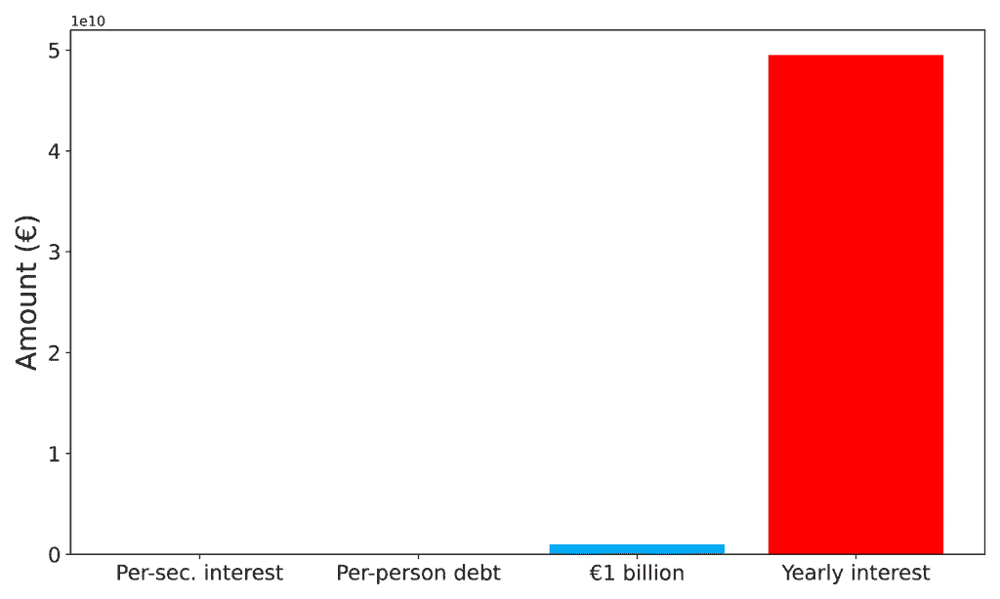
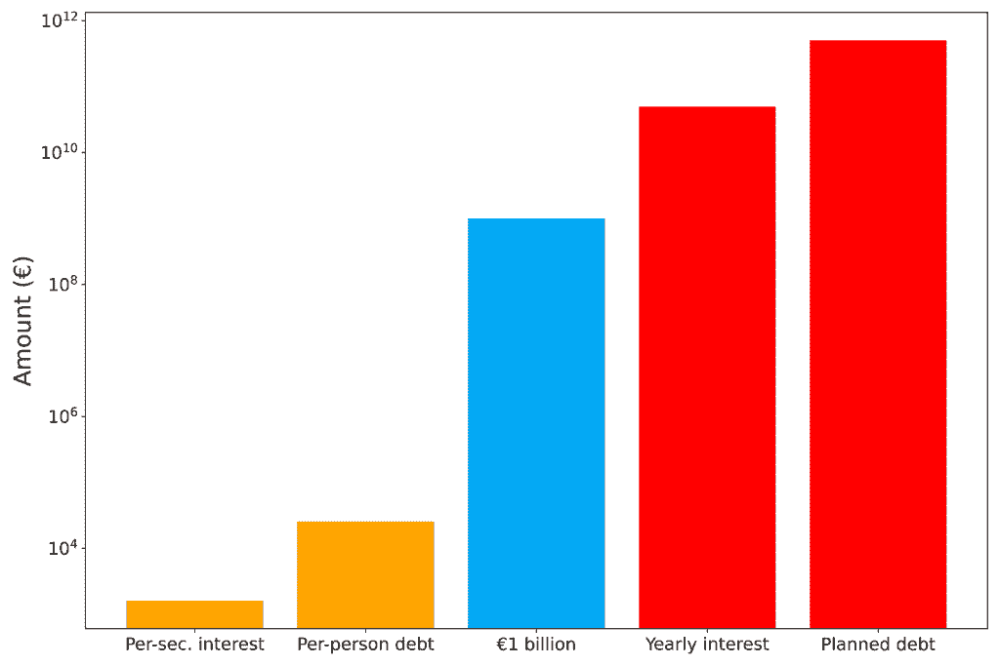
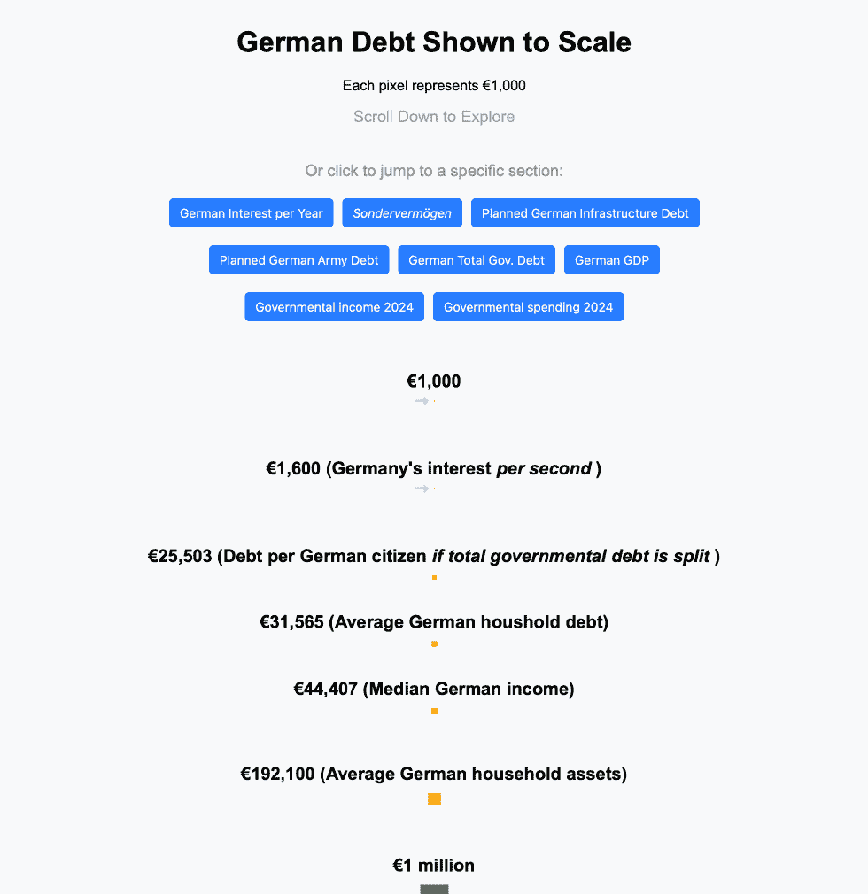

# 德国当前在债务方面的状况

> [`towardsdatascience.com/what-germany-currently-is-up-to-debt-wise/`](https://towardsdatascience.com/what-germany-currently-is-up-to-debt-wise/)

€1,600 *每秒*。这就是德国为债务支付利息的金额。总的来说，德国政府的债务已经达到了万亿级别——超过一千亿欧元。而且政府计划再增加更多，据传言，未来 10 年内可能会增加高达一兆的额外债务。

政府财政涉及的数字如此巨大，以至于人们可能无法现实地评估即使是 1 亿欧元或美元究竟有多少。

在这篇文章中，我演示了传统的列表和图表无法传达政府支出涉及多少资金的感受。然后我展示了如何通过一点编程来交互式地可视化这些资金以及它们与其他数字的关系。我将使用德国作为例子，因为它目前受到大量媒体的关注，其债务统计数据是公开可用的。

## 简单列举

首先，我们将使用简单的列举法来列出关键事实，作为将信息（不）关联起来的第一种方法。它不包括家庭债务。正如我们稍后将会看到的，与简单脚本提供的可视化工具相比，这种方法完全失败了。

+   €1,600：每秒的利率

+   €25,503：如果国家债务均摊到每个德国公民身上的债务

而对我们来说，这里已经是一个很大的跳跃了。我们直接跳到了十亿级别：

+   €49,5 *十亿*: 每年的利率

+   €100 亿：德国军队的“特别资金”（债务的委婉说法）

+   €500 亿：*计划*用于基础设施的额外债务

现在，我们再跳一个台阶：

+   €2,11 *万亿*: 截至 2025 年 3 月的德国总政府债务

在阅读这些数字后，我们可能对德国的债务有了更多了解。但我们几乎无法理解它们之间是如何相互关联的。是的，我们知道€1 亿是€1 百万的一千倍。但这只是常识。

如果我们能将这些数字可视化地并排展示，可能会更好。这正是我们接下来要做的。

## 线性缩放的图表

使用 Python 和 Matplotlib 绘图库，创建一个简单的图表非常直接。（完整的代码链接在本文的资源部分，位于文章末尾）。

我选择了四个数字来一起可视化：€1,600（因为大多数人已经知道这有多多了），€25,503（因为它很好地展示了每个德国人隐藏的债务），€1 亿（因为这是一个非常大的数额，即使是大型公司一年也未必能赚这么多），最后是€49,5 亿（因为这就是德国每年仅利息就需要支付的金额，这比大多数国家的 GDP 还要多）。

```py
import matplotlib.pyplot as plt

# Data
amounts = [1600, 25503, 1e9, 49.5e9, ]
labels = ['Per-sec. interest', 'Per-person debt','€1 billion', 'Yearly interest']

plt.figure(figsize=(10, 6))
plt.bar(labels, amounts, color=['orange', 'orange', '#03A9F4', '#ff0000'])
```

运行此代码后，我们得到以下图表：



我们瞬间看到的是：**我们看不到小额的钱**。巨大的金额完全掩盖了 1600 欧元。我敢打赌，任何阅读这篇文章的人对 1000 欧元的感觉比对，比如说，100 万欧元的感觉更强烈。我们知道 1000 欧元能给我们带来什么。对大多数人来说，几千欧元就是一个不错的月收入。

但图表甚至没有识别出来。

我犯的错误是使用了线性刻度的坐标轴吗？让我们看看下一个。

## 对数刻度的图表

在对数据进行对数可视化时，我们将坚持使用 Python 和 matplotlib。我们只需要添加一行代码，就可以直接得到更新的图表：



**这是否更好？** 在某种程度上，*是的*！我们现在可以开始看到日常金额（如每秒 1600 欧元的利息）和计划支出（即债务）之间的区别。

多亏了对数刻度，它们出现在同一张图表上。在这个可视化中，图表不是线性增长，而是对数增长。这意味着 y 轴上两个标记之间的间距不代表固定的、相等的增量（就像之前在线性缩放的图表中那样）。相反，每一步代表乘以一个常数因子。在我们的图表中，间距是通过乘以 100（或者，添加两个尾随零）来确定的。

对于我们的目的：这种对数刻度比线性刻度好吗？是的，绝对好。

**但是，这足够吗？** 我们在尝试传达德国计划额外 5000 亿欧元债务时，是否不能做得更好？而且，这笔债务与其他已经存在的债务有什么关系？

当然，我们可以。使用一点 HTML、JavaScript 和一些 CSS 样式，我们可以快速创建一个简单的交互式网页。对于一个初学者来说，一个周末就能轻松完成。

## 静态网页就足够了！

数据科学家和程序员每天都要与数据打交道。像 Excel 和 Python 脚本这样的工具帮助他们将数据转换为洞察力。

有时，一个简单的网页可以更好地传达数字之间的关系。特别是当我们谈论政府债务中涉及的巨额资金时。

**我们从 HTML 开始我们的可视化**，通过将几个 div 元素堆叠在一起：

```py
...
<div class="debt-wrapper">
     <h2 class="debt-title">€25,503 (Debt per German citizen <em>if total governmental debt is split </em>)</h2>
     <div class="debt one-thousand" data-height="25503"></div>
</div>
<div class="debt-wrapper">
     <h2 class="debt-title">€1 billion</h2>
     <div class="debt billion" data-height="1000000000"></div>
</div>
<div class="debt-wrapper" id="interest-year">
     <div class="debt-header">
       <h2 class="debt-title">€49,5 billion (German interest per year)</h2>
     </div>
     <div class="debt ruler" data-height="49500000000"></div>
</div>
... 
```

对于每个部分，我们通过 HTML 属性指示金额为€。

**接下来，我们将使用 JavaScript** 来将金额转换为易于理解的可视化。

对于这个，我们定义**每个像素代表 1000 欧元**。通过使用矩形形式，我们可以因此表示任何金额：

```py
document.addEventListener("DOMContentLoaded", function() {
     const wealthBars = document.querySelectorAll(".debt");
     wealthBars.forEach(bar => {
       if (!bar.dataset.scaled) {
         const amount = parseInt(bar.dataset.height) / 1000;
         const width = Math.min(Math.sqrt(amount), 200); // Cap the width pixels
         const height = amount / width;
         bar.style.width = width + "px";
         bar.style.height = height + "px";
         bar.dataset.scaled = "true";
```

最后，我们添加一些 CSS 样式来使渲染的网页看起来更好：

```py
.debt-wrapper {
 display: flex;
 flex-direction: column;
 align-items: center;
 margin: 20px 0;
}

.debt-title {
 font-size: 20px;
 margin-bottom: 10px;
}

/* Debt Bars */
.debt {
 position: relative;
 transition: height 0.3s ease-out, width 0.3s ease-out;
 background-color: #ffcc00;
 max-width: 200px; /* Maximum width for bars */
}
```

将所有这些放在一起（在下面的资源部分可以找到完整的源代码），我们得到以下结果（我在这里添加了一些我认为与德国债务成比例的相关关键数字）：



作者可视化。在这里找到：[`phrasenmaeher.github.io`](https://phrasenmaeher.github.io/)

现在，这是一个易于理解的可视化！你可以在这里自行探索：[`phrasenmaeher.github.io`](https://phrasenmaeher.github.io/).

这个简单的网页更准确地反映了德国想要新增的巨额债务。利用基本的编程技能，我们展示了债务与日常金额（如 1600 欧元）以及现有的债务相关成本（如每年 4950 亿欧元的利息）之间的关系。只需向下滚动，你就能感受到这笔钱的规模。在上面的 GIF 中，我们甚至没有向下滚动整个页面的 1%（看看右边的滚动条，几乎不动）。

请记住，1 像素等于 1000 欧元。即使你每月赚 10,000 欧元，那也只是 10 像素，在债务条中几乎不明显。如果你向下滚动 1 像素，你就揭露了 200,000 欧元的新债务（默认条宽为 200）。即使你每年赚 100 万欧元，那也只是滚动 5 像素。无论你赚多少钱，可视化都表明：*这实际上只是债务海洋中的一滴*。

如果你来自德国，我并不感到羡慕，尤其是对即将到来的世代来说：有人必须偿还这笔债务。*除了现有的债务之外*。

* * *

## 资源

+   交互式网页：[`phrasenmaeher.github.io/`](https://phrasenmaeher.github.io/)

+   所有代码（Python、HTML、JavaScript、CSS）：[`github.com/phrasenmaeher/german-debt`](https://github.com/phrasenmaeher/german-debt)

+   数据来源：[`github.com/phrasenmaeher/german-debt?tab=readme-ov-file#select-sources`](https://github.com/phrasenmaeher/german-debt?tab=readme-ov-file#select-sources)
