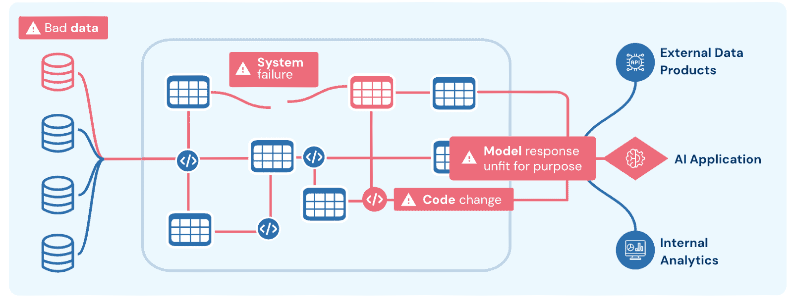

# 2026 年将是数据 + AI 可观察性的年份

> [原文链接](https://towardsdatascience.com/2026-will-be-the-year-of-data-ai-observability/)

GenAI 已经对企业的生产力产生了非凡的影响。[马克·贝尼奥夫已经声明](https://www.salesforceben.com/salesforce-will-hire-no-more-software-engineers-in-2025-says-marc-benioff/)，Salesforce 将保持其软件工程人员数量不变，因为 AI 带来了 30%的生产力提升。利用 Microsoft Co-pilot 的用户[创建或编辑了 10%更多的文档](https://www.microsoft.com/en-us/research/uploads/prod/2024/07/Generative-AI-in-Real-World-Workplaces-Deck.pdf)。

但这种影响已经均匀分布。强大的模型只需一个简单的 API 调用即可获得，对所有用户都可用（正如 Meta 和 OpenAI 的广告不断提醒我们的那样）。

真正的颠覆在于“数据 + AI”。换句话说，当组织将他们的第一方数据与 LLMs 结合以解锁独特的见解、自动化流程或加速专业工作流程时。

没有人确切地知道这场巨浪何时会到来，但根据我们与数十个积极从事数据 + AI 应用开发的团队的交谈，很明显，时机已经成熟。

为什么？好吧，这遵循了我们之前看到的一种模式。多次。每一次主要的技术转变都看到了初始采用，一旦达到企业级可靠性，就会放大。我们在软件和应用程序可观察性、数据和数据可观察性中看到了这一点，很快数据 + AI 和数据 & [AI 可观察性](https://www.montecarlodata.com/blog-ai-observability/)也将如此。

在这篇文章中，我们将突出企业数据 + AI 项目的进展，以及许多团队跨越临界点的路径。

## 过去是序章

数据 + AI 将带来指数级更多的独特价值，但它也指数级地更难。

大多数组织没有[$500 亿美元可用于科幻主题的倡议](https://apnews.com/article/trump-ai-openai-oracle-softbank-son-altman-ellison-be261f8a8ee07a0623d4170397348c41)。企业应用需要具有经济可行性和可靠性。

看看过去的技术进步——特别是云计算和大数据——我们可以看到它通常按这个顺序发生。基础设施和容量突破创造需求，并需要更高的可靠性水平来维持它。

在互联网用越来越关键的任务（从银行到实时导航）推动世界上最具影响力的 SaaS 应用之前，它主要是猫图片、AOL 聊天室和电子邮件链信的领域。这种变化只有在达到传说中的“5 9s 可靠性”之后才发生。S3、Datadog 和网站可靠性工程实践改变了世界。

在数据为机器学习模型和实时营销应用等有价值的数据产品提供动力之前，数据仓库主要用于在会议桌旁的活页夹中创建图表。Snowflake 和 Databricks 改变了数据存储/处理的经济和容量，[数据可观察性](https://www.montecarlodata.com/blog-what-is-data-observability/)为现代数据堆栈带来了可靠性。

这种模式在 AI 中也正在重复。2023 年是 GPU 的一年。2024 年是基础模型的一年。2025 年已经看到了[DeepSeek](https://finance.yahoo.com/news/deepseek-slashes-ai-pricing-75-143744514.html?guccounter=1&guce_referrer=aHR0cHM6Ly93d3cuZ29vZ2xlLmNvbS8&guce_referrer_sig=AQAAAJT4NK1tvpOK3LqpbRmkLUZH8ysLussjDBaXgMoq6nf4xD-mKdACoM_MzduUAH08mUCApVe2LOoAg3ippqaiYjUdf5n-ROCY7q1T0y-JtyijTWusEduxRlnkXhVj0beckeEP6hI-bPrGmS_mjFT7gVpdjgOzQgYrP8UNMLg08Ure)和[代理应用](https://blogs.nvidia.com/blog/what-is-agentic-ai/)的初步涟漪，这将变成一股巨浪。

我们的赌注是，2026 年将是数据+AI 改变世界的一年……如果历史是任何指标，那么这次革命将不会与可观察性的进步无关。

## 数据+AI 团队目前的状态

数据+AI 团队比去年更进了一步。根据我们的对话：

+   40%处于生产阶段（其中 30%刚刚达到那里）

+   40%处于半生产或预生产阶段

+   20%处于实验阶段

当你看到临界质量正在形成时，所有这些都在尝试达到全规模的过程中面临挑战。最常见的主题：

**数据准备** — 你不能用差数据做出好的 AI。在结构化数据方面，团队正在竞相实现“[AI 就绪数据](https://www.montecarlodata.com/blog-3-steps-to-ai-ready-data/)”。换句话说，创建一个真理的中心来源并减少他们的数据+AI 停机时间。

在非结构化方面，团队在处理冲突的来源和过时信息方面遇到困难。一个团队特别指出，“对难以管理的知识库的恐惧”是扩展的主要障碍。

**系统蔓延** — 目前，还没有我们所说的行业标准架构，尽管一些迹象正在出现。数据+AI 堆栈实际上是四个独立的堆栈结合在一起：结构化数据、非结构化数据、AI 以及经常是 SaaS 堆栈。

每个堆栈本身都难以管理和维护高可靠性水平。将它们拼凑在一起则是复杂性的平方。我们几乎与所有交谈过的数据团队都在尝试在他们能控制的范围内整合混乱，例如，通过利用大型现代数据云平台来处理许多核心组件，而不是专门构建的向量数据库。

**反馈循环** — 数据+AI 应用中固有的最常见挑战之一是评估输出往往是主观的。常见的方法包括：

1.  让人类标注员对输出进行评分

1.  将用户行为（如点赞/踩或接受建议）作为质量间接衡量标准

1.  使用模型（LLMs、SLMs 等）根据各种标准对输出进行评分

1.  将输出与某些已知的事实进行比较

所有方法都有挑战，将系统变化和输出结果之间的关联建立起来几乎是不可能的。

**成本 & 延迟** — 模型容量和成本的进步令人惊叹。在最近的[一次演讲](https://info.montecarlodata.com/get-resources/data-quality-day/building-enterprise-data-quality-at-scale)中，托马斯·唐古兹，AI 领域的领先风险投资家，分享了这张图表，展示了较小（成本较低）的模型性能如何达到与较大模型相似的性能水平。

但我们还没有达到商品基础设施的价格。我们交谈过的多数团队对 AI 采用的财务影响表示担忧。如果有任何监控正在进行，那通常更关注的是代币和成本，而不是结果可靠性。

## 下一个前沿：数据 + AI 的可观测性

图片由作者提供

数据 + AI 是一个不断发展的领域，具有独特的挑战，但构建可靠技术系统的原则已经保持了几十年不变。

其中一个核心原则是：你不可能只是偶尔检查装配线末端的产物，甚至在整个装配线上的某些点。相反，你需要对装配线本身有全面的可见性。对于复杂系统来说，这是早期识别问题并追溯到根本原因的唯一方法。

但你需要观察整个系统。端到端。没有其他方式可行。

要实现数据 + AI 的可靠性，团队不能仅仅在真空中观察模型就能成功。对于数据 + AI 的可观测性而言，这意味着核心系统组件之间的集成。换句话说，数据 + AI 产品可能崩溃的四种方式：在数据、系统、代码或模型中。

识别、分类和解决问题需要了解结构化/非结构化数据、编排/代理系统、提示、上下文以及模型响应。 (敬请期待即将到来的深入探讨，具体说明这意味着什么以及每个组件如何崩溃)。

数据 + AI 已不再是两种不同的技术；它们是一个单一的系统。到明年，让我们希望我们像对待一个系统一样对待它。

## 变化缓慢发生，然后突然全部发生

我们正处于数据 + AI 的临界点。

任何组织都不会对“什么”或“如何”感到惊讶。会议室的每一位成员，C 级别的高管，以及休息室的每个人都看到了过去平台转变如何创造了 Blockbusters 和 Netflixes。

惊喜将在于“何时”和“何地”。每个组织都在竞速，但他们不知道何时转向，何时冲刺，甚至不知道该往哪里跑。

停滞不前不是一种选择，但没有人愿意使用快速发展的基础设施来构建很快就会商品化的定制 AI 应用。没有人愿意他们的图片与[下一个](https://www.reuters.com/technology/artificial-intelligence/ai-hallucinations-court-papers-spell-trouble-lawyers-2025-02-18/) [AI 幻觉](https://venturebeat.com/ai/a-chevy-for-1-car-dealer-chatbots-show-perils-of-ai-for-customer-service/) [头条新闻](https://time.com/6256529/bing-openai-chatgpt-danger-alignment/) [一起](https://www.theguardian.com/technology/2025/feb/06/google-edits-super-bowl-ad-for-ai-that-featured-false-information#:~:text=Replying%20to%20him%2C%20the%20Google,the%20websites%20that%20Gemini%20scrapes.)。

显然，在规模上实现可靠性将成为决定新行业巨头诞生的转折点。我们的建议是，随着数据+AI 领域的成熟，确保你已经准备好进行转型。

因为如果过去告诉我们什么的话，那就是那些拥有建立具有高度数据准备就绪可靠系统的正确基础的组织将是那些跨过终点线的人。
