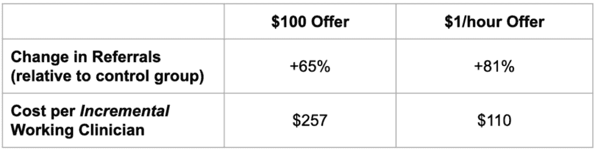

# 实验图解：1 美元能否比 100 美元更能改变行为？

> [`towardsdatascience.com/experiments-illustrated-can-1-change-behavior-more-than-100/`](https://towardsdatascience.com/experiments-illustrated-can-1-change-behavior-more-than-100/)

我目前在一个小型科技公司领导一个小型数据团队。由于规模较小，我们在实验的什么、何时以及如何进行方面拥有很大的自主权。在这个系列中，我将分享我们多年实验的宝库，每个故事都突出与实验相关的一个关键概念。

+   [Georandomization & How we optimized premium listings on our job board](https://towardsdatascience.com/experiments-illustrated-how-we-optimized-premium-listings-on-our-nursing-job-board/)

+   [Multiple Comparisons & How we saved $1M with random assignment](https://towardsdatascience.com/experiments-illustrated-how-random-assignment-saved-us-1m-in-marketing-spend/)

在这里，我们将分享我们早期测试中关于推荐奖金计划的令人惊讶的结果，并利用它来讨论你如何缩小实验的决策范围（至少当它们涉及人类时）。

## 背景：现在是 COVID 时期，我们需要雇佣成千上万的护士

[IntelyCare](https://www.intelycare.com/) 帮助医疗机构与护理人才匹配。我们是一个被美化的护士招聘机器，所以我们总是寻求更有效地招聘。护士来自许多渠道，但那些通过推荐来的护士获得更高的评价，并且在我们这里停留的时间更长。

那一年是 2020 年。IntelyCare 是一家初创公司（按照大多数标准来说仍然是）。我们的应用程序是新的，大多数功能仍然很原始。一些例子...

+   我们有让 IntelyPros 与朋友分享推荐链接的方式，但没有提供财务激励措施。

+   我们的申请流程非常繁琐。除了电话面试和推荐信外，我们还需要审查一大堆文件。只有一小部分申请者能够通过所有流程并最终工作。

在一次招聘头脑风暴中，我们抓住了推荐的想法，并同意增加财务激励措施是容易测试的。比如，“当你的朋友开始工作时，你可以获得 100 美元。”那里没有多少创意，但一个想法不需要新颖才能变得好。

知道许多人如果获得奖金可能会反复推荐，并且知道我们的申请流程就像一场考验，我们也想知道是否在他们的朋友*开始*申请时给临床医生一个*小*奖励会更好。

对于简单的事情小奖励，还是对于困难的事情大奖励？我的意思是，这取决于很多因素。唯一知道哪种方式最好的方法就是尝试它们。

## 参考测试

我们随机将临床医生分配到两种体验之一：

1.  当他们的推荐开始工作申请时，临床医生在下次班次中将额外获得每小时 1 美元的报酬。（超级简单。开始申请只需 1-2 分钟。）

1.  当他们的推荐完成第一次班次时，临床医生会得到$100。（非常困难。一些护士会快速完成，但大多数申请者如果完成的话，需要几周甚至几个月）。

我们将三分之一的临床医生作为对照组，并通过一系列电子邮件通知他们规则。在这种测试中，总是存在溢出的风险，但想到一个群体从另一个群体那里窃取所有推荐的想法似乎有些牵强，所以我们觉得在个人层面上进行随机化是令人放心的。

**明显非社会性的：**许多人听到这两个选项后会问，“你们想过尝试利他性激励措施吗？”（例如：我推荐你，你做某事，我们**都**得到奖品）。[研究表明，它们通常比个人激励更好](https://journals.sagepub.com/doi/abs/10.1177/0022243719888440)，而且它们相当普遍（[instacart](https://www.instacart.com/help/section/866017999/3183254040), [airbnb](https://www.airbnb.com/help/article/84), [robinhood](https://robinhood.com/us/en/support/articles/invite-friends-pick-stock/),…）。我们考虑过这些，但我们的财务团队对我们每人向可能永远不会成为员工的数百人发送$1 的想法感到非常沮丧。

我想 Quickbooks 不喜欢这样？在某个时候，你只是接受最好不要去打扰财务团队。

由于$1/小时奖励如果不成为主要头痛就无法成为利他性的，我们在两个计划中都限制了奖金的支付，只支付给推荐的个人。这给了我们两个推荐计划，它们的关键区别在于时间和奖金金额。

结果表明，激励措施的时间和呈现方式非常重要。同样，社会激励也很重要。如果你正在尝试通过增长黑客技术来优化你的推荐计划，那么在增加奖金之前考虑这两个维度是非常明智的。

## 顺便提一下：思考要测试的事情

产品数据科学，除极少数例外，主要关注人类如何与事物互动。通常是一个网站或应用程序，但也可能是像一副耳机、恒温器或高速公路上的标志这样的物理对象。

科学来源于改变产品并观察人类如何因此改变他们的行为。而且，没有比观察你的客户在野外如何与你产品互动来学习一个变化是否有所帮助更好的方法了。

但你不能测试**所有**事情。有无限多的事情要测试，任何被分配进行实验的团队都必须将想法削减到有限的一组。你从哪里开始？

+   从产品本身开始。询问熟悉它的人他们喜欢什么，希望有什么不同，[Sean Ellis](https://medium.productcoalition.com/using-sean-ellis-test-for-measuring-your-product-market-fit-c8ac98053c2c)，[NPS](https://gramener.medium.com/net-promoter-score-nps-guide-f3dc4980468)，[妈妈测试](https://www.amazon.com/Mom-Test-customers-business-everyone/dp/1492180742)，等等。这是产品团队和几乎所有其他人的共同起点。

+   从人性出发。几十年来，行为科学家记录了人类行为中的特定模式。这些科学家有不同的名字（行为经济学家、行为心理学家等）。

在我谦卑的意见中，这些起点中的第二个严重被低估了。行为科学已经记录了数十种行为模式[`thedecisionlab.com/biases`](https://thedecisionlab.com/biases)，这些模式可以告知你的产品如何最有效地改变。

几个值得注意的例子...

+   [损失厌恶](https://medium.com/user-experience-design-1/loss-aversion-why-the-fear-of-loss-outweighs-the-love-of-gain-bc9d942c30f5)：人们厌恶损失胜过喜欢赢。

+   [峰值-终点法则](https://medium.com/modern-business/the-peak-end-heuristic-a15aa0a4159d)：当事情以积极的方式结束时，人们记得更愉快。

+   [社会规范与市场规范](https://medium.com/@andrewpettitt/social-norms-vs-market-norms-644af6588a65)：当人们为商品和服务付费而不是寻求帮助时，一切都会改变。

+   [框架效应](https://thedecisionlab.com/biases/framing-effect)：人们根据信息呈现的方式做出选择。

+   [左位数偏差](https://medium.com/@alyjuma/the-left-digit-effect-why-9-matters-fad6e5690cfd)：价格感知不成比例地受首位数字的影响（$0.99 = 🔥, $1.01 = 🥱）。

+   [当前偏见](https://medium.com/@coffeeandjunk/present-bias-why-you-go-for-the-junk-food-first-and-plan-healthy-meals-in-the-future-3dc44eb27620)：人们[讨厌等待](https://www.youtube.com/watch?v=y0Y7ScfaVHs)。

这些心理捷径并不是产品和营销的万能药。我们在不同的环境中测试了许多这些方法，但效果甚微，但有些是有效的。[也许你会在沙发垫下找到 1.6 亿美元](https://academic.oup.com/restud/article-abstract/90/6/3186/7045819?redirectedFrom=fulltext)。

### 着眼于当前偏见

许多人类表现出一种行为模式，即他们宁愿选择小而即时的奖励，也不愿选择未来更大的奖励。社会科学家称之为[当前偏见](https://www.behavioraleconomics.com/resources/mini-encyclopedia-of-be/present-bias/)，并通过像以下这样的难题来衡量它...

+   你更愿意现在得到 100 美元，还是一年后得到 200 美元？🤔

+   [你更愿意现在吃一个棉花糖，还是 15 分钟后吃两个棉花糖？](https://en.wikipedia.org/wiki/Stanford_marshmallow_experiment) 🤔

选择即时、较小奖励的人有一定的当前偏见。

偏好差异可能因人和环境而异。你可能在大多数情况下都是一个有耐心的人。但当你饥饿或疲倦时……就未必了。这就是为什么与调查或访谈相比，A/B 测试如此有用的一个原因。

对于我们的实验，问题并不那么不同，与实验室的问题相似：

+   你更愿意在本周某个时候得到~$8，还是在未来几周得到$100，也许永远都得不到？

## **实验结果**

我们中的许多人（包括我）认为$100 的出价会做得最好。听起来更大。在电子邮件中看起来更好。解释起来更容易。

我也认为我们可能会通过$1/小时的项目从推荐中获得更多申请，但并没有想到这会转化为更多的推荐。我想人们会拿了钱就跑。

令我惊讶的是，$1/小时的项目通过推荐获得了更多申请，以及更多正在工作的临床医生，所有这些都在一个*更低*的成本下完成。

图片由作者提供

与我们的对照组相比，$100 的出价导致了推荐增加 65%。这是一个巨大的变化！许多人喜欢这种类型的计划，因为我们只在推荐成功时才给予奖励。感觉钱花得值。

然而，$1/小时出价的效果甚至更好。与我们的对照组相比，推荐增加了 81%。尽管奖励较小且支付较早，但这些 IntelyPros 的推荐仍然以与$100 组大致相同的比率开始为我们工作。

是的，许多 IntelyPros 因为推荐而获得了奖励，但这些人最终未能完成最后一程，但数学上仍然有效。即使从申请到工作的转化率并不完美，每位新工作的 IntelyPro 的总成本也低于$100 组的一半。

**ABT：始终进行测试**

商业中推荐所扮演的角色可能会因为许多原因而改变。随着公司变得更大、更为人所熟知，推荐变得越来越不重要。你不需要人们去传播消息，因为消息已经传开了。

我们在 2020 年全球大流行期间进行了这项测试。一年后，我们进行了一项规模较小的测试，并看到了相似的结果。现在，在 2025 年，我们会看到相同的结果吗？很难说。如今，医疗人员招聘领域的形势大不相同。

这又是测试之所以重要的另一个原因。像推荐奖金这样的东西可能对公司 A 有神奇的效果，而对公司 B 则不然。产品实验的优点是，世界就是你的实验室。缺点是，很难知道什么可以推广到其他产品。

## 对那些走到这里的人来说的关键要点

+   当你进行实验以改进你的产品并从使用你产品的用户那里收集数据时，行为科学是寻找测试想法的一个富有成效的地方。

+   有时候，看似不太出色的想法最终会带来最大的影响！

+   时间和展示方式对激励措施很重要。在你增加某些奖金的金额之前，也许应该考虑一下赚取这笔奖金所需的时间和努力。

*(这篇帖子是从我在 behavioraleconomics.com 上的*[*2022 年的帖子*](https://www.behavioraleconomics.com/using-behavioral-science-to-improve-our-referral-program/)* *翻新而来)*
