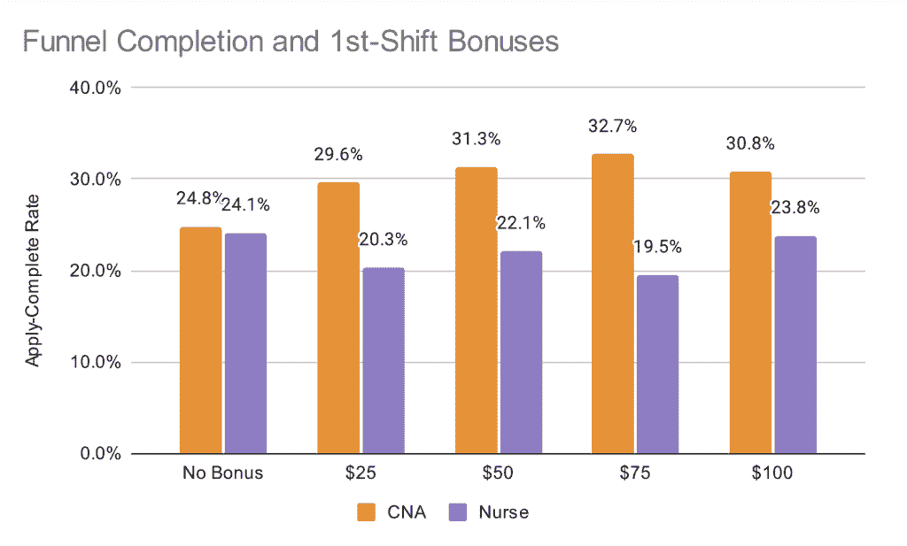

# 实验展示：随机分配如何帮助我们节省 100 万美元的营销费用

> [`towardsdatascience.com/experiments-illustrated-how-random-assignment-saved-us-1m-in-marketing-spend/`](https://towardsdatascience.com/experiments-illustrated-how-random-assignment-saved-us-1m-in-marketing-spend/)

进行有趣的实验很容易成为我在数据科学工作中最喜欢的一部分。

大多数实验都不会带来大的胜利，所以胜利者就成了有趣的故事。我们在[IntelyCare](https://www.intelycare.com/)有过一些这样的经历，我将通过强调与实验相关的一个概念来分享每个故事。

+   [Georandomization & 如何优化我们招聘板上的高级职位列表](https://towardsdatascience.com/experiments-illustrated-how-we-optimized-premium-listings-on-our-nursing-job-board/)

+   [了解要测试什么 & IntelyCare 如何测试其推荐奖金计划](https://towardsdatascience.com/experiments-illustrated-can-1-change-behavior-more-than-100/)

在这篇帖子中，我们将分享一个关于我们如何通过先进行实验来避免做一些愚蠢的事情的故事，并利用它来讨论[多重比较问题](https://en.wikipedia.org/wiki/Multiple_comparisons_problem)。

## 背景：IntelyCare 大规模雇佣护士……而且现在是新冠 😷

IntelyCare 将护士与从全职工作到个人班次的工作机会联系起来。当处理个人班次时，临床医生作为 IntelyCare 的雇员（代理模式）工作。这意味着我们 24/7 都在雇佣护士。

你可能已经抑制了这个记忆，但在 2020 年和 2021 年我们经历了这场全球大流行。在大流行期间雇佣护士无异于一场岩石之战。我们完全有业务许可尝试任何可能帮助我们更快、更有效地雇佣护士的事情。

## 问题：申请者众多，但新雇佣的人不多

在医疗保健的任何地方工作意味着提交一大堆文件——执照、免疫接种、认证等等，除此之外还有常规的简历、推荐信和背景调查。

IntelyCare 也不例外。尽管我们使整个过程都变得电话友好和数字化，但提交所有这些文件几乎和报税一样有趣。这意味着许多申请者在创建账户和完成班次之间就会放弃。

## 解决方案：只是往里砸钱！💸

我们尝试了许多事情（包括不同的推荐激励措施）。一个容易尝试的建议是在临床医生完成第一次班次时额外支付他们$100。

为什么是$100？因为它是一个很好的整数，而且看起来在营销材料上很好。你可能会被惊讶有多少商业决策是这样做出的（除非你在营销部门，那样的话这完全正常）。

这个想法很简单，我们几乎没有测试就上线了。当时压力很大，我们希望快速行动。但科学占了上风，我们不是给每个人提供$100，而是随机提供从$0 到$100 的奖金，以$25 的增量。

在整个申请过程中，临床医生通过电子邮件被告知奖金情况。（除非你的奖金是$0——没有你的电子邮件。）

我们进行了几个月的测试，以确保候选人有足够的时间完成他们的申请。当我们回到这里做出决定时，每个奖金级别都有数千名申请者。

[溢出效应](https://en.wikipedia.org/wiki/Spillover_(experiment))？这始终是一个可能性，但似乎不太可能。当时对护理人才的需求极高。我很难想象高奖金的医生会从那些有奖金的人那里抢走所有班次（从而夸大高奖金的影响）。还有很多班次可以轮换。

## 技术性说明：多重比较

如果你曾经运行过这样的测试，很可能一些高层会要求你“切割和细分”或“切割”或可能“深入挖掘”数据 100 种不同的方式。这很有趣[但也很危险](https://xkcd.com/882/)。等等，危险？！让我们来讨论一下。

+   数据集是有限的且存在噪声，这意味着每次你使用你的数据集来测试一个假设时，都有可能你的答案是错误的。抱歉，我没有制定规则。

+   为了了解错误答案的风险，我们查看数据集的*方差*。了解方差有助于我们了解一个统计量是否“接近”或“远离”另一个可能的答案。（例如：“营销活动对销售有非零影响吗？”）

+   假设，考虑到我的数据中的噪声量，我有 5%的机会对一个特定的假设得出错误的结论。我想知道营销活动是否增加了销售额，而我的老板想知道这种影响对男性、女性、老年人、年轻人、爱达荷州的人、佛罗里达州的人……等等有何不同。现在你看到危险了吗？如果我问 20 个问题，至少有一个答案可能是错误的。如果这意味着你的公司开始疯狂地向爱达荷州的青少年进行营销，那可能是一个代价高昂的错误！

+   虽然你的切割和细分不是机器学习模型，但你可能会因为提出太多问题而过度拟合你的分析。正如机器学习工程师有避免过度拟合模型的方法一样，分析师需要避免从有限的数据集中得出过度拟合的结论。

### 在挖掘之前先打电话：1-BON-FER-RONI

那么，分析师该怎么办呢？有许多启发式方法，所有这些方法都使得拒绝零假设变得更加困难。

+   调整“统计显著性”所需的 p 值（[Bonferroni 校正](https://medium.com/@Dr_nabil_ebraheim/understanding-the-bonferroni-correction-guarding-against-false-positives-in-multiple-comparisons-8d4cdd5061db)）。

+   使用 p 值排名来确定何时停止将结果视为显著（[Benjamini-Hochberg](https://medium.com/@jorgepit-14189/the-benjamini-hochberg-procedure-fdr-and-p-value-adjusted-explained-5577f722a2ac)）。

+   而不是直接接受实验结果，使用它们来更新一些贝叶斯先验，代表你对当前世界最佳看法的当前最佳观点（[贝叶斯模型平均](https://www.stat.colostate.edu/~jah/papers/statsci.pdf)）。在适当的情况下，你可以使用它来结合几个测试的结果。

+   [自助法](https://medium.com/towards-data-science/bootstrapping-statistics-what-it-is-and-why-its-used-e2fa29577307)——从实验数据中带替换地抽样，计算你的测试统计量，重复无数次，然后考虑测试统计量的完整分布。自助法并不能立即解决你的多重比较问题，但了解你的测试统计量的方差可以帮助你成为一个更批判性的 p 值消费者。

+   [动态停止规则](https://towardsdatascience.com/understanding-group-sequential-testing-befb35cec07a/)。列出你的假设。随着结果的到来，一旦证据明确，就停止测试每个假设，但继续使用额外数据测试其他假设。最终，你会用尽数据或用尽假设。为什么我们不用额外数据重新审视先前的假设？因为我们又回到了多重比较的困境。这种顺序性使得我们的手被绑在桅杆上，所以我们不会去追逐海妖。

如果你对更详细的总结感兴趣，我推荐以下内容：

+   StatSig：[多重比较校正](https://www.statsig.com/glossary/correction-for-multiple-comparisons)

+   约翰·麦克唐纳的[电子表格示例](https://stats.libretexts.org/Bookshelves/Applied_Statistics/Biological_Statistics_(McDonald)/06%3A_Multiple_Tests/6.01%3A_Multiple_Comparisons)

+   Spotify 工程师：[选择一个顺序测试框架](https://engineering.atspotify.com/2023/03/choosing-sequential-testing-framework-comparisons-and-discussions/)

## 回到奖金问题

我们是一群好奇心强的人，因此考虑查看实验数据的多个方面：位置、年龄、资格等。如果奖金对护士无效……除了那些居住在罗德岛且拥有活跃 Netflix 账户的 30 岁以下的护士呢？许多营销团队都准备好抓住这类“模式”，我将礼貌地请你向我展示你的 Bonferroni 收据。

在考虑多重比较之后，我们发现只有一个维度真正有意义——申请者是否是护士或护理助理（CNA）。

*注意奖金组与“无奖金”组的差异。（图片由作者提供）*

没有奖金的情况下，护士和护理助理完成班次的比例大致相同。护理助理更有可能以任何金额的奖金开始工作。另一方面，护士**不太可能**开始工作！（是的，这些都是与没有奖金相比具有统计学意义的差异，对于所有怀疑论者来说）。

对于来自医疗保健行业外部的任何读者来说，重要的是要知道护士可以轻松地赚取相当于护理助理 2 倍到 4 倍的小时工资。这些群体在许多方面都不同，这就是为什么我们将这个维度放在我们的顺序测试列表的顶部。

多年后，我仍然对这个图表感到困惑，不明白为什么当我们提供**更多**钱时，护士的完成率**下降**了。也许没有礼物比廉价的礼物更好？[当时医院为全职工作提供高达 25000 美元的签约奖金](https://jrreport.wordandbrown.com/2021/07/27/25000-signing-bonuses-to-hospital-workers-whatever-it-takes/)。

## 最佳奖金金额是多少？

进行这项测试后，我们取消了护士的奖金。也许一些超过 100 美元的奖金会改善我们的漏斗指标？那将是另一天的另一个测试。

对于 CNA（护理助理）来说，注意没有奖金组和 25 美元奖金组之间的巨大差异（几乎有 5 个完整的百分点）。从那里开始，每增加 25 美元，效果就小得多，并且在 50 美元和 100 美元之间，更大奖金的边际效益达到零。我们最终选择了 25 美元，以便在需要的时候和地方提高金额。

记得最初的提议是给**每个人**100 美元。如果我们那样做了，**我们一年内会在奖金上额外花费 100 万美元**，并且可能会招募到同样数量的人。

## 对于那些已经走到这一步的人来说，关键要点如下

+   你不需要复杂的设备来运行有影响力的测试。对于这个测试，我们需要的只是（1）随机分配和（2）一种发送 4 种不同电子邮件变体的方式。我们很幸运有一个好的数据仓库和 CRM，但我们真的可以用电子表格来完成这项工作。

+   我们在促销中强烈偏好漂亮的、整齐的数字。但我们发现 25 美元的奖金基本上和 100 美元的奖金一样有效。我们还进行了其他测试，这些测试表明奖金更多地与时机和展示方式有关，而不是单纯的金额。

+   将数据集切成 900 种不同的方式，然后追逐促销或其他干预措施中最好的切割，这很有吸引力。但这要注意多重比较问题。
