# 当你无法决定采取单一行动时

> [原文链接](https://towardsdatascience.com/when-you-just-cant-decide-on-a-single-action/)

在博弈论中，玩家通常必须对其他玩家的行动做出假设。其他玩家会做什么？他们会出石头、剪刀还是布？你永远不知道，但在某些情况下，你可能会对某些行动发生的概率高于其他行动有所了解。添加这种概率或随机性的概念为博弈论开辟了新的篇章，使我们能够分析更复杂的场景。

这篇文章是关于博弈论基础的四章系列中的第三篇。如果你还没有阅读前两章[第一篇](https://towardsdatascience.com/talking-about-games/) [第二篇](https://towardsdatascience.com/i-wont-change-unless-you-do/)，我鼓励你先阅读它们，以便熟悉以下内容中使用的术语和概念。如果你准备好了，我们就继续吧！

## **混合策略**

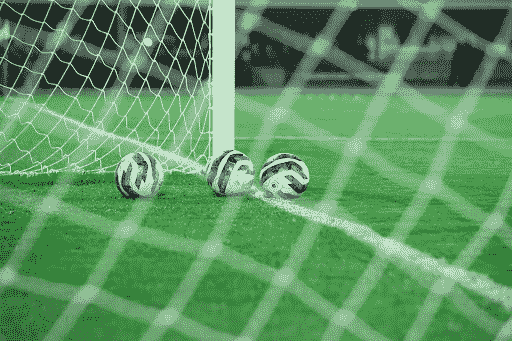

根据我所知，足球就是射门得分，尽管这种情况发生的频率很低。照片由[Zainu Color](https://unsplash.com/@zainukappan)在[Unsplash](https://unsplash.com)提供。

到目前为止，我们一直考虑的是每个玩家都恰好选择一个行动的游戏。现在我们将通过允许每个玩家以给定的*概率*选择不同的行动来扩展我们的游戏，这种策略我们称之为**混合策略**。如果你玩石头剪刀布，你不知道你的对手会采取什么行动，但你可能会猜测他们选择每个行动的概率是 33%，如果你玩 99 场石头剪刀布，你确实可能会发现你的对手每个行动大约选择 33 次。通过这个例子，你直接看到我们引入概率的主要原因。首先，它允许我们描述多次进行的游戏，其次，它使我们能够考虑（假设的）玩家行动的可能性。

让我更详细地说明后面的观点。我们回到第二章中看到的足球比赛，守门员决定跳入哪个角球，而另一名球员决定瞄准哪个角球。

一张点球大战的博弈矩阵。

如果你担任守门员，如果你选择了与对手相同的角落，你将获胜（奖励为 1），如果你选择了另一个角落，你将失败（奖励为-1）。对于你的对手来说，情况正好相反：如果你选择了不同的角落，他们将获胜。这种游戏只有在守门员和对手都随机选择角落时才有意义。更准确地说，如果一个玩家知道另一个玩家总是选择相同的角落，他们就知道如何做才能获胜。因此，在这个游戏中取得成功的关键是通过某种随机机制来选择角落。现在的主要问题是，守门员和对手应该将什么概率分配给两个角落？以 80%的概率选择正确的角落是否是一个好策略？可能不是。

要找到最佳策略，我们需要找到纳什均衡，因为那是没有玩家可以通过改变自己的行为来获得更好结果的唯一状态。在混合策略的情况下，这种纳什均衡由一个概率分布来描述，其中没有任何玩家想要增加或减少任何概率。换句话说，它是最优的（因为如果不是最优的，一个玩家会想要改变）。如果我们考虑**预期奖励**，我们就可以找到这个最优概率分布。正如你可能猜到的，预期奖励是由玩家获得的奖励（也称为效用，如上表所示）乘以获得该奖励的可能性。假设射手以概率 p 选择左边的角落，以概率 1-p 选择右边的角落。守门员可以期望获得什么奖励？好吧，如果他们选择左边的角落，他们可以期望获得 p*1 + (1-p)*(-1) 的奖励。你能看到这是如何从游戏矩阵中推导出来的吗？如果守门员选择左边的角落，有概率 p，射手会选择相同的角落，这对守门员是有利的（奖励为 1）。但以 (1-p) 的概率，射手会选择另一个角落，守门员会输（奖励为-1）。同样地，如果守门员选择右边的角落，他可以期望获得 (1-p)*1 + p*(-1) 的奖励。因此，如果守门员以概率 q 选择左边的角落，以概率 (1-q) 选择右边的角落，守门员的整体预期奖励是 q 乘以左边的预期奖励加上 (1-q) 乘以右边的奖励。

现在，让我们从射手的视角来看。他希望守门员在两个角落之间犹豫不决。换句话说，他希望守门员在任何一个角落都看不到优势，因此他会随机选择。从数学上讲，这意味着两个角落的预期奖励应该是相等的，即

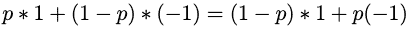

这可以解为 p=0.5。因此，射手使守门员犹豫不决的最佳策略是以概率 p=0.5 选择正确的角落，并以相同的概率 p=0.5 选择左边的角落。

但现在想象一个以倾向于选择正确角而闻名的射手。你可能不会期望每个角都有 50/50 的概率，但你假设他会以 70%的概率选择正确的角。如果守门员保持 50/50 的分割选择角，他们的预期奖励是左角预期奖励的 0.5 倍加上右角预期奖励的 0.5 倍：

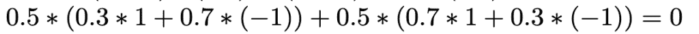

这听起来并不太糟糕，但仍然有更好的选择。如果守门员总是选择右角（即，q=1），他们可以得到 0.4 的奖励，这比 0 要好。在这种情况下，守门员有一个明显的最佳答案，那就是偏向射手偏好的角。然而，这会降低射手的奖励。如果守门员总是选择右角，射手将以 70%的概率得到-1 的奖励（因为射手自己以 70%的概率选择右角），在剩余的 30%的情况下得到 1 的奖励，这导致预期奖励为 0.7*(-1) + 0.3*1 = -0.4。这比他们选择 50/50 时得到的 0 的奖励要差。你还记得纳什均衡是一个状态，在这个状态下，除非其他玩家改变他们的行动，否则没有玩家有理由改变自己的行动吗？这个场景不是纳什均衡，因为射手有动力改变自己的行动，使其更接近 50/50 的分割，即使守门员没有改变策略。然而，这个 50/50 的分割是一个纳什均衡，因为在那种情况下，射手和守门员都不会从改变他们选择一个或另一个角的概率中获得任何好处。

## **斗鸡**

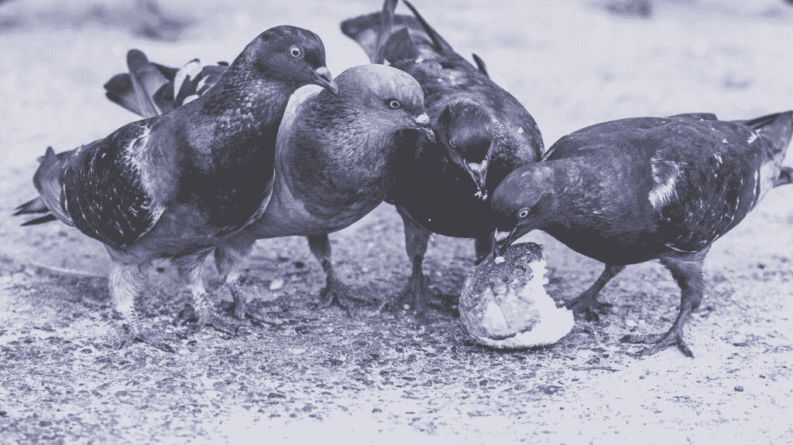

食物可以是鸟类相互争斗的原因。照片由[Viktor Keri](https://unsplash.com/@viktorkeri)在[Unsplash](https://unsplash.com?utm_source=medium&utm_medium=referral)提供。

从前面的例子中我们可以看到，一个玩家对另一个玩家行为的假设会影响第一个玩家的行动选择。如果一个玩家想要理性地行动（在博弈论中我们总是期望如此），他们会选择那些在考虑其他玩家混合行动策略的情况下最大化预期奖励的行动。在足球场景中，如果你假设对手会更多地选择某个角，那么更频繁地跳入那个角是很简单的，所以让我们继续一个更复杂的例子，这个例子将我们带入了自然之中。

当我们穿越森林时，我们注意到野生动物中的一些有趣行为。比如说，两只鸟来到一个有食物的地方。如果你是一只鸟，你会怎么做？你会和另一只鸟分享食物，这意味着你们两个都会少吃一些？还是你会战斗？如果你威胁你的对手，他们可能会屈服，你就可以独自享用所有的食物。但如果是另一只鸟和你一样好斗，你最终会陷入真正的战斗，你们两个都会受伤。然后，你可能一开始就宁愿屈服，不战斗就离开。正如你所看到的，你的行动结果取决于另一只鸟。如果对手屈服，准备战斗可能非常有回报，但如果另一只鸟也愿意战斗，成本可能非常高。在矩阵表示法中，这个游戏看起来是这样的：

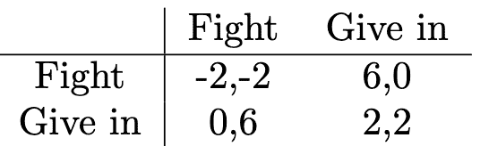

这是一个有时被称为鹰对鸽子的游戏的矩阵。

问题是，对于战斗或屈服的鸟的分布，理性的行为是什么？如果你处于一个非常危险的环境中，大多数鸟都已知是好斗的战斗者，你可能会更喜欢屈服以避免受伤。但如果你假设大多数其他鸟都是懦夫，你可能会看到为战斗做准备以吓跑其他鸟的潜在好处。通过计算预期回报，我们可以找出战斗和屈服的鸟的确切比例，这形成了一个平衡状态。假设战斗的概率用 p 表示鸟 1，q 表示鸟 2，那么屈服的概率对鸟 1 来说是 1-p，对鸟 2 来说是 1-q。在纳什均衡中，没有玩家想要改变他们的策略，除非其他玩家这样做。正式来说，这意味着两种选择都需要产生相同的预期回报。所以，鸟 2 以 q 的概率战斗需要和以(1-q)的概率屈服一样好。这导致我们得到以下可以解出 q 的公式：

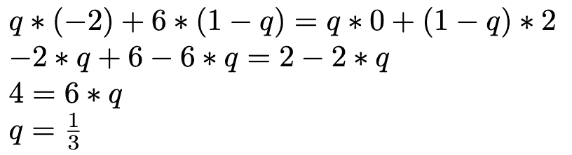

对于鸟 2 来说，以 1/3 的概率战斗，以 2/3 的概率屈服是最佳选择，由于游戏的对称性，鸟 1 也是如此。在一个大型的鸟群中，这意味着有三分之一的鸟是战斗者，它们通常寻求战斗，而另外三分之二的鸟更喜欢屈服。由于这是一个平衡状态，这些比例将随着时间的推移而保持稳定。如果发生更多鸟成为总是屈服的懦夫，那么战斗将变得更加有利可图，因为获胜的机会增加了。然而，随后更多的鸟会选择战斗，懦夫鸟的数量减少，并再次达到稳定的平衡状态。

## **报告犯罪**

这里没有什么可看的。继续前进，了解更多关于博弈论的知识。照片由[JOSHUA COLEMAN](https://unsplash.com/@joshstyle)在[Unsplash](https://unsplash.com)提供。

既然我们已经理解了我们可以通过比较不同选项的预期奖励来找到最优的纳什均衡，我们将使用这个策略在更复杂的例子上展示博弈论分析在现实复杂场景中的力量。

假设犯罪发生在市中心，有多个目击者。问题是，现在谁会打电话报警？由于周围有很多人，每个人都可能期望其他人会打电话报警，因此他们自己会避免这样做。我们可以再次将这个场景建模为一个游戏。假设我们有 *n* 个玩家，每个人都有两个选择，即 *打电话报警* 或 *不打电话报警*。那么奖励是什么？对于奖励，我们区分三种情况。如果没有人打电话报警，奖励为零，因为这样犯罪就不会被报告。如果你打电话报警，你会有一些成本（例如，你必须花费的时间等待并告诉警察发生了什么），但犯罪会被报告，这有助于保持你的城市安全。如果其他人报告了犯罪，城市仍然会被保持安全，但你没有自己打电话报警的成本。正式地，我们可以这样写下：

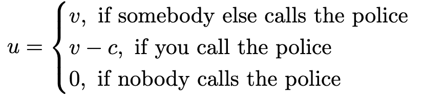

*v* 是保持城市安全的奖励，你可以通过其他人打电话报警（第一行）或者你自己打电话报警（第二行）来获得。然而，在第二种情况下，你的奖励会因为你要承担的成本 *c* 而稍微减少。然而，让我们假设 *c* 小于 *v*，这意味着，打电话报警的成本永远不会超过你从保持你的城市安全中获得的奖励。在最后一种情况中，没有人打电话报警，你的奖励为零。

这个博弈看起来与之前的有些不同，主要是因为我们没有以矩阵的形式展示它。事实上，它更复杂。我们没有指定确切的玩家数量（我们只是称之为 *n*），我们也没有明确指定奖励，只是引入了一些值 *v* 和 *c*。然而，这有助于我们将一个相当复杂的情况建模为一个游戏，并允许我们回答更有趣的问题：首先，如果更多的人目击了犯罪行为，会发生什么？有人报告犯罪的可能性会增加吗？其次，成本 *c* 如何影响犯罪被报告的可能性？我们可以用我们已经学到的博弈论概念来回答这些问题。

就像之前的例子一样，我们将使用纳什均衡的性质，即在最优状态下，没有人应该想要改变他们的行动。这意味着，对于每一个打电话报警的人来说，应该和没有打电话报警一样好，这导致我们得到以下公式：

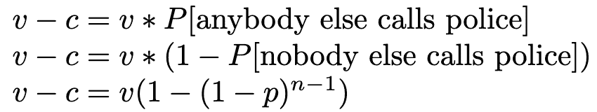

在左边，如果你自己打电话报警，你会得到奖励（v-c）。这应该和任何人打电话报警的奖励 v 一样好。现在，其他人打电话报警的概率与没有人打电话报警的概率相同。如果我们用 p 表示个体打电话报警的概率，那么单个个体不打电话报警的概率是 1-p。因此，两个个体都不打电话报警的概率是单个概率的乘积，即 (1-p)*(1-p)。对于 n-1 个个体（除了你之外的所有个体），这在上面的最后一行给出了 1-p 的 n-1 次方项。我们可以解这个方程，最终得到：

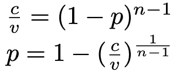

这最后一行给出了单个个体打电话报警的概率。如果有更多的见证者目睹犯罪行为会发生什么？如果 n 变得更大，指数会变得更小（1/n 趋向于 0），最终导致：

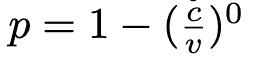

由于 x 的 0 次方始终等于 1，p 变为 0。换句话说，周围见证者越多（n 越高），你打电话报警的可能性就越小，对于无限多的见证者，概率会降至 0。这听起来合情合理。周围的人越多，你越有可能期望其他人会报警，而你自己的责任感就越小。自然，所有其他个体都会有相同的思维链。但这听起来也有些悲剧，不是吗？这难道意味着如果有许多见证者，没有人会打电话报警吗？

嗯，不一定。我们刚刚看到，单个个体打电话报警的概率随着 n 的增加而下降，但周围的人仍然更多。也许人数的多少抵消了这种下降的概率。一百个人每个人有很小的报警概率可能仍然比几个有适度个人概率的人更有价值。现在让我们来看看任何人打电话报警的概率。

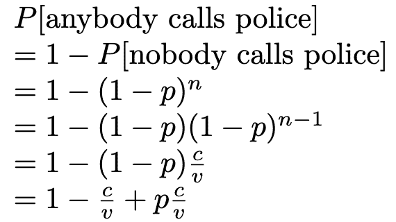

任何人打电话报警的概率等于 1 减去没有人打电话报警的概率。就像之前的例子一样，没有人打电话报警的概率由 1-p 的 n 次方来描述。然后我们使用之前推导出的方程（见上方公式）将 (1-p)^(n-1) 替换为 c/v。

当我们查看计算的最后一条线时，对于大的 n 现在会发生什么？我们已经知道 p 下降到零，留下 1-c/v 的概率。这是在许多人周围时任何人都会报警的可能性（注意，这与一个**单个个体**报警的概率不同）。我们看到这个可能性很大程度上取决于 c 和 v 的比率。c 越小，任何人报警的可能性就越大。如果 c 接近于零，几乎可以肯定警察会被叫来，但如果 c 几乎和 v 一样大（即报警的成本吞噬了报告犯罪的奖励），那么任何人报警的可能性就变得很小。这为我们提供了一个影响报告犯罪概率的杠杆。报警和报告犯罪应该尽可能轻松和低门槛。

## **摘要**

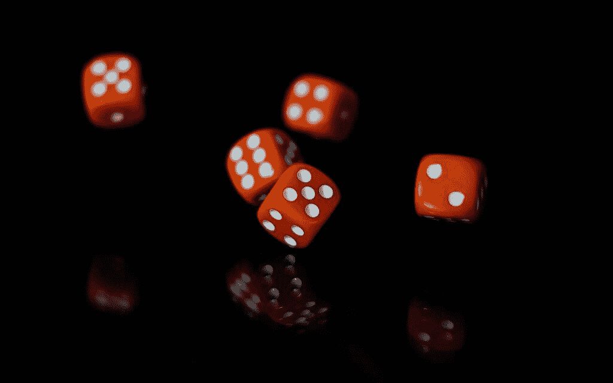

我们今天学到了很多关于概率和随机选择行动的知识。照片由[Robert Stump](https://unsplash.com/@stumpie10)在[Unsplash](https://unsplash.com)提供

在我们探索博弈论领域的旅程中，我们介绍了所谓的**混合策略**，这使我们能够通过不同行动被采取的概率来描述游戏。我们可以总结我们的主要发现如下：

+   混合策略由不同行动的概率分布来描述。

+   在**纳什均衡**中，玩家可以采取的所有行动的**预期收益**必须相等。

+   在混合策略中，纳什均衡意味着没有任何玩家想要**改变他们行动的概率**

+   我们可以通过将两个（或更多）选项的预期收益设为相等来找出纳什均衡中不同行动的概率。

+   博弈论概念使我们能够分析有无限多玩家的场景。这样的分析还可以告诉我们，精确塑造奖励如何影响纳什均衡中的概率。这可以用来启发现实世界的决策，正如我们在犯罪报告的例子中所看到的。

我们即将完成关于博弈论基础的系列文章。在下一章和最后一章中，我们将介绍游戏中轮流的概念。敬请期待！

## **参考文献**

这里介绍的主题通常在博弈论的标准教科书中都有涉及。我主要使用了这本，尽管它是用德语写的：

+   Bartholomae, F., & Wiens, M. (2016). *博弈论. 一本应用导向的教科书*. 沃斯巴登: 斯普林格专业媒体沃斯巴登.

英文中的一个替代版本可以是这个：

+   Espinola-Arredondo, A., & Muñoz-Garcia, F. (2023). *博弈论：带步骤示例的入门*. 斯普林格自然出版社.

博弈论是一个相对较新的研究领域，其第一本主要教科书就是这本：

+   Von Neumann, J., & Morgenstern, O. (1944). Theory of games and economic behavior.

*喜欢这篇文章吗？*[*关注我*](https://medium.com/@doriandrost) 以获取我未来发布的文章通知。
