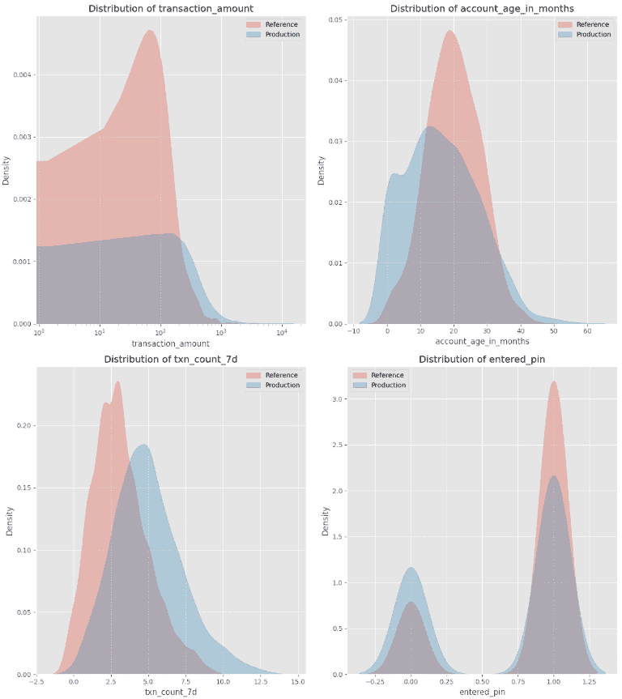
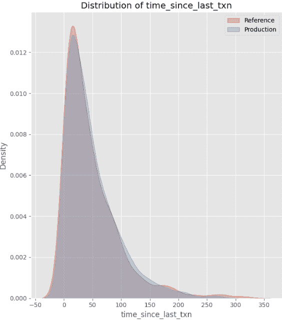
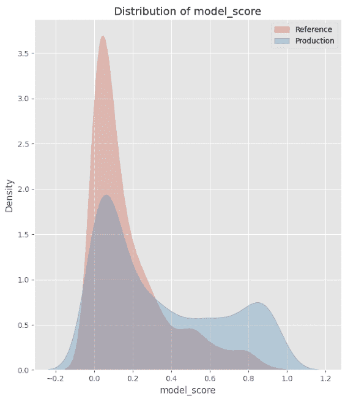
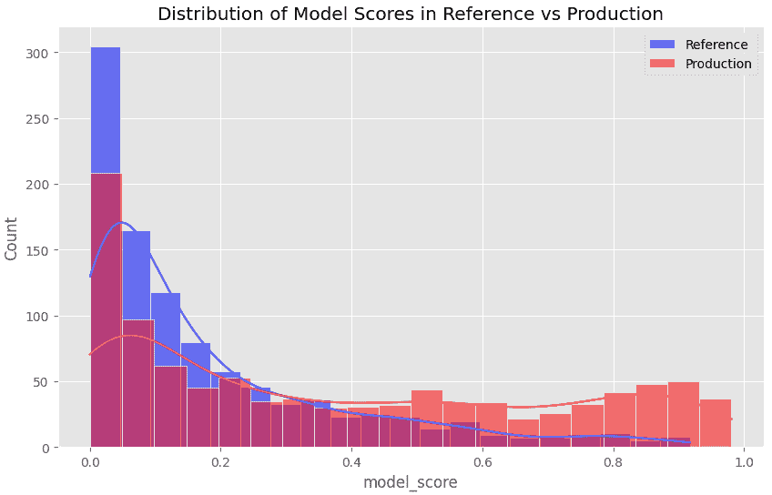
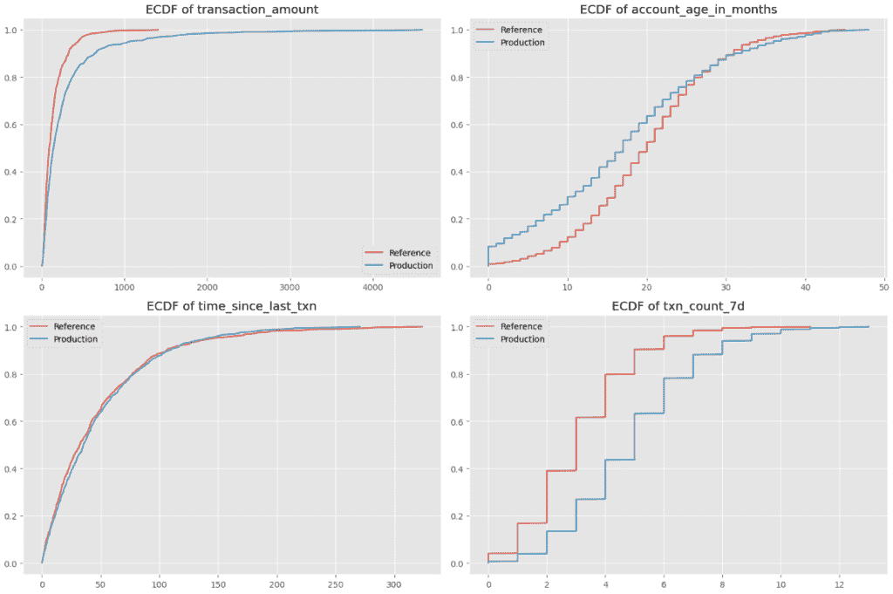
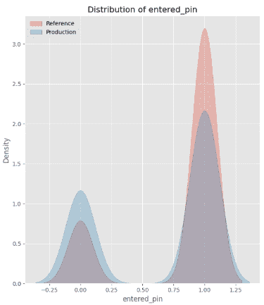
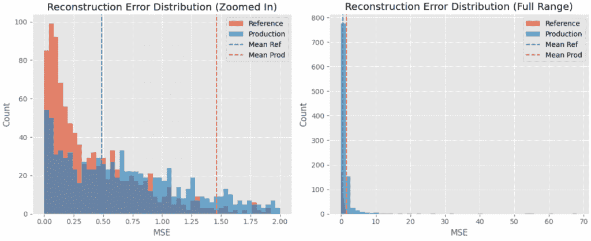

# 如何在模型漂移影响业务之前发现和预防它

> [如何在模型漂移影响业务之前发现和预防它](https://towardsdatascience.com/how-to-spot-and-prevent-model-drift-before-it-impacts-your-business/)

尽管人工智能炒作盛行，许多科技公司仍然严重依赖机器学习来驱动关键应用，从个性化推荐到欺诈检测。

我亲眼见证了未检测到的漂移如何导致重大成本——错过的欺诈检测、收入损失以及次优的商业结果，仅举几例。因此，如果您的公司已经部署或计划部署机器学习模型到生产环境中，拥有强大的监控至关重要。

未检测到的模型漂移可能导致重大经济损失、运营效率低下，甚至损害公司的声誉。为了减轻这些风险，拥有有效的模型监控至关重要，这包括：

+   跟踪模型性能

+   监控特征分布

+   检测单变量和多变量漂移

一个实施良好的监控系统可以帮助早期发现问题，节省大量时间、金钱和资源。

在这篇全面的指南中，我将提供一个框架，介绍如何思考和实施有效的模型监控，帮助您提前发现潜在问题，并确保模型在生产中的稳定性和可靠性。

## 特征漂移和分数漂移之间的区别是什么？

分数漂移指的是模型分数分布的逐渐变化。如果未加控制，这可能导致**模型性能下降**，使模型随着时间的推移变得越来越不准确。

另一方面，当一个或多个特征经历分布变化时，就会发生特征漂移。这些特征值的变化可能会影响模型学习到的潜在关系，并最终导致模型预测不准确。

## 模拟分数变化

为了模拟现实世界的欺诈检测挑战，我创建了一个包含五个金融交易特征的合成数据集。

**参考数据集**代表原始分布，而**生产数据集**引入变化来模拟在较新账户上**无需 PIN 验证的高价值交易增加**，这表明欺诈的增加。

每个特征都有不同的潜在分布：

+   **交易金额：** 对数正态分布（右偏斜，尾部较长）

+   **账户年龄（月数）：** 0 到 60 之间的截断正态分布（假设公司成立 5 年）

+   **自上次交易以来时间：** 指数分布

+   **交易次数：** 泊松分布

+   **输入 PIN 码：** 二项式分布。

为了近似模型分数，我随机分配了这些特征的权重，并应用了 Sigmoid 函数来限制预测值在 0 到 1 之间。这模仿了逻辑回归欺诈模型生成风险分数的方式。

如下图中所示：

+   **漂移特征**：*交易金额、账户年龄、交易次数和输入的 PIN* 都经历了分布、尺度或关系的偏移。



漂移特征的分布（图片由作者提供）

+   **稳定特征**：*自上次交易以来时间* 保持不变。



稳定特征的分布（图片由作者提供）

+   **漂移得分**：由于特征漂移，模型得分中的分布也发生了变化。



模型得分分布（图片由作者提供）

这种设置使我们能够分析特征漂移如何影响生产中的模型得分。

### 使用 PSI 检测模型得分漂移

为了监控模型得分，我使用了人口稳定性指数（PSI）来衡量模型得分分布随时间的变化程度。

PSI 通过对连续模型得分进行分箱，并比较参考和生产数据集中每个分箱中得分的比例来工作。它比较比例的差异及其对数比率，以计算一个单一的汇总统计量来量化漂移。

**Python 实现：**

```py
# Define function to calculate PSI given two datasets
def calculate_psi(reference, production, bins=10):
  # Discretize scores into bins
  min_val, max_val = 0, 1
  bin_edges = np.linspace(min_val, max_val, bins + 1)

  # Calculate proportions in each bin
  ref_counts, _ = np.histogram(reference, bins=bin_edges)
  prod_counts, _ = np.histogram(production, bins=bin_edges)

  ref_proportions = ref_counts / len(reference)
  prod_proportions = prod_counts / len(production)

  # Avoid division by zero
  ref_proportions = np.clip(ref_proportions, 1e-8, 1)
  prod_proportions = np.clip(prod_proportions, 1e-8, 1)

  # Calculate PSI for each bin
  psi = np.sum((ref_proportions - prod_proportions) * np.log(ref_proportions / prod_proportions))

  return psi

# Calculate PSI
psi_value = calculate_psi(ref_data['model_score'], prod_data['model_score'], bins=10)
print(f"PSI Value: {psi_value}")
```

下面是如何解释 PSI 值的总结：

+   **PSI < 0.1**：没有漂移，或者非常轻微的漂移（分布几乎相同）。

+   **0.1 ≤ PSI < 0.25**：存在一些漂移。分布有些不同。

+   **0.25 ≤ PSI < 0.5**：中等漂移。参考和生产分布之间存在明显的偏移。

+   **PSI ≥ 0.5**：显著漂移。存在很大的偏移，表明生产中的分布与参考数据相比发生了实质性变化。



模型得分分布的直方图（图片由作者提供）

**PSI 值为 0.6374** 暗示我们的参考和生产数据集之间存在显著的漂移。这与模型得分分布的直方图相一致，直观地确认了生产中得分向更高值偏移——**表明风险交易的增加**。

## 检测特征漂移

**数值特征的 Kolmogorov-Smirnov 测试**

Kolmogorov-Smirnov (K-S) 测试是我检测数值特征漂移的首选方法，因为它是非参数的，这意味着它不假设正态分布。

该测试通过测量经验累积分布函数（ECDF）之间的最大差异来比较参考和生产数据集中特征的分布。得到的 K-S 统计量范围从 0 到 1：

+   0 表示两个分布之间没有差异。

+   接近 1 的值表示更大的偏移。

**Python 实现：**

```py
# Create an empty dataframe
ks_results = pd.DataFrame(columns=['Feature', 'KS Statistic', 'p-value', 'Drift Detected'])

# Loop through all features and perform the K-S test
for col in numeric_cols:
    ks_stat, p_value = ks_2samp(ref_data[col], prod_data[col])
    drift_detected = p_value < 0.05

		# Store results in the dataframe
    ks_results = pd.concat([
        ks_results,
        pd.DataFrame({
            'Feature': [col],
            'KS Statistic': [ks_stat],
            'p-value': [p_value],
            'Drift Detected': [drift_detected]
        })
    ], ignore_index=True) 
```

下面是我们数据集中四个数值特征的 ECDF 图表：



四个数值特征的 ECDF（图片由作者提供）

以账户年龄特征为例：x 轴表示账户年龄（0-50 个月），y 轴显示参考数据集和生产数据集的 ECDF。生产数据集倾向于新账户，因为它有更多低账户年龄的观测值。

**分类特征的卡方检验**

为了检测分类和布尔特征的变动，我喜欢使用卡方检验。

此测试比较参考数据集和生产数据集中分类特征的频率分布，并返回两个值：

+   **卡方统计量**：更高的值表示参考数据集和生产数据集之间有更大的变化。

+   **p 值**：p 值低于 0.05 表明参考数据集和生产数据集之间的差异在统计上具有显著性，表明可能存在特征漂移。

**Python 实现：**

```py
# Create empty dataframe with corresponding column names
chi2_results = pd.DataFrame(columns=['Feature', 'Chi-Square Statistic', 'p-value', 'Drift Detected'])

for col in categorical_cols:
    # Get normalized value counts for both reference and production datasets
    ref_counts = ref_data[col].value_counts(normalize=True)
    prod_counts = prod_data[col].value_counts(normalize=True)

    # Ensure all categories are represented in both
    all_categories = set(ref_counts.index).union(set(prod_counts.index))
    ref_counts = ref_counts.reindex(all_categories, fill_value=0)
    prod_counts = prod_counts.reindex(all_categories, fill_value=0)

    # Create contingency table
    contingency_table = np.array([ref_counts * len(ref_data), prod_counts * len(prod_data)])

    # Perform Chi-Square test
    chi2_stat, p_value, _, _ = chi2_contingency(contingency_table)
    drift_detected = p_value < 0.05

    # Store results in chi2_results dataframe
    chi2_results = pd.concat([
        chi2_results,
        pd.DataFrame({
            'Feature': [col],
            'Chi-Square Statistic': [chi2_stat],
            'p-value': [p_value],
            'Drift Detected': [drift_detected]
        })
    ], ignore_index=True)
```

卡方统计量为 57.31，p 值为 3.72e-14，这证实了我们的分类特征“输入 PIN”发生了较大的变化。这一发现与下面的直方图相符，它直观地展示了这种变化：



分类特征的分布（作者图片）

## 检测多元变化

**成对交互变化的斯皮尔曼相关性**

除了监控单个特征的变化外，跟踪特征之间或交互中的**变化或交互**也很重要，这被称为多元变化。即使单个特征的分布保持稳定，多元变化也可能表明数据中的有意义差异。

默认情况下，Pandas 的`.corr()`函数计算皮尔逊相关系数，它仅捕捉变量之间的线性关系。然而，**特征之间的关系通常是非线性**的，但仍然遵循一致的趋势。

为了捕捉这一点，我们使用**斯皮尔曼相关性**来衡量特征之间的**单调关系**。它捕捉特征是否**以一致的方向变化**，即使它们之间的关系不是严格线性的。

为了评估特征关系的变化，我们比较：

+   **参考相关性**（`ref_corr`）：捕捉参考数据集中历史特征关系。

+   **生产相关性**（`prod_corr`）：捕捉生产中的新特征关系。

+   **绝对相关差异**：衡量参考数据集和生产数据集之间特征关系发生了多少变化。**更高的值表示更显著的变化。**

**Python 实现：**

```py
# Calculate correlation matrices
ref_corr = ref_data.corr(method='spearman')
prod_corr = prod_data.corr(method='spearman')

# Calculate correlation difference
corr_diff = abs(ref_corr - prod_corr)
```

**示例：相关性的变化**

现在，让我们看看`transaction_amount`和`account_age_in_months`之间的相关性：

+   在`ref_corr`中，相关系数为 0.00095，表明两个特征之间关系较弱。

+   在`prod_corr`中，相关系数为-0.0325，表明存在弱负相关性。

+   斯皮尔曼相关性的绝对差异为 0.0335，这是一个小但明显的变化。

相关性的绝对差异表明`transaction_amount`和`account_age_in_months`之间关系的变化。

这两个特征之间曾经没有关系，但生产数据集表明现在存在微弱的负相关性，这意味着新账户的交易金额更高。这正是我们要找的！

**用于复杂、高维多元变化的自动编码器**

除了监控成对交互外，我们还可以寻找数据中更多维度的变化。

自动编码器是检测**高维多元变化**的强大工具，其中多个特征以可能从单个特征分布或成对相关性中不明显的方式集体变化。

自动编码器是一种神经网络，通过两个组件学习数据的压缩表示：

+   **编码器**：将输入数据压缩到低维表示。

+   **解码器**：从压缩表示中重建原始输入。

为了检测变化，我们比较**重建输出**与**原始输入**，并计算**重建损失**。

+   **低重建损失** → 自动编码器成功重建数据，意味着新的观测值与其所见和所学相似。

+   **高重建损失** → 生产数据与学习到的模式有显著偏差，表明可能存在漂移。

与传统关注**个体特征或成对关系**的漂移度量不同，自动编码器可以同时捕捉多个变量之间的**复杂、非线性依赖关系**。

**Python 实现**：

```py
ref_features = ref_data[numeric_cols + categorical_cols]
prod_features = prod_data[numeric_cols + categorical_cols]

# Normalize the data
scaler = StandardScaler()
ref_scaled = scaler.fit_transform(ref_features)
prod_scaled = scaler.transform(prod_features)

# Split reference data into train and validation
np.random.shuffle(ref_scaled)
train_size = int(0.8 * len(ref_scaled))
train_data = ref_scaled[:train_size]
val_data = ref_scaled[train_size:]

# Build autoencoder
input_dim = ref_features.shape[1]
encoding_dim = 3 
# Input layer
input_layer = Input(shape=(input_dim, ))
# Encoder
encoded = Dense(8, activation="relu")(input_layer)
encoded = Dense(encoding_dim, activation="relu")(encoded)
# Decoder
decoded = Dense(8, activation="relu")(encoded)
decoded = Dense(input_dim, activation="linear")(decoded)
# Autoencoder
autoencoder = Model(input_layer, decoded)
autoencoder.compile(optimizer="adam", loss="mse")

# Train autoencoder
history = autoencoder.fit(
    train_data, train_data,
    epochs=50,
    batch_size=64,
    shuffle=True,
    validation_data=(val_data, val_data),
    verbose=0
)

# Calculate reconstruction error
ref_pred = autoencoder.predict(ref_scaled, verbose=0)
prod_pred = autoencoder.predict(prod_scaled, verbose=0)

ref_mse = np.mean(np.power(ref_scaled - ref_pred, 2), axis=1)
prod_mse = np.mean(np.power(prod_scaled - prod_pred, 2), axis=1)
```

下面的图表显示了两个数据集之间重建损失的分布。



实际值与预测值之间重建损失的分布（图片由作者提供）。

生产数据集的重建误差绝对值高于参考数据集，这表明整体数据发生了变化。这与生产数据集中新账户数量增加且交易价值较高的变化相一致。

## 总结

模型监控是数据科学家和机器学习工程师的一项基本但往往被忽视的责任。

所有统计方法得出的结论一致，这与数据中观察到的变化相吻合：它们检测到**生产方向上向新账户进行更高价值交易的趋势**。这种变化导致模型得分提高，表明潜在欺诈的增加。

在本文中，我介绍了在三个不同级别检测漂移的技术：

+   **模型得分漂移**：使用**人口稳定性指数**（PSI）。

+   **个体特征漂移**：使用**柯尔莫哥洛夫-斯米尔诺夫检验**对数值特征进行测试，以及**卡方检验**对分类特征进行测试。

+   **多元漂移**: 使用**斯皮尔曼相关系数**进行成对交互，以及**自编码器**进行高维、多元的漂移。

这些只是我依赖的用于全面监控的几种技术——还有许多其他同样有效的统计方法也可以有效地检测到漂移。

检测到的漂移通常指向需要进一步调查的潜在问题。根本原因可能像数据收集错误那样严重，也可能像时区调整这样的小问题。

此外，还有一些出色的 Python 包，如[evidently.ai](http://evidently.ai)，可以自动化许多这些比较。然而，我认为深入理解漂移检测背后的统计技术具有重大价值，而不仅仅依赖于这些工具。

你在之前工作的地方，模型监控过程是怎样的？

* * *

**想要提升你的 AI 技能吗？**

👉🏻 我运营着[**AI 周末**](http://aiweekender.substack.com/)，并且每周撰写关于数据科学、AI 周末项目、为数据专业人士提供职业建议的博客文章。

* * *

### 资源

+   Jupyter Notebook: [`colab.research.google.com/drive/1qQFKjg3wLWmj2z4w6_U_xsqRREaB2sBP?authuser=3#scrollTo=EdpoxjNY_CUX`](https://colab.research.google.com/drive/1qQFKjg3wLWmj2z4w6_U_xsqRREaB2sBP?authuser=3#scrollTo=EdpoxjNY_CUX)
