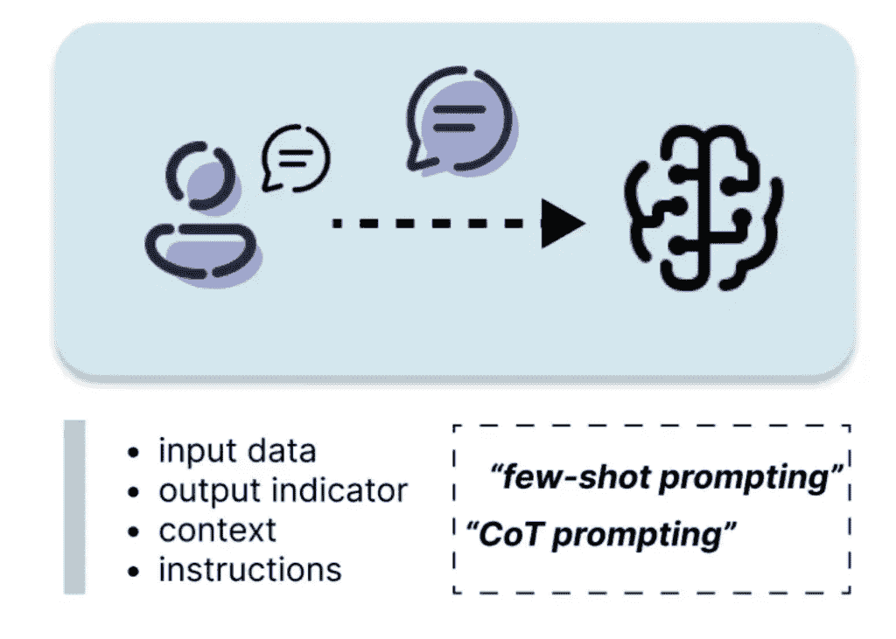
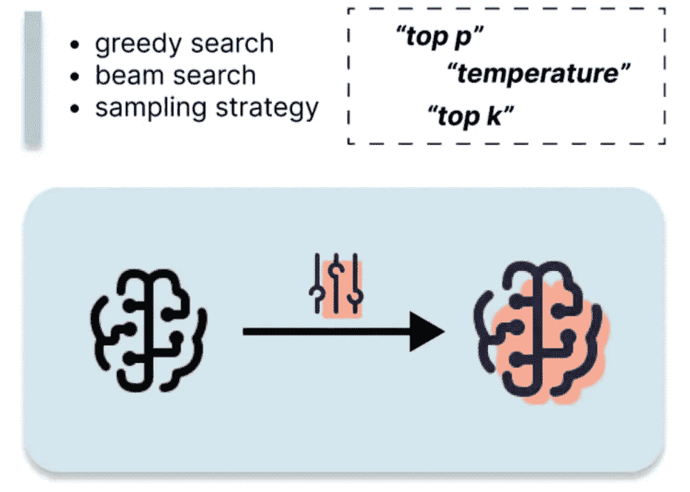
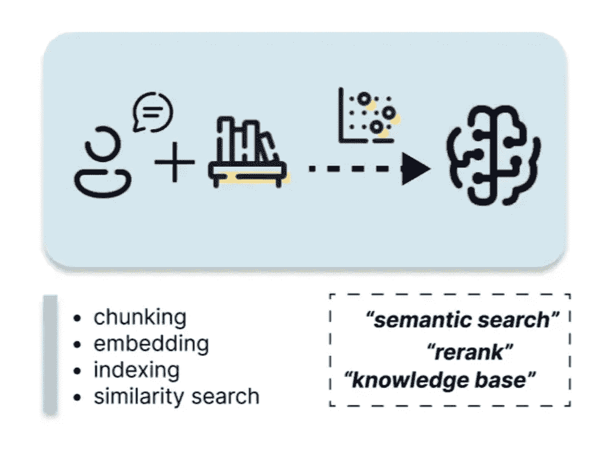
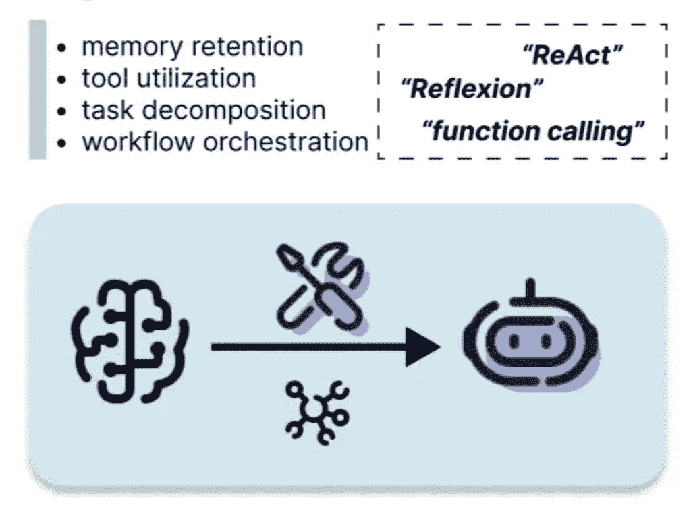
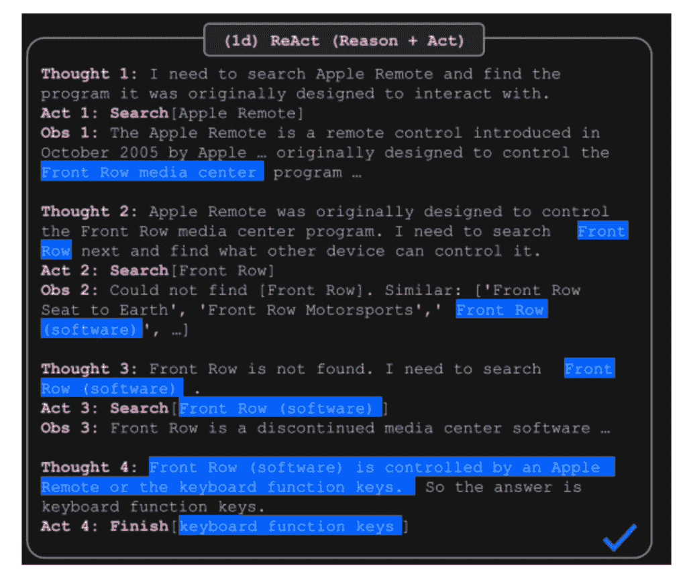
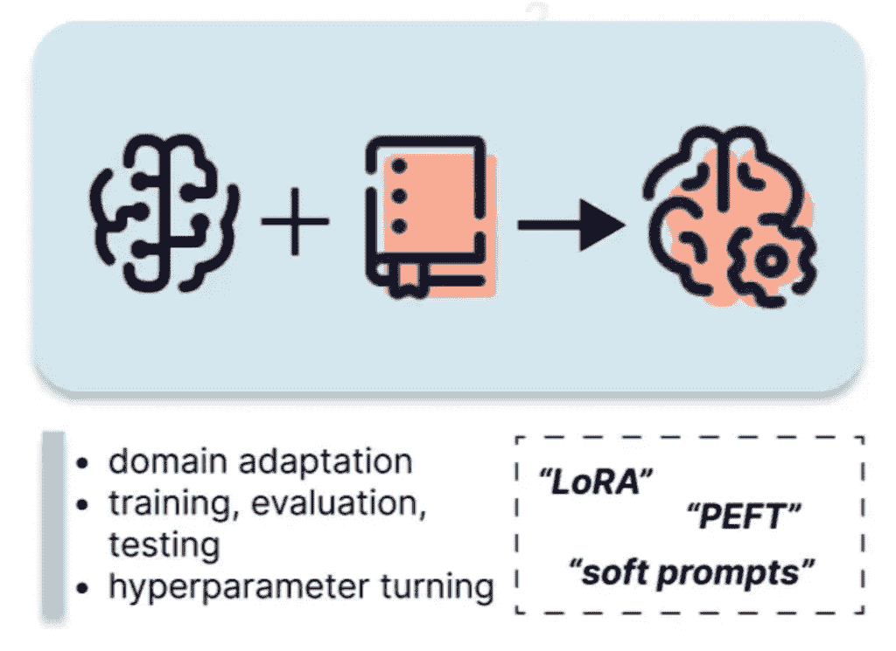
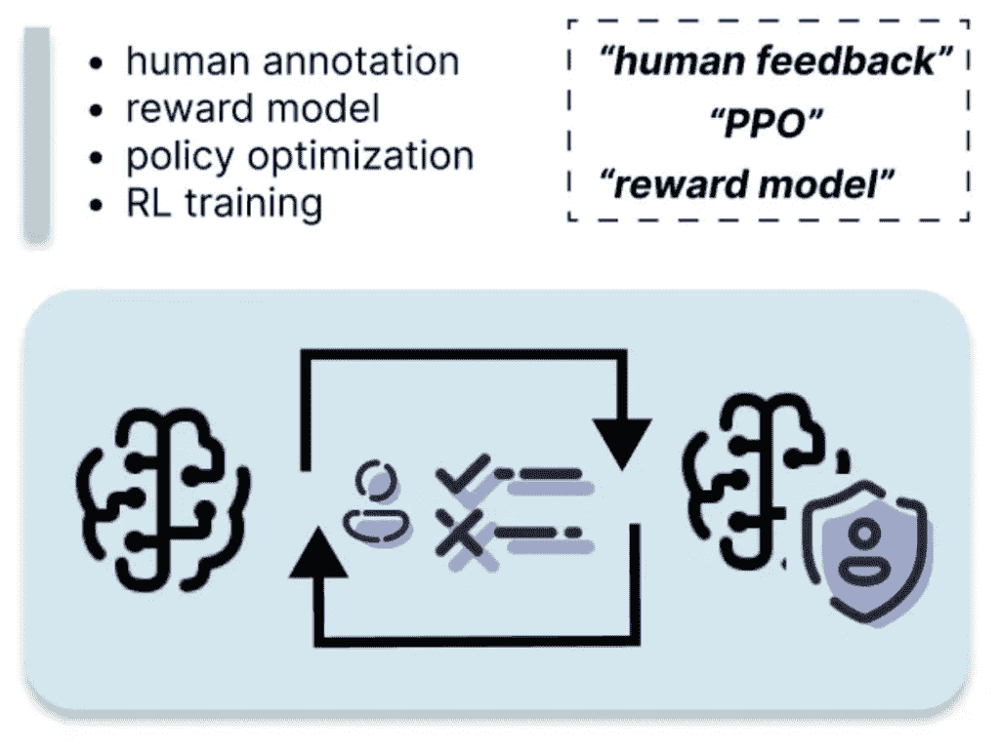

# 简要解释 6 种常见的 LLM 定制策略

> [原文链接](https://towardsdatascience.com/6-common-llm-customization-strategies-briefly-explained/)

## **为什么需要定制 LLMs？**

大型语言模型（LLMs）是基于自监督学习预训练的深度学习模型，需要大量的训练数据、训练时间和大量参数。LLMs 在自然语言处理领域，尤其是在过去两年中，已经实现了革命性的变化，展示了在理解和生成类似人类文本方面的显著能力。然而，这些通用模型的开箱即用性能可能并不总是满足特定的商业需求或领域要求。LLMs 本身无法回答依赖于专有公司数据或闭卷设置的问题，这使得它们在应用上相对通用。由于需要大量的训练数据和资源，因此从头开始训练 LLM 模型对于中小型团队来说基本上是不可行的。因此，近年来开发了一系列广泛的 LLM 定制策略，以调整模型以适应各种需要专业知识的应用场景。

定制策略可以大致分为两种类型：

+   使用冻结模型：这些技术不需要更新模型参数，通常通过上下文学习或提示工程来完成。由于它们在不产生大量训练成本的情况下改变模型的行为，因此具有成本效益，因此在工业界和学术界都得到了广泛探索，并且每天都有新的研究论文发表。

+   更新模型参数：这是一种相对资源密集的方法，需要使用为特定目的设计的定制数据集来调整预训练的 LLM。这包括像微调（Fine-Tuning）和基于人类反馈的强化学习（RLHF）这样的流行技术。

这两种广泛的定制范例衍生出各种专门的技巧，包括 LoRA 微调、思维链（Chain of Thought）、检索增强生成（Retrieval Augmented Generation）、ReAct 和代理框架。每种技术都提供了关于计算资源、实现复杂性和性能改进方面的独特优势和权衡。

本文也以视频形式提供[在此](https://www.youtube.com/watch?v=jFlQoDTb1Fg)

## **如何选择 LLMs？**

定制 LLM 的第一步是选择合适的基线模型。基于社区的平台，例如“Huggingface”，提供了一系列由顶级公司或社区贡献的开源预训练模型，例如 Meta 的 Llama 系列和 Google 的 Gemini。Huggingface 还提供了排行榜，例如“[Open LLM Leaderboard](https://huggingface.co/spaces/open-llm-leaderboard/open_llm_leaderboard#/)”，用于根据行业标准指标和任务（例如 MMLU）比较 LLM。云服务提供商（例如 AWS）和 AI 公司（例如 OpenAI 和 Anthropic）也提供对专有模型的访问，这些通常是付费服务，且访问受限。选择 LLM 时，以下因素是必须考虑的。

**开源或专有模型：** 开源模型允许完全定制和自托管，但需要技术专长，而专有模型提供即时访问和通常更好的质量响应，但成本更高。

**任务和指标：** 模型擅长不同的任务，包括问答、摘要、代码生成等。比较基准指标，并在特定领域任务上进行测试，以确定适当的模型。

**架构：** 通常，仅解码器模型（GPT 系列）在文本生成方面表现更好，而编码器-解码器模型（T5）在翻译方面表现良好。还有更多架构正在出现并显示出有希望的结果，例如混合专家（MoE）模型“DeepSeek”。

**参数数量和大小：** 较大的模型（70B-175B 参数）提供更好的性能，但需要更多的计算能力。较小的模型（7B-13B）运行更快，成本更低，但可能功能有所减少。

在确定基础 LLM 之后，让我们探索 6 种最常见的 LLM 定制策略，按资源消耗从最少到最多排序：

+   提示工程

+   解码和采样策略

+   检索增强生成

+   代理

+   微调

+   人类反馈强化学习

如果你更喜欢这些概念的视频演示，请查看我的关于“[6 Common LLM Customization Strategies Briefly Explained](https://youtu.be/jFlQoDTb1Fg)”的视频。

## **LLM 定制技术**

### **1. 提示工程**



提示是将输入文本发送给 LLM 以引发 AI 生成响应的文本，它可以由指令、上下文、输入数据和输出指标组成。

**指令：** 这提供了任务描述或模型应如何执行的操作说明。

**上下文：** 这是外部信息，用于指导模型在特定范围内进行响应。

**输入数据：** 这是您希望获得响应的输入。

**输出指标：** 这指定了输出类型或格式。

提示工程涉及战略性地构建这些提示组件，以塑造和控制模型的响应。基本的提示工程技术包括零样本、单样本和少样本提示。用户可以直接在交互 LLM 时实现基本的提示工程技术，使其成为一种将模型行为与新颖目标对齐的高效方法。API 实现也是一种选择，更多细节在我之前的文章“[一个简单的将 LLM 提示与知识图谱集成的管道](https://medium.com/gitconnected/a-simple-pipeline-for-integrating-llm-prompt-with-knowledge-graph-cc6ef4954d40)”中介绍。

由于提示工程的效率和有效性，探索和开发了更复杂的方法来推进提示的逻辑结构。

**思维链（CoT）**要求大型语言模型将复杂的推理任务分解成逐步的思维过程，从而提高多步问题的性能。每个步骤都会明确地展示其推理结果，这作为其后续步骤的前置上下文，直到得出答案。

**思维树**从 CoT 扩展而来，通过考虑多个不同的推理分支和自我评估选择来决定下一步的最佳行动。对于涉及初始决策、未来策略和多个解决方案探索的任务，它更为有效。

**自动推理和工具使用（ART）**建立在 CoT 过程之上，它分解复杂任务，并允许模型从任务库中选择少量示例，使用预定义的外部工具（如搜索和代码生成）。

**推理与行动协同（ReAct）**将推理轨迹与行动空间相结合，模型在行动空间中搜索，并根据环境观察确定下一步的最佳行动。

CoT 和 ReAct 等技术通常与代理工作流程结合使用，以增强其能力。这些技术将在“代理”部分中详细介绍。

**进一步阅读**

+   [思维链提示引发大型语言模型中的推理](https://arxiv.org/abs/2201.11903)

+   [思维树：使用大型语言模型进行深思熟虑的问题解决](https://arxiv.org/abs/2305.10601)

+   [ART：大型语言模型的自动多步推理和工具使用](https://arxiv.org/abs/2303.09014)

+   [ReAct：在语言模型中协同推理和行动](https://arxiv.org/abs/2210.03629)

+   [一个简单的将 LLM 提示与知识图谱集成的管道](https://medium.com/gitconnected/a-simple-pipeline-for-integrating-llm-prompt-with-knowledge-graph-cc6ef4954d40)

### **2. 解码和采样策略**



解码策略可以通过推理参数（例如温度、top p、top k）在模型推理时进行控制，从而确定模型响应的随机性和多样性。**贪婪搜索、束搜索和采样**是自回归模型生成的三种常见解码策略。 ****

在自回归生成过程中，LLM 根据由前一个标记条件化的候选标记的概率分布逐个输出一个标记。默认情况下，**贪婪搜索**被应用于生成具有最高概率的下一个标记。

相比之下，**束搜索解码**考虑多个最佳下一个标记的假设，并选择在整个文本序列中所有标记上具有最高组合概率的假设。下面的代码片段使用 transformers 库在模型生成过程中指定束路径的数量（例如，num_beams=5 表示考虑 5 个不同的假设）。

```py
from transformers import AutoModelForCausalLM, AutoTokenizer

tokenizer = AutoTokenizer.from_pretrained(tokenizer_name)
inputs = tokenizer(prompt, return_tensors="pt")

model = AutoModelForCausalLM.from_pretrained(model_name)
outputs = model.generate(**inputs, num_beams=5)
```

**采样策略**是控制模型响应随机性的第三种方法，通过调整这些推理参数来实现：

+   **温度**：降低温度通过增加生成高概率单词的可能性并减少生成低概率单词的可能性，使概率分布更加尖锐。当温度 = 0 时，它等同于贪婪搜索（最不具创造性）；当温度 = 1 时，产生最具创造性的输出。

+   **Top K 采样**：这种方法过滤掉 K 个最可能的下一个标记，并将概率重新分配给这些标记。然后模型从这个过滤后的标记集中进行采样。

+   **Top P 采样**：与从 K 个最可能的标记中进行采样不同，top-p 采样从累积概率超过阈值 p 的最小标记集中进行选择。

下面的示例代码片段从累积概率高于 0.95（top_p=0.95）的前 50 个最可能的标记（top_k=50）中进行采样。

```py
sample_outputs = model.generate(
    **model_inputs,
    max_new_tokens=40,
    do_sample=True,
    top_k=50,
    top_p=0.95,
    num_return_sequences=3,
) 
```

**进一步阅读**

+   [文本生成策略](https://huggingface.co/docs/transformers/en/generation_strategies)

+   [如何生成文本：使用 Transformers 进行语言生成的不同解码方法](https://huggingface.co/blog/how-to-generate)

+   [使用推理参数进行影响响应生成](https://docs.aws.amazon.com/bedrock/latest/userguide/inference-parameters.html)

### **3. RAG**



检索增强生成（或 RAG），最初在论文“Retrieval-Augmented Generation for Knowledge-Intensive NLP Tasks”中提出，已被证明是一个有希望的解决方案，它将外部知识集成在一起，并在处理特定领域或专业查询时减少了常见的 LLM“幻觉”问题。RAG 允许动态地从知识领域检索相关信息，并且通常不需要进行大量训练来更新 LLM 参数，这使得它成为将通用 LLM 适应特定领域的一种成本效益策略。

一个 RAG 系统可以被分解为检索和生成阶段。检索过程的目的是通过分块外部知识、创建嵌入、索引和相似度搜索，在知识库中找到与用户查询密切相关的内容。

1.  分块：文档被分成更小的片段，每个片段包含一个独特的信息单元。

1.  创建嵌入：嵌入模型将每个信息块压缩成向量表示。用户查询也通过相同的向量化过程转换为向量表示，以便用户查询可以在相同的维度空间中进行比较。

1.  索引：此过程将这些文本块及其向量嵌入存储为键值对，从而实现高效且可扩展的搜索功能。对于超出内存容量的大型外部知识库，向量数据库提供了高效的长期存储。

1.  相似度搜索：计算查询嵌入和文本块嵌入之间的相似度得分，这些得分用于搜索与用户查询高度相关的信息。

RAG 系统的**生成过程**将检索到的信息与用户查询结合，形成增强查询，然后将其解析到 LLM 以生成内容丰富的响应。

**代码片段**

代码片段首先指定 LLM 和嵌入模型，然后执行将外部知识库`documents`分块成一系列`document`的步骤。从`document`创建`index`，基于`index`定义`query_engine`，并用用户提示查询`query_engine`。

```py
from llama_index.llms.openai import OpenAI
from llama_index.embeddings.openai import OpenAIEmbedding
from llama_index.core import VectorStoreIndex

Settings.llm = OpenAI(model="gpt-3.5-turbo")
Settings.embed_model="BAAI/bge-small-en-v1.5"

document = Document(text="\\n\\n".join([doc.text for doc in documents]))
index = VectorStoreIndex.from_documents([document])                                    
query_engine = index.as_query_engine()
response = query_engine.query(
    "Tell me about LLM customization strategies."
)
```

上面的例子展示了一个简单的 RAG 系统。高级 RAG 通过引入预检索和后检索策略来减少检索和生成过程之间协同作用有限等陷阱。例如，重排序技术使用能够理解双向上下文的模型重新排序检索到的信息，并与知识图集成以实现高级查询路由。更多用例可以在[llamaindex](https://docs.llamaindex.ai/en/stable/understanding/rag/)网站上找到。

**进一步阅读**

+   [RAG 简介](https://docs.llamaindex.ai/en/stable/understanding/rag/)

+   [问答（RAG）](https://docs.llamaindex.ai/en/stable/use_cases/q_and_a/#question-answering-rag)

+   [知识密集型 NLP 任务的检索增强生成](https://arxiv.org/abs/2005.11401)

+   [大型语言模型的检索增强生成：综述](https://arxiv.org/abs/2312.10997)

### **4. 代理**



LLM Agent 在 2024 年是一个热门话题，并可能在 2025 年继续成为 GenAI 领域的主要焦点。与 RAG 相比，Agent 在创建查询路由和规划基于 LLM 的工作流程方面表现出色，具有以下优势：

+   维护先前模型生成响应的内存和状态。

+   根据特定标准利用各种工具。这种工具使用能力使代理与基本的 RAG 系统区分开来，因为它使 LLM 能够独立控制工具选择。

+   将复杂任务分解成更小的步骤，并规划一系列动作。

+   与其他代理协作，形成一个协调的系统。

几种上下文学习技术（例如 CoT、ReAct）可以通过 Agentic 框架实现，我们将在更多细节中讨论 ReAct。ReAct 代表“在语言模型中协同推理和行动”，由三个关键元素组成 **– 动作**、**想法**和**观察**。这个框架由谷歌研究在普林斯顿大学引入，基于思维链，通过将推理步骤与动作空间相结合，使工具使用和函数调用成为可能。此外，ReAct 框架强调根据环境观察确定下一个最佳动作。

原始论文中的这个例子展示了 ReAct 的内部工作流程，其中 LLM 生成第一个想法，并通过调用“搜索 [Apple Remote]”的函数来行动，然后观察其第一个输出的反馈。第二个想法基于之前的观察，因此导致不同的动作“搜索 [Front Row]”。这个过程一直迭代，直到达到目标。研究表明，ReAct 通过与简单的维基百科 API 交互，克服了在思维链推理中常见的幻觉和错误传播问题。此外，通过实现决策跟踪，ReAct 框架还增加了模型的可解释性、可信度和可诊断性。



*“ReAct: 在语言模型中协同推理和行动” (Yu et. al., 2022) 的示例*

**代码片段**

这展示了使用 `llamaindex` 的基于 ReAct 的代理实现。首先，它定义了两个函数（`multiply` 和 `add`）。其次，这两个函数被封装为 `FunctionTool`，形成代理的动作空间，并基于其推理执行。

```py
from llama_index.core.agent import ReActAgent
from llama_index.core.tools import FunctionTool

# create basic function tools
def multiply(a: float, b: float) -> float:
    return a * b
multiply_tool = FunctionTool.from_defaults(fn=multiply)

def add(a: float, b: float) -> float:
    return a + b
add_tool = FunctionTool.from_defaults(fn=add)

agent = ReActAgent.from_tools([multiply_tool, add_tool], llm=llm, verbose=True)
```

当与自我反思或自我纠正相结合时，Agentic 工作流程的优势更为显著。这是一个不断增长的领域，正在探索各种代理架构。例如，**Reflexion** 框架通过提供环境口头反馈的摘要并存储反馈在模型记忆中，促进迭代学习；**CRITIC** 框架使冻结的 LLM 通过与外部工具（如代码解释器和 API 调用）交互来自我验证。

**进一步阅读**

+   [Llamaindex: 代理](https://docs.llamaindex.ai/en/stable/use_cases/agents/)

+   [AgentWorkflow 基本介绍](https://docs.llamaindex.ai/en/stable/examples/agent/agent_workflow_basic/)

+   [Nvidia: LLM 代理简介](https://developer.nvidia.com/blog/introduction-to-llm-agents/)

### **5. 微调**



微调是将特定和专业的数据集输入到 LLM 中，以修改 LLM 使其更符合特定目标的过程。它与提示工程和 RAG 不同，因为它允许更新 LLM 的权重和参数。完全微调是指通过反向传播更新预训练 LLM 的所有权重，这需要大量内存来存储所有权重和参数，并且可能在其他任务上（即灾难性遗忘）能力显著下降。因此，**PEFT（或参数高效微调）**更广泛地用于减轻这些缺点，同时节省模型训练的时间和成本。PEFT 方法有三种类型：

+   **选择性**：选择初始 LLM 参数的子集进行微调，这与其他 PEFT 方法相比可能需要更多的计算量。

+   **重新参数化**：通过训练低秩表示的权重来调整模型权重。例如，低秩自适应（LoRA）属于这一类别，通过用两个较小的矩阵表示权重更新来加速微调。

+   **添加**：向模型添加额外的可训练层，包括适配器和软提示等技术

微调过程类似于深度学习训练过程，需要以下输入：

+   训练和评估数据集

+   训练参数定义了超参数，例如学习率、优化器

+   预训练 LLM 模型

+   计算算法应优化的指标和目标函数

**代码片段**

下面是使用 transformer Trainer 实现微调的示例。

```py
from transformers import TrainingArguments, Trainer

training_args = TrainingArguments(
		output_dir=output_dir,
		learning_rate=1e-5,
		eval_strategy="epoch"
)

trainer = Trainer(
    model=model,
    args=training_args,
    train_dataset=train_dataset,
    eval_dataset=eval_dataset,
    compute_metrics=compute_metrics,
)

trainer.train()
```

微调有广泛的应用场景。例如，指令微调通过训练提示完成对对来优化 LLM 以进行对话和遵循指令。另一个例子是领域自适应，这是一种无监督的微调方法，有助于 LLM 在特定知识领域专业化。

**进一步阅读**

+   [微调预训练模型](https://huggingface.co/docs/transformers/training)

+   [PEFT：LLM 的参数高效微调方法](https://huggingface.co/blog/samuellimabraz/peft-methods)

### **6. RLHF**



从人类反馈中进行强化学习，或 RLHF，是一种基于人类偏好的强化学习技术，它通过微调 LLM 来优化 LLM。RLHF 通过基于人类反馈训练**奖励模型**并使用此模型作为奖励函数，通过 PPO（近端策略优化）优化强化学习策略。此过程需要两组训练数据：用于训练奖励模型的**偏好数据集**和用于强化学习循环中的**提示数据集**。

让我们将其分解为步骤：

1.  收集由人类标注者标注的**偏好数据集**，这些标注者根据人类偏好对模型生成的不同完成项进行评分。偏好数据集的一个示例格式是`{input_text, candidate1, candidate2, human_preference}`，表示哪个候选响应更受欢迎。

1.  使用偏好数据集训练**奖励模型**，奖励模型本质上是一个回归模型，输出一个标量，表示模型生成响应的质量。奖励模型的目标是最大化获胜候选者和失败候选者之间的分数。

1.  在强化学习循环中使用奖励模型微调 LLM。目标是更新策略，使得 LLM 可以生成最大化奖励模型的奖励的响应。这个过程利用了**提示数据集**，这是一个包含格式为`{prompt, response, rewards}`的提示集合。

**代码片段**

开源库 Trlx 在实现 RLHF 方面得到了广泛应用，他们提供了一个模板代码，展示了基本的 RLHF 设置：

1.  从预训练检查点初始化基础模型和分词器

1.  配置 PPO 超参数`PPOConfig`，如学习率、训练轮数和批量大小

1.  通过组合模型、分词器和训练数据创建 PPO 训练器`PPOTrainer`

1.  训练循环使用`step()`方法迭代更新模型，以优化从`query`和模型`response`计算出的`rewards`

```py
# trl: Transformer Reinforcement Learning library
from trl import PPOTrainer, PPOConfig, AutoModelForSeq2SeqLMWithValueHead
from trl import create_reference_model
from trl.core import LengthSampler

# initiate the pretrained model and tokenizer
model = AutoModelForCausalLMWithValueHead.from_pretrained(config.model_name)
tokenizer = AutoTokenizer.from_pretrained(config.model_name)

# define the hyperparameters of PPO algorithm
config = PPOConfig(
    model_name=model_name,    
    learning_rate=learning_rate,
    ppo_epochs=max_ppo_epochs,
    mini_batch_size=mini_batch_size,
    batch_size=batch_size
)

# initiate the PPO trainer with reference to the model
ppo_trainer = PPOTrainer(
	config=config, 
	model=ppo_model, 
  tokenizer=tokenizer, 
  dataset=dataset["train"],
  data_collator=collator
)                      

# ppo_trainer is iteratively updated through the rewards
ppo_trainer.step(query_tensors, response_tensors, rewards)
```

RLHF 广泛应用于使模型响应与人类偏好一致。常见用例包括减少响应的毒性以及模型的幻觉。然而，它也有缺点，需要大量的人类标注数据以及与策略优化相关的计算成本。因此，引入了从 AI 反馈的强化学习和直接偏好优化（DPO）等替代方案来减轻这些限制。

**进一步阅读**

+   [trl: 使用强化学习训练 transformer 语言模型](https://github.com/huggingface/trl/tree/main)

+   [PPO Trainer](https://huggingface.co/docs/trl/v0.7.4/en/ppo_trainer#using-the-ppotrainer)

+   [人类反馈的强化学习综述](https://arxiv.org/abs/2312.14925)

## **要点**

本文简要介绍了六种必要的 LLM 定制策略，包括提示工程、解码策略、RAG、代理、微调和 RLHF。希望您能从中找到帮助，了解每种策略的优缺点以及如何根据实际示例实现它们。
