# 揭示空间可变基因：空间转录组学的统计视角

> [原文链接](https://towardsdatascience.com/unraveling-spatially-variable-genes-a-statistical-perspective-on-spatial-transcriptomics/)

\[\]

*本文由加州大学洛杉矶分校统计学和数据科学专业的博士研究生 Guanao Yan 撰写。Guanao 是《自然通讯》综述文章[1]的第一作者。*

空间解析转录组学（SRT）通过允许在保留空间背景的情况下进行基因表达的高通量测量，正在改变基因组学。与捕获转录组而不包含空间位置信息的单细胞 RNA 测序（scRNA-seq）不同，SRT 允许研究人员将基因表达映射到组织内的精确位置，从而深入了解组织结构、细胞相互作用和空间协调的基因活动。SRT 数据的数量和复杂性不断增加，需要开发稳健的统计和计算方法，这使得该领域对数据科学家、统计学家和机器学习（ML）专业人士来说高度相关。空间统计、基于图模型和深度学习等技术已被应用于从这些数据中提取有意义的生物学见解。

SRT 分析的一个关键步骤是检测空间可变基因（SVGs）——这些基因的表达在空间位置上不是随机变化的。识别 SVGs 对于表征组织结构、功能基因模块和细胞异质性至关重要。然而，尽管 SVG 检测的计算方法发展迅速，但这些方法在定义和统计框架上差异很大，导致结果不一致和解释上的挑战。

在我们最近发表在《自然通讯》杂志上的综述文章[1]中，我们系统地评估了 34 种同行评审的 SVG 检测方法，并介绍了一个分类框架，该框架阐明了不同 SVG 类型的生物学意义。本文概述了我们的发现，重点关注 SVG 的三个主要类别及其检测背后的统计原理。

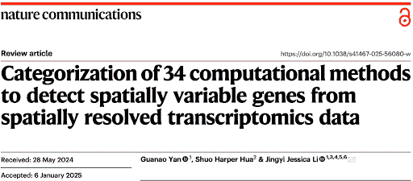

SVG 检测方法的目的是揭示那些空间表达反映生物模式而不是技术噪声的基因。根据我们对 34 种同行评审方法的回顾，我们将 SVG 分为三类：总体 SVG、细胞类型特异性 SVG 和空间域标记 SVG（图 2）。

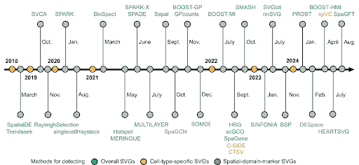

由作者创建的图像，改编自[1]。34 种 SVG 检测方法的出版时间线。颜色代表三个 SVG 类别：总体 SVG（绿色）、细胞类型特异性 SVG（红色）和空间域标记 SVG（紫色）。

检测三种 SVG 类别的方 法服务于不同的目的（图 3）。首先，整体 SVGs 的检测筛选出下游分析的有用基因，包括识别空间域和功能基因模块。其次，检测细胞类型特定的 SVGs 旨在揭示细胞类型内的空间变异，并帮助识别细胞类型内的不同细胞亚群或状态。第三，空间域标记 SVG 检测用于寻找标记基因来注释和解释已检测到的空间域。这些标记有助于理解空间域背后的分子机制，并有助于在其他数据集中注释组织层。

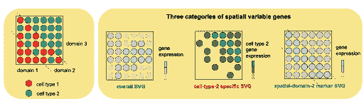

由作者创建的图像，改编自[1]。三种 SVG 类别的概念可视化：整体 SVGs、细胞类型特定的 SVGs 和空间域标记 SVGs。左侧列显示包含两种细胞类型和三个空间域的组织切片。右侧列显示示例基因，颜色代表整体 SVG、细胞类型特定的 SVG 和空间域标记 SVG 的表达水平。

三种 SVG 类别之间的关系取决于检测方法，尤其是它们采用的零假设和备择假设。如果一个整体 SVG 检测方法使用零假设，即非 SVG 的表达与空间位置无关，以及备择假设，即任何偏离这种独立性的偏差表明存在 SVG，那么其 SVGs 理论上应包括细胞类型特定的 SVGs 和空间域标记 SVGs。例如，DESpace [2] 是一种检测整体 SVGs 和空间域标记 SVGs 的方法，其检测到的整体 SVGs 必须是某些空间域的标记基因。这种包含关系在极端情况下除外，例如当基因表现出相反的细胞类型特定空间模式，从而相互抵消。然而，如果一个整体 SVG 检测方法的备择假设是为特定的空间表达模式定义的，那么其 SVGs 可能不包括某些细胞类型特定的 SVGs 或空间域标记 SVGs。

要了解 SVG 是如何被检测到的，我们将统计方法分为三种主要的假设检验类型：

1.  依赖性测试——检验基因表达水平与空间位置之间的依赖性。

1.  回归固定效应测试——检验某些或所有固定效应协变量，例如空间位置，是否对响应变量的均值有贡献，即基因的表达。

1.  回归随机效应测试（方差成分测试）——检验随机效应协变量，例如空间位置，是否对响应变量的方差有贡献，即基因的表达。

为了进一步解释这些测试如何用于 SVG 检测，我们用 𝑌 表示基因的表达水平，用 𝑆 表示空间位置。依赖性测试是 SVG 检测中最一般的假设检验。对于一个给定的基因，它决定基因的表达水平 𝑌 是否独立于空间位置 𝑆，即零假设是：

存在两种回归测试类型：固定效应测试，其中假设空间位置的影响是固定的，以及随机效应测试，假设空间位置的影响是随机的。为了解释这两种测试类型，我们以一个给定基因的线性混合模型为例：

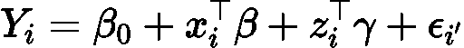

其中响应变量 \( Y_i \) 是位置 \( i \) 的基因表达水平，\( x_i \) \( \epsilon \) \( R^p \) 表示位置 \( i \) 的固定效应协变量，\( z_i \) \( \epsilon \) \( R^q \) 表示位置 \( i \) 的随机效应协变量，\( \epsilon_i \) 是位置 \( i \) 的随机测量误差，均值为零。在模型参数中，\( \beta_0 \) 是（固定）截距，\( \beta \) \( \epsilon \) \( R^p \) 表示固定效应，\( \gamma \) \( \epsilon \) \( R^q \) 表示随机效应，均值为零，协方差矩阵为：

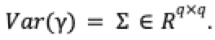

在这个线性混合模型中，假设随机效应和随机误差之间以及随机误差之间是独立的。

固定效应测试检查某些或所有固定效应协变量 \( x_i \)（依赖于空间位置 *S*）是否对响应变量的均值有贡献。如果所有固定效应协变量都没有贡献，那么：

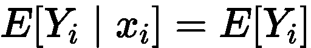

零假设

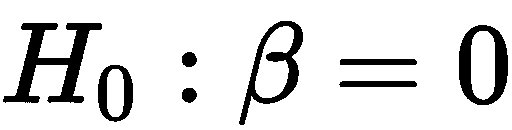

implies

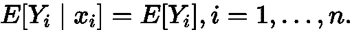

随机效应测试检查随机效应协变量 \( z_i \)（依赖于空间位置 *S*）是否对响应变量的方差 Var⁡Yi 有贡献，重点关注分解：

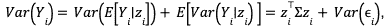

并测试随机效应协变量的贡献是否为零。零假设：

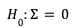

implies

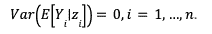

在使用频率主义假设检验的 23 种方法中，依赖性测试和随机效应回归测试主要用于检测整体 SVG，而固定效应回归测试则用于所有三个 SVG 类别。理解这些区别对于选择适合特定研究问题的正确方法是关键。

改进 SVG 检测方法需要在解决空间转录组学分析中的关键挑战的同时，平衡检测能力、特异性和可扩展性。未来的发展应侧重于将方法适应不同的 SRT 技术和组织类型，以及扩展对多样本 SRT 数据的支持，以增强生物学见解。此外，加强统计严谨性和验证框架对于确保 SVG 检测的可靠性至关重要。基准测试研究也需要改进，需要更清晰的评估指标和标准化的数据集，以提供稳健的方法比较。

### **参考文献**

[1] Yan, G., Hua, S.H. & Li, J.J. (2025). 从空间分辨转录组数据中检测空间可变基因的 34 种计算方法的分类。*自然通讯*，16，1141。[`doi.org/10.1038/s41467-025-56080-w`](https://doi.org/10.1038/s41467-025-56080-w)

[2] Cai, P., Robinson, M. D., & Tiberi, S. (2024). DESpace：通过空间簇的差异表达测试进行空间可变基因检测。Bioinformatics，40(2)。https://doi.org/10.1093/bioinformatics/btae027
