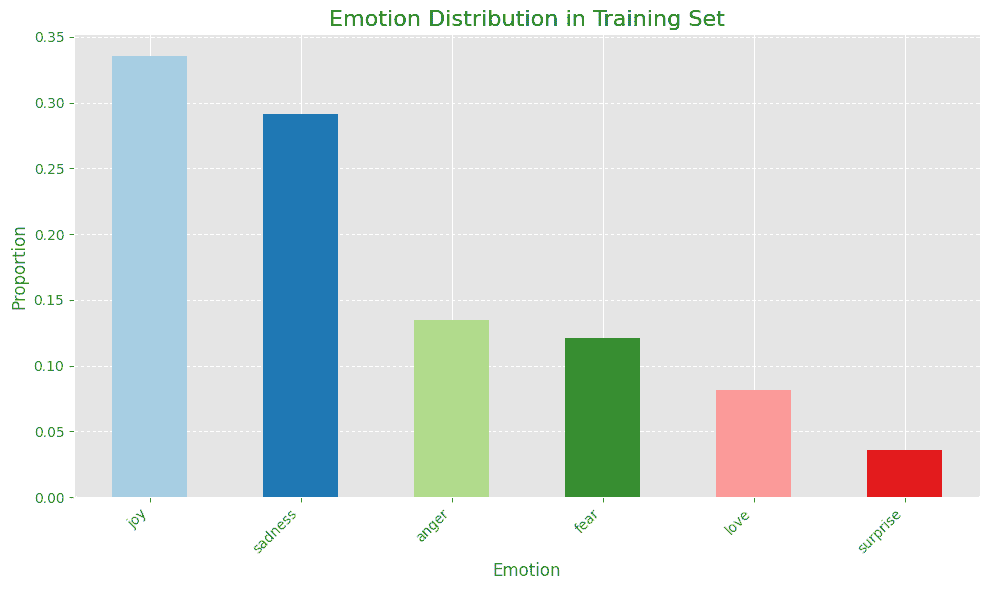
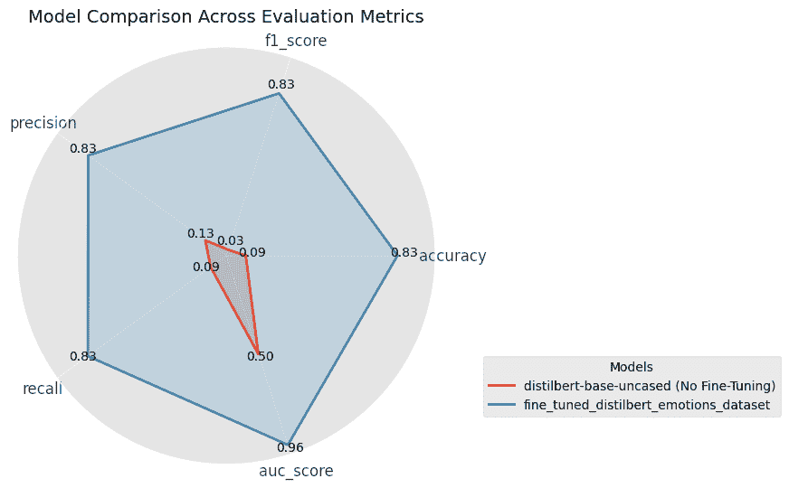
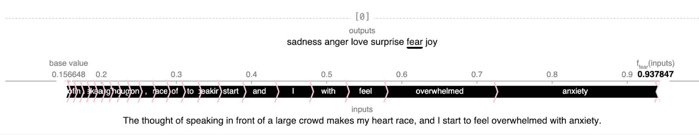

# 如何微调 DistilBERT 进行情感分类

> [如何微调 DistilBERT 进行情感分类](https://towardsdatascience.com/how-to-fine-tune-distilbert-for-emotion-classification/)

在我工作的每家公司，客户支持团队都因客户咨询量的巨大而陷入困境。你有过类似的经历吗？

如果我告诉你，你可以使用 AI 自动**识别**、**分类**甚至**解决**最常见的常见问题呢？

通过微调 BERT 这样的 transformer 模型，你可以构建一个自动化的系统，根据问题类型标记工单并将它们路由到正确的团队。

在这个教程中，我将展示如何通过五个步骤微调一个用于情感分类的 transformer 模型：

1.  **设置你的环境**：准备你的数据集并安装必要的库。

1.  **加载数据并进行预处理**：解析文本文件并组织你的数据。

1.  **微调 DistilBERT**：使用你的数据集训练模型以分类情感。

1.  **评估性能**：使用准确率、F1 分数和混淆矩阵等指标来衡量模型性能。

1.  **解释预测**：使用 SHAP（SHapley Additive exPlanations）可视化和理解预测。

到最后，你将拥有一个经过微调的模型，能够以高精度从文本输入中分类情感，你还将学习如何使用 SHAP 来解释这些预测。

这种相同的方法可以应用于情感分类以外的现实世界用例，如客户支持自动化、情感分析、内容审核等。

让我们开始吧！

## 选择合适的 Transformer 模型

当选择用于**文本分类**的 transformer 模型时，以下是对最常见模型的快速概述：

+   **BERT**：非常适合通用 NLP 任务，但在训练和推理方面计算成本较高。

+   **DistilBERT**：比 BERT 快 60%，同时保留了 97%的功能，使其非常适合实时应用。

+   **RoBERTa**：BERT 的一个更健壮的版本，但需要更多的资源。

+   **XLM-RoBERTa**：在 100 种语言上训练的 RoBERTa 的多语言变体。它非常适合多语言任务，但资源消耗相当大。

对于这个教程，我选择微调 DistilBERT，因为它在性能和效率之间提供了最佳平衡。

### **第一步：设置和安装依赖项**

确保你已经安装了所需的库：

```py
!pip install datasets transformers torch scikit-learn shap
```

### **第二步：加载数据并进行预处理**

我使用了 Praveen Govi 提供的[情感数据集](https://www.kaggle.com/datasets/praveengovi/emotions-dataset-for-nlp)，可在 Kaggle 上找到，并且[商业用途许可](https://creativecommons.org/licenses/by-sa/4.0/)。该数据集包含带有情感标签的文本。数据包含三个`.txt`文件：**训练集**、**验证集**和**测试集**。

每一行包含一个句子及其对应的情感标签，由分号分隔：

```py
text; emotion
"i didnt feel humiliated"; "sadness"
"i am feeling grouchy"; "anger"
"im updating my blog because i feel shitty"; "sadness"
```

### **将数据集解析为 Pandas DataFrame**

让我们加载数据集：

```py
def parse_emotion_file(file_path):
"""
    Parses a text file with each line in the format: {text; emotion}
    and returns a pandas DataFrame with 'text' and 'emotion' columns.

    Args:
    - file_path (str): Path to the .txt file to be parsed

    Returns:
    - df (pd.DataFrame): DataFrame containing 'text' and 'emotion' columns
    """
    texts = []
    emotions = []

    with open(file_path, 'r', encoding='utf-8') as file:
        for line in file:
            try:
                # Split each line by the semicolon separator
                text, emotion = line.strip().split(';')

                # append text and emotion to separate lists
                texts.append(text)
                emotions.append(emotion)
            except ValueError:
                continue

    return pd.DataFrame({'text': texts, 'emotion': emotions})

# Parse text files and store as Pandas DataFrames
train_df = parse_emotion_file("train.txt")
val_df = parse_emotion_file("val.txt")
test_df = parse_emotion_file("test.txt")
```

### **理解标签分布**

此数据集包含**16k 个训练示例**和 **2k 个示例**用于验证和测试。以下是标签分布的分解：



图片由作者提供。

上面的条形图显示，数据集**不平衡**，大多数样本标签为快乐和悲伤。

对于微调生产模型，我会考虑尝试不同的采样技术来克服这个类别不平衡问题，并提高模型的表现。

### **步骤 3：分词和数据预处理**

接下来，我加载了 DistilBERT 的分词器：

```py
from transformers import AutoTokenizer

# Define the model path for DistilBERT
model_name = "distilbert-base-uncased"

# Load the tokenizer
tokenizer = AutoTokenizer.from_pretrained(model_name)
```

然后，我使用它对文本数据进行分词，并将标签转换为数值 ID：

```py
# Tokenize data
def preprocess_function(df, label2id):
    """
    Tokenizes text data and transforms labels into numerical IDs.

    Args:
        df (dict or pandas.Series): A dictionary-like object containing "text" and "emotion" fields.
        label2id (dict): A mapping from emotion labels to numerical IDs.

    Returns:
        dict: A dictionary containing:
              - "input_ids": Encoded token sequences
              - "attention_mask": Mask to indicate padding tokens
              - "label": Numerical labels for classification

    Example usage:
        train_dataset = train_dataset.map(lambda x: preprocess_function(x, tokenizer, label2id), batched=True)
    """
    tokenized_inputs = tokenizer(
        df["text"],
        padding="longest",
        truncation=True,
        max_length=512,
        return_tensors="pt"
    )

    tokenized_inputs["label"] = [label2id.get(emotion, -1) for emotion in df["emotion"]]
    return tokenized_inputs

# Convert the DataFrames to HuggingFace Dataset format
train_dataset = Dataset.from_pandas(train_df)

# Apply the 'preprocess_function' to tokenize text data and transform labels
train_dataset = train_dataset.map(lambda x: preprocess_function(x, label2id), batched=True)
```

### **步骤 4：微调模型**

接下来，我加载了一个带有分类头的预训练 DistilBERT 模型用于我们的文本分类任务。我还指定了此数据集的标签看起来像什么：

```py
# Get the unique emotion labels from the 'emotion' column in the training DataFrame
labels = train_df["emotion"].unique()

# Create label-to-id and id-to-label mappings
label2id = {label: idx for idx, label in enumerate(labels)}
id2label = {idx: label for idx, label in enumerate(labels)}

# Initialize model
model = AutoModelForSequenceClassification.from_pretrained(
    model_name,
    num_labels=len(labels),
    id2label=id2label,
    label2id=label2id
)
```

用于分类的预训练 DistilBERT 模型由**五层加上一个分类头**组成。

为了防止过拟合，我**冻结了前四层**，保留了预训练期间学习到的知识。这允许模型保留对通用语言的理解，同时仅微调第五层和分类头以适应我的数据集。以下是我是如何做到这一点的：

```py
# freeze base model parameters
for name, param in model.base_model.named_parameters():
    param.requires_grad = False

# keep classifier trainable
for name, param in model.base_model.named_parameters():
    if "transformer.layer.5" in name or "classifier" in name:
        param.requires_grad = True
```

### **定义指标**

考虑到标签不平衡，我认为准确率可能不是最合适的指标，所以我选择了其他适合分类问题的指标，如精确率、召回率、F1 分数和 AUC 分数。

我还使用了“加权”平均法来计算 F1 分数、精确率和召回率，以解决类别不平衡问题。此参数确保所有类别按比例对指标做出贡献，并防止任何单个类别主导结果：

```py
def compute_metrics(p):
    """
    Computes accuracy, F1 score, precision, and recall metrics for multiclass classification.

    Args:
    p (tuple): Tuple containing predictions and labels.

    Returns:
    dict: Dictionary with accuracy, F1 score, precision, and recall metrics, using weighted averaging
          to account for class imbalance in multiclass classification tasks.
    """
    logits, labels = p

    # Convert logits to probabilities using softmax (PyTorch)
    softmax = torch.nn.Softmax(dim=1)
    probs = softmax(torch.tensor(logits))

    # Convert logits to predicted class labels
    preds = probs.argmax(axis=1)

    return {
        "accuracy": accuracy_score(labels, preds),  # Accuracy metric
        "f1_score": f1_score(labels, preds, average='weighted'),  # F1 score with weighted average for imbalanced data
        "precision": precision_score(labels, preds, average='weighted'),  # Precision score with weighted average
        "recall": recall_score(labels, preds, average='weighted'),  # Recall score with weighted average
        "auc_score": roc_auc_score(labels, probs, average="macro", multi_class="ovr")
    }
```

让我们设置训练过程：

```py
# Define hyperparameters
lr = 2e-5
batch_size = 16
num_epochs = 3
weight_decay = 0.01

# Set up training arguments for fine-tuning models
training_args = TrainingArguments(
    output_dir="./results",
    evaluation_strategy="steps",
    eval_steps=500,
    learning_rate=lr,
    per_device_train_batch_size=batch_size,
    per_device_eval_batch_size=batch_size,
    num_train_epochs=num_epochs,
    weight_decay=weight_decay,
    logging_dir="./logs",
    logging_steps=500,
    load_best_model_at_end=True,
    metric_for_best_model="eval_f1_score",
    greater_is_better=True,
)

# Initialize the Trainer with the model, arguments, and datasets
trainer = Trainer(
    model=model,
    args=training_args,
    train_dataset=train_dataset,
    eval_dataset=val_dataset,
    tokenizer=tokenizer,
    compute_metrics=compute_metrics,
)

# Train the model
print(f"Training {model_name}...")
trainer.train()
```

### **步骤 5：评估模型性能**

训练完成后，我在测试集上评估了模型的表现：

```py
# Generate predictions on the test dataset with fine-tuned model
predictions_finetuned_model = trainer.predict(test_dataset)
preds_finetuned = predictions_finetuned_model.predictions.argmax(axis=1)

# Compute evaluation metrics (accuracy, precision, recall, and F1 score)
eval_results_finetuned_model = compute_metrics((predictions_finetuned_model.predictions, test_dataset["label"]))
```

这是微调后的 DistilBERT 模型在测试集上的表现，与预训练的基础模型相比：



*微调后的 DistilBERT 模型的雷达图。图片由作者提供*。

在微调之前，预训练模型在我们的数据集上表现不佳，因为它之前没有见过特定的情绪标签。它本质上是在随机猜测，正如反映在 AUC 分数为 0.5 的结果所示，这表明没有比机会更好的表现。

微调后，模型在所有指标上均显著**提升**，正确识别情绪的准确率达到 83%。这表明模型已成功从数据中学习到有意义的模式，即使只有 16k 个训练样本。

这太棒了！

### **步骤 6：使用 SHAP 解释预测**

我在三个句子上测试了微调后的模型，以下是它预测的情绪：

1.  “*站在一大群人面前讲话的想法让我心跳加速，我开始感到焦虑不堪*。” → 恐惧 😱

1.  *“我简直不敢相信他们多么无礼！我在这项项目上投入了大量的努力，他们甚至没有听就驳回了它。这太令人愤怒了！”* → 愤怒 😡

1.  *“我真的很喜欢这款新手机！摄像头质量惊人，电池续航一整天，而且速度非常快。我对我的购买非常满意，并且强烈推荐给任何寻找新手机的人。”* → 快乐 😀

非常棒，对吧？!

我想了解模型是如何做出预测的，所以我使用了 [SHAP](https://shap.readthedocs.io/en/latest/example_notebooks/text_examples/sentiment_analysis/Emotion%20classification%20multiclass%20example.html)（Shapley 加性解释）来可视化特征重要性。

我从创建一个解释说明开始：

```py
# Build a pipeline object for predictions
preds = pipeline(
    "text-classification",
    model=model_finetuned,
    tokenizer=tokenizer,
    return_all_scores=True,
)

# Create an explainer
explainer = shap.Explainer(preds)
```

然后，我使用解释说明计算 SHAP 值：

```py
# Compute SHAP values using explainer
shap_values = explainer(example_texts)

# Make SHAP text plot
shap.plots.text(shap_values)
```

下面的图展示了使用 SHAP 值如何可视化输入文本中的每个单词对模型输出的贡献：



SHAP 文本图。图片由作者提供。

在这种情况下，该图显示“焦虑”是预测“恐惧”情感的最重要因素。

SHAP 文本图是一种很好的、直观的、交互式的方式来理解预测，通过分解每个单词对最终预测的影响程度来理解。

## **总结**

你已经成功学会了如何从文本数据中微调 DistilBERT 进行情感分类！（你可以在 Hugging Face [这里](https://huggingface.co/ds-claudia/classify_emotions_into_six_categories_with_distilbert)查看模型）。

Transformer 模型可以微调以适应许多现实世界的应用，包括：

+   标记客户服务工单（如引言中所述），

+   在基于文本的对话中标记心理健康风险，

+   在产品评论中检测情感。

微调是一种有效且高效的方法，可以将强大的预训练模型适应到具有相对较小数据集的特定任务中。

你接下来要微调什么？

* * *

**想要提升你的 AI 技能吗？**

👉🏻 我运营着 [**AI 周末**](http://aiweekender.substack.com/) 并撰写关于数据科学、AI 周末项目、数据专业人士职业建议的每周博客文章。

* * *

**资源**

+   Jupyter 笔记本 [[HERE](https://colab.research.google.com/drive/1qlL6TteEnPMqHHfUGTQXEKcXFJ2qAcKO?authuser=3#scrollTo=3Vd6BWqGLYmP)]

+   Hugging Face 上的模型卡片 [[HERE](https://huggingface.co/ds-claudia/classify_emotions_into_six_categories_with_distilbert)]
