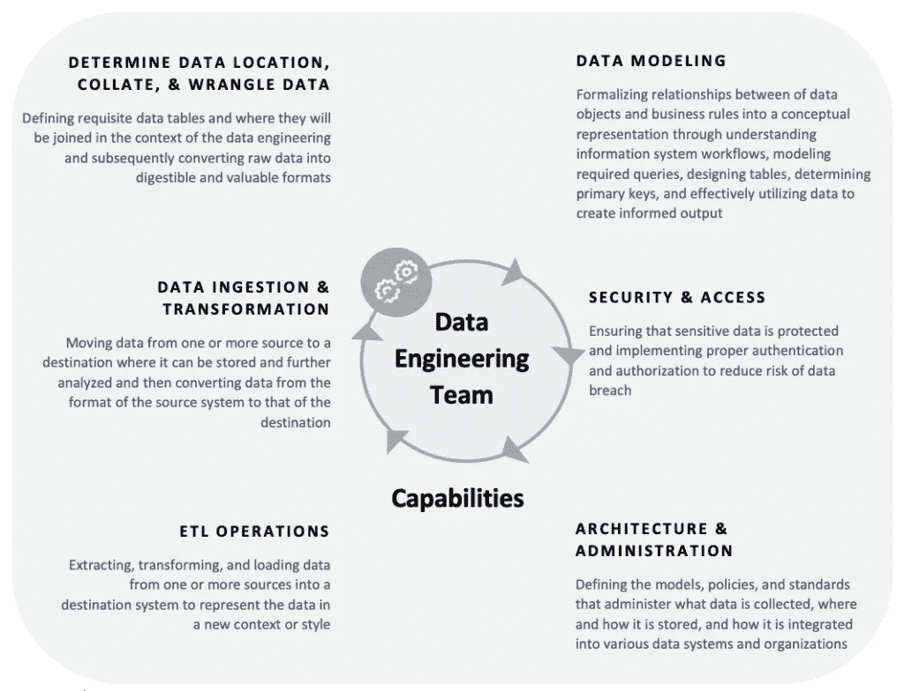

# 建立卓越的数据工程中心

> [建立卓越的数据工程中心](https://towardsdatascience.com/building-a-data-engineering-center-of-excellence/)

随着数据的重要性持续增长和复杂性增加，对熟练数据工程师的需求从未如此之大。但数据工程是什么，为什么它如此重要？在这篇博客文章中，我们将讨论有效数据工程实践的基本组成部分，以及为什么数据工程今天对商业越来越关键，以及如何建立你自己的卓越数据工程中心！

我有幸多年来建立、管理、领导和培养了一支庞大的、表现优异的数据仓库和 ELT 工程师团队。在我的团队的帮助下，我每年都投入了大量时间，有意识地规划和准备管理我们数据的月度增长，并解决我们 20000 多名全球数据消费者不断变化的报告和分析需求。我们建立了许多数据仓库来存储和集中来自许多 OLTP 源的大量数据。我们通过创建星型模式在我们的本地数据仓库和云中的数据仓库中实施了 Kimball 方法。

目标是使我们的用户群能够快速进行数据分析和报告；因此，我们的分析师社区和商业用户可以做出准确的数据驱动决策。

我大约花了三年时间将**团队**（复数）数据仓库和 ETL 程序员转变为一个统一的数据工程团队。

*我在本文中整理了一些我在建立全球数据工程团队中的学习经验，希望所有技术熟练程度的数据专业人士和领导者都能从中受益。*

## 数据工程师的演变

现在成为数据工程师从未有过更好的时机。在过去十年中，我们见证了企业对数据的认识发生了巨大的觉醒，现在他们认识到数据是公司的脉搏，使数据工程成为确保准确、及时和高质量数据流向依赖它的解决方案的工作职能。

从历史上看，数据工程师的角色已经从**数据仓库开发者**和**ETL/ELT 开发者**（提取、转换和加载）演变而来。

数据仓库开发者负责设计、构建、开发、管理和维护数据仓库以满足企业的报告需求。这主要是通过从运营和交易系统中提取数据，并使用提取、转换、加载方法（ETL/ELT）将其传输到存储层，如数据仓库或数据湖来完成的。数据仓库或数据湖是数据分析师、数据科学家和商业用户消费数据的地方。开发者还执行转换，以确保摄入的数据符合具有聚合数据的数据模型，以便于分析。

> 数据工程师的首要责任是生产并确保数据安全地供多个消费者使用。

数据工程师负责监督数据在组织各个部分的摄入、转换、建模、交付和流动。数据提取来自许多不同的数据源和应用。数据工程师将数据加载到数据仓库和数据湖中，这些数据不仅用于数据科学和预测分析项目（正如大家喜欢谈论的那样），而且主要为了数据分析师。数据分析师和数据科学家在提供的数据上进行运营报告、探索性分析、基于服务级别协议（SLA）的商业智能报告和仪表板。在这本书中，我们将讨论所有这些工作职能。

数据工程师的角色是获取、存储和聚合来自云和本地、新系统和现有系统的数据，同时进行数据建模和可行的数据架构。没有数据工程师，分析师和数据科学家将没有有价值的数据来工作，因此，数据工程师是每个新数据团队成立时首先被雇佣的人。根据企业内部可用的数据和数据分析工具，数据工程团队的角色描述、结构和方法有几种选择，我们将在这章中讨论它们应该包含在职责中的内容。

## 数据工程团队

软件越来越多地自动化数据工程师历史上手动和繁琐的任务。数据处理工具和技术在过去的几年中已经发生了巨大的演变，并将继续增长。例如，基于云的数据仓库（例如 Snowflake）已经使数据存储和处理变得经济实惠且快速。数据管道服务（如[Informatica IICS](https://www.informatica.com/blogs/welcome-to-informatica-intelligent-cloud-services.html)、[Apache Airflow](https://airflow.apache.org/)、[Matillion](https://www.matillion.com/)、[Fivetran](http://fivetran.com/））已经将数据提取变成了可以快速高效完成的工作。数据工程团队应该利用这些技术作为倍增器，采取一致和协调的方法来整合和管理企业数据，而不仅仅是依赖传统的孤岛式方法来构建脆弱、性能不佳、难以维护的定制数据管道。继续采用后一种方法将阻碍该企业内的创新步伐，并迫使未来的焦点转向管理数据基础设施问题，而不是如何帮助为您的业务创造价值。

企业数据工程团队的主要职责应该是将原始数据**转换成适合分析的形式**——为现实世界的分析和数据科学应用奠定基础。

数据工程团队应作为企业级数据的 ***图书管理员***，负责整理组织的数据，并为希望利用这些数据的人提供资源，例如报告与分析团队、数据科学团队以及其他利用企业数据平台进行更多自助或业务组驱动的分析的小组。这个团队应作为组织知识的 ***监护人***，管理和完善目录，以便更有效地进行数据分析。让我们来看看一个高效数据工程团队的基本责任。

## 数据工程团队的责任

数据工程团队应在企业内部提供一种**共享能力**，跨越报告/分析和数据科学能力，提供访问清洁、转换、格式化、可扩展和安全的、为分析准备好的数据。数据工程团队的核心责任应包括：

> · 构建、管理和优化核心数据平台基础设施
> 
> · 从各种结构化和非结构化来源构建和维护定制和现成的数据集成和摄取管道
> 
> · 管理整体数据管道编排
> 
> · 通过技术流程和业务逻辑在原始数据加载前后管理数据的转换
> 
> · 支持分析团队进行数据仓库的设计和性能优化

***数据是企业资产。***

***数据作为资产应被共享和保护。***

数据应被视为企业资产，跨所有业务单元利用，通过加速决策制定，并借助数据提高竞争优势来增强公司对其客户群的价值。良好的数据管理、法律和监管要求规定，我们必须保护数据资产，防止未经授权的访问和泄露。

换句话说，***管理安全是一个至关重要的责任。***

## 为什么创建一个集中的数据工程团队？

将数据工程视为标准和核心能力，它支撑着分析和数据科学能力，这将帮助企业演变如何处理数据和数据分析的方法。企业需要停止根据涉及的技术堆栈垂直处理数据，因为我们经常看到，并转向更多横向管理的方法，即管理一个**数据织物**或**网状层**，它可以跨越组织并能够根据需要连接到各种技术以推动分析项目。这是一种新的思考和工作方式，但它在各种数据组织寻求扩展时可以推动效率。此外——为数据工程资源创建一个专门的架构和职业路径是有价值的。数据工程技能在市场上需求很高；因此，在公司外招聘可能会很昂贵。公司必须使程序员、数据库管理员和软件开发人员通过在技术之间工作获得所需的经验，以获得上述定义的技能集，从而获得职业路径。通常，建立一个优秀的数据工程中心或能力中心是使这种进步成为可能的第一步。

## 创建集中式数据工程团队的挑战

将数据工程团队集中作为服务方法与报告与分析以及数据科学团队的操作方式不同。在原则上，这意味着**放弃一定程度的资源控制权**，并建立新的流程，以指导这些团队如何协作并共同工作以交付项目。

数据工程团队需要证明它能够有效地支持报告与分析以及数据科学团队的需求，无论这些团队有多大。数据工程团队必须在确保他们能够带来正确的技能集和经验的同时，**有效地优先处理工作负载**。

数据工程是必不可少的，因为它作为数据驱动型公司的骨架。它使分析师能够使用干净、组织良好的数据，这对于得出见解和做出明智的决策至关重要。要建立一个有效的数据工程实践，你需要以下关键组件：

# 优秀的数据工程中心

数据工程团队应成为企业的一个核心能力，但它应有效地作为几乎涉及所有数据相关的支持功能。它应与报告与分析以及数据科学团队以协作支持的角色互动，以使整个团队成功。

数据工程团队**不直接创造商业价值**——但价值应体现在使报告与分析、数据科学团队更高效和高效，以确保通过数据与分析项目向业务利益相关者提供最大价值。为此，数据工程能力中心内的六个关键职责如下——

数据工程卓越中心 — 作者图片。

让我们回顾一下**六个责任支柱**：

**1. 确定整理和整理的中心数据位置**

理解并制定**数据湖**（*一个用于大量数据消费的集中式数据存储库或数据仓库，用于分析*）的策略。在数据工程背景下定义所需的数据表以及它们将如何连接，随后将原始数据转换为可消化和有价值的格式。

**2. 数据摄取和转换**

将数据从一个或多个来源移动到新的目的地（*你的数据湖或云数据仓库*）*，在那里它可以被存储并进一步分析，然后将数据从源系统的格式转换为目标系统的格式

**3. ETL/ELT 操作**

从一个或多个来源提取、转换和加载数据到目标系统，以在新上下文或风格中表示数据。

**4. 数据建模**

数据建模是数据工程团队的一个基本功能，尽管并非所有数据工程师都擅长这一能力。通过理解信息系统工作流程、建模所需查询、设计表、确定主键和有效地利用数据来创建有见地的输出，将数据对象和业务规则之间的关系形式化为概念表示。

我在面试中看到工程师在这方面犯的错误比在技术讨论中的编码错误还要多。理解维度、事实、聚合表之间的区别是至关重要的。

**5. 安全和访问**

确保敏感数据得到保护，并实施适当的身份验证和授权，以降低数据泄露的风险。

**6. 架构和管理**

定义模型、政策和标准，以管理收集哪些数据、在哪里以及如何存储这些数据，以及如何将这些数据集成到各种分析系统中。

> 数据工程能力中心的六个责任支柱集中在确定一个中心数据位置用于整理和整理、摄取和转换数据、执行 ETL/ELT 操作、建模数据、确保访问权限和管理架构的能力。虽然所有公司在这些功能方面都有自己的特定需求，但确保你的团队具备必要的技能集，以建立大数据成功的基础是重要的。

除了数据工程之外，企业内还需要考虑以下其他能力中心：

## 分析能力中心

分析能力中心使公司能够实现一致、有效和高效的 BI、分析和高级分析能力。通过报告、分析和仪表板解决方案，协助业务部门进行分类、优先排序并实现其目标和目标，同时提供运营报告和可视化、自助分析和自动化生成此类洞察所需的工具。

## 数据科学能力中心

数据科学能力中心旨在探索前沿技术和概念，以解锁新的洞察和机遇，更好地告知员工，并利用自动化的 AI 和自动化的 ML 解决方案（如[H2O.ai](https://medium.com/u/9aea625dfc27?source=post_page---user_mention--b83d51cedb6a---------------------------------------)、[Dataiku](https://medium.com/u/27e43843bc9f?source=post_page---user_mention--b83d51cedb6a---------------------------------------)、[Aible](http://www.aible.com/)、DataRobot、[C3.ai](https://medium.com/u/3aaaf223f1e?source=post_page---user_mention--b83d51cedb6a---------------------------------------)）创造一种指导性信息使用的文化。

## 数据治理

数据治理办公室通过提供可信、理解及时的数据来赋能用户，以保持数据完整性和神圣性，使其在大量消费时掌握在合适的手中。

* * *

> *随着您的公司不断发展壮大，您将需要确保数据工程能力到位，以支持六个责任支柱。通过这样做，您将能够确保数据管理和分析的各个方面都得到覆盖，并且您的数据对需要它的人来说是安全和可访问的。您开始思考您公司如何发展了吗？您采取了哪些步骤来建立一个集中的数据工程团队？*

感谢您的阅读！
