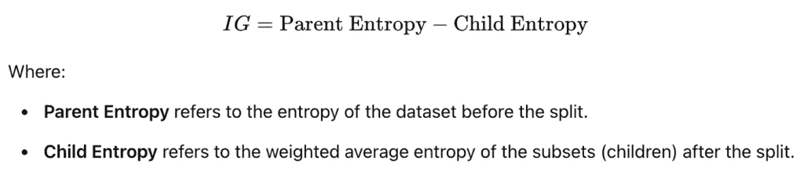
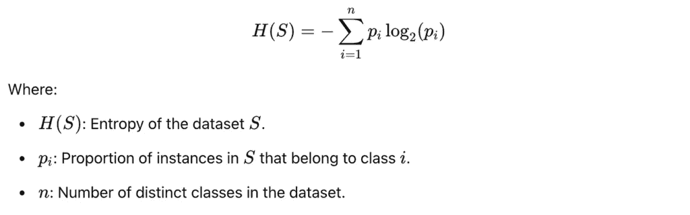
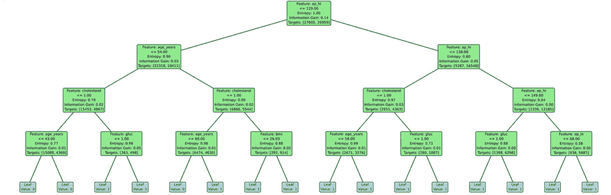
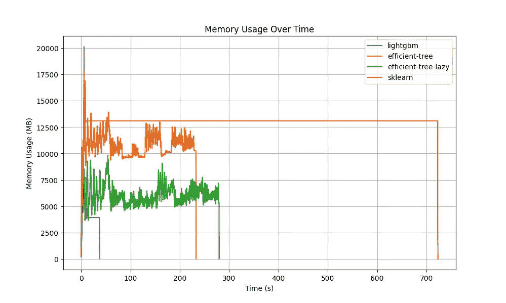

# 从零开始构建 Polars 中的决策树

> [原文链接](https://towardsdatascience.com/build-a-decision-tree-in-polars-from-scratch/)

决策树算法一直让我着迷。它们易于实现，在各种分类和回归任务上都能取得良好的效果。结合提升算法，决策树在许多应用中仍然是前沿技术。

如 sklearn、lightgbm、xgboost 和 catboost 等框架至今为止都做得非常好。然而，在过去的几个月里，我一直缺少对 arrow 数据集的支持。虽然 lightgbm 最近增加了对该格式的支持，但大多数其他框架仍然缺少这一功能。arrow 数据格式对于决策树来说可能是一个完美的匹配，因为它具有优化的列式结构，适用于高效的数据处理。Pandas 已经增加了对该格式的支持，而 Polars 也利用了这些优势。

Polars 在性能上已经显示出相对于大多数其他数据框架的优势。它高效地使用数据，避免了不必要的复制。它还提供了一个流式引擎，允许处理比内存更大的数据。这就是我决定使用 Polars 作为从头构建决策树的后端的原因。

目标是探索使用 Polars 进行决策树的优势，包括内存和运行时。当然，还要学习更多关于 Polars、高效定义表达式和流式引擎的知识。

实现的代码可以在本[仓库](https://github.com/tocab/efficient-trees)中找到。

## 代码概述

为了对代码有一个初步的了解，我将首先展示`DecisionTreeClassifier`的结构：

第一个重要的事情可以在导入部分看到。对我来说，保持导入部分简洁并且尽可能减少依赖是很重要的。通过只依赖 polars、pickle 和 typing，这一目标已经实现。

`init`方法允许定义是否应该使用 Polars 流式引擎。此外，还可以在这里设置树的`max_depth`。在定义分类列时还有一个特性。这些列的处理方式与数值特征不同，使用目标编码进行处理。

可以保存和加载决策树模型。它以嵌套字典的形式表示，可以保存为磁盘上的 pickle 文件。

Polars 的魔法在于`fit()`和`build_tree()`方法。这些方法接受 LazyFrames 和 DataFrames，以支持内存处理和流式处理。

有两种预测方法可用，`predict()`和`predict_many()`。`predict()`方法可以用于小规模示例，数据需要以字典的形式提供。如果我们有一个大的测试集，使用`predict_many()`方法会更高效。在这里，数据可以提供为 polars DataFrame 或 LazyFrame。

```py
import pickle
from typing import Iterable, List, Union

import polars as pl

class DecisionTreeClassifier:

    def __init__(self, streaming=False, max_depth=None, categorical_columns=None):
        ...

    def save_model(self, path: str) -> None:
        ...

    def load_model(self, path: str) -> None:
        ...

    def apply_categorical_mappings(self, data: Union[pl.DataFrame, pl.LazyFrame]) -> Union[pl.DataFrame, pl.LazyFrame]:
        ...

    def fit(self, data: Union[pl.DataFrame, pl.LazyFrame], target_name: str) -> None:
        ...

    def predict_many(self, data: Union[pl.DataFrame, pl.LazyFrame]) -> List[Union[int, float]]:
        ...

    def predict(self, data: Iterable[dict]):
        ...

    def get_majority_class(self, df: Union[pl.DataFrame, pl.LazyFrame], target_name: str) -> str:
        ...

    def _build_tree(
        self,
        data: Union[pl.DataFrame, pl.LazyFrame],
        feature_names: list[str],
        target_name: str,
        unique_targets: list[int],
        depth: int,
    ) -> dict:
        ...
```

## 调整树

要训练决策树分类器，需要使用`fit()`方法。

```py
def fit(self, data: Union[pl.DataFrame, pl.LazyFrame], target_name: str) -> None:
    """
    Fit method to train the decision tree.

    :param data: Polars DataFrame or LazyFrame containing the training data.
    :param target_name: Name of the target column
    """
    columns = data.collect_schema().names()
    feature_names = [col for col in columns if col != target_name]

    # Shrink dtypes
    data = data.select(pl.all().shrink_dtype()).with_columns(
        pl.col(target_name).cast(pl.UInt64).shrink_dtype().alias(target_name)
    )

    # Prepare categorical columns with target encoding
    if self.categorical_columns:
        categorical_mappings = {}
        for categorical_column in self.categorical_columns:
            categorical_mappings[categorical_column] = {
                value: index
                for index, value in enumerate(
                    data.lazy()
                    .group_by(categorical_column)
                    .agg(pl.col(target_name).mean().alias("avg"))
                    .sort("avg")
                    .collect(streaming=self.streaming)[categorical_column]
                )
            }

        self.categorical_mappings = categorical_mappings
        data = self.apply_categorical_mappings(data)

    unique_targets = data.select(target_name).unique()
    if isinstance(unique_targets, pl.LazyFrame):
        unique_targets = unique_targets.collect(streaming=self.streaming)
    unique_targets = unique_targets[target_name].to_list()

    self.tree = self._build_tree(data, feature_names, target_name, unique_targets, depth=0)
```

它接收一个包含所有特征和目标列的 polars LazyFrame 或 DataFrame。为了识别目标列，需要提供`target_name`。

Polars 提供了一种方便的方式来优化数据的内存使用。

```py
data.select(pl.all().shrink_dtype())
```

因此，选择并评估所有列。它将`dtype`转换为可能的最小值。

## 类别编码

为了编码类别值，使用目标编码。为此，将聚合所有类别特征的实例，并计算平均目标值。然后，按平均目标值对实例进行排序，并分配一个排名。这个排名将用作特征值的表示。

```py
(
  data.lazy()
    .group_by(categorical_column)
    .agg(pl.col(target_name).mean().alias("avg"))
    .sort("avg")
    .collect(streaming=self.streaming)[categorical_column]
)
```

由于可以提供 polars DataFrames 和 LazyFrames，我首先使用`data.lazy()`。如果给定数据是 DataFrame，它将被转换为 LazyFrame。如果它已经是 LazyFrame，它只返回 self。通过这个技巧，可以确保 LazyFrames 和 DataFrames 以相同的方式处理数据，并且可以使用`collect()`方法，这对于 LazyFrames 是唯一的。

为了说明拟合过程中不同步骤的计算结果，我将它应用于一个心脏病预测的数据集。该数据集可在[Kaggle](https://www.kaggle.com/datasets/colewelkins/cardiovascular-disease)上找到，并受数据库内容许可协议的约束。

这里是血糖水平的类别特征表示的示例：

```py
┌──────┬──────┬──────────┐
│ rank ┆ gluc ┆ avg      │
│ ---  ┆ ---  ┆ ---      │
│ u32  ┆ i8   ┆ f64      │
╞══════╪══════╪══════════╡
│ 0    ┆ 1    ┆ 0.476139 │
│ 1    ┆ 2    ┆ 0.586319 │
│ 2    ┆ 3    ┆ 0.620972 │
└──────┴──────┴──────────┘
```

对于每个血糖水平，计算患有心脏病的概率。然后对其进行排序并排名，以便每个水平都映射到一个排名值。

## 获取目标值

作为`fit()`方法的最后一部分，确定唯一的目标值。

```py
unique_targets = data.select(target_name).unique()
if isinstance(unique_targets, pl.LazyFrame):
    unique_targets = unique_targets.collect(streaming=self.streaming)
unique_targets = unique_targets[target_name].to_list()

self.tree = self._build_tree(data, feature_names, target_name, unique_targets, depth=0)
```

这是在递归调用`_build_tree()`方法之前的最后准备工作。

## 构建树

在`fit()`方法中准备数据后，调用`_build_tree()`方法。这是递归进行的，直到满足停止标准，例如，达到树的最大深度。第一次调用是从`fit()`方法执行的，深度为零。

```py
def _build_tree(
        self,
        data: Union[pl.DataFrame, pl.LazyFrame],
        feature_names: list[str],
        target_name: str,
        unique_targets: list[int],
        depth: int,
) -> dict:
    """
    Builds the decision tree recursively.
    If max_depth is reached, returns a leaf node with the majority class.
    Otherwise, finds the best split and creates internal nodes for left and right children.

    :param data: The dataframe to evaluate.
    :param feature_names: Name of the feature columns.
    :param target_name: Name of the target column.
    :param unique_targets: unique target values.
    :param depth: The current depth of the tree.

    :return: A dictionary representing the node.
    """
    if self.max_depth is not None and depth >= self.max_depth:
        return {"type": "leaf", "value": self.get_majority_class(data, target_name)}

    # Make data lazy here to avoid that it is evaluated in each loop iteration.
    data = data.lazy()

    # Evaluate entropy per feature:
    information_gain_dfs = []
    for feature_name in feature_names:
        feature_data = data.select([feature_name, target_name]).filter(pl.col(feature_name).is_not_null())
        feature_data = feature_data.rename({feature_name: "feature_value"})

        # No streaming (yet)
        information_gain_df = (
            feature_data.group_by("feature_value")
            .agg(
                [
                    pl.col(target_name)
                .filter(pl.col(target_name) == target_value)
                .len()
                .alias(f"class_{target_value}_count")
                    for target_value in unique_targets
                ]
                + [pl.col(target_name).len().alias("count_examples")]
            )
            .sort("feature_value")
            .select(
                [
                    pl.col(f"class_{target_value}_count").cum_sum().alias(f"cum_sum_class_{target_value}_count")
                    for target_value in unique_targets
                ]
                + [
                    pl.col(f"class_{target_value}_count").sum().alias(f"sum_class_{target_value}_count")
                    for target_value in unique_targets
                ]
                + [
                    pl.col("count_examples").cum_sum().alias("cum_sum_count_examples"),
                    pl.col("count_examples").sum().alias("sum_count_examples"),
                ]
                + [
                    # From previous select
                    pl.col("feature_value"),
                ]
            )
            .filter(
                # At least one example available
                pl.col("sum_count_examples")
                > pl.col("cum_sum_count_examples")
            )
            .select(
                [
                    (pl.col(f"cum_sum_class_{target_value}_count") / pl.col("cum_sum_count_examples")).alias(
                        f"left_proportion_class_{target_value}"
                    )
                    for target_value in unique_targets
                ]
                + [
                    (
                            (pl.col(f"sum_class_{target_value}_count") - pl.col(f"cum_sum_class_{target_value}_count"))
                            / (pl.col("sum_count_examples") - pl.col("cum_sum_count_examples"))
                    ).alias(f"right_proportion_class_{target_value}")
                    for target_value in unique_targets
                ]
                + [
                    (pl.col(f"sum_class_{target_value}_count") / pl.col("sum_count_examples")).alias(
                        f"parent_proportion_class_{target_value}"
                    )
                    for target_value in unique_targets
                ]
                + [
                    # From previous select
                    pl.col("cum_sum_count_examples"),
                    pl.col("sum_count_examples"),
                    pl.col("feature_value"),
                ]
            )
            .select(
                (
                        -1
                        * pl.sum_horizontal(
                    [
                        (
                                pl.col(f"left_proportion_class_{target_value}")
                                * pl.col(f"left_proportion_class_{target_value}").log(base=2)
                        ).fill_nan(0.0)
                        for target_value in unique_targets
                    ]
                )
                ).alias("left_entropy"),
                (
                        -1
                        * pl.sum_horizontal(
                    [
                        (
                                pl.col(f"right_proportion_class_{target_value}")
                                * pl.col(f"right_proportion_class_{target_value}").log(base=2)
                        ).fill_nan(0.0)
                        for target_value in unique_targets
                    ]
                )
                ).alias("right_entropy"),
                (
                        -1
                        * pl.sum_horizontal(
                    [
                        (
                                pl.col(f"parent_proportion_class_{target_value}")
                                * pl.col(f"parent_proportion_class_{target_value}").log(base=2)
                        ).fill_nan(0.0)
                        for target_value in unique_targets
                    ]
                )
                ).alias("parent_entropy"),
                # From previous select
                pl.col("cum_sum_count_examples"),
                pl.col("sum_count_examples"),
                pl.col("feature_value"),
            )
            .select(
                (
                        pl.col("cum_sum_count_examples") / pl.col("sum_count_examples") * pl.col("left_entropy")
                        + (pl.col("sum_count_examples") - pl.col("cum_sum_count_examples"))
                        / pl.col("sum_count_examples")
                        * pl.col("right_entropy")
                ).alias("child_entropy"),
                # From previous select
                pl.col("parent_entropy"),
                pl.col("feature_value"),
            )
            .select(
                (pl.col("parent_entropy") - pl.col("child_entropy")).alias("information_gain"),
                # From previous select
                pl.col("parent_entropy"),
                pl.col("feature_value"),
            )
            .filter(pl.col("information_gain").is_not_nan())
            .sort("information_gain", descending=True)
            .head(1)
            .with_columns(feature=pl.lit(feature_name))
        )
        information_gain_dfs.append(information_gain_df)

    if isinstance(information_gain_dfs[0], pl.LazyFrame):
        information_gain_dfs = pl.collect_all(information_gain_dfs, streaming=self.streaming)

    information_gain_dfs = pl.concat(information_gain_dfs, how="vertical_relaxed").sort(
        "information_gain", descending=True
    )

    information_gain = 0
    if len(information_gain_dfs) > 0:
        best_params = information_gain_dfs.row(0, named=True)
        information_gain = best_params["information_gain"]

    if information_gain > 0:
        left_mask = data.select(filter=pl.col(best_params["feature"]) <= best_params["feature_value"])
        if isinstance(left_mask, pl.LazyFrame):
            left_mask = left_mask.collect(streaming=self.streaming)
        left_mask = left_mask["filter"]

        # Split data
        left_df = data.filter(left_mask)
        right_df = data.filter(~left_mask)

        left_subtree = self._build_tree(left_df, feature_names, target_name, unique_targets, depth + 1)
        right_subtree = self._build_tree(right_df, feature_names, target_name, unique_targets, depth + 1)

        if isinstance(data, pl.LazyFrame):
            target_distribution = (
                data.select(target_name)
                .collect(streaming=self.streaming)[target_name]
                .value_counts()
                .sort(target_name)["count"]
                .to_list()
            )
        else:
            target_distribution = data[target_name].value_counts().sort(target_name)["count"].to_list()

        return {
            "type": "node",
            "feature": best_params["feature"],
            "threshold": best_params["feature_value"],
            "information_gain": best_params["information_gain"],
            "entropy": best_params["parent_entropy"],
            "target_distribution": target_distribution,
            "left": left_subtree,
            "right": right_subtree,
        }
    else:
        return {"type": "leaf", "value": self.get_majority_class(data, target_name)}
```

此方法是构建树的核心，我将逐步解释。首先，进入方法时，会检查是否满足最大深度停止标准。

```py
if self.max_depth is not None and depth >= self.max_depth:
    return {"type": "leaf", "value": self.get_majority_class(data, target_name)}
```

如果当前深度等于或大于`max_depth`，将返回一个类型为 leaf 的节点。叶节点的值对应于数据的多数类别。这的计算如下：

```py
def get_majority_class(self, df: Union[pl.DataFrame, pl.LazyFrame], target_name: str) -> str:
    """
    Returns the majority class of a dataframe.

    :param df: The dataframe to evaluate.
    :param target_name: Name of the target column.

    :return: majority class.
    """
    majority_class = df.group_by(target_name).len().filter(pl.col("len") == pl.col("len").max()).select(target_name)
    if isinstance(majority_class, pl.LazyFrame):
        majority_class = majority_class.collect(streaming=self.streaming)
    return majority_class[target_name][0]
```

为了得到多数类别，通过目标列分组并使用`len()`聚合来确定每行目标的数量。在多数行中存在的目标实例被返回为多数类别。

## 信息增益作为分割标准

为了找到数据的好分割，使用信息增益。



方程式 1 — 信息增益的计算。图由作者提供。

要获取信息增益，需要计算父熵和子熵。



方程 2 — 熵的计算。图由作者提供。

## 在 Polars 中计算信息增益

对于特征列中存在的每个特征值，都会计算信息增益。

```py
information_gain_df = (
    feature_data.group_by("feature_value")
    .agg(
        [
         pl.col(target_name)
        .filter(pl.col(target_name) == target_value)
        .len()
        .alias(f"class_{target_value}_count")
            for target_value in unique_targets
        ]
        + [pl.col(target_name).len().alias("count_examples")]
    )
    .sort("feature_value")
```

特征值被分组，每个目标值的计数分配给它。此外，保存该特征值的行总数为`count_examples`。在最后一步，数据按`feature_value`排序。这是为了在下一步计算分割。

对于心脏病数据集，在第一步计算之后，数据看起来是这样的：

```py
┌───────────────┬───────────────┬───────────────┬────────────────┐
│ feature_value ┆ class_0_count ┆ class_1_count ┆ count_examples │
│ ---           ┆ ---           ┆ ---           ┆ ---            │
│ i8            ┆ u32           ┆ u32           ┆ u32            │
╞═══════════════╪═══════════════╪═══════════════╪════════════════╡
│ 29            ┆ 2             ┆ 0             ┆ 2              │
│ 30            ┆ 1             ┆ 0             ┆ 1              │
│ 39            ┆ 1068          ┆ 331           ┆ 1399           │
│ 40            ┆ 975           ┆ 263           ┆ 1238           │
│ 41            ┆ 1052          ┆ 438           ┆ 1490           │
│ …             ┆ …             ┆ …             ┆ …              │
│ 60            ┆ 1054          ┆ 1460          ┆ 2514           │
│ 61            ┆ 695           ┆ 1408          ┆ 2103           │
│ 62            ┆ 566           ┆ 1125          ┆ 1691           │
│ 63            ┆ 572           ┆ 1517          ┆ 2089           │
│ 64            ┆ 479           ┆ 1217          ┆ 1696           │
└───────────────┴───────────────┴───────────────┴────────────────┘
```

这里处理的是特征`age_years`。`Class 0`代表“无心脏病”，而`class 1`代表“心脏病”。数据按年龄特征排序，列包含`class 0`、`class 1`和具有相应特征值的示例总数。

在下一步中，为每个特征值计算类别的累积总和。

```py
.select(
    [
        pl.col(f"class_{target_value}_count").cum_sum().alias(f"cum_sum_class_{target_value}_count")
        for target_value in unique_targets
    ]
    + [
        pl.col(f"class_{target_value}_count").sum().alias(f"sum_class_{target_value}_count")
        for target_value in unique_targets
    ]
    + [
        pl.col("count_examples").cum_sum().alias("cum_sum_count_examples"),
        pl.col("count_examples").sum().alias("sum_count_examples"),
    ]
    + [
        # From previous select
        pl.col("feature_value"),
    ]
)
.filter(
    # At least one example available
    pl.col("sum_count_examples")
    > pl.col("cum_sum_count_examples")
)
```

其背后的直觉是，当在特定的特征值上执行分割时，它包括来自较小特征值的目标值的计数。为了能够计算比例，需要计算目标值的总和。对于`count_examples`，也要重复相同的程序，计算累积总和和总和。

计算之后，数据看起来是这样的：

```py
┌──────────────┬─────────────┬─────────────┬─────────────┬─────────────┬─────────────┬─────────────┐
│ cum_sum_clas ┆ cum_sum_cla ┆ sum_class_0 ┆ sum_class_1 ┆ cum_sum_cou ┆ sum_count_e ┆ feature_val │
│ s_0_count    ┆ ss_1_count  ┆ _count      ┆ _count      ┆ nt_examples ┆ xamples     ┆ ue          │
│ ---          ┆ ---         ┆ ---         ┆ ---         ┆ ---         ┆ ---         ┆ ---         │
│ u32          ┆ u32         ┆ u32         ┆ u32         ┆ u32         ┆ u32         ┆ i8          │
╞══════════════╪═════════════╪═════════════╪═════════════╪═════════════╪═════════════╪═════════════╡
│ 3            ┆ 0           ┆ 27717       ┆ 26847       ┆ 3           ┆ 54564       ┆ 29          │
│ 4            ┆ 0           ┆ 27717       ┆ 26847       ┆ 4           ┆ 54564       ┆ 30          │
│ 1097         ┆ 324         ┆ 27717       ┆ 26847       ┆ 1421        ┆ 54564       ┆ 39          │
│ 2090         ┆ 595         ┆ 27717       ┆ 26847       ┆ 2685        ┆ 54564       ┆ 40          │
│ 3155         ┆ 1025        ┆ 27717       ┆ 26847       ┆ 4180        ┆ 54564       ┆ 41          │
│ …            ┆ …           ┆ …           ┆ …           ┆ …           ┆ …           ┆ …           │
│ 24302        ┆ 20162       ┆ 27717       ┆ 26847       ┆ 44464       ┆ 54564       ┆ 59          │
│ 25356        ┆ 21581       ┆ 27717       ┆ 26847       ┆ 46937       ┆ 54564       ┆ 60          │
│ 26046        ┆ 23020       ┆ 27717       ┆ 26847       ┆ 49066       ┆ 54564       ┆ 61          │
│ 26615        ┆ 24131       ┆ 27717       ┆ 26847       ┆ 50746       ┆ 54564       ┆ 62          │
│ 27216        ┆ 25652       ┆ 27717       ┆ 26847       ┆ 52868       ┆ 54564       ┆ 63          │
└──────────────┴─────────────┴─────────────┴─────────────┴─────────────┴─────────────┴─────────────┘
```

在下一步中，为每个特征值计算比例。

```py
.select(
    [
        (pl.col(f"cum_sum_class_{target_value}_count") / pl.col("cum_sum_count_examples")).alias(
            f"left_proportion_class_{target_value}"
        )
        for target_value in unique_targets
    ]
    + [
        (
                (pl.col(f"sum_class_{target_value}_count") - pl.col(f"cum_sum_class_{target_value}_count"))
                / (pl.col("sum_count_examples") - pl.col("cum_sum_count_examples"))
        ).alias(f"right_proportion_class_{target_value}")
        for target_value in unique_targets
    ]
    + [
        (pl.col(f"sum_class_{target_value}_count") / pl.col("sum_count_examples")).alias(
            f"parent_proportion_class_{target_value}"
        )
        for target_value in unique_targets
    ]
    + [
        # From previous select
        pl.col("cum_sum_count_examples"),
        pl.col("sum_count_examples"),
        pl.col("feature_value"),
    ]
)
```

要计算比例，可以使用上一步的结果。对于左比例，每个目标值的累积总和除以示例计数的累积总和。对于右比例，我们需要知道每个目标值右侧有多少示例。这是通过从目标值的总和中减去目标值的累积总和来计算的。相同的计算用于确定右侧示例的总数，通过从示例计数的总和减去示例计数的累积总和。此外，还计算父比例。这是通过将目标值计数的总和除以示例总数来完成的。

这一步的结果数据如下：

```py
┌───────────┬───────────┬───────────┬───────────┬───┬───────────┬───────────┬───────────┬──────────┐
│ left_prop ┆ left_prop ┆ right_pro ┆ right_pro ┆ … ┆ parent_pr ┆ cum_sum_c ┆ sum_count ┆ feature_ │
│ ortion_cl ┆ ortion_cl ┆ portion_c ┆ portion_c ┆   ┆ oportion_ ┆ ount_exam ┆ _examples ┆ value    │
│ ass_0     ┆ ass_1     ┆ lass_0    ┆ lass_1    ┆   ┆ class_1   ┆ ples      ┆ ---       ┆ ---      │
│ ---       ┆ ---       ┆ ---       ┆ ---       ┆   ┆ ---       ┆ ---       ┆ u32       ┆ i8       │
│ f64       ┆ f64       ┆ f64       ┆ f64       ┆   ┆ f64       ┆ u32       ┆           ┆          │
╞═══════════╪═══════════╪═══════════╪═══════════╪═══╪═══════════╪═══════════╪═══════════╪══════════╡
│ 1.0       ┆ 0.0       ┆ 0.506259  ┆ 0.493741  ┆ … ┆ 0.493714  ┆ 3         ┆ 54564     ┆ 29       │
│ 1.0       ┆ 0.0       ┆ 0.50625   ┆ 0.49375   ┆ … ┆ 0.493714  ┆ 4         ┆ 54564     ┆ 30       │
│ 0.754902  ┆ 0.245098  ┆ 0.499605  ┆ 0.500395  ┆ … ┆ 0.493714  ┆ 1428      ┆ 54564     ┆ 39       │
│ 0.765596  ┆ 0.234404  ┆ 0.492739  ┆ 0.507261  ┆ … ┆ 0.493714  ┆ 2709      ┆ 54564     ┆ 40       │
│ 0.741679  ┆ 0.258321  ┆ 0.486929  ┆ 0.513071  ┆ … ┆ 0.493714  ┆ 4146      ┆ 54564     ┆ 41       │
│ …         ┆ …         ┆ …         ┆ …         ┆ … ┆ …         ┆ …         ┆ …         ┆ …        │
│ 0.545735  ┆ 0.454265  ┆ 0.333563  ┆ 0.666437  ┆ … ┆ 0.493714  ┆ 44419     ┆ 54564     ┆ 59       │
│ 0.539065  ┆ 0.460935  ┆ 0.305025  ┆ 0.694975  ┆ … ┆ 0.493714  ┆ 46922     ┆ 54564     ┆ 60       │
│ 0.529725  ┆ 0.470275  ┆ 0.297071  ┆ 0.702929  ┆ … ┆ 0.493714  ┆ 49067     ┆ 54564     ┆ 61       │
│ 0.523006  ┆ 0.476994  ┆ 0.282551  ┆ 0.717449  ┆ … ┆ 0.493714  ┆ 50770     ┆ 54564     ┆ 62       │
│ 0.513063  ┆ 0.486937  ┆ 0.296188  ┆ 0.703812  ┆ … ┆ 0.493714  ┆ 52859     ┆ 54564     ┆ 63       │
└───────────┴───────────┴───────────┴───────────┴───┴───────────┴───────────┴───────────┴──────────┘
```

现在有了比例，可以计算熵。

```py
.select(
    (
            -1
            * pl.sum_horizontal(
        [
            (
                    pl.col(f"left_proportion_class_{target_value}")
                    * pl.col(f"left_proportion_class_{target_value}").log(base=2)
            ).fill_nan(0.0)
            for target_value in unique_targets
        ]
    )
    ).alias("left_entropy"),
    (
            -1
            * pl.sum_horizontal(
        [
            (
                    pl.col(f"right_proportion_class_{target_value}")
                    * pl.col(f"right_proportion_class_{target_value}").log(base=2)
            ).fill_nan(0.0)
            for target_value in unique_targets
        ]
    )
    ).alias("right_entropy"),
    (
            -1
            * pl.sum_horizontal(
        [
            (
                    pl.col(f"parent_proportion_class_{target_value}")
                    * pl.col(f"parent_proportion_class_{target_value}").log(base=2)
            ).fill_nan(0.0)
            for target_value in unique_targets
        ]
    )
    ).alias("parent_entropy"),
    # From previous select
    pl.col("cum_sum_count_examples"),
    pl.col("sum_count_examples"),
    pl.col("feature_value"),
)
```

在计算熵时，使用方程 2。左熵使用左比例计算，右熵使用右比例。对于父熵，使用父比例。在这个实现中，使用`pl.sum_horizontal()`来计算比例的总和，以利用 polars 的可能的优化。这也可以用`python-native sum()`方法替换。

带有熵值的数据看起来如下：

```py
┌──────────────┬───────────────┬────────────────┬─────────────────┬────────────────┬───────────────┐
│ left_entropy ┆ right_entropy ┆ parent_entropy ┆ cum_sum_count_e ┆ sum_count_exam ┆ feature_value │
│ ---          ┆ ---           ┆ ---            ┆ xamples         ┆ ples           ┆ ---           │
│ f64          ┆ f64           ┆ f64            ┆ ---             ┆ ---            ┆ i8            │
│              ┆               ┆                ┆ u32             ┆ u32            ┆               │
╞══════════════╪═══════════════╪════════════════╪═════════════════╪════════════════╪═══════════════╡
│ -0.0         ┆ 0.999854      ┆ 0.999853       ┆ 3               ┆ 54564          ┆ 29            │
│ -0.0         ┆ 0.999854      ┆ 0.999853       ┆ 4               ┆ 54564          ┆ 30            │
│ 0.783817     ┆ 1.0           ┆ 0.999853       ┆ 1427            ┆ 54564          ┆ 39            │
│ 0.767101     ┆ 0.999866      ┆ 0.999853       ┆ 2694            ┆ 54564          ┆ 40            │
│ 0.808516     ┆ 0.999503      ┆ 0.999853       ┆ 4177            ┆ 54564          ┆ 41            │
│ …            ┆ …             ┆ …              ┆ …               ┆ …              ┆ …             │
│ 0.993752     ┆ 0.918461      ┆ 0.999853       ┆ 44483           ┆ 54564          ┆ 59            │
│ 0.995485     ┆ 0.890397      ┆ 0.999853       ┆ 46944           ┆ 54564          ┆ 60            │
│ 0.997367     ┆ 0.880977      ┆ 0.999853       ┆ 49106           ┆ 54564          ┆ 61            │
│ 0.99837      ┆ 0.859431      ┆ 0.999853       ┆ 50800           ┆ 54564          ┆ 62            │
│ 0.999436     ┆ 0.872346      ┆ 0.999853       ┆ 52877           ┆ 54564          ┆ 63            │
└──────────────┴───────────────┴────────────────┴─────────────────┴────────────────┴───────────────┘
```

几乎完成了！缺少的最终一步是计算子熵并使用它来获取信息增益。

```py
.select(
    (
        pl.col("cum_sum_count_examples") / pl.col("sum_count_examples") * pl.col("left_entropy")
        + (pl.col("sum_count_examples") - pl.col("cum_sum_count_examples"))
        / pl.col("sum_count_examples")
        * pl.col("right_entropy")
    ).alias("child_entropy"),
    # From previous select
    pl.col("parent_entropy"),
    pl.col("feature_value"),
)
.select(
    (pl.col("parent_entropy") - pl.col("child_entropy")).alias("information_gain"),
    # From previous select
    pl.col("parent_entropy"),
    pl.col("feature_value"),
)
.filter(pl.col("information_gain").is_not_nan())
.sort("information_gain", descending=True)
.head(1)
.with_columns(feature=pl.lit(feature_name))
)
information_gain_dfs.append(information_gain_df)
```

对于子熵，左右熵根据特征值的示例数量进行加权。两个加权熵值的总和用作子熵。为了计算信息增益，我们只需从父熵中减去子熵，如方程 1 所示。最佳特征值是通过按信息增益排序数据并选择第一行来确定的。它被附加到一个列表中，该列表收集了所有特征的最佳特征值。

在应用 `.head(1)` 之前，数据看起来如下：

```py
┌──────────────────┬────────────────┬───────────────┐
│ information_gain ┆ parent_entropy ┆ feature_value │
│ ---              ┆ ---            ┆ ---           │
│ f64              ┆ f64            ┆ i8            │
╞══════════════════╪════════════════╪═══════════════╡
│ 0.028388         ┆ 0.999928       ┆ 54            │
│ 0.027719         ┆ 0.999928       ┆ 52            │
│ 0.027283         ┆ 0.999928       ┆ 53            │
│ 0.026826         ┆ 0.999928       ┆ 50            │
│ 0.026812         ┆ 0.999928       ┆ 51            │
│ …                ┆ …              ┆ …             │
│ 0.010928         ┆ 0.999928       ┆ 62            │
│ 0.005872         ┆ 0.999928       ┆ 39            │
│ 0.004155         ┆ 0.999928       ┆ 63            │
│ 0.000072         ┆ 0.999928       ┆ 30            │
│ 0.000054         ┆ 0.999928       ┆ 29            │
└──────────────────┴────────────────┴───────────────┘
```

在这里，可以看到 54 岁的年龄特征值具有最高的信息增益。这个特征值将被收集用于年龄特征，并需要与其他特征竞争。

## 选择最佳分割和定义子树

为了选择最佳分割，需要在所有特征中找到最高的信息增益。

```py
if isinstance(information_gain_dfs[0], pl.LazyFrame):
    information_gain_dfs = pl.collect_all(information_gain_dfs, streaming=self.streaming)

information_gain_dfs = pl.concat(information_gain_dfs, how="vertical_relaxed").sort(
    "information_gain", descending=True
)
```

为了做到这一点，在 `information_gain_dfs` 上使用 `pl.collect_all()` 方法。这并行评估所有 LazyFrames，这使得处理非常高效。结果是包含 polars DataFrames 的列表，这些 DataFrame 被连接并按信息增益排序。

对于心脏病示例，数据看起来是这样的：

```py
┌──────────────────┬────────────────┬───────────────┬─────────────┐
│ information_gain ┆ parent_entropy ┆ feature_value ┆ feature     │
│ ---              ┆ ---            ┆ ---           ┆ ---         │
│ f64              ┆ f64            ┆ f64           ┆ str         │
╞══════════════════╪════════════════╪═══════════════╪═════════════╡
│ 0.138032         ┆ 0.999909       ┆ 129.0         ┆ ap_hi       │
│ 0.09087          ┆ 0.999909       ┆ 85.0          ┆ ap_lo       │
│ 0.029966         ┆ 0.999909       ┆ 0.0           ┆ cholesterol │
│ 0.028388         ┆ 0.999909       ┆ 54.0          ┆ age_years   │
│ 0.01968          ┆ 0.999909       ┆ 27.435041     ┆ bmi         │
│ …                ┆ …              ┆ …             ┆ …           │
│ 0.000851         ┆ 0.999909       ┆ 0.0           ┆ active      │
│ 0.000351         ┆ 0.999909       ┆ 156.0         ┆ height      │
│ 0.000223         ┆ 0.999909       ┆ 0.0           ┆ smoke       │
│ 0.000098         ┆ 0.999909       ┆ 0.0           ┆ alco        │
│ 0.000031         ┆ 0.999909       ┆ 0.0           ┆ gender      │
└──────────────────┴────────────────┴───────────────┴─────────────┘
```

在所有特征中，129 的 ap_hi（收缩压）特征值产生了最佳信息增益，因此将被选中作为第一次分割。

```py
information_gain = 0
if len(information_gain_dfs) > 0:
    best_params = information_gain_dfs.row(0, named=True)
    information_gain = best_params["information_gain"]
```

在某些情况下，`information_gain_dfs` 可能会为空，例如，当所有分割都只导致左侧或右侧只有示例时。如果是这种情况，信息增益为零。否则，我们得到具有最高信息增益的特征值。

```py
if information_gain > 0:
    left_mask = data.select(filter=pl.col(best_params["feature"]) <= best_params["feature_value"])
    if isinstance(left_mask, pl.LazyFrame):
        left_mask = left_mask.collect(streaming=self.streaming)
    left_mask = left_mask["filter"]

    # Split data
    left_df = data.filter(left_mask)
    right_df = data.filter(~left_mask)

    left_subtree = self._build_tree(left_df, feature_names, target_name, unique_targets, depth + 1)
    right_subtree = self._build_tree(right_df, feature_names, target_name, unique_targets, depth + 1)

    if isinstance(data, pl.LazyFrame):
        target_distribution = (
            data.select(target_name)
            .collect(streaming=self.streaming)[target_name]
            .value_counts()
            .sort(target_name)["count"]
            .to_list()
        )
    else:
        target_distribution = data[target_name].value_counts().sort(target_name)["count"].to_list()

    return {
        "type": "node",
        "feature": best_params["feature"],
        "threshold": best_params["feature_value"],
        "information_gain": best_params["information_gain"],
        "entropy": best_params["parent_entropy"],
        "target_distribution": target_distribution,
        "left": left_subtree,
        "right": right_subtree,
    }
else:
    return {"type": "leaf", "value": self.get_majority_class(data, target_name)}
```

当信息增益大于零时，定义子树。为此，使用产生最佳信息增益的特征值定义左掩码。掩码应用于父数据以获取左数据帧。左掩码的否定用于定义右数据帧。使用左数据和右数据帧再次调用 `_build_tree()` 方法，深度增加+1。作为最后一步，计算目标分布。这作为节点上的附加信息，将在绘制树时与其他信息一起可见。

当信息增益为零时，将返回一个叶实例。这个实例包含给定数据的多数类。

## 进行预测

可以以两种不同的方式进行预测。如果输入数据很小，可以使用 `predict()` 方法。

```py
def predict(self, data: Iterable[dict]):
    def _predict_sample(node, sample):
        if node["type"] == "leaf":
            return node["value"]
        if sample[node["feature"]] <= node["threshold"]:
            return _predict_sample(node["left"], sample)
        else:
            return _predict_sample(node["right"], sample)

    predictions = [_predict_sample(self.tree, sample) for sample in data]
    return predictions
```

在这里，数据可以作为字典的可迭代序列提供。每个字典包含特征名称作为键和特征值作为值。通过使用 `_predict_sample()` 方法，在树中遵循路径直到达到叶节点。这个节点包含分配给相应示例的类别。

```py
def predict_many(self, data: Union[pl.DataFrame, pl.LazyFrame]) -> List[Union[int, float]]:
    """
    Predict method.

    :param data: Polars DataFrame or LazyFrame.
    :return: List of predicted target values.
    """
    if self.categorical_mappings:
        data = self.apply_categorical_mappings(data)

    def _predict_many(node, temp_data):
        if node["type"] == "node":
            left = _predict_many(node["left"], temp_data.filter(pl.col(node["feature"]) <= node["threshold"]))
            right = _predict_many(node["right"], temp_data.filter(pl.col(node["feature"]) > node["threshold"]))
            return pl.concat([left, right], how="diagonal_relaxed")
        else:
            return temp_data.select(pl.col("temp_prediction_index"), pl.lit(node["value"]).alias("prediction"))

    data = data.with_row_index("temp_prediction_index")
    predictions = _predict_many(self.tree, data).sort("temp_prediction_index").select(pl.col("prediction"))

    # Convert predictions to a list
    if isinstance(predictions, pl.LazyFrame):
        # Despite the execution plans says there is no streaming, using streaming here significantly
        # increases the performance and decreases the memory food print.
        predictions = predictions.collect(streaming=True)

    predictions = predictions["prediction"].to_list()
    return predictions
```

如果需要预测大型示例集，使用`predict_many()`方法会更有效率。这利用了 polars 在并行处理和内存效率方面的优势。

数据可以提供为 polars DataFrame 或 LazyFrame。类似于训练过程中的`_build_tree()`方法，调用`_predict_many()`方法进行递归。数据中的所有示例都被过滤到子树中，直到达到叶节点。走向叶节点路径相同的示例被分配相同的预测值。在处理过程的最后，所有示例的子帧再次连接起来。由于无法保留顺序，因此在处理过程开始时设置了一个临时的预测索引。当所有预测完成后，通过该索引进行排序以恢复原始顺序。

## 在数据集上使用分类器

决策树分类器的使用示例可以在[这里](https://github.com/tocab/efficient-trees/blob/main/examples/heart_disease.py)找到。决策树是在心脏病数据集上训练的。定义了一个训练集和测试集来测试实现的性能。训练完成后，树被绘制并保存到文件中。

当最大深度为四时，生成的树如下所示：



心脏病数据集的决策树。图片由作者提供。

在给定的数据上，它实现了 73%的训练和测试准确率。

## 运行时间比较

使用 polars 作为决策树的后端的一个目标是为了探索运行时间和内存使用情况，并将其与其他框架进行比较。为此，我创建了一个内存分析脚本，可以在[这里](https://github.com/tocab/efficient-trees/blob/main/examples/memory_profiling.py)找到。

该脚本将称为“efficient-trees”的实现与 sklearn 和 lightgbm 进行比较。对于 efficient-trees，测试了懒加载流处理变体和非懒加载内存变体。



运行时间和内存使用比较。图片由作者提供。

在图中可以看出，lightgbm 是最快且内存效率最高的框架。自从它引入了使用 arrow 数据集的可能性以来，数据处理效率得到了提高。然而，由于整个数据集仍然需要被加载且不能流式传输，仍然存在潜在的扩展问题。

下一个最佳框架是带有和不带流处理的 efficient-trees。虽然不带流处理的 efficient-trees 具有更好的运行时间，但流处理版本使用的内存更少。

sklearn 实现在使用内存和运行时间方面表现最差。由于数据需要以 numpy 数组的形式提供，内存使用量会大幅增加。运行时间可以通过仅使用一个 CPU 核心来解释。目前尚不支持多线程或多进程。

## 深入探讨：polars 中的流处理

如框架比较所示，将数据流而不是将其保留在内存中，对其他所有框架都有所不同。然而，流引擎仍然被认为是一个实验性功能，并且并非所有操作都兼容流。

为了更好地了解后台发生的事情，查看执行计划是有用的。让我们回到训练过程，获取以下操作的执行计划：

```py
def fit(self, data: Union[pl.DataFrame, pl.LazyFrame], target_name: str) -> None:
    """
    Fit method to train the decision tree.

    :param data: Polars DataFrame or LazyFrame containing the training data.
    :param target_name: Name of the target column
    """
    columns = data.collect_schema().names()
    feature_names = [col for col in columns if col != target_name]

    # Shrink dtypes
    data = data.select(pl.all().shrink_dtype()).with_columns(
        pl.col(target_name).cast(pl.UInt64).shrink_dtype().alias(target_name)
    )
```

可以使用以下命令创建数据的执行计划：

```py
data.explain(streaming=True)
```

这将返回 LazyFrame 的执行计划。

```py
 WITH_COLUMNS:
 [col("cardio").strict_cast(UInt64).shrink_dtype().alias("cardio")] 
   SELECT [col("gender").shrink_dtype(), col("height").shrink_dtype(), col("weight").shrink_dtype(), col("ap_hi").shrink_dtype(), col("ap_lo").shrink_dtype(), col("cholesterol").shrink_dtype(), col("gluc").shrink_dtype(), col("smoke").shrink_dtype(), col("alco").shrink_dtype(), col("active").shrink_dtype(), col("cardio").shrink_dtype(), col("age_years").shrink_dtype(), col("bmi").shrink_dtype()] FROM
    STREAMING:
      DF ["gender", "height", "weight", "ap_hi"]; PROJECT 13/13 COLUMNS; SELECTION: None
```

这里重要的关键字是 `STREAMING`。可以看出，初始数据集的加载是在流模式下进行的，但当缩小 `dtypes` 时，整个数据集需要加载到内存中。由于 `dtype` 缩小不是必要的部分，我暂时移除它以探索流支持的操作。

下一个有问题的操作是将分类特征赋值。

```py
def apply_categorical_mappings(self, data: Union[pl.DataFrame, pl.LazyFrame]) -> Union[pl.DataFrame, pl.LazyFrame]:
    """
    Apply categorical mappings on input frame.

    :param data: Polars DataFrame or LazyFrame with categorical columns.

    :return: Polars DataFrame or LazyFrame with mapped categorical columns
    """
    return data.with_columns(
        [pl.col(col).replace(self.categorical_mappings[col]).cast(pl.UInt32) for col in self.categorical_columns]
    )
```

替换表达式不支持流模式。即使在移除类型转换之后，流模式也没有被使用，这在执行计划中可以看得到。

```py
 WITH_COLUMNS:
 [col("gender").replace([Series, Series]), col("cholesterol").replace([Series, Series]), col("gluc").replace([Series, Series]), col("smoke").replace([Series, Series]), col("alco").replace([Series, Series]), col("active").replace([Series, Series])] 
  STREAMING:
    DF ["gender", "height", "weight", "ap_hi"]; PROJECT */13 COLUMNS; SELECTION: None
```

接下来，我还移除了对分类特征的支持。接下来发生的是信息增益的计算。

```py
information_gain_df = (
    feature_data.group_by("feature_value")
    .agg(
        [
            pl.col(target_name)
            .filter(pl.col(target_name) == target_value)
            .len()
            .alias(f"class_{target_value}_count")
            for target_value in unique_targets
        ]
        + [pl.col(target_name).len().alias("count_examples")]
    )
    .sort("feature_value")
)
```

不幸的是，在计算的第一部分，流模式就不再支持了。在这里，使用 `pl.col().filter()` 阻止了我们进行数据流。

```py
SORT BY [col("feature_value")]
  AGGREGATE
   [col("cardio").filter([(col("cardio")) == (1)]).count().alias("class_1_count"), col("cardio").filter([(col("cardio")) == (0)]).count().alias("class_0_count"), col("cardio").count().alias("count_examples")] BY [col("feature_value")] FROM
    STREAMING:
      RENAME
        simple π 2/2 ["gender", "cardio"]
          DF ["gender", "height", "weight", "ap_hi"]; PROJECT 2/13 COLUMNS; SELECTION: col("gender").is_not_null()
```

由于这并不容易改变，我将在这里停止探索。可以得出结论，在具有 polars 后端的决策树实现中，由于重要的操作仍然缺少流支持，因此还不能充分利用流的全潜力。由于流模式正在积极开发中，未来可能能够以流模式运行大多数操作，甚至整个决策树的计算。

## 结论

在这篇博客文章中，我展示了使用 polars 作为后端的自定义决策树实现。我展示了实现细节，并将其与其他决策树框架进行了比较。比较表明，在运行时间和内存使用方面，这种实现可以优于 sklearn。但还有其他框架，如 lightgbm，提供了更好的运行时间和更高效的处理。当使用 polars 后端时，流模式有很大的潜力。目前，由于缺少流支持，一些操作阻止了端到端流方法，但这正在积极开发中。当 polars 在这方面取得进展时，值得重新审视这个实现，并将其与其他框架再次进行比较。
