# Python 中最小成本流优化的介绍

> [Python 中最小成本流优化的介绍](https://towardsdatascience.com/introduction-to-minimum-cost-flow-optimization-in-python/)

最小成本流优化通过节点和边的网络最小化流量的移动成本。节点包括源点（供应）和汇点（需求），具有不同的成本和容量限制。目标是找到从源点到汇点移动体积的最低成本方式，同时遵守所有容量限制。

## 应用

最小成本流优化的应用广泛且多样化，涵盖了多个行业和领域。这种方法在物流和供应链管理中至关重要，它被用来最小化运输成本，同时确保货物的及时交付。在电信领域，它有助于优化数据在网络中的路由，以减少延迟并提高带宽利用率。能源部门利用最小成本流优化来高效地通过电网分配电力，减少损失和运营成本。城市规划和基础设施建设也从这种优化技术中受益，因为它有助于设计高效的公共交通系统和水分配网络。

## 示例

下面是一个简单的流优化示例：

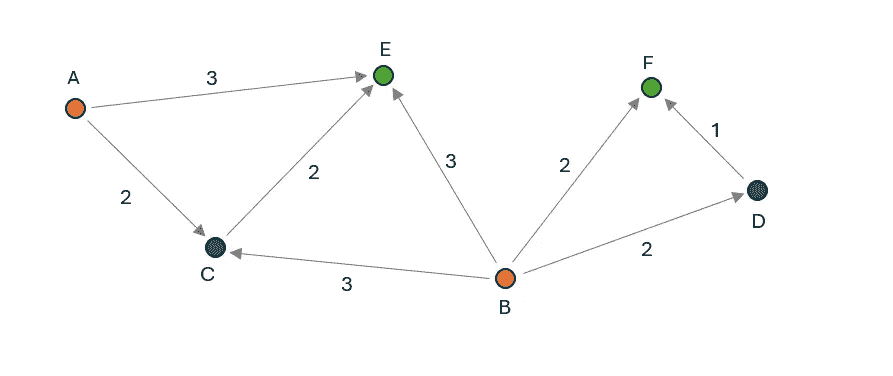

上面的图像展示了具有六个节点和八个边的一个最小成本流优化问题。节点 A 和 B 作为源点，每个源点有 50 个单位的供应量，而节点 E 和 F 作为汇点，每个汇点有 40 个单位的需求量。每条边都有一个最大容量为 25 个单位，图像中显示了可变成本。优化的目标是分配每条边的流量，以最低的成本将所需的单位从节点 A 和 B 移动到节点 E 和 F，同时遵守边容量限制。

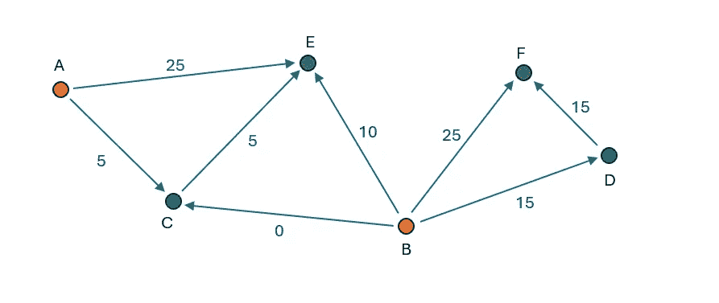

节点 F 只能从节点 B 接收供应。有两条路径：直接或通过节点 D。直接路径的成本为 2，而通过 D 的间接路径的总成本为 3。因此，25 个单位（最大边容量）直接从 B 移动到 F。剩余的 15 个单位通过 B-D-F 路径路由，以满足需求。

目前，从节点 B 已转移了 40 个单位中的 40 个单位，剩余 10 个单位可以转移到节点 E。为节点 E 提供供应的可用路径包括：A-E 和 B-E，成本为 3，A-C-E，成本为 4，以及 B-C-E，成本为 5。因此，从 A-E（受边容量限制）运输了 25 个单位，从 B-E（受节点 B 剩余供应量限制）运输了 10 个单位。为了满足节点 E 40 个单位的需求，通过 A-C-E 额外移动了 5 个单位，结果没有流量分配到 B-C 路径。

### 数学公式

我介绍了最小成本流优化的两种数学公式：

1. 仅包含连续变量的 LP（线性规划）

2. 包含连续和离散变量的 MILP（混合整数线性规划）

我使用以下定义：

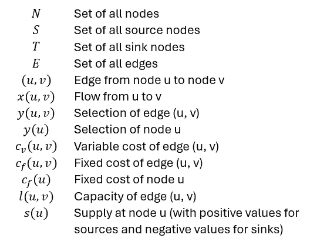

定义

## LP 公式

此公式仅包含连续的决策变量，这意味着只要所有约束都得到满足，它们可以具有任何值。在这种情况下，决策变量是所有边的流量变量 x(u, v)。

目标函数描述了应最小化的成本是如何计算的。在这种情况下，它定义为所有边的流量乘以可变成本的总和：

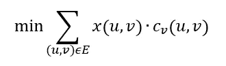

约束是必须满足的条件，以确保解的有效性，确保流量不超过容量限制。

首先，所有流量必须为非负数，并且不超过边的容量：

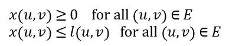

流量守恒约束确保进入节点的流量量必须等于流出节点的流量量。这些约束适用于所有既不是源节点也不是汇节点的节点：

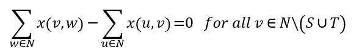

对于源节点和汇节点，出流量和入流量的差值小于或等于节点的供应量：

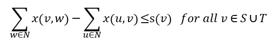

如果 v 是源节点，则出流量减去入流量的差值不得超过供应量 s(v)。如果 v 是汇节点，我们不允许流入节点的流量超过流出节点的流量-s(v)（对于汇节点，s(v)为负）。

### MILP

此外，除了 LP 公式的连续变量外，MILP 公式还包含只能具有特定值的离散变量。离散变量允许将使用的节点或边的数量限制在特定值。它还可以用于引入使用节点或边的固定成本。在本文中，我将展示如何添加固定成本。需要注意的是，添加离散决策变量会使找到最优解变得更加困难，因此只有在 LP 公式不可行的情况下才应使用此公式。

目标函数定义为：

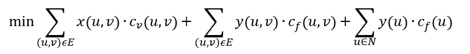

包含三个术语：所有边的可变成本、所有边的固定成本以及所有节点的固定成本。

可以分配给边的最大流量取决于边的容量、边选择变量和源节点选择变量：

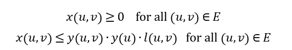

此方程确保只有在边选择变量和源节点选择变量为 1 时，才能将流量分配给边。

流量守恒约束等价于 LP 问题。

## 实现

在本节中，我将解释如何在 Python 中实现 MILP 优化。您可以在以下[仓库](https://github.com/ReinhardSellmair/nx_flow/tree/main)中找到代码。

### 库

构建流网络时，我使用了 NetworkX，这是一个用于处理图的优秀库（https://networkx.org/）。有许多有趣的文章展示了 NetworkX 在处理图方面的强大功能和易用性，例如[定制 NetworkX 图](https://towardsdatascience.com/customizing-networkx-graphs-f80b4e69bedf)、[NetworkX：操作子图的代码演示](https://towardsdatascience.com/networkx-code-demo-for-manipulating-subgraphs-e45320581d13)、[使用 NetworkX 进行社交网络分析：轻松入门](https://towardsdatascience.com/social-network-analysis-with-networkx-a-gentle-introduction-6123eddced3)。

在构建优化时，一个重要的方面是确保输入被正确定义。即使是一个小小的错误也可能使问题不可行或导致意外的解决方案。为了避免这种情况，我使用了 Pydantic（https://docs.pydantic.dev/latest/）来验证用户输入并在最早的可能阶段引发任何问题。这篇[文章](https://towardsdatascience.com/how-to-make-the-most-of-pydantic-aa374d5c12d)提供了对 Pydantic 的易于理解的介绍。

为了将定义的网络转换为数学优化问题，我使用了 PuLP（https://coin-or.github.io/pulp/）。它允许以直观的方式定义所有变量和约束。这个库的优点是它可以使用许多不同的求解器，以简单的方式“即插即用”。这篇[文章](https://towardsdatascience.com/linear-programming-and-discrete-optimization-with-python-using-pulp-449f3c5f6e99)提供了对这个库的良好介绍。

### 定义节点和边

下面的代码展示了如何定义节点：

```py
from pydantic import BaseModel, model_validator
from typing import Optional

# node and edge definitions
class Node(BaseModel, frozen=True):
    """
    class of network node with attributes:
    name: str - name of node
    demand: float - demand of node (if node is sink)
    supply: float - supply of node (if node is source)
    capacity: float - maximum flow out of node
    type: str - type of node
    x: float - x-coordinate of node
    y: float - y-coordinate of node
    fixed_cost: float - cost of selecting node
    """
    name: str
    demand: Optional[float] = 0.0
    supply: Optional[float] = 0.0
    capacity: Optional[float] = float('inf')
    type: Optional[str] = None
    x: Optional[float] = 0.0
    y: Optional[float] = 0.0
    fixed_cost: Optional[float] = 0.0

    @model_validator(mode='after')
    def validate(self):
        """
        validate if node definition are correct
        """
        # check that demand is non-negative
        if self.demand < 0 or self.demand == float('inf'): raise ValueError('demand must be non-negative and finite')
        # check that supply is non-negative
        if self.supply < 0: raise ValueError('supply must be non-negative')
        # check that capacity is non-negative
        if self.capacity < 0: raise ValueError('capacity must be non-negative')
        # check that fixed_cost is non-negative
        if self.fixed_cost < 0: raise ValueError('fixed_cost must be non-negative')
        return self
```

节点是通过继承 Pydantic 的 BaseModel 的 Node 类来定义的。这使得在创建新对象时，可以自动验证所有属性是否都使用正确的数据类型进行了定义。在这种情况下，只有名称是必需的输入，所有其他属性都是可选的，如果没有提供，则将分配给它们的指定默认值。通过将“frozen”参数设置为 True，我将所有属性设置为不可变，这意味着在对象初始化后不能更改它们。

validate 方法在对象初始化后执行，并应用更多检查以确保提供的值符合预期。具体来说，它检查需求、供应、容量、可变成本和固定成本不是负数。此外，它也不允许无限需求，因为这会导致不可行的优化问题。

这些检查看起来很 trivial，但它们的主要好处是它们会在输入不正确时尽可能早地触发错误。因此，它们防止创建一个错误的优化模型。探索为什么一个模型无法解决将花费更多的时间，因为需要分析许多因素，而这样的“trivial”输入错误可能不是首先需要调查的方面。

边的实现如下：

```py
class Edge(BaseModel, frozen=True):<br>    """<br>    class of edge between two nodes with attributes:<br>    origin: 'Node' - origin node of edge<br>    destination: 'Node' - destination node of edge<br>    capacity: float - maximum flow through edge<br>    variable_cost: float - cost per unit flow through edge<br>    fixed_cost: float - cost of selecting edge<br>    """<br>    origin: Node<br>    destination: Node<br>    capacity: Optional[float] = float('inf')<br>    variable_cost: Optional[float] = 0.0<br>    fixed_cost: Optional[float] = 0.0<br>    <br>    @model_validator(mode='after')<br>    def validate(self):<br>        """<br>        validate of edge definition is correct<br>        """<br>        # check that node names are different<br>        if self.origin.name == self.destination.name: raise ValueError('origin and destination names must be different')<br>        # check that capacity is non-negative<br>        if self.capacity < 0: raise ValueError('capacity must be non-negative')<br>        # check that variable_cost is non-negative<br>        if self.variable_cost < 0: raise ValueError('variable_cost must be non-negative')<br>        # check that fixed_cost is non-negative<br>        if self.fixed_cost < 0: raise ValueError('fixed_cost must be non-negative')<br>        return self
```

所需的输入是一个起点节点和一个终点节点对象。此外，可以提供容量、变量成本和固定成本。容量的默认值是无穷大，这意味着如果没有提供容量值，则假定边没有容量限制。验证确保提供的值是非负的，并且起点节点名称和终点节点名称不同。

### 流图对象的初始化

为了定义流图和优化流量，我创建了一个新的类叫做 FlowGraph，它继承自 NetworkX 的 DiGraph 类。通过这样做，我可以添加自己的方法，这些方法特定于流量优化，同时使用 DiGraph 提供的所有方法：

```py
from networkx import DiGraph
from pulp import LpProblem, LpVariable, LpMinimize, LpStatus

class FlowGraph(DiGraph):
    """
    class to define and solve minimum cost flow problems
    """
    def __init__(self, nodes=[], edges=[]):
        """
        initialize FlowGraph object
        :param nodes: list of nodes
        :param edges: list of edges
        """
        # initialialize digraph
        super().__init__(None)

        # add nodes and edges
        for node in nodes: self.add_node(node)
        for edge in edges: self.add_edge(edge)

    def add_node(self, node):
        """
        add node to graph
        :param node: Node object
        """
        # check if node is a Node object
        if not isinstance(node, Node): raise ValueError('node must be a Node object')
        # add node to graph
        super().add_node(node.name, demand=node.demand, supply=node.supply, capacity=node.capacity, type=node.type, 
                         fixed_cost=node.fixed_cost, x=node.x, y=node.y)

    def add_edge(self, edge):    
        """
        add edge to graph
        @param edge: Edge object
        """   
        # check if edge is an Edge object
        if not isinstance(edge, Edge): raise ValueError('edge must be an Edge object')
        # check if nodes exist
        if not edge.origin.name in super().nodes: self.add_node(edge.origin)
        if not edge.destination.name in super().nodes: self.add_node(edge.destination)

        # add edge to graph
        super().add_edge(edge.origin.name, edge.destination.name, capacity=edge.capacity, 
                         variable_cost=edge.variable_cost, fixed_cost=edge.fixed_cost) 
```

通过提供节点和边列表初始化 FlowGraph。第一步是初始化父类为一个空图。接下来，通过方法*add_node*和*add_edge*添加节点和边。这些方法首先检查提供的元素是否是 Node 或 Edge 对象。如果不是这种情况，将引发错误。这确保了所有添加到图中的元素都通过了上一节中的验证。接下来，将这些对象的值添加到 Digraph 对象中。请注意，Digraph 类也使用*add_node*和*add_edge*方法这样做。通过使用相同的方法名，我覆盖了这些方法，以确保每当向图中添加新元素时，它必须通过 FlowGraph 方法添加，这些方法验证对象类型。因此，不可能构建一个包含未通过验证测试的任何元素的图。

### 初始化优化问题

下面的方法将网络转换为优化模型，求解它，并检索优化值。

```py
 def min_cost_flow(self, verbose=True):
        """
        run minimum cost flow optimization
        @param verbose: bool - print optimization status (default: True)
        @return: status of optimization
        """
        self.verbose = verbose

        # get maximum flow
        self.max_flow = sum(node['demand'] for _, node in super().nodes.data() if node['demand'] > 0)

        start_time = time.time()
        # create LP problem
        self.prob = LpProblem("FlowGraph.min_cost_flow", LpMinimize)
        # assign decision variables
        self._assign_decision_variables()
        # assign objective function
        self._assign_objective_function()
        # assign constraints
        self._assign_constraints()
        if self.verbose: print(f"Model creation time: {time.time() - start_time:.2f} s")

        start_time = time.time()
        # solve LP problem
        self.prob.solve()
        solve_time = time.time() - start_time

        # get status
        status = LpStatus[self.prob.status]

        if verbose:
            # print optimization status
            if status == 'Optimal':
                # get objective value
                objective = self.prob.objective.value()
                print(f"Optimal solution found: {objective:.2f} in {solve_time:.2f} s")
            else:
                print(f"Optimization status: {status} in {solve_time:.2f} s")

        # assign variable values
        self._assign_variable_values(status=='Optimal')

        return status
```

Pulp 的 LpProblem 初始化，常量 LpMinimize 将其定义为最小化问题——这意味着它应该最小化目标函数的值。在下面的行中，所有决策变量都被初始化，目标函数以及所有约束都被定义。这些方法将在以下章节中解释。

接下来，解决问题，在这一步中，所有决策变量的最优值被确定。随后检索优化的状态。当状态为“最优”时，可以找到最优解；其他状态为“不可行”（无法满足所有约束）、“无界”（目标函数可以具有任意低的值）和“未定义”，意味着问题定义不完整。如果没有找到最优解，则需要审查问题定义。

最后，检索所有变量的优化值，并将它们分配给相应的节点和边。

### 定义决策变量

所有决策变量都在以下方法中初始化：

```py
 def _assign_variable_values(self, opt_found):
        """
        assign decision variable values if optimal solution found, otherwise set to None
        @param opt_found: bool - if optimal solution was found
        """
        # assign edge values        
        for _, _, edge in super().edges.data():
            # initialize values
            edge['flow'] = None
            edge['selected'] = None
            # check if optimal solution found
            if opt_found and edge['flow_var'] is not None:                    
                edge['flow'] = edge['flow_var'].varValue                    

                if edge['selection_var'] is not None: 
                    edge['selected'] = edge['selection_var'].varValue

        # assign node values
        for _, node in super().nodes.data():
            # initialize values
            node['selected'] = None
            if opt_found:                
                # check if node has selection variable
                if node['selection_var'] is not None: 
                    node['selected'] = node['selection_var'].varValue 
```

首先遍历所有边，如果边容量大于 0，则分配连续决策变量。此外，如果边的固定成本大于 0，则还定义了一个二元决策变量。接下来，遍历所有节点，并将二元决策变量分配给具有固定成本的节点。在方法结束时，计算并打印连续和二元决策变量的总数。

### 定义目标

所有决策变量初始化完成后，可以定义目标函数：

```py
 def _assign_objective_function(self):
        """
        define objective function
        """
        objective = 0

        # add edge costs
        for _, _, edge in super().edges.data():
            if edge['selection_var'] is not None: objective += edge['selection_var'] * edge['fixed_cost']
            if edge['flow_var'] is not None: objective += edge['flow_var'] * edge['variable_cost']

        # add node costs
        for _, node in super().nodes.data():
            # add node selection costs
            if node['selection_var'] is not None: objective += node['selection_var'] * node['fixed_cost']

        self.prob += objective, 'Objective', 
```

目标初始化为 0。然后，对于每个边，如果边有选择变量，则添加固定成本，如果边有流量变量，则添加可变成本。对于所有具有选择变量的节点，也将固定成本添加到目标中。在方法结束时，将目标添加到 LP 对象中。

### 定义约束条件

所有约束条件都在下面的方法中定义：

```py
 def _assign_constraints(self):
        """
        define constraints
        """
        # count of contraints
        constr_count = 0
        # add capacity constraints for edges with fixed costs
        for origin_name, destination_name, edge in super().edges.data():
            # get capacity
            capacity = edge['capacity'] if edge['capacity'] < float('inf') else self.max_flow
            rhs = capacity
            if edge['selection_var'] is not None: rhs *= edge['selection_var']
            self.prob += edge['flow_var'] <= rhs, f"capacity_{origin_name}-{destination_name}",
            constr_count += 1

            # get origin node
            origin_node = super().nodes[origin_name]
            # check if origin node has a selection variable
            if origin_node['selection_var'] is not None:
                rhs = capacity * origin_node['selection_var'] 
                self.prob += (edge['flow_var'] <= rhs, f"node_selection_{origin_name}-{destination_name}",)
                constr_count += 1

        total_demand = total_supply = 0
        # add flow conservation constraints
        for node_name, node in super().nodes.data():
            # aggregate in and out flows
            in_flow = 0
            for _, _, edge in super().in_edges(node_name, data=True):
                if edge['flow_var'] is not None: in_flow += edge['flow_var']

            out_flow = 0
            for _, _, edge in super().out_edges(node_name, data=True):
                if edge['flow_var'] is not None: out_flow += edge['flow_var']

            # add node capacity contraint
            if node['capacity'] < float('inf'):
                self.prob += out_flow <= node['capacity'], f"node_capacity_{node_name}",
                constr_count += 1

            # check what type of node it is
            if node['demand'] == node['supply']:
                # transshipment node: in_flow = out_flow
                self.prob += in_flow == out_flow, f"flow_balance_{node_name}",
            else:
                # in_flow - out_flow >= demand - supply
                rhs = node['demand'] - node['supply']
                self.prob += in_flow - out_flow >= rhs, f"flow_balance_{node_name}",
            constr_count += 1

            # update total demand and supply
            total_demand += node['demand']
            total_supply += node['supply']

        if self.verbose:
            print(f"Constraints: {constr_count}")
            print(f"Total supply: {total_supply}, Total demand: {total_demand}")
```

首先，为每个边定义容量约束。如果边有选择变量，则将容量乘以该变量。如果没有容量限制（容量设置为无穷大），但有选择变量，则将选择变量乘以通过汇总所有节点的需求计算出的最大流量。如果边的源节点有选择变量，则添加一个额外的约束。这个约束意味着只有当选择变量设置为 1 时，流量才能从这个节点流出。

接下来，定义所有节点的流量守恒约束。为此，计算节点的总流入和流出。通过使用 DiGraph 类的*in_edges*和*out_edges*方法可以轻松地获取所有流入和流出边。如果节点有容量限制，则最大流出量将受该值限制。对于流量守恒，需要检查节点是否是源节点或汇节点或中转节点（需求等于供应）。在前一种情况下，流入和流出之间的差异必须大于或等于需求和供应之间的差异，而在后一种情况下，流入和流出必须相等。

在方法结束时，计算并打印约束条件总数。

### 获取优化值

运行优化后，可以使用以下方法检索优化变量值：

```py
 def _assign_variable_values(self, opt_found):
        """
        assign decision variable values if optimal solution found, otherwise set to None
        @param opt_found: bool - if optimal solution was found
        """
        # assign edge values        
        for _, _, edge in super().edges.data():
            # initialize values
            edge['flow'] = None
            edge['selected'] = None
            # check if optimal solution found
            if opt_found and edge['flow_var'] is not None:                    
                edge['flow'] = edge['flow_var'].varValue                    

                if edge['selection_var'] is not None: 
                    edge['selected'] = edge['selection_var'].varValue

        # assign node values
        for _, node in super().nodes.data():
            # initialize values
            node['selected'] = None
            if opt_found:                
                # check if node has selection variable
                if node['selection_var'] is not None: 
                    node['selected'] = node['selection_var'].varValue 
```

此方法遍历所有边和节点，检查决策变量是否已分配，并通过 varValue 将决策变量值添加到相应的边或节点。

## 演示

为了演示如何应用流量优化，我创建了一个由 2 个工厂、4 个配送中心（DC）和 15 个市场组成的供应链网络。所有工厂生产的商品必须通过一个配送中心流动，直到它们可以运送到市场。

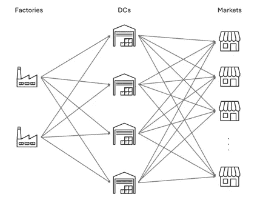

供应链问题

定义节点属性：

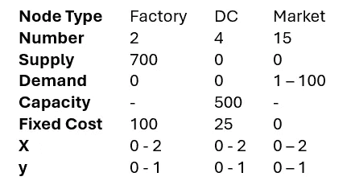

节点定义

范围表示为均匀分布的随机数被生成以分配这些属性。由于工厂和 DC 有固定成本，优化还需要决定哪些实体应该被选中。

在所有工厂和 DC 之间，以及所有 DC 和市场之间生成边。边的可变成本计算为起点和终点节点之间的欧几里得距离。从工厂到 DC 的边容量设置为 350，而从 DC 到市场的边容量设置为 100。

下面的代码展示了网络是如何定义的以及优化是如何运行的：

```py
# Define nodes
factories = [Node(name=f'Factory {i}', supply=700, type='Factory', fixed_cost=100, x=random.uniform(0, 2),
                  y=random.uniform(0, 1)) for i in range(2)]
dcs = [Node(name=f'DC {i}', fixed_cost=25, capacity=500, type='DC', x=random.uniform(0, 2), 
            y=random.uniform(0, 1)) for i in range(4)]
markets = [Node(name=f'Market {i}', demand=random.randint(1, 100), type='Market', x=random.uniform(0, 2), 
                y=random.uniform(0, 1)) for i in range(15)]

# Define edges
edges = []
# Factories to DCs
for factory in factories:
    for dc in dcs:
        distance = ((factory.x - dc.x)**2 + (factory.y - dc.y)**2)**0.5
        edges.append(Edge(origin=factory, destination=dc, capacity=350, variable_cost=distance))

# DCs to Markets
for dc in dcs:
    for market in markets:
        distance = ((dc.x - market.x)**2 + (dc.y - market.y)**2)**0.5
        edges.append(Edge(origin=dc, destination=market, capacity=100, variable_cost=distance))

# Create FlowGraph
G = FlowGraph(edges=edges)

G.min_cost_flow()
```

流优化输出的结果如下：

```py
Variable types: 68 continuous, 6 binary
Constraints: 161
Total supply: 1400.0, Total demand: 909.0
Model creation time: 0.00 s
Optimal solution found: 1334.88 in 0.23 s
```

该问题由 68 个连续变量组成，这些是边的流量变量，以及 6 个二元决策变量，这些是工厂和 DC 的选择变量。总共有 161 个约束条件，包括边和节点容量约束、节点选择约束（只有当源节点被选中时，边才能有流量）和流量守恒约束。下一行显示总供应量为 1400，高于总需求量 909（如果需求量高于供应量，问题将不可行）。由于这是一个小优化问题，定义优化模型的时间不到 0.01 秒。最后一行显示，在 0.23 秒内找到了一个目标值为 1335 的最优解。

除了我在本文中描述的代码外，我还添加了两个方法来可视化优化后的解决方案。这些方法的代码也可以在[repo](https://github.com/ReinhardSellmair/nx_flow/tree/main)中找到。

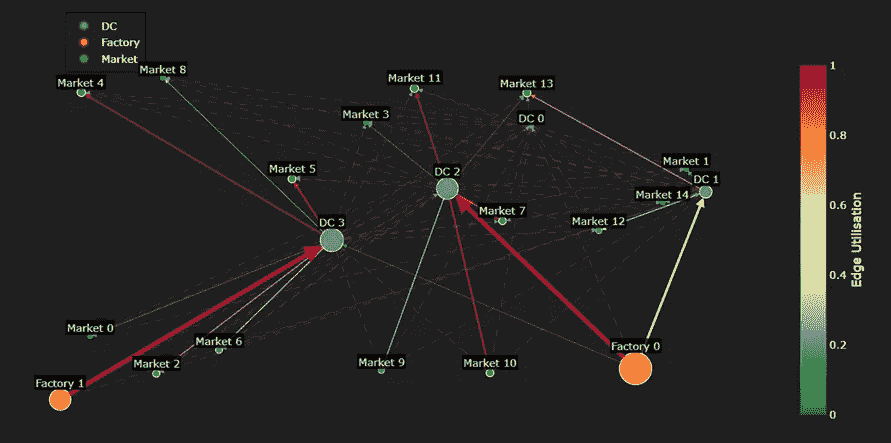

流图

所有节点都通过各自的 x 和 y 坐标定位。节点和边的尺寸与通过的总流量成正比。边颜色表示其利用率（流量超过容量）。虚线表示没有流量分配的边。

在最优解中，两个工厂都被选中，这是不可避免的，因为一个工厂的最大供应量是 700，而总需求量是 909。然而，只有 3 个 DC 中的 4 个被使用（DC 0 没有被选中）。

通常，该图显示工厂向最近的直流站供应，直流站向最近的 市场 供应。然而，对此观察结果有一些例外：工厂 0 也向直流站 3 供应，尽管工厂 1 更近。这是由于边的容量限制，每个边最多只能移动 350 个单位。然而，距离直流站 3 最近的市场的需求略高，因此工厂 0 需要向直流站 3 运送额外的单位以满足该需求。尽管市场 9 距离直流站 3 最近，但它由直流站 2 供应。这是因为直流站 3 需要额外的供应从工厂 0 来供应这个市场，并且由于从工厂 0 到直流站 3 的总距离比通过直流站 2 的距离更长，市场 9 通过后者路线供应。

另一种可视化结果的方式是通过桑基图，该图专注于可视化边的流量：

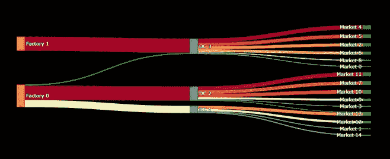

桑基流量图

颜色代表边的利用率，从绿色（利用率最低）渐变到黄色，再到红色（利用率最高）。此图很好地显示了每个节点和边通过多少流量。它突出了从工厂 0 到直流站 3 的流量，以及市场 13 由直流站 2 和直流站 1 供应。

## 摘要

最小成本流量优化可以在许多领域（如物流、运输、电信、能源行业等）中成为一个非常有用的工具。要应用这种优化，将物理系统转换为由节点和边组成的数学图是非常重要的。这应该以尽可能少的离散（例如二进制）决策变量为原则，因为它们会显著增加找到最优解的难度。通过结合 Python 的 NetworkX、Pulp 和 Pydantic 库，我构建了一个直观初始化且遵循通用公式的流量优化类，这使得它可以在许多不同的用例中应用。图和流量图对于理解优化器找到的解决方案非常有帮助。

*除非另有说明，所有图像均由作者创建。*
