# 扩散模型工作原理的视觉指南

> [原文链接](https://towardsdatascience.com/a-visual-guide-to-how-diffusion-models-work/)

本文旨在帮助那些想要确切了解扩散模型如何工作的人，不需要任何先前的知识。我尽量在可能的地方使用插图，为这些模型的每个部分提供视觉直觉。我尽量将数学符号和方程式保持到最小，并在必要时尝试定义和解释它们。

### 简介

我将这篇文章围绕三个主要问题来构建：

+   扩散模型究竟学习了什么？

+   扩散模型是如何以及为什么能工作的？

+   一旦训练好一个模型，你如何从中获取有用的东西？

这些示例将基于我之前[实现并撰写关于](https://yue-here.com/posts/glyffuser/)的[glyffuser](https://yue-here.com/posts/glyffuser/)，这是一个极简的文本到图像扩散模型。该模型的架构是一个标准的文本到图像去噪扩散模型，没有任何花哨的功能。它被训练生成从英文定义中产生的新“中文”符号的图片。看看下面的图片——即使你不熟悉中文书写，我也希望你会同意生成的符号看起来非常接近真实的符号！

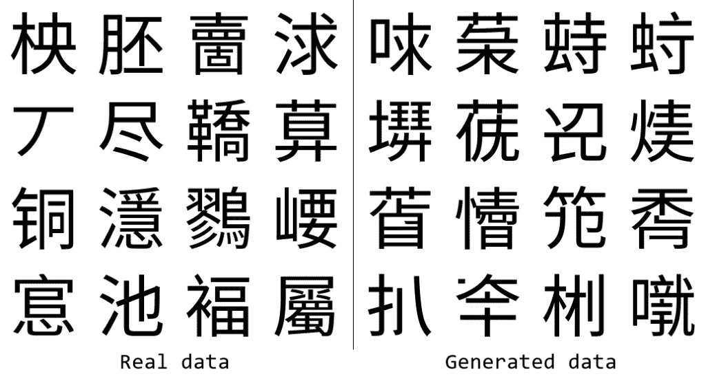

甘油用户训练数据的随机示例（左）和生成数据（右）。

### 扩散模型究竟学习了什么？

生成式 AI 模型通常被说成是接受一大堆数据并“学习”它。对于文本到图像扩散模型，数据以图像和描述性文本的配对形式存在。但我们究竟希望模型学习什么？首先，让我们暂时忘记文本，专注于我们试图生成的：图像。

#### 概率分布

广义来说，我们可以说我们希望生成式 AI 模型学习数据的**潜在概率分布**。这意味着什么？考虑下面的一维正态（高斯）分布，通常写作**𝒩**(*μ*,*σ***²**)，并用均值*μ* = 0 和方差*σ***²** = 1 来参数化。下面的黑色曲线显示了概率密度函数。我们可以从中**采样**：抽取值，使得在大量样本中，值的集合反映了潜在分布。如今，我们只需在 Python 中简单地写上`x = random.gauss(0, 1)`来从标准正态分布中采样，尽管计算采样过程本身并不简单！

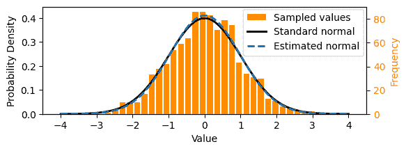

从潜在分布（此处为标准正态分布**𝒩**(0,1)）中抽取的值可以用来估计该分布的参数。

我们可以将从上述正态分布中采样的数字集想象成一个简单的数据集，就像上面显示的橙色直方图那样。在这种情况下，我们可以使用 *最大似然估计* 来计算潜在分布的参数，即通过计算均值和方差。从样本中估计的正态分布在上面的虚线上显示。为了在术语上有所自由，你可能会认为这是一个“学习”潜在概率分布的简单例子。我们也可以说，在这里我们 *明确地* 学习了分布，这与扩散模型使用的 *隐式* 方法形成对比。

从概念上讲，这就是生成式人工智能所做的一切——学习一个分布，然后从这个分布中采样！

#### 数据表示

那么，一个更复杂的数据集的潜在概率分布是什么样的呢？比如我们想要用来训练扩散模型的图像数据集。

首先，我们需要知道数据的 *表示* 是什么。通常，机器学习（ML）模型需要具有一致表示的数据输入，即格式。对于上面的例子，它只是数字（标量）。对于图像，这种表示通常是固定长度的向量。

用于 glyffuser 模型的图像数据集包含大约 21,000 张中国符号的图片。这些图片都是相同的大小，128 × 128 = 16384 像素，并且是灰度（单通道颜色）。因此，一个明显的表示选择是长度为 16384 的向量 **x**，其中每个元素对应一个像素的颜色：**x** = (*x***₁**,*x*₂,…,*x***₁₆₃₈₄**)。我们可以称我们数据集所有可能图像的域为“像素空间”。

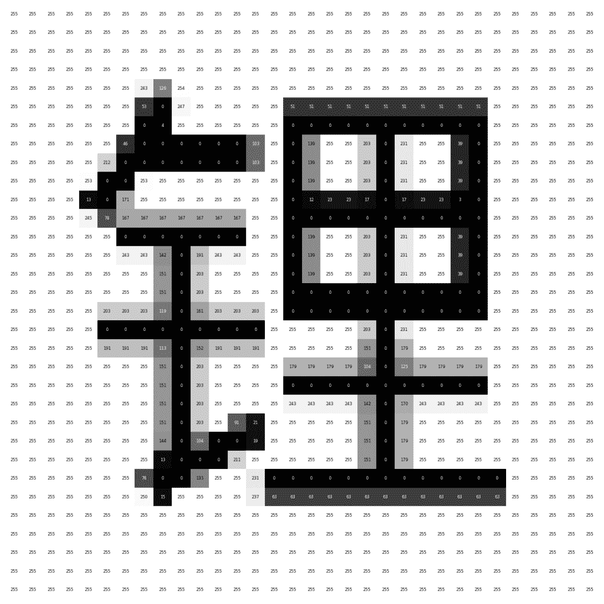

一个带有像素值标签的示例符号（为了可读性已下采样到 32 × 32 像素）。

### 数据集可视化

我们假设我们的单个数据样本 *x* 实际上是从像素空间中的一个潜在概率分布 *q*(*x*) 中采样的，就像我们第一个示例中的样本是从一维空间中的一个潜在正态分布中采样的。注意：符号 *x* ∼ *q*(*x*) 通常用来表示：“随机变量 *x* 从概率分布 *q*(*x*) 中采样。”

这个分布显然比高斯分布复杂得多，不能轻易参数化——我们需要用机器学习模型来学习它，我们稍后会讨论。首先，让我们尝试可视化这个分布，以获得更好的直觉。

由于人类难以在超过 3 维的空间中看到，我们需要降低我们数据的维度。关于为什么这起作用的小插曲：[流形假设](https://en.wikipedia.org/wiki/Manifold_hypothesis)提出，自然数据集位于嵌入在更高维空间中的低维流形上——想象一下一条线嵌入在二维平面上，或者一个平面嵌入在三维空间中。我们可以使用像[UMAP](https://umap-learn.readthedocs.io/en/latest/)这样的降维技术将我们的数据集从 16384 维投影到 2 维。二维投影保留了大量的结构，与我们的数据位于嵌入在像素空间中的低维流形上的想法一致。在我们的 UMAP 中，我们看到两个大簇对应于字符，其中组件要么水平排列（例如，明），要么垂直排列（例如，草）。下面图表的交互式版本，每个数据点都有弹出窗口，链接[这里](https://yue-here.com/posts/diffusion/#dataset-visualization)。

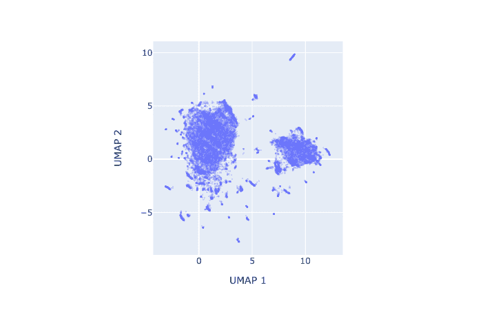

[点击此处查看此图的交互式版本。](https://yue-here.com/posts/diffusion/#dataset-visualization)

现在我们将使用这个低维 UMAP 数据集作为我们高维数据集的视觉简写。记住，我们假设这些单独的点是从一个连续的潜在概率分布 *q*(*x*) 中采样的。为了了解这个分布可能的样子，我们可以在 UMAP 数据集上应用 KDE（核密度估计）。（注意：这只是为了可视化目的的一个近似。）

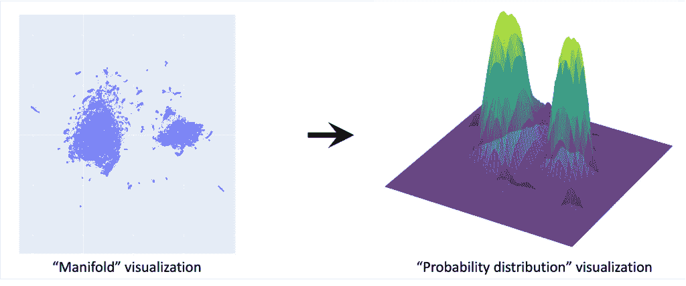

这给出了 *q*(*x*) 应该看起来是什么样的感觉：符号簇对应于分布的高概率区域。真实的 *q*(*x*) 位于 16384 维——这是我们想要用我们的扩散模型学习的分布。

我们表明，对于像一维高斯这样的简单分布，我们可以从我们的数据中计算出参数（均值和方差）。然而，对于像图像这样的复杂分布，我们需要调用 ML 方法。此外，我们将会发现，在实际的扩散模型中，它们不是直接参数化分布，而是通过学习如何通过多个步骤将噪声转换为数据来**隐式地**学习它。

#### 摘要

生成式 AI，如扩散模型的目标是学习其训练数据下复杂的概率分布，然后从这些分布中进行采样。

### 扩散模型是如何和为什么工作的？

扩散模型最近成为了一个焦点，作为一种特别有效的学习这些概率分布的方法。它们从纯噪声开始，逐步细化，生成令人信服的图像。为了激发你的兴趣，请看一下下面的动画，展示了生成 16 个样本的去噪过程。

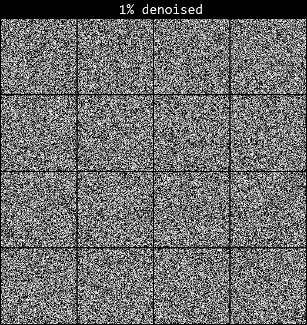

在本节中，我们只讨论这些模型的工作机制，但如果你对它们如何从生成模型的更广泛背景中产生感兴趣，请查看下面的[进一步阅读](https://yue-here.com/posts/diffusion/#further-reading)部分。

#### 什么是“噪声”？

让我们先精确地定义噪声，因为扩散的背景下经常提到这个术语。特别是，我们谈论的是高斯噪声：考虑我们在[概率分布](https://yue-here.com/posts/diffusion/#probability-distributions)部分中提到的样本。你可以把每个样本想象成一个噪声图像的单个像素。那么，“纯高斯噪声”的图像就是每个像素值都是从独立的正态分布 **𝒩**(0,1) 中采样的。在我们的符号数据集域中，这将是从 16384 个独立的高斯分布中抽取的噪声。你可以在之前的动画中看到这一点。需要注意的是，我们可以选择这些噪声分布的均值，即“中心”在特定的值上——例如图像的像素值。

为了方便起见，你会发现图像数据集的噪声分布通常写成单个多元分布 **𝒩**(0,***I***)，其中 ***I*** 是单位矩阵，一个所有对角线元素都等于 1，其他地方都是零的协方差矩阵。这只是一个表示多个独立高斯分布的紧凑符号——即不同像素上的噪声之间没有相关性。在扩散模型的基本实现中，只使用不相关（也称为“各向同性”）的噪声。[这篇文章](https://distill.pub/2019/visual-exploration-gaussian-processes/)包含了一个关于多元高斯分布的优秀交互式介绍。

#### 扩散过程概述

下面是来自 [Ho *et al*.](https://arxiv.org/abs/2006.11239) 的开创性论文“*Denoising Diffusion Probabilistic Models*”中相对著名的图解的改编，它概述了整个扩散过程：

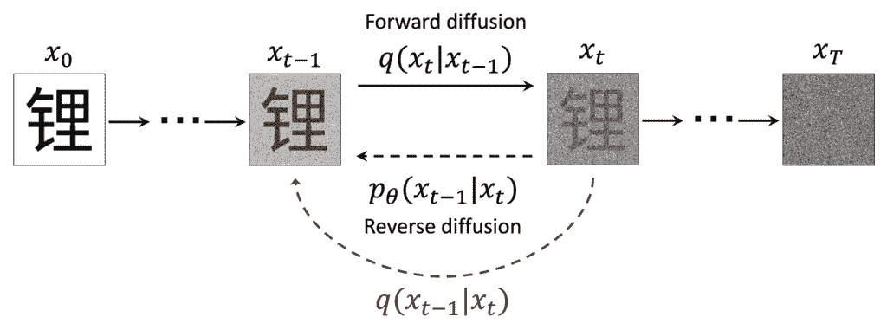

从 [Ho *et al*. 2020](https://arxiv.org/abs/2006.11239) 改编的扩散过程图解。使用的符号 锂，意为“锂”，是从数据集中选取的代表性样本。

我发现这个图解中有很多东西可以解释，仅仅理解每个组件的含义就非常有帮助，所以让我们一步一步地过一遍，并定义每一项。

我们之前使用 *x* ∼ *q*(*x*) 来指代我们的数据。在这里，我们添加了一个下标，*x*ₜ，来表示时间步长 *t*，表示已经进行了多少步“噪声”操作。我们称在给定时间步长上噪声化的样本为 *x* ∼ *q*(*x*ₜ)。*x*₀ 是干净的数据，*x*ₜ (*t* = *T*) ∼ **𝒩**(0,1) 是纯噪声。

我们定义了一个**正向扩散**过程，其中我们通过添加噪声来破坏样本。这个过程由分布 *q*(*x*ₜ|*x*ₜ₋₁) 描述。如果我们能够访问假设的反向过程 *q*(*x*ₜ₋₁|*x*ₜ)，我们就可以从噪声中生成样本。由于我们无法直接访问它，因为我们需要知道 *x*₀，所以我们使用机器学习来学习这个过程模型的参数，*θ*，即 𝑝*θ*(𝑥ₜ₋₁∣𝑥ₜ)。（这应该是 *p* 下标 *θ*，但中等无法渲染。）

在接下来的章节中，我们将详细介绍正向和反向扩散过程的工作原理。

#### 正向扩散，或“噪声”

作为动词，“噪声”一个图像指的是应用一个变换，通过将像素值缩小到 0 并添加成比例的高斯噪声，使其向纯噪声移动。从数学上讲，这个变换是一个以先前图像的像素值为中心的多变量高斯分布。

在正向扩散过程中，这个噪声分布被写成 *q*(*x*ₜ|*x*ₜ₋₁)，其中竖线符号“|”读作“给定”或“条件于”，表示像素值从 *q*(*x*ₜ₋₁) 前传。在 *t* = *T* 时，其中 *T* 是一个大数（通常是 1000），我们的目标是得到纯噪声的图像（这有点令人困惑，因为这也是一个高斯分布，如前所述[之前](https://yue-here.com/posts/diffusion/#what-is-noise)）。

边缘分布 *q*(*x*ₜ) 代表了累积了所有先前噪声步骤效果的分布（边缘化指的是对所有可能条件的积分，从而恢复无条件的分布）。

由于条件分布是高斯分布，它们的方差如何？它们由一个将时间步映射到方差值的**方差计划**确定。最初，[Ho *et al*.](https://arxiv.org/abs/2006.11239) 提出了一种从 0.0001 线性增加到 0.02 的经验确定的计划，跨越 1000 步。后来，[Nichol & Dhariwal](https://arxiv.org/pdf/2102.09672) 的研究提出了一个改进的余弦计划。他们表示，当整个噪声过程中每一步通过噪声的信息破坏率相对均匀时，计划最有效。

#### 正向扩散直觉

由于我们既作为纯噪声 *q*(*x*ₜ, *t* = *T*) 也作为噪声分布 *q*(*x*ₜ|*x*ₜ₋₁) 遇到高斯分布，我将尝试通过给出单个噪声步骤，*q*(*x*₁∣*x*₀)，对于某些任意、结构化的二维数据的分布的视觉直觉来区分它们：

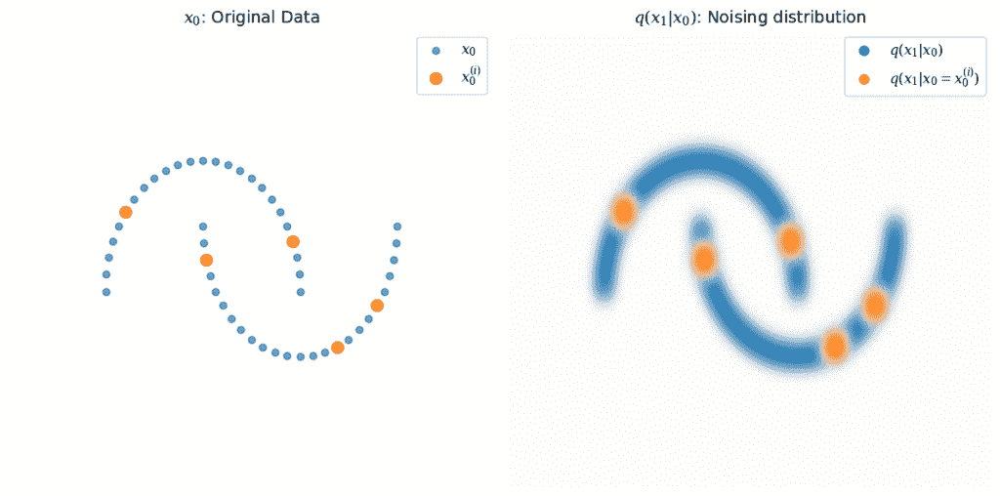

每个噪声步骤 *q*(*x*ₜ|*x*ₜ₋₁) 是一个基于先前步骤的条件高斯分布。

分布 *q*(*x*₁∣*x*₀) 是围绕 *x*₀ 中每个点的高斯分布，用蓝色表示。选择几个示例点 *x*₀⁽ⁱ⁾ 来说明这一点，其中 *q*(*x*₁∣*x*₀ = *x*₀⁽ⁱ⁾) 用橙色表示。

在实践中，这些分布的主要用途是生成用于训练的特定噪声样本实例（下面将进一步讨论）。我们可以直接从方差计划中计算任何时间步长 *t* 的噪声分布参数，因为高斯链本身也是高斯分布。这非常方便，因为我们不需要按顺序进行噪声处理——对于任何给定的起始数据 *x*₀⁽ⁱ⁾，我们可以通过直接从 *q*(*x*ₜ∣*x*₀ = *x*₀⁽ⁱ⁾) 中采样来计算噪声样本 *x*ₜ⁽ⁱ⁾。

#### 前向扩散可视化

现在让我们回到我们的符号数据集（再次使用 UMAP 可视化作为视觉简写）。下面图中的顶部行显示了从分布中采样的数据集，这些分布被噪声到各种时间步长：*x*ₜ ∼ *q*(*x*ₜ)。随着噪声步骤数量的增加，你可以看到数据集开始类似于纯高斯噪声。底部行可视化了潜在的概率分布 *q*(*x*ₜ)。

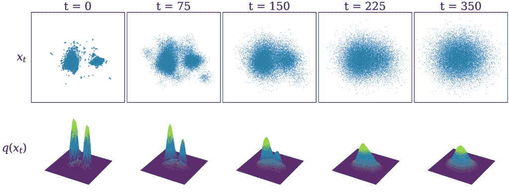

数据集 *x*ₜ（上方）是从其概率分布 *q*(*x*ₜ)（下方）在不同的噪声时间步长中采样的。

#### 反向扩散概述

因此，如果我们知道反向分布 *q*(*x*ₜ₋₁∣*x*ₜ)，我们可以反复减去一小部分噪声，从在 *t* = *T* 的纯噪声样本 *x*ₜ 开始，到达数据样本 *x*₀ ∼ *q*(*x*₀)。然而，在实践中，如果我们不知道 *x*₀，我们无法访问这些分布。直观上，使已知图像变得非常嘈杂很容易，但给定一个非常嘈杂的图像，猜测原始图像就困难得多。

我们应该怎么做呢？由于我们拥有大量数据，我们可以训练一个机器学习模型来准确猜测任何给定噪声图像的原始图像。具体来说，我们学习一个机器学习模型参数 *θ*，该模型近似于反向去噪分布 *pθ*(*x*ₜ₋₁ ∣ *x*ₜ)，对于 *t* = 0, …, *T*。在实践中，这体现在一个在许多不同样本和时间步长上训练的单个 *噪声预测模型*。这使得它可以去除任何给定输入的噪声，如图所示。

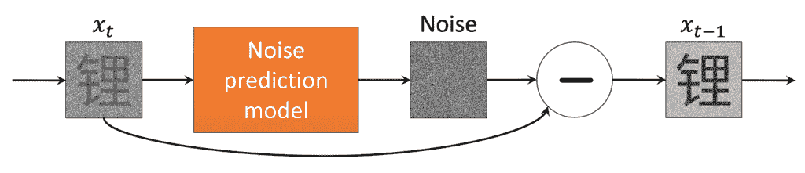

机器学习模型预测在任意给定时间步长 t 的添加噪声。

接下来，让我们了解一下这个噪声预测模型在实际中是如何实现和训练的。

#### 模型的实现方式

首先，我们定义机器学习模型——通常是一种某种类型的深度神经网络——它将作为我们的噪声预测模型。这正是它所做的大量工作！在实践中，任何输入和输出正确大小数据的机器学习模型都可以使用；[U-net](https://arxiv.org/abs/1505.04597)，一种特别适合学习图像的架构，是我们在这里使用并在实践中经常选择的。更近期的模型也使用了 [*视觉 Transformer*](https://arxiv.org/pdf/2212.09748)。

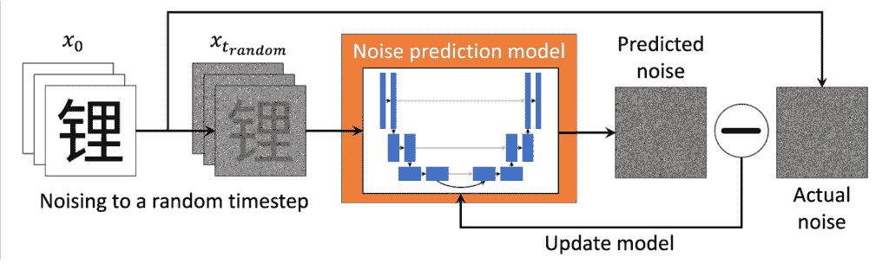

我们使用 U-net 架构（[Ronneberger 等人，2015](https://arxiv.org/abs/1505.04597)）作为我们的机器学习噪声预测模型。我们通过最小化预测噪声与实际噪声之间的差异来训练模型。

然后我们运行上图所示的训练循环：

+   我们从我们的数据集中随机取一张图像，并将其噪声化到随机的时间步长 tt。（在实践中，我们通过并行处理多个示例来加快速度！）

+   我们将噪声图像输入到机器学习模型中，并训练它预测图像中的（对我们而言已知的）噪声。我们还通过向模型输入一个*timestep embedding*（时间步长的多维独特表示）来执行*timestep conditioning*，以便模型能够区分不同的时间步长。这可以是一个与我们的图像大小相同的向量，直接添加到输入中（有关如何实现的讨论，请参阅[这里](https://www.assemblyai.com/blog/how-imagen-actually-works/)）。

+   模型通过最小化*损失函数*的值来“学习”，这是预测噪声与实际噪声之间差异的某种度量。在我们的情况下，使用的是均方误差（预测噪声与实际噪声像素级差异平方的平均值）。

+   重复直到模型训练良好。

注意：神经网络本质上是一个具有大量参数的函数（glyffuser 的参数数量约为 10**⁶**）。神经网络机器学习模型通过迭代更新其参数来训练，使用*反向传播*来最小化给定损失函数在许多训练数据示例上的值。[这是](https://www.3blue1brown.com/topics/neural-networks)一个很好的介绍。这些参数实际上存储了网络的“知识”。

以这种方式训练的噪声预测模型最终会看到许多不同时间步长和数据示例的组合。例如，glyffuser 经过超过 100 个*epochs*（整个数据集的运行）的训练，因此它看到了大约 200 万个数据样本。通过这个过程，模型隐式地学习了整个数据集在所有不同时间步长的反向扩散分布。这使得模型可以通过逐步去噪从纯噪声开始采样底层分布*q*(*x*₀)。换句话说，给定任何给定级别的噪声图像，模型可以根据其对原始图像的猜测来预测如何减少噪声。通过重复这样做，每次更新其对原始图像的猜测，模型可以将任何噪声转换为位于底层数据分布高概率区域的样本。

#### 实践中的反向扩散

现在，我们可以回顾一下 glyffuser 去噪过程的这个视频。回想一下从样本到噪声的大量步骤，例如，在训练过程中使用了*T* = 1000，这使得噪声到样本的轨迹对模型来说非常容易学习，因为步骤之间的变化会很小。这意味着我们每次想要生成样本时都需要运行 1000 个去噪步骤吗？

幸运的是，情况并非如此。本质上，我们可以运行单步噪声预测，但将其缩放到任何给定的步骤，尽管如果差距太大可能不是很好！这允许我们用更少的步骤近似完整的采样轨迹。例如，上面的视频使用了 120 步（大多数实现将允许用户设置采样步骤的数量）。

请记住，预测给定步骤的噪声等同于预测原始图像 *x*₀，并且我们可以仅使用方差计划和 *x*₀ 确定性访问任何噪声图像的方程。因此，我们可以根据任何去噪步骤计算 *x*ₜ₋ₖ。步骤越接近，近似效果越好。

然而，步骤太少，结果会变得更糟，因为对于模型来说，步骤太大，无法有效地逼近去噪轨迹。例如，如果我们只使用 5 个采样步骤，那么采样的字符看起来一点也不令人信服：

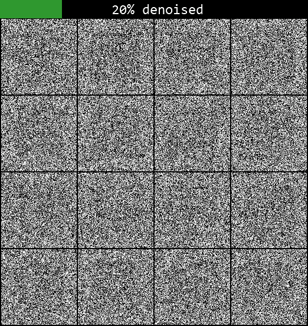

因此，关于比我们之前讨论的更高级的采样方法，有一整个文献。这些方法允许以更少的步骤进行有效采样。这些方法通常将采样重新构造成一个需要确定性解决的微分方程，给采样视频带来一种神秘的感觉——如果你感兴趣，我在[末尾](https://yue-here.com/posts/diffusion/#fun-extras)包含了一个。在生产级模型中，这些方法通常比这里讨论的简单方法更受欢迎，但推导噪声到样本轨迹的基本原理是相同的。完整的讨论超出了本文的范围，但请参阅例如[这篇论文](https://arxiv.org/abs/2206.00364)及其在 Hugging Face `diffusers` 库中的[对应实现](https://huggingface.co/docs/diffusers/en/api/schedulers/overview)，以获取更多信息。

#### 来自分数函数的替代直觉

对于我来说，仍然不清楚为什么在噪声预测上训练模型能如此好地泛化。我发现被称为“基于分数建模”的扩散模型的另一种解释填补了一些直觉上的空白（更多信息，请参阅 Yang Song 关于该主题的[ definitive article](https://yang-song.net/blog/2021/score/)。）

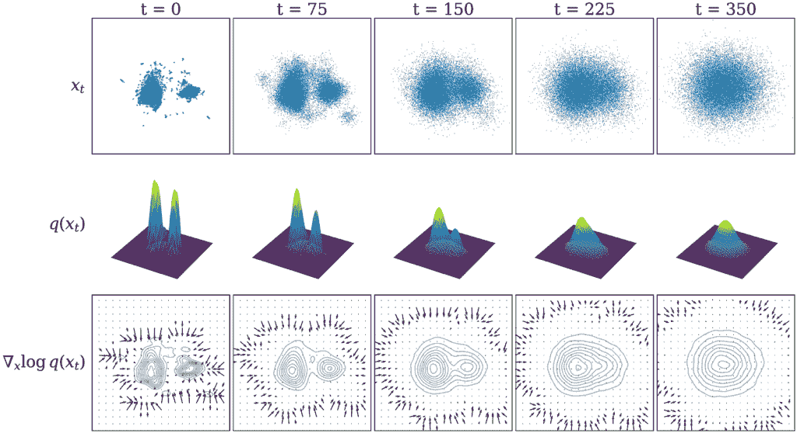

从其概率分布 *q*(*x*ₜ) 在不同的噪声时间步长中采样的数据集 *x*ₜ；下面，我们添加了分数函数 ∇ₓ log *q*(*x*ₜ)。

我试图在上图的底部行给出一个视觉直观：本质上，学习我们扩散模型中的噪声[等同于](https://calvinyluo.com/2022/08/26/diffusion-tutorial.html)（一个常数因子）学习得分函数，得分函数是概率分布对数的梯度：∇ₓ log *q*(*x*)。作为一个梯度，得分函数代表一个矢量场，矢量指向概率密度最高的区域。在每一步减去噪声，相当于沿着这个矢量场中的方向移动，朝着高概率密度区域前进。

只要存在一些信号，得分函数就能有效地引导采样，但在低概率区域，它往往会趋向于零，因为那里几乎没有梯度可以跟随。通过使用多个步骤来覆盖不同的噪声水平，我们可以避免这种情况，因为在高噪声水平下，我们能够将梯度场扩散开，即使我们从分布的低概率密度区域开始，也能使采样收敛。图示表明，随着噪声水平的提高，越来越多的领域被得分函数矢量场覆盖。

#### 摘要

+   扩散模型的目标是学习数据集的潜在概率分布，然后能够从中采样。这需要前向和反向扩散（噪声）过程。

+   前向噪声过程从我们的数据集中提取样本，并逐渐添加高斯噪声（将它们从数据流形上推离）。这个前向过程在计算上效率很高，因为任何级别的噪声都可以在单步中用封闭形式添加。

+   反向去噪过程具有挑战性，因为我们需要在不知道原始数据点的情况下预测如何在每个步骤中去除噪声。我们通过给它许多在不同时间步长上噪声化的数据示例来训练一个机器学习模型来完成这项工作。

+   在前向噪声过程中使用非常小的步骤，使得模型更容易学习反向这些步骤，因为变化很小。

+   通过迭代应用反向去噪过程，模型逐步细化噪声样本，最终产生一个真实的数据点（位于数据流形上的点）。

#### 吸收要点

扩散模型是学习复杂数据分布的强大框架。通过模拟一个顺序去噪过程，分布被隐式地学习。这个过程可以用来生成与训练分布中相似的样本。

### 一旦你训练了一个模型，你如何从中获取有用的东西？

早期使用的生成式人工智能，如“[这个人不存在](https://thispersondoesnotexist.com/)”(*ca*. 2019)引起了轰动，仅仅是因为这是大多数人第一次看到人工智能生成的逼真人脸。在那个案例中使用了生成对抗网络或“GAN”，但原理是相同的：模型隐式地学习了一个底层数据分布——在那个案例中，是人脸——然后从中采样。到目前为止，我们的 glyffuser 模型做的是类似的事情：它从汉字分布中随机采样。

那么，问题随之而来：我们能否做些比随机采样更有用的事情？你可能已经遇到了像 Dall-E 这样的文本到图像模型。它们能够将来自文本提示的额外意义融入扩散过程——这被称为*条件化*。同样，如果能够对科学应用中的扩散模型进行条件化，例如蛋白质（例如 [Chroma](https://github.com/generatebio/chroma)，[RFdiffusion](https://github.com/RosettaCommons/RFdiffusion)，[AlphaFold3](https://github.com/google-deepmind/alphafold3)）或无机晶体结构生成（例如 [MatterGen](https://arxiv.org/abs/2312.03687)），它们将变得更有用，可以生成具有特定对称性、体积模量或带隙等理想特性的样本。

#### 条件分布

我们可以将条件化视为一种引导扩散采样过程向概率分布的特定区域发展的方法。我们曾在[前向扩散的上下文中](https://yue-here.com/posts/diffusion/#forward-diffusion-intuition)提到过条件分布。以下我们将展示如何将条件化视为重塑基本分布。

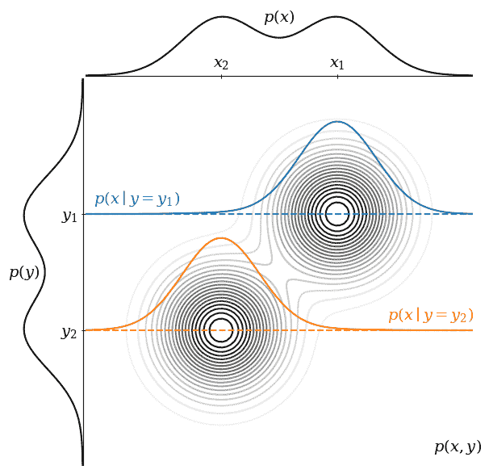

一个联合概率分布 *p*(*x*, *y*) 的简单例子，以等高线图的形式展示，以及其两个边缘 1-D 概率分布，*p*(*x*) 和 *p*(*y*)。*p*(*x*, *y*) 的最高点在 (*x*₁, *y*₁) 和 (*x*₂, *y*₂)。条件分布 *p*(*x*∣*y* = *y*₁) 和 *p*(*x*∣*y* = *y*₂) 显示在主图上。

考虑上面的图。将 *p*(*x*) 视为我们想要从中采样的分布（即图像），将 *p*(*y*) 视为条件信息（即文本数据集）。这些是联合分布 *p*(*x*, *y*) 的边缘分布。对 *p*(*x*, *y*) 在 *y* 上积分可以恢复 *p*(*x*)，反之亦然。

从 *p*(*x*) 中采样，我们同样有可能得到 *x*₁ 或 *x*₂。然而，我们可以对 *p*(*y* = *y*₁) 进行条件化以获得 *p*(*x*∣*y* = *y*₁)。你可以将其想象为在给定的 *y* 值处对 *p*(*x*, *y*) 进行切片。在这个条件分布中，我们更有可能从 *x*₁ 中采样，而不是从 *x*₂ 中采样。

在实践中，为了对文本数据集进行条件化，我们需要将文本转换为数值形式。我们可以使用 *大型语言模型 (LLM) 嵌入*，这些嵌入可以在训练过程中注入到噪声预测模型中。

#### 使用 LLM 嵌入文本

在 glyffuser 中，我们的条件信息以 [英文文本定义](https://github.com/unicode-org/unihan-database/blob/main/kDefinition.txt) 的形式存在。我们有两个要求：1) 机器学习模型更喜欢固定长度的向量作为输入。2) 我们文本的数值表示必须理解上下文——如果我们附近有“lithium”和“element”这两个词，那么“element”的含义应该理解为“化学元素”，而不是“加热元件”。这两个要求可以通过使用预训练的 LLM 来满足。

下面的图示显示了 LLM 如何将文本转换为固定长度的向量。文本首先被 *分词*（LLM 将文本分解为 *标记*，即字符的小块，作为它们的基本交互单元）。每个标记被转换为基本 *嵌入*，这是一个与 LLM 输入大小相同的固定长度向量。然后，这些向量通过预训练的 LLM（这里我们使用 Google 的 T5 模型的 *编码器* 部分），在那里它们被赋予额外的上下文意义。我们最终得到一个包含 *n* 个长度为 *d* 的向量的数组，即一个 (*n, d*) 大小的张量。

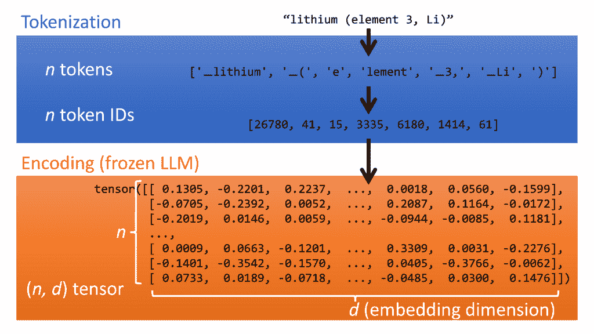

我们可以使用预训练的 LLM 将文本转换为具有上下文意义的数值嵌入。

注意：在某些模型中，特别是 Dall-E，使用 [*对比预训练*](https://arxiv.org/abs/2112.10741) 进行额外的图像-文本对齐。[Imagen](https://arxiv.org/abs/2205.11487) 似乎表明我们可以不进行此操作。

#### 使用文本条件训练扩散模型

将嵌入向量注入模型的确切方法可能有所不同。例如，在 Google 的 [Imagen](https://arxiv.org/pdf/2205.11487) 模型中，嵌入张量被池化（在嵌入维度中合并成一个向量）并添加到数据中，当它通过噪声预测模型时；它还通过 *交叉注意力*（一种在标记序列之间学习上下文信息的方法，最著名的是用于 *transformer* 模型，这些模型是 LLM（如 ChatGPT）的基础）以不同的方式被包含在内）。

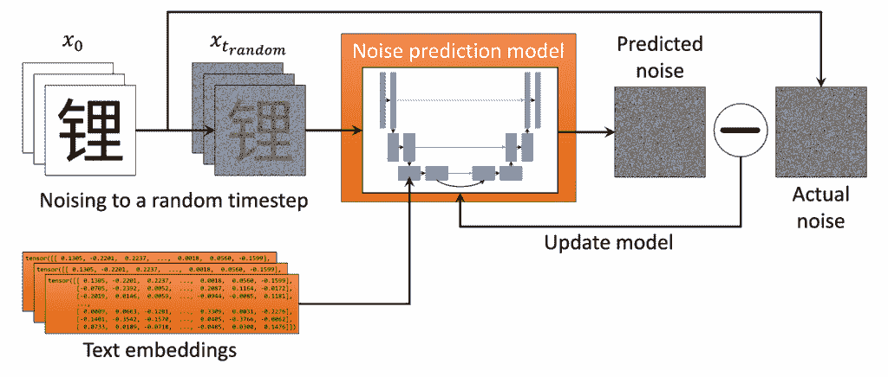

条件信息可以通过多种不同的方法添加，但训练损失保持不变。

在 glyffuser 中，我们只使用交叉注意力来引入这种条件信息。虽然需要重大的架构变化来将此附加信息引入模型，但我们的噪声预测模型的损失函数保持完全相同。

### 测试条件扩散模型

让我们测试一下完全训练好的条件化扩散模型。在下面的图中，我们尝试使用文本提示“Gold”进行单步去噪。正如我们在[交互式 UMAP](https://yue-here.com/posts/diffusion/#dataset-visualization)中提到的，中文字符通常包含称为*部首*的组成部分，这些部首可以传达声音（音韵部首）或意义（语义部首）。一个常见的语义部首是从字符意义“金”，“金”，派生出来的，并用于与金或金属在某种广义上相关的字符中。

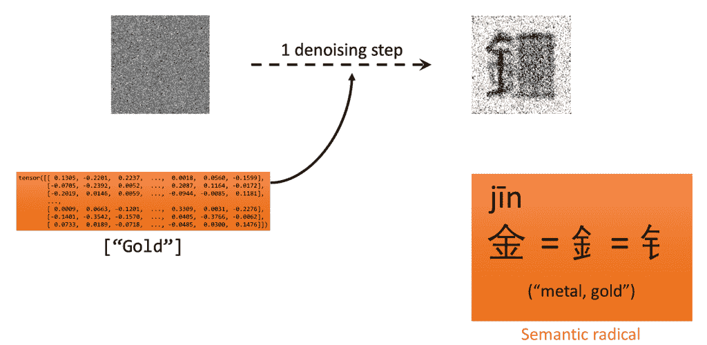

即使只有一个采样步骤，条件化也能引导去噪向概率分布的相关区域。

图表显示，尽管单步不足以很好地近似去噪轨迹，但我们已经移动到了概率分布中包含“金”部首的区域。这表明文本提示有效地引导我们的采样向与提示意义相关的符号概率分布区域。下面的动画显示了相同提示“Gold”的 120 步去噪序列。你可以看到，每个生成的符号要么有釒或钅部首（分别在传统和简体中文中是相同的部首）。

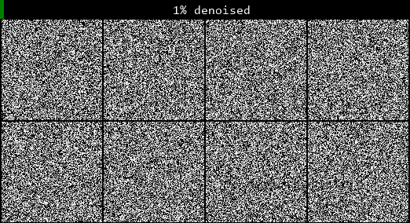

**要点**

条件化使我们能够从扩散模型中采样有意义的输出。

### 进一步说明

我发现，即使在没有完全理解底层发生的事情的情况下，借助教程和现有的库，仍然可以实现一个工作的扩散模型。我认为这是一种很好的学习方法，并强烈推荐 Hugging Face 的[教程](https://huggingface.co/docs/diffusers/tutorials/basic_training)，使用他们的`diffusers` Python 库训练一个简单的扩散模型（现在包括我的小[修复](https://github.com/huggingface/diffusers/pull/8223)!）。

我省略了一些对生产级扩散模型功能至关重要的主题，但对于核心理解来说是不必要的。其中一个是如何生成高分辨率图像的问题。在我们的例子中，我们在像素空间中做了所有的事情，但对于大图像来说，这变得非常计算量大。一般的方法是在较小的空间中进行扩散，然后在单独的步骤中将其上采样。方法包括潜在扩散（用于 Stable Diffusion）和级联超分辨率模型（用于 Imagen）。另一个主题是无分类器引导，这是一种非常优雅的方法，可以增强条件化效果，从而给出更好的提示遵循性。我在之前的关于[glyffuser](https://yue-here.com/posts/glyffuser/)的文章中展示了实现方法，并强烈推荐如果你想要了解更多的话阅读[这篇文章](https://sander.ai/2022/05/26/guidance.html)。

### 进一步阅读

我发现的一些非常有帮助的材料清单：

+   [乔纳森·何的论文 *去噪扩散概率模型*](https://arxiv.org/abs/2006.11239)

+   [杨松关于基于分数模型的文章 *通过估计数据分布的梯度进行生成建模*](https://yang-song.net/blog/2021/score/)

+   [卡尔文·罗的文章 *理解扩散模型：统一视角*](https://calvinyluo.com/2022/08/26/diffusion-tutorial.html)

+   [莉莉安·王博客文章 *什么是扩散模型？*](https://lilianweng.github.io/posts/2021-07-11-diffusion-models/)

+   [杰里米·豪的课程 *从深度学习基础到稳定扩散*](https://course.fast.ai/Lessons/part2.html)

+   [瑞安·奥康纳的教程 *MinImagen — 构建您自己的 Imagen 文本到图像模型*](https://www.assemblyai.com/blog/minimagen-build-your-own-imagen-text-to-image-model/)

+   [乔纳森·凯伦斯的文章 *扩散模型*](https://towardsdatascience.com/diffusion-models-91b75430ec2)

+   [桑德·迪尔曼的 *扩散视角*](https://sander.ai/2023/07/20/perspectives.html) 和 *指导：扩散模型的作弊码*](https://sander.ai/2022/05/26/guidance.html)

+   [斯蒂法诺·埃尔蒙的斯坦福 CS236 课程 *深度生成模型*](https://deepgenerativemodels.github.io/)

### 有趣的额外内容

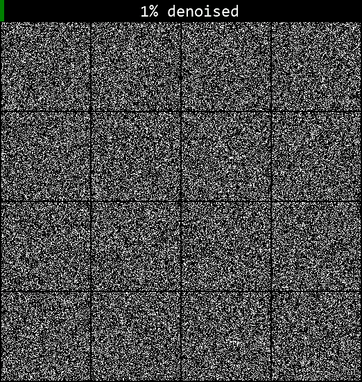

使用由 [凯瑟琳·克劳森](https://github.com/crowsonkb/) 开发的 `<a href="https://huggingface.co/docs/diffusers/main/en/api/schedulers/dpm_sde/" target="_blank" rel="noreferrer noopener">DPMSolverSDEScheduler</a>` 进行的扩散采样，并在 Hugging Face `diffusers` 中实现——注意从噪声到数据的平滑过渡。
