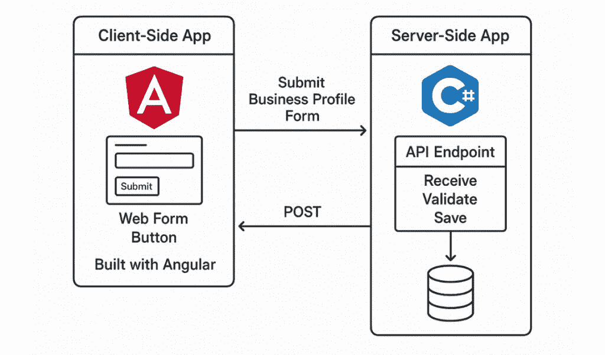
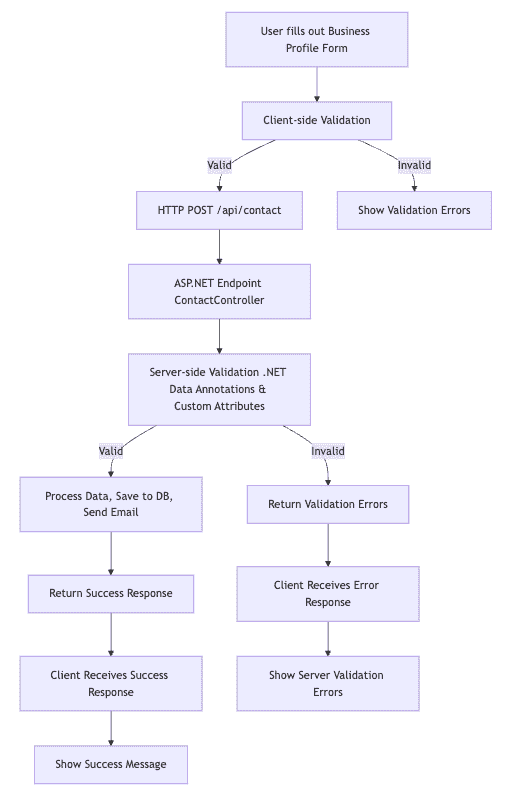

# 3 Steps to Context Engineering a Crystal-Clear Project

> 原文：[`towardsdatascience.com/3-steps-to-ai-context-engineering-for-a-crystal-clear-project/`](https://towardsdatascience.com/3-steps-to-ai-context-engineering-for-a-crystal-clear-project/)

## <mdspan datatext="el1752690294944" class="mdspan-comment">下一个</mdspan>级别的提示工程

不知是否令人惊叹，能够轻松理解任何软件源代码，并对甚至最复杂的项目有一个更好的视角？

企业中 AI 的持续增强使得工作变得更加容易——但也**更加复杂**。在 AI 生成的代码和交付物更快的周转时间之间，全球各地的公司正在将创意输出推向新的水平。

在这篇文章中，你将学习使用**上下文工程**技能为任何项目获得智能图画的**三个简单步骤**。

## 建立在个人知识的基础上

[上下文工程](https://www.promptingguide.ai/guides/context-engineering-guide)是一种提示 LLM 以**特定知识**完成任务的技术。

这种提供上下文的方法与**检索增强生成**（RAG）中使用的相同技术，其中上下文数据或对话历史与对 LLM 的每个请求一起提供。这种额外的知识被用来智能地回答手头的问题。

上下文可以包括 AI 通常没有训练过的**内部**或**私人数据**——这就是这种风格的[提示工程](https://itnext.io/prompt-engineering-the-magical-world-of-large-language-models-dde7d8d043ee)如此强大的原因。

## 一个面向软件开发者的真实世界示例

上下文工程对于理解应用程序的**源代码**和**相互连接的系统**非常有效。

虽然像 ChatGPT 和 Copilot 这样的可访问 AI 在开发环境（IDE）中提供了不同的集成访问方式，但跨越多个**代码库**或架构的问题可能会变得复杂，甚至不可能。

这是对上下文工程的一个完美用例。*以下是使用它的方法！*

## 第 1 步. 建立上下文

我们的目标是理解一个软件的源代码，它恰好跨越了**多个存储库**。

这通常是一个复杂的工作，需要搜索代码中的**各种位置**，引入**不同来源**的图表，并试图理解所有的差异。而不是手动搜索每个单独的项目，我们可以构建一个**上下文**，并让 AI 智能地为我们完成这项工作。

这个过程从制定上下文开始。

## 与源代码聊天

通过与 AI 简单交谈关于**其中一个项目**，可以建立上下文。

使用内置在软件开发环境中的 Copilot 提供了一种方便的方式来构建这个上下文。一个在处理不熟悉的项目时，可以简单地**与源代码聊天**。

例如，考虑一个包含一个用于**客户端**UI 的存储库和一个用于**服务器端数据库**的第二个项目的 Web 开发项目。这两个项目都托管在 GitHub 上的单独存储库中。

我们可以通过从**大纲**开始来在两个项目之间构建执行流程。



由两个项目组成的 Web 应用程序，这些项目跨越多个存储库。来源：作者。

## 生成大纲

第一个项目（客户端）可以加载到软件开发 IDE 中，从那里我们可以要求 AI 协作者生成一个**执行路径**的大纲。

假设我们正在尝试理解点击应用程序中的按钮是如何导致将记录保存到数据库中的。我们可能会简单地**询问**协作者按钮是如何工作的。这次对话将包括请求在按钮点击后执行的主函数的大纲，包括**函数名称**和**参数**。

> > 在提交按钮点击后，制作执行路径的大纲，包括发送到服务器端代码的 HTTP POST 请求、接收有效负载的端点方法以及客户端上执行的任何验证。

一旦我们有了第一个项目的概述作为上下文，就轮到第二个项目了。

## 第 2 步：使用上下文

与第一个项目对话的**输出**现在可以用来更好地理解第二个项目。

由于 AI 协作者通常只能处理**当前加载的项目**，我们需要将第二个项目加载到同一个 IDE 中并开始一个**新的对话**。我们可以向协作者提出相同的问题——从按钮点击的行为生成执行路径。然而，这次，我们可以包括来自第一个项目的响应，有效地为 LLM 提供**上下文**。

注意我们是如何**延续**第一个项目的对话到第二个项目中的，这样 LLM 就可以利用对两个项目更详细的理解来将结果组合成一个**统一的答案**。

> > 在表单提交后，制作执行路径的大纲，包括接收有效负载的端点方法以及在返回响应之前在服务器上执行的任何验证。使用以下客户端执行路径作为上下文：[上下文]

在多个项目中扩展上下文只是其中一个令人惊叹的部分。我们实际上可以更进一步，创建一个**图形流程图**。

## 第 3 步：可视化结果

涵盖两个项目的软件执行大纲提供了程序行为的**文本视图**，但我们可以做得更好。

我们可以重复使用与 AI 先前对话中的联合上下文来生成全面的可视化。包括**ChatGPT**、**Sonnet**和**Gemini**在内的多模态模型非常适合这个目的。

> > 以下描述了提交业务表单的完整执行过程。使用 Mermaid Markdown 生成流程图，兼容 GitHub 拉取请求，并包括流程图中所有事件的文本描述。

使用[Mermaid](https://docs.github.com/en/get-started/writing-on-github/working-with-advanced-formatting/creating-diagrams#creating-mermaid-diagrams)生成流程图。结果与 GitHub 拉取请求兼容，可以直接在 PR 描述中显示。

```py
flowchart TD
A[User fills out Business Profile Form] → B[Client-side Validation]
B →|Valid| C[HTTP POST /api/contact]
B →|Invalid| Z[Show Validation Errors]
C → D[ASP.NET Endpoint ContactController]
D → E[Server-side Validation .NET Data Annotations & Custom Attributes]
E →|Valid| F[Process Data, Save to DB, Send Email]
E →|Invalid| Y[Return Validation Errors]
F → G[Return Success Response]
Y → H[Client Receives Error Response]
G → I[Client Receives Success Response]
H → J[Show Server Validation Errors]
I → K[Show Success Message]
```

生成的流程图在 GitHub 上[渲染](https://github.com/primaryobjects/business-profile-form?tab=readme-ov-file#execution-flowchart)，提供了软件**完整执行**的清晰图景。



通过上下文工程跨越多个项目的流程图。来源：作者。

## 将拉取请求提升到下一个层次

流程图不仅对开发者理解代码库有效，也是记录和甚至向同行展示你工作的绝佳方式。

在多个提示中使用上下文工程的过程允许在**多个项目**之间**迁移**知识，以获得一个单一的**一致结果**。

在拉取请求中直接以流程图的形式展示此结果，提供了一种**专业级别**的文档，其他人可以快速且容易地理解。

## 向更高水平的 AI 迈进

正如我们所见，**上下文工程**可以用来生成理解多个仓库代码的强大流程图。

然而，也许这个手动过程仅仅是向更强大的 AI 可用时过渡的**中间步骤**。毕竟，在软件开发中 AI 一直在稳步进步。尽管如此，正如我们在前几年通过提示工程所看到的，利用 AI 共飞行员的力量**增强**作为开发者的技能是很重要的。

通过使用 AI 驱动的流程图创建易于理解的代码更改，你可以提高你的编程输出，并展示你在 AI 方面的技能。

***你如何使用 AI 来提升你的工作？告诉我！***

## 关于作者

如果你喜欢这篇文章，请考虑在[Medium](https://medium.com/@KoryBecker)、[Bluesky](https://bsky.app/profile/primaryobjects.bsky.social)、[LinkedIn](https://www.linkedin.com/in/korybecker)和我的[网站](https://primaryobjects.com/)上关注我，以便通知我的未来文章和研究工作。
