# 实践中的不平等：电子商务投资组合分析

> [`towardsdatascience.com/inequality-in-practice-e-commerce-portfolio-analysis-adc3d0876acd/`](https://towardsdatascience.com/inequality-in-practice-e-commerce-portfolio-analysis-adc3d0876acd/)


由 DALL-E 根据作者的提示，受“不莱梅的音乐家”启发生成的图像

你的畅销产品是在创造还是破坏你的业务？

想象一下，如果一两个产品不再受欢迎，你的全部收入可能会崩溃，这是令人恐惧的。然而，在数百种产品上过于分散通常会导致平庸的结果和残酷的价格战。

发现如何通过一个 6 年的 Shopify 案例研究找到专注与多元化的完美平衡。

### 为什么费心？

理解你的产品组合中的集中度不仅仅是一个智力练习；它对关键的商业决策有直接影响。从库存计划到营销支出，了解你的收入如何在商品之间分配影响着你的方法。

本文将介绍监控集中度的实用策略，解释这些测量实际上意味着什么，以及如何从你的数据中获得有价值的见解。

我将带你了解基本指标和高级分析，包括使数据生动起来的交互式可视化。

我还分享了在此分析中使用的 R 代码片段。可以直接使用或将其逻辑改编到你喜欢的编程语言中。

## 集中度问题

在分析市场分析或投资理论时，我们通常关注集中度——价值是如何在不同元素之间分布的。在电子商务中，这转化为一个基本问题：你的收入中有多少应该来自你的顶级产品？

是拥有几个强劲的销售者还是广泛的产品范围更好？这不仅仅是一个理论问题……

大部分收入依赖于少数产品意味着你的运营是简化和专注的。但是，当市场偏好发生变化时会发生什么呢？相反，将收入分散到数百种产品可能看起来更安全，但通常意味着你缺乏任何真正的竞争优势。

那么最佳点在哪里？或者更确切地说，最佳范围是什么，以及各种比率如何描述它。

什么使得这项分析特别有价值的是，它基于一家随着时间的推移不断扩展其产品范围的企业的真实数据。

## 正确获取数据

### 关于数据集

这项分析是为一家真正的美国电子商务商店进行的——我们的一位客户，他们友好地同意分享他们的数据供本文使用。这些数据涵盖了他们六年的增长，为我们提供了丰富的视角，了解产品集中度是如何随着业务的成熟而演变的。

虽然处理实际业务数据给我们带来了真正的洞察力，但在稍后的某个部分，我也创建了一个合成数据集。这个小的人工数据集有助于在更受控的环境中展示各种比率之间的关系——展示“数手指”的模式。

为了明确：这个合成数据完全是从头创建的，并且只是松散地模仿了在真实电子商务中看到的一般模式——它与我们的客户实际数据没有直接联系。这与我的前一篇文章不同，在那篇文章中，我使用 Snowflake 功能根据真实模式生成了合成数据。

### 数据导出

主要分析基于真实数据，但那个小的人工数据集也起到了重要的作用——它以易于理解的方式解释了各种比率之间的关系。相信我，当向利益相关者解释复杂的依赖关系时，拥有这样一个具有清晰视觉的微观数据集真的非常有用 😉

Shopify 的原始交易导出包含了我们所需要的一切，但我们必须适当地安排它以进行浓度分析。数据包含了每个交易的所有产品，但日期只在每个交易中占一行，因此我们必须将其传播到所有产品，同时保留交易 ID。可能不是研究的第一次迭代，但如果我们要进行微调，我们应该考虑如何处理折扣、退货等问题。在外国销售的情况下，进行全球和特定国家的研究。

我们有一个产品名称和一个 SKU，在处理变体时，这两个都应该遵循某种命名约定和逻辑。如果我们有一个包含所有这些描述和代码的主目录，我们非常幸运。如果你有，请使用它，但将其与实际的交易数据进行比较。

### 产品变体

在我的情况下，产品名称是以基础名称和变体通过破折号分隔的结构化的。非常简单易用，分为主要产品和变体。例外情况？当然，它们总是存在的，尤其是在处理 6 年的高度成功的电子商务数据时：）。例如，一些名称（例如“多功能”）包含破折号，而另一些则没有。然后，一些确实有变体，而另一些则没有。所以预期这里会有一些调整，但这是一个关键阶段。

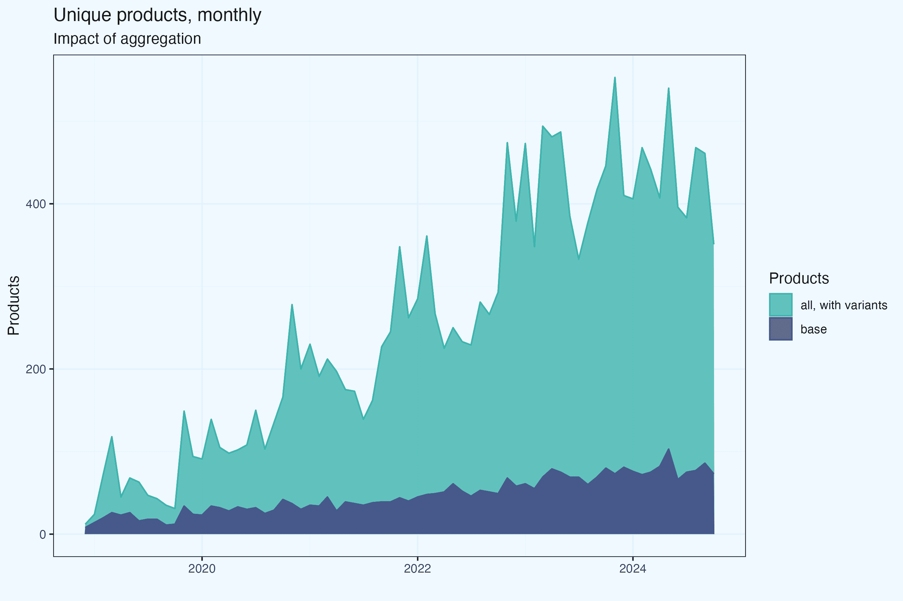

唯一产品的数量，带和不带变体——所有图表均由作者绘制，使用自己的 R 代码

如果你想知道为什么我们需要从浓度分析中排除变体，上面的图表清楚地说明了这一点。这些值相当不同，如果我们用变体分析浓度，我们预计会得到截然不同的结果。

分析基于交易，统计给定月份中具有/不具有变体的产品数量。但如果变体数量很多，并不是所有变体都会出现在一个月的交易中。是的，这是正确的——所以让我们考虑一个更大的时间范围，一年。

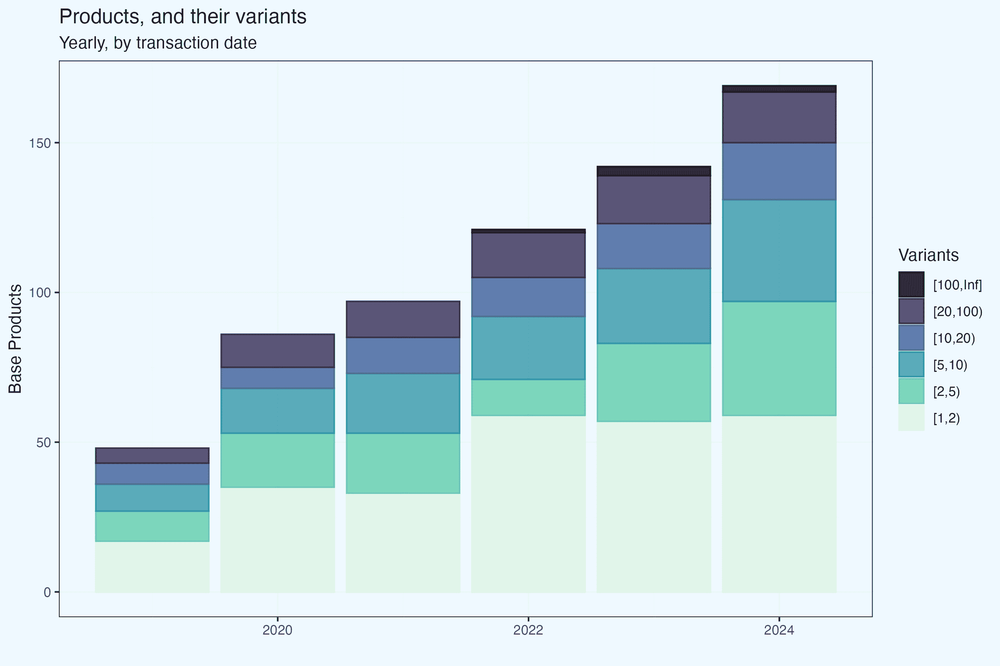

产品及其变体，按交易日期，年度

我根据我们在交易中的数据，计算了日历年度内每个基础产品的变体数量。每个基础产品的变体数量被分为几个区间。以 2024 年为例，图表显示我们有大约 170 个基础项目，其中不到一半只有一个变体（浅绿色条）。然而，另一部分有多个版本，值得注意的是（我相信，除非你在服装电商领域工作，否则可能不会很明显）我们有一些版本数量非常多的产品。黑色区间包含有 100 种或更多不同变体的项目。

如果你猜到他们通过引入新产品同时保持旧产品可用来增加产品种类，你是正确的。但知道差异是否源于传统产品或新产品是否有趣？如果我们只包括当年引入的产品会怎样？我们可以通过使用产品引入日期而不是交易来检查它。因为我们的唯一数据集是交易垃圾，每个产品的第一次交易被视为引入日期。并且对于每个产品，我们取在交易中出现的所有版本，没有时间限制（从产品引入到最新记录）。

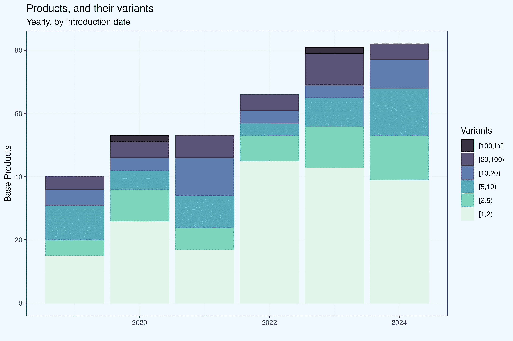

产品及其变体，按产品引入日期，年度

现在让我们将这两个图表并排放置，以便于比较。考虑到交易日期，每年我们有更多的产品，差异在增长——因为还有之前引入的产品交易。不出所料，没有惊喜。如果你想知道为什么 2019 年的数据不同——这是一个很好的发现。事实上，商店在 2018 年开始运营，但我移除了这些最初的几个月；然而，正是这些初始月份的影响使得 2019 年有所不同。

在本文中，我们不是关注产品变体及其对收入的影响。但正如现实分析中经常发生的那样，在初始阶段，甚至进展过程中，也存在“分支”选项。我们甚至还没有完成数据准备，就已经变得很有趣了。

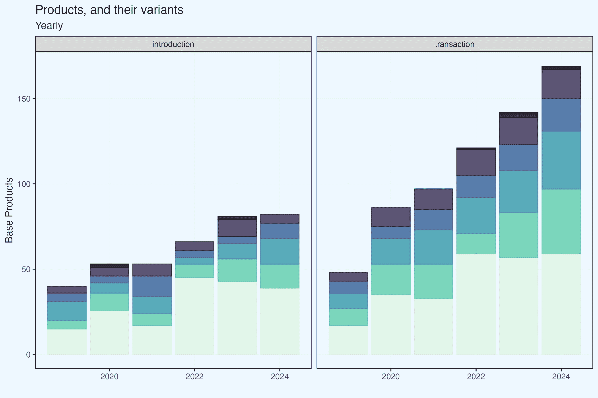

产品及其变体，按产品引入和交易，年度

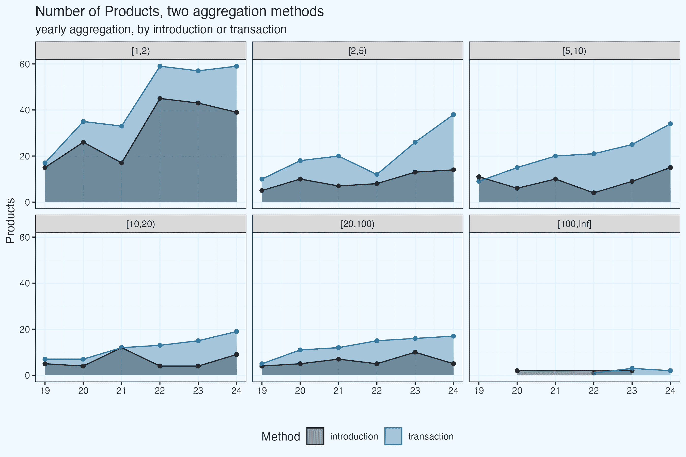

与上述相同数据，按区间细分

理解产品结构对于进行有意义的集中度分析至关重要。现在我们的数据已经适当地格式化，我们可以检查实际的集中度测量以及它们揭示了理想的投资组合结构。在下一部分，我们将探讨这些测量以及它们对电子商务企业意味着什么。

## 测量集中度——理论与实践相结合

当涉及到确定浓度时，经济学家和市场分析师已经为我们做了大量工作。在数十年的市场、竞争力和不平等研究过程中，他们已经开发出强大的分析方法，这些方法在各种行业中都已被证明是有用的。我们无需为电子商务投资组合分析开发新的指标，而可以使用现有的经过时间考验的方法。

让我们看看理论框架如何为实际的电子商务问题提供启示。

### Herfindahl-Hirschman Index

HHI（Herfindahl-Hirschman Index）可能是衡量集中度最常见的方式。监管机构使用它来检查市场是否没有变得过于集中——他们取每个公司的市场份额百分比，平方它们，然后相加。就这么简单。结果可以从几乎 0（许多小玩家）到 10,000（一家公司独占所有）不等。

为什么使用 HHI 进行电子商务投资组合分析？逻辑很简单——在市场上不是公司之间的竞争，而是产品之间的收入竞争。数学运算方式完全相同——我们取每个产品的总收入份额，平方它，然后求和。高 HHI 意味着收入依赖于少数产品，而低 HHI 则表明收入分散在许多产品上。这为我们提供了一个单一的数字，可以追踪投资组合随时间的变化。

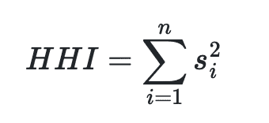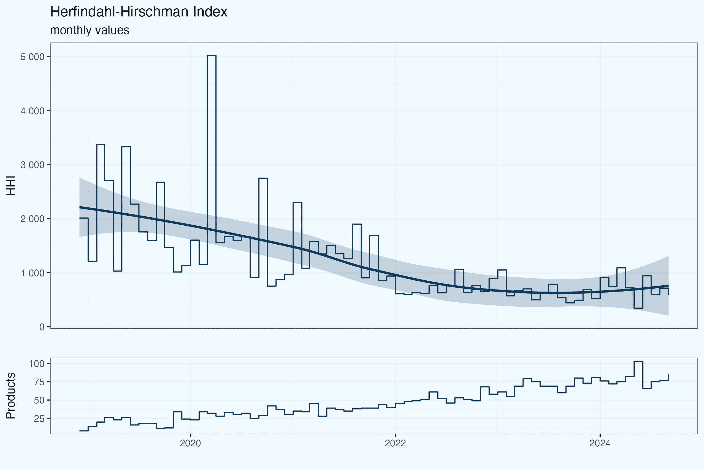

HHI 和产品背景

### 帕累托

谁没有听说过帕累托法则？1896 年，意大利经济学家维弗雷多·帕累托观察到 20%的人口拥有意大利 80%的土地。从那时起，这种模式在各种领域被发现，包括财富分配和零售销售。

虽然通常被称为“80/20 法则”，但帕累托法则并不仅限于这些数字。我们可以使用任何 x 轴标准（例如，前 30%的产品）来确定适当的 y 值（收入贡献）。通过连接这些位置形成的洛伦兹曲线，提供了一个关于集中度的完整图景。

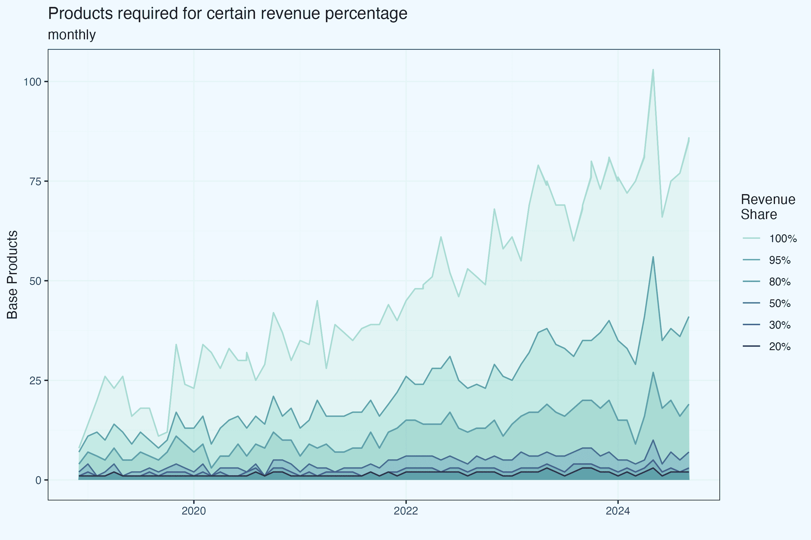

不同收入份额阈值的帕累托线

上图显示了我们需要多少产品才能达到一定的收入份额（月收入）。我随意地选取了.2、.3、.5、.8、.95，当然也包括 1——这意味着总产品数量，在一个月内贡献了 100%的收入。

### 洛伦兹曲线

如果我们按产品的收入贡献排序，并绘制线条，我们得到洛伦兹曲线。在两个轴上，我们都有产品和它们的收入份额的百分比。在完全均匀的收入分配的情况下，我们会得到一条直线，而在“完美集中”的情况下，曲线非常陡峭，接近 100%的收入，然后迅速向右转，以包括其他产品的残余收入。

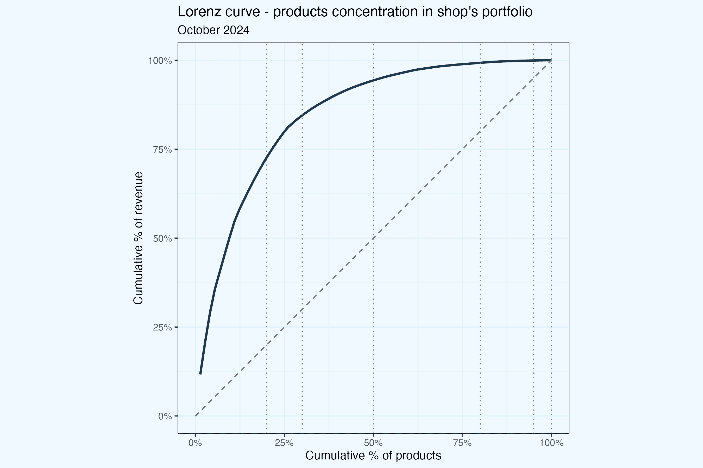

洛伦兹曲线

看这条线很有趣，但在大多数情况下，它看起来会很相似，就像一个“弯曲的棍子”。因此，我们现在比较一下前几个月和几年前（坚持在 10 月）的这些线条。月度线条相当相似，如果你认为在这个图表中添加一些交互性会很好，你绝对是对的。年度比较显示了更多差异（我们仍然有月度数据，每年取 10 月），这是可以理解的，因为这些测量在时间上更远。

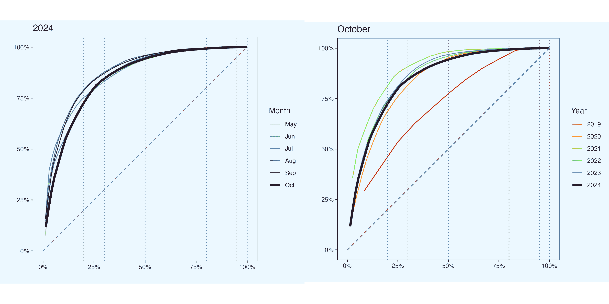

洛伦兹曲线 – 比较时期

因此，我们确实看到了线条之间的差异，但我们能否以某种方式量化它们，而不仅仅依赖于视觉相似性？当然可以，为此有一个比率——基尼系数。顺便说一下，在接下来的章节中，我们将有很多比率。

### 基尼系数

要将洛伦兹曲线的形状转换为数值，我们可以使用基尼系数——定义为等于线以上和以下两个区域的比率。在下面的图表中，它是深蓝色和浅蓝色区域的比率。

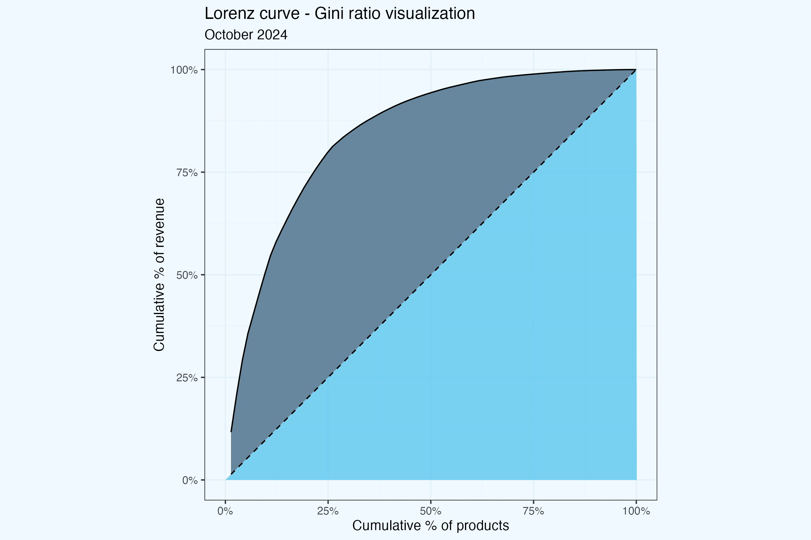

基尼系数可视化

让我们可视化两个时期——2019 年 10 月和 2024 年 10 月，与之前图表中的时期完全相同。

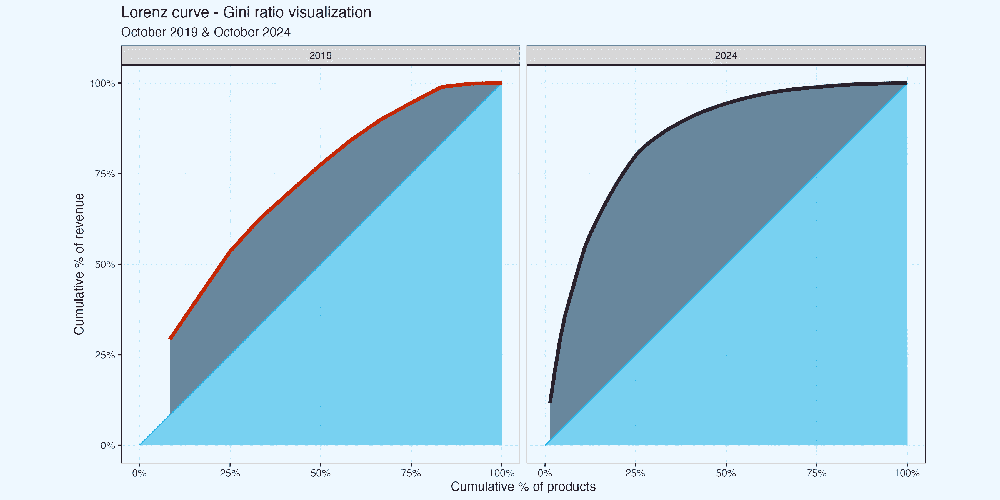

基尼系数，比较两个时期

一旦我们通过可视化对基尼系数的计算有了良好的理解，让我们在整个时期内绘制它。

我使用 R 进行数据分析，所以我很容易获得基尼系数（以及我稍后会展示的其他比率）。初始数据表（x3a_dt）包含每个产品每月的收入。结果表包含每月的基尼系数。

```py
#-- calculate Gini ratio, monthly
library(data.table, ineq)
x3a_ineq_dt <- x3a_dt[, .(gini = ineq::ineq(revenue, type = "Gini")), month]
```

很好，我们有所有这些用于重负载的包。背后的数学并不特别复杂，但我们的时间是宝贵的。

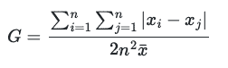

下面的图表显示了计算结果。

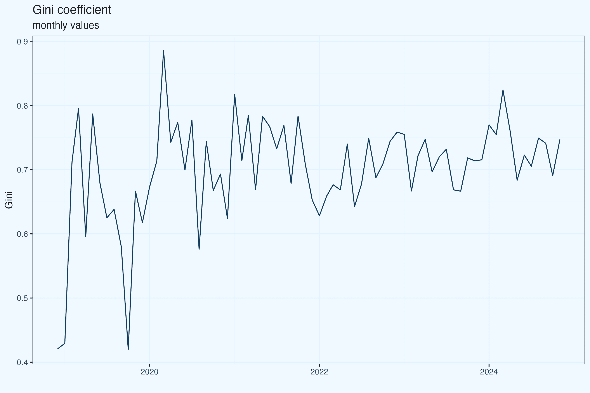

基尼系数随时间变化

我没有包括平滑线及其置信区间通道，因为我们没有测量点，但 Gini 计算的结果，以及其自身的误差分布。为了在数学上非常严格和精确，我们需要计算置信区间，并基于此绘制平滑线。结果如下。

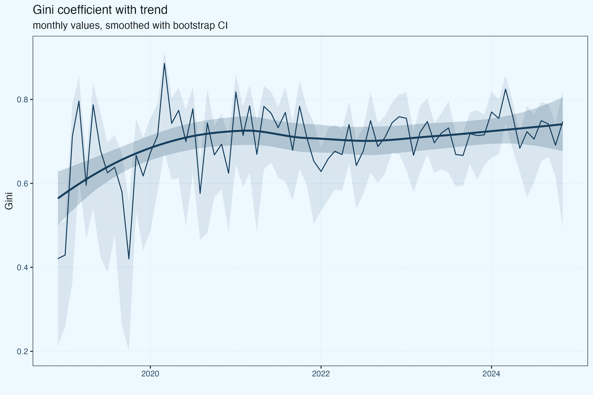

基尼系数随时间变化，带有趋势线

由于我们并不直接使用计算出的比率的统计显著性，这种超级严格的方法有点过度。我并没有在绘制 HHI 趋势线时这样做，也不会在接下来的图表中这样做。但了解这个细微差别是好的。

我们到目前为止已经看到了两个比率——HHI 和基尼系数，它们远非相同。洛伦兹曲线越接近对角线，表明分布越均匀，这就是我们在 2019 年 10 月所拥有的，但 HHI 比 2024 年更高，这表明 2019 年的集中度更高。也许我在计算中犯了错误，甚至更糟糕的是，在数据准备初期就犯了错误？那将是非常不幸的。或者数据本身没有问题，但我们正在努力正确地解释？

我经常有这样的怀疑时刻，尤其是在分析进行得非常快的时候。那么我们如何应对这种情况，加强对数据和我们对依赖关系的理解？记住，无论你做什么分析，总有第一次。而且，我们往往没有“休闲”研究的时间，这通常是为客户（或上级、利益相关者、无论谁提出了要求，甚至是我们自己，如果这是我们的倡议）的工作。

## 紧握不放

我们需要很好地理解如何解释所有这些比率，包括它们之间的依赖关系。如果你打算向其他人展示你的结果，这里的问题是有保证的，所以最好做好充分的准备。我们可以使用现有的数据集，或者我们可以生成一个小集合，这样更容易捕捉到依赖关系。让我们采取后一种方法。

让我们从创建一个小数据集开始，

```py
library(data.table)

#-- Create sample revenue data
revenue <- list(
  "2021" = rep(15, 10),                    # 10 values of 15
  "2022" = c(rep(100, 5), rep(10, 25)),    # 5 values of 100, 25 values of 10
  "2023" = rep(25, 50),                    # 50 values of 25
  "2024" = c(rep(100, 30), rep(10, 70))    # 30 values of 100, 70 values of 10
)
```

将其合并成一个 data.table。

```py
#-- Convert to data.table in one step
x_dt <- data.table(
  year = rep(names(revenue), sapply(revenue, length)),
  revenue = unlist(revenue)
)
```

数据的快速概述。

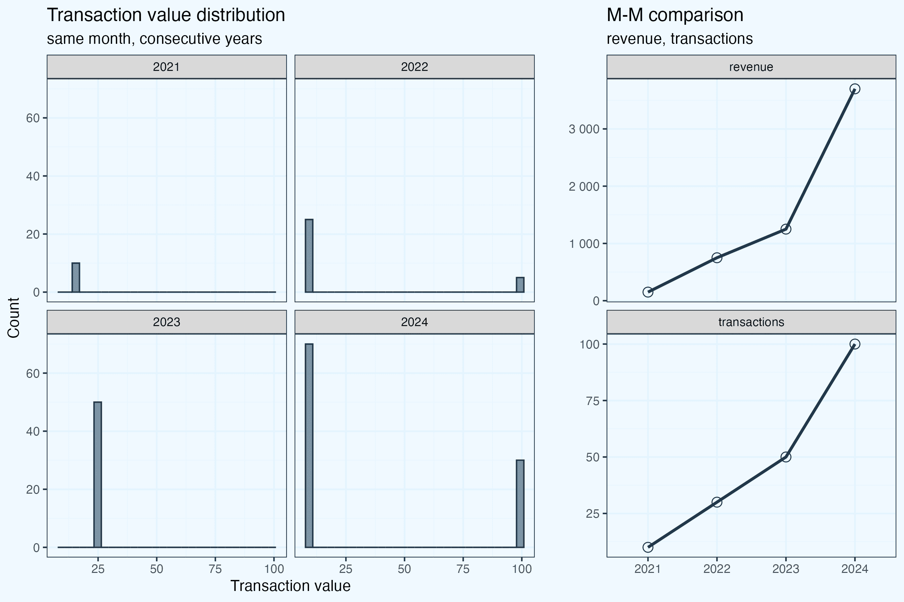

示例数据集

我们似乎已经拥有了所需的一切——一个简单的数据集，但仍然相当真实。现在我们正在继续进行计算和图表，类似于我们之前对真实数据集所做的那样。

```py
#-- HHI, Gini
xh_dt <- x_dt[, .(hhi = ineq::Herfindahl(revenue), 
                  gini = ineq::Gini(revenue)), year]
```

```py
#-- Lorenz
xl_dt <- x_dt[order(-revenue), .(
  cum_prod_pct = seq_len(.N)/.N, 
  cum_rev_pct = cumsum(revenue)/sum(revenue)), year]
```

以及渲染图表。

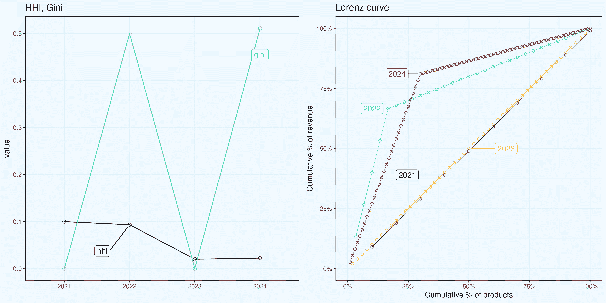

比率比较

这些图表在理解比率、它们之间的关系以及数据方面非常有帮助。对我们自己和利益相关者来说，进行这样的微观分析总是一个好主意——作为“备用口袋”幻灯片，甚至可以提前分享它们。

知识点细节——如何稍微调整线条，使其不重叠，并在图表内添加标签？先渲染一个图表，然后进行手动微调，预期需要多次迭代。

```py
#-- shift the line
xl_dt[year == "2021", `:=` (cum_rev_pct = cum_rev_pct - .01)]
```

对于标签，我使用 ggrepel，但默认情况下，它将标签所有点，而我们只需要每行一个。此外，还需要决定哪个标签看起来更好，以制作出美观的图表。

```py
#-- decide which points to label
labs_key2_dt <- data.table(
  year = c("2021", "2022", "2023", "2024"), position = c(4, 5, 25, 30))

#-- set keys
list(xl_dt, labs_key2_dt) |> lapply(setkey, year)

#-- join
label_positions2 <- xl_dt[
  labs_key2_dt, on = .(year), # join on 'year' 
  .SD[get('position')],       # Use get('position') to reference the position from labs_key_dt
  by = .EACHI]                # for each year
```

渲染图表。

```py
#-- render plot
plot_22b <- xl_dt |>
  ggplot(aes(cum_prod_pct, cum_rev_pct, color = year, group = year, label = year)) +
  geom_line(linewidth = .2) +
  geom_point(alpha = .8, shape = 21) +
  theme_bw() +
  scale_color_viridis_d(option = "H", begin = 0, end = 1) +
  ggrepel::geom_label_repel(
    data = label_positions2, force = 10, 
    box.padding = 2.5, point.padding = .3, 
    seed = 3, direction = "x") +
... additional styling 
```

## 更多比率

我开始于 HHI，洛伦兹曲线以及伴随的基尼比率，因为它们似乎是集中和不等测量良好的起点。然而，有许多不同的比率用于定义分布，无论是用于不平等还是一般情况。我们不太可能一次性使用所有这些比率，因此选择提供对你特定挑战最多见解的子集。

在适当的数据集结构下，计算它们相当直接。我分享了一些代码片段，其中包含每月计算的一些比率。我们使用的数据集是我们已经拥有的——按产品每月收入（基础产品，不包括变体）。


从`ineq`包中的比率开始。

```py
#---- inequality ----
x3_ineq_dt <- x3a_dt[, .(
  # Classical inequality/concentration measures
  gini     = ineq::ineq(revenue, type = "Gini"),      # Gini coefficient
  hhi      = ineq::Herfindahl(revenue),               # Herfindahl-Hirschman Index
  hhi_f    = sum((rev_pct*100)²),                    # HHI - formula
  atkinson = ineq::ineq(revenue, type = "Atkinson"),  # Atkinson index
  theil    = ineq::ineq(revenue, type = "Theil"),     # Theil entropy index
  kolm     = ineq::ineq(revenue, type = "Kolm"),      # Kolm index
  rs       = ineq::ineq(revenue, type = "RS"),        # Ricci-Schutz index
  entropy  = ineq::entropy(revenue),                  # Entropy measure
  hoover   = mean(abs(revenue - mean(revenue)))/(2 * mean(revenue)), # Hoover (Robin Hood) index
```

分布形状和上下份额及比率。

```py
 # Distribution shape measures
  cv       = sd(revenue)/mean(revenue),               # Coefficient of Variation
  skewness = moments::skewness(revenue),              # Skewness
  kurtosis = moments::kurtosis(revenue),              # Kurtosis

  # Ratio measures
  p90p10   = quantile(revenue, 0.9)/quantile(revenue, 0.1),   # P90/P10 ratio
  p75p25   = quantile(revenue, 0.75)/quantile(revenue, 0.25), # Interquartile ratio
  palma    = sum(rev_pct[1:floor(.N*.1)])/sum(rev_pct[floor(.N*.6):(.N)]), # Palma ratio
```

```py
 # Concentration ratios and shares
  top1_share  = max(rev_pct),                         # Share of top product
  top3_share  = sum(head(sort(rev_pct, decreasing = TRUE), 3)),  # CR3
  top5_share  = sum(head(sort(rev_pct, decreasing = TRUE), 5)),  # CR5
  top10_share = sum(head(sort(rev_pct, decreasing = TRUE), 10)), # CR10
  top20_share = sum(head(sort(rev_pct, decreasing = TRUE), floor(.N*.2))),  # Top 20% share
  mid40_share = sum(sort(rev_pct, decreasing = TRUE)[floor(.N*.2):floor(.N*.6)]), # Middle 40% share
  bottom40_share = sum(tail(sort(rev_pct), floor(.N*.4))),      # Bottom 40% share
  bottom20_share = sum(tail(sort(rev_pct), floor(.N*.2))),      # Bottom 20% share
```

基本统计，分位数。

```py
 # Basic statistics
  unique_products = .N,                              # Number of unique products
  revenue_total = sum(revenue),                      # Total revenue
  mean_revenue = mean(revenue),                      # Mean revenue per product
  median_revenue = median(revenue),                  # Median revenue
  revenue_sd = sd(revenue),                          # Revenue standard deviation

  # Quantile values
  q20 = quantile(revenue, 0.2),                      # 20th percentile
  q40 = quantile(revenue, 0.4),                      # 40th percentile
  q60 = quantile(revenue, 0.6),                      # 60th percentile
  q80 = quantile(revenue, 0.8),                      # 80th percentile
```

计算指标。

```py
 # Count measures
  above_mean_n = sum(revenue > mean(revenue)),        # Number of products above mean
  above_2mean_n = sum(revenue > 2*mean(revenue)),     # Number of products above 2x mean
  top_quartile_n = sum(revenue > quantile(revenue, 0.75)), # Number of products in top quartile
  zero_revenue_n = sum(revenue == 0),                 # Number of products with zero revenue
  within_1sd_n = sum(abs(revenue - mean(revenue)) <= sd(revenue)),    # Products within 1 SD
  within_2sd_n = sum(abs(revenue - mean(revenue)) <= 2*sd(revenue)),  # Products within 2 SD
```

超过（或低于）阈值的收入。

```py
 # Revenue above threshold
  rev_above_mean = sum(revenue[revenue > mean(revenue)])  # Revenue from products above mean
), month]
```

结果表格有 40 列，72 行（月份）。


如前所述，想象一个人会使用 40 个比率是困难的，所以我更倾向于展示如何计算它们的方法，并且应该选择相关的比率。一如既往，可视化并了解它们之间的关系是很好的。

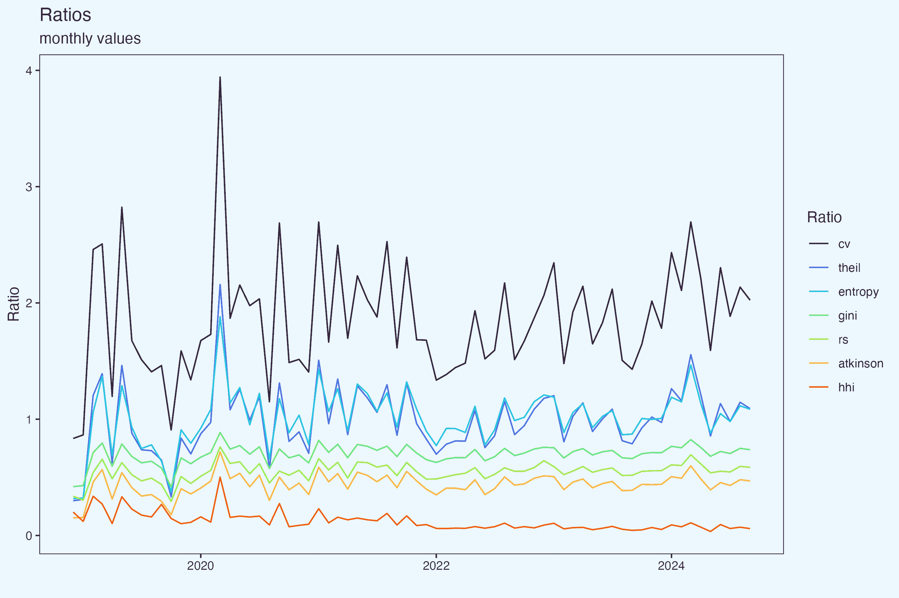

随时间变化的选定比率

我们可以计算所有比率之间的相关系数矩阵，或选定子集。

```py
# Select key metrics for a clearer visualization
key_metrics <- c("gini", "hhi", "atkinson", "theil", "entropy", "hoover", 
                 "top1_share", "top3_share", "top5_share", "unique_products")

cor_matrix <- x3_ineq_dt[, .SD, .SDcols = key_metrics] |> cor()
```

将列名改为更友好的名称。

```py
# Make variable names more readable
pretty_names <- c(
  "Gini", "HHI", "Atkinson", "Theil", "Entropy", "Hoover",
  "Top 1%", "Top 3%", "Top 5%", "Products"
)
colnames(cor_matrix) <- rownames(cor_matrix) <- pretty_names
```

并渲染图表。

```py
corrplot::corrplot(cor_matrix, 
         type = "upper",
         method = "color",
         tl.col = "black",
         tl.srt = 45,
         diag = F,
         order = "AOE") 
```

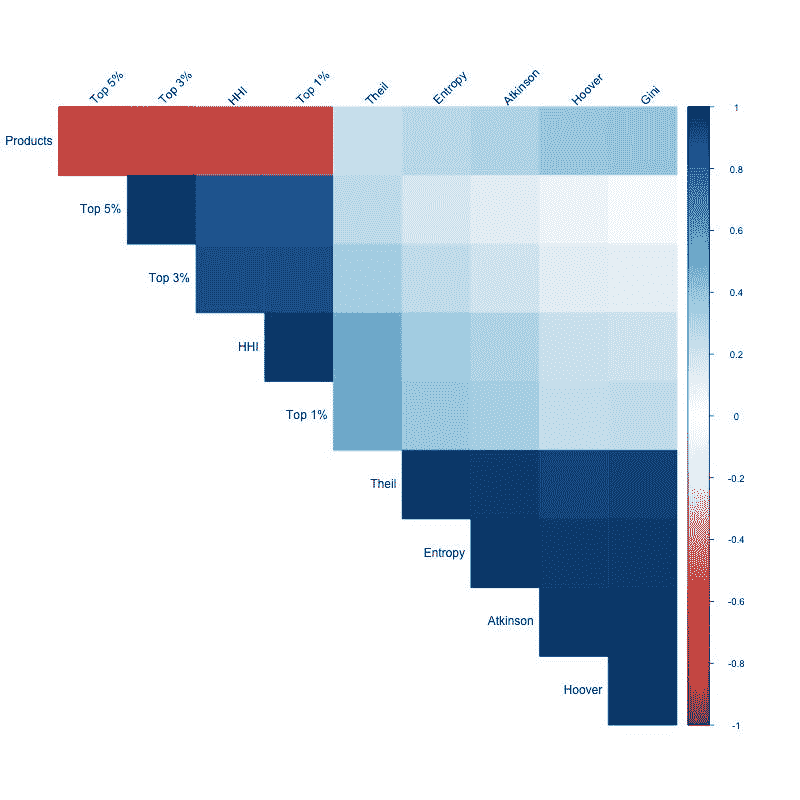

相关系数矩阵，选定比率

然后我们可以绘制一些有趣的配对。当然，其中一些根据定义具有正或负相关性，而在其他情况下则不那么明显。

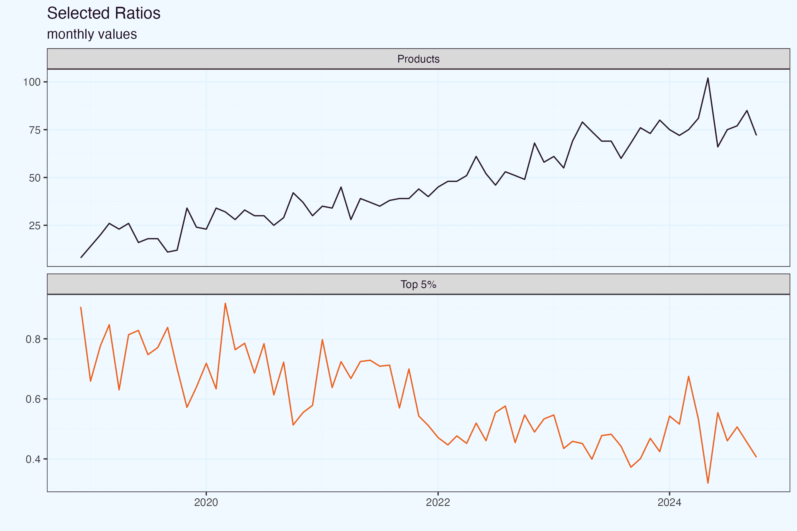

选定的比率，负相关

## 给我展示金钱

我们从比率和对数洛伦兹曲线作为自上而下的概览开始分析。这是一个好的开始，但有两个复杂之处——比率有一个相对较宽的范围，当业务表现良好时，几乎与可操作的见解没有联系。即使我们注意到比率处于边缘，或超出安全范围，也不清楚我们应该做什么。像“降低浓度”这样的指示有点含糊不清。

电子商务讨论和呼吸产品，因此为了使分析相关，我们需要参考特定的产品。人们也希望了解哪些产品构成了核心的 50%，80%的收入，同样重要的是，如果这些产品持续作为顶级贡献者。

让我们以 2024 年 8 月为例，看看哪些产品在该月贡献了 50%的收入。然后，我们检查这些确切产品在其他月份的收入。有 5 种产品，在 8 月份产生了（至少）50%的收入。

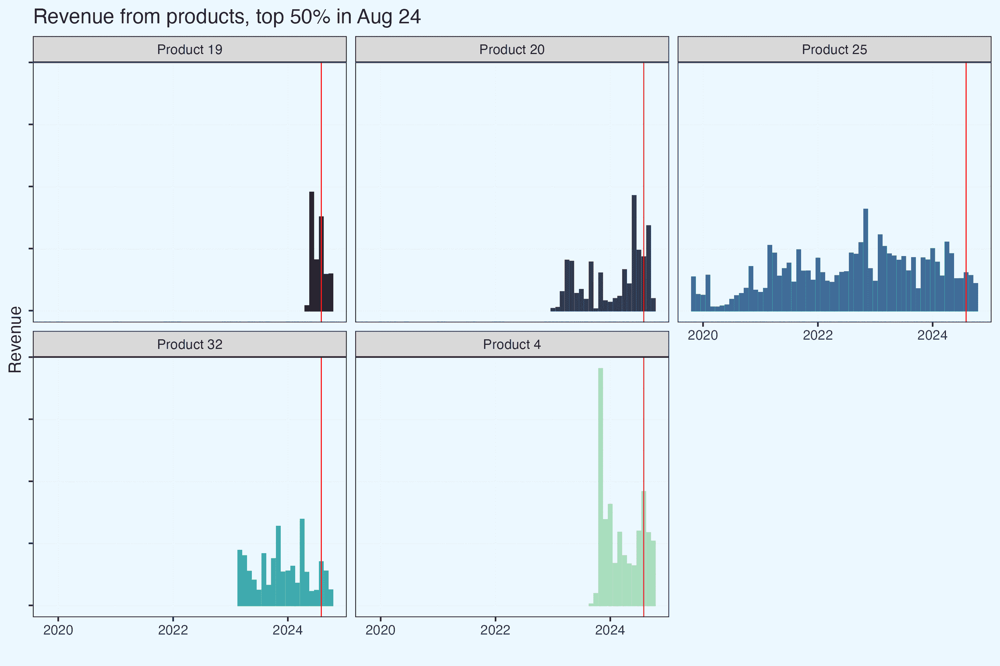

按产品细分的产品收入

我们还可以用流图渲染更吸引人的图表。这两个图表显示了完全相同的数据库，但它们很好地互补——条形图用于精确度，而流图用于讲述故事。

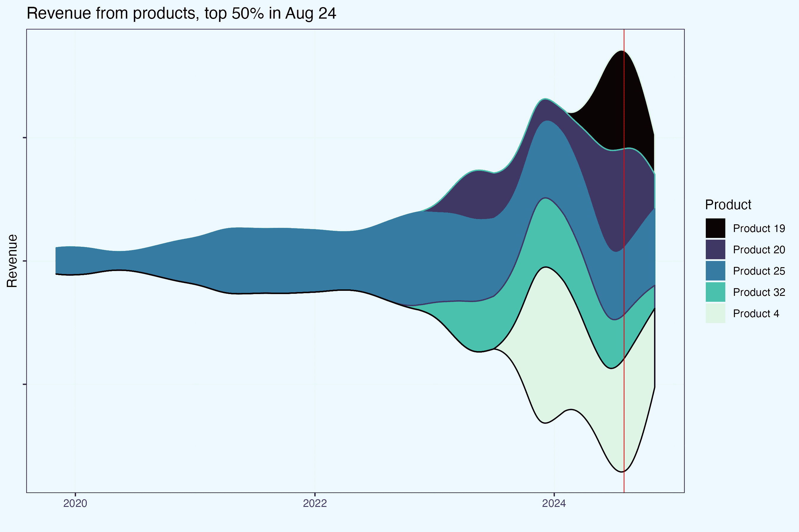

产品收入，流图

红线表示选定的月份。如果你觉得“痒”想移动那条线，就像老式收音机一样，你绝对是对的——这应该是一个交互式图表，实际上它就是，还有一个用于收入份额百分比的滑块（我们为一位客户制作了它）。

那如果我们把那条红色的“调整线”稍微向后移动一点，比如到 2020 年呢？数据准备中的逻辑非常相似——获取对特定收入份额阈值有贡献的产品，并检查这些产品在其他月份的收入。

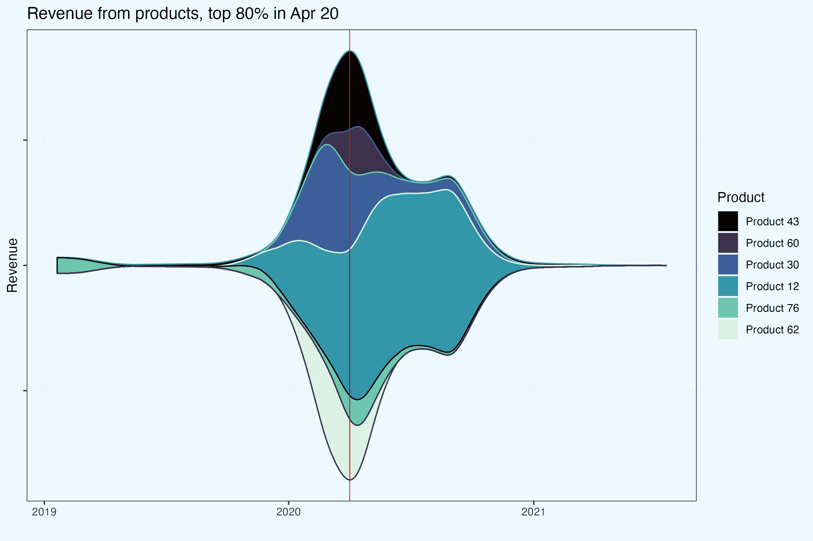

产品收入，流图

通过对两个元素——收入贡献百分比和日期的交互性，可以了解很多关于业务的信息，这正是这些图表的目的。可以从不同的角度观察：

+   集中度，我们需要多少产品才能达到特定的收入阈值，

+   产品本身，它们是否保持在某个收入贡献区间内，或者它们是否改变以及为什么？是季节性、有效的替代品、失去的供应商还是其他原因？

+   时间窗口，我们看一个月还是一整年，

+   季节性，比较一年中相似的时间与之前的时期。

## 摘要

### 数据告诉我们什么

我们的 6 年数据集揭示了电子商务业务从高度集中到平衡增长的发展历程。以下是关键模式和教训：

在 6 年的数据中，我有幸观察集中度指标随着业务增长而演变。一开始只有少数几个产品，我看到了你预期的——高度集中。但随着新产品的加入，事情变得更有趣。业务找到了一打左右顶尖表现者的节奏，HHI 稳定在 700-800 的舒适范围内。

这里有一些我发现的有趣的事情：集中度和不平等可能听起来像是双胞胎，但它们更像远亲。我注意到这一点是在比较 HHI 与洛伦兹曲线及其基尼系数时。相信我，在向利益相关者解释这些模式之前，你需要先熟悉数学——他们能从一英里之外闻到不确定的味道。

想真正理解这些指标吗？做我做过的同样的事情：创建一个简单到几乎令人尴尬的虚拟数据集。我指的是五年级学生都能理解的基本模式。听起来像是过度杀戮？也许吧，但它为我节省了无数个小时的挠头和误解释。把这些例子放在你的口袋里——或者更好的是，一开始就分享它们。没有什么能像展示你已经完成了作业那样建立信心。

好吧，计算这些比率并不是什么火箭科学。真正的魔法在于当你深入研究每个产品如何贡献于你的收入时。这就是为什么我增加了“展示给我钱”这一部分——我不相信快速修复或魔法公式。这关乎卷起袖子，真正理解每个产品的实际行为。

如你很可能自己注意到的，我向你展示的这些流图实际上是在迫切地要求交互性。而且，这确实增加了价值！一旦你整理好了键和连接，这其实并不复杂。给你的用户提供一个交互式工具，突然之间，你就不再被一次性问题淹没——他们自己发现了洞察。

这里有一个专业的小贴士：使用这种集中度分析作为你与利益相关者的敲门砖。向你的产品团队展示流图，我保证他们的眼睛会亮起来。当他们开始要求交互式版本时，你就已经吸引住他们了。最好的部分？他们会认为这始终是他们自己的想法。这就是你如何实现真正的采用——通过让他们自己发现价值。

### 数据工程要点

虽然我们通常都知道在数据集中可以期待什么，但几乎可以肯定会有一些细微差别、异常，甚至可能是惊喜。花些时间审查数据集，使用专用功能（如 R 中的 str，glimpse），寻找空字段、异常值，但也要简单地滚动浏览以了解数据。我喜欢比较，在这种情况下，我会在准备寿司之前先去市场上闻闻鱼的味道。

然后，如果我们处理原始数据导出，数据集中很可能会有几个列；毕竟，如果我们点击‘导出全部’，难道我们不应该期望正好是这样吗？对于大多数分析，我们只需要这些列的子集，所以剪掉不必要的列，只保留我们需要的，是很好的。我假设我们使用脚本，所以如果需要更多，没问题，只需添加遗漏的列并重新运行该部分。

在数据集导出中，每一行交易都有一个时间戳，而我们需要的却是每个产品的时间戳。因此，需要进行一些轻量级的数据整理，将这些时间戳传播到所有产品上。

在清理数据集之后，考虑分析背景，包括要回答的问题和必要的数据更改，是非常重要的。这种“背景清理/整理”是至关重要的，因为它决定了分析是成功还是失败。在我们的情况下，目标是分析产品集中度，因此过滤掉变体（大小、颜色等）是至关重要的。如果我们跳过了这一点，结果将会有根本性的不同。

很常见的情况是我们可以预期一些“陷阱”，最初看起来我们可以应用简单的方法，而实际上，我们应该增加一些复杂性。例如——洛伦兹曲线，我们需要计算需要多少产品才能达到一定的收入阈值。这就是我使用滚动连接的地方，它们在这里完美地适用。

生成流图的核心逻辑是找到在特定月份构成一定收入百分比的产品，然后“冻结”它们，并获取它们在其他月份的收入。我使用的工具是在按月排序后添加一个额外的列，包含产品编号，然后对键和连接进行操作。

分析的一个重要元素是添加交互性，允许用户调整一些参数。这提高了标准，因为我们需要所有这些操作都能以闪电般的速度执行。我们需要的是合适的数据结构、额外的列、适当的键和连接。尽可能多地准备，在数据仓库中进行预先计算，这样仪表板工具就不会过载。考虑缓存。

### 如何开始？

在满足利益相关者的需求与探索他们尚未请求的潜在有价值见解之间取得平衡。我展示的分析遵循这一模式——获取初始浓度比是直接的，而构建一个针对快速操作的交互式流图则需要大量的努力。

从小处着手，吸引他人参与。分享基本发现，讨论你们可以一起学习的内容，一旦确保了真正的兴趣，再进行更费时的分析。并且始终牢牢掌握你的原始数据——它对于快速回答那些不可避免的临时问题是无价的。

在全面生产之前构建原型，可以在不投入太多时间的情况下验证兴趣和反馈。在我的情况下，这样简单的浓度比引发了辩论，最终导致了今天利益相关者依赖的更高级交互式研究。


从小处着手，确保真正的兴趣 … :-)) / 由 DALL-E 根据作者提示生成的图像

## 附录 - 数据准备与整理

我会向你展示我在分析每个步骤中是如何准备数据的。由于我使用了 R，我会包括实际的代码片段——它们可以帮助你更快地开始，即使你使用的是不同的语言。这是我用来进行研究的代码，尽管你可能需要根据你的具体需求进行修改，而不是简单地复制粘贴。我决定将代码与主要分析分开，以便于技术和商业用户都能更流畅、更易读地阅读。

虽然我展示的是基于 Shopify 导出的分析，但并没有特定平台的限制，我们只需要交易数据。

### Shopify 导出

让我们从从 Shopify 获取数据开始。在我们可以进行浓度分析之前，原始导出需要一些处理——这是我首先需要处理的事情。

我们从 Shopify 的原始交易数据导出开始。这可能需要一些时间，一旦准备好，我们会收到一封带有下载链接的电子邮件。

```py
#-- 0\. libs
pacman::p_load(data.table)

#-- 1.1 load data; the csv files are what we get as a full export from Shopify
xs1_dt <- fread(file = "shopify_raw/orders_export_1.csv")
xs2_dt <- fread(file = "shopify_raw/orders_export_2.csv")
xs3_dt <- fread(file = "shopify_raw/orders_export_3.csv")
```

一旦我们有了数据，我们需要将这些文件合并成一个数据集，裁剪列并执行一些清理。

```py
#-- 1.2 check all columns, limit them to essential (for this analysis) and bind into one data.table
xs1_dt |> colnames()
# there are 79 columns in full export, 
# so we select a subset, relevant for this analysis
sel_cols <- c("Name", "Email", "Paid at", "Fulfillment Status", "Accepts Marketing", "Currency", "Subtotal",
              "Lineitem quantity", "Lineitem name", "Lineitem price", "Lineitem sku", "Discount Amount",
              "Billing Province", "Billing Country")

#-- combine into one data.table, with a subset of columns
xs_dt <- data.table::rbindlist(l = list(xs1_dt, xs2_dt, xs3_dt), 
    use.names = T, fill = T, idcol = T) %>% .[, ..sel_cols]
```

一些数据准备。

```py
#-- 2\. data prep
#-- 2.1 replace spaces in column names, for easier handling
sel_cols_new <- sel_cols |> stringr::str_replace(pattern = " ", replacement = "_")
setnames(xs_dt, old = sel_cols, new = sel_cols_new)

#-- 2.2 transaction as integer
xs_dt[, `:=` (Transaction_id = stringr::str_remove(Name, pattern = "#") |> as.integer())]
```

匿名化电子邮件，因为在分析过程中我们不需要/想要处理真实的电子邮件。

```py
#-- 2.3 anonymize email 
new_cols <- c("Email_hash")
xs_dt[, (new_cols) := .(digest::digest(Email, algo = "md5")), .I]
```

改变列类型；这取决于个人喜好。

```py
#-- 2.4 change Accepts_Marketing to logical column
xs_dt[, `:=` (Accepts_Marketing_lgcl = fcase(
    Accepts_Marketing == "yes", TRUE, 
    Accepts_Marketing == "no", FALSE, 
    default = NA))]
```

现在我们专注于交易数据集。在导出文件中，交易金额和时间戳在篮子中所有项目的每一行中只有一个。我们需要获取这些时间戳并将它们传播到所有项目。

```py
#-- 3 transactions dataset
#-- 3.1 subset transactions
#-- limit columns to essential for transaction only
trans_sel_cols <- c("Transaction_id", "Email_hash", "Paid_at", 
  "Subtotal", "Currency", "Billing_Province", "Billing_Country")

#-- get transactions table based on requirement of non-null payment - as payment (date, amount) is not for all products, it is only once per basket
xst_dt <- xs_dt[!is.na(Paid_at) &amp; !is.na(Transaction_id), ..trans_sel_cols]
```

```py
#-- date columns
xst_dt[, `:=` (date = as.Date(`Paid_at`))]
xst_dt[, `:=` (month = lubridate::floor_date(date, unit = "months"))]
```

一些额外信息，我称之为*衍生品*。

```py
#-- 3.2 is user returning? their n-th transaction
setkey(xst_dt, Paid_at)
xst_dt[, `:=` (tr_n = 1)][, `:=` (tr_n = cumsum(tr_n)), Email_hash]

xst_dt[, `:=` (returning = fcase(tr_n == 1, FALSE, default = TRUE))]
```

数据集中有 NA 值吗？

```py
xst_dt[!complete.cases(xst_dt), ]
```

产品数据集。

```py
#-- 4 products dataset
#-- 4.1 subset of columns
sel_prod_cols <- c("Transaction_id", "Lineitem_quantity", "Lineitem_name", 
  "Lineitem_price", "Lineitem_sku", "Discount_Amount")
```

现在我们将这两个数据集合并，以获得所有产品的交易特征（trans_sel_cols）。

```py
#-- 5 join two datasets
list(xs_dt, xst_dt) |> lapply(setkey, Transaction_id)
x3_dt <- xs_dt[, ..sel_prod_cols][xst_dt]
```

让我们检查 x3_dt 数据集中我们有哪些列。

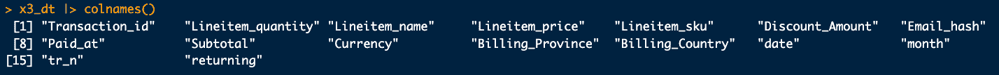

这也是检查数据集的时刻。

```py
x3_dt |> str()
x3_dt |> dplyr::glimpse()
x3_dt |> head()
```

数据清理的时间到了。首先：将 Lineitem_name 拆分为基础产品和它们的变体。理论上，这些是通过破折号("-")分隔的。简单，对吧？并不完全是这样——一些产品名称，如‘All-Purpose’，破折号是它们名称的一部分。因此，我们需要首先处理这些特殊情况，暂时替换有问题的破折号，进行拆分，然后恢复原始的产品名称。

```py
#-- 6\. cleaning, aggregation on product names
#-- 6.1 split product name into base and variants
#-- split product names into core and variants
product_cols <- c("base_product", "variants")
#-- with special treatment for 'all-purpose'
x3_dt[stringr::str_detect(string = Lineitem_name, pattern = "All-Purpose"), 
  (product_cols) := {
    tmp = stringr::str_replace(Lineitem_name, "All-Purpose", "AllPurpose")
    s = stringr::str_split_fixed(tmp, pattern = "[-/]", n = 2)
    s = stringr::str_replace(s, "AllPurpose", "All-Purpose")
    .(s[1], s[2])
  }, .I]
```

在每个步骤之后进行验证是很好的。

```py
# validation
x3_dt[stringr::str_detect(
  string = Lineitem_name, pattern = "All-Purpose"), .SD, 
  .SDcols = c("Transaction_id", "Lineitem_name", product_cols)]
```

我们继续进行数据清理——确切的步骤当然取决于特定的数据集，但我分享我的流程，作为一个例子。

```py
#-- two scenarios, to cope with `(32-ounce)` in prod name; we don't want that hyphen to cut the name
x3_dt[stringr::str_detect(string = `Lineitem_name`, pattern = "ounce", negate = T) &amp; 
  stringr::str_detect(string = `Lineitem_name`, pattern = "All-Purpose", negate = T), 
  (product_cols) := {
    s = stringr::str_split_fixed(string = `Lineitem_name`, pattern = "[-/]", n = 2); .(s[1], s[2])
  }, .I]

x3_dt[stringr::str_detect(string = `Lineitem_name`, pattern = "ounce", negate = F) &amp; 
  stringr::str_detect(string = `Lineitem_name`, pattern = "All-Purpose", negate = T), 
  (product_cols) := {
    s = stringr::str_split_fixed(string = `Lineitem_name`, pattern = ") - ", n = 2); .(paste0(s[1], ")"), s[2])
  }, .I]

#-- small patch for exceptions
x3_dt[stringr::str_detect(string = base_product, pattern = "))$", negate = F), 
  base_product := stringr::str_replace(string = base_product, pattern = "))$", replacement = ")")]
```

验证。

```py
# validation
x3_dt[stringr::str_detect(string = `Lineitem_name`, pattern = "ounce")
  ][, .SD, .SDcols = c(eval(sel_cols[6]), product_cols)
  ][, .N, c(eval(sel_cols[6]), product_cols)]

x3_dt[stringr::str_detect(string = `Lineitem_name`, pattern = "All")
  ][, .SD, .SDcols = c(eval(sel_cols[6]), product_cols)
  ][, .N, c(eval(sel_cols[6]), product_cols)]

x3_dt[stringr::str_detect(string = base_product, pattern = "All")]
```

我们使用`eval(sel_cols[6])`来获取列`sel_cols[6]`的名称，它是货币。

我们还需要处理 NA 值，但要对数据集有一个理解——在哪里可能有 NA 值，以及它们不应该出现的地方，这表明存在问题。在某些列中，如`Discount_Amount`，我们有值（实际折扣），零，有时也有 NA 值。检查最终价格，我们得出结论它们是零。

```py
#-- deal with NA'a - replace them with 0
sel_na_cols <- c("Discount_Amount")
x3_dt[, (sel_na_cols) := lapply(.SD, fcoalesce, 0), .SDcols = sel_na_cols]
```

为了一致性和方便，将所有列名改为小写。

```py
setnames(x3_dt, tolower(names(x3_dt)))
```

并且进行验证。

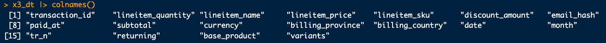

当然，审查数据集，进行一些测试聚合，并且简单地打印出来。

将数据集保存为 Rds（R 的本地格式）和 csv。

```py
x3_dt |> fwrite(file  = "data/products.csv")
x3_dt |> saveRDS(file = "data/x3_dt.Rds")
```

执行上述步骤后，我们应该有一个干净的数据集，以便进一步分析。代码应作为指南，但也可以直接使用，如果你在 R 中工作。

### 版本

作为第一印象，我们将检查每月的产品数量，包括基础产品和所有版本。

作为一个小清理，我只选取完整的月份。

```py
month_last <- x3_dt[, max(month)] - months(1)
```

然后我们计算月度数字，存储在临时表中，然后进行连接。

```py
x3_a_dt <- x3_dt[month <= month_last, .N, .(base_product, month)
  ][, .(base_products = .N), keyby = month]

x3_b_dt <- x3_dt[month <= month_last, .N, .(lineitem_name, month)
  ][, .(products = .N), keyby = month]

x3_c_dt <- x3_a_dt[x3_b_dt]
```

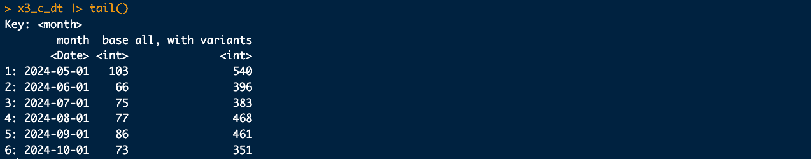

一些数据处理。

```py
#-- names, as we want them on plot
setnames(x3_c_dt, old = c("base_products", "products"), new = c("base", "all, with variants"))

#-- long form
x3_d_dt <- x3_c_dt[, melt.data.table(.SD, id.vars = "month", variable.name = "Products")]

#-- reverse factors, so they appear on plot in a proper order
x3_d_dt[, `:=` (Products = forcats::fct_rev(Products))]
```

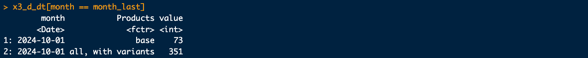

我们已经准备好绘制数据集。

```py
plot_01_w <- x3_d_dt |>
  ggplot(aes(month, value, color = Products, fill = Products)) +
  geom_line(show.legend = FALSE) +
  geom_area(alpha = .8, position = position_dodge()) +
  theme_bw() +
  scale_fill_viridis_d(direction = -1, option = "G", begin = 0.3, end = .7) +
  scale_color_viridis_d(direction = -1, option = "G", begin = 0.3, end = .7) +
  labs(x = "", y = "Products", 
    title = "Unique products, monthly", subtitle = "Impact of aggregation") +
  theme(... additional styling)
```

下一个图显示了分组到箱中的变体数量。这给了我们机会来讨论 R 中的链式操作，特别是与 data.table 包一起。在 data.table 中，我们可以在关闭一个括号后立即打开一个新的括号来链式操作——结果是`][`语法。它创建了一个紧凑、易读的链，同时仍然容易调试，因为你可以逐部分执行它。我更喜欢简洁的代码，但这只是我的风格——使用对你来说最好的方法。我们可以写一行代码，或者多行代码，有逻辑步骤。

在其中一个图表中，我们查看每个产品首次出现的时间。为了得到这个日期，我们在日期上设置一个键，然后对每个 base_product 取第一次出现`date[1]`。

```py
#-- versions per year, product, with a date, when it was 1st seen
x3c_dt <- x3_dt[, .N, .(base_product, variants)
  ][, .(variants = .N), base_product][order(-variants)]

x3_dt |> setkey(date)
x3d_dt <- x3_dt[, .(date = date[1]), base_product]
```

```py
list(x3c_dt, x3d_dt) |> lapply(setkey, base_product)

x3e_dt <- x3c_dt[x3d_dt][order(variants)
  ][, `:=` (year = year(date) |> as.factor())][year != 2018
  ][, .(products = .N), .(variants, year)][order(-variants)
  ][, `:=` (
    variant_bin = cut(
      variants,
      breaks = c(0, 1, 2, 5, 10, 20, 100, Inf),
      include.lowest = TRUE,
      right = FALSE
    ))
  ][, .(total_products = sum(products)), .(variant_bin, year)
  ][order(variant_bin)
  ][, `:=` (year_group = fcase(
    year %in% c(2019, 2020, 2021), "2019-2021",
    year %in% c(2022, 2023, 2024), "2022-2024"
  ))
  ][, `:=` (variant_bin = forcats::fct_rev(variant_bin))]
```

结果表正是我们用于图表所需的。

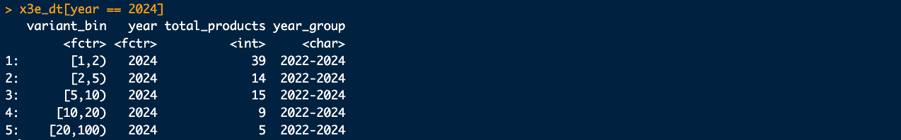

第二个图使用交易日期，所以数据处理类似，但没有`date[1]`步骤。

如果我们想要将几个绘图组合在一起，我们可以分别生成它们，然后使用例如`ggpubr::ggarrange()`进行组合，或者我们可以将表格合并到一个数据集中，然后使用分面功能。前者是当绘图完全不同性质时，而后者在我们可以自然地有组合数据集时很有用。

例如，从我的脚本中再举几个例子。

```py
x3h_dt <- data.table::rbindlist(
  l = list(
    introduction = x3e_dt[, `:=` (year = as.numeric(as.character(year)))], 
    transaction  = x3g_dt), 
  use.names = T, fill = T, idcol = T)
```

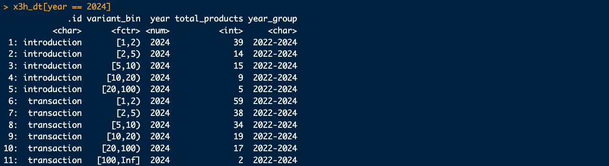

以及一个绘图代码。

```py
plot_04_w <- x3h_dt |>
  ggplot(aes(year, total_products, 
    color = variant_bin, fill = variant_bin, group = .id)) +
  geom_col(alpha = .8) +
  theme_bw() +
  scale_fill_viridis_d(direction = 1, option = "G") +
  scale_color_viridis_d(direction = 1, option = "G") +
  labs(x = "", y = "Base Products", 
    title = "Products, and their variants", 
    subtitle = "Yearly",
    fill = "Variants",    
    color = "Variants") +
  facet_wrap(".id", ncol = 2) +
  theme(... other styling options)
```

分面图有巨大的优势，因为我们操作的是一张表，这有助于确保数据一致性。

### 帕累托

帕累托计算的本质是找出我们需要多少产品来实现一定的收入百分比。我们需要准备数据集，分几个步骤。

```py
#-- calculate quantity and revenue per base_product, monthly
x3a_dt <- x3_dt[, {
  items = sum(lineitem_quantity, na.rm = T); 
  revenue = sum(lineitem_quantity * lineitem_price); 
  .(items, revenue)}, keyby = .(month, base_product)
  ][, `:=` (i = 1)][order(-revenue)][revenue > 0, ]

#-- calculate percentage share, and cumulative percentage
x3a_dt[, `:=` (
  rev_pct = revenue / sum(revenue), 
  cum_rev_pct = cumsum(revenue) / sum(revenue), prod_n = cumsum(i)), month]
```

如果我们需要屏蔽确切的产品名称，让我们创建一个新的变量。

```py
#-- products name masking
x3a_dt[, masked_name := paste("Product", .GRP), by = base_product]
```

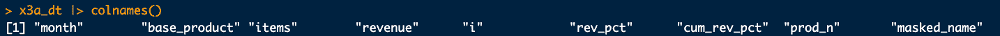

以及数据集的打印输出，包含部分列。

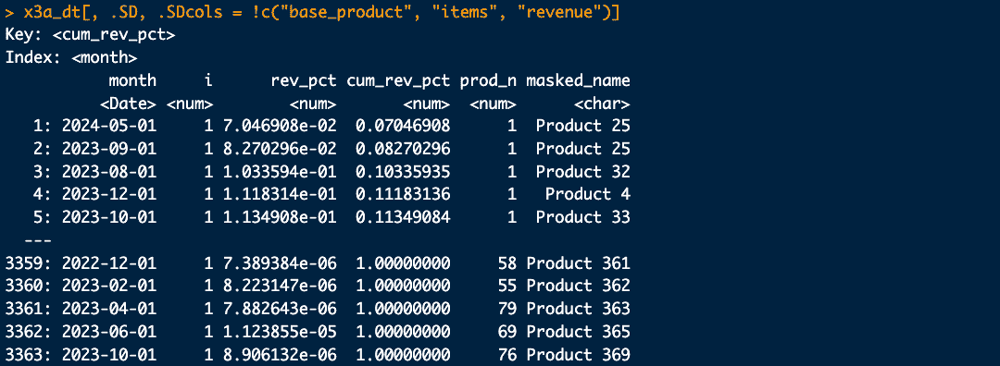

并且过滤了一个月的数据，显示顶部和底部的几行。

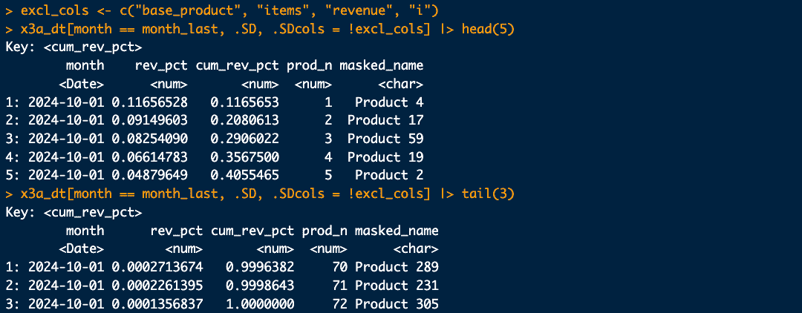

重要的列是`cum_rev_pct`，它表示从产品 1 到 n 的累积百分比收入。我们需要找到哪个`prod_n`覆盖了收入百分比阈值，正如在`pct_thresholds_dt`表中所示。

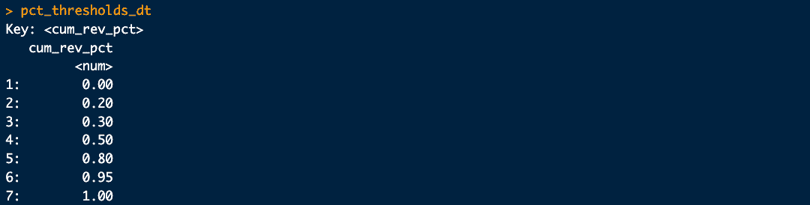

因此，我们已准备好进行实际的帕累托计算。下面的代码带有注释。

```py
#-- pareto
#-- set percentage thresholds
pct_thresholds_dt <- data.table(cum_rev_pct = c(0, .2, .3, .5, .8, .95, 1))

#-- set key for join
list(x3a_dt, pct_thresholds_dt) |> lapply(setkey, cum_rev_pct)

#-- subset columns (optional)
sel_cols <- c("month", "cum_rev_pct", "prod_n")

#-- perform a rolling join - crucial step!
x3b_dt <- x3a_dt[, .SD[pct_thresholds_dt, roll = -Inf], month][, ..sel_cols]
```

为什么我们执行滚动连接？我们需要找到覆盖每个阈值的第一个`cum_rev_pct`。

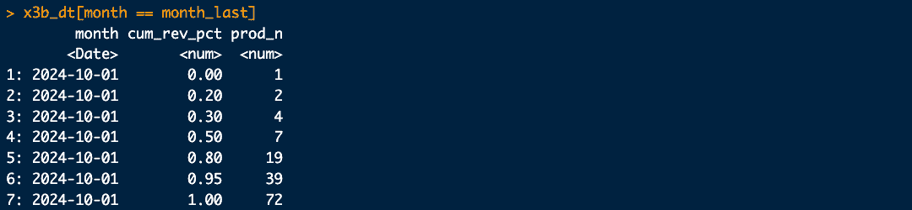

我们需要 2 个产品来获得 20%的收入，4 个产品来获得 30%，依此类推。当然，要获得 100%的收入，我们需要所有 72 个产品的贡献。

以及一个绘图。

```py
#-- data prep
x3b1_dt <- x3b_dt[month < month_max, 
  .(month, cum_rev_pct = as.factor(cum_rev_pct) |> forcats::fct_rev(), prod_n)]

#-- charting
plot_07_w <- x3b1_dt |>
  ggplot(aes(month, prod_n, color = cum_rev_pct, fill = cum_rev_pct)) +
  geom_line() +
  theme_bw() +
  geom_area(alpha = .2, show.legend  = F, position = position_dodge(width = 0)) +
  scale_fill_viridis_d(direction = -1, option = "G", begin = 0.2, end = .9) +
  scale_color_viridis_d(direction = -1, option = "G", begin = 0.2, end = .9,
                        labels = function(x) scales::percent(as.numeric(as.character(x)))  # Convert factor to numeric first
  ) +
  ... other styling options ...
```

### 洛伦兹曲线

要绘制洛伦兹曲线，我们需要按其对总收入贡献对产品进行排序，并对产品数量和收入进行归一化。

在主代码之前，一个方便的方法来从数据集中选择第 n 个月，从开始或从结束。

```py
month_sel <- x3a_dt$month |> unique() |> sort(decreasing = T) |> dplyr::nth(2)
```

以及代码。

```py
xl_oct24_dt <- x3a_dt[month == month_sel, 
  ][order(-revenue), .(
    cum_prod_pct = seq_len(.N)/.N, 
    cum_rev_pct = cumsum(revenue)/sum(revenue))]
```

要为每个时间段绘制单独的线条，我们需要相应地进行修改。

```py
#-- Lorenz curve, yearly aggregation
xl_dt <- x3a_dt[order(-revenue), .(
    cum_prod_pct = seq_len(.N)/.N, 
    cum_rev_pct = cumsum(revenue)/sum(revenue)), month]
```

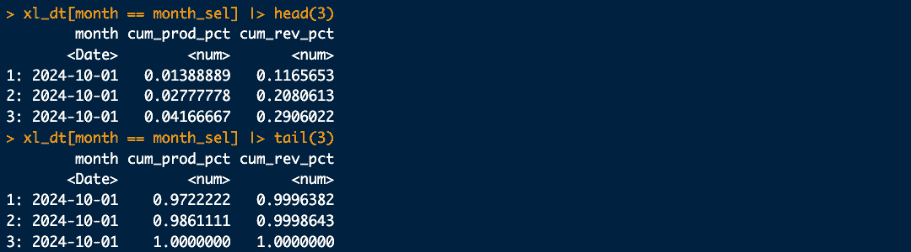

`xl_dt` 数据集已准备好用于绘图。

### 指数，比率

这里的代码很简单，假设有足够的数据准备。文章主体中的逻辑和一些代码片段。

### 流图

之前展示的流图是一个可能难以渲染的图表示例，尤其是在需要交互性时。我将其包含在这篇博客中的一个原因是为了展示我们如何通过键、连接和数据.table 语法简化任务。使用键，我们可以实现非常有效的交互式过滤。一旦我们掌握了数据，我们实际上就完成了；剩下的只是调整图表的一些设置。

我们从阈值表开始。

```py
#-- set percentage thresholds
pct_thresholds_dt <- data.table(cum_rev_pct = c(0, .2, .3, .5, .8, .95, 1))
```

由于我们希望按月执行连接，因此创建一个涵盖一个月的数据子集来测试逻辑，然后再扩展到完整数据集是一个好主意。

```py
#-- test logic for one month
month_sel <- as.Date("2020-01-01")
sel_a_cols <- c("month", "rev_pct", "cum_rev_pct", "prod_n", "masked_name")
x3a1_dt <- x3a_dt[month == month_sel, ..sel_a_cols]
```

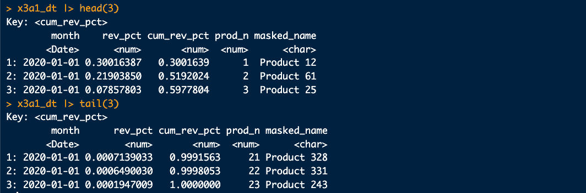

2020 年 1 月我们有 23 个产品，按收入百分比排序，我们还有累计收入，最后一个第 23 个产品的收入达到 100%。

现在我们需要创建一个中间表格，告诉我们为了达到每个收入阈值需要多少产品。

```py
#-- set key for join
list(x3a1_dt, pct_thresholds_dt) |> lapply(setkey, cum_rev_pct)

#-- perform a rolling join - crucial step!
sel_b_cols <- c("month", "cum_rev_pct", "prod_n")
x3b1_dt <- x3a1_dt[, .SD[pct_thresholds_dt, roll = -Inf], month][, ..sel_b_cols]
```

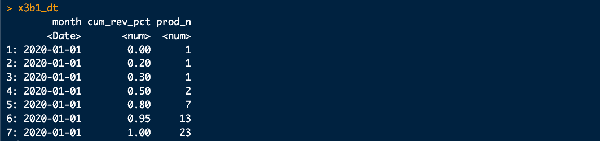

因为我们在处理一个一个月的数据子集（并且选择的产品不是很多），所以检查结果非常容易——比较 `x3a1_dt` 和 `x3b1_dt` 表。

现在我们需要获取选定阈值的产品的名称。

```py
#-- get products
#-- set keys
list(x3a1_dt, x3b1_dt) |> lapply(setkey, month, prod_n)

#-- specify threshold
x3b1_dt[cum_rev_pct == .8][x3a1_dt, roll = -Inf, nomatch = 0]

#-- or, an equivalent, specify table's row
x3b1_dt[5, ][x3a1_dt, roll = -Inf, nomatch = 0]
```

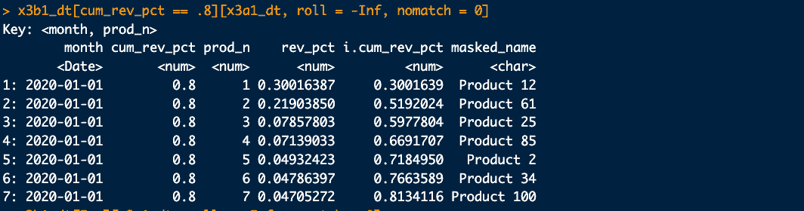

要达到 80% 的收入，我们需要 7 个产品，并且从上面的连接中，我们得到了它们的名称。

我想你已经看到了，为什么我们使用滚动连接，而不能使用简单的 `<` 或 `>` 逻辑。

现在，我们需要将逻辑扩展到所有月份。

```py
#-- extend for all months

#-- set key for join
list(x3a_dt, pct_thresholds_dt) |> lapply(setkey, cum_rev_pct)

#-- subset columns (optional)
sel_cols <- c("month", "cum_rev_pct", "prod_n")

#-- perform a rolling join - crucial step!
x3b_dt <- x3a_dt[, .SD[pct_thresholds_dt, roll = -Inf], month][, ..sel_cols]
```

获取产品。

```py
#-- set keys, join
list(x3a_dt, x3b_dt) |> lapply(setkey, month, prod_n)
x3b6_dt <- x3b_dt[cum_rev_pct == .8][x3a_dt, roll = -Inf, nomatch = 0][, ..sel_a_cols]
```

并验证与测试数据子集相同的月份。

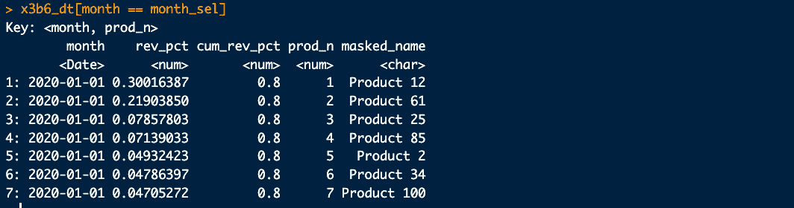

如果我们想要冻结某个月份的产品，并查看整个期间的收入（这就是第二个流图所显示的），我们可以在产品名称上设置键并执行连接。

```py
#-- freeze products
x3b6_key_dt <- x3b6_dt[month == month_sel, .(masked_name)]
list(x3a_dt, x3b6_key_dt) |> lapply(setkey, masked_name)

sel_b2_cols <- c("month", "revenue", "masked_name")
x3a6_dt <- x3a_dt[x3b6_key_dt][, ..sel_b2_cols]
```

我们得到了我们需要的确切结果。


使用连接，包括滚动，并决定在仓库中预先计算什么，以及在仪表板中动态过滤什么，确实需要一些实践，但绝对值得。


由 DALL-E 生成的图像，根据作者的提示，灵感来源于《不莱梅的音乐家》。
