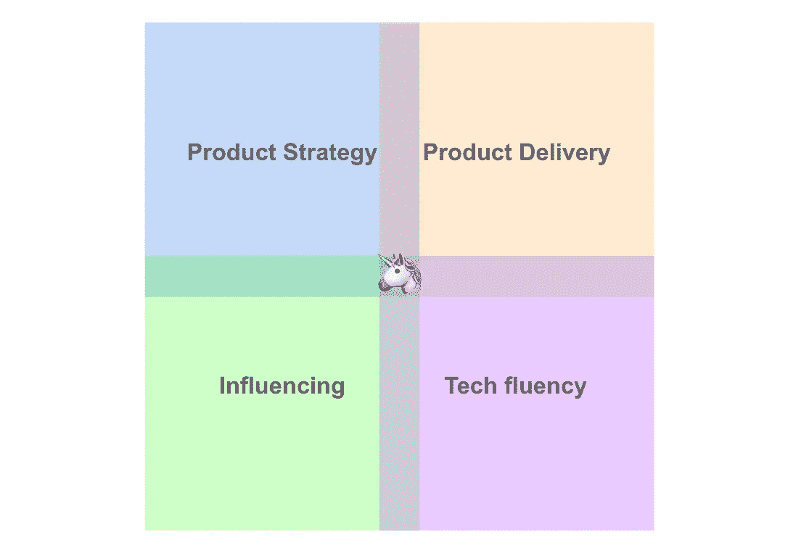
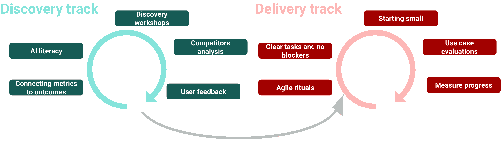

# AI 产品经理

> [原文链接](https://towardsdatascience.com/the-ai-product-manager-2a8e2da141c0/)

图片由[Mimi Thian](https://unsplash.com/es/@mimithian)在[Unsplash](https://unsplash.com/)提供

当 ChatGPT 在 2022 年底推出时，它开启了 AI 的新篇章。从那时起，AI 发展迅速。几乎每周我们都会听到关于新的、更强大的模型的消息。全球数百万人在日常生活中使用这些工具，公司正试图了解如何利用这项令人难以置信的技术。我说“*试图*”是因为尽管一些领域已经找到了这项技术的伟大应用（如编码辅助、营销或客户支持），但许多其他领域仍在探索、原型设计和理解如何使用它以及如何应对随之而来的新挑战和风险（更多内容请参阅“*[2025: AI 吞噬世界](https://www.ben-evans.com/presentations)*”）。

那么，公司如何缩小这些强大模型与潜在商业价值之间的差距？**这正是 AI 产品经理（AI PM）发挥作用的地方**。

> AI 产品经理负责构建解决用户问题并带来商业价值的 AI 驱动产品，同时建立信任并处理 AI 的风险。

AI 产品经理与传统产品经理角色的主要区别在于其团队构建的解决方案类型：强烈关注机器学习（ML）和 AI 模型，数据对于训练和预测目的的重要性，处理不可预测的结果（AI 是概率性的，而不是像传统软件那样是确定性的），并确保 AI 被负责任地使用，用户理解并信任团队解决方案。

在这篇文章中，我将根据我在过去三年中担任 AI 产品经理的经验，介绍 AI 产品经理的角色。我们将探讨不同类型的 AI 产品经理，他们的主要技能、任务和日常职责，以及在这个职位上面临的最大挑战。

## **AI 产品经理的类型**

与技术中的许多角色一样，AI 产品经理（AI PM）的定义因公司而异。然而，根据我的经验，AI PM 的角色通常分为**四个主要类别**，每个类别都有其独特的责任和关注领域：

+   **AI 研究产品经理**：在专注于开发基础模型、通用和业务无关模型或研究导向的 AI 解决方案的团队中工作。这些解决方案通常作为服务提供给其他公司，如 OpenAI 或 Anthropic 这样的组织，其中模型本身是主要产品。这些团队通常由具有强大研究背景的数据科学家（通常称为研究科学家）组成，可能还包括其他角色，如机器学习工程师，以支持基础设施、模型部署和扩展。

+   **AI 平台产品经理**：与构建内部人工智能或机器学习平台的团队合作。这些平台使公司内的其他团队能够训练、部署和维护自己的机器学习模型或人工智能解决方案。在这种情况下，产品是平台，团队的重点是解决问题和为需要训练和部署人工智能解决方案的内部用户提供价值。团队通常包括机器学习工程师和其他技术角色，如平台工程师，以开发和维护平台。

+   **AI 核心产品经理**：在团队中工作，为需要特定机器学习或人工智能模型的其它产品团队提供内部咨询服务。这些模型通常由请求产品团队集成到更广泛解决方案中。由于解决方案的策略和需求由外部定义，AI 核心产品经理的角色通常更侧重于交付而非发现（关于这一点稍后还会详细说明）。这些团队主要由数据科学家组成，他们构建模型，而消费团队将拥有将解决方案集成到其功能或功能中的所需角色。

+   **AI 产品经理**：专注于应用人工智能，将人工智能能力集成到影响最终用户和业务的具体产品中。因此，团队不仅包括数据科学家和机器学习工程师，还包括后端工程师、前端工程师，甚至 iOS/Android 工程师。

在这篇文章中，我将重点关注**应用人工智能产品经理**的角色，尽管这个角色与其他三种类型的 AI 产品经理有很多共同之处。**应用人工智能产品经理是我目前担任并热爱的工作**：与多学科团队合作，交付由人工智能驱动的功能，为用户和企业带来价值。想了解更多关于这样的团队如何运作的信息，请查看我之前的文章：

> [在多学科机器学习团队中工作，为我们的用户提供价值](https://medium.com/adevinta-tech-blog/working-in-a-multidisciplinary-machine-learning-team-to-bring-value-to-our-users-f1172ca532c6)

## AI 产品经理的主要技能

机器学习/人工智能产品经理的四个关键技能集，作者提供图片

要成为一名成功的机器学习/人工智能产品经理，需要许多必要的技能和知识，但根据我的经验，最重要的可以分成 4 组：

+   **产品策略**：理解用户及其痛点，识别正确的问题和机遇，根据定量和定性证据进行优先排序，并旨在影响产品和业务指标。

+   **产品交付**：管理团队交付用户价值的倡议，确保对要构建的内容有清晰的了解，并解决团队和依赖关系。

+   **影响**：赢得信任，与利益相关者保持一致，并指导团队。

+   **技术流利度**：在机器学习、负责任的人工智能、一般数据、MLOPs 和后端工程方面的知识和敏感性。能够作为产品机会与人工智能解决方案可能性之间的桥梁。

想要深入了解这些主题及其相关学习资源，您可以查看我之前的帖子：

> [**从数据科学家到机器学习/人工智能产品经理**](https://towardsdatascience.com/from-data-scientist-to-ml-ai-product-manager-39359bd44512)

## **人工智能产品经理的主要任务和日常职责**

与其他产品经理一样，人工智能产品经理负责制定战略并监督团队工作的交付，但团队并不直接向他们汇报。这意味着他们不需要处理人员管理任务——这通常是工程经理或数据经理的责任。然而，他们仍然需要通过影响力而不是权威来引导团队的方向：通过建立信任、促进协作和创造赋权文化。

> **作为人工智能产品经理，我每天的工作最佳定义是平衡每个冲刺（通常是两周）期间的持续交付与持续发现**。这种平衡对于确保团队持续交付价值同时保持与公司目标的同步至关重要。

发现与交付轨迹，图片由作者提供

### **持续交付任务**

一方面，人工智能产品经理需要确保团队在整个冲刺期间成功实施解决方案、迭代和关键任务。持续交付确保他们持续为用户和业务提供价值。为了实现这一点，产品经理需要完成的主要任务包括：

+   **管理敏捷仪式**：领导每日站立会议、冲刺规划和待办事项精炼。

+   **定义明确任务**：确保任务定义清晰、可操作，并与冲刺目标和产品战略保持一致。

+   **处理依赖关系**：主动管理依赖关系，预测阻碍因素，以保持团队向前推进。

+   **平衡工作量**：在尊重个人优势和劣势的同时，有效分配和规划各角色的工作。

+   **有效沟通**：说所有团队成员都能理解的语言，进行有意义的交流、挑战想法并提供反馈。

+   **评估用例**：帮助定义每个特定用例的正确评估指标。

+   **从小处着手**：挑战团队从最小可行产品（MVPs）开始，并帮助定义它，而不是一开始就尝试大型项目。

+   **衡量进度**：确保进度可衡量且对所有利益相关者可见。

+   **提升士气**：通过培养乐观情绪、庆祝胜利和保持团队动力，作为团队的啦啦队长。

### **持续发现**

另一方面，AI 产品经理确保团队发现需要解决的问题，并确定接下来要构建的内容。从产品经理的角度来看，这项工作的关键方面包括：

+   **定义愿景和战略：** 创建和维护一个清晰的产品愿景、战略和路线图，优先考虑可行、有影响力和道德的 AI 解决方案。

+   **保持信息更新：** 了解业务战略、AI 进步和行业趋势。

+   **分析竞争对手：** 进行竞争对手分析并探索 AI 用例以激发和指导团队。

+   **收集用户反馈：** 与 UX 和数据团队紧密合作，从用户那里收集定性和定量见解。

+   **促进协作和发现：** 与团队一起组织研讨会，分享相关见解，头脑风暴想法，并优先考虑下一步行动。

+   **将指标与结果联系起来：** 将技术模型性能指标（例如，准确性）转化为可衡量的产品或业务结果（例如，点击率或用户满意度）。

+   **在公司内部推广 AI 素养：** 对齐期望并确保对 AI 能够和不能做什么有一个共同的理解。

持续交付和持续发现可能听起来很简单，但正如你所看到的，它们转化为许多关键责任。在两者之间找到正确的平衡是关键。过多地关注交付意味着团队最终会耗尽有意义的任务或下一步行动，并且构建的解决方案可能会错失为用户提供最大价值的机会。过多地关注发现会导致有很好的想法但缺乏可操作性，并且从现实世界反馈中学习有限。

**在平衡交付和发现的同时，冲刺期间总会出现一些小任务**：为高级管理层准备总结，与其他团队开会，处理用户或利益相关者的请求……为了有效地处理这些任务，采取主动（例如，学会自己运行查询并发现见解）和资源丰富（例如，获得解决小团队请求所需的必要技术深度）的方法非常重要。拥有这种自主权允许你独立处理小请求，在需要时解除团队障碍，并最小化干扰，使他们能够专注于高优先级的工作。

## **工作难度所在**

工作难度所在，图片由[Loic Leray](https://unsplash.com/es/@loicleray)在[Unsplash](https://unsplash.com/)上提供

虽然 AI 产品经理的工作是一项很好的工作，可以带来很多乐趣，并且有巨大的机会和职业发展，但根据我的经验，还有一些重大挑战可能会使工作变得困难：

+   **对了解未来的压力**：你持续被期望提供清晰性和方向，即使未来感觉不确定。除此之外，人工智能领域的发展速度非常快（新模型能力、功能、成本和延迟变化很快…），这使得了解未来变得非常复杂！

+   **时间管理和多任务处理**：在冲刺计划、用户研究、演示和会议之间切换需要不断转移注意力。这可能会非常累人！

+   **创建自己的操作手册**：人工智能产品经理（AI PM）这个职位仍然很新，通常公司里不会有很多人，因此你需要建立自己的流程，因为传统的产品经理框架通常不适用。

+   **黑盒挫折**：人工智能模型，尤其是大型语言模型，通常作为黑盒运行。调试或定义下一迭代以改进它们可能会感到具有挑战性。

+   **对概率系统的控制不足**：人工智能的概率性质要求重新思考产品设计、测试和用户期望。引导你的团队通过这一转变是角色的一部分，也是一个不断权衡的挑战：“*这个模型性能或这个评估结果是否足够好以投入生产？*”

+   **伦理挑战**：人工智能伦理是一个非常复杂的话题，风险可能来自许多不同的来源，对抗它们并不简单。即使你想做正确的事，这也需要持续的警惕，并不一定有风险免费解决方案。

## 总结

人工智能产品经理是一个真正令人兴奋的角色。你可以在历史上最好的时刻（现在！）进入人工智能领域，解决有意义的问题，并产生实际影响。然而，它也可能具有挑战性，因为它需要不断的学习曲线和应对许多不确定性。

随着人工智能继续增长并塑造行业，对熟练的人工智能产品经理的需求只会增加。如果你对人工智能充满热情，并喜欢将想法变为现实，那么这是一个值得探索的职业。

> 感谢阅读！我非常乐意在评论中听到你的反馈。你还可以在[领英](https://www.linkedin.com/in/anna-via/)上找到我，我总是乐于进行一场精彩的讨论！
