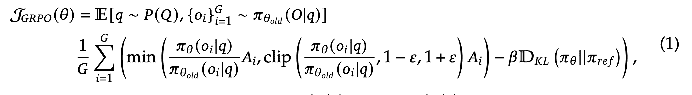
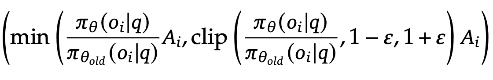
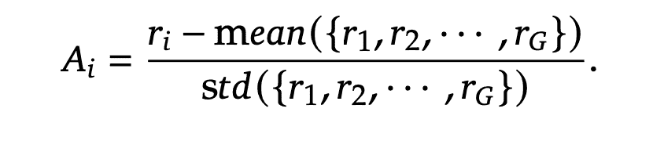
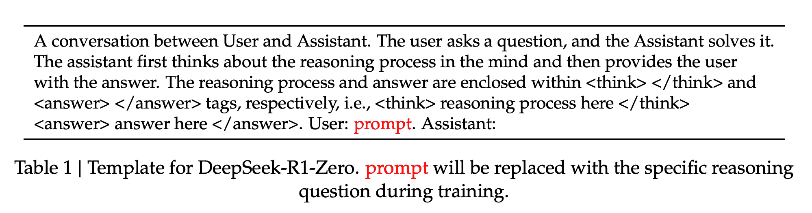
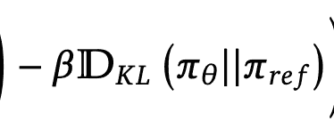
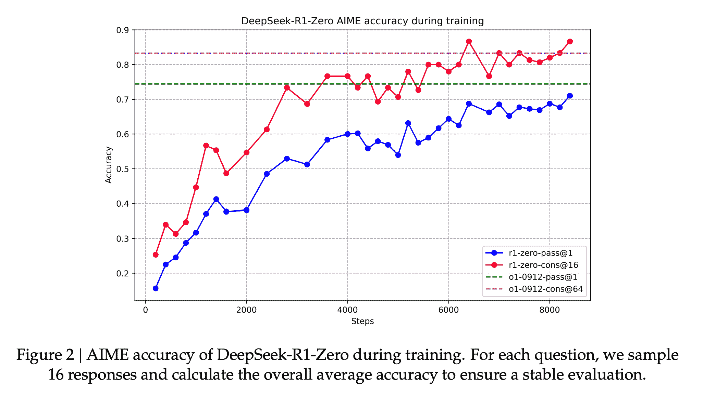
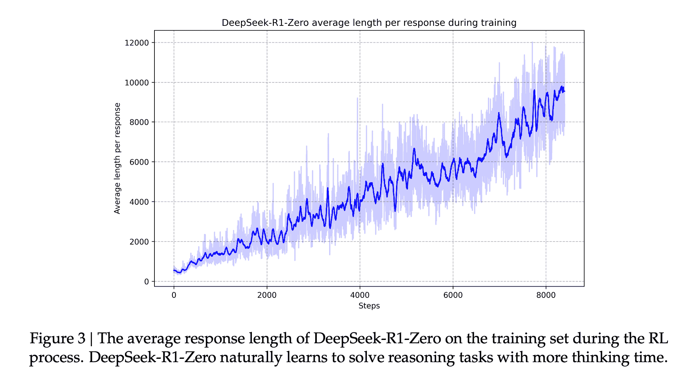
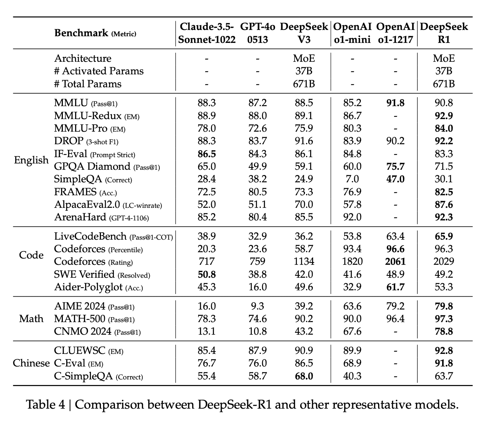
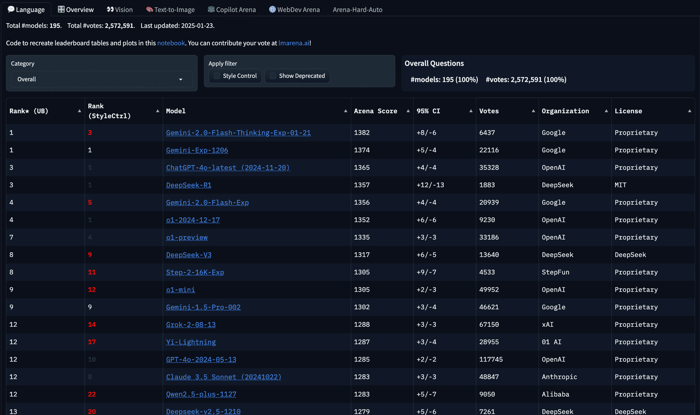

# 探索 DeepSeek 的 R1 训练过程

> [原文链接](https://towardsdatascience.com/exploring-deepseeks-r1-training-process-5036c42deeb1/)

图片由作者 – Flux.1 Schnell 提供

世界上今天发布的最强大的 AI 模型之一已经开源。根据指标和用户互动，它和 OpenAI 的 ChatGPT 一样好，甚至更好。作者们非常慷慨，发布了一篇论文，概述了他们如何训练这样的模型。DeepSeek-R1 目前在科技界是一个大事件，所以我想要分析他们论文中的见解。

在这篇博客文章中，我们将深入探讨他们如何制定策略优化方程以允许强化学习。之后，我将介绍他们让模型经历的各个阶段，以获得令人印象深刻的表现。

让我们深入探讨！

## 组相对策略优化（GRPO）

当我们试图创建一个更好的模型时，我们说我们在优化我们的模型策略（基本上就是它用来解释事物的数据）。历史上，行业依赖于两种策略优化形式：近端策略优化（PPO）和直接策略优化（DPO）。[你可以在我的上一篇博客文章中了解更多关于它们的信息，这里](https://towardsdatascience.com/understanding-the-implications-of-direct-preference-optimization-a4bbd2d85841)，对于这篇帖子，你需要了解的是，GRPO 是我们将用来找出如何最佳更新策略的另一种数学方法。

在我深入公式之前，我将简要解释一些关键概念。

### 关键概念

**策略**是一个函数（由模型的权重和偏差定义），它决定了给定**查询**（q）的不同**输出**（o）的概率。一个**组**是由模型为同一查询产生的输出集，这些输出是从策略的旧版本中采样的。我们之所以从旧版本中采样输出，是因为它没有被更新，这使得其输出保持一致。我们将使用新策略为旧策略输出提供的概率来指导我们的更新。重要的是，**优势**（A）是强化学习在 GRPO 中发挥作用的地方。优势告诉我们一个特定的输出比组中的其他输出好多少。我们使用这个值来加权响应，并直接影响我们将训练模型上的分数。

[方程 1 来自论文](https://github.com/deepseek-ai/DeepSeek-R1/blob/main/DeepSeek_R1.pdf)

我们的模型试图最大化上述方程输出的价值

### 方程的左侧部分

上述公式是我们根据组和最后使用的策略计算特定策略得分的公式。如果模型现在表现得多好，我们应该保留新策略。如果变化是渐进的，我们的下一个策略不会是向新策略的重大转变。从高层次来看，我们现在可以深入挖掘。

将论文中的方程 1 的左侧部分放大 [来自论文](https://github.com/deepseek-ai/DeepSeek-R1/blob/main/DeepSeek_R1.pdf)

方程的上述部分是我们确定数据是否正确的方法。我将从左到右解释 min 函数的每个参数。一开始，我们取给定一定查询的新策略输出与给定相同查询的旧策略输出的比率。这个比率用来告诉我们新策略与旧策略偏离了多少。这个比率并不能告诉我们变化是好是坏，因此我们需要优势值来确定变化是好（正值）还是坏（负值）。为了保持训练过程中的稳定性，我们还计算了这个数字的裁剪版本——值在 1-ε和 1+ε之间。然后我们选择有界和无界值中的较小者，因为这将是更稳定的更新。因为模型的目标是最大化 min 返回值，如果我们总是选择较小的版本，那么在整个运行过程中减少巨大过校正的机会就会降低。

### 奖励建模

方程 3 [来自论文](https://github.com/deepseek-ai/DeepSeek-R1/blob/main/DeepSeek_R1.pdf)

现在，让我们来谈谈优势——或者我们如何知道一个更新是好是坏。对于强化学习，我们没有“真实值”来比较答案。因此，我们需要一个好的方法来确定，在没有人类交互的情况下，响应是否良好。为了解决这个问题，DeepSeek 决定使用基于规则的系统来确定什么构成了一个好的答案。

首先，每个答案都被检查以确定其准确性——例如通过检查最终的计算值或通过编译并检查其输出。其次，他们检查响应是否在正确的格式中（如下所示）。论文使我相信他们为这些内容使用了模型，但它们不是给出主观评分，而是接受复杂输入并给出客观输出。

表 1 [来自论文](https://github.com/deepseek-ai/DeepSeek-R1/blob/main/DeepSeek_R1.pdf)

### 方程的右侧部分

在我们方程的最后一部分，我们将取新策略和参考策略之间的 Kullback-Leibler 散度。就像我在关于直接偏好优化的博客文章中讨论的那样，这是一种衡量两个连续概率分布之间差异的方法。

专注于方程 1 的右手部分（来自论文[链接](https://github.com/deepseek-ai/DeepSeek-R1/blob/main/DeepSeek_R1.pdf)）

虽然方程的左手部分使用 min 来减少策略的剧烈变化，但它显然还不够，因为我们有这个减法来确保策略不会与参考策略有太大的偏差。论文没有指定参考策略是什么，但很可能这是一个表现良好的先前策略，我们正在以此作为基准来确保相似或更好的性能。

* * *

在强化建模完成之后，让我们来看看他们实际上是如何进行训练的！

研究者们以不同的方式训练了两个模型：DeepSeek-R1-Zero 和 DeepSeek-R1

## DeepSeek-R1-Zero

在这里，我们从一个基础模型开始，然后使用强化学习来让模型发展推理能力。有人可能会合理地问，为什么不用监督微调（SFT）来训练模型？嗯，为了进行微调，增强模型的能力，你通常需要大量的好数据。由于这很难获得，找到绕过这一要求的方法是有用的。此外，与监督模型相比，强化学习有可能找到更好的解决问题的方法。

尽管作者没有说明他们向模型提供了哪些问题来测试其推理能力，但可以合理地假设这些数据集相当庞大。他们会运行模型以获取对一组查询的答案，然后使用上面的 GRPO 方程来确定损失。然后，损失被用来执行反向梯度更新并改进模型。

从这次会议中，我们得到了许多非常有趣的见解。最直接的一个是，研究人员能够有效地使用这种方法重现了 OpenAI 的 o1 模型的准确性。仅此一点就表明，许多其他实验室可能会效仿这种方法。

图 2 [来自论文](https://github.com/deepseek-ai/DeepSeek-R1/blob/main/DeepSeek_R1.pdf)

有趣的是，我们还看到 DeepSeek-R1-Zero 能够自主学习以创建更长的响应。下面的图表显示了随着训练运行的继续，其平均响应长度倾向于多长。请注意，提出的问题和 GRPO 都不会因长度而给予任何加分。这一结果为思维链推理是提高这些模型准确性的方法提供了强有力的证据。

图 3 [来自论文](https://github.com/deepseek-ai/DeepSeek-R1/blob/main/DeepSeek_R1.pdf)

最后，作者们也看到模型开始表现出反思的趋势。类似于提示工程师会要求模型反思其答案，在这里我们可以看到模型似乎自发地发展了这种趋势。这里令人着迷的一件事是看到模型使用强化学习来发现我们一直在使用的许多提示技术。

表 3 [来自论文](https://github.com/deepseek-ai/DeepSeek-R1/blob/main/DeepSeek_R1.pdf)

尽管如此，R1-Zero 在训练运行后出现了一些问题。一方面，它偶尔会混合语言——这意味着它会将来自不同语言的单词拼接到一起。此外，研究人员发现 R1-Zero 偶尔会有可读性差的回答。为了解决这些问题同时保持他们的收益，研究人员开始研究改进的方法。

## DeepSeek-R1

从这里，作者们再次从一个基础模型开始，但这次经过了 4 个不同的步骤来训练模型：冷启动、以推理为导向的强化学习、拒绝采样和监督微调、适用于所有场景的强化学习。

### 第一阶段：冷启动

与 R1-Zero 不同，作者们希望避免模型在训练运行开始时走向错误的方向（冷启动问题）。他们开始使用他们的 DeepSeek-V3 模型生成成千上万的思维链推理示例。通过使用监督微调开始，作者们可以确保`<think>`标记始终对用户可理解（这是 R1-Zero 所挣扎的，要么是混合语言，要么是有不可理解的回答）。

### 第二阶段：以推理为导向的强化学习

在微调完成后，他们开始了一轮完全专注于推理导向问题的强化学习。这会涉及编码、数学、科学和逻辑推理技能。所有这些都是精确问题，有正确答案。

在训练过程中，他们注意到模型经常会开始在其`<think>`标记中进行语言混合。为了避免这种情况，他们在优势计算中引入了语言一致性奖励，确保模型会倾向于只使用一种语言。作者们指出，这种对齐会略微降低性能。一旦模型在其所有推理任务上收敛，他们就会停止运行。

### 第三阶段：拒绝采样和监督微调

研究人员现在扩展了他们为微调所整理的问题类型。他们创建了推理和非推理问题来提高模型的表现。

对于推理问题，他们不再要求问题有一个客观的答案。相反，为了确定正确性，他们使用 DeepSeek-V3 作为他们的评判标准。在过滤掉错误答案、混合语言使用、长段落和代码块后，他们大约有 60 万个样本用于训练。

对于非推理问题（如写作、翻译、讲故事），作者们重新使用了 DeepSeek-V3 的数据管道。对于一些数据，作者们要求完整的思维链推理，但当他们认为问题足够简单（例如“hi”）时，他们没有生成完整的思维链。最终他们这里大约有 20 万个样本。

他们使用这些数据进行了两个 epoch 的微调。

### 第四阶段：所有场景的强化学习

他们以最后的强化学习运行结束。他们调整了优势计算，以便能够捕捉到正确的推理（他们使用了之前相同的基于规则的策略）以及人类对有用性和无害性的偏好。对于后者，他们似乎又回到了使用外部奖励模型来估计人类偏好的方法。他们使用与 DeepSeek-V3 管道相同的数据语料库来构建这个奖励模型。注意，对于有用性，最终的总结是他们奖励模型关注的焦点，但对于无害性，他们也考虑了思考标记。

通过这一最终步骤，他们能够从 DeepSeek-R1 中获得令人难以置信的性能。

## 结果

如下表所示，该模型与 Anthropic 和 OpenAI 的一些最佳模型直接可比。更不用说，在几个基准测试中，DeepSeek R1 的表现明显更好。

[论文](https://github.com/deepseek-ai/DeepSeek-R1/blob/main/DeepSeek_R1.pdf)中的表 4

可能最有趣的性能指标是公众的反应。在 Chatbot 竞技场中，DeepSeek-R1 排名很高，是唯一一个在前十名中拥有麻省理工学院许可证的模型。

作者图片 - 2025 年 1 月 27 日 Chatbot 竞技场的屏幕截图

此外，技术社区中的许多人也对这一点表示了他们的印象深刻。

此外，作者们还与我们分享了他们尝试的其他方法（包括使用流程奖励模型，[我在这里解释了](https://medium.com/towards-data-science/how-to-improve-model-quality-without-building-larger-models-d6c8e76a86fe)）。值得仔细阅读他们的分析，看看为什么他们放弃了其他方法。

## 结论

这篇论文是了解最前沿实验室如何训练基础模型的一个很好的方式。鉴于这里取得的成果，我认为人们转向强化学习进行大量（如果不是全部）微调只是时间问题。我认为这可以说是人工智能历史上的一个开创性时刻。

现在是构建模型的一个激动人心的时刻！

* * *

[1] DeepSeek Research, ["DeepSeek-R1：通过强化学习激励 LLMs 的推理能力"](https://github.com/deepseek-ai/DeepSeek-R1/blob/main/DeepSeek_R1.pdf) (2025), GitHub
