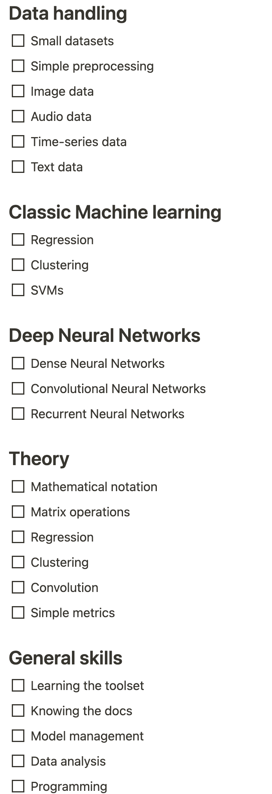

# 学习机器学习的三个阶段

> [`towardsdatascience.com/the-three-phases-of-learning-machine-learning-df0a53148dd3/`](https://towardsdatascience.com/the-three-phases-of-learning-machine-learning-df0a53148dd3/)

在拥有 6 年以上机器学习经验之后，无论是在研究还是行业中，看到这个领域多年来的发展非常有趣。我仍然记得坐在研讨室内，听着关于所有机器学习的讲座：深度学习、强化学习、随机森林、神经网络、自然语言处理、……

图片由[Vlad Bagacian](https://unsplash.com/@vladbagacian?utm_source=medium&utm_medium=referral)在[Unsplash](https://unsplash.com?utm_source=medium&utm_medium=referral)上提供

在我记忆中，有一场特定的自然语言处理讲座格外突出，我们讨论了该领域的快速进步。上周我们还在讨论简单的注意力机制，而现在我们正在研究基于 Transformer 的方法。这位伟大的导师向我们展示了模型的参数计数图。然后我们查阅了当时最新的进展，很明显：任何数据在一个月内就会过时。那时我的机器学习之旅才刚刚开始，而再次发布的创新数量已经令人难以置信。

从那时起，我的旅程经历了几个阶段。与其他机器学习人士的交流表明，他们有类似的经历：从入门者到经验丰富的从业者，这个旅程可以分为以下三个阶段：

**第一阶段：入门阶段（约 1 年；本文）** **第二阶段：中级阶段（1 至 3 年；即将推出）** **第三阶段：高级阶段（5 年以上；即将推出）**

## 学习机器学习的入门阶段

本文的重点在于您机器学习之旅的第一个阶段：入门阶段。为了帮助您开始学习机器学习，您可以使用以下清单来跟踪您的进度（也可参见*资源*部分）。

入门阶段是每个人的起点。在这个阶段，您的首要目标是理解机器学习背后的基本思想：机器如何从数据中学习以及驱动 ML 模型的基本算法。您将深入研究决策树、k 近邻（KNN）和线性回归等主题。这些概念是您进一步机器学习之旅的基石。

在您的旅程开始时，了解深度学习领域的大致情况可能是有意义的。在这里，我可以推荐麻省理工学院的免费《深度学习导论》课程，参见*资源*。这是一场紧张的讲座，展示了（现代）深度机器学习的所有领域。它让您看到下一年（几年）等待您的是什么。

实际上，我们可以将入门阶段分为五个类别。

1.  数据处理

1.  经典机器学习

1.  神经网络

1.  理论

1.  其他技能

### 数据处理

在这个类别中，你将学习如何处理容易装入你电脑内存的小数据集。这是好事，因为你不需要在线租用昂贵的计算资源。通常，这些数据集在像 PyTorch 或 TensorFlow 这样的机器学习框架中很容易找到。小型数据集的常见例子包括：

+   图像：MNIST（手写数字）

+   音频：ESC-50 环境声音录音

+   时间序列：心跳时间序列分类

+   文本：IMDB 电影评论用于情感分析

这些入门级数据集的优势在于它们有很好的文档和易于操作。通常，你必须为它们做的预处理只是调整图像大小或修剪句子，这只需要几行代码就可以处理。这让你能够专注于学习核心概念，而无需预处理大于内存的数据集。

如果你需要更多的计算资源，那么尝试 Google Colab。这是 Google 提供的一项免费服务，允许你在浏览器中直接运行 Jupyter Notebooks（即交互式 Python 代码）。见*资源*。

### 经典机器学习

虽然本文的重点是**深度**机器学习——与经典机器学习相对——学习经过时间考验的基础知识也是有用的。在这些经典机器学习技术中，有一些脱颖而出：

+   回归：这里的目的是根据输入数据预测连续值。波士顿房价数据集是回归中常用的数据集；任务是根据如面积、位置等特征预测房价。

+   聚类：这是关于将相似的数据点分组在一起。K-means 聚类是初学者的绝佳起点，我最近读了一篇论文，其中作者将高级深度学习技术与 k-means 聚类相结合。

+   支持向量机（SVM）：SVMs 专注于找到最佳决策边界（超平面，本质上是在*n*-维空间中的边界）来将数据分离成不同的类别。它们通常用于分类数据集。

通常来说，尽管最近的大部分进步往往是深度学习技术的结果，但经典机器学习仍然相关。你并不总是需要高级的机器学习技术，有时基础知识就足够了。

### 神经网络

一旦你对经典机器学习的基础知识感到舒适，你将开始过渡到神经网络（NNs），这是深度学习的基础。我建议从**密集神经网络**开始，它由多个全连接层组成，或者在 PyTorch 中是线性层。在这些层中，每个输入都会乘以一个权重并与偏差结合以产生输出。你可以使用这些网络处理小型和中型数据集。

在密集神经网络之后，你将深入探索**卷积神经网络**（CNNs）。这类网络对于涉及图像数据的任务至关重要。CNNs 使用卷积运算来识别图像中的边缘、纹理或形状等特征，无论它们在图像中的位置如何。这种位置无关的能力使 CNNs 成为一种非常灵活的方法。

最后，对于序列数据（如时间序列），我建议尝试**循环神经网络**（RNNs）。RNNs 被设计用来保留之前步骤的信息，这使得它们非常适合像语言建模或时间序列预测这样的任务。实际上，早期的机器学习研究（大约在 2014 年）主要使用 RNNs 进行机器翻译，参见*资源*。

### 理论

与动手学习相结合，发展对你所使用方法的理论理解是至关重要的。这包括数学符号、矩阵运算以及机器学习算法的底层原理。

例如，理解Σ符号（求和）有助于使复杂的数学表达式更加简洁易读。虽然它们需要一些学习，但使用这种方式表达操作可以帮助避免自然语言交流中的歧义，这是自然语言交流的一个缺点。随着实践，算法背后的数学将开始变得更有意义。

在这个阶段，你还会遇到用于评估 ML 模型的关键指标，如准确率、均方误差、精确率和召回率。这些指标将帮助你衡量你模型的性能。

### 其他技能

当你在学习经典机器学习、神经网络和理论时，你也会在入门阶段自然地发展实际技能。这些技能包括编程、模型管理和虚拟环境。

**对于编程，Python 是 ML 的首选语言**，它庞大的库生态系统（如 NumPy、pandas、Scikit-learn 等）将非常有价值。

这些库提供的功能在你分析数据集时非常有用。例如，值域是多少？有没有一些异常值？它们有多极端？有没有不可用的数据样本？这些问题是你想要回答的，通常是在进行中：

你写一个简短的代码片段——它因为数据样本不同而失败——你更新代码——你对你数据了解得更多了。

基本上，每次你在磨练你的数据分析技能时，你也会提高你的编码技能。

另一方面，**模型管理**意味着保存、加载和共享训练好的模型。当你在一个脚本中训练你的神经网络，但在另一个脚本中评估它时，这很有用。

最后，你在代码层面所做的每一件事都需要一个 Python 解释器，这是一个帮助你执行 Python 代码的程序。由于你将会有多个项目，我建议**熟悉虚拟环境**。这些“封装”了所有需求和依赖到它们自己的磁盘空间中，这样你的项目就不会相互干扰。

* * *

## 初学者阶段之后

到了初学者阶段的尾声，你将会有对核心机器学习概念的扎实理解，对基本模型的实际操作经验，并能阅读数学公式。通过关注（小型）项目，你已经练习了各种机器学习方法。这是在下一阶段，即中级阶段，应对更复杂主题的好基础。它涵盖了你的机器学习旅程的第 1 到 3 年，目前正在准备中。稍后回来这里，或者关注我或 Towards Data Science，以获取发布通知。

* * *

### **进一步阅读：**

> [**六年后，我再次学习机器学习的方法**](https://towardsdatascience.com/how-id-learn-machine-learning-again-after-6-years-16847fb2b72c)
> 
> [**学习机器学习还是学习关于学习机器学习？**](https://towardsdatascience.com/learning-ml-or-learning-about-learning-ml-fe0c3b7b6440)
> 
> [**跟踪你的机器学习进度的清单**](https://towardsdatascience.com/a-checklist-to-track-your-machine-learning-progress-801405f5cf86)

### **资源：**

+   **波士顿房价数据集**：[`mirahari.github.io/boston/`](https://mirahari.github.io/boston/)

+   **ESC50 音频数据集**：[`github.com/karolpiczak/ESC-50`](https://github.com/karolpiczak/ESC-50)

+   **心跳分类**：[`www.kaggle.com/datasets/shayanfazeli/heartbeat`](https://www.kaggle.com/datasets/shayanfazeli/heartbeat)

+   **2014 年机器翻译论文**：[`arxiv.org/abs/1409.0473`](https://arxiv.org/abs/1409.0473), [`arxiv.org/abs/1409.3215`](https://arxiv.org/abs/1409.3215), [`arxiv.org/abs/1406.1078`](https://arxiv.org/abs/1406.1078)

+   **初学者阶段 Notion 清单**：[`phrasenmaeher.notion.site/The-three-phases-of-learning-Machine-Learning-The-beginner-phase-17963d033fa180bea2cacddaf580de3d`](https://phrasenmaeher.notion.site/The-three-phases-of-learning-Machine-Learning-The-beginner-phase-17963d033fa180bea2cacddaf580de3d)

+   **Google Colab**：[`colab.research.google.com/`](https://colab.research.google.com/)

+   **麻省理工学院的深度学习入门课程**：[`introtodeeplearning.com`](https://introtodeeplearning.com)

+   **Python 中的虚拟环境**：[`realpython.com/python-virtual-environments-a-primer/`](https://realpython.com/python-virtual-environments-a-primer/)
