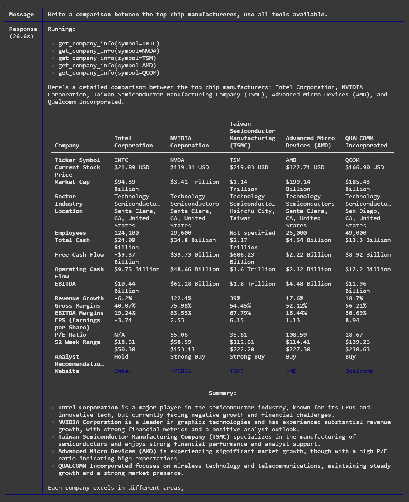
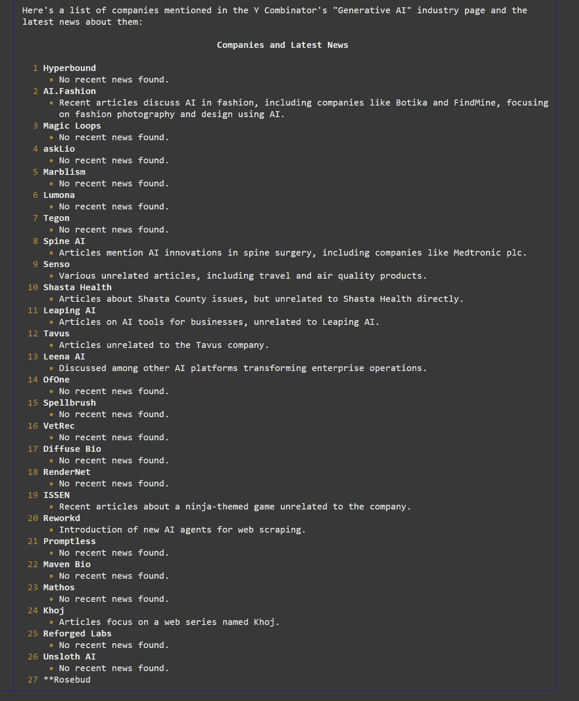
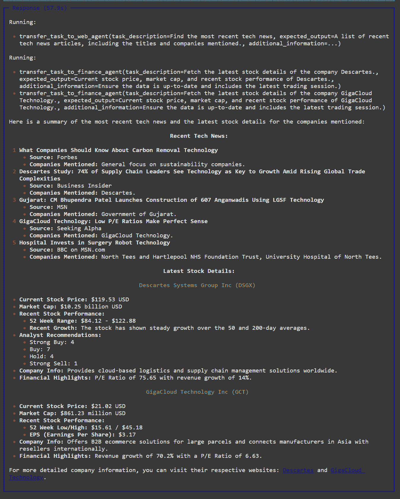

# 在时间紧迫的情况下，但仍想学习开发多智能体 AI？

> [`towardsdatascience.com/learn-to-build-agentic-ai-systems-9e552d841525/`](https://towardsdatascience.com/learn-to-build-agentic-ai-systems-9e552d841525/)


照片来源：[Kaboompics.com](https://www.pexels.com/photo/young-woman-with-laptop-sitting-on-yoga-mat-4498457/)，来自[Pexels](https://www.pexels.com/photo/young-woman-with-laptop-sitting-on-yoga-mat-4498457/)。

> 话题热点：AI 代理将取代 SAAS。

这不是任何毒品贩子随口说出的一句话。这是微软 CEO 萨蒂亚·纳德拉说的[这句话](https://economictimes.indiatimes.com/tech/artificial-intelligence/ai-agents-will-revolutionise-saas-and-productivity-microsoft-ceo-satya-nadella/articleshow/117026938.cms?from=mdr)。

如果你是一名开发者或技术领域的任何人，你都想了解如何自己构建 AI 代理。但并不是我们所有人都能负担得起从头学习它们的时间。

如果你发现自己属于这个群体，我写这篇文章就是为了你。

这也是我学习如何开发 AI 应用程序的方式——但更加非正式。因此，我想在文章中组织它，这样你可以很好地跟随，并用你的周末时间学习开发 AI 应用程序的基础。

我以 AI 代理的引用开始了这篇文章。我会说到那一点。

但在那之前，我们应该先在 LLMs（大型语言模型）上试试水。别担心——这不是一篇非常理论性的文章。我们首先将构建一个仅使用 LLM 的应用程序。然后，我们将构建一个检索增强的应用程序（RAG）。最后，我们将构建一个真正的代理应用程序。

你可能对通用人工智能工具有一些了解。所以请随意跳到你的项目。

> [**最有价值的 LLM 开发技能易于学习，但实践成本高昂。**](https://towardsdatascience.com/llm-evaluation-techniques-and-costs-3147840afc53)

## 你需要的东西……

正如我提到的，这不会占用一个周末的时间来完成。但除了时间，你还需要一些其他的东西。

首先，我假设你擅长编程（Python）并且有开发某些东西的经验。（你的宠物项目和作业也算在内）

我们将使用 Python 框架，如[Streamlit](https://streamlit.io/)、[Lanchain](https://www.langchain.com/)和[Phidata](https://docs.phidata.com/introduction#what-is-phidata)。

你需要一个活跃的互联网连接，因为我们将通过他们的 API 使用 OpenAI 模型。哦，这也意味着你需要一个活跃的[OpenAI API 密钥](https://platform.openai.com/)。

你的电脑应该与 Chroma 等向量存储兼容，并且能够运行它们，大多数消费级笔记本电脑都可以没有问题运行。

你可以通过以下命令开始安装所需的库。

```py
pip install -qU streamlit python-dotenv langchain-community langchain-openai langchain-chroma phidata
```

此外，在你的工作目录中创建一个`.env`文件，并使用你的 OpenAI API 密钥更新它。

```py
OPENAI_API_KEY=sk-proj-XXXXX
```

确保你始终使用 Python-dotenv 读取 Python 脚本中的`.env`文件。

```py
from dotenv import load_dotenv

load_dotenv()

# The rest of your code
```

你已经准备好开始构建了。

## 1 研究论文摘要器

这是我在学习 LLMs 时创建的最简单也是最有趣的工具。

我没有直接使用这个应用，但它让我对 LLMs、提示和 Langchain 生态系统有了坚实的理解。

这个应用将研究论文总结为几行易于消化的内容。

```py
from langchain_community.document_loaders import WebBaseLoader

from langchain_openai import ChatOpenAI

from langchain.chains.combine_documents import create_stuff_documents_chain
from langchain.chains.llm import LLMChain
from langchain_core.prompts import ChatPromptTemplate

# Create an instance of LLM
llm = ChatOpenAI(model="gpt-4o-mini")

# Load document
loader = WebBaseLoader("https://arxiv.org/abs/2303.16634")
docs = loader.load()

# Prompt template 
prompt_template = """Write a concise summary of the following:
"{context}"
CONCISE SUMMARY:"""

# Define prompt
prompt = ChatPromptTemplate.from_template(prompt_template)

# LLM Chain
chain = prompt | llm

# Invoke chain
result = chain.invoke({"context": docs})
print(result)

>> content='The paper titled "G-Eval: NLG Evaluation using GPT-4 with Better Human Alignment" presents G-Eval, a new framework for evaluating the quality of text generated by natural language generation (NLG) systems. The authors, Yang Liu et al., argue that traditional evaluation metrics like BLEU and ROUGE do not correlate well with human judgments, particularly in creative contexts. Their approach utilizes large language models (LLMs) with chain-of-thought (CoT) reasoning and a form-filling method, showing significant improvements in evaluation accuracy over previous methods. G-Eval achieves a Spearman correlation of 0.514 with human evaluations in summarization tasks, indicating better alignment with human judgment. The study also discusses potential biases in LLM-based evaluations. The paper was submitted to arXiv on March 29, 2023, and last revised on May 23, 2023.' additional_kwargs={'refusal': None} response_metadata={'token_usage': {'completion_tokens': 184, 'prompt_tokens': 1991, 'total_tokens': 2175, 'completion_tokens_details': {'accepted_prediction_tokens': 0, 'audio_tokens': 0, 'reasoning_tokens': 0, 'rejected_prediction_tokens': 0}, 'prompt_tokens_details': {'audio_tokens': 0, 'cached_tokens': 0}}, 'model_name': 'gpt-4o-mini-2024-07-18', 'system_fingerprint': 'fp_72ed7ab54c', 'finish_reason': 'stop', 'logprobs': None} id='run-46e4511c-e109-41ee-8e37-f7ef7f57b267-0' usage_metadata={'input_tokens': 1991, 'output_tokens': 184, 'total_tokens': 2175, 'input_token_details': {'audio': 0, 'cache_read': 0}, 'output_token_details': {'audio': 0, 'reasoning': 0}}
```

这是一个超级简单的应用。然而，它让我们对 LangChain 生态系统以及如何使用它来构建 LLM 驱动的应用有了很多了解。

在这个应用中，我们读取网页内容（确切地说是一篇关于 G-Eval 的研究论文）并借助 GPT-4o-mini 进行总结。为了让这个模型工作，我们应该将 OpenAI API 密钥设置为环境变量，这在上一节中已经完成。

我们应该注意提示模板和链。提示模板是一个带有任何动态插入变量的占位符的提示。大括号内的任何内容都会被视为变量名。我们必须在运行时设置这个变量以从提示模板创建提示。

在我们的案例中，我们将变量命名为`{context}`。

接下来，我们创建一个称为链的东西。链就像是一个将执行管道的各种组件粘合在一起的功能。输入变量（`context`）、提示、llm 以及更多将在以后介绍。我们现在可以使用输入变量调用（或者更准确地说，调用）链。

### I. 回答问题（不仅仅是总结）

最后一个示例只使用了一个输入变量。然而，让我们修改提示模板以接受两个变量。

这次，我们传入上下文和一个问题。因此，用户不仅可以总结上下文，还可以就上下文提出任何随机问题。

让我们看看一个例子：

```py
...

# Prompt template 
prompt_template = """Answer the user's question based on the following context:
context: {context}
question: {question}
"""

# Define prompt
prompt = ChatPromptTemplate.from_template(prompt_template)

# LLM Chain
chain = prompt | llm

# Invoke chain
result = chain.invoke({"context": docs, "question": "What was the GPT version used in this study?"})
print(result)

>> content='The study used GPT-4 as the backbone model in the G-Eval framework for NLG evaluation.' additional_kwargs={'refusal': None} response_metadata={'token_usage': {'completion_tokens': 22, 'prompt_tokens': 2001, 'total_tokens': 2023, 'completion_tokens_details': {'accepted_prediction_tokens': 0, 'audio_tokens': 0, 'reasoning_tokens': 0, 'rejected_prediction_tokens': 0}, 'prompt_tokens_details': {'audio_tokens': 0, 'cached_tokens': 0}}, 'model_name': 'gpt-4o-mini-2024-07-18', 'system_fingerprint': 'fp_72ed7ab54c', 'finish_reason': 'stop', 'logprobs': None} id='run-43a7a03e-1699-4036-8006-87f42e8f38f2-0' usage_metadata={'input_tokens': 2001, 'output_tokens': 22, 'total_tokens': 2023, 'input_token_details': {'audio': 0, 'cache_read': 0}, 'output_token_details': {'audio': 0, 'reasoning': 0}}
```

在新版本中，提示被简化为根据`context`回答用户的`question`。请注意，现在调用方法现在同时传递了作为字典的输入变量。

### II. 复杂链

如果你仔细观察，调用方法的输出是一个对象。如果我们想得到一个只包含文本的、其他应用可以使用的好看的输出呢？

在以下示例中，我展示了如何使用 Langchain 内置的输出解析器格式化输出。我还运行了一个额外的 lambda 函数来展示我们可以在链中运行任何函数。

```py
...

from langchain_core.output_parsers import StrOutputParser
parser = StrOutputParser()

...

chain = prompt | llm | parser | (lambda x: x.split())

...

>> ['The', 'study', 'used', 'GPT-4', 'as', 'the', 'backbone', 'model', 'for', 'the', 'G-Eval', 'framework.']
```

这个链还不复杂。但等等。

## 2 对抗私有数据的问答应用

前一个应用很有帮助，但仅限于一定程度。

该应用的主要限制是输入的大小。它只是一个单独的网页，而不是《哈利·波特》系列的集合。

最新模型支持大上下文窗口。例如，[Google 的 Gemini 1.5 可以处理高达 100 万个 token](https://blog.google/technology/ai/google-gemini-next-generation-model-february-2024/#sundar-note)。在英语中，这大约相当于 75 万个单词。

这已经足够让一本学术教科书舒适地存在。但这里还有一些其他问题需要考虑。

1.  当上下文更大时，LLM 容易失去焦点。当上下文中存在过多的**噪声**时，LLM 很难找到我们特定问题的答案——结果往往是虚构的。

1.  你还需要为输入令牌付费。LLM API 提供商，如 OpenAI，**对输入和输出令牌收费**。当上下文更大时，你必然需要为这些提供商付费。更不用说**互联网带宽的成本**了。

1.  更大的上下文意味着**更慢的响应**。这不是火箭科学；你提供了太多信息给其他 LLM 去遍历，你应该期待更慢的响应。如果你使用 API 提供商，你的响应将因互联网流量而进一步延迟。

由于以下原因，向 LLM 提供仅相关的信息是明智的。例如，如果用户问了一个关于闪电的问题，而不是传递整本物理教科书作为上下文，过滤掉提到闪电（或相关术语）的部分，并只提供这些。

这种方法被称为检索增强生成，或简称**RAG**。

> [**如何通过查询路由构建有用的 RAG**](https://towardsdatascience.com/rags-with-query-routing-5552e4e41c54)

大多数 RAG 应用都遵循以下方法。

1.  您的数据被分成更小的段以限制每个块中只有一个想法。

1.  每个块都被转换为向量嵌入并存储在向量存储中，例如 Chroma。

1.  在检索过程中，用户的提问也被转换为向量嵌入。

1.  向量存储将计算问题的向量版本与数据库中块现有向量之间的相似度。

1.  相似度最高的前 n 个块将成为 RAG 链中回答你问题的`上下文`。

下面是如何在代码中实现这一切的示例。

```py
# This is to securely load our secrets
from dotenv import load_dotenv
load_dotenv()

# 1\. Load the content
# -----------------------------------------
import bs4
from langchain_community.document_loaders import WebBaseLoader

loader = WebBaseLoader(
    web_paths=("https://docs.djangoproject.com/en/5.0/topics/performance/",),
    bs_kwargs=dict(
        parse_only=bs4.SoupStrainer(
            id="docs-content"
        )
    ),
)
doc_content = loader.load()

# 2\. Indexing
# -----------------------------------------
from langchain.text_splitter import RecursiveCharacterTextSplitter
from langchain_community.vectorstores import Chroma
from langchain_openai import OpenAIEmbeddings

text_splitter = RecursiveCharacterTextSplitter.from_tiktoken_encoder(
    chunk_size=1000, chunk_overlap=200
)
docs = text_splitter.split_documents(doc_content)

vector_store = Chroma.from_documents(documents=docs, embedding=OpenAIEmbeddings())
retriever = vector_store.as_retriever()

# 3\. LLM 
# -----------------------------------------
from langchain_openai import ChatOpenAI
llm = ChatOpenAI(temperature=0.5)

# 4\. RAG Chain
# -----------------------------------------
from langchain_core.prompts import ChatPromptTemplate
from langchain_core.runnables import RunnablePassthrough
from langchain_core.output_parsers import StrOutputParser

prompt = """
Answer the question in the below context:
{context}

Question: {question}
"""

prompt_template = ChatPromptTemplate.from_template(prompt)

chain = (
    {"context": retriever, "question": RunnablePassthrough()}
    | prompt_template
    | llm
    | StrOutputParser()
)

# 5\. Invoking the chain
# -----------------------------------------
response = chain.invoke(
    "How can I improve site speed?",
)

print(response)

>> To improve site speed, you can consider the following strategies:

1\. Utilize Django's caching framework: Implement caching to save dynamic content and reduce the need for recalculating data for each request. Django offers different levels of cache granularity, allowing you to cache specific views or difficult-to-produce pieces of content.

2\. Optimize template performance: Use  instead of  as it is faster. Avoid heavily-fragmented templates, as they can impact performance. Enable the cached template loader to avoid compiling templates every time they need to be rendered.

3\. Minimize static file loading times: Use ManifestStaticFilesStorage to append content-dependent tags to static file names, allowing web browsers to cache them long-term without missing future changes.

4\. Consider alternative software implementations: Check if alternative implementations of Python software you're using can execute the same code faster. PyPy, for example, can offer substantial performance gains for heavyweight applications.

5\. Benchmark and measure performance: Use performance benchmarking tools like django-debug-toolbar and third-party services like Yahoo's Yslow and Google PageSpeed to analyze and report on your site's performance. Identify areas for improvement and prioritize optimizations based on their impact.

By implementing these strategies and continuously monitoring and optimizing your site's performance, you can enhance its speed and provide a better user experience.
```

在上述示例中，我们在 Chroma DB 中索引了一个网页（Django 官方文档页面之一）。

请注意步骤 #2，其中我们分割和索引网页并将其存储在 Chroma DB 中。为了分割网页的文本内容，我们使用了递归字符分割技术，这是我们创建块的方式之一。

> [**高级递归和后续检索技术，以构建更好的 RAG**](https://towardsdatascience.com/advanced-retrieval-techniques-for-better-rags-c53e1b03c183)

然后，我们使用 OpenAI 嵌入技术将块转换为它们的向量表示，并将它们存储在 Chroma DB 中。需要注意的是，当我们创建用于检索的问题的向量版本时，我们需要使用相同的嵌入模型。幸运的是，Langchain 已经处理了这一点。

现在注意步骤 #4，其中我们创建 RAG 链。这看起来可能和我们的上一个应用类似，但有两大不同之处。在上下文的位置，我们现在传递检索器。检索器是准备好为你检索信息的向量存储。接下来，我们不再使用问题，而是有一个 RunnablePassthrough 对象。这允许我们将问题作为链的唯一参数调用。我们不再需要传递一个字典。

> [**5 种经过验证的查询翻译技术，以提升你的 RAG 性能**](https://towardsdatascience.com/5-proven-query-translation-techniques-to-boost-your-rag-performance-47db12efe971)

这不是很容易吗？

但在底层，每次你提问（每次调用链），链都会将问题转换为向量，从向量存储中检索相似的片段，将其作为上下文传递给我们的 LLM，并生成对我们问题的答案。

恭喜你构建了你的第一个 RAG 应用。我们现在准备好迎接 AI 代理了。

## **#3 使用 AI 代理完成任务**

“AI 代理”这个术语可能会让你感到困惑，甚至感到害怕，但它是一个简单的概念。

把代理想象成一个工人，你分配给他一个任务。然后这个工人必须使用工具来完成这个任务。

这听起来像是一个传统的软件程序。确实如此。然而，与那些需要按特定顺序执行指令的软件不同，代理将确定使用哪些工具以及它们的顺序。

这里有一个正在行动的代理。

```py
from phi.agent import Agent
from phi.llm.openai import OpenAIChat
from phi.tools.yfinance import YFinanceTools

agent= Agent(
    llm=OpenAIChat(model="gpt-4o"),
    tools=[YFinanceTools(stock_price=True, analyst_recommendations=True, company_info=True, company_news=True)],
    show_tool_calls=True,
    markdown=True,
)

agent.print_response(
  "Write a comparison between the top chip manufactureres, use all tools available."
)
```

这是它的输出。



作者提供的图片。

整个报告只用了 26 秒就完成了。这听起来可能有点高。但是这里的关键点。

你手动完成它需要多长时间？即使你能写一个代码来做这件事，你完成那个 Python 脚本需要多长时间？

这段代码只有几行长。但它可以用一个名为 YFinanceTool 的工具做无数的事情，这个工具可以获取与股票相关的信息。注意，我们并没有告诉 LLM 要查找哪些公司。LLM 自己想出来了。

### I 拥有众多工具的代理

代理也可以使用多个工具。这里有一个例子。

```py
from phi.agent import Agent
from phi.tools.newspaper4k import Newspaper4k
from phi.tools.duckduckgo import DuckDuckGo

agent = Agent(
    tools=[
      Newspaper4k(), 
      DuckDuckGo()
    ], 
    debug_mode=True, 
    show_tool_calls=True
)

agent.print_response(
    "Find the list of companies mentioned in https://www.ycombinator.com/companies/industry/generative-ai and find the latest news about them"
)
```

在这里，我们要求代理读取一个链接，并找到链接中提到的公司的最新新闻。这个链接是 Y-combinator 资助的 Gen-AI 公司列表。

我们预计第一个工具，Newspaper4k，将阅读文章，然后第二个工具，DuckDuckGo，将为链接中提到的每个初创公司找到相关新闻。

这里是输出结果：



这个任务手动执行或编码都不容易，但我们的代理很快就完成了。

### II 多智能体架构

有时候，让专门的代理一起完成任务是最好的。

与其把所有工具都给一个人，然后让他们执行一个复杂任务，不如给几个更专业的人。每个团队成员都将有自己专门的方式来使用他们手中的工具完成子任务。将有一个领导者来协调其他成员之间的事务。

这听起来很疯狂。

这就是多智能体系统的样子。我们打算构建一个。

```py
from phi.agent import Agent
from phi.model.openai import OpenAIChat
from phi.tools.tavily import TavilyTools
from phi.tools.yfinance import YFinanceTools

web_agent = Agent(
    name="Web Agent",
    model=OpenAIChat(model="gpt-4o-mini"),
    tools=[TavilyTools()],
    instructions=["Always include sources"],
    show_tool_calls=True,
    markdown=True
)

finance_agent = Agent(
    name="Finance Agent",
    role="Get financial data",
    model=OpenAIChat(model="gpt-4o-mini"),
    tools=[
      YFinanceTools(
        stock_price=True, 
        analyst_recommendations=True, 
        company_info=True
      )
    ],
    instructions=["Use tables to display data"],
    show_tool_calls=True,
    markdown=True,
)

agent_team = Agent(
    model=OpenAIChat(model="gpt-4o"),
    team=[web_agent, finance_agent],
    instructions=[
      "Always include sources", 
      "Use tables to display data", "show gif for news posts"],
    show_tool_calls=True,
    markdown=True,
)

agent_team.print_response(
  "Find the most recent tech news, then fetch and summarize the latest stock details of the companies mentioned in the news", 
  stream=True
)
```

上述代码有两个代理。第一个代理专门用于在互联网上搜索新闻。它使用一个名为 Tavily 的工具进行编程搜索。第二个代理从雅虎财经获取财务信息。

我们还有一个第三个代理。

这个工具只有一个职责——协调两个代理以完成它被要求完成的任务。

当我们要求代理团队“找到最新的科技新闻，然后获取并总结新闻中提到的公司的最新股票详情”时，输出的结果是这样的。



作者截图

研究代理已经搜索了福布斯和 MSN 等可信来源，以找到最新的科技新闻。然后，它使用了 YFinanceTool 来获取最近的股票信息。随后，它很好地呈现了一份包含总结的报告。

## 最后的想法

多代理架构有很大的潜力自动化我们许多繁琐的任务。它们可以在代理之间进行协调，这是确定性编码所不可能实现的。

类似于 Langchain 这样的工具可以帮助任何了解 Python 的人开发由 LLM（大型语言模型）驱动的智能应用。同样，Phidata 和 Crew AI 这样的工具也可以帮助你构建代理和代理团队。

启动这些工具所需的时间也不是太疯狂。也许你只需要一个周末和几杯咖啡。
