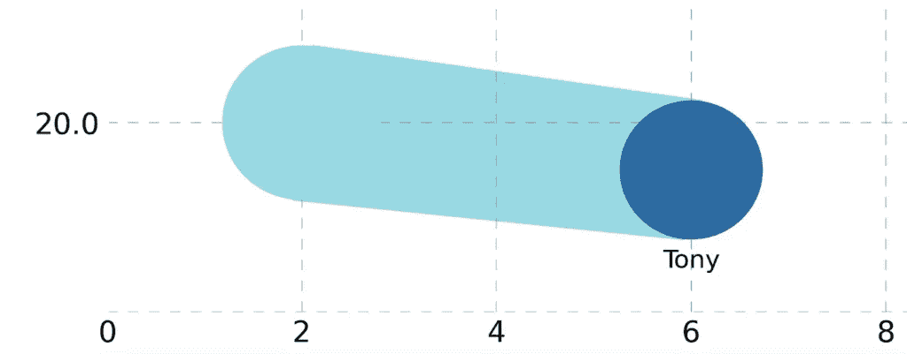
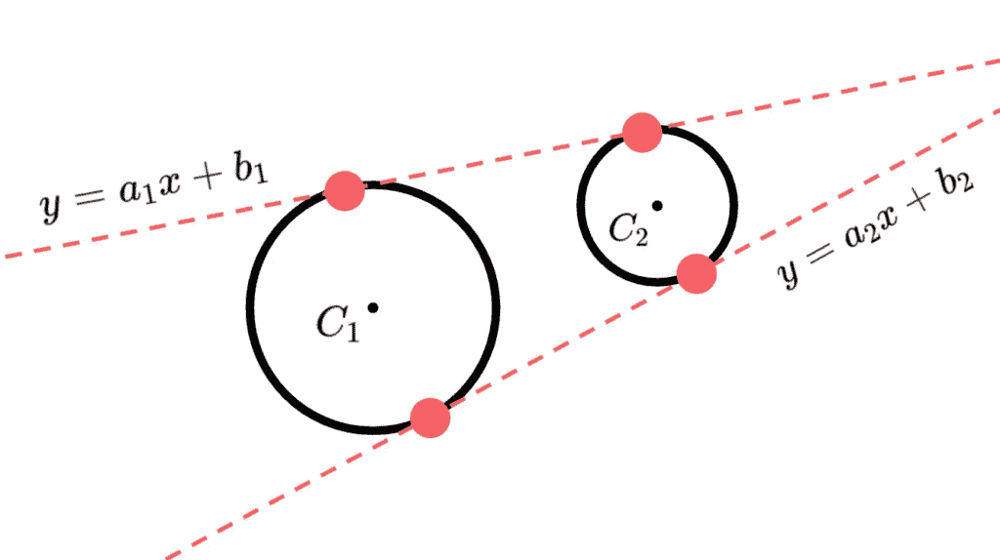
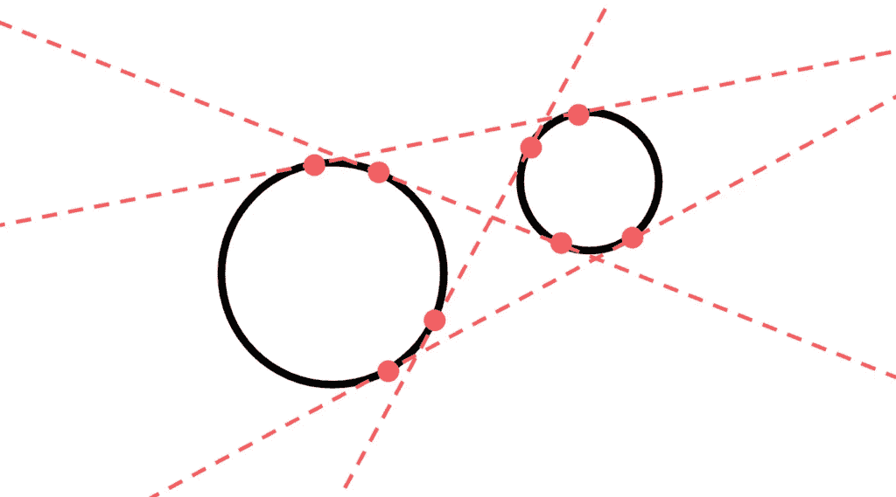
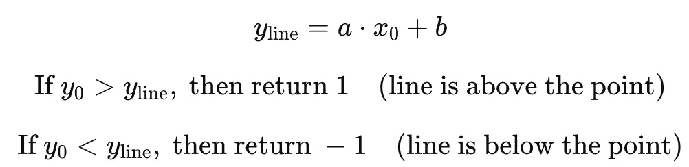
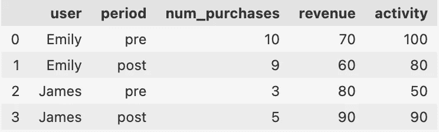
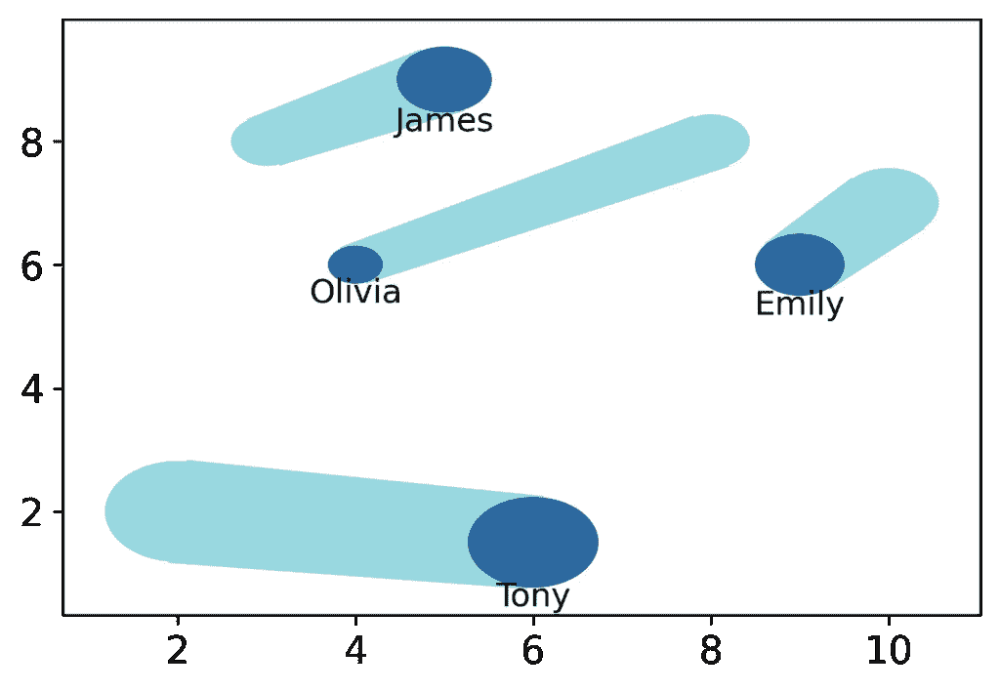
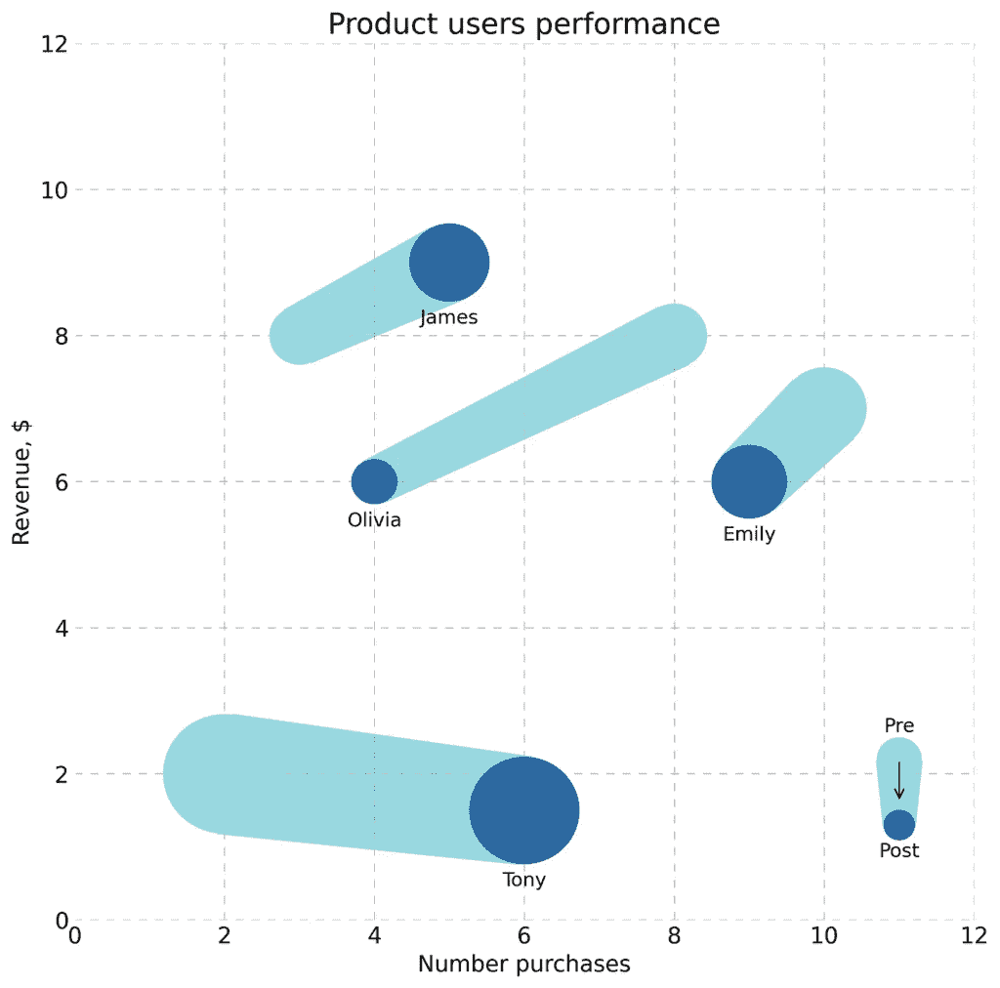
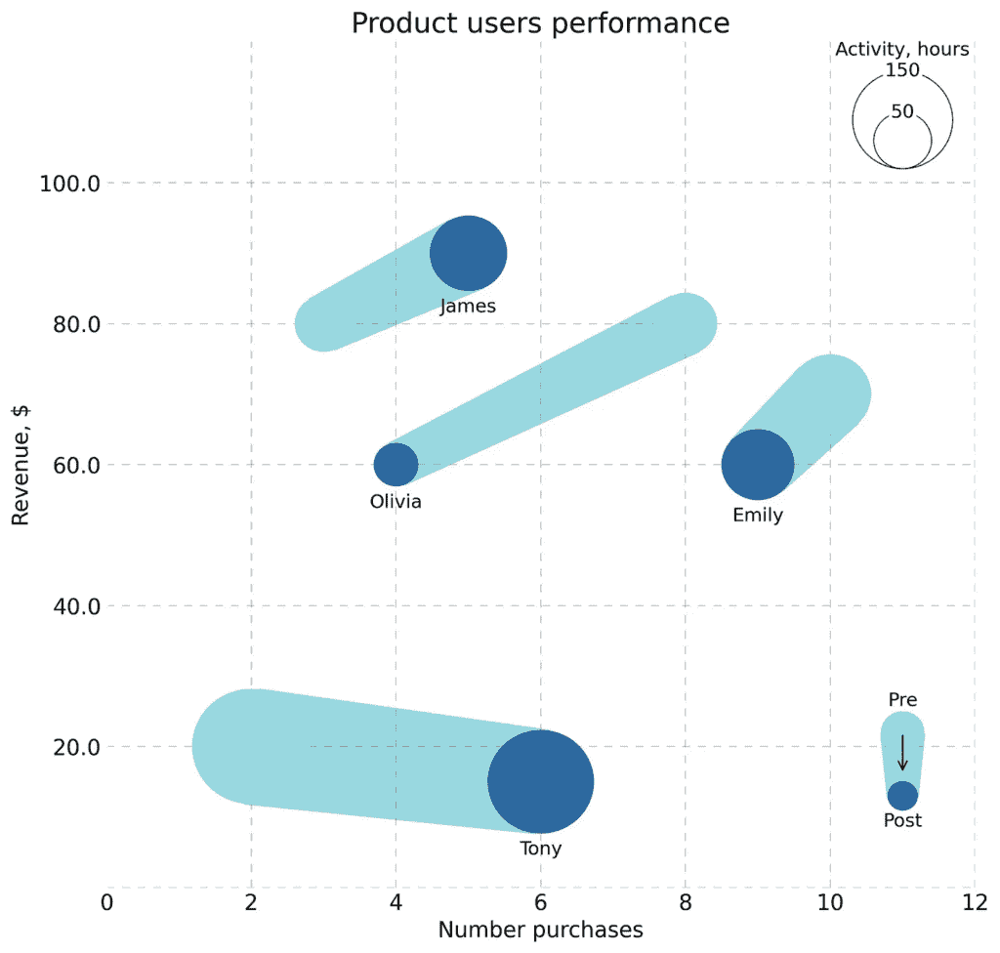

# 四维数据可视化：气泡图中的时间

> 原文：[`towardsdatascience.com/4-dimensional-data-visualization-time-in-bubble-charts/`](https://towardsdatascience.com/4-dimensional-data-visualization-time-in-bubble-charts/)

气泡图优雅地将大量信息压缩到单个可视化中，气泡大小增加了第三个维度。然而，比较“之前”和“之后”的状态通常至关重要。为了解决这个问题，我们提出在这些状态之间添加一个过渡，以创造直观的用户体验。

由于我们找不到现成的解决方案，我们开发了我们的解决方案。挑战证明是迷人的，需要刷新一些数学概念。

毫无疑问，可视化中最具挑战性的部分是两个圆之间的过渡——“之前”和“之后”的状态。为了简化，我们专注于解决一个单一案例，然后可以通过循环扩展来生成所需数量的过渡。



基础元素，图片由作者提供

要构建这样的图形，让我们首先将其分解为三个部分：两个圆以及连接它们的（灰色）多边形。


基础元素分解，图片由作者提供

构建两个圆相当简单——我们知道它们的中心和半径。剩下的任务是构造一个四边形多边形，其形式如下：


多边形，图片由作者提供

构造这个多边形归结为找到其顶点的坐标。这是最有趣的任务，我们将进一步解决它。



从多边形到切线，图片由作者提供

要计算点 *(x1, y1)* 到直线 *ax+y+b=0* 的距离，公式是：


点到直线的距离，图片由作者提供

在我们的情况下，距离 (*d*) 等于圆的半径 (*r*)。因此，


到半径的距离，图片由作者提供

将方程的两边乘以 *a**2+1*，我们得到：


基础数学，图片由作者提供

将所有内容移到一边并将方程设为零，我们得到：


基础数学，图片由作者提供

由于我们有两个圆并且需要找到两个圆的切线，所以我们有以下方程组：


方程组，图片由作者提供

这效果很好，但问题是现实中我们有 4 条可能的切线：



所有可能的切线，图片由作者提供

我们只需要选择其中的两个——外部的。

要做到这一点，我们需要检查每个切线和每个圆心，并确定该线是在点上方还是下方：



检查线是否在点上方或下方，图片由作者提供

我们需要两条都通过圆心上方或都通过圆心下方的线。

现在，让我们将这些步骤转换为代码：

```py
import matplotlib.pyplot as plt
import numpy as np
import pandas as pd
import sympy as sp
from scipy.spatial import ConvexHull
import math
from matplotlib import rcParams
import matplotlib.patches as patches

def check_position_relative_to_line(a, b, x0, y0):
    y_line = a * x0 + b

    if y0 > y_line:
        return 1 # line is above the point
    elif y0 < y_line:
        return -1

def find_tangent_equations(x1, y1, r1, x2, y2, r2):
    a, b = sp.symbols('a b')

    tangent_1 = (a*x1 + b - y1)**2 - r1**2 * (a**2 + 1)  
    tangent_2 = (a*x2 + b - y2)**2 - r2**2 * (a**2 + 1) 

    eqs_1 = [tangent_2, tangent_1]
    solution = sp.solve(eqs_1, (a, b))
    parameters = [(float(e[0]), float(e[1])) for e in solution]

    # filter just external tangents
    parameters_filtered = []
    for tangent in parameters:
        a = tangent[0]
        b = tangent[1]
        if abs(check_position_relative_to_line(a, b, x1, y1) + check_position_relative_to_line(a, b, x2, y2)) == 2:
            parameters_filtered.append(tangent)

    return parameters_filtered
```

现在，我们只需要找到切线与圆的交点。这 4 个点将是所需多边形的顶点。

圆的方程：


圆的方程，图片由作者提供

将直线方程*y=ax+b*代入圆的方程：


基础数学，图片由作者提供

方程的解是交点的*x*。

然后，根据直线方程计算*y*：


计算 y，图片由作者提供

这如何转换为代码：

```py
def find_circle_line_intersection(circle_x, circle_y, circle_r, line_a, line_b):
    x, y = sp.symbols('x y')
    circle_eq = (x - circle_x)**2 + (y - circle_y)**2 - circle_r**2
    intersection_eq = circle_eq.subs(y, line_a * x + line_b)

    sol_x_raw = sp.solve(intersection_eq, x)[0]
    try:
        sol_x = float(sol_x_raw)
    except:
        sol_x = sol_x_raw.as_real_imag()[0]
    sol_y = line_a * sol_x + line_b
    return sol_x, sol_y
```

现在我们想要生成示例数据来展示整个图表的组成。

想象我们有 4 个用户在我们的平台上。我们知道他们各自做了多少次购买，产生了多少收入，以及平台上的活动。所有这些指标都计算了两个时期（让我们称它们为前和后时期）。

```py
# data generation
df = pd.DataFrame({'user': ['Emily', 'Emily', 'James', 'James', 'Tony', 'Tony', 'Olivia', 'Olivia'],
                   'period': ['pre', 'post', 'pre', 'post', 'pre', 'post', 'pre', 'post'],
                   'num_purchases': [10, 9, 3, 5, 2, 4, 8, 7],
                   'revenue': [70, 60, 80, 90, 20, 15, 80, 76],
                   'activity': [100, 80, 50, 90, 210, 170, 60, 55]})
```



数据样本，图片由作者提供

假设“活动”是气泡的面积。现在，让我们将其转换为气泡的半径。我们还将调整 y 轴的比例。

```py
def area_to_radius(area):
    radius = math.sqrt(area / math.pi)
    return radius

x_alias, y_alias, a_alias = 'num_purchases', 'revenue', 'activity'

# scaling metrics
radius_scaler = 0.1
df['radius'] = df[a_alias].apply(area_to_radius) * radius_scaler
df['y_scaled'] = df[y_alias] / df[x_alias].max()
```

现在我们来构建图表——两个圆和多边形。

```py
def draw_polygon(plt, points):
    hull = ConvexHull(points)
    convex_points = [points[i] for i in hull.vertices]

    x, y = zip(*convex_points)
    x += (x[0],)
    y += (y[0],)

    plt.fill(x, y, color='#99d8e1', alpha=1, zorder=1)

# bubble pre
for _, row in df[df.period=='pre'].iterrows():
    x = row[x_alias]
    y = row.y_scaled
    r = row.radius
    circle = patches.Circle((x, y), r, facecolor='#99d8e1', edgecolor='none', linewidth=0, zorder=2)
    plt.gca().add_patch(circle)

# transition area
for user in df.user.unique():
    user_pre = df[(df.user==user) & (df.period=='pre')]
    x1, y1, r1 = user_pre[x_alias].values[0], user_pre.y_scaled.values[0], user_pre.radius.values[0]
    user_post = df[(df.user==user) & (df.period=='post')]
    x2, y2, r2 = user_post[x_alias].values[0], user_post.y_scaled.values[0], user_post.radius.values[0]

    tangent_equations = find_tangent_equations(x1, y1, r1, x2, y2, r2)
    circle_1_line_intersections = [find_circle_line_intersection(x1, y1, r1, eq[0], eq[1]) for eq in tangent_equations]
    circle_2_line_intersections = [find_circle_line_intersection(x2, y2, r2, eq[0], eq[1]) for eq in tangent_equations]

    polygon_points = circle_1_line_intersections + circle_2_line_intersections
    draw_polygon(plt, polygon_points)

# bubble post
for _, row in df[df.period=='post'].iterrows():
    x = row[x_alias]
    y = row.y_scaled
    r = row.radius
    label = row.user
    circle = patches.Circle((x, y), r, facecolor='#2d699f', edgecolor='none', linewidth=0, zorder=2)
    plt.gca().add_patch(circle)

    plt.text(x, y - r - 0.3, label, fontsize=12, ha='center')
```

输出看起来符合预期：



输出，图片由作者提供

现在我们想要添加一些样式：

```py
# plot parameters
plt.subplots(figsize=(10, 10))
rcParams['font.family'] = 'DejaVu Sans'
rcParams['font.size'] = 14
plt.grid(color="gray", linestyle=(0, (10, 10)), linewidth=0.5, alpha=0.6, zorder=1)
plt.axvline(x=0, color='white', linewidth=2)
plt.gca().set_facecolor('white')
plt.gcf().set_facecolor('white')

# spines formatting
plt.gca().spines["top"].set_visible(False)
plt.gca().spines["right"].set_visible(False)
plt.gca().spines["bottom"].set_visible(False)
plt.gca().spines["left"].set_visible(False)
plt.gca().tick_params(axis="both", which="both", length=0)

# plot labels
plt.xlabel("Number purchases") 
plt.ylabel("Revenue, $")
plt.title("Product users performance", fontsize=18, color="black")

# axis limits
axis_lim = df[x_alias].max() * 1.2
plt.xlim(0, axis_lim)
plt.ylim(0, axis_lim)
```

在右下角添加前后图例，为观众提供如何阅读图表的提示：

```py
## pre-post legend 
# circle 1
legend_position, r1 = (11, 2.2), 0.3
x1, y1 = legend_position[0], legend_position[1]
circle = patches.Circle((x1, y1), r1, facecolor='#99d8e1', edgecolor='none', linewidth=0, zorder=2)
plt.gca().add_patch(circle)
plt.text(x1, y1 + r1 + 0.15, 'Pre', fontsize=12, ha='center', va='center')
# circle 2
x2, y2 = legend_position[0], legend_position[1] - r1*3
r2 = r1*0.7
circle = patches.Circle((x2, y2), r2, facecolor='#2d699f', edgecolor='none', linewidth=0, zorder=2)
plt.gca().add_patch(circle)
plt.text(x2, y2 - r2 - 0.15, 'Post', fontsize=12, ha='center', va='center')
# tangents
tangent_equations = find_tangent_equations(x1, y1, r1, x2, y2, r2)
circle_1_line_intersections = [find_circle_line_intersection(x1, y1, r1, eq[0], eq[1]) for eq in tangent_equations]
circle_2_line_intersections = [find_circle_line_intersection(x2, y2, r2, eq[0], eq[1]) for eq in tangent_equations]
polygon_points = circle_1_line_intersections + circle_2_line_intersections
draw_polygon(plt, polygon_points)
# small arrow
plt.annotate('', xytext=(x1, y1), xy=(x2, y1 - r1*2), arrowprops=dict(edgecolor='black', arrowstyle='->', lw=1))
```



添加样式和图例，图片由作者提供

最后，添加气泡大小图例：

```py
# bubble size legend
legend_areas_original = [150, 50]
legend_position = (11, 10.2)
for i in legend_areas_original:
    i_r = area_to_radius(i) * radius_scaler
    circle = plt.Circle((legend_position[0], legend_position[1] + i_r), i_r, color='black', fill=False, linewidth=0.6, facecolor='none')
    plt.gca().add_patch(circle)
    plt.text(legend_position[0], legend_position[1] + 2*i_r, str(i), fontsize=12, ha='center', va='center',
              bbox=dict(facecolor='white', edgecolor='none', boxstyle='round,pad=0.1'))
legend_label_r = area_to_radius(np.max(legend_areas_original)) * radius_scaler
plt.text(legend_position[0], legend_position[1] + 2*legend_label_r + 0.3, 'Activity, hours', fontsize=12, ha='center', va='center')
```

我们的最终图表看起来是这样的：



添加第二个图例，图片由作者提供

可视化看起来非常时尚，并在紧凑的格式中集中了大量的信息。

这是图表的完整代码：

```py
import matplotlib.pyplot as plt
import numpy as np
import pandas as pd
import sympy as sp
from scipy.spatial import ConvexHull
import math
from matplotlib import rcParams
import matplotlib.patches as patches

def check_position_relative_to_line(a, b, x0, y0):
    y_line = a * x0 + b

    if y0 > y_line:
        return 1 # line is above the point
    elif y0 < y_line:
        return -1

def find_tangent_equations(x1, y1, r1, x2, y2, r2):
    a, b = sp.symbols('a b')

    tangent_1 = (a*x1 + b - y1)**2 - r1**2 * (a**2 + 1)  
    tangent_2 = (a*x2 + b - y2)**2 - r2**2 * (a**2 + 1) 

    eqs_1 = [tangent_2, tangent_1]
    solution = sp.solve(eqs_1, (a, b))
    parameters = [(float(e[0]), float(e[1])) for e in solution]

    # filter just external tangents
    parameters_filtered = []
    for tangent in parameters:
        a = tangent[0]
        b = tangent[1]
        if abs(check_position_relative_to_line(a, b, x1, y1) + check_position_relative_to_line(a, b, x2, y2)) == 2:
            parameters_filtered.append(tangent)

    return parameters_filtered

def find_circle_line_intersection(circle_x, circle_y, circle_r, line_a, line_b):
    x, y = sp.symbols('x y')
    circle_eq = (x - circle_x)**2 + (y - circle_y)**2 - circle_r**2
    intersection_eq = circle_eq.subs(y, line_a * x + line_b)

    sol_x_raw = sp.solve(intersection_eq, x)[0]
    try:
        sol_x = float(sol_x_raw)
    except:
        sol_x = sol_x_raw.as_real_imag()[0]
    sol_y = line_a * sol_x + line_b
    return sol_x, sol_y

def draw_polygon(plt, points):
    hull = ConvexHull(points)
    convex_points = [points[i] for i in hull.vertices]

    x, y = zip(*convex_points)
    x += (x[0],)
    y += (y[0],)

    plt.fill(x, y, color='#99d8e1', alpha=1, zorder=1)

def area_to_radius(area):
    radius = math.sqrt(area / math.pi)
    return radius

# data generation
df = pd.DataFrame({'user': ['Emily', 'Emily', 'James', 'James', 'Tony', 'Tony', 'Olivia', 'Olivia', 'Oliver', 'Oliver', 'Benjamin', 'Benjamin'],
                   'period': ['pre', 'post', 'pre', 'post', 'pre', 'post', 'pre', 'post', 'pre', 'post', 'pre', 'post'],
                   'num_purchases': [10, 9, 3, 5, 2, 4, 8, 7, 6, 7, 4, 6],
                   'revenue': [70, 60, 80, 90, 20, 15, 80, 76, 17, 19, 45, 55],
                   'activity': [100, 80, 50, 90, 210, 170, 60, 55, 30, 20, 200, 120]})

x_alias, y_alias, a_alias = 'num_purchases', 'revenue', 'activity'

# scaling metrics
radius_scaler = 0.1
df['radius'] = df[a_alias].apply(area_to_radius) * radius_scaler
df['y_scaled'] = df[y_alias] / df[x_alias].max()

# plot parameters
plt.subplots(figsize=(10, 10))
rcParams['font.family'] = 'DejaVu Sans'
rcParams['font.size'] = 14
plt.grid(color="gray", linestyle=(0, (10, 10)), linewidth=0.5, alpha=0.6, zorder=1)
plt.axvline(x=0, color='white', linewidth=2)
plt.gca().set_facecolor('white')
plt.gcf().set_facecolor('white')

# spines formatting
plt.gca().spines["top"].set_visible(False)
plt.gca().spines["right"].set_visible(False)
plt.gca().spines["bottom"].set_visible(False)
plt.gca().spines["left"].set_visible(False)
plt.gca().tick_params(axis="both", which="both", length=0)

# plot labels
plt.xlabel("Number purchases") 
plt.ylabel("Revenue, $")
plt.title("Product users performance", fontsize=18, color="black")

# axis limits
axis_lim = df[x_alias].max() * 1.2
plt.xlim(0, axis_lim)
plt.ylim(0, axis_lim)

# bubble pre
for _, row in df[df.period=='pre'].iterrows():
    x = row[x_alias]
    y = row.y_scaled
    r = row.radius
    circle = patches.Circle((x, y), r, facecolor='#99d8e1', edgecolor='none', linewidth=0, zorder=2)
    plt.gca().add_patch(circle)

# transition area
for user in df.user.unique():
    user_pre = df[(df.user==user) & (df.period=='pre')]
    x1, y1, r1 = user_pre[x_alias].values[0], user_pre.y_scaled.values[0], user_pre.radius.values[0]
    user_post = df[(df.user==user) & (df.period=='post')]
    x2, y2, r2 = user_post[x_alias].values[0], user_post.y_scaled.values[0], user_post.radius.values[0]

    tangent_equations = find_tangent_equations(x1, y1, r1, x2, y2, r2)
    circle_1_line_intersections = [find_circle_line_intersection(x1, y1, r1, eq[0], eq[1]) for eq in tangent_equations]
    circle_2_line_intersections = [find_circle_line_intersection(x2, y2, r2, eq[0], eq[1]) for eq in tangent_equations]

    polygon_points = circle_1_line_intersections + circle_2_line_intersections
    draw_polygon(plt, polygon_points)

# bubble post
for _, row in df[df.period=='post'].iterrows():
    x = row[x_alias]
    y = row.y_scaled
    r = row.radius
    label = row.user
    circle = patches.Circle((x, y), r, facecolor='#2d699f', edgecolor='none', linewidth=0, zorder=2)
    plt.gca().add_patch(circle)

    plt.text(x, y - r - 0.3, label, fontsize=12, ha='center')

# bubble size legend
legend_areas_original = [150, 50]
legend_position = (11, 10.2)
for i in legend_areas_original:
    i_r = area_to_radius(i) * radius_scaler
    circle = plt.Circle((legend_position[0], legend_position[1] + i_r), i_r, color='black', fill=False, linewidth=0.6, facecolor='none')
    plt.gca().add_patch(circle)
    plt.text(legend_position[0], legend_position[1] + 2*i_r, str(i), fontsize=12, ha='center', va='center',
              bbox=dict(facecolor='white', edgecolor='none', boxstyle='round,pad=0.1'))
legend_label_r = area_to_radius(np.max(legend_areas_original)) * radius_scaler
plt.text(legend_position[0], legend_position[1] + 2*legend_label_r + 0.3, 'Activity, hours', fontsize=12, ha='center', va='center')

## pre-post legend 
# circle 1
legend_position, r1 = (11, 2.2), 0.3
x1, y1 = legend_position[0], legend_position[1]
circle = patches.Circle((x1, y1), r1, facecolor='#99d8e1', edgecolor='none', linewidth=0, zorder=2)
plt.gca().add_patch(circle)
plt.text(x1, y1 + r1 + 0.15, 'Pre', fontsize=12, ha='center', va='center')
# circle 2
x2, y2 = legend_position[0], legend_position[1] - r1*3
r2 = r1*0.7
circle = patches.Circle((x2, y2), r2, facecolor='#2d699f', edgecolor='none', linewidth=0, zorder=2)
plt.gca().add_patch(circle)
plt.text(x2, y2 - r2 - 0.15, 'Post', fontsize=12, ha='center', va='center')
# tangents
tangent_equations = find_tangent_equations(x1, y1, r1, x2, y2, r2)
circle_1_line_intersections = [find_circle_line_intersection(x1, y1, r1, eq[0], eq[1]) for eq in tangent_equations]
circle_2_line_intersections = [find_circle_line_intersection(x2, y2, r2, eq[0], eq[1]) for eq in tangent_equations]
polygon_points = circle_1_line_intersections + circle_2_line_intersections
draw_polygon(plt, polygon_points)
# small arrow
plt.annotate('', xytext=(x1, y1), xy=(x2, y1 - r1*2), arrowprops=dict(edgecolor='black', arrowstyle='->', lw=1))

# y axis formatting
max_y = df[y_alias].max()
nearest_power_of_10 = 10 ** math.ceil(math.log10(max_y))
ticks = [round(nearest_power_of_10/5 * i, 2) for i in range(0, 6)]
yticks_scaled = ticks / df[x_alias].max()
yticklabels = [str(i) for i in ticks]
yticklabels[0] = ''
plt.yticks(yticks_scaled, yticklabels)

plt.savefig("plot_with_white_background.png", bbox_inches='tight', dpi=300)
```

向气泡图添加时间维度可以增强其直观传达动态数据变化的能力。通过实现“之前”和“之后”状态之间的平滑过渡，用户可以更好地理解趋势和时间上的比较。

虽然没有现成的解决方案，但开发定制方法既具有挑战性又富有成效，需要数学洞察力和细致的动画技术。提出的方法可以轻松扩展到各种数据集，使其成为商业、科学和数据分析中数据可视化的宝贵工具。
