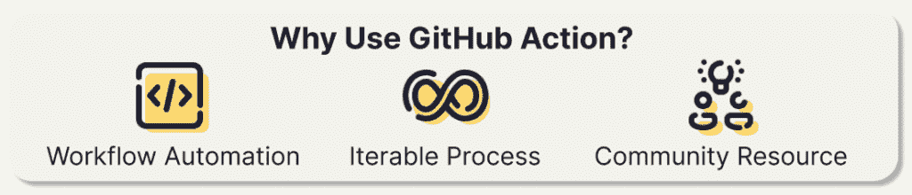
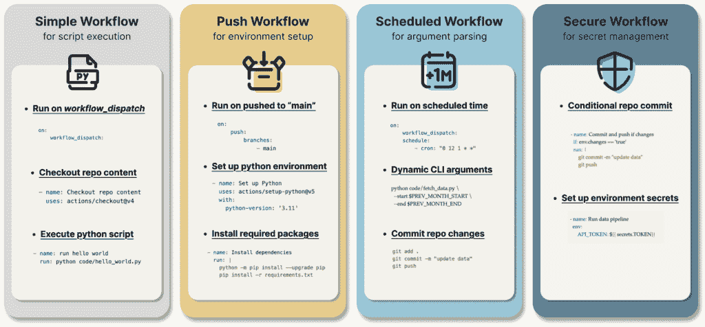

# GitHub Actions 四级：数据工作流程自动化的指南

> 原文：[`towardsdatascience.com/4-levels-of-github-actions-a-guide-to-data-workflow-automation/`](https://towardsdatascience.com/4-levels-of-github-actions-a-guide-to-data-workflow-automation/)

<mdspan datatext="el1743553829492" class="mdspan-comment">自动化</mdspan>已成为确保现代软件开发中操作效率和可靠性的不可或缺元素。GitHub Actions，作为 GitHub 内集成的持续集成和持续部署（CI/CD）工具，通过提供一个全面自动化开发和部署工作流程的平台，在软件开发行业中确立了其地位。然而，其功能远不止于此……我们将深入探讨 GitHub Actions 在数据领域的应用，展示它如何通过自动化从外部来源检索数据和数据转换操作来简化开发者和数据专业人士的流程。

## GitHub Action 优势



GitHub Actions 在软件开发领域的功能已经广为人知，而在近年来，也被发现为在简化数据工作流程方面提供了有吸引力的好处：

+   自动化数据科学环境设置，例如安装依赖项和所需软件包（例如 pandas、PyTorch）。

+   通过连接到数据库以获取或更新记录，并使用如 Python 这样的脚本语言进行预处理或转换原始数据，简化数据集成和数据转换步骤。

+   通过在数据可用时自动训练机器学习模型，并在训练成功后自动将模型部署到生产环境，创建一个可迭代的科学数据生命周期。

+   GitHub Actions 在 GitHub 托管的运行器上对公共仓库免费使用，对于使用私有仓库的个人账户，每月还提供 2,000 分钟的免费计算时间。只需一个 GitHub 账户，就可以轻松设置构建概念验证，无需担心选择云服务提供商。

+   在线有大量的 GitHub Actions 模板和社区资源。此外，社区和众包论坛提供对常见问题的答案和故障排除支持。

## GitHub Action 构建块


GitHub Action 是 GitHub 的一个功能，允许用户直接在他们的仓库中自动化工作流程。这些工作流程使用 YAML 文件定义，可以通过各种事件触发，例如代码推送、拉取请求、问题创建或计划间隔。凭借其丰富的预构建动作库和编写自定义脚本的能力，GitHub Actions 是自动化任务的通用工具。

+   **事件**：如果你在设备上使用过自动化，比如晚上 8 点后开启暗黑模式，那么你对使用触发点或条件来启动动作工作流程的概念应该很熟悉。在 GitHub Actions 中，这被称为事件，可以是基于时间的，例如在每月的第一天安排或每小时自动运行。或者，事件可以由某些行为触发，例如每次从本地存储库向远程存储库推送更改时。

+   **工作流程**：工作流程由一系列作业组成，GitHub 允许根据你的需求自定义作业中的每个单独步骤。它通常由存储在 GitHub 仓库 `.github/workflow` 目录中的 YAML 文件定义。

+   **运行者**：一个托管环境，允许运行工作流程。现在，你可以在你的笔记本电脑上运行脚本，或者借用 GitHub 托管运行者为你完成工作，或者指定一个自托管机器。

+   **运行**：每次运行工作流程都会创建一个运行实例，我们可以在“操作”标签中查看每个运行的日志。GitHub 为用户提供了一个界面，可以轻松地可视化和监控操作运行日志。

* * *

## 4 个级别的 GitHub Actions

我们将通过 4 个难度级别来演示 GitHub Actions 的实现，从“最小可行产品”开始，并在每个级别逐步引入额外的组件和定制。



### 1. 使用 Python 脚本执行的“简单工作流程”

首先，创建一个 GitHub 存储库，用于存储你的工作流程和 Python 脚本。在你的存储库中，创建一个 `.github/workflows` 目录（请注意，此目录必须放置在 `workflows` 文件夹内，以便操作可以成功执行）。在此目录内，创建一个 YAML 文件（例如，`simple-workflow.yaml`），该文件定义了你的工作流程。

下面的示例显示了一个工作流程文件，该文件基于手动触发执行 Python 脚本 `hello_world.py`。

```py
name: simple-workflow

on: 
    workflow_dispatch:

jobs:
    run-hello-world:
      runs-on: ubuntu-latest
      steps:
          - name: Checkout repo content
            uses: actions/checkout@v4
          - name: run hello world
            run: python code/hello_world.py
```

它由三个部分组成：首先，`name: simple-workflow` 定义了工作流程的名称。其次，`on: workflow_dispatch` 指定了运行工作流程的条件，即手动触发每个动作。最后，工作流程作业 `jobs: run-hello-world` 分解为以下步骤：

+   `runs-on: ubuntu-latest`: 指定运行工作流程的运行者（即虚拟机）——`ubuntu-latest` 是一个标准的 GitHub 托管运行者，包含 GitHub Actions 可用的工具、包和设置的环境。

+   `uses: actions/checkout@v4`: 应用预构建的 GitHub Action `checkout@v4` 将存储库内容拉取到运行环境。这确保了工作流程可以访问存储库中存储的所有必要文件和脚本。

+   `run: python code/hello_world.py`: 通过在 YAML 工作流文件中直接运行 shell 命令来执行位于 `code` 子目录中的 Python 脚本。

### 2. 带有环境设置的“Push Workflow”

第一个工作流程展示了 GitHub Action 的最小可行版本，但它并没有充分利用 GitHub Action 的功能。在第二级，我们将添加更多定制和功能——自动设置 Python 3.11 版本的环境，安装所需的包，并在将更改推送到主分支时执行脚本。

```py
name: push-workflow

on: 
    push:
        branches:
            - main

jobs:
    run-hello-world:
      runs-on: ubuntu-latest
      steps:
          - name: Checkout repo content
            uses: actions/checkout@v4
          - name: Set up Python
            uses: actions/setup-python@v5
            with:
              python-version: '3.11' 
          - name: Install dependencies
            run: |
              python -m pip install --upgrade pip
              pip install -r requirements.txt
          - name: Run hello world
            run: python code/hello_world.py
```

+   `on: push`: 与手动工作流调度激活不同，这允许动作在本地仓库向远程仓库推送时运行。这种条件通常用于软件开发环境中的集成和部署过程，也被应用于 MLOps 工作流中，确保代码更改在合并到其他分支之前得到一致测试和验证。此外，它通过在更改推送后自动部署更新到生产或预发布环境，促进了持续部署。在这里，我们添加了一个可选条件 `branches: -main`，以确保只有当它被推送到主分支时才触发此动作。

+   `uses: actions/setup-python@v5`: 我们使用了 GitHub 内置的动作 `setup-python@v5` 来添加“设置 Python”步骤。使用 `setup-python` 动作是使用 GitHub Action 与 Python 的推荐方式，因为它确保了在不同运行器和 Python 版本之间的一致行为。

+   `pip install -r requirements.txt`: 通过将存储在 `requirements.txt` 文件中的所需包的安装流程简化，从而加速数据管道和数据科学解决方案的进一步构建。

如果您对为数据科学项目设置开发环境的基本知识感兴趣，我的上一篇博客文章“**[7 Tips to Future-Proof Machine Learning Projects](https://towardsdatascience.com/7-tips-to-future-proof-machine-learning-projects-582397875edc/)**”提供了更多解释。

### 3. 带有参数解析的“Scheduled Workflow”

在第三级，我们添加更多动态和复杂性，使其更适合实际应用。我们引入了计划任务，因为它们为数据科学项目带来了更多好处，使得能够定期获取更近期的数据，并减少在需要数据刷新时手动运行脚本的需求。此外，我们利用动态参数解析根据计划执行脚本，根据不同的日期范围参数执行。

```py
name: scheduled-workflow

on: 
    workflow_dispatch:
    schedule:
        - cron: "0 12 1 * *" # run 1st day of every month

jobs:
    run-data-pipeline:
        runs-on: ubuntu-latest
        steps:
            - name: Checkout repo content
              uses: actions/checkout@v4
            - name: Set up Python
              uses: actions/setup-python@v5
              with:
                python-version: '3.11'  # Specify your Python version here
            - name: Install dependencies
              run: |
                python -m pip install --upgrade pip
                python -m http.client
                pip install -r requirements.txt
            - name: Run data pipeline
              run: |
                  PREV_MONTH_START=$(date -d "`date +%Y%m01` -1 month" +%Y-%m-%d)
                  PREV_MONTH_END=$(date -d "`date +%Y%m01` -1 day" +%Y-%m-%d)
                  python code/fetch_data.py --start $PREV_MONTH_START --end $PREV_MONTH_END
            - name: Commit changes
              run: |
                  git config user.name '<github-actions>'
                  git config user.email '<[[email protected]](/cdn-cgi/l/email-protection)>'
                  git add .
                  git commit -m "update data"
                  git push
```

+   `on: schedule: - cron: "0 12 1 * *"`: 使用 cron 表达式“0 12 1 * *”指定基于时间的触发器——在每月的第一天的中午 12:00 运行。您可以使用 [crontab.guru](https://crontab.guru/) 帮助创建和验证 cron 表达式，其格式为：“分钟/小时/月份中的日期/月份/星期几”。

+   `python code/fetch_data.py --start $PREV_MONTH_START --end $PREV_MONTH_END`：“运行数据管道”步骤运行一系列 shell 命令。它定义了两个变量 `PREV_MONTH_START` 和 `PREV_MONTH_END` 来获取上个月的第一天和最后一天。这两个变量传递给 Python 脚本“fetch_data.py”，以动态获取相对于操作运行时的上个月数据。为了允许 Python 脚本通过命令行参数接受自定义变量，我们使用 `argparse` 库构建脚本。这值得单独讨论，但在这里快速预览一下使用 `argparse` 库处理命令行参数“–start”和“–end”参数的 Python 脚本的外观。

```py
## fetch_data.py

import argparse
import os
import urllib

def main(args=None):
	  parser = argparse.ArgumentParser()
	  parser.add_argument('--start', type=str)
	  parser.add_argument('--end', type=str)
	  args = parser.parse_args(args=args)
	  print("Start Date is: ", args.start)
	  print("End Date is: ", args.end)

	  date_range = pd.date_range(start=args.start, end=args.end)
	  content_lst = []

	  for date in date_range:
	      date = date.strftime('%Y-%m-%d')

		  params = urllib.parse.urlencode({
	          'api_token': '<NEWS_API_TOKEN>',
	          'published_on': date,
	          'search': search_term,
	      })
		  url = '/v1/news/all?{}'.format(params)

		  content_json = parse_news_json(url, date)
		  content_lst.append(content_json)

	  with open('data.jsonl', 'w') as f:
	      for item in content_lst:
	          json.dump(item, f)
	          f.write('\n')

      return content_lst
```

当命令 `python code/fetch_data.py --start $PREV_MONTH_START --end $PREV_MONTH_END` 执行时，它会在 `$PREV_MONTH_START` 和 `$PREV_MONTH_END` 之间创建一个日期范围。对于日期范围内的每一天，它生成一个 URL，通过 API 获取每日新闻，解析 JSON 响应，并将所有内容收集到一个 JSON 列表中。然后我们将此 JSON 列表输出到文件“data.jsonl”中。

```py
- name: Commit changes
  run: |
      git config user.name '<github-actions>'
      git config user.email '<[[email protected]](/cdn-cgi/l/email-protection)>'
      git add .
      git commit -m "update data"
      git push
```

如上所示，最后一步“提交更改”提交了更改，配置了 git 用户电子邮件和姓名，暂存了更改，提交了它们，并推送到远程 GitHub 仓库。当运行导致工作目录发生更改的 GitHub Actions（例如，创建输出文件“data.jsonl”）时，这是一个必要的步骤。否则，输出仅保存在运行环境内的 `/temp` 文件夹中，看起来就像在操作完成后没有进行任何更改。

### 4. “安全工作流程”与密钥和环境变量管理

最后一级别专注于通过解决非功能性需求来提高 GitHub 工作流程的安全性和性能。

```py
name: secure-workflow

on: 
    workflow_dispatch:
    schedule:
        - cron: "34 23 1 * *" # run 1st day of every month

jobs:
    run-data-pipeline:
        runs-on: ubuntu-latest
        steps:
            - name: Checkout repo content
              uses: actions/checkout@v4
            - name: Set up Python
              uses: actions/setup-python@v5
              with:
                python-version: '3.11'  # Specify your Python version here
            - name: Install dependencies
              run: |
                python -m pip install --upgrade pip
                python -m http.client
                pip install -r requirements.txt
            - name: Run data pipeline
              env:
                  NEWS_API_TOKEN: ${{ secrets.NEWS_API_TOKEN }} 
              run: |
                  PREV_MONTH_START=$(date -d "`date +%Y%m01` -1 month" +%Y-%m-%d)
                  PREV_MONTH_END=$(date -d "`date +%Y%m01` -1 day" +%Y-%m-%d)
                  python code/fetch_data.py --start $PREV_MONTH_START --end $PREV_MONTH_END
            - name: Check changes
              id: git-check
              run: |
                  git config user.name 'github-actions'
                  git config user.email '[[email protected]](/cdn-cgi/l/email-protection)'
                  git add .
                  git diff --staged --quiet || echo "changes=true" >> $GITHUB_ENV
            - name: Commit and push if changes
              if: env.changes == 'true'
              run: |
                  git commit -m "update data"
                  git push 
```

为了提高工作流程效率并减少错误，我们在提交更改之前添加了一个检查，确保只有在上次提交之后有实际更改时才进行提交和推送。这是通过命令 `git diff --staged --quiet || echo "changes=true" >> $GITHUB_ENV` 实现的。

+   `git diff --staged` 检查暂存区域和最后提交之间的差异。

+   `--quiet` 抑制输出——当暂存环境和工作目录之间没有更改时返回 0；而当暂存环境和工作目录之间存在更改时返回退出代码 1（一般错误）。

+   此命令通过 OR 运算符 `||` 连接到 `echo "changes=true" >> $GITHUB_ENV`，该运算符告诉 shell 如果第一个命令失败，则运行该行的其余部分。因此，如果存在更改，则“changes=true”传递给环境变量 `$GITHUB_ENV`，并在下一步中访问以触发基于 `env.changes == 'true'` 的 git 提交和推送。

最后，我们引入环境密钥，这增强了安全性并避免了在代码库中暴露敏感信息（例如 API 令牌、个人访问令牌）。此外，环境密钥还提供了分离开发环境的好处。这意味着您可以为开发部署管道的不同阶段拥有不同的密钥。例如，测试环境（例如，在 dev 分支中）只能访问测试令牌，而生产环境（例如，在 main 分支中）将能够访问与生产实例链接的令牌。

在 GitHub 中设置环境密钥：

1.  前往您的仓库设置

1.  导航到“密钥和变量”>“操作”

1.  点击“新建仓库密钥”

1.  添加您的密钥名称和值

在设置 GitHub 环境密钥后，我们需要将密钥添加到工作流程环境中，例如以下示例中我们在“运行数据管道”步骤中添加了`${{ secrets.NEWS_API_TOKEN }}`。

```py
- name: Run data pipeline
  env:
      NEWS_API_TOKEN: ${{ secrets.NEWS_API_TOKEN }} 
  run: |
      PREV_MONTH_START=$(date -d "`date +%Y%m01` -1 month" +%Y-%m-%d)
      PREV_MONTH_END=$(date -d "`date +%Y%m01` -1 day" +%Y-%m-%d)
      python code/fetch_data.py --start $PREV_MONTH_START --end $PREV_MONTH_END
```

然后，我们将 Python 脚本`fetch_data.py`更新为使用`os.environ.get()`访问环境密钥。

```py
import os api_token = os.environ.get('NEWS_API_TOKEN')
```

* * *

## 带回家的信息

本指南探讨了 GitHub Actions 构建动态数据管道的实现，通过四个不同级别的工作流程实现进行推进：

+   第一级：基本工作流程设置，带有手动触发和简单的 Python 脚本执行。

+   第二级：推送工作流程，包括开发环境设置。

+   第三级：具有动态日期处理和数据抓取功能的命令行参数调度工作流程

+   第四级：带有密钥和环境变量管理的安全管道工作流程

每一级都是基于前一级的，展示了 GitHub Actions 如何在数据领域有效利用，以简化数据解决方案并加快开发周期。
