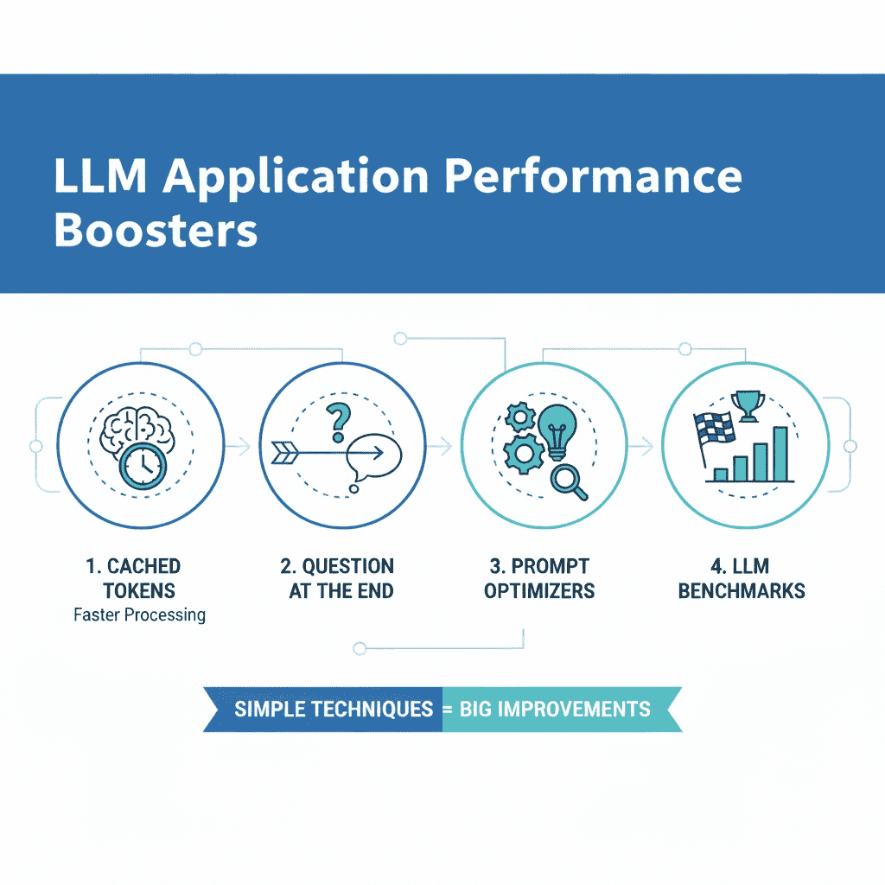

# 4 Techniques to Optimize Your LLM Prompts for Cost, Latency and Performance

> 原文：[`towardsdatascience.com/4-techniques-to-optimize-your-llm-prompts-for-cost-latency-and-performance/`](https://towardsdatascience.com/4-techniques-to-optimize-your-llm-prompts-for-cost-latency-and-performance/)

<mdspan datatext="el1761767594681" class="mdspan-comment">LLMs 能够</mdspan>自动化大量的任务。自从 2022 年 ChatGPT 发布以来，我们看到了市场上越来越多的 AI 产品开始使用 LLMs。然而，在如何使用 LLMs 的方式上，还有很多改进的空间。例如，使用 LLM 提示优化器优化你的提示以及利用缓存令牌是两种你可以利用来极大地提高你 LLM 应用性能的简单技术。

在本文中，我将讨论你可以应用于创建和结构化提示的具体技术，这将减少延迟和成本，并提高你回答的质量。目标是向你展示这些具体技术，以便你可以立即将它们应用到自己的 LLM 应用中。



这张信息图表突出了本文的主要内容。我将讨论四种不同的技术，以极大地提高你的 LLM 应用在成本、延迟和输出质量方面的性能。我将涵盖利用缓存令牌、让用户在最后提问、使用提示优化器以及拥有你自己的定制 LLM 基准。图片由 Gemini 提供。

## 为什么你应该优化你的提示

在很多情况下，你可能有一个与特定 LLM 一起工作并产生足够结果的提示。然而，在许多情况下，你没有花太多时间优化提示，这留下了很多潜在的机会。

我认为，使用我在本文中将要介绍的具体技术，你可以轻松地提高你回答的质量，同时减少成本，而不需要付出太多努力。仅仅因为一个提示和 LLM 在运行，并不意味着它正在以最佳状态运行，而且在很多情况下，你只需付出很少的努力，就能看到很大的改进。

## 优化特定技术

在本节中，我将介绍你可以利用的具体技术来优化你的提示。

### 总是尽早保持静态内容

我将要介绍的第一种技术是在你的提示中尽早保持静态内容。在这里，我指的是当你进行多次 API 调用时保持不变的内容。

你应该尽早保持静态内容的原因是，所有的 LLM 主要提供商，如 Anthropic、Google 和 OpenAI，都使用缓存令牌。缓存令牌是之前 API 请求中已经处理过的令牌，可以以较低的成本和速度处理。这因提供商而异，但缓存输入令牌的价格通常在正常输入令牌的 10%左右。

> 缓存的标记是之前在 API 请求中已处理的标记，并且可以比正常标记**更便宜、更快地处理**

这意味着，如果你连续两次发送相同的提示，第二个提示的输入标记将只花费第一个提示输入标记的 1/10。这是因为 LLM 提供商缓存了这些输入标记的处理，这使得处理你的新请求更便宜、更快。

* * *

在实践中，通过在提示的末尾保持变量来实现输入标记的缓存。

例如，如果你有一个长的系统提示，其中包含的问题随请求而变化，你应该这样做：

```py
prompt = f"""
{long static system prompt}

{user prompt}
"""
```

例如：

```py
prompt = f"""
You are a document expert ...
You should always reply in this format ...
If a user asks about ... you should answer ...

{user question}
"""
```

在此，我们首先放置提示的静态内容，然后在我们将变量内容（用户问题）放在最后之前。

* * *

在某些情况下，你想要输入文档内容。如果你正在处理很多不同的文档，你应该在提示的末尾保留文档内容：

```py
# if processing different documents
prompt = f"""
{static system prompt}
{variable prompt instruction 1}
{document content}
{variable prompt instruction 2}
{user question}
"""
```

然而，如果你正在多次处理相同的文档，你可以确保通过确保在提示之前不放入任何变量来确保文档标记也被缓存：

```py
# if processing the same documents multiple times
prompt = f"""
{static system prompt}
{document content} # keep this before any variable instructions
{variable prompt instruction 1}
{variable prompt instruction 2}
{user question}
"""
```

注意，缓存的标记通常仅在两个请求的前 1024 个标记相同的情况下才会被激活。例如，如果你的上述示例中的静态系统提示短于 1024 个标记，你将无法利用任何缓存的标记。

```py
# do NOT do this
prompt = f"""
{variable content} < --- this removes all usage of cached tokens
{static system prompt}
{document content}
{variable prompt instruction 1}
{variable prompt instruction 2}
{user question}
"""
```

> 你的提示应该始终以最静态的内容开始（与请求变化最少的内容），然后是最动态的内容（与请求变化最多的内容）

1.  如果你有一个没有变量的长系统和用户提示，你应该首先保留它，然后在提示的末尾添加变量

1.  如果你正在从文档中获取文本，例如，并且处理相同的文档两次，你应该

可能是文档内容，或者如果你有一个长的提示 -> 利用缓存

### 问题的结尾

你应该利用的另一种技术来提高 LLM 性能是始终将用户问题放在你的提示的末尾。理想情况下，你组织它，使你的系统提示包含所有一般指令，而用户提示仅由用户问题组成，如下所示：

```py
system_prompt = "<general instructions>"

user_prompt = f"{user_question}"
```

在 Anthropic 的提示工程文档中，包括用户提示的状态可以提高性能高达 30%，特别是如果你使用的是长上下文。在最后包含问题可以使模型更清楚地了解它试图完成的任务，并且在许多情况下会导致更好的结果。

### 使用提示优化器

很多次，当人类编写提示时，它们变得混乱、不一致，包含冗余内容，缺乏结构。因此，你应该始终通过提示优化器来处理你的提示。

你可以使用最简单的提示优化器是提示一个 LLM 来*改进这个提示 {prompt}*，它将为你提供一个更结构化的提示，内容更少冗余，等等。

然而，更好的方法是使用特定的提示优化器，例如你可以在 OpenAI 或 Anthropic 的控制台中找到的优化器。这些优化器是专门针对 LLM 进行提示和创建的，以优化你的提示，并且通常会得到更好的结果。此外，你应该确保包括：

+   关于你试图完成的任务的详细信息

+   提示成功完成的任务示例，以及输入和输出

+   提示失败的任务示例，包括输入和输出

提供这些额外的信息通常会得到更好的结果，你最终会得到一个更好的提示。在许多情况下，你只需花费大约 10-15 分钟，就能得到一个性能更高的提示。这使得使用提示优化器成为提高 LLM 性能最低效力的方法之一。

### 基准 LLM

你使用的 LLM 也会显著影响你的 LLM 应用性能。不同的 LLM 擅长不同的任务，因此你需要尝试在你的特定应用领域使用不同的 LLM。我建议至少设置访问最大的 LLM 提供商，如 Google Gemini、OpenAI 和 Anthropic。设置这一点相当简单，如果你已经设置了凭证，切换 LLM 提供商只需几分钟。此外，你也可以考虑测试开源 LLM，尽管它们通常需要更多的努力。

你现在需要为你要完成的任务设置一个特定的基准，并查看哪个 LLM 表现最好。此外，你应该定期检查模型性能，因为大型 LLM 提供商偶尔会升级他们的模型，而不一定推出新版本。当然，你也应该准备好尝试来自大型 LLM 提供商的任何新模型。

## 结论

在这篇文章中，我介绍了四种你可以利用来提高你的 LLM 应用性能的技术。我讨论了使用缓存令牌、将问题放在提示的末尾、使用提示优化器以及创建特定的 LLM 基准。这些设置和操作相对简单，并且可以带来显著的性能提升。我相信存在许多类似且简单的技术，你应该始终努力寻找它们。这些主题通常在不同的博客文章中描述，其中 Anthropic 是我帮助我提高 LLM 性能最多的博客之一。

**👉 我的免费资源**

**🚀** [使用 LLM 将你的工程能力提升 10 倍（免费 3 天电子邮件课程）](https://www.eivindkjosbakken.com/email-course)

📚 [获取我的免费视觉语言模型电子书](https://eivindkjosbakken.com/ebook)

💻 [我的视觉语言模型网络研讨会](https://www.eivindkjosbakken.com/webinar)

**👉 在社交平台上找到我：**

📩 [订阅我的通讯](https://eivindkjosbakken.com/newsletter)

🧑‍💻 [联系我](https://eivindkjosbakken.com/)

🔗 [领英](https://www.linkedin.com/in/eivind-kjosbakken/)

🐦 [X / Twitter](https://x.com/EivindKjos)

✍️ [Medium](https://oieivind.medium.com/)
