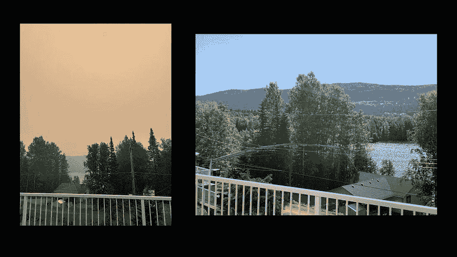
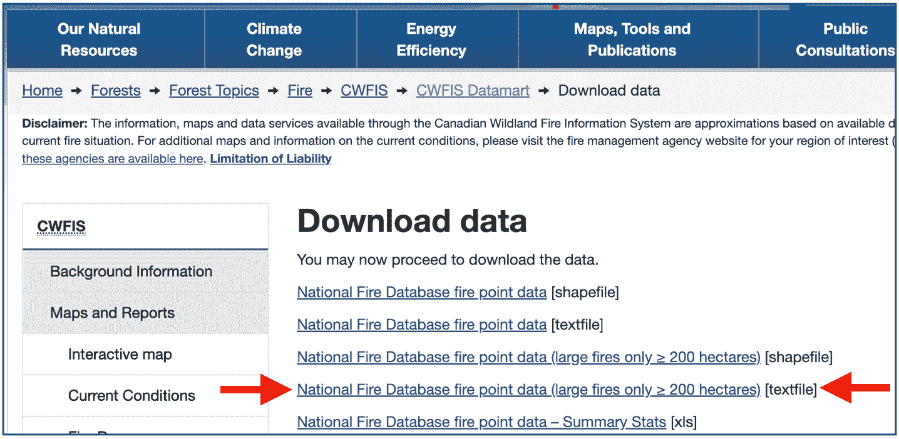
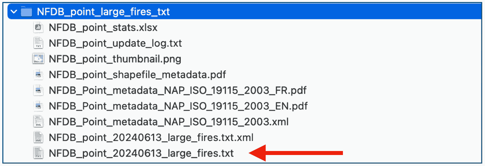
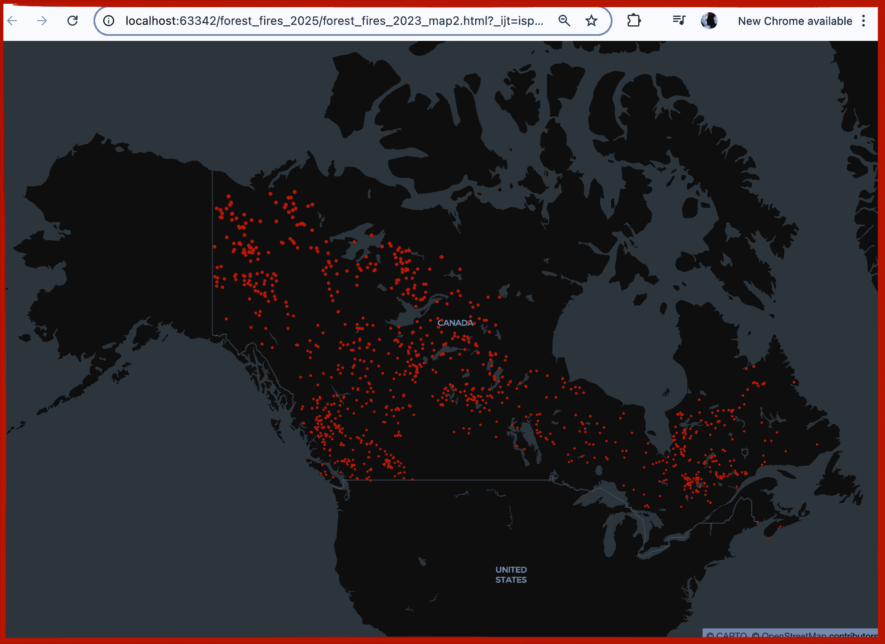
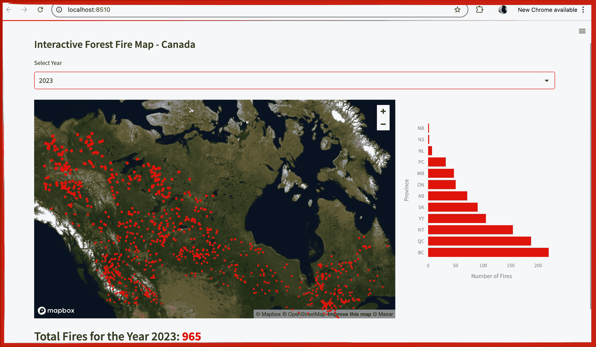
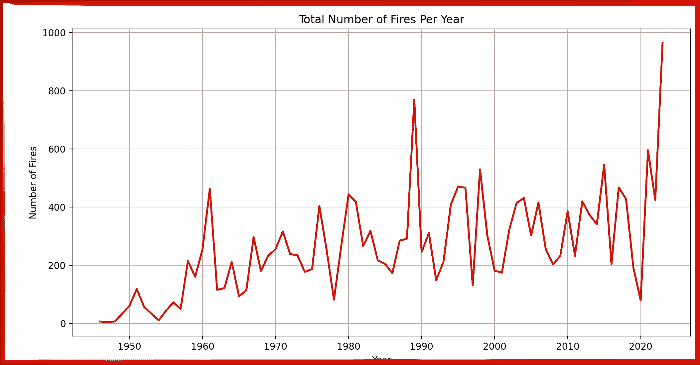

# 使用 Streamlit 和 Python 展示飙升的野火计数：一种强大的方法

> [原文链接](https://towardsdatascience.com/showcasing-soaring-wildfire-counts-with-streamlit-and-python-a-powerful-approach-e759b3da1a77/)


CL-415 在行动（在意大利）。图片由马腾·维斯瑟提供 – [维基共享资源](https://commons.wikimedia.org/w/index.php?curid=76331722)

Python 的 **Streamlit** 在创建来自 GIS 数据集的交互式地图方面非常出色。

允许观众输入的交互式地图可用于更深入的分析和讲故事。

Python 的 **Streamlit** 是这项工作的正确工具。它可以与 **pandas** 一起使用，以便轻松创建和操作数据框。

让我们用一个关于一个非常紧迫的问题——看似野火升级的详细数据集来测试一下。自然资源加拿大网站上有一个非常好的公共野火数据集。

使用这个详细的数据集，让我们采取模块化的数据分析方法，并创建：

+   一个显示一段时间内加拿大所有森林火灾的**静态地图**。

+   一个允许用户选择较短时间段（例如，按年份的下拉菜单）以查看更详细数据的**交互式地图**。

+   一个显示更多细粒度信息的**条形图**，显示了省级层面的火灾数量。

Python 的 **Streamlit** 能为我们做这件事吗？

**让我们试试看！**

## 问题

在过去 10-15 年中，北美地区的森林火灾尤其具有破坏性。最近的加州火灾加剧了公众对这一日益增长的担忧的认识。

对于我们加拿大人来说，我们的最近几个夏天通常是在我们的露台上凝视着烟雾弥漫的雾霾，想知道风是否会转向，使我们的社区陷入危险。



左图为森林火灾烟雾，右图为正常日子（作者摄影）

在对话中经常出现的一个问题是，与过去相比，野火情况变得有多糟糕？

为了更好地回答这个问题，并凭借一个良好的数据集，我们可以创建一系列视觉图表，讲述加拿大（我的家乡）森林火灾随时间变化的数据故事（例如，按年份）。

我们可以创建这些视觉图表，如地图和图表，以分析和了解情况从那时到现在的变化。

## 数据集

为了展示森林火灾的月度影响，我们可以使用数据集创建一系列数据可视化，显示森林火灾随时间的变化。

加拿大自然资源部（加拿大政府的一个部门）在过去 75 年间拥有一个关于野火的非常详细公开数据集。

所有这些加拿大的历史火灾数据都存储在[这里](https://cwfis.cfs.nrcan.gc.ca/datamart/download/nfdbpnt)。

在网站上，我们可以向下滚动以查看和下载：



对于这个教程，我们可以下载包含超过 200 公顷火灾的数据集（作者截图）

下载文件后，我们首先需要解压它。

解压后，我们可以选择名为 _**NFDB_point_20240613_large_fires.txtThe**_ 的文件。



选择大型火灾 CSV 文件。（作者截图）

此文件是一个逗号分隔的文件（CSV）。为了便于使用，我将我的文件重命名为 _**NFDB_large_fires.csv**_。

该数据集中的每条记录代表一次独特的森林火灾，并包含几个关键字段：

+   **YEAR**：火灾发生的年份。

+   **LATITUDE** 和 **LONGITUDE**：火灾的地理坐标。

+   **FIRE_ID**：每个火灾的唯一标识符。

+   **SIZE_HA**：火灾的大小，单位为公顷。

+   **FIRENAME**：火灾的给定名称或最近的地理特征名称。

+   **REP_DATE**：火灾首次报告的日期。

+   **OUT_DATE**：火灾被扑灭的日期（如果有的话）。

+   **CAUSE**：火灾报告的原因（例如，自然原因如闪电或人为活动）。

了解可用的字段现在可以帮助我们提出一些关于数据的问题。

## 我们想要回答的问题

现在我们可以针对该数据集可以回答的问题提出一些问题：

1.  ***加拿大野火发生在哪里？***

1.  ***加拿大每年有多少起火灾？***

1.  ***随着时间的推移，火灾数量是否逐年增加？***

为了热身，让我们先创建一个简单的静态地图，显示加拿大 2023 年的火灾分布。

## 使用 Python 创建静态地图

首先，我们可以使用 Python 创建一个 **静态地图**，具体使用的是 ***pydeck*** 库。

这里的目标是生成一个显示加拿大 2023 年森林火灾的地图，并将其保存为可以在网页浏览器中查看的 HTML 文件。

**注意**：本教程中所有代码和数据文件均可在 Github 上找到：[这里](https://github.com/loewenj700/streamlit_wildfires)

### 1. 加载数据和过滤数据

在这里，我们使用 ***pandas*** 库加载包含历史森林火灾数据的集合：

```py
import pandas as pd
import pydeck as pdk

# Load the forest fire data
fire_data_path = 'NFDB_large_fires.csv'
df_fires = pd.read_csv(fire_data_path)

# Filter data for the year 2023
df_fires_2023 = df_fires[df_fires['YEAR'] == 2023]
```

文件 `NFDB_large_fires.csv` 被读取到名为 `df_fires` 的 DataFrame 中。这个数据集可能包含诸如火灾位置（纬度，经度）、发生年份、火灾 ID 和公顷大小等信息。

由于我们只对可视化 2023 年发生的森林火灾感兴趣，我们过滤 DataFrame 以包括 `YEAR` 列等于 2023 的行。这个过滤后的 DataFrame，`df_fires_2023`，将用于在地图上叠加数据点。

### 2. 定义 PyDeck 层

数字化设计地图需要创建在地图上显示的层。对于这个地图，我们需要为我们的点数据创建一个层。地图上的每场火灾都有一个经度和纬度，定义了地图上火灾的确切位置：

```py
layer = pdk.Layer(
    "ScatterplotLayer",
    data=df_fires_2023,
    get_position='[LONGITUDE, LATITUDE]',
    get_radius=10000,
    get_color=[255, 0, 0],
    pickable=True
)
```

此代码块使用 `pydeck.Layer` 创建了一个 **scatterplot 层**。每场森林火灾在地图上用一个红色圆形标记表示。

+   **`"ScatterplotLayer"`**：指定要渲染的层类型。在这里，我们使用散点图层来显示点。

+   **`data=df_fires_2023`**：过滤后的 DataFrame 作为数据源传递。

+   **`get_position='[LONGITUDE, LATITUDE]'`**：指定每个火灾点的坐标，使用 DataFrame 中的 `LONGITUDE` 和 `LATITUDE` 列。

+   **`get_radius=10000`**：设置每个标记的半径（米）。

+   **`get_color=[255, 0, 0]`**：以 RGB 格式定义标记的颜色。`[255, 0, 0]` 对应红色。

+   **`pickable=True`**：启用与点的交互，允许当用户将鼠标悬停在标记上时显示工具提示或弹出信息。

### 3. 设置地图的视口

我们需要为地图视图的初始加载设置经度和纬度点：

```py
view_state = pdk.ViewState(
    latitude=df_fires_2023['LATITUDE'].mean(),
    longitude=df_fires_2023['LONGITUDE'].mean(),
    zoom=3,
    pitch=0
)
```

`view_state` 定义了地图加载时的初始视图。它指定了相机的 **纬度**、**经度**、**缩放级别** 和 **俯仰角**（倾斜）。

+   **`latitude` 和 `longitude`**：地图中心设置为过滤数据集中所有火灾点的平均纬度和经度。

+   **`zoom=3`**：设置缩放级别，确保地图覆盖加拿大的大部分地区。

+   **`pitch=0`**：地图的俯仰角或倾斜角度设置为 0，表示视图直接在上空。

### 4. 渲染和保存地图

```py
r = pdk.Deck(layers=[layer], initial_view_state=view_state, tooltip={"text": "Location: {FIRENAME}nSize: {SIZE_HA} ha"})

html_file_path = "forest_fires_2023_map.html"
r.to_html(html_file_path)
```

这行代码创建了一个 `Deck` 对象，它结合了散点图层（`layer`）和视口（`view_state`）。此外，定义了一个 **tooltip**，当用户将鼠标悬停在地图上的点时显示信息。tooltip 显示：

+   **位置**：火灾的唯一标识符。

+   **大小**：火灾的面积（公顷）。

最后，使用 `r.to_html()` 将地图保存为 HTML 文件。生成的文件 `forest_fires_2023_map.html` 包含一个功能齐全的静态地图，可以在任何网络浏览器中打开。这使用户能够交互式地探索森林火灾数据，而无需 Python 或 PyDeck。

详细结果：



生成的静态地图作为 HTML 查看。作者截图

好的，看起来不错。2023 年似乎有很多火灾。然而，我们对此数据没有更多的背景信息。例如：

+   这个数字比其他年份多还是少？

+   这是火灾的正常分布吗？

因此，以这个静态地图为基础，让我们尝试将 PyDeck 与***Streamlit***集成，以允许动态交互。例如，我们可以提供一个包含多个年份数据的下拉菜单。

## 使用 Streamlit 创建动态地图

对于这个阶段，让我们首先允许用户从下拉菜单中选择一个特定的年份。然后，该年份的火灾将在地图上可视化。

使用***Streamlit***，我们可以创建一个动态网络应用程序，使用户能够从下拉菜单中选择一个特定的年份，并在交互式地图上可视化相应的森林火灾。

让我们一步一步地实现这个过程！

### 1. 额外库

我们需要向我们的代码中添加 2 个库：

```py
import streamlit as st
import plotly.express as px
```

+   `streamlit`：允许我们创建交互式网络应用程序

+   `plotly.express`：允许我们创建交互式图表和图形。

### 2. 添加年份选择下拉菜单

为了交互性，让我们添加一个下拉菜单，允许用户从一系列年份中选择一个年份。对于这个教程，让我们设置年份范围从 2000 年到 2023 年：

```py
# Dropdown menu for year selection
year_selected = st.selectbox("Select Year", options=list(range(2000, 2023)))
```

这行 Python 代码使用`st.selectbox`创建下拉菜单，允许用户从 2000 年到 2023 年中选择一个特定的年份。所选年份存储在变量`year_selected`中。

### 3. 根据所选年份过滤数据

一旦用户选择了一个年份，我们就可以过滤 pandas 数据框，只使用该年的数据：

```py
# Filter data to include only fires for the selected year, replace NaN with None
df_fires_selected = df_fires[df_fires['YEAR'] == year_selected].copy()
df_fires_selected = df_fires_selected.where(pd.notnull(df_fires_selected), None)
```

`YEAR`列与所选年份匹配。数据集中的任何`NaN`值都替换为`None`，以确保在渲染地图时正确的 JSON 格式。

### 4. 创建 PyDeck 图层

那些以前使用过 GIS 数据的人知道我们在地图上以层的形式呈现数据。我们只有一层数据要添加到我们的地图中，即火灾点：

```py
# Create the PyDeck layer for fire points
layer = pdk.Layer(
    "ScatterplotLayer",
    data=df_fires_selected,
    get_position='[LONGITUDE, LATITUDE]',
    get_radius=15000,
    get_color=[255, 0, 0],
    pickable=True
)
```

使用`pydeck.Layer`创建散点图层，用于在地图上显示火灾。关键参数包括：

+   **`"ScatterplotLayer"`**：指定图层类型。

+   `data=df_fires_selected`：使用所选年份的过滤数据集。

+   `get_position='[LONGITUDE, LATITUDE]'`：指定每个火灾点的坐标。

+   `get_radius=15000`：将标记半径设置为 15,000 米，以获得更好的可见性。

+   `get_color=[255, 0, 0]`：将标记颜色设置为红色。

+   `pickable=True`：启用交互，允许在悬停时显示点的信息提示。

### 5. 设置地图的视口

视口为我们提供了一个查看地图基础层的窗口。对于我们的地图，我们希望将其中心对准加拿大，以便我们可以查看特定年份的所有火灾：

```py
# Set the viewport to show all of Canada
view_state = pdk.ViewState(
    latitude=60.0, longitude=-100.0, zoom=2.6, pitch=0
)
```

视口使用`pdk.ViewState`配置，将地图中心对准加拿大，缩放级别为 2.6，以显示整个国家。

### 6. 创建 Pydeck Deck.gl 地图

现在我们已经准备好了火灾数据层，并将视图设置为加拿大，我们可以加载基础地图：

```py
# Create the deck.gl map
map_deck = pdk.Deck(
    layers=[layer],
    initial_view_state=view_state,
    map_style="mapbox://styles/mapbox/satellite-v9",
    tooltip={"text": "Province: {SRC_AGENCY} Date: {MONTH}/{DAY} Size: {SIZE_HA} ha"}
)
```

+   `pdk.Deck`：对象用于渲染地图。

+   `layers`：从我们的火灾数据层加载数据

+   `map_style`：设置为使用 Mapbox 样式的卫星视图。如果你想更改基础地图的类型，你可以在这里进行更改。

+   `tool_tip`：显示省份、日期和每场火灾的大小（当用户将鼠标悬停在标记上时）

地图部分就到这里！现在让我们添加一个柱状图来讲述更详细的故事。

### 7. 按省份生成火灾计数柱状图

对于柱状图，让我们按省份分解所选当前年份的火灾数据：

```py
# Generate fire counts by province
province_fire_counts_df = df_fires_selected['SRC_AGENCY'].value_counts().reset_index()
province_fire_counts_df.columns = ['SRC_AGENCY', 'Fire Count']

# Plot the bar chart using Plotly
fig = px.bar(
    province_fire_counts_df,
    orientation='h',
    x='Fire Count',
    y='SRC_AGENCY',
    labels={'Fire Count': 'Number of Fires', 'SRC_AGENCY': 'Province'},
    color_discrete_sequence=['red']
)

# Display map (70%) and bar chart (30%) side by side with custom width
col1, col2 = st.columns([7, 3])
with col1:
    st.pydeck_chart(map_deck)
with col2:
    st.plotly_chart(fig, use_container_width=True)
```

该柱状图使用 Plotly 通过报告机构（省份）可视化火灾数量。

柱状图配置为显示水平柱状图，其中火灾数量位于 x 轴，省份代码位于 y 轴。

柱状图的颜色为红色，以匹配地图标记的红色主题。最后，我们添加了代码（`st.columns`）将地图与图表并排放置。这种布局确保了干净直观的用户界面。

完美！

### 8. 显示总火灾计数

最后，在地图和图表下方，为了提供一些额外的背景信息，让我们添加特定年份的火灾总数：

```py
# Display total fire count below the map and chart
total_fire_count = df_fires_selected.shape[0]
st.markdown(f"### Total Fires for the Year {year_selected}: <span style='color:red; font-weight:bold;'>{total_fire_count}</span>", unsafe_allow_html=True)
```

火灾计数以粗体红色文字显示，以强调。

我们美丽的成果：



在浏览器中查看的交互式 Streamlit 地图（作者截图）

哇！这确实看起来很棒。用户可以从下拉菜单中选择年份，地图、柱状图和总数值都会根据所选年份更新。

现在如果我们逐年查看图表和数字，这个数据集显示 2023 年是加拿大火灾真正糟糕的一年。

为了验证这一观察结果，我们可以从这个数据集中创建一个图表，该图表计算每年的火灾总数：



显示 1945-2023 年火灾总数的时间序列折线图（作者截图）

此图表显示 2023 年是加拿大历史上最糟糕的野火年。

总计 923 场火灾（大于 200 公顷）超过了 1989 年创下的 775 场旧记录。

备注：此图表的代码也可在 GitHub 上找到（[在此](https://github.com/loewenj700/streamlit_wildfires)）

就这样，故事结束了！

## 总结…

在这次练习之前，我不是一个***Streamlit***专家，我发现创建一个交互式的 Python ***Streamlit***仪表板比预期的要简单得多。

如果你遵循本文中概述的模块化方法，你可以使用***任何***包含 GIS 数据的 CSV 文件来应用它。

值得注意的是，我原本预计需要使用 JSON 或 geoJSON 文件来准确地在地图上显示点（即按国家和按省份）。由于我们的数据集中包含一个“省份”字段，这极大地简化了数据的分类，特别是对于柱状图。

尝试这段代码！并且请留下评论——让我知道效果如何！

GITHUB 仓库：[这里](https://github.com/loewenj700/streamlit_wildfires)

注意：本文中使用的火灾点数据集由加拿大开放政府许可下的 CWFIS 数据集分发。更多详情可以在这里找到[这里](https://cwfis.cfs.nrcan.gc.ca/datamart/metadata/nfdbpnt)。

* * *

如果这种类型的故事正合你的胃口，并且你希望支持我作为一位作家，请订阅我的**[Substack](https://johnloewen.substack.com/)**。

> [**订阅深度数据**](https://johnloewen.substack.com/subscribe)

在 Substack 上，我发布的是双周通讯和文章，这些内容在其他我创作内容的平台上是找不到的。
