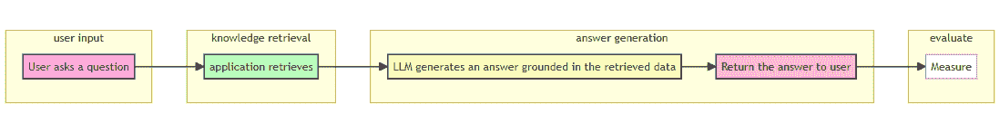
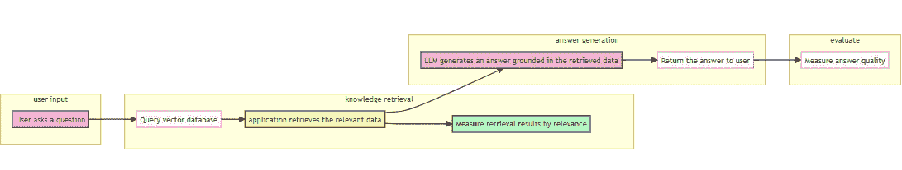
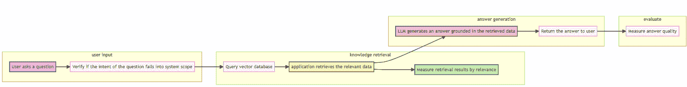

# 2024 年构建 LLM 应用我从中学到了什么？——第二部分

> [原文链接](https://towardsdatascience.com/what-did-i-learn-from-building-llm-applications-in-2024-part-2-86433ef437a7/)

构建 AI 应用的插图（作者提供 – 使用 DALLE-3 生成）

在本系列的[第一部分](https://towardsdatascience.com/what-did-i-learn-from-building-llm-applications-in-2024-part-1-d299b638773b)中，我们讨论了用例选择、组建团队以及在你基于 LLM 的产品开发旅程早期创建原型的重要性。让我们从这里继续——如果你对你的原型相当满意并准备向前推进，那么从规划开发方法开始。在早期阶段决定你的生产化策略也是至关重要的。

随着新模型和市场上的一些 SDK 的最近进展，很容易在早期阶段就有将*酷炫*功能如代理等加入到你的 LLM 应用中的冲动。让我们退一步，根据你的用例决定***必须具备和希望拥有的功能***。首先，识别出对应用程序实现主要商业目标至关重要的核心功能。例如，如果你的应用程序旨在提供客户支持，那么准确理解和响应用户查询的能力将是一个必须具备的功能。另一方面，个性化推荐等功能可能被视为未来扩展范围中的希望拥有的功能。

* * *

### 找到你的“契合点”

如果你想要从概念或原型开始构建你的解决方案，自上而下的设计模型可能效果最佳。在这种方法中，你从一个高级的概念设计开始，而不深入细节，然后分别开发每个单独的组件。这种设计可能一开始不会产生最佳结果，但它为你设置了一个迭代的方法，你可以在后续迭代中改进和评估应用程序的每个组件，并在后续迭代中测试端到端解决方案。

以这种设计方法的一个例子，我们可以考虑一个基于 RAG（检索增强生成）的应用。这些应用通常有 2 个高级组件——*检索组件（用于搜索和检索用户查询的相关文档）*和*生成组件（从检索到的文档中生成一个有根据的答案）*。

**场景：**构建一个有用的助手机器人，通过提供包含故障排除指南的技术知识库中的相关解决方案来诊断和解决技术问题。

**步骤 1 - 构建概念原型：**概述机器人的整体架构，而不深入细节。

+   **数据收集：** 从知识库中收集一个样本数据集，其中包含与您领域相关的问答。

+   **检索组件：** 实现一个基本的检索系统，使用简单的基于关键词的搜索，这可以在未来的迭代中发展成为更高级的**基于向量的搜索**。

+   **生成组件：** 在此组件中集成一个 LLM，并通过提示将检索结果传递给生成一个基于事实和上下文的答案。

+   **集成：** 将检索和生成组件结合起来，创建一个端到端流程。

+   **执行：** 确定运行每个组件的资源。例如，检索组件可以使用 Azure AI 搜索构建，它提供基于关键词和高级向量检索机制。Azure AI foundry 中的 LLM 可以用于生成组件。最后，创建一个应用程序以集成这些组件。

第一步（作者图片）

**步骤 2 – 改进检索组件：** 开始探索如何进一步改进每个组件。**对于基于 RAG 的解决方案，检索的质量必须特别高，以确保检索到最相关和准确的信息，这反过来又使得生成组件能够为最终用户提供上下文适当的响应。**

+   **设置数据摄取：** 设置一个数据管道将知识库摄取到您的检索组件中。此步骤还应考虑预处理数据以去除噪声、提取关键信息、图像处理等。

+   **使用向量数据库：** 升级到向量数据库以增强系统进行更多上下文检索。通过将文本分割成块并使用嵌入模型为每个块生成嵌入来进一步预处理数据。向量数据库应具备添加和删除数据以及使用向量进行查询的功能，以便易于集成。

+   **评估：** 检索结果中文档的选择和排序至关重要，因为它对解决方案的下一步有重大影响。虽然精确率和召回率可以给出搜索结果准确性的相当好的概念，但您还可以考虑使用**MRR（平均倒数排名）或 NDCG（归一化折现累积增益）**来评估检索结果中文档的排名。**上下文相关性**决定了文档块是否与生成用户输入的理想答案相关。

第二步（作者图片）

**步骤 3 – 增强生成组件以产生更相关和更好的输出：**

+   **意图过滤器：** 过滤掉不属于您知识库范围的问题。此步骤还可以用于阻止不受欢迎和冒犯性的提示。

+   **修改提示和上下文：** 改进你的提示，例如包括少量示例、清晰的指令、响应结构等，以根据你的需求调整 LLM 的输出。同时，在每个回合中向 LLM 提供对话历史，以保持用户聊天会话的上下文。如果你想让模型调用工具或函数，那么在提示中放入清晰的指令和注释。在实验阶段的每个迭代中对提示进行版本控制，以跟踪变化。这也有助于在系统发布后系统行为退化时进行回滚。

+   **捕捉模型的推理过程：** 一些应用使用额外的步骤来捕捉 LLM 生成的输出的背后的理由。当模型产生不可预测的输出时，这有助于检查。

+   **评估：** 对于基于 RAG 的系统产生的答案，重要的是衡量 a) 答案与检索组件提供的上下文的**事实一致性**，以及 b) **答案与查询的相关性**。在 MVP 阶段，我们通常使用少量输入进行测试。然而，在为生产开发时，我们应该在每个实验步骤中与从知识库中创建的广泛的**真实或黄金数据集**进行评估。如果真实数据可以包含尽可能多的现实世界示例（目标消费者经常提出的问题），那就更好了。如果你正在寻找实施评估框架，请查看[这里](https://gist.github.com/hshujuan/4ed8e76a3dc082075a4d97a11ed3bf20#file-chapter2_table10-md)。

步骤 3（作者图片）

**另一方面，** 让我们考虑另一个场景，即你在业务流程中集成 AI。**考虑一个在线零售公司呼叫中心的转录本，需要生成和添加到每周报告中的摘要和情感分析。**为了开发这个，首先理解现有的系统和 AI 试图填补的差距。接下来，开始设计低级组件，同时考虑到系统集成。这可以被认为是**自下而上的设计**，因为每个组件都可以单独开发，然后集成到最终系统中。

+   **数据收集和预处理：** 考虑到机密性和转录本中个人数据的存在，根据需要删除或匿名化数据。使用语音转文字模型将音频转换为文本。

+   **摘要：** 根据最终报告的需求，进行实验并选择提取式摘要（选择关键句子）和抽象式摘要（传达相同意义的新句子）。从简单的提示开始，并收集用户反馈以进一步提高生成摘要的准确性和相关性。

+   **情感分析：**使用特定领域的少量示例和提示调整来提高从转录中检测情感准确性。指导 LLM 提供推理可以帮助提高输出质量。

+   **报告生成：**使用报告工具如 Power BI 将先前组件的输出整合在一起。

+   **评估：**使用与 LLM 相关组件的指标相同的迭代评估过程。

这种设计也有助于在组件级别早期发现并解决问题，而无需改变整体设计。同时，它还促进了现有遗留系统中的 AI 驱动创新。

> LLM 应用开发不遵循一刀切的方法。大多数时候，有必要快速取得胜利来验证当前方法是否带来了价值或显示出满足预期的潜力。虽然从头开始构建新的 AI 原生系统听起来对未来更有希望，但另一方面，即使在小型业务流程中集成 AI 也能带来很多效率。选择其中任何一个取决于您组织的资源、采用 AI 的准备程度和长期愿景。考虑权衡并制定一个在该领域创造长期价值的现实策略是至关重要的。

* * *

### 通过自动化评估过程确保质量

提高基于 LLM 的应用成功率在于迭代评估应用结果的流程。这个过程通常从为您的用例选择相关指标和收集真实世界的示例以形成*真实或黄金*数据集开始。随着您的应用从 MVP 发展到产品，建议制定一个***CI/CE/CD（持续集成/持续评估/持续部署）***流程来标准化和自动化评估过程以及计算指标分数。这种自动化在最近一段时间也被称作**LLMOps**，源自 MLOps。像 PromptFlow、Vertex AI Studio、Langsmith 等工具提供了自动化评估过程的平台和 SDK。

**评估 LLMs 及其应用**并不相同

通常在 LLM 发布之前，会对其进行标准基准评估。然而，这并不能保证您的基于 LLM 的应用始终按预期表现。特别是基于 RAG 的系统，它使用文档检索和提示工程步骤来生成输出，应该针对特定领域、真实世界的数据集进行评估，以衡量其性能。

对于深入探讨各种用例的评估指标，我推荐这篇[文章](https://medium.com/data-science-at-microsoft/evaluating-llm-systems-metrics-challenges-and-best-practices-664ac25be7e5)。

* * *

### 如何选择合适的 LLM？

图片由作者提供 - 使用 DALLE-3 生成

几个因素驱动着产品团队做出这个决定。

1.  **模型能力**：根据您在 LLM 产品中解决的问题类型确定您的模型需求。例如，考虑以下两个用例 –

**#1** 在线零售商店的聊天机器人通过文本和图像处理产品咨询。具有多模态能力和较低延迟的模型应该能够处理工作量。

**#2** 另一方面，考虑一个开发者生产力解决方案，它需要一个模型来生成和调试代码片段，您需要一个具有高级推理能力并能产生高度准确输出的模型。

**2. 成本和许可**：价格取决于多个因素，例如模型复杂性、输入大小、输入类型和延迟要求。像 OpenAI 的模型这样的流行 LLM 按每 1M 或 1K 个标记的固定费用收费，这可能会随着使用量的增加而显著增长。具有高级逻辑推理能力的模型通常成本更高，例如 OpenAI 的 o1 模型每 1M 输入标记 15.00 美元，而 GPT-4o 的成本为每 1M 输入标记 2.50 美元。此外，如果您想销售您的 LLM 产品，请确保检查 LLM 的商业许可条款。某些模型可能对商业使用有限制或需要特定的许可。

**3. 上下文窗口长度**：对于模型需要一次性处理大量数据的用例，这变得至关重要。数据可以是文档摘录、对话历史、函数调用结果等。

**4. 速度**：例如，在线零售商店的聊天机器人需要快速生成输出，因此在这种情况下，具有较低延迟的模型至关重要。此外，用户体验改进，例如流式响应，通过分块渲染输出，从而为用户提供更好的体验。

**6. 与现有系统的集成**：确保 LLM 提供商可以无缝集成到您的现有系统中。这包括与 API、SDK 和其他您正在使用的工具的兼容性。

> 选择生产模型通常涉及权衡。在开发周期早期进行不同模型的实验，并不仅设置特定用例的评估指标，还要将性能和成本作为比较的基准非常重要。

* * *

### 负责任的 AI

伦理地使用大型语言模型（LLM）对于确保这些技术造福社会同时最小化潜在危害至关重要。产品团队必须在其 LLM 应用中优先考虑***透明度、公平性和问责制***。

**例如**，考虑一个在医疗设施中使用的基于 LLM 的系统，帮助医生更有效地诊断和治疗患者。该系统不得滥用患者的个人数据，例如病历、症状等。此外，应用程序的结果应具有透明度，任何建议背后的推理也应清晰。它不应对任何群体存在偏见或歧视。

在评估每次迭代的 LLM 驱动组件输出质量时，确保注意任何潜在的风险，如有害内容、偏见、仇恨言论等。**红队测试**，一个来自网络安全的理念，最近已成为一项最佳实践，用于揭示任何风险和漏洞。在此项练习中，红队人员试图通过使用各种提示策略来“欺骗”模型生成有害或不希望的内容。随后是对标记输出的自动和人工审查，以决定缓解策略。随着您的产品不断发展，在每个阶段，您都可以指示红队人员测试您的应用程序的不同 LLM 驱动组件，以及整个应用程序，以确保每个方面都得到覆盖。

* * *

### **为生产做好准备**

最后，LLM 应用是一个产品，我们可以在将其部署到生产环境之前，使用常见的原则进一步优化它。

1.  **日志记录和监控**可以帮助您捕获令牌使用情况、延迟、LLM 提供商方面的任何问题、应用性能等。您可以检查您产品的使用趋势，这可以提供有关 LLM 产品有效性的见解，包括使用高峰和成本管理。此外，设置对使用量异常激增的警报可以防止预算超支。通过分析使用模式和重复成本，您可以调整您的基础设施，并根据需要更改或更新模型配额。

1.  **缓存**可以存储 LLM 的输出，减少令牌的使用量，最终降低成本。缓存还有助于生成输出的一致性，并减少面向用户的应用的延迟。然而，由于 LLM 应用没有特定的输入集，在某些场景下，如聊天机器人，每个用户输入可能都需要缓存，即使预期的答案相同。这可能导致显著的存储开销。为了解决这个问题，引入了语义缓存的概念。**在语义缓存中，使用嵌入模型根据其意义将相似的提示输入分组在一起**。这种方法有助于更有效地管理缓存存储。

1.  **收集用户反馈**确保 AI 应用能够以更好的方式实现其目的。如果可能，尝试在每次迭代中从一组试点用户那里收集反馈，以便您可以判断产品是否满足预期，以及哪些领域需要进一步改进。例如，一个由 LLM 驱动的聊天机器人可以更新以支持更多语言，从而吸引更多多样化的用户。随着 LLMs 的新功能频繁发布，有大量的潜力快速提高功能和添加新特性。

* * *

### 结论

祝你在构建基于 LLM 的应用程序之旅中一切顺利！在这个领域有无数的创新和无限的可能性。组织正在采用具有广泛用例的生成式 AI。***与任何其他产品一样，在开发你的 AI 赋能应用程序时，要牢记商业目标。对于像聊天机器人这样的产品，最终用户的满意度是至关重要的。***拥抱挑战，如果今天某个特定场景没有成功，不要放弃，明天可以用不同的方法或新的模型来实现。***学习和跟上 AI 的进步是构建有效 AI 赋能产品的关键。***

*如果你想阅读更多关于新技术和新奇内容的内容，请关注我。如果你有任何反馈，请留下评论。谢谢 :)*
