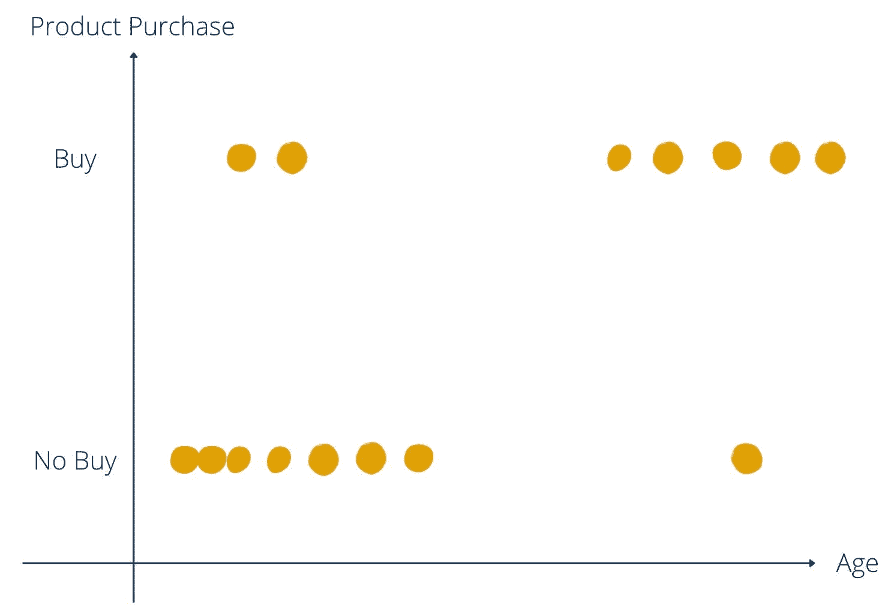
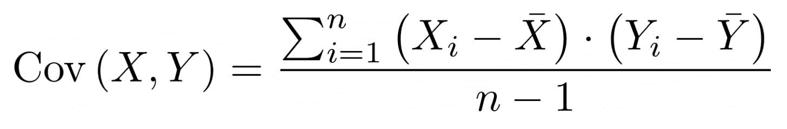
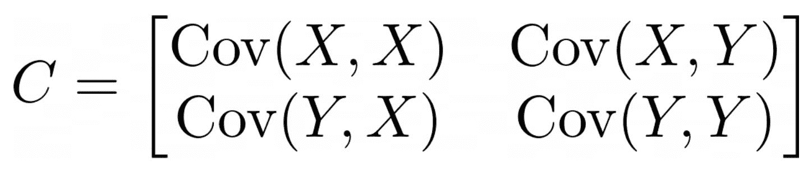
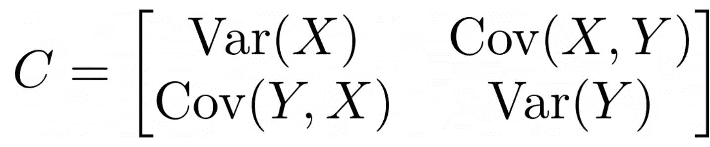
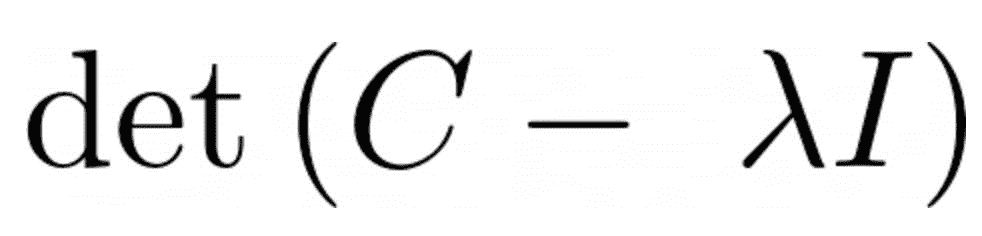
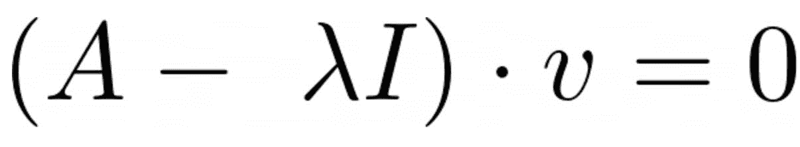
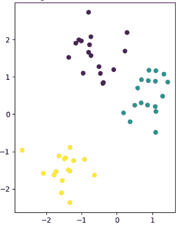
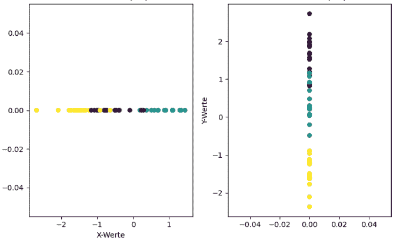
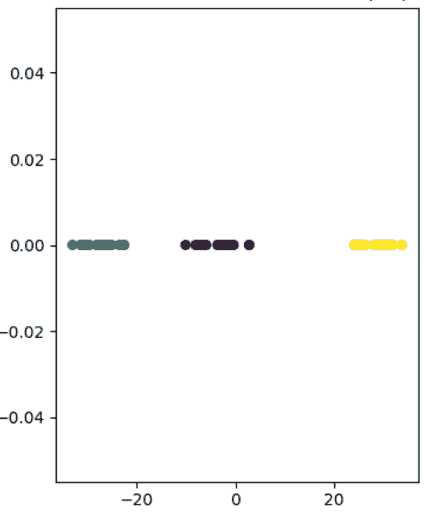

# 为什么数据科学家负担不起太多的维度以及他们可以做什么

> [原文链接](https://towardsdatascience.com/why-data-scientists-cant-afford-too-many-dimensions-and-what-they-can-do-about-it-653230d50f9c/)

由[Paulina Gasteiger](https://unsplash.com/@paulinagasteiger?utm_source=medium&utm_medium=referral)在[Unsplash](https://unsplash.com?utm_source=medium&utm_medium=referral)上的照片

维度降低是数据分析与机器学习领域的一个核心方法，它使得在尽可能保留数据集中信息的情况下减少数据的维度成为可能。这一步骤在训练前减少数据集的维度是必要的，以节省计算能力并避免过拟合的问题。

在本文中，我们详细探讨了维度降低及其目标。我们还展示了最常用的方法，并突出了维度降低的挑战。

## 什么是维度降低？

维度降低包括各种方法，旨在减少数据集中的特征和变量数量，同时保留其中的信息。换句话说，更少的维度应该能够以简化数据表示的方式呈现数据，而不会丢失数据中的模式和结构。这可以显著加速下游分析，并优化机器学习模型。

在许多应用中，由于数据集中变量数量众多，会出现问题，这被称为[维度诅咒](https://databasecamp.de/en/ml/curse-of-dimensionality-en)。例如，过多的维度可能导致以下问题：

+   **[过拟合](https://databasecamp.de/en/ml/overfitting-en)**：当机器学习模型过度依赖训练数据集的特征，因此只能对新、未见过的数据提供较差的结果时，这被称为过拟合。随着特征数量的增加，模型的复杂性也随之增加，因此对数据集中的错误适应过于强烈。

+   **计算复杂性**：需要处理许多变量的分析和模型通常需要更多的参数进行训练。这增加了计算复杂性，这反映在更长的训练时间或增加的资源消耗上。

+   **数据噪声**：随着变量数量的增加，错误数据或所谓的噪声的概率也会增加。这可能会影响分析并导致预测错误。

尽管具有许多特征的大数据集非常具有信息性和价值，但高维数也可能迅速导致问题。降维是一种试图在减少维度数量的同时保留数据集信息内容的方法。

## 什么是维度诅咒？

维度诅咒在高维数据集中发生，即那些具有大量属性或特征的数据集。起初，许多属性是好事，因为它们包含大量信息，并且很好地描述了数据点。例如，如果我们有一个关于人的数据集，属性可以是诸如发色、身高、体重、眼色等信息。

然而，从数学的角度来看，每个额外的属性意味着空间中的新维度，因此可能性显著增加。以下例子可以清楚地说明这一点，我们想要找出哪些客户购买了哪些产品。在第一步，我们只查看潜在客户的年龄以及他们是否购买了该产品。我们仍然可以在一个二维图中相对容易地表示这一点。

按年龄划分的买家图 | 来源：作者

一旦我们添加更多关于客户的信息，事情就会变得稍微复杂一些。关于客户收入的详细信息意味着在数值收入上映射的新轴。因此，二维图变成了三维图。额外的属性“性别”将导致第四维，依此类推。

在处理数据时，我们希望数据集中有大量的属性和信息，以便模型有更多机会识别数据中的结构。然而，这也可能导致严重的问题，正如维度诅咒这个名字所暗示的。

**数据稀疏性**

以下示例说明了许多属性可能存在的问题。由于维度数量众多，所谓的数据空间，即数据集可以取的值的数量，也相应增长。这可能导致所谓的“数据稀疏性”，即用于训练模型的训练数据集根本不包含某些值，或者只非常罕见地包含这些值。因此，模型对于这些边缘情况只能提供较差的结果。

让我们假设我们在例子中检查了 1,000 名客户，因为调查更多客户会花费太多时间，或者这些数据根本不可用。所有年龄段，从年轻到老年，都可能在这些客户中得到很好的代表。然而，如果添加了收入这一额外维度，那么像“年轻”和“高收入”或“老年”和“中等收入”这样的可能特征出现的可能性就会降低，并且需要有足够的数据点来支持。

**距离集中**

如果你想评估机器学习领域中不同数据集的相似性，通常会使用距离函数进行评估。最常用的聚类算法，如[k-means 聚类](https://databasecamp.de/en/ml/k-means-clustering)，依赖于计算点之间的距离，并根据其大小将它们分配到簇中。然而，在多维空间中，所有点可能都处于彼此相似的距离，这几乎使得分离它们变得不可能。

我们也熟悉这种日常生活中的现象。如果你拍摄两张物体的照片，比如两棵树，它们在图片中看起来可能非常接近，因为这只是二维图像。然而，在现实生活中，这些树可能相距几米，这一点只有在三维空间中才能变得清晰。

所有这些与许多维度相关的问题都概括为“维度诅咒”。

## 维度降低的目标是什么？

维度降低主要追求三个主要目标：提高模型性能、可视化数据以及提高处理速度。我们将在下一节中更详细地探讨这些内容。

**提高模型性能**

维度降低的主要目标之一是提高模型性能。通过减少数据集中的变量数量，可以使用更简单的模型，这反过来又降低了过度拟合的风险。

具有大量参数且因此高度复杂的模型往往会过度拟合训练数据集和数据中的噪声。因此，当面对不包含这种噪声的新数据时，模型提供的结果较差，而训练数据集的准确性非常好。这种现象被称为过度拟合。在维度降低过程中，从数据集中移除不重要的或冗余的特征，从而降低过度拟合的风险。因此，模型对新、未见数据提供更好的质量。

**数据可视化**

如果你想可视化具有许多特征的数据集，你将面临在二维或最多三维空间中映射所有这些信息的挑战。对于人类来说，任何超出这个范围的维度都不再是直接可感知的，但最容易的方法是将数据集中的每个特征分配一个单独的维度。因此，对于高维数据集，我们经常面临的问题是我们无法简单地可视化数据以获得对数据特性的初步了解，例如，识别是否存在异常值。

维度降低有助于将维度数量减少到可以在二维或三维空间中进行可视化的程度。这使得更好地理解变量之间的关系和数据结构变得更加容易。

**提高处理速度**

计算时间和必要的资源在项目实施中起着重要作用，尤其是在机器学习和深度学习算法中。通常，只有有限的资源可用，这些资源应该被优化使用。通过在早期阶段从数据集中移除冗余特征，你不仅可以在数据准备阶段节省时间和计算能力，在模型训练阶段也是如此，而且无需接受较低的性能。

此外，降维使得可以使用更简单的模型，这些模型不仅在进行初始训练时需要更少的能量，而且在操作期间的计算速度也更快。这是一个重要因素，尤其是在实时计算中。

总体而言，降维是提高数据分析效率和构建更稳健的机器学习模型的重要方法。它也是数据可视化的重要步骤。

## 哪些方法用于降维？

在实践中，已经建立了各种降维方法，以下详细解释了其中三种。根据应用和数据结构，这些方法已经覆盖了广泛的范围，可以用于大多数实际问题。

### 主成分分析

[主成分分析（PCA）](https://databasecamp.de/en/statistics/principal-component-analysis-en) 假设数据集中的一些变量可能测量的是同一件事，即它们是相关的。这些不同的维度可以数学上组合成所谓的主成分，而不会损害数据集的重要性。例如，一个人的鞋码和身高通常相关，因此可以用一个共同维度来代替，以减少输入变量的数量。

主成分分析描述了一种数学计算这些成分的方法。以下两个关键概念是这一方法的中心：

**协方差矩阵**是一个指定数据空间中两个不同维度之间成对协方差矩阵。它是一个方阵，即它有与列数相同的行数。对于任何两个维度，协方差按以下方式计算：

在这里 *n* 代表数据集中数据点的数量，_X*i* 是第 *i*- 个数据点 *X* 维度的值，X̅ 是所有 *n* 个数据点 *X* 维度的平均值。从公式中可以看出，两个维度之间的协方差不依赖于维度的顺序，因此以下适用 *COV(X,Y) = COV(Y,X)*。这些值导致以下协方差矩阵 *C* 对于两个维度 *X* 和 *Y*：

两个相同维度的协方差简单地是该维度的方差，即：

协方差矩阵是主成分分析中的第一步重要步骤。一旦创建了此矩阵，就可以从中计算出**特征值**和**特征向量**。从数学上讲，以下方程用于求解特征值：

在这里 *λ* 是期望的特征值，*I* 是与协方差矩阵 *C* 同大小的单位矩阵。当这个方程被求解时，可以得到一个或多个矩阵的特征值。它们代表了矩阵在相关特征向量方向上的线性变换。因此，对于每个特征值，也可以计算出一个相关的特征向量，需要解以下略微修改的方程：

其中 *v* 是期望的特征向量，根据它必须相应地求解方程。在协方差矩阵的情况下，特征值对应于特征向量的方差，它反过来又代表了一个主成分。因此，每个特征向量是数据集不同维度的混合，即主成分。因此，相应的特征值表明特征向量解释了数据集多少的方差。这个值越高，主成分就越重要，因为它包含了数据集中大量信息。

因此，在计算了特征值之后，它们按大小排序，并选择具有最高值的特征值。然后计算相应的特征向量，并用作主成分。这导致降维，因为只使用主成分而不是数据集的各个特征来训练模型。

### t 分布随机邻域嵌入 (t-SNE)

[t 分布随机邻域嵌入](https://databasecamp.de/en/statistics/tsne-en)，简称 t-SNE，通过尝试创建一个新空间，尽可能采用数据点从高维空间到新空间的距离，以不同的方式处理降维问题。以下示例清楚地说明了这一基本思想。

在尽可能保留数据集信息的情况下，将高维数据集转换为低维数据集并不容易。以下图展示了一个简单的二维数据集，总共有 50 个数据点。可以识别出三个不同的簇，它们彼此之间也很好地分离。黄色簇距离其他两个簇最远，而紫色和蓝色数据点彼此更近。

t-SNE 的二维数据 | 来源：作者

目前的目标是把这个二维数据集转换成低维，即一维。实现这一目标的最简单方法就是只通过数据的 X 或 Y 坐标来表示数据。

通过 X 或 Y 坐标进行降维 | 来源：作者

然而，很明显，这种简单的转换已经丢失了数据集中大部分信息，并且与原始二维数据呈现的图像不同。如果只使用 X 坐标，看起来黄色和紫色簇重叠，并且三个簇彼此之间的大致距离相等。另一方面，如果只使用 Y 坐标进行降维，黄色簇与其他簇的分离度更好，但看起来紫色和蓝色簇重叠。

t-SNE 的基本思想是将高维度的距离尽可能转移到低维度。为此，它使用随机方法，并将点之间的距离转换为概率，表示两个随机点相邻的可能性有多大。

更确切地说，这是一个条件概率，表示一个点选择另一个点作为邻居的可能性有多大。因此得名“随机邻域嵌入”。

根据 t-SNE 进行降维 | 来源：作者

如您所见，这种方法导致的结果要好得多，三个不同的簇可以清楚地相互区分。很明显，黄色数据点与其他数据点之间的距离显著更远，而蓝色和紫色簇则相对更靠近。为了更好地理解这种方法的具体细节，欢迎您阅读我们关于这个主题的详细[文章](https://databasecamp.de/en/statistics/tsne-en)。

> [**精通 t-SNE：Python 中理解和实现的全面指南**](https://towardsdatascience.com/mastering-t-sne-a-comprehensive-guide-to-understanding-and-implementation-in-python-480929bfe6f4)

### 线性判别分析

线性判别分析（简称 LDA）旨在通过将数据投影到更小的维度来识别和最大化类之间的可分性。与其他方法不同，它特别强调最大化类之间的可分性，因此在分类任务中尤为重要。

计算了两个核心关键参数：

+   **类内散布**：这个关键参数衡量数据集中一个类内的变异性。这个值越低，类内的数据点越相似，类之间的分离度越高。

+   **类间散度**：这种散度反过来衡量的是类之间均值之间的变异性。这个值应该尽可能大，因为这表明类之间更容易相互分离。

简而言之，这些关键数字被用来形成矩阵并计算它们的特征值。对于最大特征值的特征向量反过来是新的特征空间中的维度，这个特征空间的维度比原始数据集少。然后所有数据点都可以投影到特征向量上，这降低了维度。

线性判别分析特别适合于已知类并且数据也清晰标记的应用。它使用来自监督学习的类信息来找到一个尽可能将类分开的低维空间。

LDA 的一个缺点是，降维到维度的最大程度是有限的，并且取决于类的数量。因此，具有（n）个类的数据集可以降低到最多（n-1）个维度。具体来说，这意味着，例如，具有三个不同类的数据集可以降低到二维空间。

这种降维方法也特别适合于大数据集，因为计算工作量适中，并且与数据量很好地缩放，因此即使在大数据量下，计算工作量也能保持在有限范围内。

## 什么是降维的挑战？

降维是数据预处理的重要步骤，旨在提高机器学习模型的泛化能力和模型性能，并可能节省计算能力。然而，这些方法也带来了一些在使用前应该考虑的挑战。这些包括

+   **信息丢失**：虽然所提出的方法试图保留尽可能多的方差，即数据集的信息内容，但在降维时不可避免地会丢失一些信息。重要的数据也可能丢失，这可能导致分析或模型结果较差。因此，得到的模型可能不够准确或不够强大。

+   **可解释性**：大多数用于降维的算法提供的是一个不再包含原始维度的低维空间，而是它们的一个数学摘要。例如，主成分分析使用的是特征向量，这是数据集中各种维度的摘要。因此，可解释性在一定程度上会丢失，因为之前的维度更容易测量和可视化。特别是在透明度很重要且结果需要实际解释的使用案例中，这可能是一个决定性的缺点。

+   **缩放**：执行减维计算密集且耗时，尤其是对于大数据集来说。然而，在实时应用中，这种时间是不够的，因为模型的计算时间也加到了这个时间上。特别是计算密集型模型，如 t-SNE 或自动编码器，由于预测时间过长，很快就会失效。

+   **选择方法**：根据应用的不同，所提出的减维方法各有其优缺点。因此，选择合适的算法起着至关重要的作用，因为它对结果有重大影响。没有一种万能的解决方案，必须始终根据应用情况做出新的决策。

减维具有许多优点，并且在许多应用中是数据预处理的一个组成部分。然而，必须考虑到所提到的缺点和挑战，以训练一个高效的模型。

## 这是你应该带在身边的

+   减维是一种减少数据集中维度（即变量）数量的方法，同时尽可能保留信息内容。

+   在有众多输入变量的情况下，会出现所谓的维度诅咒。这导致数据稀疏或距离集中的问题。

+   减维通常会导致在训练机器学习模型时过拟合的概率降低、可视化效果更好以及计算能力优化。

+   最常见的减维方法包括主成分分析、t-SNE 和 LDA。

+   然而，减维也有其缺点，例如可解释性较差或信息丢失。
